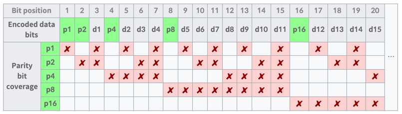
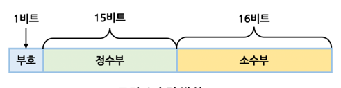
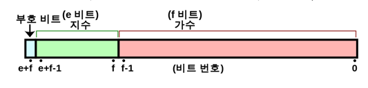
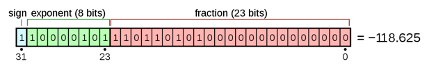

# 📌 패리티 비트와 해밍
***
### ☝️ 패리티 비트(검출)
- 데이터 전달 과정에서 오류가 있는지 검사하기 위해 추가하는 비트.
- 홀수 패리티 비트와 짝수 패리티 비트가 있으며, 홀수 패리티 비트는 1의 수가 홀수가 되도록 비트를 추가하는 것을 말한다.
> 예시
> - 7비트 데이터 1010000이 존재한다면 홀수 패리티 에서는 11010000(맨 앞에 추가),    
> 짝수 패리티에서는 1010000이 된다. (1011000 이었다면 11011000)
> - 0개도 짝수개로 취급한다.

- 짝수, 홀수 패리티에 맞지 않게 데이터가 도착하면 오류가 있음 알 수 있다. 그러나 회복하는 방법은 아님.

### ✏️ 해밍 코드
- 데이터 전송시 1비트의 오류를 탐지할 수 있는 자기 오류정정 코드.
- 패리티 비트로 검출된 오류를 회복


- #### 비트 그룹 생성 규칙.
   
이미지 출처: en.wikipedia.org

- 생성 규칙에 맞게 비트 그룹을 생성 하여 짝수, 홀수 패리티를 구분하면 오류가 발생한 비트의 위치를 알 수 있다.
- 짝수 패리티면 0, 홀수 패리티면 1.
- 그룹 결과가 0101 이면 5번째 비트에 오류가 발생하였음을 뜻한다.

> 짝수 패리티의 해밍 코드가 0011011 일 때 오류를 회복하였을 때의 원래 코드는?     
> p1: 1,3,5,7 번째 비트 이므로 0101 -> 짝수 패리티 -> 0     
> p2: 2,3,6,7 이므로  0111 -> 1     
> p4: 3,4,5,6 이므로 1101 -> 1    
> 역순으로 읽으면 110 이므로 6번째 비트를 수정한다. 0011011 -> 0011001     


# 📌 부동 소수점
***
> 컴퓨터에서 실수를 표한하는 방식에는 고정 소수점과 부동 소수점 방식이 있다.

### ☝️ 고정 소수점
   
이미지 출처: https://madplay.github.io/post/the-need-for-bigdecimal-in-java
- 소수점이 찍힐 자리가 미리 정해 놓고 소수를 표기한다.
- 정수부 + 소수부 로 표기되며 표현할 수 있는 범위가 작아 잘 사용하지 않는다.
- 오차가 존재하지 않는다.

* 소수부의 이진수 변환
```
1. 소수부에 2를 곱한다. 정수부가 발생하면 1, 발생하지 않으면 0.
2. 1을 반복.

0.75 -> 1.5 -> 1
0.5 -> 1 -> 1
= 11
```

### ✏️ 부동 소수점
    
이미지 출처: https://ko.wikipedia.org/wiki/%EB%B6%80%EB%8F%99%EC%86%8C%EC%88%98%EC%A0%90

- 실수를 가수부 + 지수부로 표기한다.
- 가수: 실수의 실제 값 표현.
- 지수: 크기를 표현. 가수의 어디쯤에 소수점이 있는지를 표현.
- 오차가 존재한다.
- float : 1비트 부호(양수 0, 음수 1), 8 비트 지수, 23 비트 가수.
- double: 2배 정밀도, 1비트 부호, 11 비트 지수, 52 비트 가수.


> −118.62을 IEEE 754 (32비트 단정밀도)로의 표현.
> - 음수이므로 부호비트는 1
> - 118.62를 이진수로 나타내면 1110110.101
> - 이진수에서 소숫점을 왼쪽으로 옮겨 1만 남게한다 -> 1.110110101 로 6번의 이동.
> - 즉, 1110110.101 -> 1.110110101 * 2^6
> - 지수부는 6이고 가수부는 110110101이 되었다.
> - 지수부는 IEEE 754 형식에 따라 127의 bias를 더해준다 -> 133 -> 10000101
> - 가수부는 23비트를 맞춰준다 -> 11011010100000000000000     
> 결과
> 
> 
