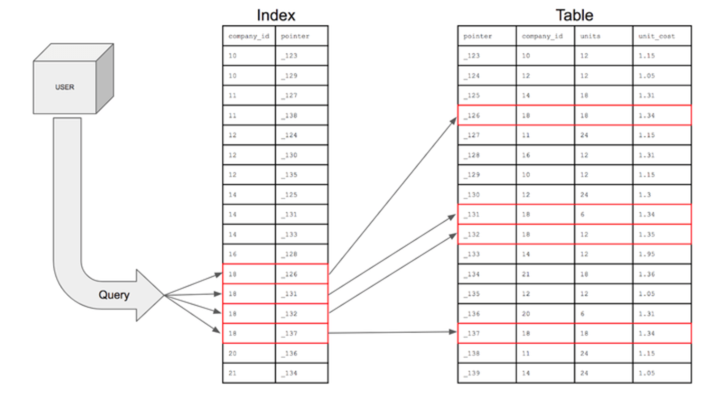
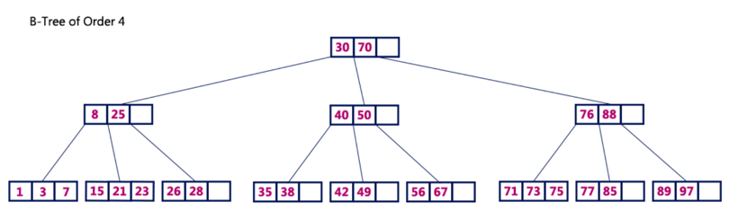
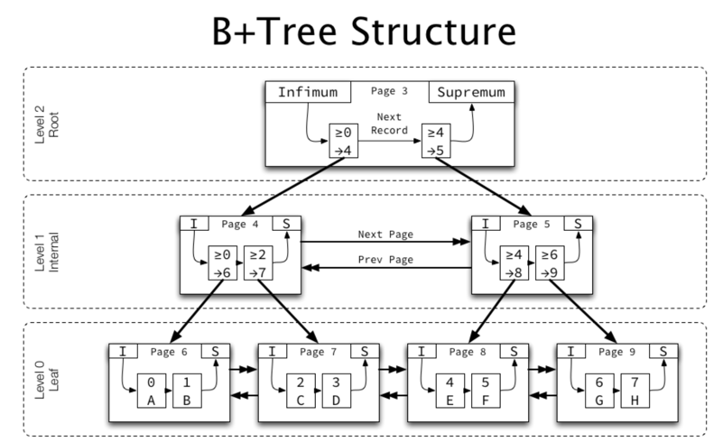

# 📌 Index
***

### 🧐 인덱스란?
         
이미지 출처: https://mangkyu.tistory.com/96   

인덱스는 데이터베이스에서 지정한 컬럼을 기준으로 메모리 영역에 목차를 생성한다고 이해하면 쉽다. 즉, 조회의 속도를 향상시키기 위해 사용된다.
인덱스를 통해 찾고자 하는 데이터를 찾은 후 해당 데이터에서 실제 물리 메모리 주소를 얻어, 실제 디스크에 접근한다.

하지만 "메모리 영역"에 저장하기 때문에 DB 용량의 약 10%를 추가적으로 필요로 한다. 또한 항상 정렬된 상태를 유지해야 하기 때문에
삽입, 삭제, 수정시 추가적인 비용이 필요하게 된다. 또한 인덱스가 너무 많다면 새로운 데이터를 추가할 때마다 인덱스를 추가해야 하기 때문에 성능을 저하시킨다.

- INSERT: 신규 데이터에 대한 인덱스 추가.
- DELETE: 삭제되는 데이터의 인덱스를 마크에 사용하지 않도록 함.
- UPDATE: 기존의 인덱스를 마크하고, 갱신된 데이터에 대해 인덱스를 추가.

### ☝️ 인덱스를 사용하기 좋은 경우.
- 규모가 큰 테이블
- INSERT, UPDATE, DELETE가 자주 발생하지 않는 컬럼(자주 발생하면 인덱스의 크기가 커져 성능이 저하된다.)
- 데이터의 중복도가 낮은 컬럼.(카디널리티가 높은) - 여러개의 컬럼으로 구성한다면 카디널리티가 높은 순에서 낮은 순으로.
- WHERE 절, JOIN, Order By 에 자주 사용되는 컬럼.
- 외래키가 사용되는 컬럼.

### ☝️ 인덱스 테이블의 생성
- 테이블 생성시 PK가 지정되었다면 PK를 기준으로 인덱스 테이블이 생성된다.
- 다른 컬럼으로 인덱스 테이블을 생성하고 싶다면 직접 명시하여 생성.
 ```sql
ALTER TABLE table_name ADD INDEX index_name (col1, col2..)
```

인덱스의 탐색은 B-Tree의 경우 Root - Branch - Leaf -> 디스크 저장소 순으로 진행된다. 때문에 꼭 Leaf 노드까지 오지 않아도 되기 때문에
찾는데이터가 Root에 가깝게 있을수록 탐색속도가 빠르다. 디스크에서 읽을때는 메모리에서 읽을 때에 비해 훨씬 성능이 떨어진다 때문에 인덱스의 성능은
얼마나 디스크 접근을 줄이냐. Root ~ Leaf의 오고가는 횟수를 얼마나 줄이냐에 달려있다.

인덱스의 컬럼이 여러개라면 뒤의 컬럼은 앞의 컬럼에 의존해서 정렬된다. 예를들어 이름과 전화번호 순서로 인덱스 컬럼을 지정하였다면.
이름이 같은 경우에만 전화번호를 비교하게 된다.

MySQL의 InnoDB에서는 디스크에 데이터를 저장하는 기본 단위를 페이지라고 하며, 인덱스 또한 마찬가지로 관리된다.
페이지의 크기는 16KB로 고정되어 있기 때문에 인덱스 키의 크기(key_len)에 따라 한 페이지에 저장될 수 있는 데이터의 수가 달라진다.
때문에 인덱스 키가 길어질 수록 성능상 이슈가 발생한다.

### ☝️ 인덱스 사용시 주의할 점.
- 인덱스의 컬럼을 모두 조회조건으로 사용해야만 인덱스가 사용되는 것은 아니다. 하지만 인덱스의 컬럼중 가장 첫 번째 컬럼은 반드시 포함되어야 한다.
첫 번째 컬럼이 포함되지 않으면 인덱스를 타지 않는다.

- between, like, 부등호 등의 범위 조건은 명시된 컬럼은 인덱스를 타지만, 그 뒤의 인덱스 컬럼들은 인덱스가 사용되지 않는다.(=,in은 모두 사용)
- and 연산은 row를 줄이지만 | 연산은 비교할 row를 증가시키기 때문에 인덱스를 타지 않고 풀 스캔이 발생할 수도 있다. 꼭 확인하고 사용.
- 인덱스 컬럼 값을 그대로 사용해야 한다. 예를 들면 col > 100  은 인덱스를 타지만 col*5 > 500 은 인덱스를 타지 않는다. 

## 🧐️ 인덱스 자료구조

### ☝️ 해시 테이블
- (key, value)로 데이터를 저장, 빠른 검색(O(1))
- 그러나 등호에 대해서만 검색이 가능하기 때문에 제한적으로 사용이 가능하여 잘 사용하지 않는다.(Range Scan이 불가능.)

### ☝️ B-Tree
     
출처: http://www.btechsmartclass.com/data_structures/b-trees.html

B-Tree는 균형있는 트리이며 이진 트리와 달리 한 노드에서 여러개의 데이터를 가질 수 있다. 한 노드의 키의 수가 n개라면 자식은 n+1개를 가지게 된다.
최대 M개의 자식을 가질 수 있는 B-Tree를 M차 B-Tree라고 한다. 노드에서 키들의 대소관계를 이용하여 데이터를 탐색한다.

### ☝️ B+Tree
#### - InnoDB에 사용된 B+Tree
      
이미지 출처: https://mangkyu.tistory.com/96

- DB에서는 B-Tree에서 리프노드에만 데이터를 저장하도록 변경한 B+Tree를 주로 사용한다.
- 모든 리프노드는 LinkedList로 연결되어 있어 이를 통해 순차탐색도 가능하다.
- 리프노드를 제외한 노드에는 데이터를 담지 않기 떄문에 메모리를 더 확보함으로써 한 노드에 더 많은 키를 담을 수 있다. 이는 트리의 높이가
낮아지는 효과가 있고, 결과적으로 성능에 영향을 준다.


  

### 🧐 왜 B-Tree를 사용하나?
탐색시간이 O(log n)인 알고리즘은 많다. 그런데 왜 데이터베이스에서는 B-Tree를 사용할까? 일단 가장 탐색 속도가 빠른 자료구조로는
해시 테이블이 있다. 해시 테이블은 해시 값을 이용해 충돌을 제외하면 O(1)의 시간 복잡도를 가진다. 그러나 해시 테이블은 값이 정렬되어 있지 않기 때문에
데이터베이스에서 자주 다루게 되는 부등호 연산(<,>= ..)등을 사용할 수 없다.

그렇다면 다른 O(log n)이 걸리는 자료구조도 있는데 왜 B-Tree를 사용했을까. 예를 들면 B-Tree와 똑같은 밸런스 트리인 레드-블랙 트리가 있다.
이유를 알기 위해서는 두 자료구조의 차이에 집중할 필요가 있다. 가장 큰 차이라면 B-Tree에서는 한 노드에 여러개의 데이터를 저장할 수 있다는 것이다.

#### 🤔 그게 그렇게 큰 장점인가?
그렇게 큰 장점이다. 한 노드에 여러개의 데이터가 존재한다는 것은 한번의 접근으로 여러개의 데이터를 탐색할 수 있다는 말이다.
즉 포인터값으로 접근할 필요없이 마치 배열처럼 다음 조소로 인덱스의 접근이 가능하다. 때문에 포인터로 접근하며 실제 메모리상의 주소를 연산하는 과정이 빠지게 되고,
결과적으로 레드-블랙 트리보다 탐색 속도가 빠르다고 볼 수 있다.

결론적으로 항상 정렬된 상태를 유지하기 때문에 부등호 연산도 가능하며, 참조 포인터가 적어 빠른 메모리 접근이 가능하다.
마지막으로 데이터의 저장,수정, 삭제시에도 O(lon n)의 시간복잡도를 가지기 때문에 B-Tree가 데이터베이스용 인덱스로 가장 적합한 자료구조라고 할 수 있겠다. 


> https://jojoldu.tistory.com/243       
> https://helloinyong.tistory.com/296    