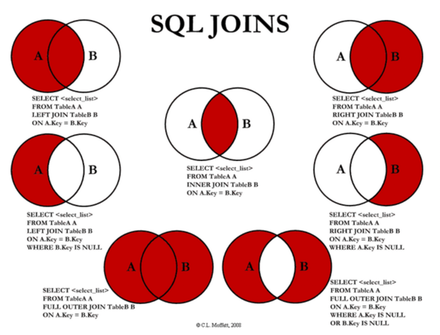
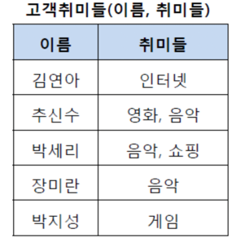
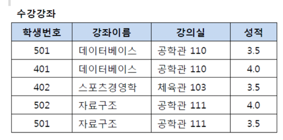
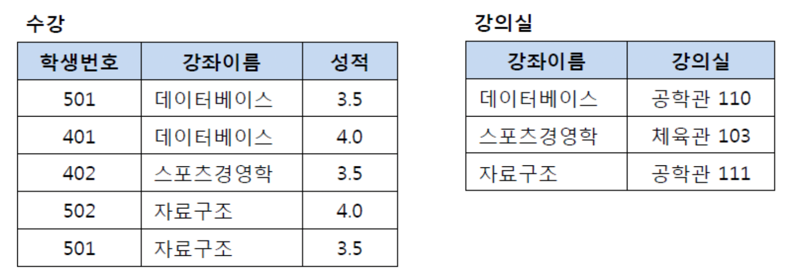
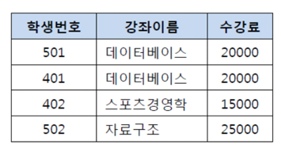
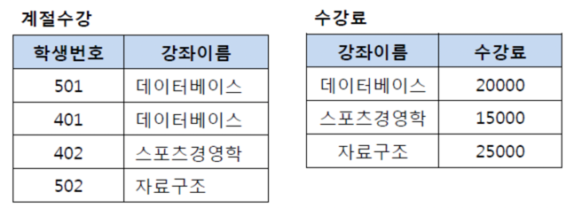
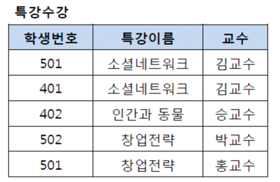
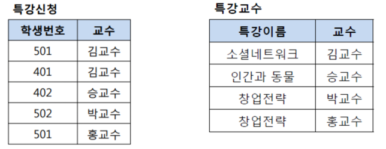

# 📌 Key
****
### ☝️ 기본키(PK:Primary Key)
- 후보키 중에 선택한 메인 키.
- NotNull, Unique

### ☝️ 후보키(Candidate Key)
- 데이터를 유일하게 식별하기 위해 사용하는 속성들 부분 집합.
- 후보키중에서 기본키를 선택한다.
- 조건
  - 하나의 투플을 유일하게 식별
  - 꼭 필요한 최소 속성으로만 구성.

### ☝️ 대체키(Alternate Key)
- 후보키중 기본키를 제외한 나머지, 보조키.

### ☝️ 수퍼키(Super Key)
- 유일하지만 최소성을 만족시키지 못하는 키.

### ☝️ 외래키(Foreign Key)
- 다른 릴레이션의 기본키를 그대로 참조하는 집합.


# 📌 Join
****
- 데이터의 중복을 피하기 위해(3NF를 만족시키기 위해) 데이터를 나누어 저장한다.
- 이렇게 분해되어 있는 정보를 다시 조합하여 원하는 결과를 도출하기 위해 Join을 사용한다.
- 즉, Join은 컬럼을 기준으로 행을 합쳐주는 연산.

## 🧐 조인의 종류



### ☝️ 내부 조인(Inner Join)
> - 교차 조인(Cross Join)
> - 동등 조인(Equi Join)
> - 비등가 조인(Non-Equi Join)
> - 자연 조인(Natural Join)

- #### ✏️ 교차 조인
    - 두 테이블의 카티션 프로덕트(곱집합)의 결과.
    - 즉 각 테이블의 모든 컬럼의 조합.
    > A(a,b), B(c,d) -> AxB(ac,ad,bc,bd)
    ```sql
    --  명시적
    FROM A CROSS JOIN B;
    
    -- 묵시적
    FROM A,B
    ```

- #### ✏️ 내부 조인
    - 가장 많이 사용되는 조인중 하나. 교집합(교차 조인 후 조건에 부합하는 부분.)
    ```sql
    -- 명시적
    FROM A INNER JOIN B
        ON A.team_id = B.team_id
    
    -- 묵시적
    FROM A,B
    WHERE  A.team_id = B.team_id
    ```

- #### ✏️ 등가 조인
    - 조건문에서 동등비교를 하는 조인. (내부 조인의 예시와 같이)

- #### ✏️ 비등가 조인
    - 동등비교를 사용하지 않는 조인
    - betweeb, 크다, 작다 등 사용.

- #### ✏️ 자연 조인
    - 동등 조인의 한 유형.
    - 두 테이블의 컬럼명이 같을 때 이것을 기준으로 조인.(team_id)
    - 해당 컬럼은 한번만 나타나게 된다.


### ☝️ 외부 조인.
> - Left Outer Join
> - Right Outer Join
> - Full Outer Join(MySQL에서는 지원하지 않는다. UNION으로 사용.)

- #### ✏️ Left Outer Join
    ```sql
    FROM A
        LEFT OUTER JOIN B
        ON A.team_id = B.team_id
    ```
    - 위의 상황일 때 A의 모든 데이터와 B가 매칭되는 레코드.
    - 매칭되지 않은 로우의 B 컬럼은 null 이 된다.
    ```
    | a   team_id  |   | b   team_id  |
    | a1     1     |   | b1     1     |
    | a2     2     |   | b2     2     |
    | a3     3     |   | b3     5     |
    ```
    - 위와같이 데이터가 주어져있다면
    - 왼쪽 외부 조인 이후에는
    ```
    | a   team_id   b   team_id  |
    | a1     1      b1     1     |
    | a2     2      b2     2     |
    | a3     3     null  null    |
    ```
    이 된다.
    
    - Right Outer Join 은 반대로 B의 모든 테이블에 A를 매치한다.
    - Full Outer Join 은 A B의 데이터가 모두 나타나고 마찬가지로 매치되지 않는 데이터는 null이 된다.
    

### ☝️️ 셀프 조인
- 말 그대로 자기 자신과 조인.
```sql
FROM table AS A, table AS B
WHERE A.id <> B.id
AND A.team_id = B.team_id
```
- 자신과 다른 아이디를 가진 데이터 중에서 team_id가 같은 데이터를 조인.

### ☝️ 세미 조인
- 서브 쿼리 내에서 존재하는 데이터를 메인 쿼리에서 추출.
- EXISTS, IN 절 등을 사용할 수 있다.


# 📌 정규화(Normarlization)
이미지 출처 : https://mangkyu.tistory.com/110
***
> - 테이블 간 중복된 데이터를 허용하지 않아 무결성 유지.
> - 이상현상 방지
> - 데이블 구성을 논리적, 직관적으로
> - 확장에 용이.


## 🧐 제 1 정규화(1NF)
> - 테이블 컬럼이 원자값을 갖도록 테이블을 분리.
- 모든 도메인이 원자값으로 구성.
- 모든 속성에는 반복되는 그룹이 없어야 한다.
- 기본키를 사용하여 데이터의 고유한 식별 가능.

     
- 위으 이미지에서는 취미들 컬럼에 여러개의 데이터가 들어가 있기 때문에 모든 도메인이
원자 값을 갖는다는 조건을 만족하지 못한다.
- 컬럼을 취미로 변경하고 추신수-영화, 추신수-음악 과 같이 분리하여 1NF를 만족시킬 수 있다.

## 🧐 제 2 정규화(2NF)
> - 기본키의 부분집합이 다른 컬럼을 결정해서는 안된다.


- 위의 표에서는 (학생 번호,강좌 이름)이 복합키로 기본키가 된다.
- 그러나 강좌 이름이 강의실 컬럼을 결정하기 때문에 2NF에 위배된다.


- 때문에 2NF를 만족시키기 위해서는 이를 분리해야 한다.

## 🧐 제 3 정규화(3NF)
> - 제 2 정규화를 만족하는 상태에서 이행적 종속을 없애기 위해 분리.
>   - *이행적 종속: A->B, B->C 이면 A-C 이다.
> - 즉, 기본키가 아닌 속성들은 기본키에 의존해야 한다.(기본키에 의해서만 결정)

- 위의 이미지에서 학생번호는 강좌이름을 결정하고, 강좌 이름은 수강료를 결정하므로 이행적 종속성이 존재한다.

- 테이블을 분리하여 이행적 종속성을 제거한다.


## 🧐 BCNF 정규화
> - 3NF를 만족하고, 모든 결정자가 후보키가 되어야 한다.

- 위의 이미지에서 (학생번호,특강이름)은 기본키로 교수를 결정한다.
- 또한 교수는 특강이름을 결정하는 결정자이다. 하지만 교수는 후보키가 아니다. 때문에 BCNF를 위배한다.


- 또는 특강신청 테이블에서 컬럼은 학생번호, 특강이름이 되어도 된다.

# 📌 트랜잭션(Transaction)
***
- 데이터베이스의 상태를 변화시키기 위해 사용하는 작업 단위.

### ☝️ 트랜잭션의 특징
- #### ✏️ 원자성(Atomicity)
  - 트랜잭션이 DB에 모두 반영되거나(commit) 모두 반영되지 않아야(Rollback) 한다.(일부만 반영 불가능)

- #### ✏️ 일관성(Consistency)
  - 트랙잭션의 동일한 작업 처리 결과는 항상 같아야 한다.

- #### ✏️ 독립성(Isolation)
  - 둘 이상의 트랜잭션이 동시해 병행 실행되어도 서로에게 영향을 주지 않아야 한다.
  - 다른 트랜잭션에 끼어들 수 없다.

- #### ✏️ 지속성(Durability)
  - 트랜잭션이 성공적으로 완료되었다면 결과는 영구적으로 반영(저장)되어야 한다.
  
#### 🖍 Commit: 하나의 트랜잭션이 성공적으로 끝나 DB가 일관성 있는 상태임을 알려줌.
#### 🖍 Rollback: 트랜잭션 처리가 비정상적으로 종료, 원자성이 깨졌을 때 발생.


## 🧐 DBMS의 Transaction 관리.
- Database Management System
- 크게 질의 처리기(Query Processor), 저장 시스템(Storage System)으로 나뉜다.
- 고정 길이의 page 단위로 disk 에서 읽고 쓴다.

- Buffer Manager: Buffer 관리 정책에 따라 Undo,Redo 결정.

### ☝️ Undo
- Transaction 이 정상적으로 종료되지 않은(commit 되지 않은) page들을 원래대로 돌려놓게 되는데 이를 Undo라고 한다.
  
> - 즉 Update 쿼리에서 set n = n + 1을 수행하고 있었다면 Undo에서는 set n= n-1을 수행하여 쿼리를 실행하기 이전으로 복원한다. 

- 이 때 2개의 정책이 존재하는데
  - steal 정책은 수정된 페이지를 언제든지 디스크 쓸 수 있다. 대부분의 DBMS가 채택하고 있는 정책이다.
    Undo logging과 복구를 필요로 한다.
  - not steal 정책은 반대로 수정된 페이지들을 트랜잭션이 끝나기 전까지 버퍼에 유지한다.
    Undo 작업이 필요 없지만 매우 큰 메모리 버퍼를 필요로 한다.
    

### ☝️ Redo
- 이미 Commit한 트랜잭션의 수정을 재 반영하는 복구 작업.

- 2개의 Buffer 관리 정책
  - FORCE: 수정 했던 모든 페이지를 Commit 시점에 디스크에 기록. Redo 필요없음.
  - Not FORCE: 디스크에 반영하지 않음. Redo가 필요, Redo logging, 대부분의 DBMS의 정책.
  

## 🧐 트랙잭션 격리 수준(Isolation Level)
> - 트랜잭션에서 일관성 없는 데이터를 허용하는 수준.

- 데이터베이스는 트랜잭션이 독립적으로 수행되도록 한다, 하지만 무조건 Locking을 통해
수 많은 트랜잭션이 순차적으로 수행되게 한다면 성능이 떨어진다. 하지만 Locking의 범위를 무분별하게 줄인다면
잘못된 처리가 증가할 것이다.
  
### ☝️ Read Uncommitted(Level 0)
- 트랜잭션에 아직 처리중인(commit 되지 않은) 데이터를 다른 트랜잭션이 읽는 것을 허용한다.(Dirty Read)
- 데이터베이스의 일관성이 깨지게 된다.
  - A에서 변경한 데이터를 B가 읽었는데 Rollback되는 경우 등.

### ☝️ Read Committed(Level 1)
- 트랜잭션이 작업 수행중일 때 다른 트랜잭션이 접근할 수 없어 대기한다.
- Commit 된 트랜잭션에만 접근 가능하다.
- SQL 서버가 Default 로 사용하는 격리 레벨.
  
- 항상 같은 결과를 반환해야한다는 정합성에 어긋난다(Non-Repeatable Read)
  - 트랜잭션 A에서 데이터 N을 조회 -> 10
  - 트랜잭션 B에서 데이터 N을 11로 변경.
  - 트랜잭션 A에서 데이터 N을 조회 -> 11


### ☝️ Repeatable Read(Level 2)
> - 트랜잭션이 시작되기 전에 커밋된 내용에 대해서만 조회 가능.(Undo 테이블에서 가져온다.)
> (MySQL에서는 트랜잭션에 번호를 부여하고, 자신보다 번호가 낮은 트랜잭션이 변경한 것만 읽게한다. )
- 트랜잭션 범위 내에서 조회한 데이터의 일관성 보장.

- Phantom Read: 보이지 않았던 투플이 갑자기 나타나는 현상이 발생한다.(다른 트랜잭션에서 Insert를 실행하는 경우.)

### ☝️️ Serializable(Level 3)
> - 트랜잭션이 완료될 때 까지 읽기 작업 또한 Lock을 건다.
- 다른 트랜잭션의 접근이 불가능.
- 동시 처리 속도가 떨어진다.


# 📌 Index
***
     
이미지 출처: https://mangkyu.tistory.com/96
- 데이터베이스에서 테이블의 검색 속도를 향상시키기 위한 색인 구조.
- Index 테이블에서 찾아낸 row_id(DB내부에서 자동으로 생성)을 통해 데이터를 탐색할 수 있다.
- index 를 항상 최신 정렬 상태로 유지해야 한다. 때문에 각 연산마다 추가 작업이 발생한다.
  - INSERT: 신규 데이터에 대한 인덱스 추가.
  - DELETE: 삭제되는 데이터의 인덱스를 마크에 사용하지 않도록 함.
  - UPDATE: 기존의 인덱스를 마크하고, 갱신된 데이터에 대해 인덱스를 추가.

> - 인덱스는 조회하는 속도를 향상시킬 수 있지만 추가적인 저장 공간이 필요하다(DB의 약 10%)
> - 인덱스를 잘못 사용할 경우 오히려 성능이 저하될 수 있다.
> (B+트리에서 많은양의 데이터를 조회한다면 차라리 순차적으로 가져오는 것이 성능이 더 좋다.)


### ☝️ 인덱스를 사용하기 좋은 경우.
- 규모가 큰 테이블
- INSERT, UPDATE, DELETE가 자주 발생하지 않는 컬럼(자주 발생하면 인덱스의 크기가 커져 성능이 저하된다.)
- 데이터의 중복도가 낮은 컬럼.
- WHERE 절, JOIN 에 자주 사용되는 컬럼.
- 외래키가 사용되는 컬럼.

### ☝️ 인덱스 테이블의 생성
- 테이블 생성시 PK가 지정되었다면 PK를 기준으로 인덱스 테이블이 생성된다.
- 다른 컬럼으로 인덱스 테이블을 생성하고 싶다면 직접 명시하여 생성.


## 🧐️ 인덱스 자료구조

### ☝️ 해시 테이블
- (key, value)로 데이터를 저장, 빠른 검색( O(1) )
- 그러나 등호에 대해서만 검색이 가능하기 때문에 제한적으로 사용이 가능하여 잘 사용하지 않는다.

### ✏️ B+Tree
#### - InnoDB에 사용된 B+Tree

이미지 출처: https://mangkyu.tistory.com/96

- DB에서는 B-Tree에서 리프노드에만 데이터를 저장하도록 변경한 B+Tree를 주로 사용한다.
- 모든 리프노드는 LinkedList로 연결되어 있어 이를 통해 순차탐색도 가능하다.


