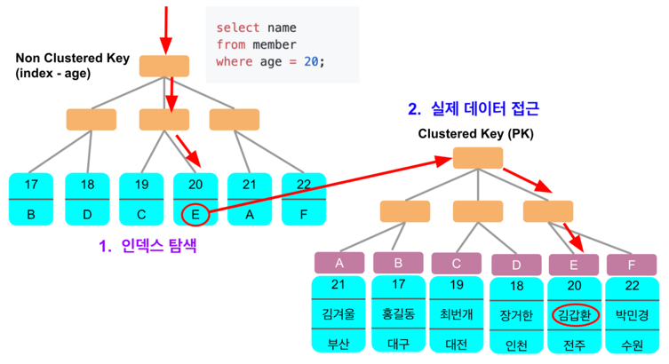

# 📌 Join
****
- 데이터의 중복을 피하기 위해(3NF를 만족시키기 위해) 데이터를 나누어 저장한다.
- 이렇게 분해되어 있는 정보를 다시 조합하여 원하는 결과를 도출하기 위해 Join을 사용한다.
- 즉, Join은 컬럼을 기준으로 행을 합쳐주는 연산.

## 🧐 조인의 종류



### ☝️ 내부 조인(Inner Join)
> - 교차 조인(Cross Join)
> - 동등 조인(Equi Join)
> - 비등가 조인(Non-Equi Join)
> - 자연 조인(Natural Join)

- #### ✏️ 교차 조인
    - 두 테이블의 카티션 프로덕트(곱집합)의 결과.
    - 즉 각 테이블의 모든 컬럼의 조합.
    > A(a,b), B(c,d) -> AxB(ac,ad,bc,bd)
    ```sql
    --  명시적
    FROM A CROSS JOIN B;
    
    -- 묵시적
    FROM A,B
    ```

- #### ✏️ 내부 조인
    - 가장 많이 사용되는 조인중 하나. 교집합(교차 조인 후 조건에 부합하는 부분.)
    ```sql
    -- 명시적
    FROM A INNER JOIN B
        ON A.team_id = B.team_id
    
    -- 묵시적
    FROM A,B
    WHERE  A.team_id = B.team_id
    ```

- #### ✏️ 등가 조인
    - 조건문에서 동등비교를 하는 조인. (내부 조인의 예시와 같이)

- #### ✏️ 비등가 조인
    - 동등비교를 사용하지 않는 조인
    - betweeb, 크다, 작다 등 사용.

- #### ✏️ 자연 조인
    - 동등 조인의 한 유형.
    - 두 테이블의 컬럼명이 같을 때 이것을 기준으로 조인.(team_id)
    - 해당 컬럼은 한번만 나타나게 된다.


### ☝️ 외부 조인.
> - Left Outer Join
> - Right Outer Join
> - Full Outer Join(MySQL에서는 지원하지 않는다. UNION으로 사용.)

- #### ✏️ Left Outer Join
    ```sql
    FROM A
        LEFT OUTER JOIN B
        ON A.team_id = B.team_id
    ```
    - 위의 상황일 때 A의 모든 데이터와 B가 매칭되는 레코드.
    - 매칭되지 않은 로우의 B 컬럼은 null 이 된다.
    ```
    | a   team_id  |   | b   team_id  |
    | a1     1     |   | b1     1     |
    | a2     2     |   | b2     2     |
    | a3     3     |   | b3     5     |
    ```
    - 위와같이 데이터가 주어져있다면
    - 왼쪽 외부 조인 이후에는
    ```
    | a   team_id   b   team_id  |
    | a1     1      b1     1     |
    | a2     2      b2     2     |
    | a3     3     null  null    |
    ```
    이 된다.
    
    - Right Outer Join 은 반대로 B의 모든 테이블에 A를 매치한다.
    - Full Outer Join 은 A B의 데이터가 모두 나타나고 마찬가지로 매치되지 않는 데이터는 null이 된다.
    

### ☝️️ 셀프 조인
- 말 그대로 자기 자신과 조인.
```sql
FROM table AS A, table AS B
WHERE A.id <> B.id
AND A.team_id = B.team_id
```
- 자신과 다른 아이디를 가진 데이터 중에서 team_id가 같은 데이터를 조인.

### ☝️ 세미 조인
- 서브 쿼리 내에서 존재하는 데이터를 메인 쿼리에서 추출.
- EXISTS, IN 절 등을 사용할 수 있다.
