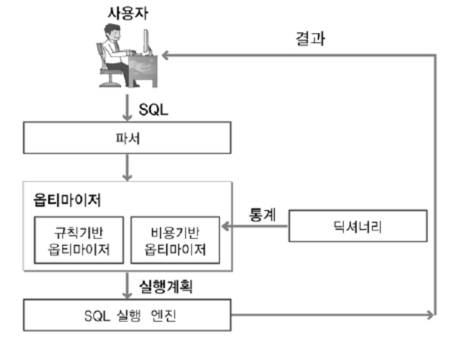
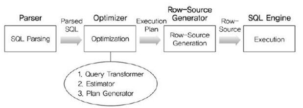
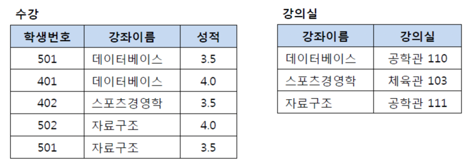
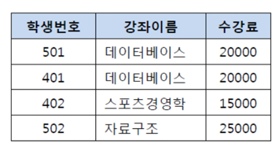
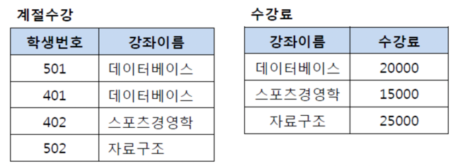
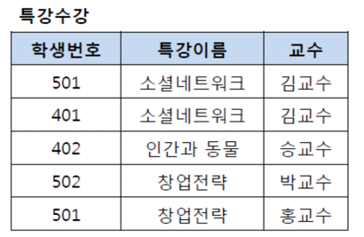
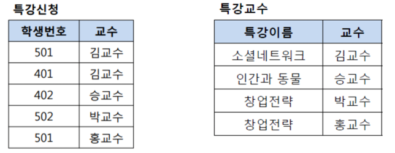

# 📌 Key
****
### ☝️ 기본키(PK:Primary Key)
- 후보키 중에 선택한 메인 키.
- NotNull, Unique

### ☝️ 후보키(Candidate Key)
- 데이터를 유일하게 식별하기 위해 사용하는 속성들 부분 집합.
- 후보키중에서 기본키를 선택한다.
- 조건
  - 하나의 투플을 유일하게 식별
  - 꼭 필요한 최소 속성으로만 구성.

### ☝️ 대체키(Alternate Key)
- 후보키중 기본키를 제외한 나머지, 보조키.

### ☝️ 수퍼키(Super Key)
- 유일하지만 최소성을 만족시키지 못하는 키.

### ☝️ 외래키(Foreign Key)
- 다른 릴레이션의 기본키를 그대로 참조하는 집합.


# 📌 Join
****
- 데이터의 중복을 피하기 위해(3NF를 만족시키기 위해) 데이터를 나누어 저장한다.
- 이렇게 분해되어 있는 정보를 다시 조합하여 원하는 결과를 도출하기 위해 Join을 사용한다.
- 즉, Join은 컬럼을 기준으로 행을 합쳐주는 연산.

## 🧐 조인의 종류


### ☝️ 내부 조인(Inner Join)
> - 교차 조인(Cross Join)
> - 동등 조인(Equi Join)
> - 비등가 조인(Non-Equi Join)
> - 자연 조인(Natural Join)

- #### ✏️ 교차 조인
    - 두 테이블의 카티션 프로덕트(곱집합)의 결과.
    - 즉 각 테이블의 모든 컬럼의 조합.
    > A(a,b), B(c,d) -> AxB(ac,ad,bc,bd)
    ```sql
    --  명시적
    FROM A CROSS JOIN B;
    
    -- 묵시적
    FROM A,B
    ```

- #### ✏️ 내부 조인
    - 가장 많이 사용되는 조인중 하나. 교집합(교차 조인 후 조건에 부합하는 부분.)
    ```sql
    -- 명시적
    FROM A INNER JOIN B
        ON A.team_id = B.team_id
    
    -- 묵시적
    FROM A,B
    WHERE  A.team_id = B.team_id
    ```

- #### ✏️ 등가 조인
    - 조건문에서 동등비교를 하는 조인. (내부 조인의 예시와 같이)

- #### ✏️ 비등가 조인
    - 동등비교를 사용하지 않는 조인
    - betweeb, 크다, 작다 등 사용.

- #### ✏️ 자연 조인
    - 동등 조인의 한 유형.
    - 두 테이블의 컬럼명이 같을 때 이것을 기준으로 조인.(team_id)
    - 해당 컬럼은 한번만 나타나게 된다.


### ☝️ 외부 조인.
> - Left Outer Join
> - Right Outer Join
> - Full Outer Join(MySQL에서는 지원하지 않는다. UNION으로 사용.)

- #### ✏️ Left Outer Join
    ```sql
    FROM A
        LEFT OUTER JOIN B
        ON A.team_id = B.team_id
    ```
    - 위의 상황일 때 A의 모든 데이터와 B가 매칭되는 레코드.
    - 매칭되지 않은 로우의 B 컬럼은 null 이 된다.
    ```
    | a   team_id  |   | b   team_id  |
    | a1     1     |   | b1     1     |
    | a2     2     |   | b2     2     |
    | a3     3     |   | b3     5     |
    ```
    - 위와같이 데이터가 주어져있다면
    - 왼쪽 외부 조인 이후에는
    ```
    | a   team_id   b   team_id  |
    | a1     1      b1     1     |
    | a2     2      b2     2     |
    | a3     3     null  null    |
    ```
    이 된다.
    
    - Right Outer Join 은 반대로 B의 모든 테이블에 A를 매치한다.
    - Full Outer Join 은 A B의 데이터가 모두 나타나고 마찬가지로 매치되지 않는 데이터는 null이 된다.
    

### ☝️️ 셀프 조인
- 말 그대로 자기 자신과 조인.
```sql
FROM table AS A, table AS B
WHERE A.id <> B.id
AND A.team_id = B.team_id
```
- 자신과 다른 아이디를 가진 데이터 중에서 team_id가 같은 데이터를 조인.

### ☝️ 세미 조인
- 서브 쿼리 내에서 존재하는 데이터를 메인 쿼리에서 추출.
- EXISTS, IN 절 등을 사용할 수 있다.


# 📌 정규화(Normarlization)
이미지 출처 : https://mangkyu.tistory.com/110
***
> - 테이블 간 중복된 데이터를 허용하지 않아 무결성 유지.
> - 이상현상 방지
> - 데이블 구성을 논리적, 직관적으로
> - 확장에 용이.


## 🧐 제 1 정규화(1NF)
> - 테이블 컬럼이 원자값을 갖도록 테이블을 분리.
- 모든 도메인이 원자값으로 구성.
- 모든 속성에는 반복되는 그룹이 없어야 한다.
- 기본키를 사용하여 데이터의 고유한 식별 가능.

     
- 위으 이미지에서는 취미들 컬럼에 여러개의 데이터가 들어가 있기 때문에 모든 도메인이
원자 값을 갖는다는 조건을 만족하지 못한다.
- 컬럼을 취미로 변경하고 추신수-영화, 추신수-음악 과 같이 분리하여 1NF를 만족시킬 수 있다.

## 🧐 제 2 정규화(2NF)
> - 기본키의 부분집합이 다른 컬럼을 결정해서는 안된다.


- 위의 표에서는 (학생 번호,강좌 이름)이 복합키로 기본키가 된다.
- 그러나 강좌 이름이 강의실 컬럼을 결정하기 때문에 2NF에 위배된다.


- 때문에 2NF를 만족시키기 위해서는 이를 분리해야 한다.

## 🧐 제 3 정규화(3NF)
> - 제 2 정규화를 만족하는 상태에서 이행적 종속을 없애기 위해 분리.
>   - *이행적 종속: A->B, B->C 이면 A-C 이다.
> - 즉, 기본키가 아닌 속성들은 기본키에 의존해야 한다.(기본키에 의해서만 결정)

- 위의 이미지에서 학생번호는 강좌이름을 결정하고, 강좌 이름은 수강료를 결정하므로 이행적 종속성이 존재한다.

- 테이블을 분리하여 이행적 종속성을 제거한다.


## 🧐 BCNF 정규화
> - 3NF를 만족하고, 모든 결정자가 후보키가 되어야 한다.

- 위의 이미지에서 (학생번호,특강이름)은 기본키로 교수를 결정한다.
- 또한 교수는 특강이름을 결정하는 결정자이다. 하지만 교수는 후보키가 아니다. 때문에 BCNF를 위배한다.


- 또는 특강신청 테이블에서 컬럼은 학생번호, 특강이름이 되어도 된다.


