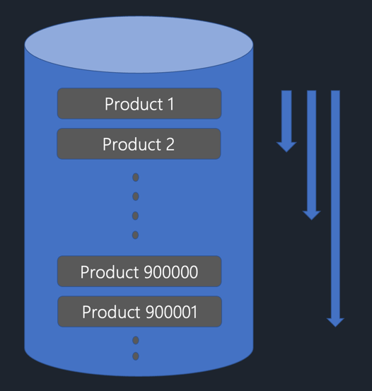
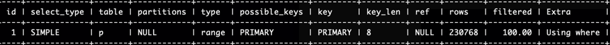

# 📌 페이징 최적화

대용량의 데이터를 한번에 불러오기엔 많은 부담이간다. 때문에 일반적인 웹 서비스에서는 흔히 페이징을 이용하여 일부 데이터만을 로드하게 된다.
하지만 데이터가 증가함에 따라 페이징의 기능이 점점 느려지게 되는 경험을 할 수 있다.

## 🧐 No Offset으로 변경하기.
SNS나 블로그에서 스크롤하면 새로운 페이지가 나타나거나 [더 보기]와 같은 버튼을 클릭하여 다음 페이지로만 넘어갈 수 있는 경우를 보았을 것이다.
이러한 방법을 No Offset 방식이라고 한다.


   
기존의 페이징에서는 Limit 와 Offset을 이용하여 페이지 데이터를 읽는다. 하지만 이러한 방식은 위의 이미지와 같은 문제를 야기한다.
90만번째 데이터부터 20개를 읽어오고 싶다고 가정하자. 이 때 Limit와 Offset을 이용한 쿼리를 작성하게 되면 offset이 0일 때보다
90만일때 훨씬 느린속도로 데이터를 읽어오는 것을 확인할 수 있다. 이는 이러한 쿼리에서는 항상 첫번째 데이터부터 순차적으로 읽어오며 접근하기 때문이다.
결국 필요없는 데이터를 읽는 양이 페이지의 뒤로 갈수록 점점 많아져 성능이 저하된다.

No Offset 방식에서는 이것을 해결하기 위해 조회의 시작부분을 인덱스로 빠르게 찾아 매번 첫 페이지만 읽도록 한다. 즉 매번 이전 페이지 전체를
건너 뛸 수 있음을 의미한다.

```sql
SELECT *
FROM product p 
WHERE p.id > 900000 --마지막 조회 ID
ORDER BY p.id DESC
LIMIT 20
```
와 같이 쿼리가 작성된다. 

실제로 실행계획을 보면 기본키인 id를 키로 인덱스를 탄것을 확인할 수 있다.
시간 또한 100만건의 데이터를 기준으로 0.16초에서 0.0초로 감소했다. 조금 더 많은 데이터를 넣었다면 얼마나 감소했는지 더 정확하게 알 수 있었을 텐데 아쉽다.
하지만 이 결과로도 성능의 차이가 많이남을 확인할 수 있다.

부등호의 방향과 desc, asc는 조회하고자 하는 데이터의 순서에 따라 결정하면 된다.   
where절에서 마지막으로 조회한 ID가 필요하기 때문에 쿼리는 동적으로 작성되어야 한다. QueryDSL을 사용한다면 BooleanExpression 사용해서 동적 쿼리를 작성하도록 하자.
null을 반환하면 Where 조건문에서 자동으로 제거되게 된다.

```java
private BooleanExpression ltBookId(Long id) {
    if (id == null) {
        return null; 
    }
    return product.id.gt(bookId);
}
```

### 🔑 한계
- 더 보기 버튼과 같은 방식이 아닌 [1 2 3 4 5]로 페이지가 표시되어 1페이지에서 바로 5페이지로 이동하는 경우에는 사용할 수 없다.


## 🧐 커버링 인덱스를 이용한 페이징 최적화
- 커버링 인덱스란 모든 컬럼이 Index 컬럼에 포함되는 경우 즉, 인덱스의 조회만으로 쿼리를 완성할 수 있는 경우를 말한다.

그러나 Select * 과 같은 경우에는 어떻게 해야하나? 라는 문제가 생긴다. 모든 컬럼으로 Index를 생성하기에는 너무 많은 컬럼이 Index에 포함되기 때문이다.
때문에 아래와 같이 쿼리를 작성하게 된다.
```sql
SELECT *
FROM product p
JOIN (SELECT id
        FROM product
        WHERE 조건
        ORDER BY id ASC 
        OFFSET page_number
        LIMIT page_size) temp on temp.id = p.id
```
JOIN 에 있는 서브 쿼리에서 모든 컬럼이 인덱스 컬럼으로만 이루어지게 하여 커버링 인덱스를 사용하여 나온 결과와 JOIN하여 최종 결과를 얻는다.
인덱스를 통해 빠르게 데이터를 걸러내고, 걸러진 로우에 대해서만 디스크 접근이 이루어지면 되기 때문에 빠르다.

QueryDSL을 사용한다면 서브 쿼리를 먼저 Fetch하여 id 리스트를 얻어오고, 최종적으로는 where 절에서 id 리스스틀 IN 절을 이용하여 원하는 결과를 얻어오게 된다.
QueryDSL에서는 빈 리스트가 IN절에 들어가게 되면 오류가 발생하므로 서브쿼리의 결과가 없을 경우에는 최종결과로 빈 리스트를 반환하도록 하여
오류를 방지하고, 불필요한 쿼리의 발생을 막도록 하자.
```java
List<Long> ids = query
                .select(product.id)
                .from(product)
                .where(//조건)
                .orderBy(product.id.desc())
                .limit(pageSize)
                .offset(pageNumber * pageSize)
                .fetch();

if (CollectionUtils.isEmpty(ids)) {
    return new ArrayList<>();
}

return queryFactory
        .select(Projections.fields(ProductDto.class,
                product.id.,
                product.name))
        .from(product)
        .where(product.id.in(ids))
        .orderBy(product.id.desc())
        .fetch();
```

🔑 한계
- 결국 서브 쿼리에 있는 모든 항목이 인덱스 컬럼에 포함되어야 하기 때문에 너무 많은 인덱스가 필요하다.
- 인덱스의 크기가 커진다.
- 데이터의 양이 많아지고, 페이지 번호가 뒤로 갈 수록 No Offset 방식보다는 느려진다.


<br><br><br>
> https://jojoldu.tistory.com/528?category=637935    
> https://jojoldu.tistory.com/529?category=637935    