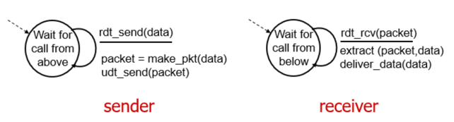
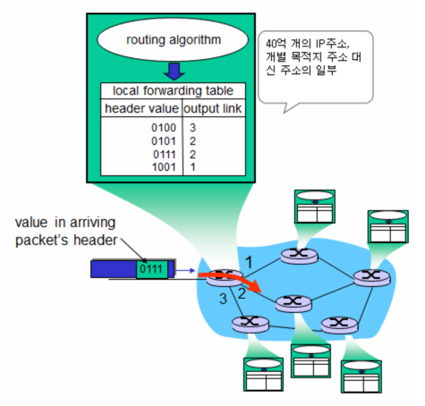
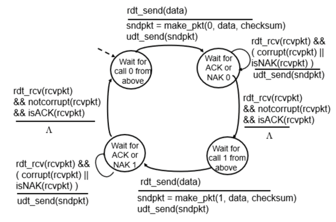
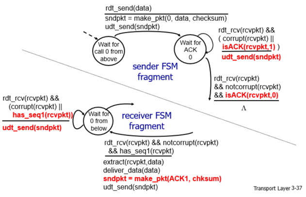
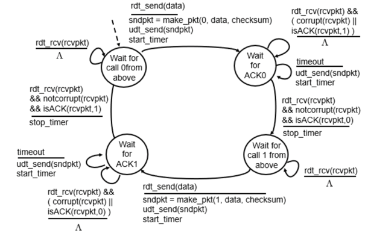
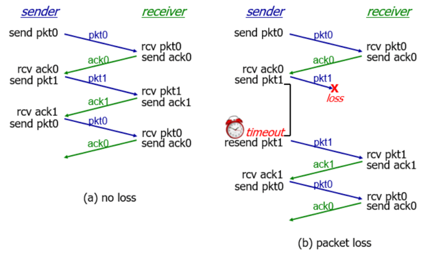
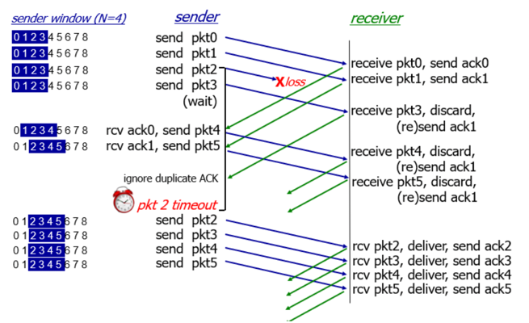
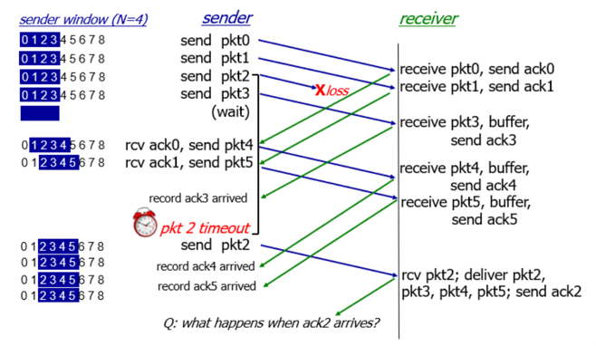
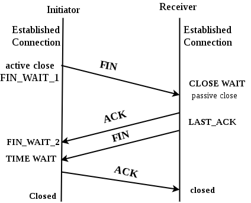
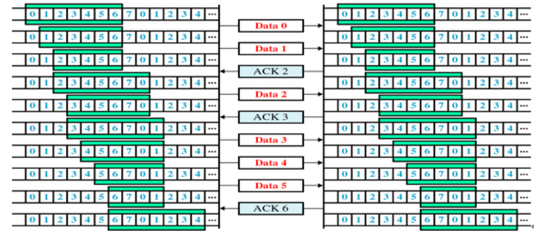

# 📌 OSI 7계층
***
> - 통신이 일어나는 과정을 단계별로 파악 가능.
> - 문제가 생기면 해당 계층만 수정할 수 있다.

- ### 7. Application Layer(응용 계층)
  - HTTP, DNS, FTP 등 
  - 최종 목적지, 종단 계층으로 일반적인 응용 프로세스 수행.
  - 사용자 인터페이스, 데이터베이스 등을 관리.

- ### 6. Presentation Layer(표현 계층)
  - 데이터 전송에 대한 표현, 암호화 등을 담당한다.
  - 파일 인코딩, 명령어 포장, 압축, 암호화
    
- ### 5. Session Layer
  - 데이터가 통신하기 위한 논리적 연결을 담당한다.  
  - TCP / IP 세션의 생성과 제거의 책임.
    
- ### 4. Transport Layer(전송 계층)
  - 애플리케이션 간의 논리적 통신. 종단 시스템에서 구현 되며 애플리케이션으로 부터 메시지를 받아
    패킷(세그먼트)로 변환한 후 네트워크 계층으로 전달한다.
  - TCP, UDP 프로토콜을 이용하여 통신을 활성화 한다.
  - 포트를 열고 프로그램들이 전송할 수 있도록 한다.
    (소켓을 통해 어플리케이션에 전달, 소켓은 포트 번호를 가진다.)
  
  > - 다중화(Multiplexing): 송신 측에서 데이터를 세그먼트로 분할하고, 각각에 헤더정보를 추가, 네트워크 계층으로 전달하는 과정.
  > - 역 다중화(DeMultiplexing): 수신 측에서 트랜스포트 계층 세그먼트를 올바른 소켓으로 전달하는 작업.(세그먼트는 소켓을 가르키는 필드가 존재한다.)

- ### 3. Network Layer(네트워크 계층)
  - 데이터를 목적지까지 전송
  - 라우터를 통해 이동할 경로를 탐색, IP 주소를 지정.
  - 라우팅, 흐름 제어, 오류 제어, 세그멘테이션 수행.
    
- ### 2. Data Link
  - 물리 계층으로 송, 수신되는 데이터를 안전하게 전달되도록 도와줌.
  - 프레임에 Mac 주소를 할당하고, 흐름 제어, 오류 제어, 재전송 등을 진행.
    
- ### 1. Physical(물리 계층)
  - 데이터를 전기적 신호로 주고받는 공간.

# 📌 UDP
***
> User Datagram Protocol
- TCP와 달리 비연결성, 비신뢰성
- 그러나 속도가 빠르다. 실시간 방송, 온라인 게임 등에서 사용.
- 512byte의 크기 제한.
- 목적지를  목적지 IP, Port 번호로 구분한다.

### ☝️ CheckSum
- CheckSum을 이용하여 전달받은 패킷의 비트 변경사항을 검사하여 오류를 검출한다.
```
1. 16비트 단위로 변경.
2. 1의 보수를 취함.
3. 수신측에서 데이터 + checksum 을 수행 했을 때 오류가 없다면 모든 비트가 1.
그렇지 않다면 오류가 있는 패킷이다.
```

# 📌 신뢰적 데이터 전송 프로토콜(RDT:Reliable Data transfer Protocol)
***
> 이미지 출처:https://m.blog.naver.com/sjc02183/221674651644
### ☝️ RDT 1.0

- 완전히 신뢰적인 채널 상에서의 신뢰적 데이터 전송. 비트 오류가 존재하지 않는다고 가정한다.
- rdt_send 는 상위 계층으로부터 데이터를 받아 패킷을 생성한 후 전송한다.
- rdt_rcv 는 하위 계층에서 패킷을 수신하고 데이터를 추출하여 상위 계층으로 전달한다.

### ☝️ RDT 2.0

- 패킷의 비트가 손상될 수 있음을 가정하는 모델.
- 수신자가 송신자에게 긍정(ACK),부정(NAK) 응답을 보낸다.(1bit)
- 오류 검출: 수신자는 checksum을 이용하여 패킷의 손상을 판단한다.
- 송신자는 응답이 오기 전까지는 새로운 패킷을 전송하지 않는다.
  NAK 응답이 온다면 이전 패킷을 재전송 하고, ACK 응답이 온다면 다음 패킷을 전송한다.
- 전송 후 대기(stop-and-wait )프로토콜 이라고도 부른다.

### ☝️ RDT 2.1

- ACK와 NAK 응답 자체도 손상이 발생할 수 있음을 가정한다.
- ACK 가 손상되어 NAK로 들어가게 된다면 중복된 패킷이 하나더 전송될 것이고, NAK가 ACK로 전달 된다면
패킷 하나가 손실되게 된다.
- 패킷이 순서 번호를 가진다. 이를 가지고 수신측은 해당 패킷이 새로운 패킷인지, 재전송된 패킷인지를 구분한다. 

### ☝️ RDT 2.2

- 부정 수신 응답인 NAK를 삭제한다, 대신 몇 번 패킷 까지가 정상적으로 수신 되었는지를 담아 구분한다.

### ☝️ RDT 3.0

- 손실을 빠르게 회복하는 것은 매우 중요하다. 그러나 재전송을 위해 ACK 응답을 기다리는 것은 시간적으로 낭비를 불러일으킨다.


- ACK를 무한정 기다리지 않고 타이머를 두어 일정 시간을 기다리다가 TimeOut이 발생하면 패킷을 재전송 한다.

## ✏️ 파이프라인된 신뢰적 전송 프로토콜 (Pipelined RDT)
> RDT는 기본적으로 stop-and-wait이기 때문에 속도에 한계가 있다. 이를 Pipeline으로 해결한다.

- 순서 번호의 범위가 커져야 한다. 각각 전송중인 패킷중에 확인되지 않은 패킷이 여럿 있을 수 있다. 
- 프로토콜 송신/수신 측은 한 패킷 이상을 버퍼링 해야한다.(전송되었으나 응답을 받지 못한 패킷 버퍼링)

### ☝️ GBN: Go-Back-N 프로토콜(Sliding-window protocol)

- 송신자가 확인 응답을 기다리지 않고 여러 패킷을 전송한다.
- 파이프라인에서 확인 응답이 안된 패킷이 최대 허용수(N)보다 클 수 없다.
- 패킷의 구분

  ```
  1. Already acked(이미 응답됨)
  2. usable, not yet sent(사용 가능하나, 전송 안됨)
  3. sent, not yet acked(전송 후 응답 없음)
  4. not usable(사용 불가)
  ```
- ACK 수신: 순서번호를 가진 패킷에 대한 확인 응답은 누적 확인 응답으로 인식된다.
- 타임아웃: 타임아웃이 발생한다면 응답받지 못한 패킷을 재전송한다.
- 수신자는 패킷에 대한 ACK를 송신한다.
  만약 수신하지 못한 패킷이 있다면 마지막으로 제대로 수신한 패킷의 ACK를 재전송하고, 잘못 들어온 패킷은 모두 버린다.
- 송신자는 중복된 ACK을 받으면 이후의 패킷을 모두 재전송 한다.
  
#### 🖍 한 패킷의 손실로 많은 패킷을 재전송 해야하기 때문에 느려진다.
    - 이를 해결하기 위해 SR(Selective Repeat)가 등장.

### ☝️ SR: Selective Repeat

- SR에서 수신측은 패킷의 순서와 무관하게 수신된 패킷에 대한 ACK를 전송한다.
- 순서가 틀린 패킷들은 버퍼에 저장해 뒀다가 손실 패킷을 재전송 받으면 그때 한번에 상위 계층으로 전달한다.
- 송신측에서는 ACK 응답이 TimeOut이 발생한 패킷에 대해서만 재전송 한다.

# 📌 TCP
***
- 신뢰적 네트워크 통신 프로토콜.
- 혼잡 회피(congestion avoidance) 알고리즘 사용.
- 목적지를 출발지 IP,Port, 목적지 IP,Port 번호로 식별한다.

## 🧐 3 Way HandShake (연결)
- 통신 이전에 논리적인 접속을 성립하기 위해 3 Way HandShake를 사용.

> 1. 클라이언트가 서버에 SYN 패킷 전송.(sequence=x) -> 서버야 들려?
> 2. 서버에서 SYN(sequence=x) 패킷을 수신 하고 응답으로 SYN(sequence=y, ack=x+1)을 전송. -> 응 들려, 너도 들려?
> 3. 클라이언트에서 SYN(seqence=y, ack=x+1)을 수신하고 ACK(sequence=y+1)을 전송.
> - 서버에서 ACK(sequence=y+1) 를 receive.

## 🧐 4 Way HandShake (연결 해제)

이미지 출처 :https://www.geeksforgeeks.org/tcp-connection-termination/

> 1. 클라이언트가 서버에게 연결 종료를 요청 (FIN)
> 2. 서버에서 ACK를 보내고 남은 데이터를 전송하기 위해 CLOSE WAIT 상태가 됨.
> 3. 서버에서 남은 데이터를 전송하고 FIN 패킷을 보냄.
> 4. 클라이언트에서는 FIN을 수신하고 서버에게 ACK를 보냄. 남은 데이터를 받기 위해 TIME WAIT 상태가 됨.
> 
> - 서버는 ACK를 수신 한 후 소켓을 Close.
> - 클라이언트는 TIME WAIT가 끝나면 소켓을 Close.


## 🧐 신뢰성을 위한 문제 해결
```
1. 손실 (ACK를 수신하지 못했으면 재전송.)
2. 순서 바뀜. (order bit를 할당.)
3. Congestion(Congestion Control)
4. Overload - 흐름 제어(Flow Control)
```

### ☝️ Flow Control(흐름 제어)
- 송신자와 수신자의 처리 속도 차이를 해결하기 위한 방법.
- 수신자의 처리 버퍼를 초과하면 불필요한 재전송이 발생하기 때문에 이를 조절.

- #### ✏️ Stop and Wait
  - 매번 ACK 응답을 받아야 다음 패킷을 전송.
    
- #### ✏️ Sliding Window(Go Back N ARQ)
    - 수신측에서 정한 Window의 크기만큼 응답을 기다리지 않고 전송.
    - 수신측의 Window보다 작거나 같은 크기의 송신 Window의 크기를 정한다.
    - 3 way HandShake 때 수신측의 window 사이즈와 맞춤.
    
    
    
    > - 윈도우에 포함되는 모든 패킷을 전송.
    > - 각 ACK 응답을 수신하는 대로 윈도우를 한 칸씩 이동.


### ☝️ Congestion Control(혼잡 제어)
- 송신자와 네트워크의 처리 속도 차이를 해결하기 위한 방법.
- 혼잡 : 네트워크 내에 패킷의 수가 과도하게 증가하는 상태.

- #### ✏️ AIMD(Additive Increase / Multiplicative Decrease)
    - 처음에는 패킷을 하나씩 전송하고 문제 없이 도착한다면 window size를 1씩 증가시킴.
    - 전송이 실패하거나 일정 시간이 지나면 window size를 절반으로 줄인다.
    - 처음에 높은 대역폭을 사용하지 못해 느림.
    - 혼잡을 미리 감지하지 못하고 혼잡해 진 다음에야 대처하는 방법.

- #### ✏️ Slow Start
    - 패킷을 하나씩 보내면서 시작하고, 패킷이 문제없이 도착하면 각각의 ACK 패킷마다 window size를 1씩 늘려준다. (즉 1,2,4,8.. 지수로 증
    - 혼잡이 발생하면 window size를 1로 낮춘다. 
    - 한번 혼잡이 발생하면 네트워크 수용량을 어느정도 예측 가능.
    - 혼잡 현상이 발생하였던 window size의 절반까지는 이전처럼 지수 함수 꼴로 창 크기를 증가시키고 그 이후부터는 완만하게 1씩 증가시킨다.
    
- #### ✏️ Fast Retransmit (빠른 재전송)
    - 순서대로 도착하지 않아도 ACK를 보냄.
    - 올바르게 도착한 마지막 패킷의 다음 패킷의 순번을 ACK로 보내기 때문에, 중간에 손실된 패킷이 존재한다면 중복 ACK를 수신.
        - 1,2,3,5 를 수신한다면 4를 두번 전송.
    - 중복 ACK를 3번 받으면 재전송, 혼잡임을 예측하고 Window size를 조절.
    
- #### ✏️ Fast Recovery
    - 혼잡한 발생시 window size를 1로 줄이지 않고 반으로 줄이고 선형증가시키는 방법. 
    - 혼잡 상황을 한번 겪고 나서부터는 순수한 AIMD 방식으로 동작하게 된다.
  

# 📌 HTTP , HTTPS
***
> HTTP 는 텍스트이기 때문에 가로챘을때 내용이 노출되는 이슈가 발생한다.

- 이를 해결하기 위한 통신규약이 HTTPS
    - 인터넷 상에서 정보를 암호화하는 SSL 프로토콜을 사용.
    
#### - 텍스트를 공개키 방식으로 암호화 한다.
    - 공개키 : 자신이 가지고 있는 고유한 비밀키로만 복호화가 가능한 대중에게 공개된 암호키.
    - A에서 B의 공개키를 가지고 자신의 평문을 암호화 한 뒤 B에게 전송하면 B는 자신의 비밀키를 이용하여 이를 복호화.
    - 암호화, 복호화가 매우 복잡


### ✏️ HTTPS의 흐름.
- 기업 A에서 자신의 개인키와, 공개키를 생성.
- 신뢰할 수 있는 CA기업(공개키를 저장해주는 기업)에게 공개키 관리를 맡김.
- CA 기업은 A기업의 공개키, 암호화 방법을 담은 인증서를 생성.
- A서버로 자신의 공개키로 암호화 된 HTTPS 요청이 아닌 요청이 오게되면 인증서를 클라이언트에게 전송.
- 클라이언트의 브라우저에서 해당 인증서를 해독한 후 A 서버의 공개키로 암호화된 요청을 보낸다.
    - 신뢰할 수 있는 CA 기업의 공개키는 브라우저가 알고있다.
    
## 🧐 SSL
- 대칭키 + 공개키
  
- 클라이언트가 서버에 요청을 보냄(암호 알고리즘, 압축 방식 등과 함께)
- 서버는 CA인증서를 클라이언트에게 보냄.
- 클라이언트는 CA 인증서를 신뢰할 수 있는지 CA 목록에서 확인.
- 클라이언트는 난수 바이트를 생성하여 서버의 공개키로 암호화하여 전송.
- 암호화 된 난수 바이트를 B가 자신의 비밀키로 복호화.이를 대칭키를 생성하는데 이용한다.
- 클라이언트는 finished 메시지를 보내며 함께 지금까지 주고받았던 내역을 대칭키로 해싱하여 서버에 전송.
- 서버에서는 대칭키로 해당 내역을 복호화한 후 비교. finished 메시지를 대칭키로 암호화하여 전송.
- 대칭키 사용