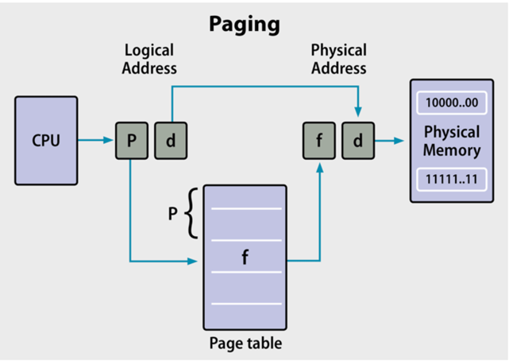

# 💻 운영체제
****
> 시스템의 자원과 동작을 관리하는 시스템 소프트웨어.

- 프로세스 관리: 생성과 준비, 실행과 대기, 종료 등 주기를 관리하고 Deadlock 등에 대처.
- 메모리 관리: 메모리의 할당과 해제.
- 작업 스케줄링: 각 프로세스에 CPU 할당 시간 관리.
- 파일 시스템 관리: 파일, 폴더의 계층과 생성 삭제, 읽기 쓰기.
- 커널 모드 / 유저 모드 관리.(듀얼 모드): Mode bit를 이용한 모드 변경, 접근을 관리하여 OS르 보호한다.
- 디스크 관리: 디스크 공간 관리와 읽기, 쓰기. 다른 계층과의 데이터 일관성 유지.

# 📌 Memory
***
- ### 메모리의 계층 구조

> *  이미지 출처 : https://dheldh77.tistory.com/entry/Memory-Hierarchy
- 접근속도와 용량.
  - 메모리의 계층에서 아래로 갈수록 용량은 커지지만 데이터의 접근 속도는 느려진다.
- 휘발성
  - register 부터 RAM까지는 휘발성, 그 이후는 비 휘발성을 가진다.

### 🤔 I/O에서의 메모리 직접 접근(Direct Memory Access)
- I/O 입출력은 빈번하게 나타나고, CPU가 이를 기다리기에는 속도가 너무 느리다.
  때문에 DMA(Direct Memory Access) 컨트롤러가 이를 중재하며 I/O 입력에 대해 바로 RAM에 접근할 수 있도록 해준다.
- CPU가 처리할 일을 대신 해주기 때문에 CPU으 효율이 올라간다. DMA 는 데이터의 전송이 완료되면 일정 데이터(Block) 마다 Interrupt를 발생시킨다.


# 📌 프로세스
***
- 프로세스는 최소 1개 이상의 쓰레드를 가진다.
- 프로세스는 Code, Data, Heap, Stack 영역을 가지며, Stack 영역은 쓰레드마다 생성되고, 나머지는 공유된다.
> - Code : 코드를 구성하는 메모리 영역, 프로그램 명령 등.
> - Data : static 변수, 전역변수, 배열 등 초기화된 데이터가 저장된다.
> - Heap : 동적 할당시 저장되는 장소, new Operation 등.
> - Stack : 지역변수, 매개변수, 반환 값을 저장. 임시 메모리 영역.
> Active Record가 존재하여 호출된 프로시저의 실행에 필요한 데이터를 저장한다.

### ☝️ 프로세스 상태 주기

> - new : 프로세스 생성
> - Admitted : 프로세스 생성이 가능하여 승인.
> - Ready : 프로세스 실행이 가능해져 차례를 기다림.
> - Scheduler Dispatch : Ready에 있는 프로세스 중 하나를 실행.
> - Running : 현재 실행중인 프로세스
> - Interrupt : 예외, 입출력 등이 발생하여 다른 작업을 먼저 처리.
> - IO | Event Wait : 실행중인 프로세스가 입출력이나 이벤트를 대기.
> - Waiting : 발생한 입출력이나 이벤트가 모두 끝날때까지 대기하는 상태.
> - IO | Event Completion : 입출력이나 이벤트가 끝나 다시 Ready 상태로 전환.

## 🧐 프로세스 스케줄링
> - Jop Queue: Disk 에서 Ready 상태로 가기위해 프로세스들이 대기하는 큐.
> - Ready Queue: Ready 상태의 프로세스들이 CPU를 할당 받기 휘애 대기하는 큐.
> - Device Queue: Device Controller에 존재, I/O를 이용하기 위해 대기하는 큐.
> - Long Term Scheduler: JobQueue -> ReadyQueue로 이동시키는 작업. 긴 텀을 두고 실행, 메모리에 있는 작업을 조절한다.
> - Short Term Scheduler: 프로세스에 CPU를 할당한다 자주 실행되며 실행속도가 빨라야한다.
> - Medium Term Scheduler: 너무 많은 프로세스의 실행으로 메모리가 부족해 질때 일부 프로세스를 다시 디스크로 내려보내거나, 다시 여유가 생기면 메모리에 올리는 작업을 한다.(Swapping)
> 
> > -  I/O Bound, CPU Bound Process: I/O 중심, CPU 중심의 프로세스이다. 시스템 성능을 위해서는 디스크에서 두 타입의 프로세스를 적절하게 선택하여 가져와야 한다.
> > (CPU처리 과열 -> I/O Bound 실행)

### ☝️ 멀티 프로세스
- 여러개의 프로세스를 병렬적으로 처리한다. 
- Context Switching 이 발생하기 때문에 오버헤드가 있다.
    - 동작중인 프로세스의 상태를 저장하고, 이전에 보관한 프로세스의 상태를 복원하는 과정.
    - 인터럽트의 발생, CPU 사용시간 소모, 입출력 대기 등.
    - 즉, 프로세스의 상태 변경시 발생
    
### ☝️ 멀티 쓰레드
- 한 프로세스에서 다수의 작업을 동시에 처리.
- 공유 자원을 사용하기 때문에 동기화 처리 등 발생할 수 있는 문제를 고려해야 한다.

## 🧐 PCB(Process Control Block)
- 프로세스 메타데이터를 저장하는 곳
    - Id
    - 상태
    - 우선순위
    - CPU Registers
    - 메모리, CPU 사용량 등.

- Context Switch 가 발생할 때 다시 수행할 대기 프로세스에 관한 값들을 저장하기 위해 사용한다.
- Linked List 방식으로, 프로세스가 생성되면 추가되고, 완료되면 삭제된다.

## 🧐 멀티 프로세싱
- 여러개의 프로세스가 버스, 메모리를 공유하며 협력.
> - 프로세서의 수의 증가로 처리 속도가 향상된다. 하지만 오버헤드가 존재하기 때문에 선형으로 증가하지 않는다.
> - 하나의 프로세스가 작동을 멈추더라도 다른 프로세스가 처리할 수 있으므로 안정적이다.
- ### 1. 비대칭 멀티 프로세싱
  - 각 프로세스는 자신이 맡은 역할만을 한다. 
- ### 2. 대칭 멀티 프로세싱
  - 프로세스들은 미리 정의된 일 없이 비어있는 프로세스가 새로운 작업을 처리하게 된다.
  
## 🧐 Thread 
- CPU 에서 사용하는 기본적인 실행 단위.
- 개별적인 Id, Register Set, Stack 을 가지고 프로세스의 code, heap, data 영역을 공유한다.
- stack 에는 함수 인자,변수, 리턴 주소 등 실행흐름에 관련된 변수가 저장된다.

### - 멀티 쓰레드
  - 자원 공유: 자원을 공유하기 때문에 메모리를 효율적으로 사용가능하며, 데이터 교환이 쉽다.
  - 경제적: 쓰레드간 Context Switching은 프로세스간의 스위치보다 저렴하며 빠르다.
  - 반응성: 단위시간당 처리량이 증가한다.
  - Race Condition 등에 유의.
  
### - User, Kernel Thread
- User, Kernel 레벨에서 실행되는 쓰레드로, User Thread는 Kernel Thread에 연결되어야 사용할 수 있다.
> - 1:1 연결: 한 개의 유저 쓰레드가 생성될 때 한개의 커널 쓰레드가 생성되어야 하기 때문에 매우 부담이 큰 방법.
> - N:1 연결: 여러개의 유저 쓰레드가 한 개의 커널 쓰레드에 연결 된다.
> 유저 쓰레드가 Blocking system call을 하게 되면 커널 쓰레드가 Block 되어 다른 유저 쓰레드 또한 실행될 수 없게 된다.(병렬성 나쁨)
> - N:M 연결(M<=N): 미리 커널 쓰레드의 숫자를 정해놓고 사용. 병렬성이 개선된다.


### 🖍 프로세스 vs 쓰레드
> - 프로세스는 메모리 상에서 실행중인 프로그램을 말하고, 쓰레드는 프로세스 안에서 실행되는 흐름 단위이다.
> - 프로세스는 고유의 메모리 공간을 가진다(heap, stack, code,data), 쓰레드는 이중 stack만을 각자 가지고 나머지 영역을 공유하게 된다.

> - 프로세스를 생성할때는 *시스템 콜이 발생하기 때문에 쓰레드를 이용하면 이를 줄여 자원을 효율적으로 이용할 수 있게된다.
> - 프로세스간의 통신  IPC 보다 쓰레드간의 통신비용이 더 작다. 그러나 쓰레드는 자원을 공유하기 이를 고려하여 사용해야 한다.
> - 프로세스에서 Context Switch가 실행될 때에는 Cache를 비우기 때문에 더 많은 Cashe miss가 발생할 수 있지만 멀티 쓰레드는 캐시를 비우지 않고 프로세스보다 더 가볍다.
> - 그러나 멀티 쓰레드에서는 한 쓰레드가 비정상 종료하게 되면 다른 쓰레드에게 영향을 미친다. 프로세스는 독립적이기 때문에 영향을 주지 않는다.

### ✏️ System Call
- fork(), wait(), exit() 등 프로세스의 생성과 제어를 위한 시스템 콜이 존재한다.
> - fork()
> > - 프로세스의 생성에 사용된다. 이떄 생성된 프로세스(child)는 parent와 동일한 복사본을 가지게 된다.
> > - child와 parent는 fork() 값이 다르기 때문에 이를 이용하여 구분한다.(parent는 child의 PID값, child는 0)
> > - 프로세스를 생성할 때에는 옵션을 사용하여 자원의 공유를 설정할 수 있다.
> >   - 모든 자원의 공유, 일부 자원을 공유, 공유하지 않음. 
> > - 자식 프로세스는 부모 프로세스가 없이 실행될 수 없다.
> >   - 부모 프로세스가 종료 되었을 경우: 자식도 종료하거나 다른 부모의 양자로 들어간다.
> - wait()
> > - child의 실행이 끝나기를 부모가 기다림.
> > - 만약 부모가 기다리지 않는다면 자식 프로세스는 종료된 후 PCB를 반납할 수 없게되고, 좀비 프로세스가 된다.
> > 또한, 이 상태에서 부모가 종료된다면 고아 프로세스가 된다.


# 📌 프로세스간 통신 IPC(Inter-Process Communication)
****
- 프로세스는 독립적으로 실행되어 서로에게 영향을 받지 안흔다.
- 프로세스는 커널이 제공하는 IPC 설비를 이용하여 서로 통신한다.
## 🧐 1. PIPE
### - 익명 PIPE
- 통신할 프로세스를 명확하게 알 때 사용.(부모-자식)
- 단방향 통신(한쪽은 읽기, 한쪽은 쓰기.)
- 양방향으로 통신하고 싶다면 2개의 파이프가 필요하다.
- 구현이 간단하지만 양방향 통신을 하기 위해서는 구현이 복잡해진다.

### - Named PIPE
- 통신할 프로세스를 알지 못할 때 사용.
- 익명 파이프의 확장, 무관한 프로세스와도 통신이 가능

## 🧐 2. Message Passing
### - 직접 통신
- 프로세스가 직접적으로 링크가 연결된다.
- send: p->Q 로 메시지를 보낸다.
- receive: P로부터 메시지를 받는다.

### - Message Queue(간접 통신)
- 입출력 방식은 파이프와 동일
- 파이프와 달리 데이터의 흐름이 아닌 메모리 공간(mail box, 고유 id가 존재.)
- 여러 프로세스에서 데이터를 다룰 수 있고, mail box 자체를 여러개 생성하여 연결할 수 있다.

## 🧐 3. 공유 메모리
- 통신을 이용한 설비가 아닌 말 그대로 자원의 공유.
- 프로세스간 메모리 영역을 공유하여 사용할 수 있도록 한다. 곧바로 접근이 가능하기 때문에 가장 빠름.
> - 프로세스가 공유 메모리 할당을 커널에 요청
> - 커널은 메모리 공간을 할당. 모든 프로세스는 해당 메모리 영역에 접근 가능.
> - 공유 자원은 유한하기 때문에 생성자 - 소비자 문제가 발생한다.(자원이 있는지 없는지 확인하며 wait, notify를 이용하여 알려 해결.)
> 

## 🧐 4. 메모리 맵
- 공유 메모리와 같이 메모리를 공유.
- 열린 파일을 메모리에 맵핑 시켜 공유, 대용량 데이터를 공유할 때 사용.

## 🧐 5. Socket
- 네트워크 소켓 통신을 이용한 데이터 공유.
- IP + Port
- 클라이언트-서버 통신 구조.

## 🧐 6. RPC(Remote Procedure Call)
- Data 는 기계에 따라 *Big Endian, *Little Endian 으로 나뉘는데 이를 기계에 독립적으로 변환하기 위 Marshaling 기법을 사용하고,
다른 컴퓨터의 포트번호와 IP를 이용하여 데이터를 전송한다. 이후 결과를 다시 전달 받게 된다.
  
#### 🔑 Big,Little Endian
    - 컴퓨터가 데이터를 읽고 쓸때의 방식.
    - 1byte 를 최소 단위로 끊어 읽고, Big Endian 같은 경우는 큰 단위가 상위 비트에, Little Endian은 작은 단위가 상위 비트에 쓰여진다.
      - 16진수 0x123456을 예로 들면 Big Endian은 12 34 56 으로 할당, Little Endian 은 56 34 12로 할당 된다.
  

#### 🖍 IPC 통신에서 동기화, 각종 문제 발생을 해결하기 위해 세막포, 뮤텍스 등의 방법을 사용.


# 📌 Interrupt
***
> 더 중요한 일 발생으로 실행중인 작업을 즉시 중단하고, 발생된 상황의 처리를 우선으로 할 것을 CPU에게 알리는 것.
> - 발생시기를 예측하기 힘든 경우에 빠르게 대응할 수 있게 해준다.
> 
- 폴링 방식 : 사용자 명령어를 사용해 값을 계속 읽어 변화를 감지.
- 인터럽트 : MCU 자체가 하드웨어적으로 변화를 체크, 변화가 있을 경우에만 동작.


### 🧐 외부 인터럽트
- 입출력, 타이밍 장치, 전원 등의 외부적인 요인
> - I/O 인터럽트
> - 단말에서 단말 컨트롤러의 지역 버퍼로 데이터가 옮겨지는 Input, 단말 컨트롤러에서 단말로 데이터가 옮겨지는 Output이 있다.
> - 단말 컨트롤러에서는 I/O 작업이 완료되면 인터럽트를 발생시켜 CPU 에게 알린다.
> - CPU는 인터럽트가 발생하면, 하던 일을 멈추고 해당 작업을 처리한다.
> - I/O의 작업은 언제 발생할지 모르고, 언제 완료될지 모르기 때문에 CPU가 이것을 기다리는 것은 비 효율적이다.
> - 때문에 이를 도와주는 Interrupt Service routine 라는 소프트웨어가 존재하게 된다. RAM 에는 Interrupt Vector라는 인터럽트 서비스 루틴의 주소를 저장해둔 테이블이 존재하고,
> 인터럽트가 발생하면 CPU는 벡터 테이블을 보고 해당 주소로 점프하게 된다.


### 🧐 내부 인터럽트
- Trap
- 잘못된 명령이나 데이터로 인해 발생하는 인터럽트.
  - (overflow, zero division, Exception 등)
    
### 🧐 소프트웨어 인터럽트
- 명령의 요청에 의해 발생.
- 사용자가 다른 프로세스를 실행 등.

```
- 인터럽트 발생
- 복귀주소 저장(PC, 레지스트 등 스택에 저장.).
- 인터럽트 백터로 점프.
- 인터럽트 처리.
- 복귀 주소 로드.
- 복귀 주소로 점프.
- 이전에 실행하던 프로세스 실행.
```

# 📌 CPU Scheduling
***
- Short Term Scheduler 에 의해 실행된다.
- 가능한 많은 일을 수행.
- 빠른 응답 시간, 적은 대기 시간.
- deadline 내에 수행.

> - Response Time: 작업이 처음 실행되기 까지 걸린 시간
> - Turn Around Time: 실행시간 + 대기 시간.

- Dispatcher 에 의해 프로세스 할당이 실행된다.
먼저 process context 를 교환하고 Dispatcher 는 커널 모드에서 동작하기 때문에 다시 User Mode로 변경해준다.
PC가 가지고 있던 명령어로 분기하여 프로그램을 실행한다.
  - 위와 같은 과정에서 발생하는 오버헤드를 Dispatcher Latency 라고 한다.
  

## 🧐 CPU Scheduling Algorithm

### ☝️ 비선점(onpreemptive) 스케줄링
> 프로세스 종료 또는 IO 등의 이벤트가 있을때 까지 실행을 보장.
- #### ✏️ FCFS(First come First Served)
  - 말 그대로 큐에 도착한 순서대로 할당. CPU BurstTime 이 다할때 까지 실행한다. 
  - 실행시간이 긴 프로세스가 앞에 오면 평균 대기시간이 길어진다.
  - #### 🖍 호위함 효과: 대체적으로 짧은 프로세스가 긴 프로세스 뒤에 오게되는 현상.
    
- #### ✏️ SJF(Shortest Job First)
  - 실행시간이 짧은 프로세스 부터 수행.
      - 해당 프로세스의 과거 기록으로 부터 실행시간을 예측한다.
      - E(n+1) = k*T(n) +(1-k)E(n)
        - T(n): 실제 소요 시간, E(n): 예측 시간.
  - FCFS 보다️ 평균 대기시간이 감소
  - Starvation(기아 현상)이 발생할 수 있다.
  
- #### ✏️ HRN(Highest Response-ratio Next)
  - 우선순위를 계산하여 점유 불평등을 해결(SJF 보완)
  - 우선순위 = (대기시간 + 실행시간) / 실행시간
  - 대기시간이 길어지면 우선순위가 높아짐.


### ☝️ 선점(Preemptive) 스케줄링
> OS가 CPU 사용권을 강제 회수. 종료까지 실행을 보장하지 않는다. 즉, 더 처리순서가 빠른 프로세스가 들어오게 되면 실행이 중단되고 CPU 점유를 빼앗긴다.
- #### ✏️ SRTF(Shortest Remaining Time First)
  - 새로 도착한 프로세스가 있을 때마다 다시 Scheduling 한다.
  - 이미 작업 중인 프로세스의 남은 시간보다 더 짧은 실행 시간을 가진 프로세스가 들어오게 된다면. CPU점유를 가져가게 된다.
  
  
- #### ✏️ Priority Scheduling
  - 우선 순위를 부여하여 우선순위가 높은 순서대로 처리. 
  - 우선 순위가 낮은 프로세스가 무한정 기다리는 Starvation이 발생할 수 있다.
  - Aging 을 적용하여 해결 가능.(들어온 시간이 지날수록 우선순위가 높아짐.)

- #### ✏️ Round Robin
  - FCFS에 더에 각 프로세스는 동일한 TimeQuantum을 할당 받으며, 해당 시간만큼 수행한 후 다른 프로세스에게 CPU 점유를 넘긴다.
  - Time Quantum 을 너무 크게 주면 FCFS가 되고, 너무 적게 주면 Context Switching 이 자주 발생하므로 오버헤드 증가.
  
- #### ✏️ MultiLevel Queue(다단계 큐)
  - 여러 개의 큐에 서로 다른 스케줄링 기법을 적용.
  - 우선순위가 높은 작업(빠른 반응 속도를 요구하는 작업)에는 TimeQuantum을 작게.
  - 우선순위가 낮은 작업에는 TimeQuantum을 크게 할당.
  
- #### ✏️ MultiLevel Feedback Queue
  - 다단계 큐와 유사하지만 Time Quantum을 모두 소모한 프로세스가 밑의 큐로 이동한다.(즉, 우선순위가 한단계 낮아짐.)
  - 너무 오래 기다린 작업 또한 상위 큐로 이동한다.
  - 짧은 작업 처리에 유리, Turn around Time 을 줄여줌.(대기 + 실행시간)
  
  
# 📌 DeadLock : 교착상태
****
> 프로세스가 자원을 얻지 못해서 다음 처리를 하지 못하는 상태.
> 한정적인 자원을 공유하기 때문에 발생한다.

## 🧐 교착상 발생 조건
> 상호 배제, 점유 대기, 비선좀, 순환 대기 4가지가 모두 성립될 때 교착 상태가 발생한다.

### ☝️ 상호 배제(Mutual exclusion)
- 자원은 한 프로세스에서만 접근할 수 있다.(한번에 여러 프로세스에서 한 자원을 사용할 수 없다.)

### ☝️ 점유 대기 (Hold and Wait)
- 최소 하나의 자원을 점유하고, 다른 프로세스에 할당된 자원을 기다리는 프로세스가 존재.

### ☝️ 비선점(non-preemption)
- 다른 프로세스에 할당된 자원은 강제로 빼앗을 수 없다.

### ☝️ 순환 대기, 원형 대기(Circular Wait)
- 프로세스의 집합에서 순환 형태로 자원을 대기.
- 1번 프로세스가 자원 A를 가지고 자원 B를 요청, 2번 프로세스가 자원 B를 가지고 자원 A를 요청.

## 🧐 교착상태 해결

### ☝️ 예방(prevention)
- 교착상태 발생 조건중 하나를 제거.(자원 낭비가 있음)

  - 상호 배제 부정 : 부정할 수 없다.
  - 점유 대기 부정 : 
    - 미리 점유하지 않고 프로세스 실행전 모든 자원을 한번에 할당.(자원 낭비)
    - 자원을 점유하지 않고 있을 때에만 다른 자원 요청 가능(기아 상태 발생 가능)
  - 비선점 부정 : 다른 프로세스에서 자원을 요구할 때 가진 자원을 반납.(이미 실행중이 었기 때문에 자원이 낭비됨.)
  - 순환대기 부정 : 자원에 고유번호 할당 후 순서대로 자원 요구.
  
### ☝️ 회피(Avoidance)
- 교착 상태 발생을 피한다.
- 은행원 알고리즘.
  - 가정
    - 프로세스 수가 고정
    - 자원의 종류와 수가 고정
    - 프로세스가 요구하는 자원, 최대 자원의 수를 알아야한다.
    - 프로세스는 반드시 자원을 반납.

  > - 프로세스가 자원을 요구할 때, 시스템은 자원을 할당 한 후에도 안정 상태인지(모든 프로세스가 정상적으로 종료가능한 상태) 검사 후 할당.
  > - 자원을 할당했을 때 안정상태가 아니라면 다른 프로세스의 자원이 해지될때까지 대기한다.
  > - #### 안정 상태?  남은 여유 자원으로 종료할 수 있는 프로세스 탐색 -> 해당 프로세스를 종료시키고 반환된 자원으로 다시 탐색.. 의 반복을 통해 모든 프로세스를 종료할 수 있는지.
  
- 자원 할당 그래프 알고리즘
  - 그래프를 그리고 향후 요청할 수 있는 자원을 점선을 예약 간선으로 표시.
  - 사이클이 발생한다면 자원 요청을 승인하지 않는다.

### ☝️ 교착상태 허용  회복

#### ✏️ 탐지(Detection)
> 일정 주기로 교착 상태가 발생했는지 탐지.
- 대기 그래프
  - 자원 할당 그래프에서 자원을 제거, 간선을 결합.
  - 다른 프로세스의 자원을 기다리는 것을 화살표로 표시.
  - 사이클이 생긴다면 교착상태를 의미.
- 은행원 알고리즘 : 불안정 상태라면 교착상태라고 판단.

#### ✏️ 회복(Recovery)
> 교착 상태를 일으킨 프로세스를 종료하거나, 할당된 자원을 해제.

1. 프로세스 종료 방법
    1. 교착 상태의 프로세스를 모두 중지하는 방법.
    2. 교착 상태가 제거될 때 까지 하나씩 프로세스를 중지시켜 나감.

2. 자원 선점
    - 희생자 선택 : 최소의 피해를 가져오는 프로세스 선택후 자원을 해제, 다른 프로세스에게 할당.
      - 우선순위가 낮은 프로세스, 실행 빈도가 낮은 프로세스를 주로 선택한다.
      - 기아 상태가 발생할 수 있으므로 이를 해결하는 방법이 필요.(자원을 선점 당할때 마다 우선순위 증가 등.)
    - 롤백 : 선점된 프로세스를 이전 상태로 롤백(중단 후 재시작)
  
#### ✏️ 사용자가 직접 해


# 📌 동기화, 경쟁 상태(Race Condition)
***
> 동시 접근으로 원하는 결과가 발생하지 못한다. 비 일관성.
## 🧐 발생
### ☝️ 커널 작업을 수행하는 중에 인터럽트 발생
- 커널모드에서 작업을 수행하다가 인터럽트가 발생, 같은 데이터를 조작하는 경우.
- 커널 모드에서 작업을 수행하는 동안 인터럽트를 Disable 시켜 발생을 막는다.

### ☝️ System Call
- 프로세스 1에서 데이터를 조작하는 도중 시간을 모두 소모하여 CPU 제어권이 프로세스 2로 넘어가게 되고, 같은 데이터를 조작
- 시간을 모두 소모하여도 CPU 제어권을 넘기지 않도록 한다.

### ☝️ 멀티 환경에서 공유 메모리의 접근
- 2개의 프로세스 또는 스레드가 공유 데이터에 접근하여 데이터를 조작.
- 데이터를 사용할 때 lock을 걸어둔다.

## 🧐 해결
#### 🖍 임계 구역(Critical Section) : 공유 데이터에 접근하는 부분.
- 공유 데이터에는 하나의 프로세스만 접근해야 한다.

> - 상호 배제(Mutual Exclusion): 단 하나의 프로세스만 임계 구역에 접근.
> - 진행 (Process): 임계 구역에 들어가고자 하는 프로세스는 무한정 대기할 수 없다.(임계 구역이 비어있다면 반드시 들어가야 한다.)
> - 한계 대기(Bounded Wait): 언젠가는 자신의 차례가 돌아와 임게구역에 들어가야 한다.

### ☝️ 세마포어(Semaphore)
> 멀티 환경에서 공유자원에 대한 접근 제한.
```java
wait(s) {
    // 임계 구역이 모두 차있으면 대기.
	while(s <= 0);
	s--;
}
// 임계 구역에서 나왔을 때 실행. 
signal(s) {
	s++:
}
```
- 플래그를 두고 데이터에 접근할때 접근함을 표시.
- Wait, Signal 메서드 사용.
- 사용하고 나온 뒤에는 다시 플래그를 변경해두면 다른 프로세스가 이를 확인하고 접근.
- while 문을 사용하여 flag를 확인하며 대기한다.
- int 형 변수를 사용하면 counting semaphore, binary를 사용하면 binary semaphore.
- binary semaphore는 mutex Lock과 동일하다.

>#### 🖍 while문을 이용한 wait는 busy waiting이기 때문에 성능상 좋지 않다.
> 때문에 대기열(Queue)를 이용하여 임계구역이 가득 찼다면 Queue에 해당 프로세스를 추가하여 대기하도록 구현할 수 있다.


### ☝️ 뮤텍스 알고리즘
> - Lock의 습득과 해제 두가지의 연산을 제공한다. Lock을 가진 프로세스만이 임계구역에 접근할 수 있다. 
> - 누군가 Lock을 가지고 있다면 기다리고, Lock이 해제되면 자신이 Lock을 가지고 들어가 작업을 수행한 후 Lock을 해제한다.
> - 소프트웨어적 해결은 성능이 좋지 않아 현재는 잘 사용하지 않는다.
```java
acquire() {
    // 다른 프로세스가 들어가있으면 대기
    while (!available);
    abilable = false;
}
// 자원 해방 unlock
release() {
    abilable = true;    
}
 
do {
    acquire(); //lock
    //{critical section}
    release() // unlock
    // {remainder section}
} while(true);
```

- #### ✏️️️ 데커(Dekker) 알고리즘
  ```java
  flag[i] = true; 
  while(flag[j]) { 
      if(turn == j) { 
          flag[i] = false; 
          while(turn == j); 
          flag[i] = true; 
      }
  }
  //{Critical Section}
  turn = j; 
  flag[i] = false; 
  ```
  - flag와 turn을 이용하여 임계 구역에 들어갈 프로세스를 결정.
  - flag : 누가 임계 구역에 진입 할 것인지.
  - turn : 누가 임계 구역에 진입할 차례인지.
  - j의 turn 이라면 기다리다가 j가 끝나고 turn을 i로 설정하면 진입.
  - 사용하고 나면 자신의 플래그를 false로 하고, turn 을 넘겨준다.
  
- #### ✏️️ 피터슨(Peterson) 알고리즘
  - 다른 프로세스에게 진입 기회를 먼저 양보.
  - 다른 프로세스가 진입 시도중이라면 기다림.

  ```java
  flag[i] = true;
  turn = j;
  while(flag[j] && turn == j){}
  // { Critical Section}
  flag[i] = false;
  ```

- #### ✏️ Bakery 알고리즘
  - 번호표를 발급받고 가장 적은 수의 번호표를 가진 프로세스가 먼저 접근.

### ☝️ Monitor
> - 하나의 프로세스 내의 다른 쓰레드간의 동기화에 사용된다.
> - 모니터는 주로 프레임워크나 라이브러리에서 제공.
> - java에서는 synchronized, wait(), notify()를 사용.
> - Mutual Exclusion Queue 와 Conditional Synchronized Queue 가 존재한다.
> - Mutual Exclusion Queue 는 임계구역이 사용중일 때 다른 쓰레드가 대기하는 장소이고,
> Conditional Queue는 임계구역에서 쓰레드가 wait()를 호출 했을 때 해당 쓰레드가 대기하는 장소이다. 후에 notify()로 깨어나 다시 하던 작업을 계속한다.

# 📌 메모리
***
- 메인 메모리는 CPU가 직접 접근할 수 있는 기억 장치. (CPU는 Disk에 접근할 수 없기 때문에 프로그램을 실행하기 위해서는 메모리에 프로그램을 올려야 한다.)
- 주소가 할당된 일련의 바이트
- 명령어, 명령어 수행시 메모리에 필요한 데이터를 가져옴.

### ✏️ Binding Time
- loading Time: 컴파일 시점에 상대 주소를 이용하고, 로딩 시점에 Loader가 상대 주소를 절대 주소로 변환.
  프로그램 구동 시간이 오래걸려 잘 사용하지 않는다.
  
- Execution Time: 바인딩이 가장 늦게 일어나기 때문에 유연성이 높고, MMU가 논리주소를 실제 주소로 변환해준다.
MMU의 Base Register값에 CPU가 넘긴 논리주소 값을 더해 물리 메모리 주소를 구한다.

### ☝️ 메모리 관리장치 MMU(Memory Management Unit)
- 메모리 보호, 캐시 관리 등 CPU가 메모리에 접근 하는것을 관리.
- 논리 주소를 물리주소로 변환.

- 프로세스에게 합법적인 주소 영역을 설정, 잘못된 접근에대해 Trap을 발생시켜 보호.
  - base : 메모리상의 프로세스 시작 주소.
  - limit : 프로세스의 사이즈
  - 즉 접근 범위는 base 이상 base + limit 미만.
  
### 🧐 Fragment

> - 이미지 출처: https://m.blog.naver.com/PostView.naver?isHttpsRedirect=true&blogId=ljc8808&logNo=220303236020
- 프로세스들이 연속된 공간에 할당 되었다가. 일부가 종료된다면 메모리 공간은 연속된 공간에서 중간중간이 비어있는 모습이 될 것이다.
이를 외부 단편(External Fragment)라고 한다.
- 외부 단편화가 발생하면 실제로는 남아 있는 공간이 있지만 프로세스를 실행시키지 못하게 된다.

#### ✏️ Compaction
- 외부 단편을 제거하기 위해 모든 프로세스를 한쪽으로 미는것, 비용이 매우 크고 위험하다.

## 🧐 Paging

> 이미지 출처: https://oowgnoj.dev/post/os-memory

- 페이징을 이용한다면 하나의 프로세스를 연속된 공간에 할당할 필요가 없기 때문에 외부 단편화 문제가 해결된다.
- 메모리를 일정한 크기로 나눈 것을 Frame, 프로세스를 일정한 크기로 나눈 것을 Page라고 한다.
- Internal Fragmentation(내부 단편화)이 발생하지만 외부 단편에 비하면 훨씬 작다.
  - 🖍 Internal Fragment: 프로세스가 실제로 할당 받았지만 사용하지 않는 공간.
- 페이징을 이용하게 되면 Page Table 이 MMU의 역할을 하게 돤다. Page Table에서 Page Number를 가지고 논리 주소를 물리 주소로 변환해준다.(frame을 찾아준다.)

### ☝️ TLB(Translation Lookaside Buffer)
- 페이지 테이블에 한번, 실제 주소로 접근 한번 , 두번의 디스크 접근이 필요하기 때문에 두배의 시간이 걸린다.
  - 이를 해결하기 위헤 페이지 테이블 또한 캐싱.(TLB)
- 페이지 테이블을 탐색할때 TLB에서 우선적으로 탐색.

## 🧐 가상 메모리
- 전체 프로세스의 메모리가 한번에 사용되는 경우가 거의 없기 때문에, 사용하지 않는 부분을 디스크에 옮겨 놓는다.(swapping)
이로서 메모리보다 더 큰 프로세스를 실행할 수 있게 된다 (RAM + Disk).
  
### ☝️ 요구 페이징(Demand Paging)
- 프로세스에서 페이지에 접근하려 하는데 해당 부분이 메모리에 올라와있지 않아 디스크에서 찾는 것.(초기에는 필요한 것들만 메모리에 올림.)
- 페이지 번호가 유효한지 검사 -> 유효하지 않으면 page fault 발생.
  - Invalid reference: 유효하지 않음, Abort 발생.
  - Just Not In Memory: 메모리에 없음 -> 디스크에서 탐색.


### ☝️ 페이지 교체
- 가상 메모리를 이용하여 메모리를 할당 했을 때 과할당이 발생할 수 있다.
- 이를 해결하기 위해 프로세스를 Swap out하고, 이 공간을 빈 프레임으로 활용하여 해당 빈 프레임에 페이지를 올린다.

1. 페이지 폴트 발생
2. 페이지 폴트가 발생한 페이지를 디스크에서 탐색.
3 .메모리에 빈 프레임 탐색.
  - 있으면 빈 프레임 사용, 없다면 페이지 교체 알고리즘을 실행하여 희생 프레임을 선정.
  - 교체될 페이지를 디스크에 기록하여 저장.
4. 빈 프레임에 폴트가가 발생한 페이지를 올리고 페이지 테이블 업데이트.

#### 🖍 오버헤드 발생
  - 희생 프레임을 비울 때, 원하는 페이지를 프레임에 올릴 때, 두번의 디스크 접근이 이루어진다.
  - 적절한 교체로 오버헤드를 줄여야 함.

### 🔑 페이지 교체 알고리즘
> 안쓰는 페이지를 내리고, 현재 필요한 페이지를 추가, 이때 어떤 페이지를 내려야할지 결정하는 알고리즘.

#### ✏️ FIFO
- 가장 먼저 올라온(올라온지 오래된) 페이지를 out 시킨다.
- 초기화 코드를 out 시킬때 적절.
- 활발히 사용되는 페이지가 out될 수 있어 많은 page fault를 발생시킬 수 있다.

#### ✏️ Optimal 알고리즘
- 앞으로 가장 사용하지 않을 페이지를 우선적으로 내보낸다.
  - 하지만 실질적으로 사용하지 않음을 보장할 수 없기 때문에 수행하기 어려움.
- FIFO에  비해 페이지 결함의 횟수가 많이 감소된다. 

#### ✏️ LRU(Least-Recently-Used)
- 최근에 사용하지 않았다면 다시 사용될 확률이 낮다는 아이디어.
- 사용한지 가장 오래된 페이지를 교체.
- 과거를 보기 때문에 실제로 사용할 수 있다. 하지만 메모리에 2번 접근해야 하기 때문에 실제로 사용하기에는 제한이 따른다.

#### ✏️ LRU 근사 알고리즘
- 페이지에 참조 비트를 두고 참조 되었으면 1, 참조 되지 않았으면 0으로 둔다. 주기적으로 bit를 0으로 초기화 한다.
- Second Chance Algorithm: 교체할 페이지를 탐색하며 bit가 0이라면 선택, 1이라면 0으로 바꾸고 넘어간다.
  - Modified bit를 추가하여 변경되지도, 참조되지도 않은 페이지를 선택할 수도 있다.
  
#### ✏️ 카운팅 알고리즘
- LFU(Least Frequently Used): 참조될 때마다 카운트해 참조 횟수가 적은 것을 선택.
- MFU(Most Frequently Used): 참조 횟수가 많은 것을 선택.

### ☝️ 캐시
- 재접근 할때 메모리의 참조 비용을 줄이기 위해 사용
- CPU에서 주소를 전달 -> 캐시에서 먼저 확인 -> Hit이면 명령어를 가져옴, Miss면 주기억 장치에 접근.
- 캐싱 라인 : 캐시 데이터를 저장할 때 자료구조를 활용(map,set 등)

- ###️ 지역성
  - 시간 지역성 : 최근에 참조된 주소가 곧 다시 참조될 것이다.
  - 공간 지역성 : 프로그램이 참조된 주소와 인접 주소의 내용이 다시 참조될 것이다.

# 📌 파일 시스템

## 🧐 접근
### ☝️ 순차 접근
- 현재 위치 포인터에서 포인터를 이동하며 순차적으로 접근.(read, write)

### ☝️ 직접 접근
- 무작위 파일 블록에 대한 임의 접근 가능.
- reset : cp = 0;
- read_next : read cp; cp = cp +1;
- write_next : write cp; cp = cp + 1;

## 🧐 디렉토리 구조
이미지 출처 : 공룡책 OS
### ☝️ 1단계 디렉토리

- 파일, 디렉토리 들은 서로 유일한 이름을 가짐.

### ☝️ 2단계 디렉토리

- 사용자 별로 개별적인 디렉토리를 가짐.
- master file directory : 사용자의 색인 번호

### ☝️ 트리 구조 디렉토리

- 하나의 루트 디렉토리, 시스템의 모든 파일은 고유 경로를 가짐.
- 한 비트로 일반 파일(0), 디렉토리(1)을 구분.

### ☝️ 비순환 그래프

- 사이클이 존재하지 않는 디렉토리 구조.
- 링크라고 불리는 새로운 디렉토리 항목이 존재한다.
- 참조 계수를 두고 참조 계수가 0일때만 삭제가 가능.

