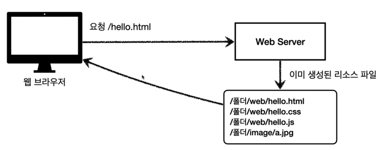
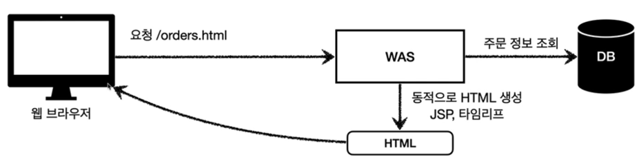
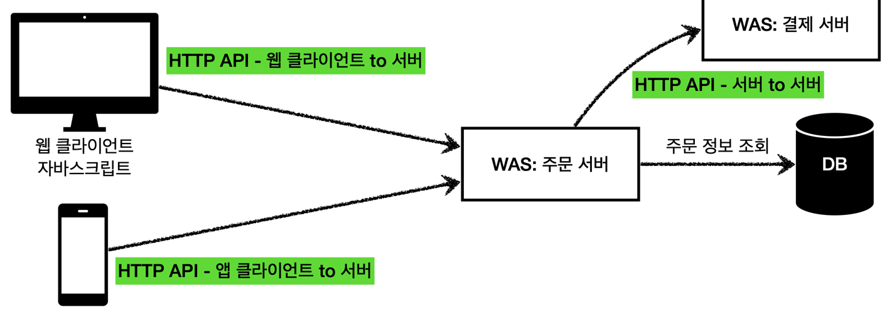
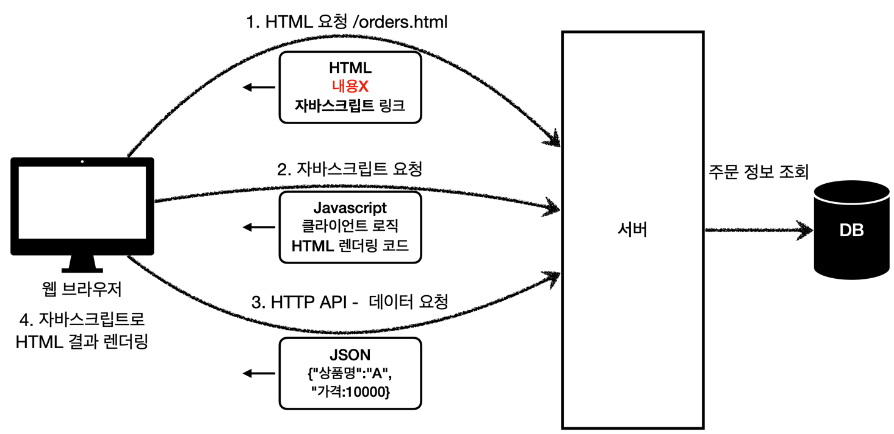

## 🧐 HTTP를 이용한 요청

### ☝️ 정적 리소스의 요청

고정된 HTML 파일, CSS, JS, 이미지, 영상 등, 요청이 오면 이미 생성된 리소스 파일을 응답으로 전달해주면 된다.

### ☝️ 동적인 HTML은?

WAS에서 동적으로 HTML을 생성 하여 이를 전달한다 

### ☝️ HTTP API

HTML과 달리 데이터를 전달해준다. 주로 JSON형식으로 전달하며, 웹 브라우저만이 아니라 다양한 시스템에서 호출 할 수 있다.
데이터만 주고 받으며, 화면이 필요하다면 클라이언 별도로 처리하게 된다.

앱 클라이언트, 웹 클라이언트(React, Vue,js), 웹 브라우저(Javascript), 서버 - 서버 에서 모두 사용할 수 있다.

## 🧐 SSR(ServerSideRendering) 과 CSR(ClientSideRendering)
### ☝️ SSR 
서버에서 요청을 받아 동적으로 HTML을 생성, 즉 최종적인 HTML의 생성을 서버에서 담당하여, 웹 브라우저에 전달한다.
JSP, Thymeleaf 등을 이용하며, 위의 동적인 HTML의 요청과 같이 동작한다.

### ☝️ CSR

HTML의 결과를 자바스크립트를 사용해 웹 브라우저에서 동적으로 생성, 웹 환경을 마치 앱처럼 부분적으로 변경하는 것이 가능하다.
React, Vue,js 등이 사용된다.

HTML 파일을 서버에 요청하는 것 까지는 동일하다. 하지만 요청을 받은 서버에서는 아무것도 없는 빈 HTML 파일을 돌려주고,
이와 함께 자바스크립트 링크를 함께 내려준다.
클라이언트에서는 다시 자바스크립트를 요청하게 되고, 서버에서는 이에 대한 응답을 넘겨준다.
마지막으로 클라이언트는 HTTP API로 데이터를 요청하게 되고, 데이터를 받아 이전에 받았던 클라이언트 로직과 HTML 렌더링 코드를 이용하여
HTML을 생성한다.

## 🧐 SPA(Single Page Application)

   
> - https://www.inflearn.com/course/%EC%8A%A4%ED%94%84%EB%A7%81-mvc-1