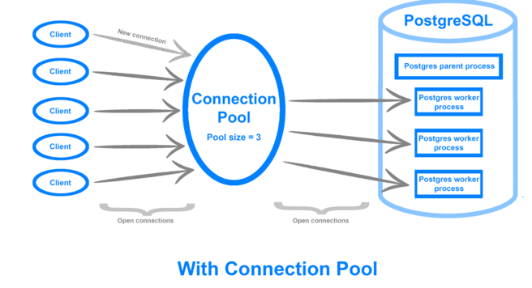

# 📌 Database Connection Pool(DBCP)
****

### 🤔 Connection Pool 이란?
연결 풀이란 데이터베이스에서 추가 요청이 필요할 때 연결을 재사용 할 수 있도록 관리되는 데이터베이스 커넥션의 캐시이다.
미리 Connection 을 생성해두고 Connection 이 필요할 때마다 Pool 에서 연결정보를 가지고와 사용한다.

### 🤔 왜 사용하는가?
각 사용자마다 연결을 생성하고 유지보수 하는 것은 비용이 많이들고 많은 자원이 낭비되게 된다. 때문에 미리 생성해두고 풀에서 꺼내서 사용하게 된다면
생성하는 비용이 절약되고, 사용자와 연결을 수립하는데 걸리는 시간을 줄여준다.

Connection Pool은 데이터베이스 연결 정보를 캐시(메모리 영역)에 저장하여 커넥션 정보가 필요할 때마다 연결 정보를 꺼내와 사용할 수 있도록 해준다.

커넥션 풀을 사용하지 않는다면 커넥션을 맺은 후 종료될 때 해당 커넥션은 Closed 시킨다. 하지만 커넥션 풀을 사용한다면 커넥션 풀에서 연결정보를 받아 사용하고
모두 사용하게 되면 종료시키지 않고 다시 커넥션 풀에 반환하게 된다.

### 🔑 장점
- 연결 객체를 미리 만들어 두기 때문에 빠른 연결이 가능하다.
- 커넥션의 재사용으로 새로 객체를 생성하는 비용을 절약한다.
- 커넥션의 수를 제한하여 서버자원의 고갈을 방지할 수 있다.

자주 사용되는 DBCP 라이브러리로는 HikariCP, Commons DBCP, TOmcat DBCP 등이 있다.

스프링에서는 이중 HikariCP를 기본으로 사용한다. HikariCP는 빠로가 간단하고, 안정적이며 라이브러리가 매우 가볍다고 주장하는 라이브러리 이다.
HikariCP 에서는 속도 향상을 위해 바이트코드 수준의 설계를 하였고, JIT의 기계어 출력 까지 생각하였다고 한다.
> HikariCP: https://github.com/brettwooldridge/HikariCP/wiki/Down-the-Rabbit-Hole

   
> https://blog.naver.com/PostView.nhn?isHttpsRedirect=true&blogId=ssang8417&logNo=221858327113&categoryNo=24&parentCategoryNo=0&viewDate=&currentPage=1&postListTopCurrentPage=1&from=postView