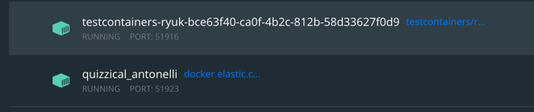

## 📌 Elasticsearch?
*Apache Lucene 기반의 Java 오픈소스 분산 검색 엔진으로, 방대한 양의 데이터에에서 빠른 속도로 저장, 검색, 분석이 가능한 엔진이다.
> 💡 Apache Lucene? 자바 언어로 이루어진 정보 검색 라이브러리 자유-오픈 소스 소프트웨어 

inverted index 방식을 사용하여 빠른 속도로 검색할 수 있다.    
그냥 index 방식과는 무엇이 다른가? 보동의 RDB에서는 테이블 구조로 데이터를 저장하기 떄문에 특정 키워드를 찾고자 한다면, 모든 문서들을 탐색하며 해당 키워드가
들어있는 문서들을 찾아 가져올 것이다. 이것은 인덱스를 사용하더라도 탐색하는 문서가 줄어들 뿐 마찬가지이디다.     
하지만 역색인 방식에서는 text들을 추출하여 해당 텍스트가 어떤 문서에 저장되어있는지를 나타내는 방식으로 데이터를 저장하기 때문에 특정 데이터를 탐색할 때 빠른 속도를 보인다.

> ES는 어떤 텍스트가 어떤 문서에 있는지, RDB는 어떤 문서에 어떤 데이터가 있는지.

- #### RDBMS
  | ID | Text |   
  |-----|-----|
  |doc1|AB|
  |doc2|A|
  |doc3|BC|

- #### Elasticsearch
  | Text | ID |
  |------|----|
  |A|doc1, doc2|
  |B|doc1, doc3|
  |C|doc3|

- ### 👆 RDB 와의 비교
  | RDB | ES |
  |----|----|
  | Database | Index |
  | Table | Type |
  | Row | Document |
  | Column | Field |
  | Schema | Mapping |
  | Pysical partition | Shard |


## 🧐 클러스터와 샤드
클러스터란 하나 이상의 노드가 모인 것으로, 포함된 노드에서 통합된 색인화, 검색을 가능하게 한다.     
디스커버리 과정에 의해 노드들은 클러스터로 바인딩 된다.(클러스터명을 기준으로)       
노드간의 통신은 93xx 포트에서 이루어진다. 일반적으로는 1개의 물리 서버에 하나의 노드를 실행하는 것을 권장하나, 하나의 서버에서 여러개의 노드를 실행하는 것 또한 가능하다.

샤드는 데이터를 수평 분할한 조각으로, 여러 샤드에 데이터를 분산하고, 병렬처리하여 검색 처리량을 늘릴 수 있다.   
인덱스를 생성할때의 샤드의 생성 수의 기본값은 1인다. (6.x 이하는 5개), 클러스터에 노드를 추가하면 샤드들이 각 노드로 분산되게 되고,    
기본적으로 1개의 `Replica`를 생성한다. 레플리카는 원본인 샤드와 다른 노드에 저장되게 된다. 레플리카는 원본 샤드의 유실이 일어났을 때 이를 대체한다.    
다음과 같이 샤드와 레플리카 수를 세팅할 수 있다. 
```
curl -XPUT "http://localhost:9200/users" -d'
{
  "settings": {
    "number_of_shards": 4,
    "number_of_replicas": 1
  }
}'
```
> 💡 Spring Boot 에서 ES를 사용하게 되면 샤드와 레플리카 수의 세팅 애노테이션은 Deprecated 되어있다.

- ## 🧐 CRUD
  Elasticsearch 는 Http API 기반으로 동작하며 데이터의 삽입은 `PUT`, 조회는 `GET`, 수정은 `POST` 삭제는 `DELETE`로 이루어진다.

  - ### 👆 PUT
    - 6.x 이전 버전 까지는 `http://HOST:PORT/${index}/{doc type}/${doc_id}`  
    - 7.0 부터는 `Type`의 개념이 제거되고 `_doc` 으로 고정 접근한다. `http://HOST:PORT/${index}/_doc/${doc_id}`
    ```
    curl -XPUT http://localhost:9200/users/_dox/1 -H 'Content-Type: application/json' -d '
    {
        "name": "kim",
        "age": 26
    }'
    ```
      - `-H`: 헤더 추가.
      - `-d`: json 형식으로
      - 처음 PUT을 보내면 result에 created로 표시되고, 동일한 url에 다른 document를 다시 입력하면 기존 문서를 덮어씌우게 된다. 이떄는 update로 표기된다.
      - 고정자 `_doc` 대신 `_create`를 사용하여 기존의 문서가 없을 때문 새로 추가하는 것을 허용하도록 할 수 있다.
  
  - ### 👆 POST
    - PUT과 유사하게 데이터 입력에 사용가능하다. PUT 과는 달리 ID의 자동 생성이 가능하다. 이 때는 ID를 명시해주지 않으면 된다.    
    `http://HOST:PORT/${index}/_doc` 기본적으로 String 타입의 랜덤한 값이 id로 지정된다.
    
    - `_updata`를 사용하여 기존의 문서를 덮어 씌우지 않고 일부분만을 수정할 수 있다.
    ```
    POST http://localhost:9200/users/_update/1 -d '
    {
        "doc": {
           "age": 27
        }
    }'
    ```
  
  - ### 👆 GET
    - #### id로 조회.
      - `curl -XGET http://HOST:PORT/${index}/_doc/${doc_id}`
      
    - #### index 문서 전체 조회.(_search)
      - `curl -XGET http://HOST:PORT/${index}/_doc/_search?pretty}`
    - #### 특정 필드값으로 조회.(_search)
      - `curl -XGET http://HOST:PORT/${index}/_doc/_search?q=name:kim&pretty}`
      - `curl -XGET http://HOST:PORT/${index}/_doc/_search?q=name:kim AND park&pretty}`
    - #### 특정 값으로 조회.(_search)
      - `curl -XGET http://HOST:PORT/${index}/_doc/_search?q=kim AND park&pretty}`
        - AND, OR, NOT 의 논리 연산이 사용가능하며 대문자로 사용.
  
    - #### 데이터 본문으로 조회 (match 쿼리)
      ```
      curl -XGET http://HOST:PORT/${index}/_search
      {
        "query": {
          "match": {
            "name": "kim"
          }
        }
      }
      ```
      
    - #### 여러 인덱스를 조회
      - `curl -XGET http://HOST:PORT/${index1}, ${index2}/_search}`
      - `curl -XGET http://HOST:PORT/*/_search}` (와일드카드 사용)
      

  - ### 👆 DELETE
    - 아이디로 문서 삭제
      - `curl -XDELETE http://HOST:PORT/${index}/_doc/${doc_id}`
    - 인덱스 전체 삭제
      - `curl -XDELETE http://HOST:PORT/${index}`


- ### 👆 Bulk
  따로 따로 수행하는 것보다 한번에 실행하기 때문에 속도가 훨씬 빠르다. 그러나 Elasticsearch에는 커밋, 롤백의 트랜잭션 개념이 없기 때문에
  벌크 작업중 의도치 않게 중단되었다면 어디까지 연산이 진행되었는지 확인할 수 없다. 따라서 전체 인덱스를 삭제하고 다시 하는 것이 안전하다.
  - `POST _bulk` 또는 `POST ${index}/_bulk`
  - 파일을 내용을 저장하기
    - POST --data-ninary@*.json
    
  
  
      
    
  
  
## 📌 Docker 로 시작하기

- install docker image
    ```
    docker pull docker.elastic.co/elasticsearch/elasticsearch:8.1.0
    ```
    현재 Spring Boot 2.6.4 기준으로 spring-data-elasticsearch는 4.3.2가 추가되고, 해당 버전에 맞는 엘라스틱서치 버번은 7.15.2 이다.
    > 호환성 확인: https://docs.spring.io/spring-data/elasticsearch/docs/current/reference/html/#new-features

- Create new docker network
    ```
    docker network create elastic
    ```

- Start Elasticsearch
    ```
    docker run --name cxdatalogES -d -p 9200:9200 -p 9300:9300 -e "discovery.type=single-node" docker.elastic.co/elasticsearch/elasticsearch:7.10.0
    ```
    9200번 포트는 http 통신신을 위해, 9300은 노드간의 통신을 위해 사용된다.    


## 📌 Spring Data Elasticsearch

- #### 의존성 추가
    ```
    implementation 'org.springframework.boot:spring-boot-starter-data-elasticsearch'
    ```

- ### Configuration
    ```java
    @EnableElasticsearchRepositories
    @Configuration
    public class ElasticsearchConfig extends ElasticsearchConfigurationSupport {
    
        @Bean
        public RestHighLevelClient elasticsearchClient() {
            ClientConfiguration clientConfiguration = ClientConfiguration.builder()
                .connectedTo("localhost:9200")
                .build();
    
            return RestClients.create(clientConfiguration).rest();
        }
    }
    ```
    - @EnableElasticsearchRepositories 로 뒤에서 사용한 ElasticsearchRepository의 사용을 활성화 시켜준다.
    - 일반적으로 사용하는 RestHighLevelClient를 사용한다.
    - 엘라스틱 서치를 띄운 9200포트를 지정해준다.
    
- ### Document
    ```java
    @NoArgsConstructor
    @Getter
    @Document(indexName = "data_logs")
    public class DataLog {
    
        @Id
        private String id;
        
        private String ordNo;
        ...
    
        @PersistenceConstructor
        public DataLog(final String ordNo) {
            this.ordNo = ordNo;
        }
    }
    ```
    - JPA의 엔티티와 유사하다.
    - 그러나 Id 는 기본적으로 String 타입으로 자동생성된다.
    - @PersistenceConstructor: ES에서 데이터를 객체화 할 때 사용할 생성자, 변수 이름에 의해 매핑된다.
    
- ### Repository
    ```java
    public interface DataLogRepository extends ElasticsearchRepository<DataLog, String> {
    
        List<DataLog> findByOrdNo(String ordNo);
    }
    ```
    - JPA와 유사하게 사용할 수 있다.
    - 그러나 @Query 를 이용한 쿼리의 작성은 JSON 형식이다.


### 🧐 Elasticsearch TestContainer

- 의존성 추가.
```groovy
testImplementation 'org.testcontainers:elasticsearch:1.16.3'
testImplementation 'org.testcontainers:junit-jupiter:1.16.3'
```
docker는 기본적으로 설치되어있어야 한다.

- Config
```java
@EnableElasticsearchRepositories
@TestConfiguration
public class TestConfig {

    public ElasticsearchContainer elasticsearchContainer() {
        ElasticsearchContainer elasticsearchContainer = new ElasticsearchContainer(
            "docker.elastic.co/elasticsearch/elasticsearch:7.10.0");
        elasticsearchContainer.start();

        return elasticsearchContainer;
    }

    @Bean
    public RestHighLevelClient elasticsearchClient() {
        ClientConfiguration clientConfiguration = ClientConfiguration.builder()
            .connectedTo(elasticsearchContainer().getHttpHostAddress())
            .build();

        return RestClients.create(clientConfiguration).rest();
    }
}
```
config 파일을 작성한다. 사용할 엘라스틱서치의 버전을 명시.


```java
@SpringBootTest(webEnvironment = SpringBootTest.WebEnvironment.RANDOM_PORT, classes = {TestConfig.class})
class ElasticsearchTest {
    ...
}
```
RANDOM_PORT 로 포트를 설정하여 띄워주고, 이전에 만들어준 Config 파일을 읽도록 설정한다.

#### 기존의 Elasticsearch Config 와 충돌
```yml
spring:
  profiles:
    active: test
```
기존의 Elasticsearch Config 의 실행을 profile이 Test가 아닐때만 실행하도록 한다던지 하고, Test를 진행할 때에는 Test profile로 실행하도록 설정한다.
- 도커 컨테이너가 띄워지고, 테스트가 종료되면 내려간다.




<br><br>
### 🔑 참조
> - https://www.elastic.co/guide/en/elasticsearch/reference/current/docker.html
> - https://esbook.kimjmin.net
> - https://docs.spring.io/spring-data/elasticsearch/docs/current/reference/html/#new-features
> - https://tecoble.techcourse.co.kr/post/2021-10-19-elasticsearch/
