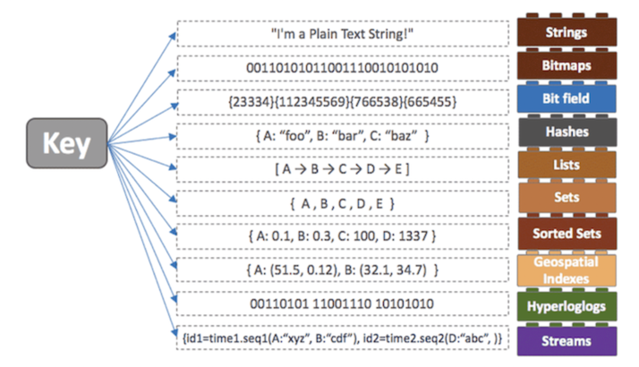

## ? Redis란?
Key-Value의 데이터를 저장하고 관리하기 위한 비관계형 데이터베이스 관리 시스템으, 영속성을 지원하는 인메모리 데이터 저장소이다.    
메모리에 데이터를 저장하고 조회하기 때문에 속도가 빠르다. 그러나 디스크에 저장하여 데이터의 지속성을 보장할 수도 있다.

<br>

### ? Redis가 지원하는 다양한 데이터타입


<br>

### ? Client: Lettuce vs Jedis
기존에는 jedis를 많이 사용했으나 멀티 쓰레드 불안정성, Pool의 한계 등으로 Lettuce로 넘어가는 추세,
Jedis는 멀티 쓰레드 환경에서 인스턴스를 공유함에 있어 thread-safe 하지 않아 추가적인 고려가 필요하다.(thread-pool)
Lettuce는 thread-safe 할 뿐더러, Netty 기반이기 때문에 비동기도 지원한다.

성능면에서도 Lettuce 가 CPU 사용률이나, 커넥션 수, 응답속도면에서 압도적인 성능차이를 보인다.(최소 수 배)

Spring Boot 2.x 부터는 Lettuce를 기본 의존성으로 추가한다. (Jedis를 사용하고 싶다면 이를 제거하고, Jedis를 등록해야한다.)

```java
@RequiredArgsConstructor
@EnableRedisRepositories
@Configuration
public class RedisConfig {
 
    private final RedisProperties redisProperties;
 
    @Bean
    public RedisConnectionFactory redisConnectionFactory() {
        return new LettuceConnectionFactory(redisProperties.getHost(), redisProperties.getPort());
    }
 
    @Bean
    public RedisTemplate<String, Object> redisTemplate() {
        final RedisTemplate<String, Object> redisTemplate = new RedisTemplate<>();
 
        redisTemplate.setConnectionFactory(redisConnectionFactory());
        redisTemplate.setKeySerializer(new StringRedisSerializer());
        redisTemplate.setValueSerializer(new StringRedisSerializer());
 
        return redisTemplate;
    }
}
```

<br>

### ? RedisRepository, RedisTemplate
Repository가 조금 더 추상화된 개념, 사용하기는 쉽겠지만, 인터페이스의 생성해야 하고, 저장 객체 또한 클래스를 생성해야한다.
복잡한 데이터를 저장하는 것이 아닌 단순 key-value 쌍을 저장하기 위해서 클래스를 생성하는 것 보다는 Template를 사용하는 것이 나을 것 같다.

Template를 사용한다면,    
opsForValue, opsForList, opsForSet, opsForZSet, opsForHahs 등의 직렬화/역직렬화 메서드를 이용하여 set, get이 가능하다. (3번째 인자로 만료시간을 줄 수 있다.)

<br>

### ? 테스트를 위한 EmbeddedRedis
> - com.github.kstyrc ? embedded-redisApache
> - it.ozimov ? embedded-redis

기존에는 kstryc 를 많이 사용하였으나 업데이트를 안한지 오래되어 it.ozimov에서 이를 포크하여 만들었다.

```groovy
testImplementation 'it.ozimov:embedded-redis:0.7.3'
```
```java
@RequiredArgsConstructor
@Profile("test")
@Configuration
public class RedisTestConfig {
 
    private final RedisProperties redisProperties;
    private RedisServer redisServer;
 
    @PostConstruct
    public void redisServer() throws IOException {
        redisServer = new RedisServer(redisProperties.getPort());
        redisServer.start();
    }
 
    @PreDestroy
    public void stopRedis() {
        if (redisServer != null) {
            redisServer.stop();
        }
    }
}
```
설정 후 application-test.yml 을 만들고 기존에 띄운 redis와 다른 포트에 띄우기 위해 redis의 host와 port를 127.0.0.1, 6378로 설정해주었다. ( redis의 디폴트 port는 6379)

<br><br>

### ? 참조
> - https://redis.io/docs/
> - https://devlog-wjdrbs96.tistory.com/374
> - https://jojoldu.tistory.com/418
