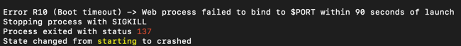

> heroku remote 등록
```heroku git:remote -a {appname}```


## 📌 invalid source release: 11
***

- heroku로 push 후 빌드중에 발생한 에러.
- runtime java version을 명시해주기 위해 최상위 디렉토리에 system.properties 생성.

```properties
java.runtime.version=11
```

## 📌 no main manifest attribute
****

no main manifest attribute, in build/libs/webrtc-0.0.1-SNAPSHOT-plain.jar

- 최 상위에 Procfile 생성.
```
web: java -Dspring.server.port=8080 $JAVA_OPTS -jar build/libs/webrtc-0.0.1-SNAPSHOT.jar
```
- 포트 및 build 파일 지정.
- property 옵션 등 지정 가능.

## 📌 Web process failed to bind to $PORT within 90 seconds of launch
****

- 지정해준 포트와 실행 포트가 달라서 발생
- application.properties에 
```properties
 server.port=${port:8080}
```