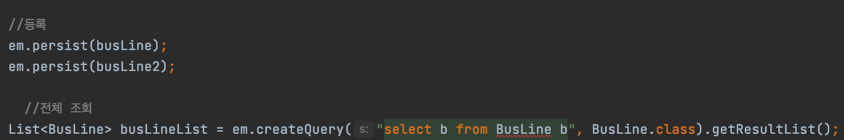

## Hibernate 조회 문제 발생.
****

> Hibernate를 이용하여 데이터를 저장하고, 저장된 데이터를 조회하는 과정에서 조회가 되지 않는 문제가 발생 했다.
>  저장하고 트랜젝션 커밋을 하기 전에 조회했을 때에는 조회가 잘 되지만, 다음에 저장된 데이터를 조회할 때 문제가 발생 하였다.

:: 해당 이미지는 한 트랜젝션 안에서 수행된다. 저장된 데이터를 엔티티에 주입할때 문제가 생기는 것이라고 생각했고, Hibernate의 데이터 주입 방법을 알아 보았다.

:: Hibernate는 리플랙션으로 엔티티 클래스의 필드에 접근하여 데이터를 주입하고, 이를 위해서는 객체를 생성하기 위한 Default Constructor가 필요했다.     
때문에 엔티티 클래스를 다시 살펴보았고 Default Constructor 가 작성되어있지 않은것을 확인하여 수정하였다.

    - 방금 저장한 데이터는 조회가 가능했던 이유는 한 트랙젝션 안에서 실행했기 때문에
    테이블에 접근하여 데이터를 불러오는 것이 아니라, 영속성에 의해 해당 정보를 바로 사용할 수 있었기 때문인 것 같다.

    - 어떻게 엔티티 클래스에 접근을하고, Setter 없이 private 필드에 데이터를 주입하는지 궁금했는데,
    리플렉션에 대해 알게되니까 조금 이해가 간다. 

