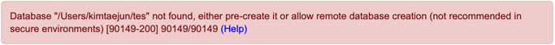
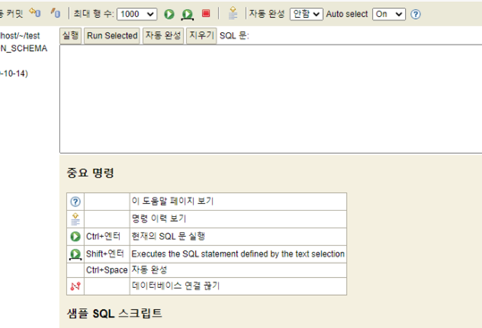

## Database not found Error
*******
h2 데이터 베이스가 인메모리 뿐만아니라 서버모드로 실행이 가능하다는 것을 보고 시도해보았다.
http://www.h2database.com로 접속하여 다운로드를 받은 후 
h2.sh 파일을 실행시켰다.

> h2 데이터베이스 1.4.200 버전을 사용할때 연결 에러가 발생하였다.
> 

DB파일이 생성되지 않아 발생하는 에러였는데.기존에는    
url : jdbc:h2:~/test 로 접속하면 자동으로 경로상에 파일이 생성되었다. 하지만 최신 버전에서는 보안상의 이유로
이러한 생성이 불가능 했고, 수동으로 경로에 파일을 생성해주었다.

:: 해당 파일을 생성하고 jdbc:h2:tcp://localhost/~/test로 접속하니 서버모드로 잘 실행 되었다.

:: 추가로 ip주소로 연결이 실패한다면 localhose:8082로 접속하면 정상적으로 연결이 된다.