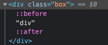

## 📌 기본 지식
### 🧐 웹 표준
웹에서 사용되는 표준 기술이나 규칙. W3C의 표준 제정 단계의 권고안에 해당하는 기술.

### 🧐 크로스 브라우징
조금씩 다르게 구성된 브라우저들 에서 동일한 사용자 경험을 줄 수 있도록 하는 기술.

### 🧐 웹 이미지

- #### 👆 비트맵(Bitmap)
  - 픽셀이 모여 만들어진 정보의 집합, 레스터(Raster) 이미지라고도 부름.
  - 정교하고 다양한 색상을 자연스헙게 표현
  - 확대 축소시 계단 현상, 품질 저하.
  - 종류
    - jpg
      > 손실압축, 24비트, 1600만 색상, 용량을 쉽게 조절 가능. 
    - png
      > 비손실 압축, 8비트/24비트 , 투명도 지원, W3C 권장 포맷.
    - gif  
      > 비손실 압축, 여러 이미지를 한 개의 파일에 담을 수 있음(애니메이션), 8비트 색상만 지원.(다양한 색상 표현 x)
    - WEBP
      > - jpg, png, gif 를 모두 대체할 수 있는 이미지 포맷.
      > - 완벽한 손실/비손실 압축, 애니메이션, 투명도 지원.
      > - IE 에서는 지원하지 않음.

 
- #### 👆 벡터(Vector)
  - 점, 선, 면의 위치, 색상 등 수학적 정보의 형태로 이루어진 이미지.
  - 정교한 이미지를 표현하기 어려움.
  - svg
    > - 마크업 언어 기반의 벡터 그래픽을 표현.
    > - 해상도의 영향에서 자유로움
    > - CSS, JS로 제어 가능.
    > - 파일 및 코드 삽입 가능.(태그와 수학적 정보를 활용.)


    
## 📌 HTML(HyperText Markup Language)
### 🧐 Element: 요소
```<tag>content</tag>```

태그 안에 또 다른 태그가 포함될 수 있는데 이를 하위(후손)요소, 상위(조상) 관계라고 한다.  상위 하위 요소는 상,하위의 모든 요소를 표현하며,
바로 한 단계의 하위, 상위 요소는 자식, 부모요소 라고 표현한다.

예를들어
```html
<tag1>
  <tag2>
    <tag3></tag3>
  </tag2>
</tag1>
```
와 같은 관계에서 tag 3은 tag 2의 자식요소 이고, tag1 과 tag2 는 tag3의 조상 요소 이다.

- #### 👆 빈 태그(Empty Tag)
  ```html
  <tag> <!-- HTML 1~5 편리함. -->
  <tag/> <!-- XHTML / HTML5 안전함. -->
  ```

- #### 👆 태그의 속성
  ```html
  <tag attribute="value">
  ``` 
  열리는 태그에는 속성을 사용할 수 있다. img 태그의 src alt 등 ..

- #### 👆 Inline 과 Block
  요소가 화면에 출력되는 속성으로 인라인 요소는 글자를 만들기 위한 요소(span 등..)이고, block 요소는 상자(레이아웃)을 만들기 위한 요소(div 등..)이다.
  
  > 
  
  - **Inline**
    - 기본적으로 포함한 컨텐츠의 크기만큼 자동으로 크기가 조절된다.(가로 세로 사이즈를 가질 수 없음.)
    - padding, margin 또한 좌, 우만 가능.
    - 자식으로 블록 요소가 올 수 없다.
    
  - **Block**
    - 가로 길이는 부모요소의 크기만큼 자동으로 늘어나 수직으로 쌓인다.
    - 세로 길이는 컨텐츠의 크기에 맞춰짐.
    - 그러나 width, height 속성을 이용하영 크기를 조절할 수 있다.


### 🧐 기본 태그 요소

- #### ```<!DOCTYPE html>``` : Doctype(DTD: Document Type Definition)
  > 문서의 HTML 버전을 지정. 웹 브라우저가 어떤 HTML 버전의 해석 방식으로 페이지를 해석하면 되는지 알려주는 역할.

- #### ```<html>```
  > html 문서의 시작, 종료 지점. 즉, 범위를 브라우저에게 알려줌.

- #### ```<head>```
  > 웹 브라우저가 해석해야할 제목, 설명, 사용할 파일 위치, 스타일 등의 웹 페이지에 보이지 않는 정보를 작성하는 범위.

- #### ```<body>```
  > 문서의 구조를 나타내는 범위. 사용자 화면을 통해 보여지는 영역(로고, 헤더, 푸터, 내비게이션, 메뉴, 이미지 등..)

- #### ```<link rel="" href="">```
  > - 이미지, css 문서 등 외부 문서를 가져와 연결.
  > - rel: 가져올 문서와 관계(css: stylesheet, 파비콘: icon ..)
  > - href: 외부 파일의 경로

- #### ```<style>```
  > html 문서 안에서 css 문법을 사용할 수 있는 범위.

- #### ```<script src="./main.js"></script>```
  > - javascript 파일 연결.
  > - 또는 src를 사용하지 않고, 해당 태그 안에 js를 직접 작성할 수 있다.
  > - script 태그를 head 태그 내에 작성하면 아직 body가 로드되지 않았기 때문에 태그를 읽어올 수 없는 등의 문제가 생긴다.
  > 이 때, **defer** 라는 속성을 이용하여 body가 모두 로드된 후에 가져오도록 지정할 수 있다.

- #### ```<meta name="" content="">```
  > 제작자, 내용, 키워드, viewport 등의 정보를 검색 엔진이나 브라우저에게 제공한다.


- #### ```<div></div>```
  > - 특별한 의미가 없는 구분을 위한 블록 요소, Division

- #### ```<h1></h1>```
  > - 제목을 의미하는 블록 요소, Heading
  > - h1~h6 까지 존재.

- #### ```<p></p>```
  > - 문장을 의마하는 블록 요소 Paragraph
  
- #### ```<ul></ul```
  > - Unordered List, 순서가 필요 없는 목록의 집합을 나타내는 블록 요소.
  > - 한 개 이상의 li 태그가 필요.

- #### ```<li></li>```
  > -  List Item, 목록 내 각 항목을 나타내는 블록 요소.
  > - ul 태그로 감싸져 있어야 한다. 

- #### ```<span></sapn>```
  > 특별한 의미가 없는 구분을 위한 인라인 요소.
  
- #### ``````
  > - 이미지를 넣을 수 있는 인라인 요소.
  > - 태그 뿐만 아니라 css 문서에서 ```background: url("")``` 을 이용하여 이미지를 추가할 수도 있다.

- #### ```<a href=""></a>```
  > - Anchor(닻), 링크를 나타내는 인라인 요소.
  > - 💡 브라우저에서는 디렉토리에서 가장 먼저 index.html 을 찾는다 때문에 링크 경로에 디렉토리까지만 명시하면 자동으로 index.html 을 찾아간다.
  > - target 속성을 이용하여 새 탭에서 열지(_blank), 새로운 창에서 열지 등을 명시할 수 있다.

  - 경로를 디렉토리로 로 명시했는데 index.html 파일이 존재하지 않는다면 어떤 화면이 출력될까?
    > Live Server 에서는 아래와 같이 이미지와 같이 해당 디렉토리에 있는 파일 목록과 상위 디렉토리로 갈 수 있는 링크가 출력되었다.
    >
    > 
  
- #### ```<br/>```
  > 줄바꿈을 위한 인라인요소, Break
  
- #### ```<input type=""/>```
  > - 사용자가 데이터를 입력하는 Inline-block 요소.
  > - 인라인 요소의 특징 + 블록 요소의 특징(가로, 세로, 위 아래 여백 지정 가능.)
  > - type
  > > - text : 텍스트를 입력 받는다, value, placeholder 등의 속성을 사용할 수 있다.
  > > - checkbox : <lable> 태그를 이용하여 checkbox의 라벨링 가능, checked 속성으로 미리 체크해둘 수 있다.
  > > - radio : 같은 그룹(name 속성의 값이 같은) 중 하나만 선택 가능한 선택 옵션.
  
- #### ```<table></table>```
  > - 행과 열의 집합. 테이블 요소.
  > - ```<tr><td></td><td></td></tr>```


### 🧐 전역 속성
body 태그 내의 모든 요소에서 사용할 수 있는 속성

- #### title
  > 브라우저에서 해당 요소에 마우스 커서를 올렸을 때 나오는 툴팁. 요소의 정보나 설명을 지정한다.

- #### style
  > 요소의 CSS 스타일을 지정.

- #### class
  > 요소를 지칭하는 **중복 가능한** 이름.

- #### id
  > 요소를 지칭하는 **고유한** 이름

- #### data-{name} = "{data}"
  > 요소에 데이터를 지정.
  ```html
  <div data-fruit-name ="apple">사과</div>
  <div data-fruit-name ="banana">바나나</div>
  ```
  ```js
  const els = document.querySelectorAll('div');
  els.forEach(el => {
      console.log(el.dataset.fruitName) //fruit-name -> 카멜케이스로 변경됨.
  })
  ```
  
## 📌 CSS(Cascading Style Sheets)
```선택자 {속성: 값;}```

### 🧐 CSS 선언 방식
- #### 내장 방식
  > - HTML 문서에서 ```<style></style>``` 을 이용하여 스타일을 작성하는 방식.
  > - 유지보수 측면에서 권장하지 않는 방식.

- #### 인라인 방식
  ```html
  <div style="color: red; margin: 20px;"></div>
  ```
  와 같이 HTML의 요소에 style 속성을 이용하여 스타일을 작성하는 방식. 우선순위가 매우 높으므로 사용에 주의.
  
- #### 링크 방식
  ```html
  <link rel="stylesheet" href="./main.css">
  ```
  와 같이 link 태그를 이용하여 CSS 문서를 연결하는 방식이다. 병렬 연결 방식.

- #### @import
  ```css
  @import url("./sub.css");
  ```
  **CSS 문서**에서 @import 규칙으로 또 다른 CSS 문서를 가져와 연결하는 방식이다. 직렬 연결 방식.    
  언뜻 보면 앞의 문서가 다른 문서를 import 하기 때문에 import 되는 문서가 스타일을 덮어 씌워 우선순위를 가져갈 것 같지만, 실제로는 앞의 문서가 우선순위를 가진다.(가까울 수록 우선순위가 높다.)
  
  앞의 CSS 문서가 모두 해석되기 전까지는 import 된 문서는 아직 해석하지 않는다. 때문에 지연이 발생하고, 이를 고의로 활용할 수도 있다.    
  하지만, 이러한 경우가 아니라면 병렬 연결 방식을 권장한다.


### 🧐 CSS Selector

#### 👆 기본 선택자
- ```*``` : 전체 선택자(Universal Selector), 모든 요소를 선택.
- ```{tagName}``` : 태그 선택자(Type Selector), 태그 이름에 해당하는 요소 선택.
- ```.{className}``` : 클래스 선택자(Class Selector), class 속성의 값에 해당하는 요소 선택.
- ```#{idName}``` : 아이디 선택자(Id Selector), id 속성 값에 해당하는 요소 선택.

#### 👆 복합 선택자
- **일치 선택자**(Basic Combinator)
  > 선택자 A와 B를 동시에 만족하는 요소.  
  ```css
  div.test {...} /* div 요소이면서 class 속성의 값이 test인 요소. */
  ```

- **자식 선택자**(Child Combinator)
  > 선택자 A의 자식 요소 B 선택.
  ```css
  div > span {...} /* div 태그의 자식인 span  */
  ```
  
- **하위(후손) 선택자**(Descendant Combinator)
  > 선택자 A의 하위 요소 B 선택.
  ```css
  div span {...} /* div의 안에 있는(후손인) span */
  ```
  
- **인접 형제 선택자**(Adjacent Sibling Combinator)
  > 선택자 A의 다음 형제 요소 **하나**를 선택
  ```html
  <ul>
    <li>1</li>
    <li class="A">2</li>
    <li>3</li>
    <li>4</li>
  </ul>
  ```
  ```css
  .A + li {...} /* class 속성 값이 A인 요소의 다음 형제, 위의 예시에서는 3이 들어있는 li 요소. */
  ```

- **일반 형제 선택자**(General Sibling Combinator)
  > 선택자 A의 다음 형제 요소 **모두**를 선택
  ```html
  <ul>
    <li>1</li>
    <li class="A">2</li>
    <li>3</li>
    <li>4</li>
  </ul>
  ```
  ```css
  .A ~ li {...} /* class 속성 값이 A인 요소의 다음 형제 모두를 선택, 위의 예시에서는 3, 4 */
  ```
  
#### 👆 가상 클래스 선택자(Pseudo-Classes Selector)
- ```A:hover``` : 마우스를 요소에 올렸을 때 적용.
  > 💡 A 요소에서 transision 속성을 이용하여 부드럽게 전환이 가능하다.

- ```A:focus``` : 포커스 되면 동작. input, textarea 요소 등..
  > 💡 focus가 가능하지 않은 요소의 html 속성에 tabindex="-1"를 부여하면 focus가 가능해진다.

- ```A:active``` : 마우스를 **클릭하고 있는 동안** 적용.
  
- ```A:first-child``` : 선택자 A가 형제 요소중 첫째라면 선택.
  ```html
  <div>
    <span>1</span>
    <span>2</span>
    <span>3</span>
  </div>
  ```
  ```css
  div span:first-child{...}  /* div의 후손중, span이고 형제중 첫번째. span 태그중 1이 선택된다. */
  ```
  만약,
  ```html
  <div>
    <div>...</div>
    <span>1</span>
    <span>2</span>
    <span>3</span>
  </div>
  ```
  와 같은 상황이라면 선택되는 요소는 존재하지 않는다.
  
- ```A:last-child``` : 선택자 A가 형제 요소중 마지막 요소라면 선택.
- ```A:nth-child(n)``` : 선택자 A가 형제 요소중 n 번째라면 선택.
  > nth-child(2n) 과같이 짝수, 2n+1과 같이 홀수, 3n 과 가티 3의 배수 번째로 선택도 가능하다. n은 0부터 시작한다.
  > n+2, n+3 과 같이 다양한 산술 표현 가능.

- ```A:not(B)``` : 부정 선택자(Negation), 선택자 B가 아닌 A 요소 선택.
  ```css
  span:not(.none) /* span 태그중 클래스 속성값이 none 인 요소를 제외한 나머지 요소. */
  *:not(span) /* span 요소를 제외한 모든 요소 */
  ```
  
#### 👆 가상 요소 선택자(Pseudo-Elements)
- ```A::before``` : 선택자 A 요소의 내부 앞에 내용을 삽입. 값을 비워두더라도 항상 content 속성을 사용해야 한다.
  ```css
  .box::before{
    content: "앞에 올 내용!"
  }
  ```
- ```A:after``` : 선택자 A 요소의 내부 맨 뒤에 내용을 삽입.
  >               
  개발자 도구에서 확인해 보면 ::before, ::after 로 가상요소가 생성된 것을 확인 할수 잇고, 해당 자리에 content의 값이 들어간다.     
  가상 요소는 인라인 요소이지만 display 속성을 이용하여 block 요소로 변경한 후 다양한 모양으로 만들어 활용이 가능하다.

- ``````