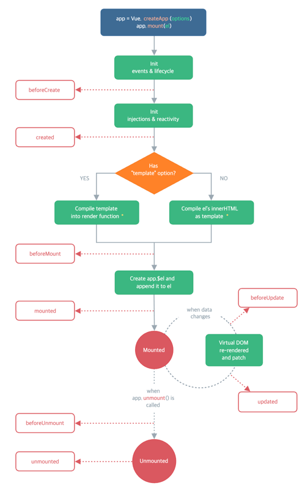

## 🧐 시작하기
> https://v3.ko.vuejs.org/guide/introduction.html

```html
<script src="https://unpkg.com/vue@next"></script>
```

### 👆 선언적 렌더링과 입력 핸들링

```js
const app = Vue.createApp({
  data() {
    return {
      counter: 100,
      tooltip: "wheel up and down ~~ "
    }
  },
  methods: {
    increase() {
      this.counter +=1
    }
  }
})
app.mount('#bigave')
```

```html
<div id="bigave">
    <h1 @wheel = "increase" :title="tooltip"> {{ counter }}</h1>
</div>
```

- `Vue.createApp`: Vue app을 생성한다. 이렇게 생성된 앱은 특정 html 요소에 mount 되어 사용된다.
- `mount`: html 요소에 vue app을 연결한다. 해당 영역에서만 vue 관련 문법을 사용할 수 있다.
- `data()`: 데이터 옵션, `{{ }}` 처럼 텍스트 보간으로 사용할 수도 있고, `v-bind:attr` 과 같이 속성 값으로 바인드하여 사용할 수도 있다. v-bind는 생략 가능하다.
- `methods()`: 메서드 옵션, `v-on:event` 로 메서드를 언제 실행할 것인지 지정 가능하다. `@event` 로 축약 가능하다.


### 👆 반복문과 조건문
```js
const app = Vue.createApp({
  data() {
    return {
      myName: ' kim',
      showMessage: false,
      fruits: ['Apple', 'Banana', 'Cherry']
    }
  },
  methods: {
    showMyName() {
      this.showMessage = true
    }
  }
})
app.mount('#bigave')
```

```html
<h1 v-if="showMessage">{{ myName }}</h1>

<button v-on:click="showMyName">
      Show Name!!
</button>


<ul>
  <li v-for="fruit in fruits"> {{ fruit }} </li>
</ul>
```
- 조건문은 `v-if` 디렉티브를 사용할 수 있다. 값으로는 boolean 값이 들어온다.
- 반복문은 `v-for` 디렉티브를 사용한다. 배열 등 반복 가능한 데이터를 순회하며 HTML 요소를 생성할 수 있다.

## 🧐 라이프사이클 

### 👆 라이프사이클 훅
```js
const app = Vue.createApp({
    data() {
        return {
            message: 'Hello',
        }
    },
    // 라이프사이클 훅
    beforeCreate() {
        console.log(this.message) // 생성되기 전이라 undefined
    },
    created() {
        // vue app이 생성된 직후
        console.log(this.message)
    },
    beforeMount() {
        console.log(document.querySelector('button')) // html 구조와 연결되기 전이라 null
    },
    mounted() {
        // html 구조에 연결된 후
        console.log(document.querySelector('button')) // <button> reverse </button>
    },
})
app.mount('#bigave')
```
- `beforeCreate`: app이 생성되기 전. data를 아직 가져올 수 없는 상태.
- `created`: vue app이 생성된 직후, data에 접근할 수 있다.
- `beforeMount`: html 구조와 연결되기 전. html 요소를 아직 알지 못한다.
- `mounted`: html 구조와 연결된 후. html 요소에 접근할 수 있다.


## 🧐 템플릿 문법
- ### 👆 보간법
    - 이중 중괄호 구문 `{{ }}`
    - `v-once`: 한 번만 데이터를 가져오고, 반응형 연결을 끊는다. 때문에 데이터의 갱신이 이루어져도 반영되지 않는다.(메모리 절약)
        > 데이터의 갱신은 이루어짐에 유의.
    - `v-html=""`: html이 작성된 데이터를 html 구조로 변환해준다.
        > 웹 사이트에서 HTML을 동적으로 렌더링 하는 것은 XSS에 취약하므로 주의가 필요하다.

- ### 👆 속성
    - `v-bind:${attr}`: HTML 속성을 넣어준다.
        ```js
        myStyle: 'color: red; font-size: 100px;',
        ```
        ```html
        <h1 :style="myStyle">MyStyle~</h1>
        ```
        v-bind는 생략할 수 있다.
    
- ### 👆 동적 전달인자.
    `[ ]`를 사용하여 동적으로 인자를 전달할 수 있따.
    ```js
    data() {
        return {
            abc: 'click'
        }
    }
    ```
    ```html
    <h1 @[abc]="method">{{ counter }}</h1> // 클릭할때 method 실행.
    ```
        

  