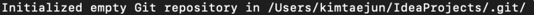
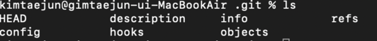
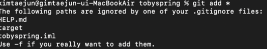
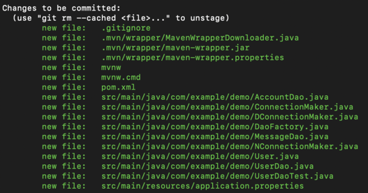
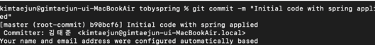
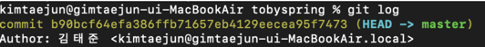
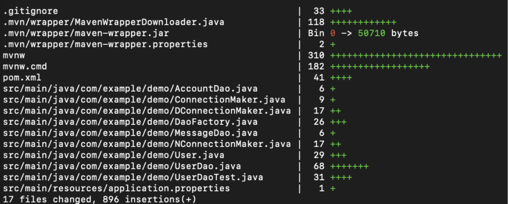
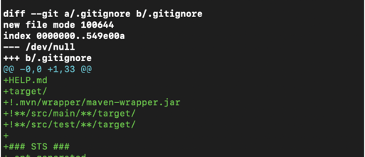

# 📌 Git 기초

## 🧐 Git Object
- Blob: 파일 하나의 내용에 대한 정보.
- Tree: Blob이나 subtree의 메타데이터(디텍토리 위치, 속성, 이름 등)
- Commit: 커밋 순간의 스냅샷.


### 👆 Cloud Remote Repository Sevices
- Giihub
- bitbucket
- GitLab

## 🧐 Git setting
```
git config --global user.name "{name}" 
git config --global user.email "{email}"
git config --global core.editor "{vim}"  // 기본값 nano
git config --global core.pager "{cat}"   // 기본값 less
```

설정 상태는 `git config --list`로 확인 가능하고, `~/.gitconfig`에서도 수정, 확인 가능하다.   
global을 local로 변경하면 해당 디렉토리에서만 사용하는 설정으로도 세팅이 가능하다.

alias 의 설정도 가능하니 자주 쓰는 기능(git log --pretty --color --graph.. 같은)을 alias로 등록해도 좋다.

## 🧐 Conventional Commits
> https://www.conventionalcommits.org/en/v1.0.0/

```
1. commit의 제목은 commit을 잘 설명하는 하나의 구나 절로 완성.
2. Importance of Capitalize
3. prefix 꼭 달기
  - feat: 기능 개발 관련.
  - fix: 오류 개선 혹은 버그 패치.
  - refactor: 리팩토링.
  - docs: 문서화 작업.
  - test: test 관련.
  - conf: 환경설정 관련.
  - build: 빌드 관련.
  - ci: Continuous Integration 관련.
  - BREAKING CHANGE: 툭정 버전이나 api 등이 동작하지 않게 되는 변경사항(Drop support /api/v1)
```
Conventional Commits 은 팀마다 다르기 때문에 이를 참조해야 한다.

## 🧐 Commit 유의 사항.
- commit은 동작 가능한 최소단위로 자주 할 것.
- 해당 작업 단위에 수행된 모든 파일 변화가 해당 commit에 포함되어야 함.
- 모두가 이해할 수 잇는 log를 작성할 것.
- 오픈 소스에서는 영어가 강제되지만, 그렇지 않을 경우 팀 내 언어를 사용할 것.
- 제목은 축약형으로 쓰고(50자 이내), 내용은 문장형으로 작성하여 추가 설명.(이유, 작업 내용)
- 제목과 내용은 한 줄 띄워 분리할 것.(마크다운 언어.)
- 내용은 commit 의 구성과 의도를 충실히 작성할 것.

- `add .`, `commit -m ""` 사용 지양.
# 📌 버전관리 

- ### 👆 git init {dir} : git 으로 관리할 디렉토리    
        
    생략하면 현재 디렉토리를 대상으로 한다.

- ### 👆 .git : git repository       
              


- ### 👆 git add : add to staging area       
    
    blob을 working directory 에서 staging area 에 올린다.
    - `git add ${file}` 
    - `git add *` 로 모든 파일 add 가능   
    - `git add .` 현 디렉토리 모든 파일.(권장하지 않음.)
    - `git add ${dir}`

- ### 👆 git status : working tree status      
    

- ### 👆 git commit : create version
    - git commit 명령어 실행시 뜨는 에디터 창에서 message를 입력(권장.)
    - git commit -m "message"를 사용해도 된다.
    - git commit -am "message" : git add 와 git commit을 한번에

    💡️ untracked 상태인 file은 적용되지 않음.       


- ### 👆 git log : show version    
  

- ### 👆 git log —stat: version에 변경된 file list
  

- ### 👆 git log -p : 마지막 버전과 다른 것.      
  
  - null 은 마지막 버전이 없다는 의미.
  - git log —all : Show All branch.
  - git log —graph: Show branch graph.
  - git log —oneline: 정보를 한줄로 간략하게 표기.

- ### 👆 git diff : show changes
  - add 하기 전에 실행. 마지막 버전과 현재 변경사항을 비교.

- ### 👆 git checkout  {commit id}:go back to previous version
  - 임시적으로 해당 버전으로 옮김. → head가 옮겨감

- ### 👆 git reset : reset to that version(웬만하면 사용하지 맙시다.)
  - head와 master branch모두 옮겨감. 옮겨간 이후의 버전들이 삭제됨. 그러나 내가 지우더라도 해당 파일이
    다른 사람에게 있다면 계속 돌아온다.
  - `git reset —-hard {commit id}` : reset current changes
  - `git reset HEAD {fileName}` : unstaging(add 취소) 그냥 git reset, 모든 파일을 대상으로.
  - `git reset HEAD^` : commit 취소
  - `git commit --amend`: commit message 변경

- ### 👆 git revert {commit id}: 버전을 삭제하지 않으면서 이전 버전으로 되돌리기.
  - ` git revert --no-commit HEAD~n`
    - : 여러개의 사항을 돌릴때 커밋을 한번만 하기 위해 `--no-commit`을 사용한다.
  - version 1, version 2, version 3, version 4 가 있고, version 4가 최신 버전일 때
  - version 3 로 revert 하고 싶다면 git `revert ${version 4 id}`. version 4는 삭제되지 않고. version 3로 되돌아가게 된다.
  - version 1 으로 되돌아가고 싶다면 version 4, version 3, version 2 를 순서대로 revert하면된다. revert는 해당 버전 이후의 모든 버전의 변경사항을 되돌리는 것이 아니라 해당버전의 변경사항만을 되돌리기 때문.
  - 역순을 따르지 않을경우 충돌이 발생할 수 있음.

💡 버전관리 하고싶지 않은 파일이 있다면 .gitignore 에 파일명을 작성.- git init {dir} : git으로 관리할 디렉토리   

- ### 👆 rename
  - `git mv ${file} ${newFile}`
  - `git mv` 가 아닌 `mv`로 변경하게 되면 파일을 제거한 후 생성하는 것으로 추적된다.
  
- ### 👆 Undoing
  변경사항을 마지막 커밋 시점으로 철회.
  - `git checkout -- ${file}`
  - 최신 버전에서는 `git restore`로 변경되었다.

# 📌 Backup
- ### 👆 git remote : 원격 저장소 리스트
  - `git remote -v`: 원격 저장소 리스트 + 주소
  - `git remote add ${name} ${remotePath}`: 원격 저장소 추가.(관습적으로 origin으로 이름을 정한다.)   
  - `git remote remove {name}`: 원격 저장소 제거.

- ### 👆 git push {remote name} {branch}
  - `git push --set-upstream remote branch` : 기본적인 push 저장소와 branch 설정.    
    이 다음부터는 git push 만으로 설정된 저장소와 브랜치로 push 가능.

- ### 👆 git clone {address} : 기존의 저장소 복제.
  - 기본적으로 repository의 이름으로 directory가 생성.
  - 다른이름으로 지정하고 싶다면 `git clone ${address} ${dirName}`

- ### 👆 git pull {remote} {branch}

# 📌 Branch
브랜치를 생성할 때에는 해당 브랜치에서 어떤 일을 할 것인지를 이름으로 명시한다.

- ### 👆 git branch {branchName}
  > - 새로운 브랜치를 생성한다. 
  > - `git branch {name} -m`생성과 동시에 브랜치로 이동 
  
- ### 👆 git checkout {branchName}
  > - 브랜치를 이동한다
  > - 최신 버전부터는 checkout이 swtich와 restore로 나누어 진다.

- ### 👆 git merge {branchName}
  > - 대상 브랜치의 작업 내용을 현재 브랜치로 병합시킨다.
  
- ### 👆 git branch -D {branchName}
  > - 대상 브렌치를 제거한다.
  
- ### 🤔 Conflict
  > Merge 실행시 각각의 브랜치에서 같은 라인을 수정할 때 발생한다.
  > 사용자가 직접 어떤 코드를 남길지 선택하고, 필요없는 부분을 지운 뒤 add, commit 다시 실행.
  
## 🧐 Branching model
- ### 👆 git flow
  > https://danielkummer.github.io/git-flow-cheatsheet/index.ko_KR.html
  - 가장 많이 사용되는 모델, 각 단계가 명확하게 구분된다.
  - (hotfix) - `master` - (release) - `develop` - feature
    - develop: 다음 개발이 진행될 branch
    - master: 사용자가 보게될 버전.
  - develop 브랜치에서 또 feature 브랜치를 생성하여 안정적으로 병합될 수 있도록 설꼐.
  
  - #### git flow 세팅 및 사용.
    - MacOs 설치: `brew install git-flow-avh`
    - 초기화: git 저장소 내에서 `git flow init`
    - 새 기능 시작: `git flow feature start ${featureName}`
      > 브랜치를 생성하고 해당 브랜치로 전환.
    - 기능 완료: `fit flow feature finish ${featureName}`
      > feature 브랜치를 develop 에 병합, feature 브랜치를 삭제하고 develop 브랜치로 전환.
    - 릴리즈 시작: `git flow release start ${version}`
      > version ex) v1.0.00220113001 ( 년,월,일 몇 번째) 
    - 릴리즈 종료: `git flow release finish ${version}`
      - 종료시 에디터가 3번 나온다.
        > - 첫 번쨰: merge commit message
        > - 두 번쨰: 릴리즈 노트. 무엇을 했는지.(중요)
        > - 세 번째: 릴리즈 commit message
  
    - 릴리즈가 종료 되면
      - develop 브랜치에서 remote develop 브랜치로 push.
      - main 브랜치에서 remote main 브랜치로 push.
      - `git push --tags`로 태그도 push
      - `git tag` 로 버전 태그 확인 가능.
- ### 👆 github flow
  - master - feature
  - 브랜치 모델을 단순화 CI 의존성이 높음, pull request로 잘못된 push를 방지.
  
- ### 👆 gitlab flow
  - production - pre-production - master - feature
  - deploy, issue에 대한 대응이 가능하도록 보완.
  
  
# 📌 Issue
### 🤔 .gitignore가 적용되지 않을 때.
    git rm -r --cached .

### 🤔 ERROR : refusing to merge unrelated histories
- 저장소를 생성할때 README 파일이나, .gitignore파일을 생성해서 발생하는 문제 먼저 파일을 가져와야 한다.
- git pull origin master --allow-unrelated-histories

