# 💻 HTTP 기본 지식
****
> 앱과 서버의 통신, 서버와 서버의 통신 등 모두 HTTP(HyperText Transfer Protocol)를 이용하여 데이터를 주고 받는다. 때문에 HTTP는 앱,웹 개발에 필수로 요하게 되는 기술이다.
> 
```이미지 출처 : 모든 개발자를 위한 HTTP 웹 기본지식 - 김영한님.```

#### 🧐Protocol? 컴퓨터 간, 컴퓨터와 단말기 사이에서 통신을 원활하게 하기 위해 필요한 통신 규약.
🔑 RFC 7230~7235: https://tools.ietf.org/html/rfc7230

# 📌 인터넷 네트워크
***
## 🧐 IP(Internet Protocol)
- 지정한 IP주소에 데이터 전달.
- 패킷(packet)이라는 통신 단위로 데이터 전달.
> - 패킷 정보 : 출발지 IP, 목적지 IP, 데이터 ...
> - 주소간 패킷을 전달. (노드들을 통해)
> 
> 

- ### 👎 IP 프로토콜의 한계
> - 비연결성 : 패킷을 수신할 대상이 없거나 서비스 불능 상태여도 패킷이 전송됨.
> - 비신뢰성 : 패킷의 소실, 패킷의 순서가 바뀌는 등의 문제.
> - 프로그램 구분 : 같은 IP를 사용하는 서버에서 통신하는 애플리케이션이 둘 이상일 때의 구분.
> - 해결 : TCP


## 🧐 TCP

- 전송 제어 프로토콜 (Transmission Control Protocol)
- 데이터 전달 보증
- 순서 보장
- 신뢰성 있는 프로토콜


  > - IP 패킷 : IP 주소 
  > - TCP 세그먼트 :포트, 전송 제어, 순서, 검증 정보 등 ...

- ### TCP 3 Way Handshake
1. 클라이언트 -> 서버로 SYN
2. 서버 -> 클라이언트로 SYN + ACK
3. 클라이언트 -> 서버 ACK + 데이터

- ### 데이터 전달 보장 (TCP 세그먼트의 전송제어 정보)
1. 클라이언트 서버 -> 데이터 전송
2. 서버 -> 클라이언트 : 데이버 수신 응답.

- ### 데이터 순서 보장 (TCP 세그먼트의 순서정보.)
1. 패킷 1,2,3 을 순서대로 전송
2. 서버에 1,3,2 순서로 도청
3. 패킷 2부터 재전송 요청


## 🧐 UDP
- 순서보장, 데이터 전달 보증이 되지 않는다.
- 단순하고 빠름. (handshake, 응답 등이 없음.)
- IP와 거의 같지만  + 포트정보 + 체크섬
- 애플리케이션에서 추가 작업 필요.
- ☝️ HTTP3 에서 UDP를 사용하며 최근 대두되고 있다.

## 🧐 PORT 
> 한 IP에서 둘 이상의 애플리케이션을 연결해야 한다면?

- 같은 IP 내에서 프로세스 구분.
- 비유 : 아파트(IP) 내의 호수(PORT)

> - 할당 가능한 포트 번호 : 0~65535
> - 잘 알려진 포트 : 0~1023 (사용하지 않는 것이 좋음)
> > - FTP : 20, 21
> > - Telnet : 23
> > - HTTP : 80
> > - HTTPS : 443

## 🧐 DNS (Domain name System)
> IP의 문제 : 기억하기 어렵고 변경 가능성이 있다.

- 도메인 명을 IP주소로 변환해준다.
ex> google.com - 200.200.200.2
  
  

# 📌 URI와 웹 브라우저 요청 흐름
****

## 🧐 URI
> URI : Uniform Resource Identifier
> - U niforn : 리소스를 식별하ㅣ는 통일된 방식.
> - R esource : 자원, URI로 식별할 수 있는 모든 것.
> - I dentifier : 다른 항목과 구분하는데 사용되는 정보.
> > - URL(Uniform Resource Locator) : 리소스의 위치
> > - URN(Uniform Resource Name) : 리소스의 이름
> - URN만으로 실제 리소스를 찾을 수 있는 방법이 보편화되지 않아 대부분 URL을 사용.
> 


### ☝️ URL
> - Scheme
> > - 주로 프로토콜 사용(자원 접근 약속 규칙 http, https, ftp 등)
> > - 생략시 http로 동작.
> - userinfo
> > - URL에 사용자 정보를 포함해서 인증, 거의 사용하지 않는다.
> - Host
> > - 호스트명, 도메인명 또는 IP주소를 직접 입력
> - PORT
> > - 접속 포트, 일반적으로 생략, 생략시 http는 80, http는 443
> - Path
> > - 리소스 경로, 계층적 구조
> > - ex) /home/.../.../ file.png
> - Query
> > - key = value 형태
> > - ?로 시작, &로 추가 가능
> > - ex) keyA=valueA&keyB=valueB
> > - query parameter, query string 등으로 불린다. 웹 서버에서 제공하는 파라미터, 문자열.
> - fragment
> > - 다른곳으로 이동하는 html 내부 북마크 등에서 사용, 서버에 전송하는 정보가 아니다.


## 🧐 웹 브라우저 요청 흐름


1. 요청 : ```https://www.google.com:443/search?q=heloo&hl=ko```
2. DNS 조회, PORT 조회 : IP, PORT를 얻어온다.
3. HTTP 요청 메시지 생성.
```
GET /search?q=hello&hl=ko HTTP/1.1
HOST: www.google.com
```
4. Socket 라이브러리를 통해 전송 계층(TCP)으로 전달.
5. TCP에서 IP,PORT 정보를 추가.
6. 노드들을 통해 서버에 전달.
7. 서버에서는 TCP/IP 패킷을 버리고, HTTP 메시지를 해석 및 처리.
8. 서버에서 HTTP 응답 메시지 생성.
```
HTTP/1.1 200 OK
Content-Type: text/html;charset=URF-8
Content-Length: 3423

<html>
    ...
<html>
```
9. (4~6)의 과정을 거치고 도착한 패킷에서 HTML을 렌더링해서 결과를 보여준다.


# 📌 HTTP 기본
****
> - HTML의 시작 : HyperText Transfer Protocol
> - 현재 : 모든 것을 담아 전송
> - HTML,Text, Image, 음성, 영상, 파일, JSON, XML 등..

## 🧐 HTTP 역사
- HTTP/0.9(1991) : GET만 지원, 헤더가 존재하지 않는다.
- HTTP/1.0(1996) : 다양한 메서드, 헤더 추가.
- ### HTTP/1.1(1997) : 가장 많이 사용.
  >  RFC2069(1997) -> RFC2616(1999) ->RFC7230~7235(2014)
    
- HTTP/2(2015) : 성능 개선
- HTTP/3(진행중) : TCP 대신 <strong>UDP</strong>를 사용, 성능의 개선.

## 🧐 HTTP 특징
> - 클라이언트 - 서버 구조
> > - Request - Response 구조
> > - 클라이언트는 서버에 요청을 보내고 응답을 대기, 서버가 요청에 대한 결과를 생성하고 응답.
> > - <strong>비즈니스 로직과 데이터는 서버에서 처리, 클라이언트는 UI에 집중.</strong>
> > - 각자의 역할에 집중, 독립적.
> - 무상태 프로토콜(Stateless)
> > - [Stateful] : 서버가 상태를 저장하고 있다고 생각하고 클라이언트가 진행상황 이후의 요청만을 보낸다. 서버가 바뀌면 클라이언트의 요청을 이해하지 못하게 된다.
> > - [Stateless] :서버가 클라이언트의 상태를 보존하지 않는다, 클라이언트가 그때 그때 필요한 요청을 모두 넘겨줌.
> > - 👍 <strong>장점 :</strong> 
> >     - 응답 서버를 쉽게 바꿀 수 있다.   
> >     - 요청이 증가해도 서버의 추가가 쉽다.(스케일 아웃- 수평 확장)
> > - 👎 <strong>단점 :</strong> 클라이언트가 요청을 추가 전송해야 한다.
> > - ☝️ <strong>실무 한계 :</strong>
> >     - 모든 것을 무상태로 설계 할 수는 없다.
> >     - ex) 상태를 서버에 유지해야 하는 로그, 일반적으로 브라우저 쿠키와 서버 세션등을 사용하여 상태를 유지한다.
> >     - 상태 유지는 최소한만 사용한다.    
> >
> > ☝️ Stateless !
> > - 같은 시간에 맞추어 발생하는 대용량 트래픽(선착순 이벤트 등 ..)
> > - 최대한 Stateless하게 설계해야 대응하기 용이.
> - 비연결성(Connectionless)
> > - 서버와 클라이언트의 연결을 유지하지 않아, 최소한의 자원으로 서버를 유지할 수 있다.
> > - 👎 한계 : 
> >     - TCP/IP 연결을 새로 맺어야 함(3 way handshake 시간 추가)
> >     - 사이트를 요청하면 JS,CSS, 이미지 등 수 많은 자원이 함께 다운로드 된다.
> > - 👍 해결 : HTTP 지속연결(Persistent Connections) 사용. HTTP/2,HTTP/3에서 더 많은 최적화가 이루어 졌다, 일정 시간동안 지속.
> >
> > 
> > 
> - 단순함, 확장 가능


## 🧐 HTTP 메시지
- ### ☝️ 구조
  
  -  Empty Line(CRLF)는 필수로 존재 (CR:Carriage return, LF:Line Feed)

  >  ### ☝️ 시작 라인 (start-line) = request-line / status-line
  > ```GET /search?q=hello HTTP/1.1```
  > - request-line = method SP(공백) request-target SP HTTP-version CRLF
  > > - method : GET, POST, PUT, DELETE ...
  > > - request-target : absolute-path[?query]
  > >     - ex) /search?q=hello
  > > - HTTP-version : HTTP/1.1
  > - status-line = HTTP-version SP status-code SP reason-phrase CRLF
  > > - status-code : 요청 성공, 실패 등의 상태 코드. 200: 성공, 400: 클라이언트 오류, 500: 서버 오류 ...
  > > - reason-phrase : 사람이 이해할 수 있는 짧은 상태코드 설명.
  > > - 

  > ### ☝️ Header = field-name ":" OWS field-value OWS(띄어쓰기 허용)
  > ```Host:www.google.com```   
  > ```Content-Type:text/html;charset=UTF-8```
  > 
  > > - field-name은 대소문자를 구분하지 않는다. value는 구분.
  > > - HTTP 전송에 필요한 모든 부가 정보가 담긴다.
  > >  - 메시지 바디의 내용, 바디의 크기, 압축, 인증, 요청 클라이언트 정보, 서버 애플리케이션 정보, 캐시 관리 정보 ...
  > > - 필요시 임의의 헤더 추가 가능 fieldName: value

  > ### ☝️ Message Body
  > > - 실제 전송할 데이터
  > > - 바이트로 표현할 수 있는 모든 데이터 전송 가능.


# 📌 HTTP 메서드
***

## 🧐 API URI 설계
> 🖍️ 가장 중요한 것은 리소스 식별!

- 리소스 : 회원 등록에서 회원, 이미지 저장에서 이미지.

```
회원 목록 조회 /members
회원 조회 /members/{id}
회원 등록 /members/{id}
회원 수정 /members/{id}
회원 삭제 /members/{id}
```
- URI 계층 구조 활용, 상위를 컬렉션으로 보고 복수형 사용.

> - 행위와 리소스를 분리.
> - URI는 리소스 만을 식별 (주로 명사)
> - 메소드에서 행위를 식별.


## 🧐 GET

> 🖍 리소스 조회.
> ```
> GET /members/100 HTTP/1.1
> ...
> ```
> - 서버에 전달하고 싶은 데이터는 쿼리 파라미터를 통해서 전달.
> - 메시지 바디를 사용할 수 있지만, 지원하지 않는곳이 많아서 권장하지 않음.

> 🖍 응답 데이터
> ```
> HTTP/1.1 200 OK
> ...
> {
>    조회된 리소스
> }
> ```


## 🧐 POST

> 🖍 요청 데이터 처리
> ```
> POST /members HTTP/1.1
> ...
> {
>     data ...
> }
> ```
> - 메시지 바디를 통해 서버로 요청 데이터 전달.
> - 서버는 요청 데이터를 처리, 바디를 통해 들어온 데이터를 처리하는 모든 기능 수행.
> - 주로 신규 리소스 등록, 프로세스 처리.

> 🖍 응답 데이터
> ```
> HTTP/1.1 201 Created
> ...
> Location: /members/100
> {
>    생성된 리소스
> }
> ```
> - 201 Created 또는 200 OK
> - 201일 경우 Location에는 생성된 리소스의 경로를 담아준다.
> - 바디에는 생성된 리소스의 데이터.

> 🤔 요청의 처리?
> - 대상 리소스 고유의 의미 체계에 따라 요청에 포함된 표현을 처리.
> - ex) HTML 양식에 입력된 필드와 같은 데이터 블록의 처리 프로세스 (회원가입, 주문 등..)
> - 메시지 게시 (게시판 글쓰기, 댓글 등)
> - 서버가 아직 식별하지 않은 새 리소스 생성 (신규 주문 생성, 신규 회원 생)
> - 기존 자원에 데이터 추가 (한 문서의 끝에 내용 추가하기)

### 🔑 POST의 사용 정리
> 1. 새 리소스의 생성(등록)
> > 서버가 아직 식별하지 않은 새 리소스 생성
> 2. 요청 데이터 처리
> > - 데이터의 생성, 변경을 넘어 프로세스를 처리해야 하는 경우.
> > - POST의 결과로 리소스가 생성되지 않을수도 있다.
> > - ex) 주문시스템 : 결제 완료 -> 배달 시작 -> 배달 완료 에서는 단순한 값 변경을 넘어 프로세스의 상태를 변화시킨다.
> > - POST /orders/{orderId}/start-delivery (컨트롤 URL, 리소스 명시만으로 할 수 없을 때.)
> 3. 다른 메서드로 처리하기 애매한 경우
> > ex) JSON으로 조회 데이터를 넘겨야 할 때
> > - GET을 사용하여 바디에 데이터를 넣게 되면  지원하지 않는 서버가 있을 수 있기 때문에 POST 사용.
#### > 🖍 POST 요청이 오면 데이터를 어떻게 처리할 지 리소스마다 따로 정해놓고 사용해야 한다.

## 🧐 PUT
> 🖍 리소스를 <strong>완전히 대체</strong>, 해당 리소스가 없으면 생성.
> - 덮어쓰기. 해당하는 필드만 덮어쓰는것이 아닌 완전한 대체.
> - 새로 보낸 데이터에 age만 존재하고, 기존 데이터가 age, name이 존재한다면 요청이 실행된 이후에 해당 리소스에는 대체된 age만 존재한다.
> - PUT은 데이터의 수정이 아니다. 수정은 PATCH 사용.
> ```
> PUT /members/100 HTTP/1.1
> ...
> {
>     data ...
> }
> ```
> - POST와 달리 클라이언트가 구체적인 리소스 위치를 알고 URI를 지정한다.

## 🧐 PATCH
> 🖍 리소스 부분 변경.
> - 해당 리소스의 일치하는 부분만 변경.
> - 대부분 지원하지만 지원하지 않는 서버가 있다면 POST로 대체하여 사용.
> ```
> PATCH /members/100 HTTP/1.1
> ...
> {
>     data ...
> }
> ```

## 🧐 DELETE
> 🖍 리소스 제거.
> ```
> DELETE /members/100 HTTP/1.1
> ...
> {
>     data ...
> }
> ```

###☝️ 이 외의 메서드.
- HEAD : GET과 동일하지만 메시지 부분을 제외하고 상태 줄과, 헤더만 반환.
- OPTIONS : 대상 리소스에 대한 통신 가능 옵션(메서드)을 설명(주로 CORS에서 사용).
- CONNECT : 대상 자원으로 식별되느 서버에 대한 터널을 설정.
- TRACE : 대상 리소스에 대한 경로를 따라 메시지 루프백 테스트를 수행.


## 🧐 HTTP 메서드의 속성


- GET의 경우 Body를 넣을 수 있으나, 지원하지 않는 서버가 존재하기 때문에 넣지 않는것이 좋다.

> ### ☝️ 안전(Safe Methods)
>  🖍 호출해도 리소스를 변경하지 않는다.
  
> ### ☝️ 멱등(Idmpotent Methods)
> > 🖍 몇 번을 호출하든 결과가 같다.    
> > - 외부 요인으로 중간에 리소스가 변경되는 것 까지는 고려하지 않는다.
> > - GET : 몇 번을 조회하든 같은 결과가 조회된다,
> > - PUT : 결과를 대체하므로, 같은 요청을 여러번 해도 최종 결과느 같다.
> > - DELETE : 결과를 삭제하므로, 같은 요청을 여러번 해도 결과는 리소스 삭제로 똑같다.
> > - POST : 여러번 호출하면 같은 요청의 실행이 여러번 일어남(ex 결제) 
>
> > 활용 :
> > 자동 복구 메커니즘 - 서버가 TIMEOUT 등으로 정상 응답을 못 주었을 때, 같은 요청을 다시 해도 되는가?

> ### 캐시가능(Cacheable Methods)
> 🖍 응답 결과 리소스를 캐시해서 사용해도 되는가?
> - GET, HEAD, POST, PATCH 캐시가능.
> - 실제로는 GET, HEAD 정도만 사용한다.    
>   🤔 POST, PATCH는 본문 내용까지 Cache Key로 고려해야 하기 때문에 구현이 어려움.


# 📌 클라이언트에서 서버로 데이터 전송
***

## 🧐️ 데이터 전달 방식은 크게 2가지
> - 쿼리 파라미터를 통한 데이터 전송
>   - GET
>   - 정렬 필터 사용(검색어)
> - 메시지 바디를 통한 데이터 전송
>   - POST, PUT, PATCH
>   - 리소스 등록, 리소스 변경.


## 🧐️ 클라이언트에서 서버로 데이터 전송 4가지 상황
### 1. 정적 데이터 조회 (GET)
> - 이미지, 정적 텍스트 문서
> - 쿼리 파라미터 없이 단순히 리소스 경로로 조회 가능.
>
> 

### 2. 동적 데이터 조회 (GET)
> - 주로 검색, 게시판 목록 정렬 필터, 정렬 조건 등..
> - 쿼리 파라미터를 사용하여 추가적인 정보 전달.
>
> 

### 3. HTML Form을 통한 데이터 전송 (POST)
> -  회원 가입, 상품 주문, 데이터 변경 등..
> - GET, POST 만 지원.
>
> 
> 🖍 쿼리 파라미터와 유사한 Key=Value 쌍으로 데이터를 생성하여 바디에 추가.    
> 🖍 Content-Type은 application/x-www-form-urlencoded 가 된다. (url 인코딩 처리)        
> 🤔 method를 GET으로 사용하면 URL 경로에 쿼리 파라미터로 들어가게 되지만 GET은 리소스의 변경에는 사용해서는 안된다.
>
> 
> 🖍 파일 업로드와 같은 바이너리 데이터 전송시 사용.    
> 🖍 웹 브라우저가 자동으로 boundary를 생성하고 이를 기준으로 잘라서 읽는다.    
> 🖍 여러 파일과 폼의 내용을 함께 전송 가능 (multipart)

### 4. HTTP API를 통한 데이터 전송 
> - 회원가입, 상품 주문, 데이터 변경 등..
> - 서버 to 서버 : 백엔드 시스템 통신
> - 앱 클라이언트 : 안드로이드, 아이폰
> - 웹 클라이언트 : 자바 스크립트를 통한 통신(AJAX) ex) VueJS, React
> - POST, PUT, PATCH : 메시지 바디를 통해 데이터 전송
> - GET : 조회, 쿼리 파라미터로 데이터 전달
> - Content-Type : application/json을 주로 사용(사실상 표준)
>   - TEXT, XML, JSONM 등 ..


# 📌 HTTP API 설계
***

## 🧐 회원 관리 시스템 API 설계 - POST 기반 등록
- 회원 목록 조회 : /members -> GET, 정렬 필터, 조건은 쿼리 파라미터에
- 회원 등록 : /members -> POST
- 회원 조회 : /members/{memberId} -> GET
- 회원 수정 : /members/{memberId} -> PATCH(best), PUT, POST
  - PUT 모든 데이터를 보내야하기 때문에 게시글의 수정 등에서는 사용될 수 있다.
- 회원 삭제 : /members/{memberId} -> DELETE

### ☝️ POST 기반 등록의 특징
- 클라이언트는 등록될 리소스의 URI를 모른다.
- 서버가 새로 등록된 리소스 URI를 생성해준다.
- 컬렉션(Collection)
  - 서버가 관리하 리소스 디렉토리
  - 서버가 리소스의 URI를 생성하고 관리.
  - 여기서는 /members
  
## 🧐 파일 관리 시스템 API 설계 - PUT 기반 등록
- 파일 목록 조회 /files -> GET
- 파일 조회 /files/{filename} -> GET
- 파일 등록 /files/{filename} -> PUT
  - 파일 업로드의 경우에는 기존 파일을 덮어 씌우기 때문에 PUT을 사용.
- 파일 삭제 /files/{filename} -> DELETE
- 파일 대량 등록 /files -> POST


### ☝️ PUT 기반 등록의 특징
- 클라이언트가 리소스 URI를 알고 있어야 한다 (요청에 보내줘야 한다.)
- 클라이언트가 직접 리소스의 URI를 지정한다. (클라이언트가 리소스의 URI를 관리.)
- 스토어(Store)
  - 클라이언트가 관리하느 리소스 저장소
  - 클라이언트가 리소스의 URI를 알고 관리.
  - 여기서는 /files

### 🖍대부분의 신규 리소스 등록에서는 POST를 사용한다.


## 🧐 HTML FORM
- GET, POST만 지원, 제약이 존재한다.
- AJAX 같은 기술을 사용해서 해결 가능.

- 회원 목록 /members -> GET
- 회원 등록 폼 /members/new -> GET
- 회원 등록 /members/new or /members -> POST
- 회원 조회 /members/{memberId} -> GET
- 회원 수정 폼 /members/{memberId}/edit -> GET
- 회원 수정 /members/{memberId}/edit or /members/{id} -> POST
- 회원 삭제 /members/{memberId}/delete -> POST (Control URI)


### ☝️ HTML FORM 특️징
- GET, POST만을 지원, 제약이 있음.
- 컨트롤 URI
  - GET, POST만 사용할 수 있는 제약을 해결하기 위해 동사로 된 리소스 경로 사용.
  - HTTP 메서드로 해결하기 애매한 경우에 사용.
  - 최대한 지양.
  

## 🔑 참고하면 좋은 URI 설계 개념.
#### - 문서(document)
- 단일 개념(파일하나, 객체 인스턴스 하나, DB row)
- ex) /members/100, /files/sample.jpg

#### - 컬렉션(Collection)
- 서버가 관리하는 리소스 디렉터리
- 서버가 리소스의 URI를 생성하고 관리.
#### - 스토어(Strore)
- 클라이언트가 관리하는 자원 저장소
- 클라이언트가 리소스의 URI를 알고 관리
#### - 컨트롤러(Controller), 컨트롤 URI
- 문서, 컬렉션, 스토어로 해결하기 어려운 추가 프로세스 실행.
- 동사를 직접 사용.


####🤔 참고 : https://restfulapi.net/resource-naming


# 📌 HTTP 상태 코드
****
> 클라이언트가 보낸 요청의 처리 상태를 응답에서 알려주는 기능.

## 🧐 2xx - 요청 정상 처리
> -  200 OK : 요청 성공

> - 201 Created : 요청 성공, 새로운 리소스가 생성됨.
> > - Location 헤더 필드로 생성된 리소스를 식별
> > - ex) Location: /members/100

> - 202 Accepted : 요청이 접수, 아직 처리가 완료되지 않음.
> >  - 배치 처리 같은 곳에서 사용. ex) 접수 후 일정시간 후 처리가 완료됨.

>- 204 No Content : 요청을 성공적으로 수행, 응답 페이로드 본문에 보낼 데이터가 없음.
> > - ex) save의 결과로 아무 내용이 없어도 된다, 같은 화면을 유지해야 한다.
> > - 성공만을 인식


## 🧐 3xx - 리다이렉션
- 요청을 완료하려면 추가 행동이 필요
- 3xx 응답의 결과에 Location 헤더가 있으면, Location 위치로 자동 리다이렉트.

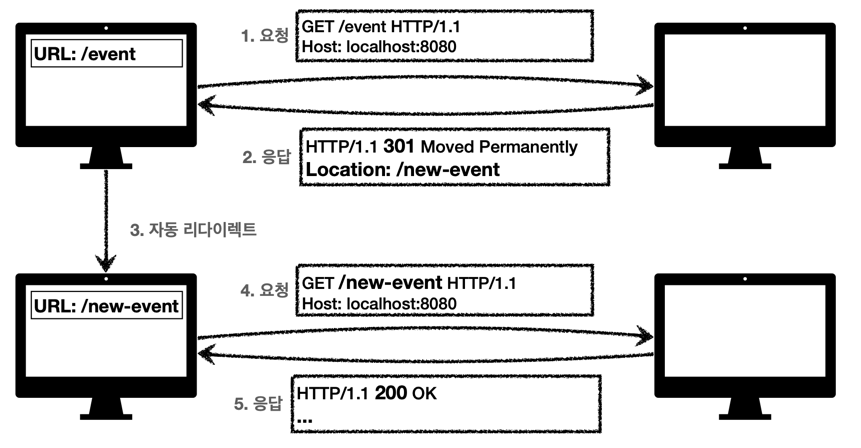

- ### 🧐 영구 리다이렉션 - 특정 리소스의 URI가 영구적으로 이동. (301, 308)
  - 원래의 URL을 사용하지 않고, 검색 엔진 등에서도 변경을 인지한다.
  - ex) /event -> /new-event
  > #### ☝️️ 301 Moved Permanently
  > > - 리다이렉트 요청시 요청 메서드가 GET으로 변하고, 본문이 제거될 수 있다.
  > >
  > > 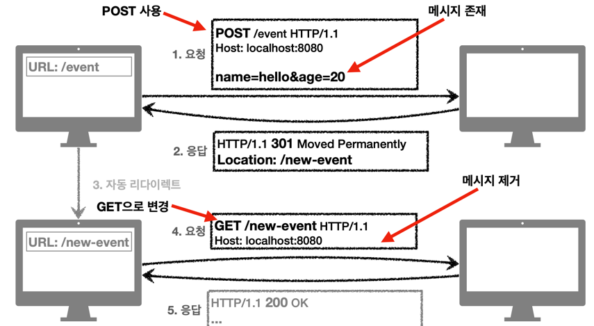
  > 
  > #### ☝️️️ 308 Permanent Redirect
  > > - 301과 기능은 같으나 요청 메서드와 본문을 유지한다.

- ### ☝️ 일시 리다이렉션 - 일시적인 변경
  - 주문 완료 후 주문 내역 화면으로 이동.
  - #### PRG : POST/Redirection/Get
  - 리소스의 URI가 일시적으로 변경되는 것이므로, 검색 엔진 등에서 URL을 변경하면 안됨.
  > #### ☝️ 302 Found
  > > - 리다이렉트 요청 메서드가 GET으로 변하고, 본문이 제거될 수 있음.(MAY)
  > 
  > #### ☝️️ 307 Temporary Redirect
  > > - 302와 기능은 같지만, 요청 메서드와 본문 유지(요청 메서드를 변경하면 안된다. MUST NOT)
  > #### ☝️ 308 See Other
  > > - 302와 기능은 같지만 리다이렉트시 요청 메서드를 GET 으로 변경.

  #### 🤔 PRG : Post/Redirect/GET
  - POST로 주문후에 웹 브라우저를 새로고침 하면?
  - 새로고침은 재요청.
  - 중복 주문이 될 수 있다.

  >  ✏️ POST로 주문 후에 결과 화면을 GET 메서드로 리다이렉트.    
  >  ✏️ 새로고침해도 결과 화면을 GET으로 조회.    
  >  ✏️ 중복 주문 대신에 결과 화면만 GET으로 다시 요청.    
  > 
  >  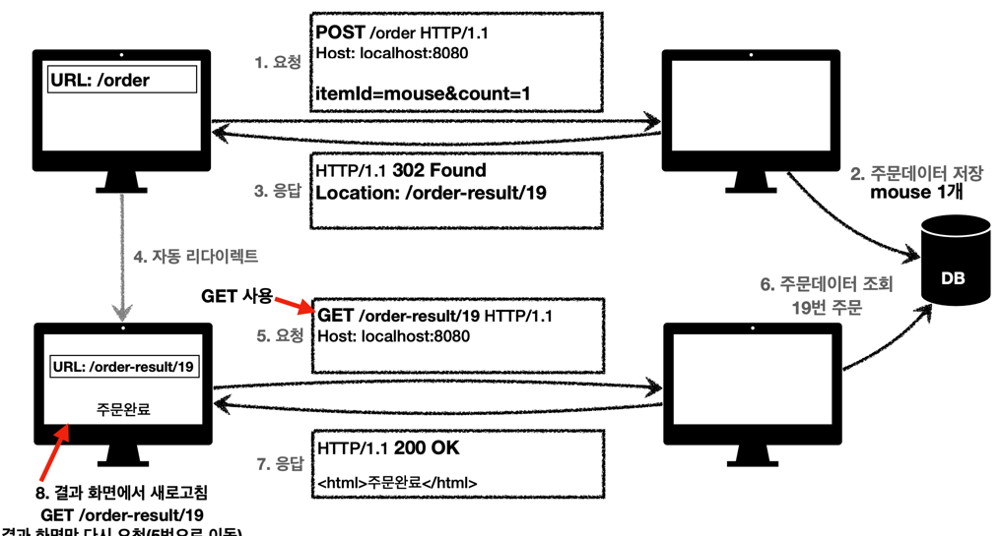
  > - 주문에 대한 응답을 302 Found나 307 See Other로 돌려 준다.
  > - PRG 이후 리다이렉트를 시도해도 URL이 이미 GET으로 리다이렉트 된다. 새로고침 해도 GET으로 화면만 조회.
  
- ### ☝️ 특수 리다이렉션 (304 Not Modified)
  - 캐시를 목적으로 사용.
  - 클라이언트에서 서버에게 캐시 정보를 넘겨주며 사용 가능 여부확인.
  - 서버에서는 다시 클라이언트에게 리소스가 수정되지 않았음을 알려준다.
  - 클라이언트는 로컬PC에 저장된 캐시를 재사용(캐시로 리다이렉트)
  - 응답에 메시지 바디를 포함하면 안된다(로컬 캐시를 사용하므로)
  - 조건부 GET, HEAD 요청시 사용.
  
  
 - 300 Multiple Choices  잘 사용하지 않음

## 🧐 4xx - 클라이언트 오류

- 클라이언트의 요청에 잘못된 문법등으로 서버가 요청을 수행할 수 없음.
- 오류의 원인이 클라이언트.
- 클라이언트가 잘못된 요청을 한 것이기 때문에 같은 요청을 반복해도 똑같이 실패함. 요청을 수정하여 보내야 한다.

### ☝️ 400 - Bad Request
> 클라이언트가 잘못된 요청을 해서 서버가 요청을 처리할 수 없음.
> - 요청 구문, 메시지 등
> - ex) 요청 파라미터가 맞지 않을 때, API 스펙에 맞지 않을 때.

### ☝️ 401 - Unauthorized
> 인증 되지 않음.
> - 401 오류 발생시 응답에 WWW-Authenticate 헤더와 인증 방법을 설명
> - 이름이 Anauthorized 이지만 인가가 아닌 인증이 안됐다는 응답이다.

🔑 참고
```
- 인증(Authentication) : 본인이 누구인지 확인 , 로그인 
- 인가(Authorization) : 권한 부여 (특정 리소스에 접근할 수 있는 권한 등.)
```

### ☝️ 403 - Forbidden
> 서버가 요청을 이해했지만 서버가 접근을 거부함.
> - 주로 인증 자격 증명은 있지만, 접근 권한이 불충분한 경우
> - ex) 일반 사용자가 어드민 등급의 리소스에 접근할 때.

### ☝️ 404 - NotFound
> - 요청 리소스가 서버에 없음
> - 또는 클라이언트가 권한이 부족한 리소스에 접근할 때 해당 리소스를 숨기고 싶을 때

## 🧐 5xx - 서버 오류
- 서버 문제로 오류 발생
- 서버에 문제가 있기 때문에 같은 요청을 재시도 했을 때 다시 성공할 수 있다.

### ☝️ 500 - Internal Server Error
> 서버 내부 문제로 오류 발생
> - 애매하면 500 오류로 발생 시킨다.

### ☝️ 503 - Service unavailable
> 서비스 이용 불가
> - 서비스가 일시적인 과부하 또는 예정된 작업으로 잠시 요청 처리를 할 수 없음.
> - Retry-After 헤더 필드로 얼마뒤 복구되는지 보낼 수 있다.
> 


## 🤔 모르는 상태 코드가 나타나면?
- 클라이언트가 인식할 수 없는 상태코드를 서버가 반환하면?   
-> 클라이언트는 상위 상태코드로 해석해서 처리.
- 미래에 새로운 상태 코드가 추가되어도 클라이언트를 변결하지 않아도 된다.
- ex) 299 -> 2xx(Successful)로 해석, 451 -> 4xx(Client Error)로 해석 ..

# 📌 HTTP Header
***

### ✏️ RFC723x 변화
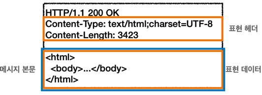
- 엔티티(Entity) -> 표현(Representation)
- Representation = representation Metadata + Representation Data

- 표현 : 요청이나 응답에서 전달할 실제 데이터
- 표현 헤더 : 표현 뎅이터를 해석할 수 있는 정보 제공.
  - 데이터 유형(html, json), 데이터 길이, 압축 정보 등 .. 
  
## 🧐 표현(Representation)
- ### ☝️ Content-Type: 표현 데이터의 형식.
  - 미디어 타입, 문자 인코딩
  - text/html; charset=utf-8, application/json, image/png 등 ..

- ### ☝️ Content-Encoding: 표현 데이터의 압축 방식.
  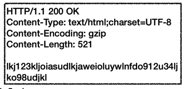

  - 표현 데이터를 압축하기 위해 사용.
  - 데이터를 전달하느 곳에서 압축 후 인코딩 헤더 추가
  - 데이터를 읽는 쪽에서 인코딩 헤더의 정보로 압축 헤제
  - ex) gzip, deflate, identity ...

- ### ☝️ Content-Language: 표현 데이터의 자연 언어.
  - 표현 데이터의 자연 언어를 표현.
  - ex) ko, en, en-US ...

- ### ☝️ Content-Length: 표현 데이터의 길이.
  - 바이트 단위.
  - Transfer-Encoding(전송 코딩)을 사용할 때는 사용하면 안된다.

> 표현 헤더는 전송, 응답 둘다에서 사용.


## 🧐 협상(Content Negotiation)

-  ### ☝️️ Accept: 클라이언트가 선호하는 미디어 타입 전달.
-  ### ☝️ Accept-Charset: 클라이언트가 선호하는 문자 인코딩.
-  ### ☝️ Accept-Encoding: 클라이언트가 선호하는 압축 인코딩.
-  ### ☝️ Accept-Language: 클라이언트가 선호하는 자연 언어

> 협상 헤더는 요청시에만 사용한다.
️
- ### 🤔️ 협상과 우선순위: Quality Values(q)
  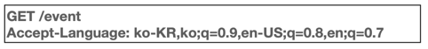
  - Quality Values(q)값 사용.
  - 0~1, 클수록 높은 우선순위
  - 생략하면 1
  - ex)
  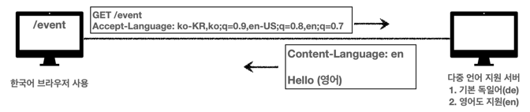
  
- ### 🧐 협상과 우선순위2
  - 구체적인 것이 우선한다.
  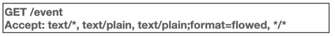
  ```
  1. text/plain;format=flowed
  2. text/plain
  3. text/*
  4. */*
  ```


### 🧐 협상과 우선순위3
- 구체적인 것을 기준으로 미디어 타입을 맞춘다.
  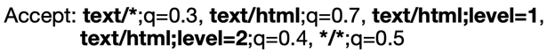
  
## 🧐 전송 방식 
- ### ☝️️ 단순 전송
  #### - Content-Length : 3300
  
- ### ☝️️ 압축 전송
  #### - Content-Encoding : gzip ..
- ### ☝️️ 분할 전송
  ####- Transfer-Encoding: chunked    
  - \r\n 으로 끝을 알린다.
  - Content-Length를 보내면 안된다. (예상이 안됨, 분할 청크에 길이가 있음.)
  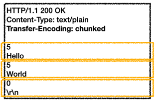
- ### ☝️️ 범위 전송
  #### - Range, Content-Range
  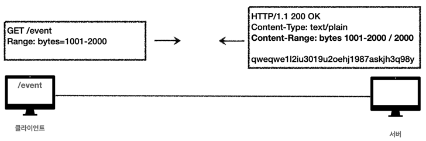


## 🧐 일반 정보

- ### ☝️️ From : 유저 에이전트의 이메일 정보.
  - 일반적으로 잘 사용하지 않는다.
  - 검색 엔진 같은 곳에서 주로 사용.
  - 요청에서 사용한다.

- ### ☝️️ Referer: 이전 웹 페이지 주소.
  - 해당 요청을 보내기 전에 있던 웹 페이지의 주소.
  - A -> B로 이동하는 경우 B로 요청할떄 Referer: A를 포함해서 요청.
  - Referer를 사용해서 유입 경로 분석 가능.
  - 요청에서 사용한다.
  - 참고: referer는 단어 referrer의 오타..

- ### ☝️️ User-agent: 유저 에이전트 애플리케이션 정보.
  ``` user-agent: Mozilla/5.0 (Macintosh; Intel Mac OS X 10_15_7) AppleWebKit/537.36 (KHTML, like Gecko) Chrome/92.0.4515.159 Safari/537.36```
  - 클라이언트의 애플리케이션 정보(웹 브라우저 정보 등..)
  - 통계 정보(어떤 브라우저로 많이 접속하는가. 등..)
  - 어떤 종류의 브라우저에서 장애가 발생하는지 파악 가능.
  - 요청에서 사용한다.

- ### ☝️ Server: 요청을 처리하는 ORIGIN 서버의 소프트웨어 정보.
  - Server: Apache/2.2.22
  - server: nginx
  - 응답에서 사용.

     > 🤔 ORIGIN Server? 실제로 표현 데이터를 만들어주는 종단의 서버.

- ### ☝️️ Data : 메시지가 발생한 날짜와 시간.
  - Data: Tue, 15, Nov 1994 15:50:31 GMT
  - 응답에서 사용.


## 🧐 특별한 정보

- ### ☝️ Host: 요청한 호스트 정보(도메인) - 필수값.
  - 요청에서 사용.
  - 하나의 서버가 여러 도메인을 처리해야 할 때.
  - 하나의 IP 주소에 여러 도메인이 적용(가상호스트 사용)되어 있을 때 구분.
  - IP로 구분할 수 없기 때문에, 호스트 도메인을 넣어준다.
    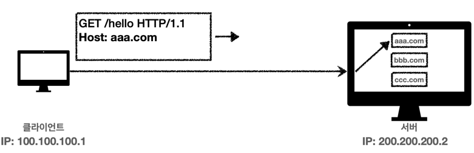

- ### ☝️ Location: 페이지 리다이렉션
  - 웹 브라우저는 3xx의 응답의 결과에 Location 헤더가 있으면, 대상 리소스로 자동으로 리다이렉트.
  - 201-Created 에서 Location 값은 요청에 의해 생성된 리소스의 URI

- ### ☝️️ Allow: 허용 가능한 HTTP 메서드
  - 405(Method Not Allowed)에서 응답에 포함해야 한다.
  - 지원하는 HTTP 메서드를 알려주는 역할을 한다.
  - Allow: GET, HEAD, PUT 

- ### ☝️️ Retry-After: 유저 에이전트가 다음 요청을 하기까지 기다려야 하는 시간.
  - 503(Service Unavailable): 서비슥사 언제까지 불능인지 알려줄 때 사용한다.
  - (날짜로 표기) Retry-After: Fit, 31 Dec 1999 23:59:59 GMT
  - (초단위로 표기) Retry-After: 120
  
## 🧐 인증 헤더

- ### ☝️ Authorization: 클라이언트 인증 정보를 서버에 전달.
  - Authorization: Basic xxxxxxxxxxxxxx
  - 인증 방법에 따라 값은 달라진다.
- ### 🧐 WWW-Authenticate: 리소스 접근시 필요한 인증 방법 정의.
  - 401 Unauthorized 응답과 함께 사용한다.
  - WWW-Authenticate: Newauth realm="apps", type=1, title="Login to\"apps\"", Basic realm="simple"
  - 헤더 정보를 참고해서 제대로 된 인증 정보를 생성하게 된다.
  

## 🍪 쿠키(Cookie)
- Set-Cookie: 서버에서 클라이언트로 쿠키 전달(응답)
- Cookie: 클라이언트가 서버에서 받은 쿠키를 저장하고, HTTP 요청시 서버로 전달.

> HTTP는 무상태 프로토콜이기 때문에 클라이언트가 서버와 요청과 응답을 주고 받은 후 연결이 끊어지고, 다시 요청하더라도 서버는 이전 요청을 기억하지 않는다.

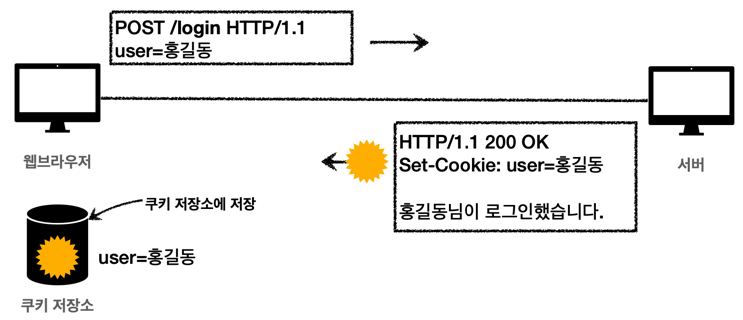
- 처음에 쿠키를 전달 받은뒤, 모든 요청에서 반드시 쿠키 저장소에서 정보를 가져와 함께 보낸다.

```set-cooke: sessionId=aasd35sdd3sd23; expires-Sat, 26-Dec-2021 00:00:00 GMT; [ath=/; domain=.google.com; Secure```
> - 사용자 로그인 세션 관리에 사용.
> - 광고 정보를 트래킹 할 때 사용.
> - 쿠키정보는 항상 서버에 전송되기 때문에 네티워크 트래픽을 추가 유발한다.
> - 최소한의 정보만을 사용(Session Id, Authorization Token ...)
> - 보안에 민감한 데이터는 저장하지 않도록 해야한다.
> > 🤔 서버에 전송하지 않고 웹 브라우저 내부에 데이터 저장 -> 웹 스토리지(local, sessionStroage)사용.
  
- ### ☝️ 쿠키 - 생명주기 (Expires, max-age)
  #### - Set-Cookie: expires=Sat, 26-Dec-2021 15:34:33 GMT
    - 만료일이 되면 쿠키를 삭제
  - Set-Cookie: max-age=4600(초)
    - 0이나 음수를 지정하면 쿠키를 삭제한다.
  - ✏️ 세션 쿠키 : 만료 날짜를 생략하게 되면 브라우저 종료시 까지만 유지한다.
  - ✏️ 영속 쿠키 : 만료 날짜를 입력하면 해당 날짜까지 유지한다.

- ### ☝️ 쿠키 - 도메인
  #### - Set-Cookie: domain=example.org
  - 명시: 명시한 문서 기준 도메인 + 서브 도메인까지 포함한다.
    - dev.example.org도 쿠키에 접근할 수 있다.
  - 생략 : 현재 문서 기준 도메인만 적용.
    - example.org에서 쿠키를 생성했다면 example.org에서만 접근이 가능하고, dev.example.org(서브)에서는 접근할 수 없다.
  
- ### ☝️ 쿠키 - 경로
  #### - Set-Cookie: path=/
  - 이 경로를 포함한 하위 경로 페이지만 쿠키 접근이 가능하다.
  - 일반적으로는 루트로 지정.
  - path=/ -> 모두 접근 가능
  - path=/home -> /home/* -> 접근 가능, /hello -> 접근 불가능.
  
- ### ☝️ 쿠키 - 보안
    #### - Set-Cookie: Secure
    - 기본적으로 쿠키는 http, https를 구분하지 않고 전송,
    - Secure를 적용하면 https인 경우에만 전송.
  
  #### - Set-Cookie: HttpOnly
    - XSS 공격 방지 : 자바스크립트에서 쿠키에 접근할 수 없도록 한다.
    - HTTP 전송에서만 사용한다.
    > 🧐 XXS? 사이트 간 스크립팅(Cross-Site Scripting) : 관리자가 아닌 권한이 없는 사용자가 웹 사이트에 스크립트를 삽입하는 공격. 사용자의 Session을 탈취하여 악의적으로 사용할 수 있다.
  
  #### - Set-Cookie: SameSite
    - XSRF 공격 방지.
    - 요청 도메인과 쿠키에 설정된 도메인이 같은 경우만 쿠키를 전송한다.
    > 🤔 XSRF? 사이트 간 요청 위조(Cross-site Request Forgery) : 사용자가 자신의 의지와는 무관하게 공격자가 의도한 행위를 특정 웹사이트에 요청하게 하는 공격.


# 📌 캐시
***
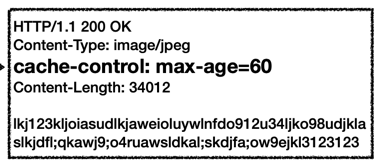
- 60초간 유효한 캐시. (네트워크 다운로드가 발생하지 않는다.)
- 웹 브라우저에서 캐시에 접근할 때 유효기간이 지났다면, 다시 서버에서 요청하게 된다.
- 요청에 대한 응답을 다시 캐시에 저장하여 갱신한다.

## 🧐 검증 헤더와 조건부 요청
> 캐시 유효시간이 초과해서 서버에 다시 요청할 때는 두 가지 상황이 존재한다.
#### 1. 서버에서 기존 데이터를 변경함.
#### 2. 서버에서 기존 데이터를 변경하지 않음.

- ### ☝️ Last-Modified, If-Modified-Since

  - 이를 알기 위해 응답 데이터를 보낼 때 검증 헤더를 추가한다.   
  ```Last-Modified: Fri, 26-Dec-2021 00:00:00 GMT ```
  - 이후 캐시에서 해당 데이터가 사용될 때 데이터의 최종 수정일을 서버에 전송.   
  ```if-modified-since: Fri, 26-Dec-2021 00:00:00 GMT```
  - 서버에서는 변경되었는지 검증
  > ✏️ 변경되지 않았을 때: 304 Not Modified
  > 
  > 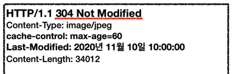
  > - 바디를 추가하지 않고 용량이 적은 헤더 정보만 다운로드 하기 때문에 네트워크의 부하를 줄일 수 있다.
  > - 캐시에 있는 데이터를 재사용, 응답 헤더로 캐시의 메타 정보를 갱신한다.(max-age)
  
  > ✏️ 변경 되었을 때: 200 OK, 서버에서 응답에 데이터를 담아 보내준다.

  ### ✏️ Last-Modified, If-ModifiedSince 의 단점.
  - 1초 미만의 단위로 캐시 조정이 불가능하다.
  - 날짜 기반의 로직을 사용한다.
  - 데이터를 수정하여 날짜는 달라졌지만, 데이터 결과가 동일한 경우를 구분할 수 없다.
  - 서버에서 별도의 캐시 로직을 관리할 수 없다.
    - ex) 스페이스, 주석 처럼 크게 영향이 없는 변경에서 캐시를 사용하고 싶은 경우.
  

- ### ☝️ 해결: ETag, If-None-Match
  - ETag: Entity Tag
  - 캐시용 데이터에 임의의 고유한 버전 이름을 달아둠.
  - 데이터가 변경되면 이 이름을 바꾸어서 변경함(Hash를 다시 생성)
    -> 동일한 데이터의 경우 같은 Hash값을 가짐.
  - 단순하게 ETag만 보내서 같으면 유지, 다르면 다운로드.

  #### - 응답 데이터를 받을 때 ETag를 수신.
  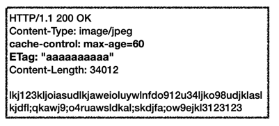

  #### - 캐시가 만료되었을 때 If-Not-Match로 ETag를 보낸다.(Match되지 않으면 데이터를 다시 달라.)
  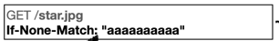

  #### 🔑 정리
  > - 캐시 제어 로직을 서버에서 완전히 관리.
  > - 클라이언트는 단순히 ETag를 서버에 제공(클라이언트 캐시 메커니즘을 몰라도 된다.)
  > - 일정 기간동안 ETag를 동일하게 유지하여 캐시에서 데이터를 사용하게 하거나, 배포 주기에 맞춰 ETag를 한번에 갱신하는 등으로 사용 가능하다.


## 🧐 캐시 제어 헤더

- ### ☝️ Cache-Control : 캐시 지시어(directives)
  - #### Cache-Control: max-age
    - 캐시 유효 시간(초 단위)
  - #### Cache-Control: no-cache
    - 데이터는 캐시하지만, 항상 Origin 서버에 검증하고 사용.
  - #### Cache-Control: no-store
    - 데이터에 민감한 정보가 있으므로 저장하면 안된다.(메모리에서 사용하고 최대한 빨리 삭제.)
  
- ### ☝️ Pragma : 캐시 제어(하위 호환), 지금은 거의 사용하지 않는다.
  - pragma: no-cache
  - HTTP 1.0 하위 호환.
  
- ### ☝️ Expires : 캐시 만료일 지정(하위 호환)
  - expires: Mon, 01 Jan 2021 00:00:00 GMT
  - 캐시 만료일을 정확한 날짜로 지정.
  - HTTP 1.0 부터 사용.
  - 지금은 더 유욘한 Cache-Control: max-age를 권장하며, 함께 사용하면 Expires는 무시된다.

## 🧐 검증 헤더, 조건부 요청 헤더(정리)

- ### ☝️ 검증 헤더(Validator)
  - ETag, Last-Modified

- ### ☝️ 조건부 요청 헤더
  - If-Match, If-None-Match: Etag값 사용.
  - If-Modified-Since, If-Unmodified-Since: Last-Modified 값 사용.
  

## 🧐 프록시 캐시
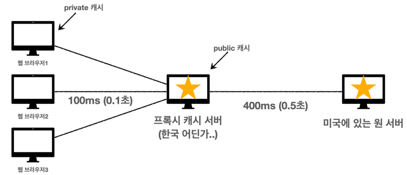
- 최초 접속자만 다운로드 하거나 혹은 원 서버에서 캐시 서버에 데이터를 밀어 넣는다.
- 공용 캐시 : public
- 로컬 캐시 : private

### ☝️ Cache Control: 캐시 지시어

- ####  ✏️ Cache-Control: public
  - 응답이 public 캐시에 저장되어도 된다.
- #### ✏️ Cache-Control: private
  - 응답이 해당 사용자만을 위한 것, private 캐시에 저장해야 함(default)
- #### ✏️ Cache-Control: s-maxage
  - 프록시 캐시에만 적용되는 max-age
- #### ✏️ Age
  - Origin 서버에서 응답 후 프록시 캐시 내에 머문 시간(초)
  - Age: 60
  

## 🧐 캐시 무효화

- ### ☝️ 확실한 캐시 무효화 응답.
  - 절대 캐시가 되면 안되는 데이터.
  - Cache-Control: no-cache, no-store, must-revalidate (모두 사용)
  - Pragma: no-cache (HTTP 1.0 대비)
  
  > 🤔 must-revalidate : 캐시 만료 후 최초 조회시 origin서버에 검증.
  > - 원 서버 접근 실패시 반드시 오류가 발생해야한다 - 504 Gateway Timeout
  > - must-revalidate는 캐시 유효 간이라면 캐시를 사용한다.
  > 
  > 
  > > 🖍 no-cache 와의 차이 : origin 서버에 접근할 수 없는 경우.
  > > - no-cache 에서는 서버 설정에 따라 오래된 데이터를 결과를 받게될 수 있다.
  > > - must-revalidate 에서는 반드시 504 오류가 발생한다.


