# 💻 HTTP 기본 지식
****
> 앱과 서버의 통신, 서버와 서버의 통신 등 모두 HTTP를 이용하여 데이터를 주고 받는다. 때문에 HTTP는 앱,웹 개발에 필수로 요하게 되는 기술이다.
> 
```이미지 출처 : 모든 개발자를 위한 HTTP 웹 기본지식 - 김영한님.```

# 📌 인터넷 네트워크
***
## 🧐 IP(Internet Protocol)
- 지정한 IP주소에 데이터 전달.
- 패킷(packet)이라는 통신 단위로 데이터 전달.
> - 패킷 정보 : 출발지 IP, 목적지 IP, 데이터 ...
> - 주소간 패킷을 전달. (노드들을 통해)
> 
> 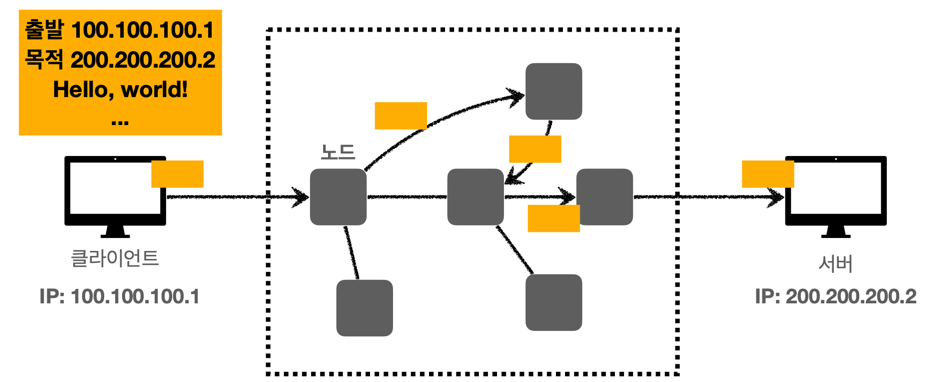

- ### 👎 IP 프로토콜의 한계
> - 비연결성 : 패킷을 수신할 대상이 없거나 서비스 불능 상태여도 패킷이 전송됨.
> - 비신뢰성 : 패킷의 소실, 패킷의 순서가 바뀌는 등의 문제.
> - 프로그램 구분 : 같은 IP를 사용하는 서버에서 통신하는 애플리케이션이 둘 이상일 때의 구분.
> - 해결 : TCP


## 🧐 TCP
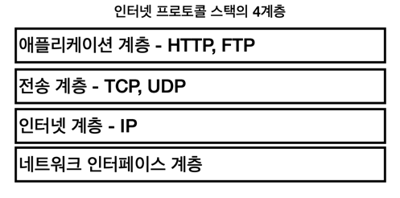
- 전송 제어 프로토콜 (Transmission Control Protocol)
- 데이터 전달 보증
- 순서 보장
- 신뢰성 있는 프로토콜

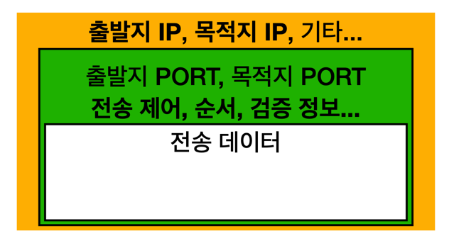
  > - IP 패킷 : IP 주소 
  > - TCP 세그먼트 :포트, 전송 제어, 순서, 검증 정보 등 ...

- ### TCP 3 Way Handshake
1. 클라이언트 -> 서버로 SYN
2. 서버 -> 클라이언트로 SYN + ACK
3. 클라이언트 -> 서버 ACK + 데이터

- ### 데이터 전달 보장 (TCP 세그먼트의 전송제어 정보)
1. 클라이언트 서버 -> 데이터 전송
2. 서버 -> 클라이언트 : 데이버 수신 응답.

- ### 데이터 순서 보장 (TCP 세그먼트의 순서정보.)
1. 패킷 1,2,3 을 순서대로 전송
2. 서버에 1,3,2 순서로 도청
3. 패킷 2부터 재전송 요청


## 🧐 UDP
- 순서보장, 데이터 전달 보증이 되지 않는다.
- 단순하고 빠름. (handshake, 응답 등이 없음.)
- IP와 거의 같지만  + 포트정보 + 체크섬
- 애플리케이션에서 추가 작업 필요.
- ☝️ HTTP3 에서 UDP를 사용하며 최근 대두되고 있다.

## 🧐 PORT 
> 한 IP에서 둘 이상의 애플리케이션을 연결해야 한다면?

- 같은 IP 내에서 프로세스 구분.
- 비유 : 아파트(IP) 내의 호수(PORT)

> - 할당 가능한 포트 번호 : 0~65535
> - 잘 알려진 포트 : 0~1023 (사용하지 않는 것이 좋음)
> > - FTP : 20, 21
> > - Telnet : 23
> > - HTTP : 80
> > - HTTPS : 443

## 🧐 DNS (Domain name System)
> IP의 문제 : 기억하기 어렵고 변경 가능성이 있다.

- 도메인 명을 IP주소로 변환해준다.
ex> google.com - 200.200.200.2
  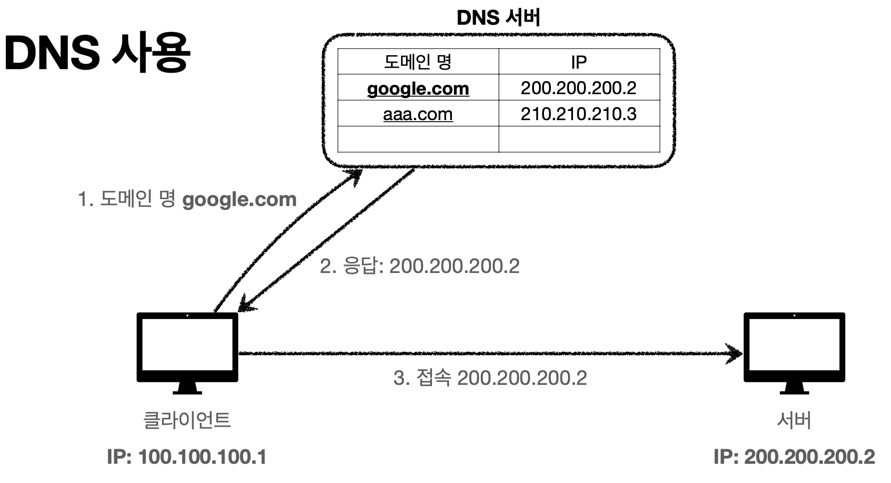
  

# 📌 URI와 웹 브라우저 요청 흐름
****

## 🧐 URI
> URI : Uniform Resource Identifier
> - U niforn : 리소스를 식별하ㅣ는 통일된 방식.
> - R esource : 자원, URI로 식별할 수 있는 모든 것.
> - I dentifier : 다른 항목과 구분하는데 사용되는 정보.
> > - URL(Uniform Resource Locator) : 리소스의 위치
> > - URN(Uniform Resource Name) : 리소스의 이름
> - URN만으로 실제 리소스를 찾을 수 있는 방법이 보편화되지 않아 대부분 URL을 사용.
> 
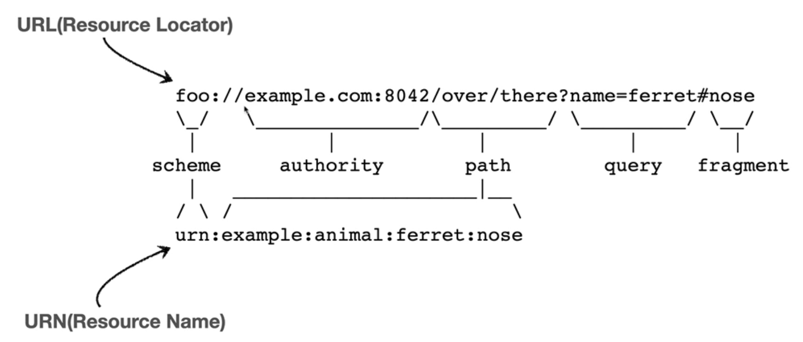

🧐 URL
- ### 전체 문법
> - Scheme
> > - 주로 프로토콜 사용(자원 접근 약속 규칙 http, https, ftp 등)
> > - 생략시 http로 동작.
> - userinfo
> > - URL에 사용자 정보를 포함해서 인증, 거의 사용하지 않는다.
> - Host
> > - 호스트명, 도메인명 또는 IP주소를 직접 입력
> - PORT
> > - 접속 포트, 일반적으로 생략, 생략시 http는 80, http는 443
> - Path
> > - 리소스 경로, 계층적 구조
> > - ex) /home/.../.../ file.png
> - Query
> > - key = value 형태
> > - ?로 시작, &로 추가 가능
> > - ex) keyA=valueA&keyB=valueB
> > - query parameter, query string 등으로 불린다. 웹 서버에서 제공하는 파라미터, 문자열.
> - fragment
> > - 다른곳으로 이동하는 html 내부 북마크 등에서 사용, 서버에 전송하는 정보가 아니다.


## 🧐 웹 브라우저 요청 흐름
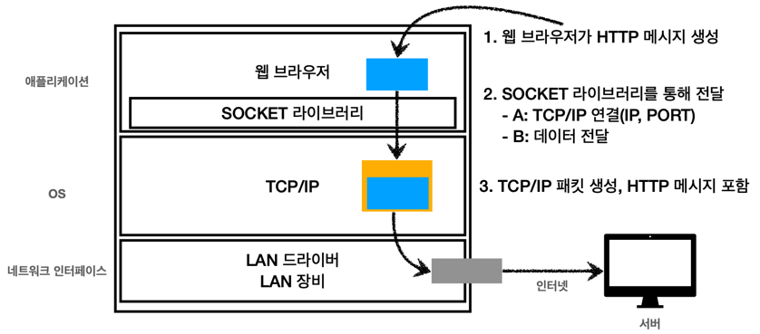

1. 요청 : ```https://www.google.com:443/search?q=heloo&hl=ko```
2. DNS 조회, PORT 조회 : IP, PORT를 얻어온다.
3. HTTP 요청 메시지 생성.
```
GET /search?q=hello&hl=ko HTTP/1.1
HOST: www.google.com
```
4. Socket 라이브러리를 통해 전송 계층(TCP)으로 전달.
5. TCP에서 IP,PORT 정보를 추가.
6. 노드들을 통해 서버에 전달.
7. 서버에서는 TCP/IP 패킷을 버리고, HTTP 메시지를 해석 및 처리.
8. 서버에서 HTTP 응답 메시지 생성.
```
HTTP/1.1 200 OK
Content-Type: text/html;charset=URF-8
Content-Length: 3423

<html>
    ...
<html>
```
9. (4~6)의 과정을 거치고 도착한 패킷에서 HTML을 렌더링해서 결과를 보여준다.


# 📌 HTTP 기본
****
> - HTML의 시작 : HyperText Transfer Protocol
> - 현재 : 모든 것을 담아 전송
> - HTML,Text, Image, 음성, 영상, 파일, JSON, XML 등..

## 🧐 HTTP 역사
- HTTP/0.9(1991) : GET만 지원, 헤더가 존재하지 않는다.
- HTTP/1.0(1996) : 다양한 메서드, 헤더 추가.
- ### HTTP/1.1(1997) : 가장 많이 사용.
  >  RFC2069(1997) -> RFC2616(1999) ->RFC7230~7235(2014)
    
- HTTP/2(2015) : 성능 개선
- HTTP/3(진행중) : TCP 대신 <strong>UDP</strong>를 사용, 성능의 개선.

## 🧐 HTTP 특징
> - 클라이언트 - 서버 구조
> > - Request - Response 구조
> > - 클라이언트는 서버에 요청을 보내고 응답을 대기, 서버가 요청에 대한 결과를 생성하고 응답.
> > - <strong>비즈니스 로직과 데이터는 서버에서 처리, 클라이언트는 UI에 집중.</strong>
> > - 각자의 역할에 집중, 독립적.
> - 무상태 프로토콜(Stateless)
> > - [Stateful] : 서버가 상태를 저장하고 있다고 생각하고 클라이언트가 진행상황 이후의 요청만을 보낸다. 서버가 바뀌면 클라이언트의 요청을 이해하지 못하게 된다.
> > - [Stateless] :서버가 클라이언트의 상태를 보존하지 않는다, 클라이언트가 그때 그때 필요한 요청을 모두 넘겨줌.
> > - 👍 <strong>장점 :</strong> 
> >     - 응답 서버를 쉽게 바꿀 수 있다.   
> >     - 요청이 증가해도 서버의 추가가 쉽다.(스케일 아웃- 수평 확장)
> > - 👎 <strong>단점 :</strong> 클라이언트가 요청을 추가 전송해야 한다.
> > - ☝️ <strong>실무 한계 :</strong>
> >     - 모든 것을 무상태로 설계 할 수는 없다.
> >     - ex) 상태를 서버에 유지해야 하는 로그, 일반적으로 브라우저 쿠키와 서버 세션등을 사용하여 상태를 유지한다.
> >     - 상태 유지는 최소한만 사용한다.    
> >
> > ☝️ Stateless !
> > - 같은 시간에 맞추어 발생하는 대용량 트래픽(선착순 이벤트 등 ..)
> > - 최대한 Stateless하게 설계해야 대응하기 용이.
> - 비연결성(Connectionless)
> > - 서버와 클라이언트의 연결을 유지하지 않아, 최소한의 자원으로 서버를 유지할 수 있다.
> > - 👎 한계 : 
> >     - TCP/IP 연결을 새로 맺어야 함(3 way handshake 시간 추가)
> >     - 사이트를 요청하면 JS,CSS, 이미지 등 수 많은 자원이 함께 다운로드 된다.
> > - 👍 해결 : HTTP 지속연결(Persistent Connections) 사용. HTTP/2,HTTP/3에서 더 많은 최적화가 이루어 졌다, 일정 시간동안 지속.
> >
> > 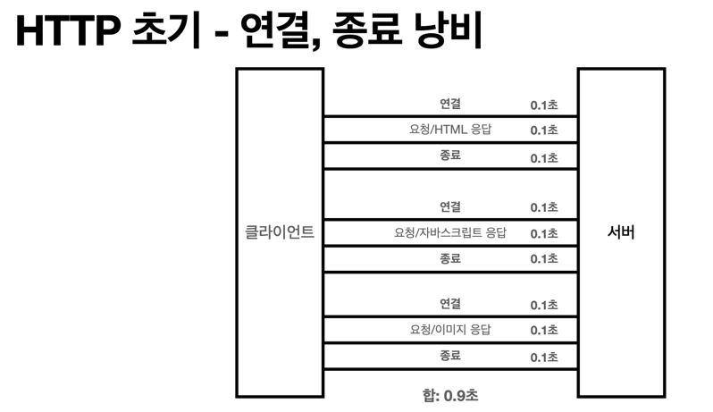
> > 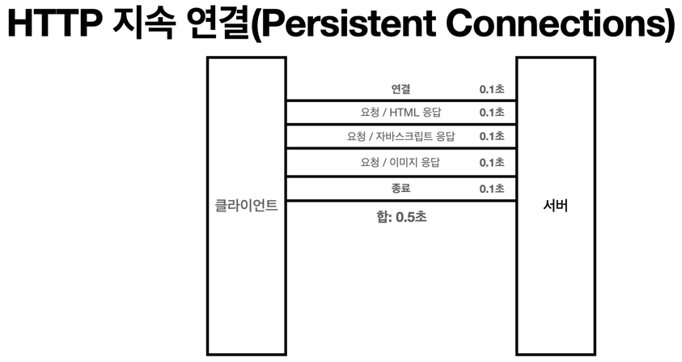
> - 단순함, 확장 가능


## 🧐 HTTP 메시지
- ### 구조
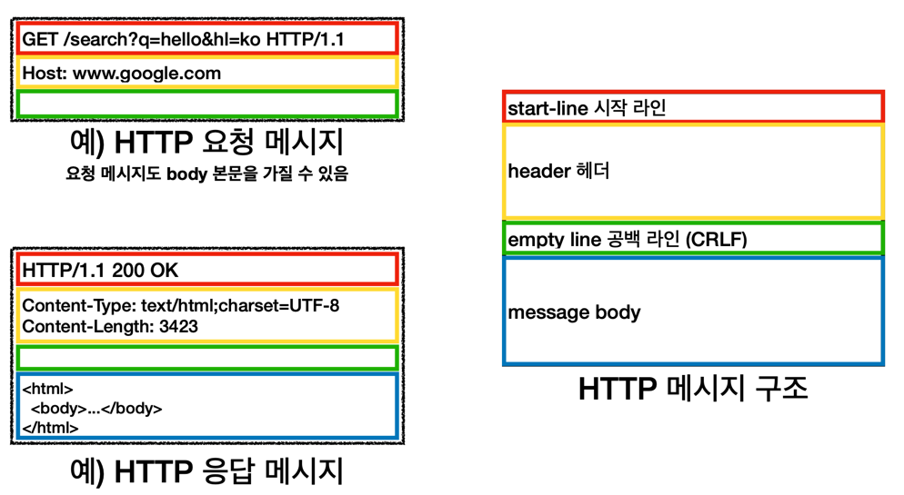
-  Empty Line(CRLF)는 필수로 존재 (CR:Carriage return, LF:Line Feed)

> ### 시작 라인 (start-line) = request-line / status-line
> ```GET /search?q=hello HTTP/1.1```
> - request-line = method SP(공백) request-target SP HTTP-version CRLF
> > - method : GET, POST, PUT, DELETE ...
> > - request-target : absolute-path[?query]
> >     - ex) /search?q=hello
> > - HTTP-version : HTTP/1.1
> - status-line = HTTP-version SP status-code SP reason-phrase CRLF
> > - status-code : 요청 성공, 실패 등의 상태 코드. 200: 성공, 400: 클라이언트 오류, 500: 서버 오류 ...
> > - reason-phrase : 사람이 이해할 수 있는 짧은 상태코드 설명.
> > - 

> ### Header = field-name ":" OWS field-value OWS(띄어쓰기 허용)
> ```Host:www.google.com```   
> ```Content-Type:text/html;charset=UTF-8```
> 
> > - field-name은 대소문자를 구분하지 않는다. value는 구분.
> > - HTTP 전송에 필요한 모든 부가 정보가 담긴다.
> >  - 메시지 바디의 내용, 바디의 크기, 압축, 인증, 요청 클라이언트 정보, 서버 애플리케이션 정보, 캐시 관리 정보 ...
> > - 필요시 임의의 헤더 추가 가능 fieldName: value

> ### Message Body
> > - 실제 전송할 데이터
> > - 바이트로 표현할 수 있는 모든 데이터 전송 가능.


# 📌 HTTP 메서드
***

## 🧐 API URI 설계
> ☝️ 가장 중요한 것은 리소스 식별!

- 리소스 : 회원 등록에서 회원, 이미지 저장에서 이미지.

```
회원 목록 조회 /members
회원 조회 /members/{id}
회원 등록 /members/{id}
회원 수정 /members/{id}
회원 삭제 /members/{id}
```
- URI 계층 구조 활용, 상위를 컬렉션으로 보고 복수형 사용.

> - 행위와 리소스를 분리.
> - URI는 리소스 만을 식별 (주로 명사)
> - 메소드에서 행위를 식별.


## 🧐 GET

> 리소스 조회.
> ```
> GET /members/100 HTTP/1.1
> ...
> ```
> - 서버에 전달하고 싶은 데이터는 쿼리 파라미터를 통해서 전달.
> - 메시지 바디를 사용할 수 있지만, 지원하지 않는곳이 많아서 권장하지 않음.

> 응답 데이터
> ```
> HTTP/1.1 200 OK
> ...
> {
>    조회된 리소스
> }
> ```


## 🧐 POST

> 요청 데이터 처리
> ```
> POST /members HTTP/1.1
> ...
> {
>     data ...
> }
> ```
> - 메시지 바디를 통해 서버로 요청 데이터 전달.
> - 서버는 요청 데이터를 처리, 바디를 통해 들어온 데이터를 처리하는 모든 기능 수행.
> - 주로 신규 리소스 등록, 프로세스 처리.

> 응답 데이터
> ```
> HTTP/1.1 201 Created
> ...
> Location: /members/100
> {
>    생성된 리소스
> }
> ```
> - 201 Created 또는 200 OK
> - 201일 경우 Location에는 생성된 리소스의 경로를 담아준다.
> - 바디에는 생성된 리소스의 데이터.

> 📃 요청의 처리?
> - 대상 리소스 고유의 의미 체계에 따라 요청에 포함된 표현을 처리.
> - ex) HTML 양식에 입력된 필드와 같은 데이터 블록의 처리 프로세스 (회원가입, 주문 등..)
> - 메시지 게시 (게시판 글쓰기, 댓글 등)
> - 서버가 아직 식별하지 않은 새 리소스 생성 (신규 주문 생성, 신규 회원 생)
> - 기존 자원에 데이터 추가 (한 문서의 끝에 내용 추가하기)

### 🔑 POST의 사용 정리
> 1. 새 리소스의 생성(등록)
> > 서버가 아직 식별하지 않은 새 리소스 생성
> 2. 요청 데이터 처리
> > - 데이터의 생성, 변경을 넘어 프로세스를 처리해야 하는 경우.
> > - POST의 결과로 리소스가 생성되지 않을수도 있다.
> > - ex) 주문시스템 : 결제 완료 -> 배달 시작 -> 배달 완료 에서는 단순한 값 변경을 넘어 프로세스의 상태를 변화시킨다.
> > - POST /orders/{orderId}/start-delivery (컨트롤 URL, 리소스 명시만으로 할 수 없을 때.)
> 3. 다른 메서드로 처리하기 애매한 경우
> > ex) JSON으로 조회 데이터를 넘겨야 할 때
> > - GET을 사용하여 바디에 데이터를 넣게 되면  지원하지 않는 서버가 있을 수 있기 때문에 POST 사용.
#### > ☝️ POST 요청이 오면 데이터를 어떻게 처리할 지 리소스마다 따로 정해놓고 사용해야 한다.

## 🧐 PUT
> 리소스를 <strong>완전히 대체</strong>, 해당 리소스가 없으면 생성.
> - 덮어쓰기. 해당하는 필드만 덮어쓰는것이 아닌 완전한 대체.
> - 새로 보낸 데이터에 age만 존재하고, 기존 데이터가 age, name이 존재한다면 요청이 실행된 이후에 해당 리소스에는 대체된 age만 존재한다.
> - PUT은 데이터의 수정이 아니다. 수정은 PATCH 사용.
> ```
> PUT /members/100 HTTP/1.1
> ...
> {
>     data ...
> }
> ```
> - POST와 달리 클라이언트가 구체적인 리소스 위치를 알고 URI를 지정한다.

## 🧐 PATCH
> 리소스 부분 변경.
> - 해당 리소스의 일치하는 부분만 변경.
> - 대부분 지원하지만 지원하지 않는 서버가 있다면 POST로 대체하여 사용.
> ```
> PATCH /members/100 HTTP/1.1
> ...
> {
>     data ...
> }
> ```

## 🧐 DELETE
> 리소스 제거.
> ```
> DELETE /members/100 HTTP/1.1
> ...
> {
>     data ...
> }
> ```

###☝️ 이 외의 메서드.
- HEAD : GET과 동일하지만 메시지 부분을 제외하고 상태 줄과, 헤더만 반환.
- OPTIONS : 대상 리소스에 대한 통신 가능 옵션(메서드)을 설명(주로 CORS에서 사용).
- CONNECT : 대상 자원으로 식별되느 서버에 대한 터널을 설정.
- TRACE : 대상 리소스에 대한 경로를 따라 메시지 루프백 테스트를 수행.


## 🧐 HTTP 메서드의 속성

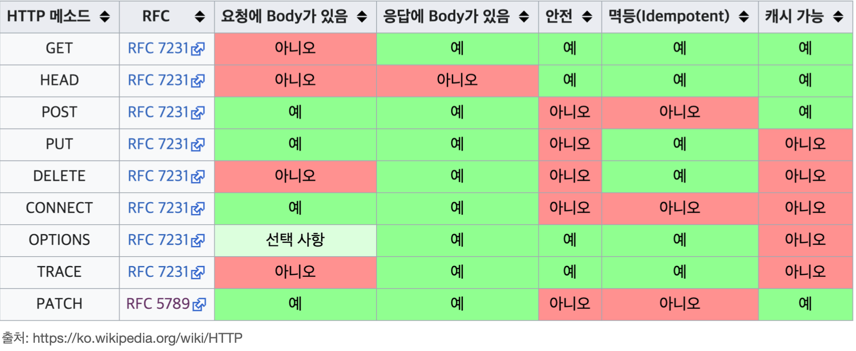
- GET의 경우 Body를 넣을 수 있으나, 지원하지 않는 서버가 존재하기 때문에 넣지 않는것이 좋다.

> ### 안전(Safe Methods)
> - 호출해도 리소스를 변경하지 않는다.
  
> ### 멱등(Idmpotent Methods)
> > 몇 번을 호출하든 결과가 같다.    
> > 외부 요인으로 중간에 리소스가 변경되는 것 까지는 고려하지 않는다.
> > - GET : 몇 번을 조회하든 같은 결과가 조회된다,
> > - PUT : 결과를 대체하므로, 같은 요청을 여러번 해도 최종 결과느 같다.
> > - DELETE : 결과를 삭제하므로, 같은 요청을 여러번 해도 결과는 리소스 삭제로 똑같다.
> > - POST : 여러번 호출하면 같은 요청의 실행이 여러번 일어남(ex 결제) 
>
> > 활용 :
> > 자동 복구 메커니즘 - 서버가 TIMEOUT 등으로 정상 응답을 못 주었을 때, 같은 요청을 다시 해도 되는가?

> ### 캐시가능(Cacheable Methods)
> - 응답 결과 리소스를 캐시해서 사용해도 되는가?
> - GET, HEAD, POST, PATCH 캐시가능.
> - 실제로는 GET, HEAD 정도만 사용한다.
>   - POST, PATCH는 본문 내용까지 Cache Key로 고려해야 하기 때문에 구현이 어려움.


# 📌 HTTP 메서드 활용
***
## 🧐 클라이언트에서 서버로 데이터 전송

### ☝️ 데이터 전달 방식은 크게 2가지
> - 쿼리 파라미터를 통한 데이터 전송
>   - GET
>   - 정렬 필터 사용(검색어)
> - 메시지 바디를 통한 데이터 전송
>   - POST, PUT, PATCH
>   - 리소스 등록, 리소스 변경.


### ☝️ 클라이언트에서 서버로 데이터 전송 4가지 상황
> ### 1. 정적 데이터 조회 (GET)
> > - 이미지, 정적 텍스트 문서
> > - 쿼리 파라미터 없이 단순히 리소스 경로로 조회 가능.
> >
> > 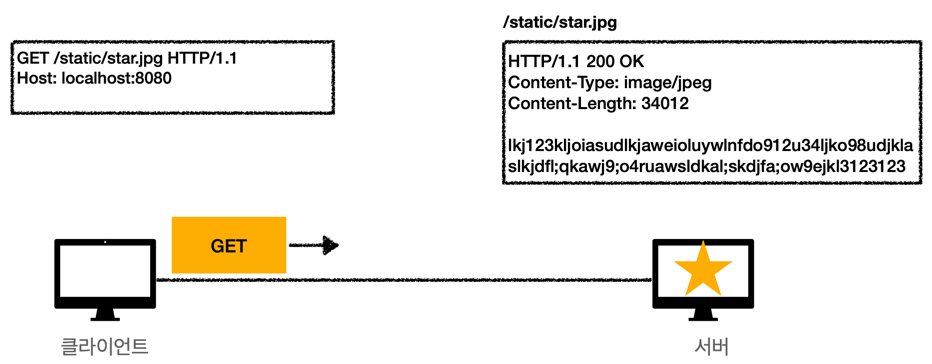
> ### 2. 동적 데이터 조회 (GET)
> > - 주로 검색, 게시판 목록 정렬 필터, 정렬 조건 등..
> > - 쿼리 파라미터를 사용하여 추가적인 정보 전달.
> >
> > 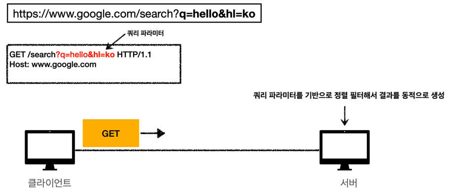
> ### 3. HTML Form을 통한 데이터 전송 (POST)
> > -  회원 가입, 상품 주문, 데이터 변경 등..
> > - GET, POST 만 지원.
> >
> > 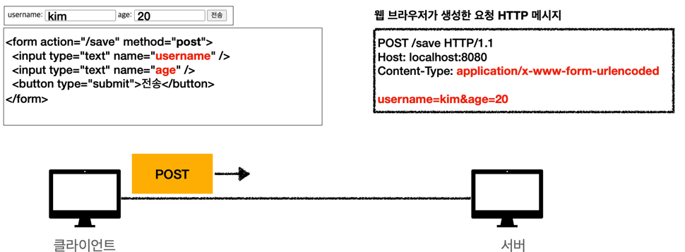
> > 🖍 쿼리 파라미터와 유사한 Key=Value 쌍으로 데이터를 생성하여 바디에 추가.    
> > 🖍 Content-Type은 application/x-www-form-urlencoded 가 된다. (url 인코딩 처리)        
> > 🤔 method를 GET으로 사용하면 URL 경로에 쿼리 파라미터로 들어가게 되지만 GET은 리소스의 변경에는 사용해서는 안된다.
> >
> > 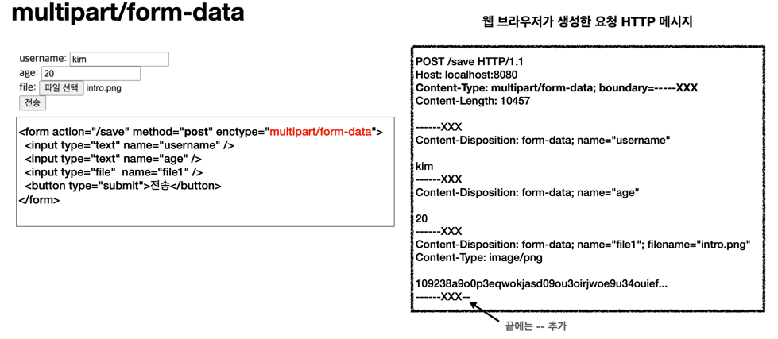
> > 🖍 파일 업로드와 같은 바이너리 데이터 전송시 사용.    
> > 🖍 웹 브라우저가 자동으로 boundary를 생성하고 이를 기준으로 잘라서 읽는다.    
> > 🖍 여러 파일과 폼의 내용을 함께 전송 가능 (multipart)
> ### 4. HTTP API를 통한 데이터 전송 
> > - 회원가입, 상품 주문, 데이터 변경 등..
> > - 서버 to 서버 : 백엔드 시스템 통신
> > - 앱 클라이언트 : 안드로이드, 아이폰
> > - 웹 클라이언트 : 자바 스크립트를 통한 통신(AJAX) ex) VueJS, React
> > - POST, PUT, PATCH : 메시지 바디를 통해 데이터 전송
> > - GET : 조회, 쿼리 파라미터로 데이터 전달
> > - Content-Type : application/json을 주로 사용(사실상 표준)
> >   - TEXT, XML, JSONM 등 ..


