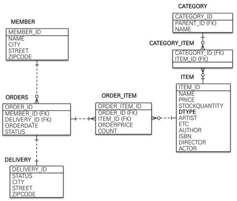
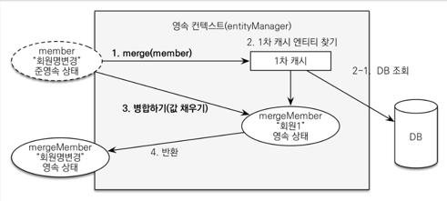

> - 이미지 출처 : 인프런 - 실전! 스프링 부트와 JPA 활용1 - 김영한님
# 📃 목차
***
### ✏️ [JPA와 DB 설정](#-jpa와-db-설정)
### ✏️ [테이블과 도메인 설계](#-테이블-설계)
### ✏️ [@Transactional](#-transactional)
### ✏️ [CasCade, 도메인 모델 패턴](#-cascade의-활용-도메인-모델-패턴)
### ✏️ [동적 쿼리의 작성 : QueryDSL](#-동적-쿼리의-작성--querydsl)
### ✏️ [변경 감지와 병합(merge)](#-변경-감지와-병합merge)


# 📌 JPA와 DB 설정
****
### 🧐 application 설정
```yaml
spring:
  datasource:
    url: jdbc:h2:tcp://localhost/~/jpashop
    username: sa
    password:
    driver-class-name: org.h2.Driver

  jpa:
    hibernate:
      ddl-auto: create
    properties:
      #      show_sql: true
      hibernate.format_sql: true

logging:
  level:
    org.hibernate:
      SQL: DEBUG
      type: TRACE
```
- show_sql 과 logging level DEBUG 는 둘다 쿼리를 보여주는 역할을 하지만, show sql은 print이기 때문에 logging을 이용하는 것이 일반적으로 더 좋다.
- format_sql 은 발생된 sql을 줄바꿈을 통해 보기 좋게 정렬해준다.
- ```logging.level.org.hibernate.type: TRACE``` 는 바인딩된 파라미터의 값을 보여준다.
  - 바인딩 값을 보여주는 라이브러리 :p6spy 등을 사용해도 된다.
### 🧐 Repository
```java
@Repository
public class MemberRepository {

    @PersistenceContext
    private EntityManager em;

    public Long save(Member member){
        em.persist(member);
        return member.getId();
    }

    public Member find(Long id){
        return em.find(Member.class, id);

    }
}
```
- #### @PersistenceContext : EntityManagerFactory 를 생성할 필요없이 Spring Boot 에서 자동으로 생성해서 주입해준다.
- EntityManagerFactory 를 주입받고 싶다면 @PersistenceUnit 으로 주입받는다.
- 또는 생성자 주입으로 주입받을 수 있다.
### 🧐 Test Code
```java
@Transactional
@SpringBootTest
//@Rollback(false)
class MemberRepositoryTest {

    @Autowired
    MemberRepository memberRepository;

    @DisplayName("Member 저장")
    @Test
    void saveTest(){
        // given
        Member member = new Member();
        member.setUsername("kim");

        //when
        Long saveId = memberRepository.save(member);

        //then
        assertThat(memberRepository.find(saveId)).isEqualTo(member);
    }
}
```
- asserThat에서는 member와 find로 가져온 member을 '=='비교를 실행하게 되는데, 같은 transaction 안에서 이루어졌기 때문에 두 엔티티는 같음이 보장된다.
    - 영속성 컨텍스트에서 가져오기 때문에 같다.(실제로 select 쿼리가 발생하지 않는다.)
    


# 📌 테이블 설계
****


- Entity 에서는 Getter, Setter를 생성하지 않고, 꼭 필요할 때 별도의 메서드를 이용하는 것이 이상적,
  하지만 실제로는 엔티티를 조회할 일이 너무 많기 때문에 Getter를 열어두고 사용한다.
- Setter는 데이터를 변경할 수 있기 때문에, 막 열어두면 어디서 데이터가 변경되었는지 추적하기가 어려워진다. 때문에 Setter는 닫아두고, 데이터 변경을 위한 비즈니스 메서드를 별도로 생성하는 것이 좋다.

- #### 🤔 id의 컬럼명을 "entity_id"로 설정 하는 이유
  - 데이터베이스에는 타입이 없기 때문에 모두 id로 해두면 나중에 데이터를 구분하기 어렵다.
  - 외래키와 이름을 맞추기 위해서 같게 설정한다.
  - 가장 중요한 것은 일관성을 맞추는 것이다.
  

### ☝️ 임베디드 타입의 불변
```java
@Getter
@AllArgsConstructor
@Embeddable
public class Address {

    private String city;
    private String street;
    private String zipcode;

    protected Address(){}

}
```
- 값을 변경하면 안되기 때문에 Setter는 사용하지 않는다.(변경 하고자 할때는 새로운 객체 생성.)
- 모든 필드를 받아 생성하는 생성자를 만들고, 기본 생성자를 protected로 만들어 빈 객체를 생성하지 않도록 유도.

### ☝️ 연관관계 편의 메서드
```java
 public void setMember(Member member){
        this.member = member;
        member.getOrders().add(this);
 }
```
- 양방향 매핑에서 편리하게 값을 세팅하기 위해 편의 메서드를 작성한다.


### 🖍 엔티티 설계시 주의할 점.
- 양방향 매핑 관계는 반드시 연관관계의 주인 설정.
- Enum 타입은 ```@Enumerated(EnumType.STRING)``` 설정.
- @ManyToOne, @OneToOne ```fetch = FetchType.LAZY``` 설정.(N+1이 발생하지 않도록.)
  - 한번에 부르기 위해서는 Fetch Join, EntityGraph를 사용한다.
- 컬렉션은 필드에서 바로 초기화.
  - null 예외에서 안전.
  - 하이버네이트에서 엔티티를 영속화 할때 컬렉션을 자신이 제공하는 컬렉션으로 변경한다. 이 때 임의의 메서드에서 컬렉션을 생성한다면 내부 매커니즘에서 문제가 발생할 수 있다.
    때문에 필드에서 한번 생성한 후 컬렉션을 교체하지 않는 것이 안전하다.
- #### 스프링 부트의 테이블 네이밍
  - Camel Case -> 언더스코어(_)
  - 점(.)을 언더스코어로(_)
  - 대문자를 모두 소문자로.
  - ex) orderStatus -> order_status
  

# 📌 @Transactional
***
- #### @Transactional: EntityManager를 통한 모든 데이터 변경은 Transaction 안에서 이루어 져야 한다.
- 스프링에서는 애노테이션을 이용한 선언적 트랜잭션을 사용한다. @Transactional이 추가되면 메소드나 클래스에 트랜잭션 기능이 추가된 프록시가 생성된다.
- Test 환경에서 @Transactional을 사용하게 되면, Test가 끝난 뒤 DB를 Rollback 시킨다.
  
```java
@Test
public void join_duplicate() throws Exception {
    // given
    Member member1 = new Member();
    member1.setName("kim");

    Member member2 = new Member();
    member2.setName("kim");

    // when
    memberService.join(member1);

    // then
    assertThrows(IllegalStateException.class,()-> memberService.join(member2));
}
```
- save하는 로직을 작성하고 쿼리를 보면 insert 쿼리가 나가지 않는다.
- 테스트 코드에서는 테스트가 완료되면 Rollback을 시키기 때문에 Commit이 발생하지 않고, 때문에 쿼리가 발생하지 않는다.
  - ```@Rollback(false)``` : 롤백을 하지 않고 Commit 시킨다.
  - ```em.flush()``` : flush를 통해 쿼리는 발생하여 확인할 수 있지만, Rollback은 실행된다.
  

### 🧐 Transactional 옵션
- #### ✏️ ReadOnly, 읽기 전용 트랜젝션
  - ```@Transactional(readOnly = true)```
  - flush, 더티 채킹을 하지 않는다. -> 읽기만 할 때 성능이 더 좋다.
  - 즉, 변경이 이루어지지 않는다.
  - default = false
    
  - 클래스에 선언된 Transactional 이 먼저 적용되고, 각 메서드에 선언된 Transactional 이 덮어 씌운다.
    - 클래스에 @Transactional(readOnly =true), 변경이 가해지는 메서드에 @Transactional를 추가로 선언하는 식으로 사용 가능하다.

- #### ✏️ Isolation Level 설정.
- ```@Transactional(isolation=Isolation.XXX)```
  - DEFAULT: 사용하는 DB의 기본 격리수준을 따른다.
  - READ_UNCOMMITTED: 커밋되지 않은 데이터도 읽음.
  - READ_COMMITTED: 커밋된 데이터만 읽음.
  - REPEATABLE_READ: 하나의 트랜잭션은 하나의 스냅샷만을 사용, 항상 동일한 조회결과를 가져온다.
  - SERIALIZABLE: 순차적으로 트랜잭션을 진행. 병렬 처리 성능이 떨어져 극도의 안정성이 필요한 경우에만 사용한다.

- #### ✏️ Propagation 
  - 트랜잭션의 동작도중 다른 트랙젝션 메소드를 호출하는 경우 어떤 정책을 사용할 지에 대한 정의.
    기존 트랜잭션에 참여하거나 새로 생성하는 등의 동작을 지정할 수 있다.
  - ```@Transactional(propagation = Propagation.xxx```
    - REQUIRED: 기본값, 부모 트랜잭션이 존재할 경우 참여, 없다면 새로 생성한다.
    - SUPPORTS: 부모 트랜잭션에 참여하고 없는 경우에는 Non-transactional 상태로 실행한다.(트랜잭션은 존재하지만 커밋, 롤백이 되지 않는다.)
    - MANDATORY: 부모 트랜잭션에 참여하고, 없다면 예외를 발생시킨다. 혼자서 독립적은 트랜젝선을 진행하지 못하게 할 때 사용한다.
    - REQUIRES_NEW: 부모 트랜잭션을 무시하고 항상 새로운 트랜잭션을 생성한다. 이미 진행중인 트랜잭션이 있다면 보류하고 대기.
    - NOT_SUPPORTED: Non-transactional 상태로 실행. 이미 진행중인(부모) 트랜잭션이 있다면 일시정지 시킨다.
    - NEVER: Non-transactional 상태로 실행. 부모 트랜잭션이 있다면 예외를 발생시킨다.
    - NESTED:
        - 부모 트랜잭션과 별개의 중첩된 트랜잭션을 만든다. 부모 트랜잭션 안에서 실행되고, 부모 트랜잭션의 커밋과 롤백의 영향을 받는다.
              하지만 자식의 커밋과 롤백은 부모에게 영향을 주지 않는다. 자식 트랜잭션에서 롤백이 발생한 경우 자식 트랜잭션을 실행하기 전까지만 돌아가게 된다.
        - 부모 트랜잭션이 존재하지 않는다면 새로 생성한다.
    
- #### ✏️ 롤백 관련 옵션
  - 기본적으로 런타임 예외, Error는 롤백.
  - ```@Transactional(rollbackFor = {Exception1.class, Exception2.class ...}```
    - 선언된 예외가 발생할 때 강제로 Rollback
  - ```@Transactional(noRollbackFor = {Exception1.class, Exception2.class ...}```
    - 선언된 예외가 발생할 때에는 Rollback 처리하지 않음.
  - rollbackForClassName, noRollbackForClassName 으로 예외의 이름을 넣을 수도 있다.

- #### ✏️ TimeOut
  - ```@Transactional(timeout = 10)```
  - 기본 값은 -1, -1이면 timeout이 없다는 것을 뜻한다. 초단위로 지정.
  - 지정한 시간내에 수행이 완료되지 않으면 JpaSystemException이 발생. -> 런타임 예외이므로 롤백 발생.
# 📌 Cascade의 활용, 도메인 모델 패턴
***
## 🧐 Cascade의 활용
```java
@Transactional
public Long order(Long memberId, Long itemId, int count){
    Member member = memberRepository.findById(memberId);
    Item item = itemRepository.findById(itemId);

    OrderItem orderItem = OrderItem.createOrderItem(item, item.getPrice(), count);
    Order order = createOrder(member, orderItem);
    orderRepository.save(order);

    return order.getId();
}

private Order createOrder(Member member, OrderItem orderItem) {
    Delivery delivery = Delivery.createDelivery(member.getAddress());
    Order order = Order.createOrder(member, delivery, orderItem);

    return order;
}
```
- 코드에서 볼 수 있듯 OrderItem과 Delivery를 save하는 코드는 존재하지 않고, 오직 Order만이 save된다.
```java
@OneToMany(mappedBy = "order", cascade = CascadeType.ALL)
private List<OrderItem> orderItems = new ArrayList<>();

@OneToOne(fetch = LAZY, cascade = CascadeType.ALL)
@JoinColumn(name = "delivery_id")
private Delivery delivery;
```
- Order의 매핑관계에서 orderItem과 delivery에는  Cascade All(Persist, Remove ...)가 적용되어 있기 때문에, 라이프 사이클을 함께한다.
- 오직 Order에서만 두 엔티티를 사용하기 때문에 이러한 방법이 가능하다.

## 🧐 도메인 모델 패턴.
> - 도메인 모델 패턴: 비즈니스 로직의 대부분이 엔티티에 있다. Service 계층은 단순히 엔티티에 필요한 요청을 위임하는 역할만을 수행.(예제 코드가 이와같은 패턴 사용)
> - 트랜잭션 스크립트 패턴: 엔티티에 비즈니스 로직이 거의 없고 대부분 Service 계층에서 처리.
- 도메인 모델 패턴을 사용하면 조금 더 객체지향의 특성을 활용 가능하다. 유지보수를 고려하여 상황에 맞게 선택하여 사용한다.

# 📌 동적 쿼리의 작성 : QueryDSL
***
- JPQL로 동적쿼리를 작성하기 위해서는 String을 붙이는 작업이 필요하기 때문에 매우 어렵고, 오류를 컴파일 타임에 잡을 수 없다. 이를 해결하기 위해 QueryDSL 사용.

```java
id "com.ewerk.gradle.plugins.querydsl" version "1.0.10"  //plugin
implementation 'com.querydsl:querydsl-jpa' //library

// 설정
def querydslDir = "$buildDir/generated/querydsl"
def generatedDir = "$buildDir/generated"

querydsl {
jpa = true
    querydslSourcesDir = querydslDir
}
sourceSets {
    main.java.srcDir querydslDir
}
configurations {
    querydsl.extendsFrom compileClasspath
}

compileQuerydsl {
    options.annotationProcessorPath = configurations.querydsl
}

// cannot find symbol 에러 해결. 매번 컴파일 전에 generated 폴더를 삭제한다.
initQuerydslSourcesDir.doFirst{
    if(file(generatedDir).exists()) delete(file(generatedDir))
}
```

```java
public List<Order> findAll(OrderSearch orderSearch){
    JPAQueryFactory query = new JPAQueryFactory(em);

    QOrder order = QOrder.order;
    QMember member = QMember.member;

    return query
                .selectFrom(order)
                .join(order.member, member)
                .where(eqStatus(orderSearch.getOrderStatus(), order),
                        likeName(orderSearch.getMemberName(), order))
                .limit(1000)
                .fetch();
}

private BooleanExpression likeName(String searchMemberName, QOrder order) {
    if(!StringUtils.hasText(searchMemberName)){
        return null;
    }
    return order.member.name.like(searchMemberName);
}

private BooleanExpression eqStatus(OrderStatus searchOrderStatus, QOrder order) {
    if(searchOrderStatus == null){
        return null;
    }
    return order.status.eq(searchOrderStatus);
}
```
- 마치 sql을 작성하는 듯 유사한 문법으로 사용 가능하고, 어떤 쿼리인지 파악하기 쉽다.
- 컴파일 타임에 에러를 감지.
- 에디터의 지원을 받아 자동완성 가능.

# 📌 변경 감지와 병합(merge)
***
## 🧐 준영속 엔티티를 수정하는 방법

### ☝️ 병합(merge) 사용

- ```em.merge(entiry)```

1. 파라미터로 넘어온 준영속 엔티티의 식별자 값으로 1차캐시, DB 순으로 엔티티를 조회한다.
    - DB에서 찾으면 1차 캐시에 저장.
2. 조회한 영속 엔티티의 값을 파라미터로 넘어온 엔티티의 값으로 모두 대체한다.
3. 영속 상태인 병합된 엔티티를 반환한다
    - 넘어온 엔티티가 영속상태가 되는 것이 아닌 새로운 영속 엔티티를 반환한다.
4. 트랜잭션 커밋 시점에 변경 감지 기능에 의해 데이터베이스에 Update SQL이 실행된다.

#### 🖍 merge를 사용할 때 주의할 점.
    - merge는 파라미터로 넘어온 엔티티의 필드값이 비어있으면 해당 필드를 null로 바꿔버린다.
       (일부만 변경하고자 할 때 위험.)

### ☝️ 변경 감지 기능 사용.
- ```em.find()``` 를 사용해 영속 엔티티를 조회한 후 해당 엔티티의 값을 변경.
- 변경 후 트랜잭션 커밋시점에 변경을 감지(Dirty Checking)하여 Update SQL 실행.
- Setter를 사용하기보다는 엔티에 메서드를 하나 두는 것이 변경된 곳을 추적하기 쉽다.  
- 병합보다 안전한 방법.


