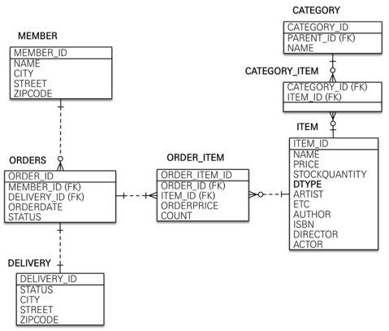

> - 이미지 출처 : 인프런 - 실전! 스프링 부트와 JPA 활용1 - 김영한님
# 📃 목차
***
### ✏️ [JPA와 DB 설정](#-jpa와-db-설정)
### ✏️ [테이블과 도메인 설계](#-테이블-설계)


# 📌 JPA와 DB 설정
****
### 🧐 application 설정
```yaml
spring:
  datasource:
    url: jdbc:h2:tcp://localhost/~/jpashop
    username: sa
    password:
    driver-class-name: org.h2.Driver

  jpa:
    hibernate:
      ddl-auto: create
    properties:
      #      show_sql: true
      hibernate.format_sql: true

logging:
  level:
    org.hibernate:
      SQL: DEBUG
      type: TRACE
```
- show_sql 과 logging level DEBUG 는 둘다 쿼리를 보여주는 역할을 하지만, show sql은 print이기 때문에 logging을 이용하는 것이 일반적으로 더 좋다.
- format_sql 은 발생된 sql을 줄바꿈을 통해 보기 좋게 정렬해준다.
- ```logging.level.org.hibernate.type: TRACE``` 는 바인딩된 파라미터의 값을 보여준다.
  - 바인딩 값을 보여주는 라이브러리 :p6spy 등을 사용해도 된다.
### 🧐 Repository
```java
@Repository
public class MemberRepository {

    @PersistenceContext
    private EntityManager em;

    public Long save(Member member){
        em.persist(member);
        return member.getId();
    }

    public Member find(Long id){
        return em.find(Member.class, id);

    }
}
```
- #### @PersistenceContext : EntityManagerFactory 를 생성할 필요없이 Spring Boot 에서 관리해준다. 

### 🧐 Test Code
```java
@Transactional
@SpringBootTest
//@Rollback(false)
class MemberRepositoryTest {

    @Autowired
    MemberRepository memberRepository;

    @DisplayName("Member 저장")
    @Test
    void saveTest(){
        // given
        Member member = new Member();
        member.setUsername("kim");

        //when
        Long saveId = memberRepository.save(member);

        //then
        assertThat(memberRepository.find(saveId)).isEqualTo(member);
    }
}
```
- #### @Transactional: EntityManager를 통한 모든 데이터 변경은 Transaction 안에서 이루어 져야 한다.
    - Test 환경에서 @Transactional을 사용하게 되면, Test가 끝난 뒤 DB를 Rollback 시킨다.
- #### @Rollback(false): 테스트를 종료한 후 Rollback하지 않고 Commit
- asserThat에서는 member와 find로 가져온 member을 '=='비교를 실행하게 되는데, 같은 transaction 안에서 이루어졌기 때문에 두 엔티티는 같음이 보장된다.
    - 영속성 컨텍스트에서 가져오기 때문에 같다.(실제로 select 쿼리가 발생하지 않는다.)
    


# 📌 테이블 설계
****


- Entity 에서는 Getter, Setter를 생성하지 않고, 꼭 필요할 때 별도의 메서드를 이용하는 것이 이상적,
  하지만 실제로는 엔티티를 조회할 일이 너무 많기 때문에 Getter를 열어두고 사용한다.
- Setter는 데이터를 변경할 수 있기 때문에, 막 열어두면 어디서 데이터가 변경되었는지 추적하기가 어려워진다. 때문에 Setter는 닫아두고, 데이터 변경을 위한 비즈니스 메서드를 별도로 생성하는 것이 좋다.

- ####🤔 id의 컬럼명을 "entity_id"로 설정 하는 이유
  - 데이터베이스에는 타입이 없기 때문에 모두 id로 해두면 나중에 데이터를 구분하기 어렵다.
  - 외래키와 이름을 맞추기 위해서 같게 설정한다.
  - 가장 중요한 것은 일관성을 맞추는 것이다.
  

### ☝️ 임베디드 타입의 불변
```java
@Getter
@AllArgsConstructor
@Embeddable
public class Address {

    private String city;
    private String street;
    private String zipcode;

    protected Address(){}

}
- 값을 변경하면 안되기 때문에 Setter는 사용하지 않는다.(변경 하고자 할때는 새로운 객체 생성.)
- 모든 필드를 받아 생성하는 생성자를 만들고, 기본 생성자를 protected로 만들어 빈 객체를 생성하지 않도록 유도.
```
### ☝️ 연관관계 편의 메서드
```java
 public void setMember(Member member){
        this.member = member;
        member.getOrders().add(this);
 }
```
- 양방향 매핑에서 편리하게 값을 세팅하기 위해 편의 메서드를 작성한다.


### 🖍 엔티티 설계시 주의할 점.
- 양방향 매핑 관계는 반드시 연관관계의 주인 설정.
- Enum 타입은 ```@Enumerated(EnumType.STRING)``` 설정.
- @ManyToOne, @OneToOne ```fetch = FetchType.LAZY``` 설정.(N+1이 발생하지 않도록.)
  - 한번에 부르기 위해서는 Fetch Join, EntityGraph를 사용한다.
- 컬렉션은 필드에서 바로 초기화.
  - null 예외에서 안전.
  - 하이버네이트에서 엔티티를 영속화 할때 컬렉션을 자신이 제공하는 컬렉션으로 변경한다. 이 때 임의의 메서드에서 컬렉션을 생성한다면 내부 매커니즘에서 문제가 발생할 수 있다.
    때문에 필드에서 한번 생성한 후 컬렉션을 교체하지 않는 것이 안전하다.
- #### 스프링 부트의 테이블 네이밍
  - Camel Case -> 언더스코어(_)
  - 점(.)을 언더스코어로(_)
  - 대문자를 모두 소문자로.
  - ex) orderStatus -> order_status