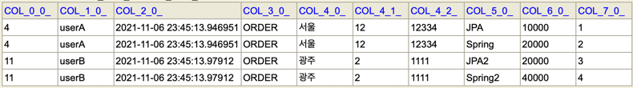

# 📌 회원 등록 API
****
## 🧐 V1 - 엔티티를 그대로 사용.
```java
@PostMapping("/api/v1/members")
public CreateMemberResponse saveMemberV1(@RequestBody @Valid Member member){
    Long newAccountId = memberService.join(member);
    return new CreateMemberResponse(newAccountId);
}

@Data
static class CreateMemberResponse{
    private Long id;

    public CreateMemberResponse(Long id) {
        this.id = id;
    }
}
```

### 🖍 요청 파라미터를 엔티티로 받았을 때의 문제점.
- 엔티티가 변경되었을 때 API의 스펙또한 변경되어야 한다.
- 프레젠테이션 계층을 위한 검증 로직이 엔티티에 들어가게 된다.(@NotEmpty)
  - API에 따라 @NotEmpty가 필요하지 않을 수도 있다.
  
## 🧐 V2 - DTO 사용
```java
@PostMapping("/api/v2/members")
    public CreateMemberResponse saveMemberV2(@RequestBody @Valid CreateMemberRequest request){
        Long newAccountId = memberService.join(request.toEntity());
        return new CreateMemberResponse(newAccountId);
    }
@Data
static class CreateMemberRequest{
  @NotEmpty
  private String name;

  public Member toEntity(){
    Member member = new Member();
    member.setName(name);
    return member;
  }
}
```
- 엔티티 스펙이 변경되어도 API스펙을 변경하지 않아도 된다.
- 외부에 엔티티가 노출되지 않는다.
- 어떤 데이터를 요구하는지 명확하다.


# 📌 회원 수정 API
***
```java
@PutMapping("/api/v2/members/{id}")
public UpdateMemberResponse UpdateMemberV2(@PathVariable("id") Long id,
                                           @RequestBody @Valid UpdateMemberRequest request){
    Long memberId = memberService.update(id, request.getName());
    Member member = memberService.findById(memberId);
    return new UpdateMemberResponse(member.getId(), member.getName());
}

@Data
@AllArgsConstructor
static class UpdateMemberResponse{
    private Long id;
    private String name;
}
@Data
static class UpdateMemberRequest{
    private String name;
}
```
- PUT 메서드 사용.
- memberService 에서 id로 멤버를 찾은 후 해당 값을 변경,     
  Transaction 이 끝나는 시점에 Commit 이 이루어지며 변경 감지를 통해 데이터가 변경된다.
  
### 🖍 memberService.update()에서 member를 반환하지 않는 이유.
- 엔티티 조회와의 분리. member엔티티를 반환하게 되면 조회의 성격을 가지게 되기 때문에 분리한다.
- 유지보수성 증대.

# 📌 회원 조회 API

## 🧐 V1 - List\<Member\>
```java
@GetMapping("/api/v1/members")
public List<Member> membersV1(){
    return memberService.findMembers();
}
```

### 🖍 순환 호출 -> 무한 루프
```json
[
  {
    "id": 1,
    "name": "kim",
    "address": {
      "city": "city1",
      "street": "street1",
      "zipcode": "1"
    },
    "orders": [
      {
        "id": 4,
        "orderDate": "2021-10-24T22:08:48.39548",
        "status": "ORDER",
        "member": {
          "id": 1,
          "name": "kim",
          "address": {
            "city": "city1",
            "street": "street1",
            "zipcode": "1"
          },
          "orders": [
            {
              "id": 4,
              "orderDate": "2021-10-24T22:08:48.39548",
              "status": "ORDER",
              "member": {
                "id": 1,
                "name": "kim",
                "address": {
                  "city": "city1",
                  "street": "street1",
                  "zipcode": "1"
                },
                "orders": [
                  ...  
]

```
- orders에 ```@JsonIgnore```를 사용하여 orders를 보내지 않도록 할 수 있다.

- 엔티티의 모든 값이 노출.
- 엔티티 변경시 API 스펙이 변경되어야 한다.
- 프레젠테이션 계층의 로직이 추가된다.
- API 응답 스펙에 맞추기 위해 추가적인 로직(JsonIgnore) 필요.
- 한 엔티티로 다양한 API를 위한 응답 로직을 담기는 어렵다.
- 가장 바깥쪽이 Array로 되어있기 때문에 API 스펙을 변경하기 어렵다 
  - count를 넣어달라 -> 추가할 수 없음.
  - 바깥쪽이 Array가 아닌 Object라면 가능하다
  
## 🧐 V2 - Result, MemberDTO
```java
    @GetMapping("/api/v2/members")
    public Result memberV2(){
        List<MemberDto> memberDtos = memberService.findMembers().stream()
                .map(m -> new MemberDto(m.getName(), m.getAddress()))
                .collect(Collectors.toList());

        return new Result(memberDtos.size(),memberDtos);
    }

    @Data
    @AllArgsConstructor
    static class Result<T>{
        private int count;
        private T data;
    }

    @Data
    @AllArgsConstructor
    static class MemberDto{
        private String name;
        private Address address;
    }
```
  ```json
  {
    "count": 2,
    "data": [
      {
        "name": "kim",
        "address": {
          "city": "city1",
          "street": "street1",
          "zipcode": "1"
        }
      },
      {
        "name": "kim2",
        "address": {
          "city": "city2",
          "street": "street2",
          "zipcode": "2"
        }
      }
    ]
  } 
  ```
- Result로 한번 감싸주었기 때문에 가장 바깥쪽이 Array가 아닌 Object. 확장 가능.


# 📌 간단한 주문 조회 API - 지연 로딩과 조회 성능 최적화
***

## 🧐 V1 - 엔티티 직접 노출
```java
@GetMapping("/api/v1/simple-orders")
public List<Order> ordersV1(){
      return orderService.findOrders(new OrderSearch());
}
```
- Order와 양방향 연관관계를 맺고 있는 엔티티들이 존재하기 때문에 JSON객체를 생성할 때 순환으로 계속 객체를 생성하게되는 무한루프에 빠지게 된다.
- 양방향 연관관계의 반대쪽에서 Order를 참조하는 부분에 ```@JsonIgnore```를 사용하여 생성하지 않도록 해야한다.

### 🖍 Json객체 생성시 프록시 객체.
```json
Type definition error: 
[simple type, class org.hibernate.proxy.pojo.bytebuddy.ByteBuddyInterceptor]
```
- Lazy로딩을 사용할 때 해당 객체를 비워둘 수 없기 때문에 Hibernate 에서 프록시 객체를 넣어둔다.(ByteBuddy 사용)
- 그러나 Jackson 라이브러리는 프록시 객체를 다루지 못해 발생한 에러.
```json
implementation 'com.fasterxml.jackson.datatype:jackson-datatype-hibernate5'
```
```java
@Bean
Hibernate5Module hibernate5Module(){
    return new Hibernate5Module();
}
```
- Hibernate5Module를 사용 해결 가능. -> 기본으로 Lazy Loading은 null로 채워준다.
```java
@Bean
Hibernate5Module hibernate5Module(){
    Hibernate5Module hibernate5Module = new Hibernate5Module();
    hibernate5Module.configure(Hibernate5Module.Feature.FORCE_LAZY_LOADING, true);
    return hibernate5Module;
}
```
- Force Lazy Loading 옵션을 사용하면 Json을 생성하는 시점에 로딩해 값을 채워준다.
- 사용하지 않는 것들도 모두 가져와버리기 때문에 성능 이슈가 발생한다.
- Force Lazy Loading을 사용하지 않고 프록시를 강제 초기화시켜 해결할 수도 있다.(member의 name을 호출 ->프록시 객체가 초기화 된다.)


## 🧐 V2 - 엔티티를 DTO로 변환
```java
@GetMapping("/api/v2/simple-orders")
public Result ordersV2(){
    List<SimpleOrderDto> orderDtos = orderService.findOrders(new OrderSearch()).stream()
            .map(o -> new SimpleOrderDto(o))
            .collect(Collectors.toList());

    return new Result(orderDtos);
}
@Data
@AllArgsConstructor
static class Result<T>{
    private T orders;
}

@Data
static class SimpleOrderDto{
    private Long orderId;
    private String name;
    private LocalDateTime orderDate;
    private OrderStatus orderStatus;
    private Address address;

    public SimpleOrderDto(Order order){
        this.orderId = order.getId();
        this.name = order.getMember().getName(); // Lazy 초기화
        this.orderDate = order.getOrderDate();
        this.orderStatus = order.getStatus();
        this.address = order.getDelivery().getAddress(); // Lazy 초기화
    }

}
```
- orderService.findOrders 에서 Order 를 조회.
- DTO 값을 설정할 때 Member 와 Delivery 를 Lazy 로딩으로 가져옴. -> N+1 쿼리 문제 발생.(영속성 컨텍스트에 없는 데이터당 1건)

## 🧐 V3 - DTO + Fetch Join

```java
public List<Order> findOrdersWithMemberAndDelivery(OrderSearch orderSearch) {
        JPAQueryFactory query = new JPAQueryFactory(em);
        QOrder order = QOrder.order;
        QMember member = QMember.member;
        QDelivery delivery = QDelivery.delivery;

        return query.selectFrom(order)
                      .where(eqStatus(orderSearch.getOrderStatus(), order),
                            likeName(orderSearch.getMemberName(), order))
                      .join(order.member, member).fetchJoin()
                      .join(order.delivery, delivery).fetchJoin()
                      .fetch();
}
```
- Fetch Join을 사용하여 N+1 쿼리문제 해결.
- Order, Member, Delivery 를 한번에 Select 절에 넣어 조회해 온다.
- 이미 조회해 영속성 컨텍스트에 존재하기 때문에 Lazy Loading 이 발생하지 않고 한번의 쿼리만 발생하게 된다.

```sql
 select
        order0_.order_id as order_id1_6_0_,
        member1_.member_id as member_i1_4_1_,
        delivery2_.delivery_id as delivery1_2_2_,
        order0_.delivery_id as delivery4_6_0_,
        order0_.member_id as member_i5_6_0_,
        order0_.order_date as order_da2_6_0_,
        order0_.status as status3_6_0_,
        member1_.city as city2_4_1_,
        member1_.street as street3_4_1_,
        member1_.zipcode as zipcode4_4_1_,
        member1_.name as name5_4_1_,
        delivery2_.city as city2_2_2_,
        delivery2_.street as street3_2_2_,
        delivery2_.zipcode as zipcode4_2_2_,
        delivery2_.status as status5_2_2_ 
    from
        orders order0_ 
    inner join
        member member1_ 
            on order0_.member_id=member1_.member_id 
    inner join
        delivery delivery2_ 
            on order0_.delivery_id=delivery2_.delivery_id
```


## 🧐 V4 - JPA에서 DTO로 바로 조회

```java
@GetMapping("/api/v4/simple-orders")
public Result ordersV4(){
    List<SimpleOrderQueryDto> orderDtos = orderService.findOrderDto(new OrderSearch());
    return new Result(orderDtos);
}
```
- ### ✏️ JPQL 사용
```java
return em.createQuery(
                "select new jpabook.module.order.SimpleOrderQueryDto(o.id, m.name, o.orderDate, o.status, d.address) " +
                        "from Order o " +
                        "join o.member m " +
                        "join o.delivery d " +
                        "where o.status = :status and o.member.name = :name", SimpleOrderQueryDto.class)
                .setParameter("status", orderSearch.getOrderStatus())
                .setParameter("name", orderSearch.getMemberName())
                .getResultList();
```


- ### ✏️ Querydsl 사용
```java
JPAQueryFactory query = new JPAQueryFactory(em);
QOrder order = QOrder.order;
QMember member = QMember.member;
QDelivery delivery = QDelivery.delivery;


return query.select(Projections.constructor(SimpleOrderQueryDto.class,
                order.id,
                member.name,
                order.orderDate,
                order.status,
                delivery.address))
            .from(order)
            .join(order.member, member) // 별칭 클래스.
            .join(order.delivery, delivery)
            .where(eqStatus(orderSearch.getOrderStatus(), order),
                likeName(orderSearch.getMemberName(), order))
            .fetch();
```
- Projection.constructor : 생성자를 이용. 파라미터의 순서, 타입이 맞아야 한다.
- Projection.bean : 기본 생성자를 이용하여 객체를 생성한 후 Setter 를 이용하여 값을 셋팅.
- Projection.fields : 리플렉션 API를 사용하여 필드에 직접 값 주입(기본 생성자 필요)
- order.id.as("orderId)와 같이 별칭 가능.
```sql
select
        order0_.order_id as col_0_0_,
        member1_.name as col_1_0_,
        order0_.order_date as col_2_0_,
        order0_.status as col_3_0_,
        delivery2_.city as col_4_0_,
        delivery2_.street as col_4_1_,
        delivery2_.zipcode as col_4_2_ 
    from
        orders order0_ 
    inner join
        member member1_ 
            on order0_.member_id=member1_.member_id 
    inner join
        delivery delivery2_ 
            on order0_.delivery_id=delivery2_.delivery_id 
```

- fetch join을 이용했을때는 테이블 전체를 Select 하기 때문에 필요없는 데이터 또한 조회하게 된다.
- DTO 를 이용하면 필요한 데이터만을 조회하여 가져올 수 있다. Select 절에서 조회하는 데이터가 줄어든 것을 확인 할 수 있다.
- DTO 를 사용하여 반환받으면 성능은 조금 더 최적화될 수 있지만, 재사용성이 거의 없다.(member 의 이름이 아니라 전화번호가 필요하다면?)
- 필요에 따라 어떤것을 사용할지 결정.
- Repository 는 객체 그래프를 탐색하는 용도(엔티티 조회)로만 사용되는 것이 좋다. 때문에 DTO를 반환하는 쿼리는 따로 이러한 쿼리를 모아두는 Repository 를 따로 두는 것이 좋다.

### 🔑 성능 최적화 순서.
    1. 엔티티를 DTO 로 변환하여 사용.
    2. N + 1등 성능 이슈가 발생하면 Fetch Join 사용.
    3. 필드가 매우 많아 그래도 해결되지 않는다면 DTO로 직접 조회하는 방법 사용.
    4. JPA 가 제공하는 네이티브 SQL 이나 스프링 JDBC Template 를 사용하여 직접 SQL 사용.

# 📌 주문 조회(orderItems 포함)
***
## 🧐 V1 - 엔티티 직접 노출
```java
@GetMapping("/api/v1/orders")
public List<Order> ordersV1(){
    List<Order> all = orderService.findOrders(new OrderSearch());

    // 프록시 강제 초기화.
   for (Order order : all) {
        order.getMember().getName();
        order.getDelivery().getAddress();
        List<OrderItem> orderItems = order.getOrderItems();
        orderItems.stream()
                .forEach(o->o.getItem().getName());
    }
    return all;
}
```
- 양방향 연관관계에는 @JsonIgnore 필수.
- Hibernate5Module을 기본 옵션으로 생성한다면 프록시를 강제로 초기화하는 것이 필요하다.

## 🧐 V2 - Dto 사용
```java
@GetMapping("/api/v2/orders")
public Result<OrderDto> ordersV2(){
    List<Order> orders = orderService.findOrders(new OrderSearch());
    List<OrderDto> collect = orders.stream()
            .map(o -> new OrderDto(o))
            .collect(Collectors.toList());

    return new Result(collect);
}
@Data
static class OrderDto{
    private Long orderId;
    private String name;
    private LocalDateTime orderDate;
    private OrderStatus orderStatus;
    private Address address;
    private List<OrderItemDto> orderItems;

    public OrderDto(Order order){
        this.orderId = order.getId();
        this.name = order.getMember().getName();
        this.orderDate = order.getOrderDate();
        this.orderStatus = order.getStatus();
        this.address = order.getDelivery().getAddress();
        this.orderItems = order.getOrderItems().stream()
                .map(oi -> new OrderItemDto(oi))
                .collect(Collectors.toList());;
    }
}
@Data
static class OrderItemDto{
    private String itemName;
    private int orderPrice;
    private int count;

    public OrderItemDto(OrderItem orderItem){
        this.itemName = orderItem.getItem().getName();
        this.orderPrice = orderItem.getOrderPrice();
        this.count = orderItem.getCount();
    }
}
```
- Order 엔티티만을 Dto로 변환하는데 그치지 않고, Order 엔티티 내부에 있는 엔티티들 또한 Dto로 변경해주어야 한다.
- 내부에 엔티티가 있으면 똑같이 프록시가 들어가 null이 들어가고, 강제 초기화를 시켜주어야 한다.
- Order를 불러올때 N+1(delivery,member), OrderItems를 불러올때 N+1(item) 이 발생하여 무수히 많은 쿼리가 실행된다.

## 🧐 V3 - FetchJoin
```java
public List<Order> findOrdersWithMemberAndDeliveryAndItem(OrderSearch orderSearch) {
        JPAQueryFactory query = new JPAQueryFactory(em);
        QOrder order = QOrder.order;
        QMember member = QMember.member;
        QDelivery delivery = QDelivery.delivery;
        QOrderItem orderItem = QOrderItem.orderItem;
        QItem item = QItem.item;

        return query.selectFrom(order)
                .where(eqStatus(orderSearch.getOrderStatus(), order),
                        likeName(orderSearch.getMemberName(), order))
                .join(order.member, member).fetchJoin()
                .join(order.delivery, delivery).fetchJoin()
                .join(order.orderItems, orderItem).fetchJoin()
                .join(orderItem.item, item).fetchJoin()
                .distinct()
                .fetch();
    }
```
- orderItems 와 Item을 fetchJoin.
- 컬렉션을 조인(OneToMany)하게 되면 데이터가 증가한다.(order id=1인 orderItem이 2개라면 order id=1인 데이터가 2번 조회된다.)
- distinct()를 추가하여 중복된 데이터를 제거해준다.
  - 실제 row는 join된 item이 다르기 때문에 DB상으로는 다르지만 java 엔티티 객체상으로는 같기 때문에(id가 동일) 제거된다.(원래의 distinct 기능 외에 JPA의 기능이 추가되어 있다.)
  
### 🖍 단점: 페이징이 불가능해진다.
  - firstResult, maxResult를 설정해도, 메모리에서 실행할 것이라는 경고문구가 발생하고, 메모리에서 페이징 처리를 한다.
    - 그러나 데이터의 수가 많아지면 OOM가 발생하고, 메모리로 이러한 데이터를 올린다는 것 자체가 위험하다.
  - distinct 또한 제대로 적용되지 않기 때문에 내가 원하는 데이터를 가지고 페이징할 수 없다.(row의 데이터가 다름.)

  - 컬렉션 fetch join은 1개만 사용할 수 있다.(1 : N : N 등 불가능.)

## 🧐 V3.1 컬렉션 조회 페이징과 한계 돌파
1. -ToOne 관계는 데이터가 증가하지 않으므로, fetchJoin을 걸어준다.
2. 컬렉션은 지연 로딩으로 조회.
3. 지연로딩 성능 최적화를 위해 ```spring.jpa.properties.hibernate.default_batch_fetch_size``` 또는 @BatchSize(size = n)를 적용한다.(batchSize만큼 미리 가져온다.)
   - in (?, ?, ... ?) 쿼리가 발생하며 설정한 수 만큼 미리 가져온다.
    ```sql
    where
    orderitems0_.order_id in (
        ?, ?
    )  
   /*params : 1,2, .. */
    ```
    #### ✏️ 결론
        -️ 컬렉션 패치조인을 사용하지 않았으므로 당연히 페이징이 가능하다.
        - 또한 컬렉션 패치조인에서 distinct 를 하더라도 DB 쿼리상에서는 더 늘어난 데이터를 조회한 후에 JPA에서 이를 제거하게 되는데,
        이러한 과정이 빠져 성능최적화가 이루어진다. 
        - size는 100~1000 사이를 선택하는 것을 권장. 데이터베이스에 따라 1000으로 제한하기도 한다.
        대체적으로 1000개로 설정하는 것이 더 좋지만 순간 부하를 견딜수 없다면 더 낮은 수를 권장한다.


## 🧐 V4 - DTO로 바로 조회하기.

```java
public List<OrderQueryDto> findOrder() {
        JPAQueryFactory query = new JPAQueryFactory(em);
        QOrder order = QOrder.order;
        QMember member = QMember.member;
        QDelivery delivery = QDelivery.delivery;

        return query
                .select(Projections.constructor(OrderQueryDto.class,
                        order.id, member.name, order.orderDate, order.status, delivery.address))
                .from(order)
                .join(order.member, member)
                .join(order.delivery, delivery)
                .fetch();
}
```
- order DTO에 담아 바로 조회한다.
```java
private List<OrderItemQueryDto> findOrderItems(OrderQueryDto o) {
        JPAQueryFactory query = new JPAQueryFactory(em);
        QOrderItem orderItem = QOrderItem.orderItem;
        QItem item = QItem.item;

        return query
                .select(Projections.constructor(OrderItemQueryDto.class,
                       orderItem.order.id, item.name, orderItem.orderPrice, orderItem.count))
                .from(orderItem)
                .where(orderItem.order.id.eq(o.getOrderId()))
                .join(orderItem.item, item)
                .fetch();
}

public List<OrderQueryDto> findOrderDto(){
        List<OrderQueryDto> orders = findOrder();

        orders.stream()
                .forEach(o-> o.setOrderItems(findOrderItems(o)));
        return orders;
}
```
- 이전에 조회한 order에 order의 id를 이용하여 orderItem 을 조회하여 넣어준다.
- orderItem 또한 DTO에 담아서 조회한다.

#### 🖍 N + 1 : foreach를 돌리며 각각 조회하기 때문에 N + 1 쿼리 문제가 발생한다.

## 🧐 V5 - DTO로 바로 조회하기 - 최적화.
```java
public List<OrderQueryDto> findOrderDtoOptimization() {
        List<OrderQueryDto> orders = findOrder();

        Map<Long, List<OrderItemQueryDto>> orderItemMap = findOrderItemMap(getOrderIds(orders));
        orders.forEach(o->o.setOrderItems(orderItemMap.get(o.getOrderId())));

        return orders;
    }
```
```java
private List<Long> getOrderIds(List<OrderQueryDto> orders) {
    List<Long> orderIds = orders.stream()
            .map(o -> o.getOrderId())
            .collect(Collectors.toList());
    return orderIds;
}

private Map<Long, List<OrderItemQueryDto>> findOrderItemMap(List<Long> orderIds) {
    JPAQueryFactory query = new JPAQueryFactory(em);
    QOrderItem orderItem = QOrderItem.orderItem;
    QItem item = QItem.item;
    
    List<OrderItemQueryDto> orderItems = query
                    .select(Projections.constructor(OrderItemQueryDto.class,
                            orderItem.order.id, item.name, orderItem.orderPrice, orderItem.count))
                    .from(orderItem)
                    .where(orderItem.order.id.in(orderIds))
                    .join(orderItem.item, item)
                    .fetch();

    return DtoToMap(orderItems);
}

private Map<Long, List<OrderItemQueryDto>> DtoToMap(List<OrderItemQueryDto> orderItems) {
    Map<Long, List<OrderItemQueryDto>> orderItemMap = orderItems.stream()
            .collect(Collectors.groupingBy(orderItemQueryDto -> orderItemQueryDto.getOrderId()));
    return orderItemMap;
    }
```
- order를 미리 조회한 후 OrderItem을 in 절을 이용하여 조회한다.
- in 절을 이용하여 모든 order id에 대해 한번에 조회가 되기 때문에 N+1 문제가 발생하지 않는다.
- 그러나 조회한 OrderItem 은 모든 order에 대한 OrderItem이기 때문에 order에 맞게 분배해주는 전처리가 필요하다.
    - orderId를 key로 Map으로 변환한 후에 order에 맞게 넣어준다.
    


## 🧐 V6 - DTO로 한번에 모두 조회하기, Flat 데이터 최적화
```java
public List<OrderFlatDto> findOrderDtoFlatOptimization() {
        JPAQueryFactory query = new JPAQueryFactory(em);
        QOrder order = QOrder.order;
        QOrderItem oi = QOrderItem.orderItem;
        QMember m = QMember.member;
        QDelivery d = QDelivery.delivery;
        QItem i = QItem.item;

        return query
                .select(Projections.constructor(OrderFlatDto.class, order.id, m.name, order.orderDate,
                        order.status, d.address, i.name, oi.orderPrice, oi.count))
                .from(order)
                .join(order.member, m)
                .join(order.delivery, d)
                .join(order.orderItems, oi)
                .join(oi.item, i)
                .fetch();
    }
```
- order와 orderItem 을 모두 담을 수있는 DTO 를 생성하여 한번에 조회.
#### 🖍 컬렉션 조인을 사용하기 때문에 중복 데이터가 발생한다.
- 애플리케이션 단에서 데이터 정제가 필요.
```java
@GetMapping("api/v6/orders")
public Result<OrderQueryDto> ordersV6(){
    List<OrderFlatDto> flats = orderService.findOrderDtoFlatOptimization();

    // order와 OrderItem key, value로 묶기.
    Map<OrderQueryDto, List<OrderItemQueryDto>> collect = flats.stream()
            .collect(Collectors.groupingBy(o -> new OrderQueryDto(o.getOrderId(), o.getUsername(), o.getOrderDate(), o.getStatus(), o.getAddress()),
                    Collectors.mapping(o -> new OrderItemQueryDto(o.getOrderId(), o.getItemName(), o.getOrderPrice(), o.getCount()), Collectors.toList())));

    // key에는 Order, value에서는 orderItem을 꺼내 사용할 수 있다.
    List<OrderQueryDto> orderDtos = collect.entrySet().stream()
            .map(e -> new OrderQueryDto(e.getKey().getOrderId(), e.getKey().getName(), e.getKey().getOrderDate(), e.getKey().getStatus(), e.getKey().getAddress(),
                    e.getValue()))
            .collect(Collectors.toList());


    return new Result(orderDtos);
}
```
- API 스펙에 맞춰 데이터 가공.
- 플랫데이터를 그대로 반환하면 orderItem에 맞춰 데이터가 생성되기 때문에 member, address등에서 중복이 발생한다.
    - 

### 🔑 정리
- 장점 : 단 한번의 쿼리로 데이터를 가져온다.
- 중복 데이터가 추가되므로 상황에 따라 V5보다 느릴 수 있다.
- 애플리케이션에서 추가 작업이 크다.
- 중복 데이터가 발생하기 때문에 order를 기준으로 페이징 할 수 없다.


## 🔑 API 개발 고급 정리
- ### 엔티티 조회
    - 엔티티를 조회해서 그대로 반환
    - 엔티티로 조회후 DTO로 반환
    - 패치 조인으로 쿼리 수 최적화(xToOne)
    - 컬렉션과 페이징
        - 컬렉션은 패치 조인시 페이징이 불가능.(메모리에서 페이징, 데이터 증가.)
        - ToOne 관계는 패치 조인으로 쿼리 수를 최적화하고, 컬렉션은 지연 로딩으로 설정 후 batch size 를 이용하여 최적화.
            - ```spring.jpa.properties.hibernate.default_batch_fetch_size: ```
            - ```@BatchSize(size =)``` 
    
- ### DTO 로 바로 조회
    - JPA에서 DTO를 직접 조회.(jpql의 new 또는 querydsl의 Projections)
    - 컬렉션 조회 최적화 : IN 절을 활용하여 메모리에서 미리 조회해서 최적화.(IN절로 조회 후 알맞게 매핑.)
    - 플랫 데이터 최적화 : 모두 조인하여 조회 후 애플리케이션 단에서 원하는 API 스펙에 맞게 변환.

### ✏️ 권장 순서
> 1. 엔티티 조회후 DTO로 반환하는 방식으로 우선 접근.(코드를 거의 수정하지 않고 다양한 성능 최적화 시도 가능.)
>    - 패치 조인으로 쿼리 수를 최적화.
>    - batch size로 컬렉션 조회 최적화.(페이징이 필요없다면 fetch join + distinct 사용.)
> 2. 엔티티 방식으로 성능 문제를 해결할 수 없다면 DTO로 바로 조회하는 방식을 사용.(많은 코드 변경이 필요.) 
> 3. DTO 조회 방식으로도 해결이 안된다면 NativeSQL 또는 Spring JdbcTemplate 사용.

### 🖍 DTO 조회 방식의 선택지
    - V4는 코드가 단순하다. 특정 주문을 한건만 조회할 것이라면 V4를 사용하여도 된다.
    - 그러나 여러 주문을 한번에 조회한다면 V4에서는 N+1 쿼리 문제가 발생하기 때문에 이를 최적화 한 V5가 훨씬 성능이 잘 나온다.
    - V6는 쿼리가 단 한번 나가기 때문에 성능이 좋아보이지만 Order를 기준으로 페이징이 불가능 하다는 단점이 있다. 또한 데이터가 많아진다면,
    그만큼 중복 데이터도 증가하기 때문에 성능 증가 또한 미비하다.
