> 이미지 출처: 자바 ORM 표준 JPA 프로그래밍 - 기본편 김영한님.

### 🤔 SQL 중심적인 개발의 문제.
> - 반복적인 SQL 작성 및 유지보수가 힘들다.
> - 객체, 관계형 데이터베이스의 패러다임 불일치.
> - 상속, 연관관계, 데이터 타입, 데이터 식별 방법 등의 차이.

> - 처음 실행하는 SQL에 따라 탐색 범위가 결정된다.
> > - 처음에 member의 team만 join하였다면 team은 얻어올 수 있지만 join하지 않은 order에 대한 정보를 꺼낼 수 없다.
> > - 엔티티 신뢰 문제가 발생한다. 어떤 정보를 가져왔는지 알 수 없기 때문에, 함부로 데이터를 꺼낼 수 없게된다.

> - 객체 답게 모델링을 할 수록 매핑 작업만 늘어난다.(상속, equals 등 ..)
> > 🤔 객체를 자바 컬렉션에 저장 하듯이 DB에 저장 할 수 없을까?   
> > -> JPA의 등장.


# 📌 JPA?
****
> - Java Persistence API
> - 자바 진영의 ORM 기술 표준   
> - 애플리케이션과 JDBC 사이에서 동작.
> 
> 🤔 ORM? Object Relational Mapping:
> 객체는 객체대로, 관계형 DB는 관계형 DB 대로 설계, ORM 프레임워크가 중간에서 매핑.

- JPA는 인터페이스의 모음
- JPA 2.1 표준 명세를 구현한 구현체 :Hibernate, EclipseLink, DataNucleus

## 🧐 JPA를 사용하는 이유
> SQL 중심 개발에서 객체 중심 개발로.
⁄⁄⁄
- ### ☝️ 생산성
    - CRUD 메소드가 간단한다(persist(), find(), set*(), remove())

- ### ☝️ 유지보수
    - 기존: 필드 수정 모든 SQL 수정.
    - JPA: 필드만 추가하면 된다. SQL은 JPA에서 관리.
    
- ### ☝️ 패러다임의 불일치 해결
  > ✏️ 상속
  > - 저장: 하나의 메소드를 호출하면 상위 클래스와 하위 클래스를 나누어 쿼리를 생성, 각각 데이터를 저장한다.
  > - 조회: 필요한 데이터를 자동으로 조인해서 가져온다.   
  > 
  > ✏️ 연관관계, 객체 그래프 탐색
  > - 자바 컬렉션을 사용하듯이 데이터를 저장하고, 가져올 수 있다.
  > - 지연로딩을 이용한 자유로운 객체 그래프 탐색 -> 신뢰할 수 있는 엔티티
  > 
  > ✏️ 엔티티의 비교
  > - 기존: 동일한 데이터를 가졌더라도 새로 객체를 생성하기 때문에 '==' 비교를 했을 때 다른 객체로 나오게 된다. equals의 재정의 필요.
  > - JPA: 동일한 트랙잭션에서 조회한 엔티티는 같음을 보장한다.
  > 
  > ✏️ JPA의 성능 최적화
  > - 1차 캐시와 동일성 보장
  >     - 같은 트랙잭션 안에서는 같은 엔티티를 반환 -> 약간의 조회 성능 향상
  >     - DB Isolation Level이 REad Commit 이어도 애플리케이션에서 Repeatable Read 보장.
  >     ```java
  >     Member m1 = jpa.find(Member.class, 0); // SQL
  >     Member m2 = jpa.find(Member.class, 0); // Cache
  >     m1 == m2 // true
  >     ```
  >   🖍 결과적으로 SQL은 한번만 실행된다.
  >  
  > ✏️ 트랜잭션을 지원하는 쓰기 지연
  > - 트랜잭션을 커밋할 때 까지 INSERT SQL을 모음.
  > - JDBC BATCH SQL 기능을 사용해서 한번에 SQL 전송.
  > - 네트워크 전송 횟수를 줄일 수 있다.
  >   ```java
  >   transaction.begin(); // 트랜잭션 시작
  >   em.persist(A);
  >   em.persist(B);
  >   em.persist(C);
  >   transaction.commit() // 트랜잭션 커밋
  >   ```
  > ✏️ 지연 로딩, 즉시 로딩
  > - 🖍 지연 로딩 : 객체가 실제 사용될 때 로딩.(쿼리가 증가할 수 있다.)
  > - 🖍 즉시 로딩: JOIN SQL로 한번에 연관된 객체까지 <strong>미리 조회.</strong>
  > - JPA에서는 옵션으로 설정이 가능하다.
  > - 항상 함께 로딩해야 하는 데이터가 있다 -> 즉시 로딩이 유리할 수 있다.(쿼리 수가 적어진다.)
  > 

# 📌 영속성 컨텍스트 (Persistence Context)
***
> - JPA를 이해하기에 가장 중요 개념.
> - 엔티티를 영구 저장하는 환경 ```EntityManager.persist(entity)```
> - J2SE 환경 : EntityManager,PersistenceContext는 1:1
> - J2EE, spring과 같은 컨테이너 환경 : N:1

### ☝️ 엔티티의 생명 주기
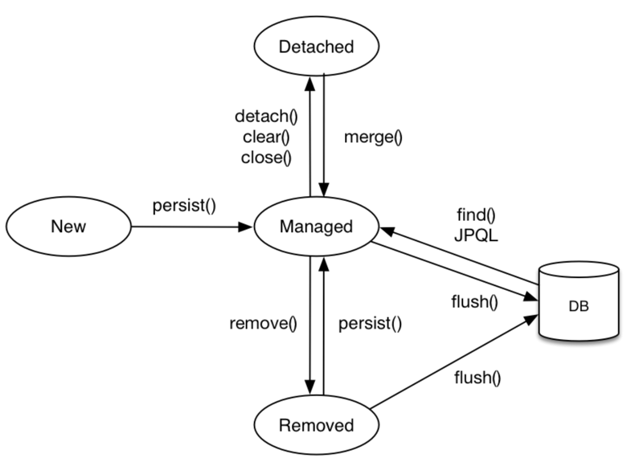

### ☝️ 비영속
- 영속성 컨텍스트와 아무 관계가 없는 상태, (새로 생성된 객체 등)

### ☝️ 영속(persist)
- 객체를 저장한 상태 ```em.persist(entity)```
- 객체를 find() ```em.find(entity.class, entity)```

### ☝️ 준영속(detached)
- 엔티티가 영속성 컨텍트스에서 분리된 상태. ```em.detach(entity)```
- 객체를 삭제한 상태 ```em.remove(entity)```
- 영속성 컨텍스트를 초기화 ```em.clear()```
- 영속성 컨텍스트를 종료 ```em.close()```


## 🧐 영속성 컨텍스트의 이점

  - ### ☝️ 1차 캐시
    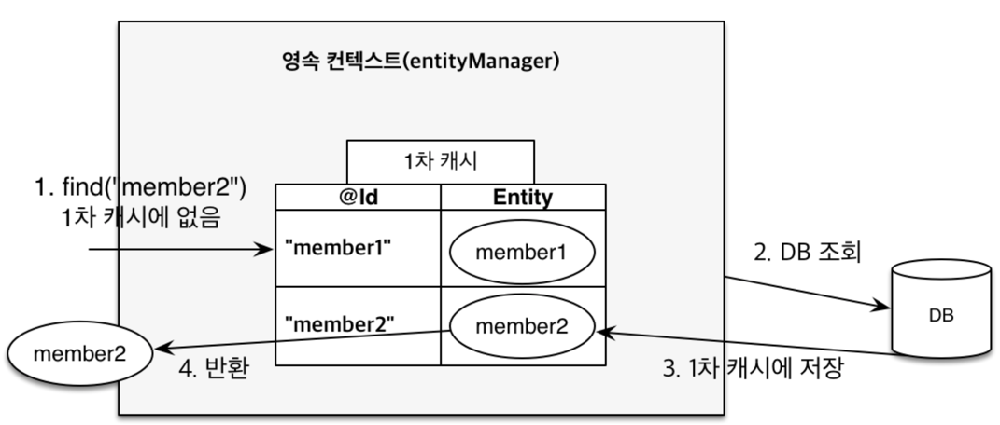
    > - 동일한 트랜젝션에서 다시 조회를 하면 먼저 1차 캐시에서 조회.
    > - 캐시에 존재하면 캐시에서 가져오고 존재하지 않으면 DB에서 조회, 캐시에 저장.
  
  - ### ☝️ 영속 엔티티의 동일성 보장
    > - 여러번 조회하여 같은 엔티티를 가져오면 == 동일성 비교 true
  
  - ### ☝️ 트랜잭션을 지원하는 쓰기 지연
    > - commit 또는 flush 전까지 쓰기지연 저장소에 생성된 sql을 저장하다가 한번에 전송.
    
  - ### ☝️ 엔티티 변경 감지.
    > - commit 시점에 flush가 실해되며 자동으로 엔티티 변경 사항을 감지(엔티티와 스냅샷 비교, 더티 체킹)
    > - Update SQL을 생성, 쿼리 전송.
    > 
    > 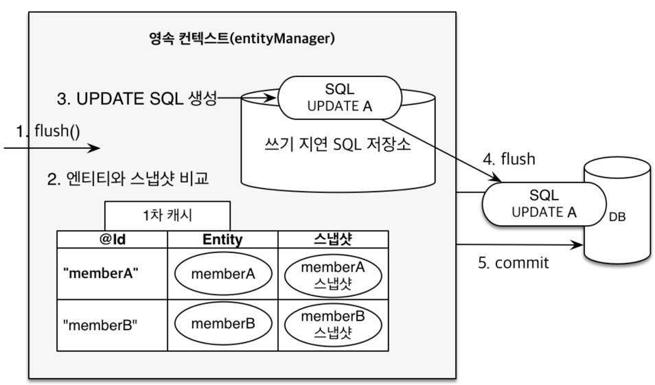
    > 

# 📌 flush
****
- 변경 감지
- 수정된 엔티티 쓰기 지연 SQL 저장소에 등록
- 쓰기지연 SQL 저장소의 쿼리를 데이터베이스에 전송(등록, 수정, 삭제)
- 영속성 컨텍스트를 비우지는 않는다. 동기화만. (쓰기 지연 저장소는 전송 후 비운다)

> 1. 직접 호출 : ```em.flush()```
> 2. 트랜잭션 커밋 : flush 자동 호출.
> 3. JPQL 쿼리 실행 : flush 자동 호출.
> > - FlushModeType.AUTO (defualt)
> > - FlushModeType.COMMIT (commit 할때만 실행)


# 📌 엔티티 매핑
*** 
### ☝️ 객체와 테이블 매핑: @Entity, @Table
- #### @Entity : JPA가 관리하는 엔티티. 필수
  - 기본 생성자 필수 (public or protected) : 리플랙션과 같은 기술을 사용하기 위해.
  - final, enum, interface, inner 클래스는 엔티티로 사용 불가.
  - 저장할 필드에 final을 사용하면 안된다.

- #### @Table
  - name: 매핑할 테이블 이름 (default로는 엔티티 이름을 사용) 
  
### ☝️ 필드와 컬럼 매핑
 
  - #### @Column : 컬럼 매핑
    > - name : 필드와 매핑할 테이블의 컬럼 이름 (default = 객체의 필드 이름)
    > - Insertable, updatable : 등록, 변경 가능 여부. (default = true)
    > - nullable(DDL) : null 제약조건
    > - unique(DDL) : unique 제약조건, 하지만 주로 @Table의 uniqueConstraints를 사용한다.(이름을 설정하기 위해)
    > - columnDefinition: 컬럼 정보를 직접 줄 수 있다 ```columnDefinition = "varchar(100) default 'EMPTY'"```
    > - length : 문자 길이 제약조건, String에만 사용 (default = 255)
    > - precision, scale(DDL): BigDecimal, BigInteger에서 사용, precision은 소수점을 포함한 자릿수, scale은 소수점의 자리수를 명시한다. ```scale = 19```
    
  - #### @Temporal : 날짜 타입 매핑
    - java8 이후부터는 LocalDate, LocalDateTime을 사용하면 생략 가능.
    ```
      @Temporal(TemporalType.TIMESTAMP) | DATE,TIME
      private Date createdDate
    ```
  - #### @Enumerated : enum 타입 매핑 ```@Enumerated(EnumType.STRING)```-> varchar(이름)
    - defalut = ORDINARY(타입의 순서) -> Integer로 들어감, 앞에 새로운 Role을 추가하게되면 순서가 바뀌는 위험성이 있다.
  - #### @Lob : 대용량 컨텐츠 
    - 매핑하는 데이터가 문자면 CLOB, 나머지는 BLOB
  - #### @Transient : 필드를 DB에 매핑하지 않겠다.

### ☝️ 기본키 매핑
  - @Id
  - @GeneratedValue : Id 자동 생성 
    - ```strategy = GenerationType.Identity``` : 기본 키 생성을 DB에 위임
    - ```strategy = GenerationType.SEQUENCE``` : Sequence Object를 따로 두고 기본키 생성을 관리.
      - 테이블 마다 따로 Sequence Object 둘 수도 있다.
        ```java
            @SequenceGenerator(
                name = "MEMBER_SEQ_GENERATOR",
                initialValue = 1, allocationSize = 1 /*(증가 하는 수)*/)
      
            ...
            
            @GeneratedValue(strategy = Generationtype.SEQUENCE, generator = "MEMBER_SEQ_GENERATOR")
        ```
    - ```strategy = GenerationType.TABLE ``` : Sequence 전략을 흉내낸 것, 키 생성용 테이블을 따로 둔다.
        - 모든 DB에 적용이 가능하다는 장점이 있으나, 성능 이슈가 발생할 수 있다.
        ```java
            @TableGenerator(
                name = "MEMBER_SEQ_GENERATOR",
                table = "MY_SEQUENCES",
                pkColumnValue = "MEMBER_SEQ", allocationSize = 1)
      
            ...
            
            @GeneratedValue(strategy = Generationtype.TABLE, generator = "MEMBER_SEQ_GENERATOR")
        ```
        - MY_SEQUENCES 테이블이 생성되고 pk value = MEMBER_SEQ, next_val 은 1을 가지는 투플이 생성된다. next_val 값을 계속 증가 시킨다.
    
- #### 🔑 권장하는 기본 키 제약 조건
    - 기본키 제약 조건: null 아님. 유일, 변하면 안됨.
    - 위의 조건을 만족하는 자연키는 찾기 어렵다. 대체키를 사용(Sequence, UUID 등)
    - 권장 : Long, 대체키 + 키 생성 전략 사용.
    

- #### 🤔 Identity 전략의 특이점
     - 영속성 관리를 하기위해서는 pk 정보가 필요하다. 하지만 Identity 전략에서는 DB에 저장할때 id를 생성하기 때문에, persist시점에 id값이 존재하지 않는다.
       때문에 원래는 commit 시점에 쿼리를 전달하지만 Identity 전략에서는 특이하게 persist 시점에 쿼리를 전달한다.
   
- #### 🤔 Sequence 전략의 특이점.
    - persist를 실행하면 pk를 가져오기 위해 DB의 Sequence Object에서 값을 얻어온 후 엔티티에 넣어주고 영속성 컨테스트에 저장한다.
    - allocationSize를 이용한 성능 최적화:  default값이 50으로 설정되어 있다. 한번 값을 얻어올 때 DB에서는 50이 증가하게 되어있으므로.
    그 다음부터는 id 값이 51이 될때까지 애플리케이션에서는 다시 값을 얻어오지 않고 메모리에서 호출하여 사용한다. 충분한 값을 사용해도 되지만 웹 서버를 내리는 시점에 사라지기 때문에 적절한 값을 사용한다.
      

     🖍 Spring Boot 에서는 네이밍의 관례를 소문자 언더스코어를 사용한다. createdDate -> create_date 

### 👎 테이블의 외래키를 사용하는 방식
```java
public class Order {

    @Id @GeneratedValue
    @Column(name = "order_id")
    private Long id;

    private Long memberId;

    private LocalDateTime orderDate;

    @Enumerated(EnumType.STRING)
    private OrderStatus status;
}
```
> - 위의 예제처럼 주문자의 memberId를 외래키로 저장하게 되면 주문한 사람을 찾는 과정에서 객체 그래프 탐색이 불가능해 객체지향스럽지 않다.
```java
Order order = em.find(Order.class, orderId);
Long memberId = order.getMemberId();
Member member = em.find(Member.class, memberId);
```
> - 해결 : 연관관계 매핑을 이용. field에 Member를 두고 order.getMember() 처럼 주문자를 찾을 수 있다.


# 📌 연관관계 매핑
***
- 방향 : 단방향, 양방향
- 다중성 : 다대일, 일대다, 일대일, 다대다
- 연관관계의 주인 : 객체 양방향 연관관계는 관리 주인이 필요하다.

### ☝️ 단방향 연관관계
```java
public class Member {

    @Id @GeneratedValue
    @Column(name = "member_id")
    private Long id;

    private String name;

    @ManyToOne
    @JoinColumn(name = "team_id")
    private Team team;
```

```java
Member member = em.find(Member.class, 1L);
Team team = member.getTeam();
```


### ☝️ 양방향 연관관계
```java
public class Team {

    @Id
    @GeneratedValue
    @Column(name = "team_id")
    private Long id;

    private String teamName;

    @OneToMany(mappedBy = "team")
    private List<Member> members = new ArrayList<>();
}
```
- Member의 @ManyToOne 에 대응되는 @OneToMany 사용.
- mappedBy를 사용하여 어떤것과 매핑된 것인지 알려줌.
- 그러나 객체는 가급적이면 단방향인 것이 좋다.
- 양방향 매핑은 반대 방향으로 조회가 추가된 것 뿐.
- 단방향 매핑을 잘 하고 양방향은 필요할 때 추가.(역방향으로 탐색할 일이 많을 때, 테이블에 영향이 가지 않는다.)

### 🤔 객체와 테이블이 관계를 맺는 차이
> - 객체 : 사실상 팀 -> 멤버, 멤버 -> 팀 의 단방향 연관관계가 2개 있는것.
> - 테이블 : 양방향 연관관계 하나!

> 🖍 객체 관계에서 멤버의 팀을 바꾸려면 멤버의 팀을 바꿔야 할 지, 팀의 멤버를 바꿔야할 지 알 수 없다. 때문에 둘중 하나에서 외래 키를 관리해야 한다.    
> -> 연관관계의 주인

### 🔑 연관관계의 주인
- 양방향 매핑 규칙
    - 객체의 두 관계중 하나를 연관관계의 주인으로 지정.
    - 연관관계의 주인이 외래키를 가진다.
    - <strong>주인이 아닌쪽은 데이터의 변경 불가, 읽기만 가능.</strong>
      - 예를 들어 멤버가 연관관계의 주인일때 ```team.getMember().add(member);```을 실행하면 쿼리는 나가지만 <mark>실제 DB를 확인해보면 맴버의 외래키 값이 null로 설정된다.</mark>
      - ```member.setTeam(team)```으로 사용해야 한다.
    - 주인은 mappedBy 속성을 사용하지 않는다.
    - 주인이 아니면 mappedBy 속성으로 주인을 지정해준다.
    
    ```
    - 주로 테이블 설계에서 외래 키가 있는 곳을 주인으로 정한다.(N을 담당하는 엔티티)
  
    - 예를 들어 팀과 멤버의 관계에서는 멤버가 연관관계의 주인이 된다.
    만약 팀을 연관관계의 주인으로 설정하게 되면 팀에 멤버를 추가하였는데,멤버의 업테이트 쿼리가 발생하므로, 맞지않다.
    성능 이슈 또한 발생. 
    ```
      
    > 🖍 데이터를 저장할 떄에는 연관관계의 주인 뿐만 아니라 역방향에도 세팅을 해주는 것이 좋다.
    > ```java
    >   team.getMembers().add(member);
    >   member.setTeam(team);
    > ```
    > - 한 트랜잭션 안에서 조회를 하고자 할 때 flush(), clear()를 해주고 다시 조회를 한다면 상관없지만, 그렇지 않으면 1차 캐시에 있던 데이터를 그대로 불러오기 때문에 <mark>이전에 추가한 데이터를 team.getMembers()로 조회할 수 없게 된다.</mark>(1차 캐시에 저장된 데이터에서 불러오게 됨)
    > - 객체 지향적으로도 이상적.
    > - 테스트 케이스 작성할 때 더 유연함.
    > - 연관관계 편의 메서드를 작성 (위의 두 과정을 하나의 메서드로, 멤버 메서드)
    
    > 🖍 양방향 매핑시 무한 루프를 조심하자.
    > - 기본 toString() 사용시 서로를 호출하기 때문에 무한루프가 발생한다. (team에서는 member를 meber에서는 team을)
    > - JSON 생성 라이브러리에서도 마찬가지의 상황이 발생할 수 있다.    
     => 해결 : 컨트롤러에서는 엔티티를 반환하지 말아야 한다. DTO로 반환해야 한다.
    

# 📌 다양한 연관관계 매핑
****
> ✏️ 고려 사항
> - 다중성 : 다대일 일대다, 일대일, 다대다(사용 지양)
> - 단방향 ,양방향
> > - 테이블 : 외래 키 하나로 양쪽 조인이 가능, 방향이라는 개념이 없다.
> > - 객체 : 참조용 필드가 있는 쪽으로만 참조 가능. 양방향은 사실상 두 개의 단방향 -> 외래키를 관리할 곳을 정해주어야 한다 -> 연관관계의 주인.


## ☝️ 다대일 (N:1)
> 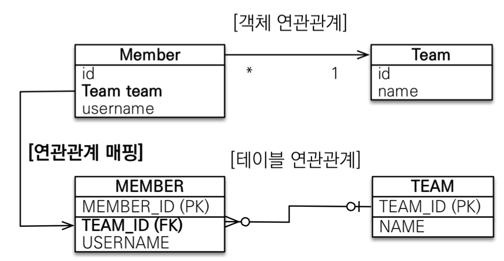
- N에 해당하는 곳이 외래키를 관리.
  ```java
  @ManyToOne
  @JoinColumn(name="team_id")
  Team team;
  ```
- <mark>양방향</mark>은 반대쪽에 @OneToMany를 추가하여 읽을 수 있는 참조를 추가.
- 반드시 mappedBy를 추가.
  ````java  
  @OneToMany(maapedBy="team")
  List<Member> merbers = new ArrayList<>();
  ````
- 양방향을 위해 참조를 추가하더라도 테이블에 영향을 주지 않는다.

## ☝️ 일대다 (1:N) 단방향
> 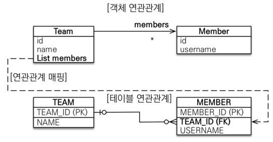
- 잘 사용하지 않는다.
- <mark>객체와 테이블이 외래키를 서로 다른곳에서 가지고 있게 된다.<mark>(테이블은 항상 N쪽에 외래키가 있음.)
- Team의 List<Member>를 변경시키면 Member 테이블에 TEAM_ID가 바뀌도록 쿼리가 발생한다.(멤버 테이블의 업데이트 쿼리가 발생)
    ```java
    @OneToMany
    @JoinColumn(name = "team_id")
    private List<Member> members = new ArrayList<>();
    ```
  - 멤버 테이블의 team_id와 조인.(JoinColumn을 사용하지 않으면 JoinTable방식을 사용하게 된다. -> <mark>중간 테이블이 새로 생성됨</mark>)
- 팀 객체를 수정했는데 멤버 테이블에 쿼리가 나가므로 헷갈릴 수 있다. -> 차라리 다대일 양방향을 사용.

## ☝️ 일대일 (1:1)
- 주 테이블과 대상 테이블 중에 외래키 선택 가능.

> - 주 테이블에 외래키
> 
> 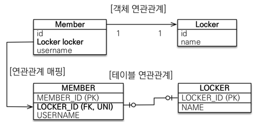
```java
// Member
@OneToOne
@JoinColumn(name="locker_id")
private Locker locker;
```
- 양방향으로 만들고 싶으면 반대편에 참조를 추가하고 mappedBy를 사용하면 된다.
```java
//Locker                 
@OneToOne(mappedBy = "locker")
private Member member;
```
- 자신의 테이블에 있는 외래키를 관리한다. 상대 테이블의 외래키 관리 불가능.
```
- 주 테이블에 외래키 : 주 객체가 대상 객체의 참조를 가지는 형태. 객체 지향 개발자가 선호, JPA 매핑 편리
  장점: 주 테이블만 조회해도 대상 테이블 데이터 여부 확인 가능, 다대일로 변경이 테이블 구조 유지.
  단점: 값이 없다면 null을 허용하게 됨.
- 대상 테이블에 외래 키 : 전통적인 DBA가 선호
  장점: 주 테이블과 대상 테이블을 일대일에서 일대다 관계로 변경할 때 테이블 구조 유지.
  단점: 프록시 기능의 한계로 항상 즉시 로딩으로 사용 됨.(어차피 대상 테이블을 쿼리해야 알 수 있음.)
```

## ☝️ 다대다 (N:M)
```java
// Member
@ManyToMany
@JoinTable(name="MEMBER_PRODUCT")
private List<Product> products = new ArrayList<>();
```

- 관계형 데이터베이스는 정규화된 테이블 두 개로 다대다 관계를 표현할 수 없다.
- 추가적인 정보를 넣는것이 불가능하다.
- 생각지도 못한 쿼리가 발생하기도 한다.
- 실무에서 사용 지양. <mark>일대다 + 다대일 + 일대다 관계로 풀어내야 한다.</mark>

> 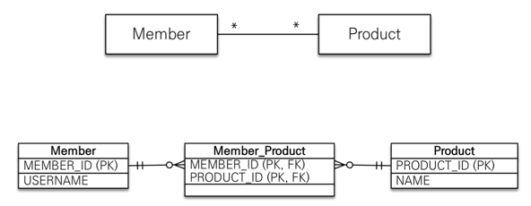
> - 중간 테이블을 엔티티로 승격.
> - 일대다, 다대일, 일대다로 품어낸다.

```java
// Member
@OneToMany(mappedBy = "member")
private List<MemberProduct> memberProducts = new ArrayList<>();
```
```java
// MemberProduct
@ManyToOne
@JoinColumn(name = "member_id")
Member member;

@ManyToOne
@JoinColumn(name = "product_id")
Product product;
```

```java
// Product
@OneToMany(mappedBy = "product")
private List<MemberProduct> memberProducts = new ArrayList<>();
```


### 🤔 @JoinColumn 주요 속성
- name : 매핑할 외래 키 이름 
    ```java
    @JoinColumn(name = "member_id")
    Member member;
    ```
- referencedColumnName : 외래 키가 참조하는 대상 테이블의 컬럼명.(다를 경우 사용)
- foreignKey(DDL) : 외래 키 제약 조건을 직접 지정, 테이블을 생성할때만 사용된다.
- unique, nullable, insertale, updatable, columnDefinition, table ...

### 🤔 @ManyToOne 주요 속성
- optional : false로 설정하면 연관된 엔티티가 항상 있어야 한다 (default = true)
- fetch : 글로벌 패치 전략을 설정. (default = FetchType.EAGER)
- cascade : 영속선 전이 기능.

### 🤔 @OneToMany
- mappedBy : 연관관계의 주인 필드를 선택.
- fetch : 글로벌 패치 전략을 설정. (default = FetchType.LAZY)
- cascade : 영속선 전이 기능. 

# 📌 상속관계 매핑
****
- 관계형 DB에는 상속관계가 없다.
- 가장 유사한 방법이 슈퍼타입 서브타입 관계.
- 상속관계 매핑: 객체의 상속 구조와 DB의 슈퍼타입 서브타입 관계를 매핑.
     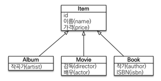
  
### ☝️ 조인 전략 (JOINED)
> 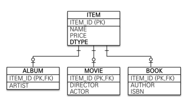
> - 데이터를 나누고 두번의 insert
> - 조회하기 위해서는 item_id로 조인해서 가져온다.    
> > 👍 장점: 
> > - 테이블 정규화
> > - 외래키 참조 무결성 제약조건 활용 가능
> > - 저장공간 효율화. 
> 
> > 👎 단점
> > - 조회할때 조인을 사용하기 때문에 성능 저하. 쿼리가 복잡하다.
> > - 데이터 저장시 INSERT 두번 호출.

### ☝️ 단일 테이블 전략 (SINGLE_TABLE)
> 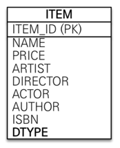
> - 한 테이블에 모든 데이터를 집어놓고 Type Column(DTYPE)을 두어 구분.
> > 👍 장점:
> > - 조인이 필요 없으므로 일반적으로 조회 성능이 좋다. 
> > - 조회 쿼리가 단순.
>
> > 👎 단점
> > - 자식 엔티티가 매핑한 컬럼은 모두 null을 허용한다.(movie를 저장한다면 movie의 컬럼이 아닌 컬럼들은 모두 null)
> > - 단일 테이블에 모든 것을 저장하므로 테이블이 커질 수 있다. 상황에 따라 조회 성능이 오히려 하락.

### ☝️ 구현 클래스마다 테이블 두기 전략 (TABLE_PER_CLASS)
> 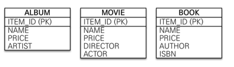
> - ❌ 추천하지 않는 전략.
> - 각 타입마다 테이블을 하나씩 생성. 각각의 데이터를 가짐.
> > 👍 장점:
> > - 서브 타입을 명확하게 구분하여 처리할 때 효과적
> > - not null 제약조건 사용 가능.
>
> > 👎 단점
> > - 여러 자식 테이블과 함께 조회할 때 성능이 느림(UNION SQL 필요, DTYPE이 없어 모든 테이블을 다 조회해야 한다.)
> > - 자식 테이블을 통합하여 쿼리하기 어려움.


## 🧐 주요 어노테이션
```@Inheritance(strategy=InheritanceType.XXX)```
- JOINED : 조인 전략.
- SINGLE_TABLE : 단일 테이블 전략 (JPA default)
- TABLE_PER_CLASS : 구현 클래스마다 테이블 생성.

```@DiscriminatorColumn(name="DTYPE")```    
- 상위 클래스에 DTYPE을 넣어준다 (예시에서는 item에)
- 예) join 전략으로 movie 데이터를 추가하였을 때, item의 DTYPE컬럼에 MOVIE가 들어간다(default = Entity Name)
- SINGLE_TABLE 전략에서는 애노테이션을 사용하지 않아도 자동으로 들어간다.

```@DiscriminatorValue("XXX")```
- DTYPE에 들어갈 이름을 엔티티 명이 아닌 임의의 이름을 넣어줄 수 있다.

# 📌 @MappedSuperclass
***
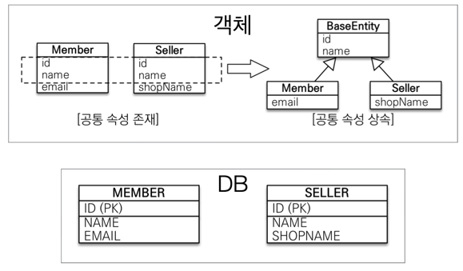
- 공통 매핑 정보를 생성하여 사용하고 싶을 때 사용. 주로 등록일, 수정일 등과같이 전체 엔티티에서 공통으로 적용할 속성에 사용.
- 엔티티가 아니기 떄문에 테이블에 매핑되지 않는다. 조회 또한 불가.
- 상속관계 매핑이 아님.
- 직접 생성해서 사용할 일이 없으므로 추상 클래스로 생성.

```java
@MappedSuperclass
public class BaseEntity {

    @Column(name = "createdDate")
    private LocalDateTime createdDateTime;

    private LocalDateTime lastModifiedDateTime;
}
```
```java
public class Member extends BaseEntity{
    
            ...
    
}
```
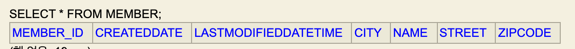

# 📌 프록시
****
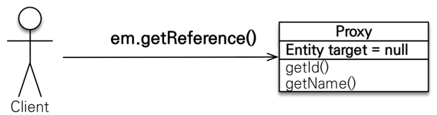
- em.getReference() : 데이터 베이스 조회를 미루는 가짜(프록시)엔티티 객체 조회.
    - em.gerReference()가 실행될 때에는 쿼리가 나가지 않다가, 해당 객체에서 값을 꺼낼 때 쿼리가 발생한다.
    - getReference()로 가져온 객체의 클래스를 확인해 보면 Proxy 임을 확인할 수 있다.         
      ```class com.shop.domain.Order$HibernateProxy$naIZTxPo```

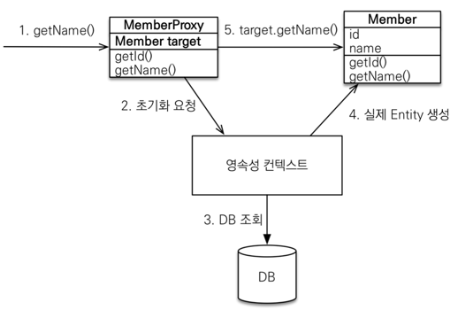
- 원본의 참조인 target을 가지고 있다. 실제 엔티티를 상속받아 만들어진다.
- 초기화: 처음에는 target이 null 이지만 프록시의 값을 호출할 때 영속성 컨텍스트에서 실제 엔티티를 가져와 이를 연결시킨다.
- 프록시의 메소드를 호출하면 target의 메소드를 호출 해 준다.
- 사용하는 입장에서는 이론상으로 원본과 구분하지 않고 사용해도 된다.

### 🔑 프록시의 특징
- 프록시 객체는 처음 사용할 때 한 번만 초기화
- 초기화를 하더라도 프록시 객체가 실제 엔티티로 바뀌는 것이 아니다. 프록시 객체를 통해 실제 엔티티에 접근하는 것.
- 프록시 객체는 원본 엔티티를 상속받음, 따라서 타입 체크시 '=='이 아닌 instance of를 사용해야 한다.
- <mark>영속성 컨텍스트에 찾는 엔티티가 이미 있다면 실제 엔티티를 반환.</mark>
    - JPA에서는 한 영속성 컨텍스트에서 같은 PK로 가져온 객체는 항상 ==비교에서 true가 나와야한다.
      - ```때문에 한 영속성 컨텍스트에서 getReference()를 통해 proxy 객체를 이미 가져왔다면, 영속성 컨텍스트에서  getReference()로 객체를 가져오거나 find()로 객체를 가져오더라도 proxy객체가 된다.```
    - 이미 가져온 객체를 프록시로 가져와서 얻을 수 있는 이점이 없다.
- 영속성 컨텍스트의 도움을 받을 수 없는 준영속 상태일 때, 프록시를 초기화하면 예외 발생.
    - detach(), close(), clear()    
    ```org.hibernate.LazyInitializationException: could not initialize proxy```
      

### 🖍 프록시 확인
- 프록시 인스턴스의 초기화 여부 확인(boolean) : ```emf.getPersistenceUnitUtil().isLoaded(Object entity)```
- 프록시 클래스 확인 방법 : ```entity.getClass().getName()```
- 프록시 강제 초기화(Hibernate) : ```Hibernate.initialize(entity);```
        

# 📌 즉시 로딩과 지연 로딩
***
- 지연 로딩 : fetch = FetchType.LAZY
    - ex) @ManyToOne(fetch = FetchType.LAZY)
    - 프록시로 조회하게 된다. 실제 사용(메소드 호출 등)하는 시점에 초기화.(쿼리 발생)

- 즉시 로딩 : fetch = FetchType.EAGER
    - 조회할때 애초에 모두 함께 조회.
    - 실제 엔티티가 불려온다.
    - JPA 구현체는 가능하면 조인을 사용하여 SQL 한번에 모두 조회.
    

#### 🖍 즉시로딩 주의점
- 가급적 지연 로딩을 사용(특히 실무)
- 즉시 로딩을 적용하면 예상하지 못한 SQL이 발생.
- JPQL 사용시 즉시 로딩은 N+1 쿼리 문제를 발생시킨다.
    - 전체 멤버를 조회할 때 멤버 한명당 팀 조회쿼리가 발생
- <mark>@ManyToOne, @OneToOne은 기본이 즉시로딩이기 때문에 LAZY로 변경해 주어야 한다.</mark>

🤔 N + 1 문제의 해결
    1. fetchJoin 
    2. Entity Graph

# 📌 영속성 전이 (CASCADE)와 고아 객체
***
###  ☝️CASCADE
- 특정 엔티티를 영속 상태로 만들 때 연관 엔티티도 함께 영속 상태로 만들고 싶을 때.
    ```java
    @OneToMany(mappedBy = "parent", cascade = CascadeType.PERSIST)
    private List<Child> childList = new ArrayList<>();
    ```
    의 상태에서.
    
    ```java
    perent.getChildList().add(child1);
    perent.getChildList().add(child2);
    
    em.persist(perent);
    ```
    를 실행하면 perent의 참조에 있는 child1, child2 또한 persist가 실행된다.    

    - 영속성 전이는 연관관계를 매핑하는 것과 아무 관련이 없다. 편리함을 제공 할 뿐.

    #### 🖍 CASCADE의 종류
    - ALL: 모두 적용, 라이프 싸이클이 유사할 때.
    - PERSIST: 영속. 저장할때만.
    - REMOVE, MERGE, REFRESH, DETACH

    #### 🖍 주로 한 부모가 여러 자식을 관리할 때 사용 (게시판, 첨부파일), 다른 엔티티와 연관이 없어야 한다. 즉 소유자가 하나일 때.

### ☝️ 고아 객체
- 고아 객체 제거 : 부모 엔티티와 연관관계가 끊어진 자식 엔티티를 자동으로 삭제.
    ```java
    @OneToMany(mappedBy = "parent", orphanRemoval = true)
    ```
    - ex) ```perent.getChildren().remove(0)```

    #### 🖍 참조하는 곳이 하나일 때 사용(하나의 엔티티가 소유할 때.)
    #### 🖍 부모를 제거하면 모두 고아가 되기 때문에 CascadeType.REMOVE 처럼 동작.


### 🔑 CascadeType.ALL + orphanRemover
    - 두 옵션을 모두 활상화하면 자식의 생명주기를 부모 엔티티가 관리.
    - 도메인 주도 설계(DDD)의 *Aggregate Root 개념을 구현할 때 유용하다.
        🤔 *Aggregate Root: Root만 Repository를 생성하고, 나머지는 만들지 않는것이 낫다.
            Root를 통해 생명주기를 관리.


# 📌 값 타입
****

## 🧐️ 엔티티 타입
- @Entity로 정의하는 객체. 
- 데이터가 변해도 식별자로 지속해서 추적 가능. 


## 🧐️️ 값 타입
- int, Integer, String 처럼 단순한 값, 자바 기본 타입이나 객체.
- 식별자가 없고 값만 있으므로 변경시 추적 불가. (완전히 다른 값으로 대체 됨.)
- 모든 값 타입은, 해당 값을 소유한 엔티티의 생명주기에 의존.

- ### ☝️️ 기본 값 타입
    - 자바 기본타입, 래퍼 클래스, String
    - 생명 주기를 엔티티에 의존
    - 기본 값 타입은 공유되지 않는다.(래퍼 클래스, String은 공유는 되나 변경할 수 없는 값.)
    
- ### ☝️️ 임베디드 타입(embedded type, 복합 값 타입)
    > 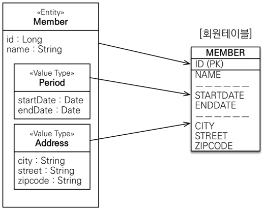
    - DB 입장에서는 바뀌는 것이 없다.   
    - class를 이용한 커스텀 값( ex) 주소(city,zipcode ..를 묶어낸).
    - @Embeddable로 값을 정의, @Embedded로 값 타입을 사용.
      ```java
        @Embeddable
        public class Address {
            private String city;
        
            private String street;
    
            @Column(name = "zcode")
            private String zipcode;
        }
      ```
      ```java
        @Embedded
        private Address homeAddress;
      ```
    - AttributeOverrides를 사용하여 같은 임베디드 타입 여러개 사용가능. (컬럼명을 재정의)
      ```java
        @Embedded
        @AttributeOverrides({
                @AttributeOverride(name = "city", column = @Column(name = "work_city")),
                @AttributeOverride(name = "street", column = @Column(name = "work_street")),
                @AttributeOverride(name = "zipcode", column = @Column(name = "work_zipcode"))
        })
        private Address workAddress;
      ```
    - 기본 생성자 필수.
    - 주로 기본값 타입을 모아 만들어서 복합 값 타입이라고도 한다.
    > 👍 장점
    > - 재사용 가능, 높은 응집도
    > - 값 타입만 사용하는 의미 있는 메소드를 만들 수 있다. (Point.moveLeft(1))
  
    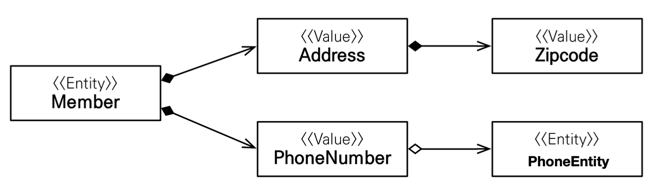
    - 임베디드 타입은 임베디드 타입을 가질 수 있다.
    - 임베디드 타입은 엔티티 또한 가질 수 있다.
    
    #### 🖍  임베디드 타입은 공유로 인한 Side Effect가 발생할 수 있기 때문에 주의.
    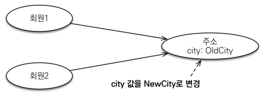
    - 멤버1 과 멤버2가 같은 Address 객체를 공유하게 되면 address 필드에서 값을 변경하면 둘다 함께 변경된다.
    - 공유하고 싶다면 엔티티를 만들어 공유해야 한다.
    - 같은 값만을 사용하고 싶다면 참조가 아닌 객체를 복사하여 사용해야한다.
        ```
        🤔 객체 타입의 한계 : 객체 타입의 참조값을 대입하는 것을 원천적으로 막을 방법이 없다.
            - 객체타입을 불변 객체로 설계해야 한다.
            - 불변 객체(Immutable Object) : 생성 이후 절대 값을 변경할 수 없는 객체. 생성자로 값을 설정, setter를 만들지 않는다.(or private)
            - 불변 객체의 값을 변경하고 싶을 땐 객체를 새로 생성해야 한다.
        ```
    
    #### 🖍 값 타입의 비교는 내용이 같다면 true가 나와야 한다.
        - 그러나 임베디드 타입은 객체의 참조를 비교하기 때문에 false가 나온다. 때문에 동등성 비교(equals)를 사용해야 한다.
        - 객체 타입의 동등성 비교는 기본적으로'==' 비교이기 때문에 equals메서드의 재정의가 필요하다.
                
    
    

     
 
- ### ☝️ 컬렉션 값 타입(collection value type)

