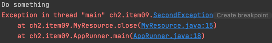

# 📃 목차
- #### [Item01. 생성자 대신 정적 팩터리 메서드를 고려하라.](#-item01-생성자-대신-정적-팩터리-메서드를-고려하라)
- #### [Item02. 생성자에 매개변수가 많다면 빌더를 고려하라.](#-item02-생성자에-매개변수가-많다면-빌더를-고려하라)
- #### [Item03. private 생성자거나 열거 타입으로 싱글턴임을 보증하라.](#-item03-private-생성자거나-열거-타입으로-싱글턴임을-보증하라)
- #### [Item04. 인스턴스화를 막으려거든 private 생성자를 사용하라.](#-item04-인스턴스화를-막으려거든-private-생성자를-사용하라)
- #### [Item05. 자원을 직접 명시하지 말고 의존객체 주입을 사용하라.](#-item05-자원을-직접-명시하지-말고-의존객체-주입을-사용하라)
- #### [Item06. 불필요한 객체 생성을 피하라.](#-item06-불필요한-객체-생성을-피하라)
- #### [Item07. 다 쓴 객체 참조를 해제하라.](#-item07-다-쓴-객체-참조를-해제하라)
- #### [Item09. try-finally보다는 rty-with-resources를 사용하라.](#-item09-try-finally보다는-rty-with-resources를-사용하라)
- #### [Item10. equals는 일반 규약을 지켜 재정의하라.](#-item10-equals는-일반-규약을-지켜-재정의하라)
- #### [Item17. 변경 가능성을 최소화 하라.](#-Item17-변경-가능성을-최소화하라)


<br><br>

## 📌 Item01. 생성자 대신 정적 팩터리 메서드를 고려하라.
***
### ☝️ ️장점 1. 이름을 가질 수 있다.
    :: 생성자에 넘기는 매개변수와 생성자 자체 만으로는 반환될 객체에 대한 특성을 제대로 설명할 수 없다.    
    하지만 정적 팩터리 메소드의 이름만 잘 짓는다면 객체의 특성을 잘 묘사할 수 있다.
````java
public static People student(String name, String number){
        People people =new People(name);
        people.number = number;
        return people;
    }
````
ex) BigInteger.probablePrime -> 값이 소수인 BIgInteger를 반환.
<br>
<br>

### ☝️  장점 2. 호출될 때마다 인스턴스를 새로 생성하지는 않아도 된다.
    :: 미리 만들어 놓은 인스턴스나 새로 생성한 인스턴스를 캐싱하여 재활용 하는식으로 불필요한 객체 생성을 피할 수 있다.    
    :: 반복되는 요청에 같은 객체를 반환하는 식으로 인스턴스르 통제 할 수 있다 -> 싱글턴, 인스턴스화 불가로 만들 수 있다.
    :: 불변 값 클래스에서 동치인 인스턴스가 하나임을 보장. 인스턴스 통제는 플라이웨이트 패턴의 근간이 된다.
````java
private static final People staticPeople = new People("kim");

public static People getStaticPeople(){
        return staticPeople;
}
````

### ☝️  장점3. 반환 타입의 하위 타입 객체를 반활할 수 있는 능력이 있다.
    :: 유연성이 생긴다. API를 만들 때 이러한 유연성을 응용하면 구현 클래스를 공개하지 않고도 객체를 반환할 수 있어 API를 작게 유지할 수 있다.
````java
public interface PeopleInterface {
    public static People getPeople(){
        return new People();
    }
}
````
:: java 8부터 interface에서의 public static method 선언을 , java 9부터 private static method선언을 허용한다. 그러나 정적 필드와 정적 멤버 클래스는 public이어야 한다.   
:: 구현 클래스를 숨기는 것 개념적 무게 즉, 프로그래머가 이를 다루기 위한 개념의 수와 난이도를 낮춰준다.


### ☝️  장점 4. 입력 매개변수에 따라 매번 다른 클래스의 객체를 반환할 수 있다.
    :: 반환 타입의 하위 타입이기만 하면 어떤 클래스 객체든 반환할 수 있다.    
    :: Man 과 Girl class가 People class 를 상속할때. 아래와 같은 반환이 가능하다.
````java
public static People isMan(Boolean flag){
        return flag ? new Man(): new Girl();
    }
````
:: ex) Enumset 클래스에서는 원소가 64개 이하면 RegularEnumSet을 ,그보다 많다면 JumboEnumSet의 인스턴스를 반환한다.


### ☝️  장점 5. 정적 팩터리 메서드를 작성하는 시점에는 반환할 객체의 클래스가 존재하지 않아도 된다.
    :: 이러한 유연성은 서비스 제공자 프레임워크를 만드는 근간이다.    
    :: 서비스 제공자 프레임워크는 구현체의 동작을 정의하는 서비스 인터페이스, 구현체를 등록할때 사용하는 제공자 등록 API, 클라이언트가 서비스의 인스턴스를 얻을 때 사용하는 서비스 접근 API가 있다.   
ex) JDBC에서는 Connection이 서비스 인터페이스, registerDirver가 제공자 등록 API, getConnection이 서비스 접근 API역할을 한다.
````java
public static People getPeople(){
        People people = new People();
        // TODO people = 풀 패키지 경로로부터 현 클래스의 하위클래스를 읽어옴.
        return people;
    }
````
:: 클라이언트는 서비스 접근 API를 사용할 떄 원하는 구현체의 조건을 명시할 수 있다.     
예를들어 JDBC프레임 워크에서 DriverManager.getConnection을 수행할 때 Mysql 등 다양한 driver마다 다른 인스턴스를 반환해준다.


### 👎 단점 1. 상속을 하려면 public이나 protected 생성자 없이, 정적 팩터리 메소드만 제공하면 하위클래스를 만들 수 없다.
    :: 그러나 상속보다 컴포지션(item18)을 사용하도록 유도하고 불변 타입(item17)으로 만들려면 이 제약을 지켜하 한다는 점에서 단점이라고 보기엔 어렵다.

### 👎 단점 2. 정적 팩토리 메소드는 프로그래머가 찾기 어렵다.
    :: 생성자처럼 API설명에 명확이 드러나지 않으므로 문서의 상단에 잘 써놓거나 메서드의 이름을 널리 알려진 규약에 따라 지어 문제를 완화해줘야 한다.

> - from : 매개 변수를 받아 해당 타입의 인스턴스를 반환하는 형변환 메소드   
> - of : 여러 매개변수를 받아 적합한 타입의 인스턴스를 반환.   
> - instance, getInstance : 매개변수로 명시한 인스턴스 반환, 같은 인스턴스임을 보장하진 않음.   
> - creat, newInstance : 매번 새로운 인스턴스 생상 보장.   
> - getType : 생성할 클래스가 아닌 다른 클래스에 팩토리 메서드를 정의. Type은 팩토리 메소드가 반환할 객체의 타입.

<br><br>

## 📌 Item02. 생성자에 매개변수가 많다면 빌더를 고려하라.
***

### ✏️  정적 팩터리와 생성자의 제약
> 선택적 매개변수가 많을 때 적절히 대응하기 어렵다.

### ☝️ 해결1: 점층적 생성자
*****
:: 점층적 생성자를 이용하여 선택적 매개변수를 받는 생성자를 점점 늘려가며 생성자를 구성하고, 원하는 매개변수가 모두 포함된 생성자중 가장 작은것을 골라 호출하게 된다.    
ex)A,B,C,D의 매개변수가 존재할 때  A,B를 매개변수로, A,C를 매개변수로, A,D를 매개변수로 등...

    - 매개변수가 많아지면 클라이언트 코드를 작성하기 어려워지고, 읽기도 힘들어진다. 값의 의미와, 매개변수의 갯수에 주의를 기울여야 하며,
    매개 변수 값을 잘못 넘겨주어도 오류가 발생하지 않는다. 

## ☝️ 해결2: JavaBeans Pattern
*****
:: 매개 변수가 없는 생성자를 만들고, Setter 메서드를 호출하여 원하는 매개변수의 값을 설정한다.

    - 코드는 길어지지만 인스턴스의 생성이 쉽고, 더 읽기 쉬운 코드가 만들어진다.
    - 하지만 객체 하나를 생성하기 위해 많은 메서드를 호출해야하고, 객체가 완전히 생성되기 전까지 일관성이 무너진 상태에 놓인다.(중간에 호출될 경우 잘못 사용될 수 있음.)
    - Setter를 사용하기 때문에 불변 클래스로 만들 수 없고, 마찬가지로 변경가능하기 때문에 쓰레드 안정성을 얻으려면 추가 작업이 필요하다(lock)


## ☝️ 해결3 : 빌더 패턴
*****
:: 점층적 생성자 패턴의 안정성과 자바 빈즈 패턴의 가독성을 겸비.     
:: 필수 매개변수 만으로 생성자를 호출해 빌더 객체를 얻고, 빌더 객체가 제공하는 세터 메서드들로 선택 매개변수들의 값을 설정한다.    
마지막으로 build()메서드를 호출하여 필요한 객체를 얻는다. 빌더는 생성할 클래스 안에 정적 멤버클래스로 만들어 두는것이 일반적이다.
````java
public class NutritionFacts {
    private final int servings;
    private final int servingSize;
    private final int sodium;
    private final int fat;
    private final int carbohydrate;

    public static class Builder {
        private final int servings;
        private final int servingSize;

        private int sodium = 0;
        private int fat = 0;
        private int carbohydrate = 0;

        public Builder(int servings, int servingSize) {
            this.servings = servings;
            this.servingSize = servingSize;
        }

        public Builder sodium(int val) {
            sodium = val;
            return this;
        }

        public Builder fat(int val) {
            sodium = val;
            return this;
        }

        public Builder carbohydrate(int val) {
            sodium = val;
            return this;
        }

        public NutritionFacts build() {
            return new NutritionFacts(this);
        }

    }

    public NutritionFacts(Builder builder) {
        servingSize = builder.servingSize;
        servings = builder.servings;
        fat = builder.fat;
        sodium = builder.sodium;
        carbohydrate = builder.carbohydrate;
    }
}
````

````java
public static void main(String[] args) {
        NutritionFacts nutritionFacts = new Builder(10,100)
                .fat(200)
                .carbohydrate(300)
                .sodium(150)
                .build();
    }
````
:: 각 메소드에서 유효성을 검사할 수 있다.    
:: 여러 매개변수를 혼합하여 검사해야할 경우 build 메서드에서 호출하는 생성자에서 이를 검사할 수 있다.    
:: 세터 메서드는 빌더 자신을 반환하기 때문에 연쇄적으로 호출이 가능하다. 코드를 쓰고 읽기 쉽다.

<br>

#### 🖍 계층적으로 설계된 클래스에서의 빌더 패턴
:: 각 계층의 클래스에 관련 빌더를 멤버로 정의, 추상 클래스는 추상 빌더를, 구체 클래스는 구체 빌더를 갖게 한다.
````java
public class Pizza {
    public enum Topping {HAM, MUSHROOM, ONION;}
    final Set<Topping> toppings;

    abstract static class Builder<T extends Builder<T>>{
        EnumSet<Topping> toppings = EnumSet.noneOf(Topping.class);

        public T addTopping(Topping topping){
            toppings.add(Objects.requireNonNull(topping));
            return self();
        }
        abstract Pizza build();
        protected  abstract T self();
    }
    Pizza(Builder<?> builder) {
        toppings = builder.toppings.clone();
    }
}
````

```java
import java.util.Objects;

public class Calzone extends Pizza {
    private final boolean sauceInside;

    public static class Builder extends Pizza.Builder<Builder> {
        private boolean sauceInside = false;

        public Builder sauceInside() {
            sauceInside = true;
            return this;
        }

        @Override
        public Calzone build() {
            return new Calzone(this);
        }

        @Override
        protected Builder self() {
            return this;
        }
    }

    private Calzone(Builder builder) {
        super(builder);
        sauceInside = builder.sauceInside;
    }
}

```
    - Objects.requireNonNull(obj) : obj가 null인지 확인. 두번째 인자로 메세지를 설정할 수도 있음.
    - Objects.requireNonNullElse(obj, obj2) : obj가 null이라면 obj2로 대체 가능.

:: 추상 메서드 self를 이용하여 하위 클래스에서 형변환을 거치치 않고도 메서드 연쇄를 지원할 수 있다.(simulated self-type)
:: 하위 클래스의 빌더가 정의한 build() 메서드는 해당하는 구체 하위클래스를 반환한다. 때문에 클라이언트는 형변환을 신경쓰지 않고 빌더를 사용할 수 있다 (공변반환 타이핑)


### 👎 빌더 패턴의 단점
> 점층적 생성자 패턴보다는 코드가 장화해 매개변수가 4개 이상은 되어야 값어치를 한다. 그러나 API는 시간이 지날 수록 매개변수가 많아지는 경향이 있기 때문에 애초에 빌더로 시작하는 편이 나을때가 많다.

<br><br>

## 📌 Item03. private 생성자거나 열거 타입으로 싱글턴임을 보증하라.
***
> 싱글턴(singleton) : 인스턴스를 오직 하나만 생성할 수 있는 클래스. 함수와 같은 무상태 객체나 설계상 유일해야 하는 시스템 컴포넌트가 그 예이다.

> 싱글턴 클래스는 이를 사용하는 클라이언트를 테스트하기가 어려워질 수 있다.    
> 타입을 인터페이스로 정의한 다음 이를 구현해서 만든 싱글턴이 아니라면 싱글턴 인스턴스를 가짜(mock) 구현으로 대체할 수 없기 때문이다.


### ☝️ 방법 1. public static final 필드 싱글턴
```java
public class Singleton1 {
    public static final Singleton1 INSTANCE = new Singleton1();
    
    private Singleton1(){}
}
```
```java
//생성 불가능
Singleton1 singleton1 = new Singleton1();  (x)
//인스턴스 가져옴.
Singleton1 singleton1 = Singleton1.INSTANCE;
```
:: 생성자가 private로 선언되기 때문에 클라이언트가 새로운 인스턴스를 생성할 수 없다, 따라서 인스턴스가 전체 시스템에서 하나뿐임이 보장된다.      
:: 작성이 간결하고, 싱글턴임이 명백하게 드러난다.

:: 하지만 예외로 리플렉션 API의 AccessibleObject.setAccesible(true)를 사용해 private 생성자를 호출하여 새로운 인스턴스가 생성될 수 있다.
따라서 이를 방지하기 위해서는 다음과같은 작성이 필요하다.
```java
int count =0;

private Singleton1() {
        count++;
        if(count != 1){
            throw new IllegalStateException("this Object should be Singleton");
        }
}
```


### ☝️ 방법 2. 정적 팩터리 방식의 싱글턴
```java
public class Singleton2 {
    private static final Singleton2 INSTANCE = new Singleton2();
    
    private Singleton2(){};
    
    public static Singleton2 getInstance(){
        return INSTANCE;
    }
}
```
```java
Singleton2 singleton2 = Singleton2.getInstance();
```
:: INSTANCE 필드도 private로 처리하고 인스턴스를 얻기위한 정적 메소드를 추가하여 이를 통해 인스턴스를 얻는다.

- ### 장점
        1. API를 바꾸지 않고도 싱글턴이 아니게 변경할 수 있다.(메소드에서 new로 인스턴스를 생성해서 반환하면 된다.)
        2. 정적 팩터리를 제네릭 싱글턴 팩터리로 만들 수 있다.(아이템 30)
        3. 정적 팩터리의 메서드를 참조를 공급자(supplier)로 할 수 있다.
```java
Supplier<Singleton2> singleton2Supplier= Singleton2::getInstance;
```

### 🖍️ 방법 1과 2의 직렬화 문제.
> 두 방법으로 구현된 싱글턴 클래스는 직렬화, 역 직렬화 과정에서 새로운 인스턴스가 생성되게 된다.     
> 이를 방지하기 위해서는 두 가지 처리가 필요하다.

    1. 모든 인스턴스 필드의 transient 선언.
    2. readResolve 메서드의 제공.
- 방법 2에서의 변경.(Serializable)
```java
private static final transient Singleton2 INSTANCE = new Singleton2();

private Object readResolve(){
        return INSTANCE;
}

```


### ☝️ 방법3. enum 타입 방식의 싱글턴
```java
public enum Singleton3 implements Serializable {
    INSTANCE;
}
```
```java
Singleton3 singleton3 =Singleton3.INSTANCE;
```

:: 방법1과 유사하지만 간결하고, 리플랙션의 방어와 직렬화하는데 있어 추가적인 처리가 필요하지 않다.    
:: 그러나 싱글턴 클래스가 클래스를 상속해야 한다면 이 방법은 사용할 수 없다. (인터페이스 구현만 가능.)

<br><br>

## 📌 Item04. 인스턴스화를 막으려거든 private 생성자를 사용하라.
***
> Utility 클래스들과 같이 정적 메서드와 정적 필드만을 담은 클래스를 만들 때 인스턴스를 생성하여 사용하도록 설계하지 않는다. 그렇다고 생성자를 작성하지 않는다고 해도, 컴파일러가 자동으로 기본 생성자를 만들어준다.

### ☝️ 방법1. Abstract Class
```java
public abstract class UtilityClass {
    public static String getName(){
        return "kim";
    }

    public static void main(String[] args) {
        UtilityClass.getName();

//         추상 클래스 인스턴스 생성 불가능
        UtilityClass utilityClass = new UtilityClass(); (x)

    }
}
```
:: abstract Class 로 만들면 해당 클래스의 인스턴스를 생성하지 못하게 할 수 있다.
```java
public class AnotherClass extends UtilityClass{
    public static void main(String[] args) {
        AnotherClass anotherClass = new AnotherClass();
//        메소드 사용 불가능.
//        anotherClass.getName() (x);
    }
}
```
:: 하지만 해당 클래스를 상속받은 클래스의 인스턴스는 생성될수 있다, 그러나 메소드의 사용이 불가능한 아무의미 없는 인스턴스가 된다.     
:: 때문에 방법 2를 제안한다.

### ☝️ 방법2. private 생성자
```java
public class UtilityClass {
    public static String getName(){
        return "kim";
    }
    //인스턴스 생성 방지.
    private UtilityClass(){
        throw new AssertionError();
    }
}
```

:: 생성자를 private로 생성하게 되면 외부에서 인스턴스를 생성할수도 없고, 컴파일러 또한 public 기본 생성자를 생성하지 않는다.    
:: 상속 또한 private 생성자이기 때문에 불가능하디.      
:: 생성자가 존재하는데 호출을 할수 없어 직관적이지 못하기 때문에 적절한 주석이 필요하다.

<br><br>

## 📌 Item05. 자원을 직접 명시하지 말고 의존객체 주입을 사용하라.
***
> 많은 클래스가 하나 이상의 자원에 의존함.
> 예를 들어 맞춤법 검사기는 사전에 의존하게 되고 이런 클래스를 잘못된 방식으로 구현한 것을 흔히 볼 수 있다.

## 👎 잘못된 구현
********

### ☝️ 정적 유틸리티 클래스(아이템4)

```java
public class SpellChecker1 {
    private static final Lexicon dictionary = new KoreanDictionary();

    //객체 생성 방지
    private SpellChecker1() {
    }

    public static boolean isValid(String word) {
        // check
        return true;
    }
}
```
:: 유연하지 못하다. 사전의 교체가 어려움.

### ☝️ 싱글톤으로 구현(아이템3)
```java
public class SpellChecker2 {
    private final Lexicon dictionary =new KoreanDictionary();
    
    private SpellChecker2(){}

    public static final SpellChecker2 INSTANCE = new SpellChecker2();

    public boolean isValid(String word){
        // check
        return true;
    }

}
```

:: 마찬가지로 유연하지 못하고, 사전의 교체가 어렵다.

    -위의 두가지 방식에서는 새로운 사전의로 교채하기 위해서는 메서드를 추가해야 한다. 하지만 이러한 방식은 오류를 내기 쉬우며,     
    멀티 쓰레드 환경에서 사용하기에 적합하지않다.

## 👍 적절한 구현
*******
```java
public class SpellChecker3 {
    private final Lexicon dictionary;
    
    public SpellChecker3(Lexicon dictionary) {
        this.dictionary =  Objects.requireNonNull(dictionary);
    }
    public boolean isValid(String word){
        //check
        return true;
    }
}

```
:: 인스턴스를 생성할 때 생성자에 필요한 자원(사전을 넘겨준다.) 이는 의존 객체 주입의 한 형태이다.     
:: 정적 팩터리, 빌더에도 적용 가능하다.

### ☝️ 변형 : 자원이 아닌 자원 팩터리 넘겨주기.
```java
public class SpellChecker4 {
    private final Lexicon dictionary;

    public SpellChecker4(Supplier<Lexicon> dictionary) {
        this.dictionary =  Objects.requireNonNull(dictionary.get());
    }
    public boolean isValid(String word){
        //check
        return true;
    }
}
```
```java
Lexicon lexicon = new KoreanDictionary();
SpellChecker4 spellChecker4 = new SpellChecker4(new Supplier<Lexicon>() {
    @Override
    public Lexicon get() {
        return lexicon;
    }
});
```

## 🔑 핵심
> - 클래스가 내부적으로 하나 이상의 자원에 의존하고, 그 자원이 클래스 동작에 영향을 준다면 해당 자원들을 클래스가 직접 만들게 해서는 안된다.
> - 대신 필요한 자원(또는 팩터리)을 생성자(또는 정적 팩터리, 빌더)에 넘겨준다.
> - 이런 의존객체 주입은 클래스의 유연성, 재사용성, 테스트 용이성을 개선해준다

<br><br>

## 📌 Item06. 불필요한 객체 생성을 피하라
***
> 똑같은 기능의 객체를 매번 생성하기 보다는 하나의 객체를 재사용하는 편이 나을때가 많다.
예를 들어 아래와 같은 상황이다.

### ☝️ 문자열 객체 생성.
```java
String s = new String("test");

String s = "test";
```
:: 생성자에 넘겨진 "test"자체가 생성자로 만들어 내는 객체의 역할과 완전히 동일하다.     
:: 1번의 코드에서는 매번 새로운 객체를 생성하지만 2번에서는 하나의 객체를 재사용하여 불필요한 생성을 하지 않는다.

```java
String s1 = new String("test");
String s2 = new String("test");

System.out.println(s1 == s2 );  //false
```


### ☝️ 정적 팩토리 메서드의 사용.
```java
boolean b1 = Boolean.valueOf("true");
boolean b2 = Boolean.valueOf("true");

System.out.println(b1 == b2);   //true
System.out.println(b1 == Boolean.TRUE); //true

```

:: Boolean(String) 생성자를 사용하기 보다는 팩터리 메서드를 사용한다. 동일한 객체가 반환됨을 확인할 수 있다. 반환되는 객체는 static field인 Boolean.TRUE이다.


### ☝️ 생산 비용이 비싼 객체.
:: 비싼 객체가 반복해서 필요하다면 캐싱하여 재사용하는 것이 권장된다.   
다음은 문자열이 유효한 로마숫자인지 확인하는 메서드이다
```java
static boolean isRomanNumeral(String s){
    return s.matches("^(?=.)M*(C[MD]|D?C{0,3})" + "(X[CL]|L?X{0,3})(I[XV]|V?I{0,3})$");
}

```
:: 메서드의 내부에서 생성되는 정규표현식용 Pattern 인스턴스는 한번 사용하고 버려지는데, Pattern은 입력받은 정규표현식에 해당하는 유한 상태 머신을 그리기 만들기 때문에 생성 비용이 높다.
:: 때문에 클래스를 초기화하는 과정에서 직접 생성해 캐싱해두고 호출될 때 해당 인스턴스를 반환하는 것이 효율적이다.

```java
static boolean isRomanNumeral(String s){
    return ROMAN.matcher(s).matches();
}
```
:: 성능의 개선뿐만 아니라 코드의 의미또한 명확해졌다. (Pattern 인스턴스가 드러남.)

### ☝️ 어댑터
:: 객체가 불변이라면 재사용해도 안전함이 명백하다. 그러나 덜 명확하거나, 심지어 직관에 반대되는 상황도 있다.   
:: 어댑터는 실제 작업은 뒷단 객체에 위임하고 자신은 인터페이스의 역할을 수행한다. 때문에 뒷단 객체 하나당 하나의 어댑터만 생성하면 충분하다.
```java
Map<String, Integer> students = new HashMap<>();

students.put("kim",23);
students.put("park",25);

Set<String> names = students.keySet();
Set<String> names2 = students.keySet();

names.remove("kim");

System.out.println(names.size());   // 1
System.out.println(names2.size());  // 1
```
:: Map 의 keySet()메서드는 키를 담은 Set을 반환하고 이들은 모두 같은 객체를 참조한다. 따라서 하나의 내용이 변하면 모든 Set과 Map이 변경된다.


### ☝️ 오토박싱
```java
Long sum =0l;
for(long i =0l; i<Integer.MAX_VALUE; i++)
    sum+= i;
```
:: sum 변수는 Long으로 선언되어 있고, 여기에 long 타입의 i 를 더한다. 이때 i가 sum에 더해질때 마다 Long 인스턴스를 생성하게 되고,      
여기서는 약 2^31개의 인스턴스가 생성된다.
:: Long 타입에 long을 더할때 걸린 시간은 3229ms 였고, long타입에 long타입을 더할 때 걸린 시간은 729ms로 약 4배 이상의 성능차이가 발생했다.


## 🔑 핵심
> - 불필요한 객체의 생성을 피하자 (재사용)
> - "객체의 생성은 비싸니 피하자" 라는 말이 아니다. 비싸고, 재사용이 안전한 객체의 생성을 줄이자는 것이다.
> - 무분별한 객체 재사용은 오히려 버그와 보안상의 문제로 이어진다.

<br><br>


## 📌 Item07. 다 쓴 객체 참조를 해제하라.
***
> 자바의 GC가 모든것을 해결해주지는 않는다.

### ☝️ 스택
*****
```java
public class Stack {
    private Object[] elements;
    private int size = 0;
    private static final int DEFAULT_INTTIAL_CAPACITY = 16;

    public Stack(){
        elements = new Object[DEFAULT_INTTIAL_CAPACITY];
    }
    
    public void push(Object e){
        ensureCapacity();
        elements[size++] = e;
    }
    
    public Object pop(){
        if(size == 0)
            throw new EmptyStackException();
        return elements[--size];
    }
    
    public void ensureCapacity(){
        if(elements.length ==size)
            elements = Arrays.copyOf(elements, size*2 +1);
    }
    

}
```
:: 스택이 커졌다 작아질 때, 스택에서 꺼내진 객체들을 GC가 회수하지 않기때문에 메모리의 누수가 발생한다.
:: 객체 참조 하나를 살려두면 GC는 그 객체뿐만 아니라 그 객체가 참조하는 객체, 그 객체가 또 참조하는 객체.. 모두 회수할 수 없다.


```java
 public Object pop(){
        if(size == 0)
            throw new EmptyStackException();
        Object result = elements[--size];
        elements[size] =null;
        return result;
    }
```

:: 메모리의 누수는 pop메소드에서 발생하기 때문에 더 이상 필요없어진 원소의 참조를 null처리한다. 잘못된 참조에서 오는 오류또한 덤으로 잡아준다.     
:: 그러나 모든 객체를 사용한 후 null처리하는 방법은 바람직하지 않다. 가장 좋은 방법은 변수의 범위를 최소가 되게 정의하는 것이다.

:: Stack 클래스는 자기 메모리를 직접 관리하기 때문에 이러한 null처리가 필요하다. GC의 입장에서는 똑같이 유효한 객체이기 때문이다.


### ☝️ 캐시
******
:: 캐시 역시 메모리 누수를 일으키는 주범이다.
:: 캐시 외부에서 키를 참조하는 동안만 엔트리가 살아있는 캐시가 필요한 상황이라면 WeakHashMap을 사용하여 메모리 누수를 방지할 수 있다.
```java
String key = "key1";
Object value = new Object();

Map<String, Object> cache = new WeakHashMap<>();
cache.put(key,value);
```
:: StrongReference인 key가 필요 없어지면 해당 엔트리를 해시에서도 자동으로 비워준다. 즉 StrongReference인 key가 GC의 대상이 되면 이를 참조하는 WeakReference인 객체 또한 GC의 대상이 될 수 있다.    
::  보통은 캐시의 유효기간을 정확히 정의하기 어렵기 때문에 백그라운드 스레드를 사용하여 특정 시간마다 비워준다.

### ☝️ 콜백
*****
:: 콜백도 캐시와 마찬가지로 콜백을 지울 수 있는 방법을 제공하지 않는다면 계속 쌓이기만 하여 메모리 누수가 발생한다.    
:: 마찬가지로 WeakHashMap을 사용하여 해결 할 수 있다.

## 🔑 핵심
> - 클래스 자신이 메모리를 직접 관리하는 경우에는 사용하지 않는 객체를 null 처리해주는 것이 필요하다.
> - WeakReference를 사용하여 메모리 누수를 막을 수 있다.

<br><br>

## 📌 Item09. try-finally보다는 rty-with-resources를 사용하라.
***
> - 자바 라이브러리에는 colse 메서드로 직접 닫아줘야하는 자원이 많다.
> - 클라이언트가 놓친 자원 닫기는 예측할 수 없는 성능 문제로 이어질 수 있다.

### ☝️ 전통적인 방법 try-finally
```java
public void doSomething(){
        System.out.println("Do something");
        throw new FirstException();
    }

    @Override
    public void close() {
        throw new SecondException();
    }
```
:: 각 메소드에서 예외를 던지도록 작성한다.

```java
MyResource myResource1 = new MyResource();
        MyResource myResource2 = null;
        try{
            myResource1.doSomething();
            try {
                myResource2 = new MyResource();
                myResource2.doSomething();
            }finally {
                myResource2.close();
            }
        }finally {
            myResource1.close();
        }
```
:: 중첩이 생기면 코드가 복잡해진다.
     
:: doSomething에서 FirstException이 발생하지만 다음에 발생하는 SecondException에 가려지게 된다.


### ☝️ try-with-resources
******
```java
try (MyResource myResource1 = new MyResource();
        MyResource myResource2 = new MyResource()) {
        myResource1.doSomething();
        myResource2.doSomething();
        }
```
      
:: FirstException 또한 잘 볼 수 있고, myResource2의 close또한 잘 실행된 것을 확인할 수 있다.

## 🔑 핵심
> - try-with-Resources를 사용하면 이전 예외가 가려지지 않기 때문에 디버깅에서 큰 장점을 가진다.
> - 코드가 더 짧고 분명해지고 정확하고 쉽게 자원을 회수할 수 있다.

## 📌 Item10. equals는 일반 규약을 지켜 재정의하라.
***
### ☝️ 재정의하지 않는 것이 좋을 때.
> equals는 기본적으로 재정의 하지 않으면 그 클래스의 인스턴스는 오직 자기 자신과만 같다.

- #### 1. 각 인스턴스가 본질적으로 고유하다.
        - 값을 표현하느 것이 아니라 동작하는 개체를 표현하는 클래스 ex)Thread

- #### 2. 인스턴스의 '논리적 동치성'을 검사할 일이 없다.
        - java.util.regex.Pattern 에서 equals를 재정의 하여 정규식이 같은지 논리적 동치성을 검사할 수 있다.     
        하지만 이러한 검사가 필요없다고 판단되면 기본 equals만으로 충분하다.

- #### 3. 상위 클래스에서 재정의한 equals가 하위 클래스에도 딱 들어맞는다.
        - Set,List, Map 구현체들은 Abst클래스로부터 구현한 equals를 상속받아 그대로 사용한다.
    ```java
    public boolean equals(Object o) {
            if (o == this)
                return true;
    
            if (!(o instanceof Map))
                return false;
            Map<?,?> m = (Map<?,?>) o;
            if (m.size() != size())
                return false;
    
            try {
                for (Entry<K, V> e : entrySet()) {
                    K key = e.getKey();
                    V value = e.getValue();
                    if (value == null) {
                        if (!(m.get(key) == null && m.containsKey(key)))
                            return false;
                    } else {
                        if (!value.equals(m.get(key)))
                            return false;
                    }
                }
            } catch (ClassCastException unused) {
                return false;
            } catch (NullPointerException unused) {
                return false;
            }
    
            return true;
        }
    ```

  :: AbstractMap에서 구햔한 equals, 같은 객체가 아니더라도 <key,value> 쌍이 모두 동일하다면 ture,   
  구현체인 HashMap등에서도 동일하게 사용할 수 있기 때문에 재정의하지 않는다.

- #### 4. 클래스가 private이거나 package-private이고 equals 메서드를 호출할 일이 없다.
        - 호출할 일이 없으면 당연히 재정의할 필요도 없다. 혹시 equals가 실수로라도 호출되는걸 막고 싶다면 다음과 같이 구현해둔다.
    ```java
    @Override
    public boolean equals(Object o ){
        throw new AssertionError();
    }
    ```

### ☝️ equlas를 재정의 해야할 때.
> 객체 식별성(두 객체가 물리적으로 같은가)이 아니라 논리적 동치성을 확인해야 하고, 상위클래스에서 이러한 기능을 하도록 재정의되지 않았을 때. (주로 값 클래스)
> - 그러나 값이 같은 인스턴스가 둘 이상 만들어지지 않음을 보장하는 클래스라면 equlas를 재정의 하지 않아도 논리적 동치성과 객체 식별성이 사실상 같은 의미를 가진다.


### equlas 메서드를 재정의 할 때의 일반 규약.(Object 명세에 적힌 규약)
    - 아래 규약은 모두 참조 값이 null이 아님을 전제로 한다.
    - 반사성(reflexivity): x.equals(x)는 true.
    - 대칭성(symmentry) : x.equals(y) 와 y.equals(x)의 결과는 같다.
    - 추이성(transitivity) : x.equals(y) =true, y.equals(z) =true이면, x.equals(z) =true.
    - 일관성(consistency) : x.equals(y)를 반복해서 호출해도 항상 같은 값을 반환한다.
    - null-아님 : x.equals(null)은 false이다.


### ✏️ equals 메서드 구현.
- #### 1. == 연산자를 사용해 입력이 자기 자신의 참조인지 확인한다.
        - 자기 자신이라면 true를 반환한다.
    ```java
    if (o == this)
        return true;
    ```

- #### 2. instanceof 연산자로 입력이 올바른 타입인지 확인한다.
        - 그렇지 않다면 false를 반환한다. 보통 equasl가 정의된 클래스 타입인지 확인하지만 가끔은 그 클래스가 구현한 특정 인터페이스가 될 수도 있다.
        - 자신을 구현한 서로다른 클래스 끼리도 비교할 수 있도록 수정하기도 한다. (Set, List, Map ...) 
    ```java
    if (!(o instanceof Map))
        return false;
    ```

- #### 3. 입력을 올바른 타입으로 형변환 한다.
        - 앞서 instanceof로 검사를 했기 때문에 문제가 발생하지 않는다.
    ```java
    Map<?,?> m = (Map<?,?>) o;
    ```

- #### 4. 입력 객체와 자기 자신이 대응되는 '핵심'필드들이 모두 일치하는지 하나씩 검사한다.
        - 하나라도 다르다면 false를 반환한다. 2단계에서 인터페이스를 사용했다면 필드값을 가져올 때도 해당 인터페이스의 메서드를 사용해야 한다.
    ```java
    try {
        for (Entry<K, V> e : entrySet()) {
            K key = e.getKey();
            V value = e.getValue();
            if (value == null) {
                if (!(m.get(key) == null && m.containsKey(key)))
                    return false;
            } else {
                if (!value.equals(m.get(key)))
                    return false;
            }
    }
    ```

  > - float ,double을 제외한 기본 타입 필드는 '==' 연산자로 비교.
  > - 참조 타입 필드는 equals 메서드로.
  > - float와 double은 각각 정적 메서드인 Float.compare, Double.compare로 비교한다. (특수한 부동 소수값 등을 다뤄야 함.)equals도 가능하나 오토 박싱을 수반할 수 있어 성능이 좋지않다.
  > - null 값을 정상 값으로 취급하는 참조 타입 필드는 Object.equlas(Object, Object)정적 메소드를 사용하자.(NullPointException 발생 방지.)


## 🤔 주의 사항
    - equals를 재정의 할 땐 hashCode도 반드시 재정의 하자.(아이템 11)
    - 너무 복잡하게 해결하려 하지 말자, 필드의 동치성만 검사해도 규약을 어렵지 않게 지킬 수 있다.
    - Object타입 이외의 타입을 매개변수로 받는 equals 메서드는 선언하지 말자 ->오버라이딩이 아닌 오버로딩.

## 🔑 핵심
> - 꼭 필요한 경우가 아니면 equals를 재정의 하지 않아도 원하는 비교를 정확히 수행한다.
> - 재정의해야 할 때는 해당 클래스의 핵심 필드를 모두 빠짐없이 규약을 지켜가며 비교한다.


## 📌 Item17.변경 가능성을 최소화하라

변경 가능성을 최소화 하라는 것은 다시 말해 불변 객체로 설계하라는 것이다.
인스턴스 내부의 값을 수정하지 못하게 하고 클래스의 상속을 막아 객체가 소멸되는 순간까지 처음과 동일한 값을 가지고 있음을 보장한다.    
이러한 불변 객체는 사용을 쉽게하고, 오류 발생의 여지를 줄여준다.

그렇다면 불변 객체는 어떻게 만들어야 할까?

- ### 👆 불변 객체의 설계

  #### 1. 객체의 상태를 변경하는 메서드를 제공하지 않는다.
  > 객체 내부의 값을 변경할 수 없도록 한다.
  #### 2. 클래스를 확장할 수 없도록 한다.
  > - 하위 클래스에서 객체의 상태를 변경하는 것을 방지한다.
  >  > - final 클래스로 만들어 상속을 방지한다.
  >  > - 모든 생성자를 private 또는 package-private(default)로 만들고 정적 팩토리 메서드를 사용하여 객체를 생성한다.  
  #### 3. 모든 필드를 final 로 선언한다.
  > final 키워드를 사용하여 처음 초기화 된 후 값이 변경되지 못하도록 시스템적으로 막는다.
  #### 4. 모든 필드를 private 로 선언한다.
  > 클라이언트에서 직접 접근해 수정하는 일을 방지한다.
  #### 5. 자신 외에는 내부의 가변 컴포넌트에 접근할 수 없도록 한다.
  > - 클라이언트에서 해당 컴포넌트의 참조를 얻어서도 안되고, 클라이언트가 제공한 객체를 가르키도록 해도 안된다.
  > - 필드를 반환할 때도 그대로 반환하는 것이 아닌 방어적 복사를 수행한다


- ### 👆 값의 변경
  값을 변경하지 않는다면 값의 변화를 어떤식으로 수행해야 하는지 궁금점이 생길것이다. 아래는 예시 코드이다.
  ```java
  public final class Point {
      private final int x;
      private final int y;
      
      public Point(final int x, final int y){
          this.x = x;
          this.y = y;
      }
      
      public Point move(final int x, final int y){
          return new Point(this.x + x, this.y + y);
      }
  }  
  ```
  값의 변화는 곧 새로운 객체의 반환을 의미한다. 기본 타입의 Wrapper 클래스인 BigInteger 등이 이와 같이 구현되어 있다.
  이러한 프로그래밍 패턴을 함수형 프로그래밍이라고 한다. 자신의 값이 변경되지 않기 때문에 항상 같은 결과를 반환할 수 있다.
  예시에서는 동사를 사용하였지만, 동사 대신 전치사를 사용하는 명명 규칙을 따르는 것이 좋다(add 대신 plus와 같이)


- ### 👆 불변 객체의 장점
  - #### 불변 객체는 근본적으로 스레드 안전하다.
    > 값이 항상 동일하고, 변경가능성이 없기 때문에 동시에 접근이 이루어지더라도 문제가 생기지 않는다
  - #### Map의 키나 Set과 같은 유일성을 가진 원소로 사용하기에 좋다.
    > 불변성이 허물어질 걱정을 하지 않아도 된다.
  - #### 자체로 실패 원자성을 가진다
    > 상태가 절대 변하지 않기 때문에 불일치 상태에 빠질 일이 없다.
  

- ### 👆 불변 객체의 단점
  - #### 객체의 생성 비용.
    > - 생성비용이 굉장히 큰 객체라면 매번 변경때마다 새로운 객체를 생성해주어야 하기 때문에 큰 비용을 치러야할 수 있다.


- ### 🔑 핵심
  ```
  - 클래스는 되도록 불변으로 설계한다.
  - 모든 객체를 불변으로 만들 수는 없다. 불변으로 만들 수 없는 객체라면 변경할 수 있는 부분을 최소화한다.
  - 합당한 이유가 없다면 모든 필드는 private final 이다.
  ```
