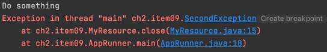
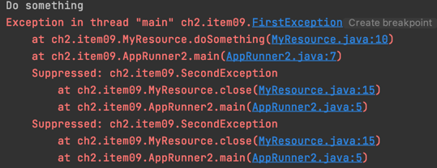

# Item09.try-finally보다는 rty-with-resources를 사용하라

> - 자바 라이브러리에는 colse 메서드로 직접 닫아줘야하는 자원이 많다.     
> - 클라이언트가 놓친 자원 닫기는 예측할 수 없는 성능 문제로 이어질 수 있다.


## 전통적인 방법 try-finally
*****

```java
public void doSomething(){
        System.out.println("Do something");
        throw new FirstException();
    }

    @Override
    public void close() {
        throw new SecondException();
    }
```
:: 각 메소드에서 예외를 던지도록 작성한다.


```java
MyResource myResource1 = new MyResource();
        MyResource myResource2 = null;
        try{
            myResource1.doSomething();
            try {
                myResource2 = new MyResource();
                myResource2.doSomething();
            }finally {
                myResource2.close();
            }
        }finally {
            myResource1.close();
        }
```

:: 중첩이 생기면 코드가 복잡해진다.
     
:: doSomething에서 FirstException이 발생하지만 다음에 발생하는 SecondException에 가려지게 된다.     


## try-with-resources
******
```java
try (MyResource myResource1 = new MyResource();
        MyResource myResource2 = new MyResource()) {
        myResource1.doSomething();
        myResource2.doSomething();
        }
```
      
:: FirstException 또한 잘 볼 수 있고, myResource2의 close또한 잘 실행된 것을 확인할 수 있다.

## 🔑 핵심
> - try-with-Resources를 사용하면 이전 예외가 가려지지 않기 때문에 디버깅에서 큰 장점을 가진다.
> - 코드가 더 짧고 분명해지고 정확하고 쉽게 자원을 회수할 수 있다.
