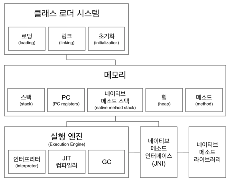
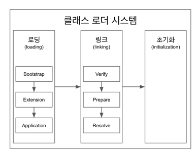

# 💻 더 자바, 코드를 조작하는 다양한 방법.
*****

# 📌 JVM, JDK, JRE
****
- ### JVM(Java Virtual Machine)
> - 자바의 가상 머신, 자바의 바이트 코드(class 파일)을 OS에 맞는 코드로 변환하여 실행.
> - 바이트 코드를 실행하는 표준이자 구현체.(JVM자체는 표준, 특정 벤더가 구현한 JVM은 구현체.)
> - 특정 플랫폼에 종속적.


- ### JRE(Java Runtime Environment)
> - JVM + 핵심 라이브러리 및 자바 런타임 환경에서 필요한 프로퍼티 세팅이나 리소스 파일.
> - 자바 애플리케이션을 실핼할 수 있도록 구성된 배포판.
> - 개발 관련 도구는 포함하지 않는다 (관련 도구는 JDK에서 제공)


- ### JDK(Java Development Kit)
> - JRE + 개발에 필요한 툴
> > appletviewr, apt, jar, jacadoc, javac, javap ...
> - 소스 코드를 작성할 때 사용하는 자바 언어는 플랫폼에 독립적.
> - 오라클 Java11 부터는 JDK만을 제공, JRE를 별도로 제공하지 않음.


- ### JAVA
> - JDK에 들어있는 자바 컴파일러 javac를 사용하여 바이트코드(.class)로 컴파일 할 수 있다.
> 

- ### JVM 언어
> - 클로저, 그루비, JRuby, Hython, Kotlin, Scala ... 
> - .class 파일  
> 


# 📌 JVM의 구조
*****
     
:: 출처 : 더 자바, 코드를 조작하는 다양한 방법 - 인프런 백기선님.       

- ### 클래스 로더 시스템.
> - .class 에서 바이트 코드를 읽고 메모리에 저장.
> 1. 로딩 : 클래스를 읽어옴.
> 2. 링크 : 레퍼런스를 연결.
> 3. 초기화 : static 값 초기화 및 변수에 할당.


- ### 메모리
> - 메모리 영역 : 클래스 수준의 정보(클래스 이름, 부모 클래스 이름, 메소드, 변수)를 저장. 공유자원으로 사용.
> - 메소드 영역 : 메소드 저장. 공유 자원
> - 힙 영역 : 객체를 저장. 공유 자원.
> - 스택 영역 : 쓰레드 마다 런타임 스택을 생성, 그 안에 메소드 호출을 스택 프레임이라는 블럭으로 쌓음.
    쓰레드가 종료될 때 런타임 스택은 함께 사라짐. 해당 쓰레드에만 공유 됨.
> - PC(Program Counter) 레지스터 : 쓰레드 마다 현재 실행할 스택 프레임을 가르키는 포인터.
> - 네이티브 메소드 스택 : 네이티브 메소드 인터페이스를 호출하는 스택 프레임을 생성.
> > 🧐 네이티브 메소드 인터페이스: 자바 애플리케이션에서 C, C++, 어셈블리로 작성된 함수를 사용할 수 있는 방법을 제공.


- ### 실행 엔진
> - 인터프리터 : 바이트 코드를 한줄씩 실행. 
> - JIT(Just In time) 컴파일러 : 인터 프리터의 효율 상승, 반복되는 코드를 발견하면 JIT 컴파일러로 반복되는 코드를 모두 네이티브 코드로 바꿔둔다. 
>  이 다음부터 인터프리터는 네이티브 코드로 컴파일된 코드를 바로 사용.
> - GC(Garbage Collector) : 더이상 참조되지 않는 객체를 모아 정리.


# 📌 클래스 로더
***


### 1. 로딩
> - 클래스 로더가 .class 파일을 읽고 그 내용에 따라 적절한 바이너리 테이터를 만들고 메소드 영역에 저장.
> - 저장 하는 데이터 : 풀 패키지 경로, 클래스 이름
> - Class? | Interface?| Enum?
> - 메소드, 변수
> > - 로딩이 끝나면 힙 영역에 저장.

### 2. 링크
> - Verify, Prepare, Resolve(optional) 세 단계로 나누어짐
> - Verify : .class 파일이 유효한지 체크.
> - Preparation : 클래스 변수(static)와 기본값에 필요한 메모리 준비.
> - Resolve : 심볼릭 레퍼런스를 메소드 영역에 있는 실제 레퍼런스로 교체.

### 3. 초기화
> - Static 변수의 값을 할당


### 클래스 로더의 계층구조.
> - 부트 스트랩 클래스 로더 : 최상위 클래스 로더, JAVA_HOME\lib에 있는 코어 자바 API를 제공.
> - 플랫폼 클래스로더 :JAVA_HOME\lib\ext폴더 | java.ext.dirs 시스템 변수에 해당하는 위치에 있는 클래스를 읽는다.
> - 애플리케이션 클래스 로더 - 애플리에키션 클래스패스에서 클래스를 읽는다.
```java
{App}.class.getClassLoader();
{App}.class.getClassLoader().getPerent();
```


## 📌 테스트 코드 커버리지
### - JaCoCo Plugin

> - 바이크 코드에 마크를 통해 얼마나 실행 되었는지를 측정.

- ### Gradle 설정.
```java
plugins {
    id 'jacoco'
}

jacoco {
    // JaCoCo 버전
    toolVersion = '0.8.5'
}
```
```java
jacocoTestReport {
    reports {
        html.enabled true
        csv.enabled true
        xml.enabled false
    }
    finalizedBy('jacocoTestCoverageVerification')
}
jacocoTestCoverageVerification {
    violationRules {
        rule {
            enabled = true
            element = 'CLASS'

            limit {
                counter = 'BRANCH'
                value = 'COVEREDRATIO'
                minimum = 0.1
            }

            limit {
                counter = 'LINE'
                value = 'COVEREDRATIO'
                minimum = 0.1
            }
            excludes = ["*.LikeHeartController", "*.AccountService"]
            includes = ["*.*Service", "*.*Controller"]
        }

    }
}
```
- excludes, includes를 이용하여 체크하고 싶은 패키지, 클래스를 설정.
- 패키지.클래스이름의 형식을 가짐. 와일드카드 *사용.

> - element : 커버리지의 체크 기준
> > BUNDLE(default), PACKAGE, CLASS, SOURCEFILE, METHOD
> - counter : 검사 단위
> > -  LINE : 빈 줄을 제외한 코드 라인 수
> > - BRANCH : if, switch 등 조건 분기 수
> > - CLASS, METHOD
> > -  INSTRUCTION(Java 바이트코드 명령 수)
> > - COMPLEXITY(복잡도 계산)
> - value : 커버리지율 표기
> > - TOTALCOUNT : 전체 수
> > - MISSEDCOUNT, COVERDCOUNT 
> > - MISSEDRATIO, COVEREDRATIO(default) : 0~1사이의 숫자로 비율을 표기.
> - minimum : 최소 도달해야하는 커버리지율, 도달하지 못하면 빌드 실패.
```java
test {
    useJUnitPlatform()
    finalizedBy 'jacocoTestReport'
}
```

- Test > jacocoTestReport > jacocoTEstCoverageVerification 순서로 실행되어야 함.
- finalizedBy를 이용하여 끝난 후 다음 task가 실행될 수 있도록 설정.


## 📌 바이트 코드 조작 라이브러리
***
> - ASM : https://asm.ow2.io/
> - Javassist : https://www.javassist.org/
> - ByteBuddy: https://bytebuddy.net/#/ (가장 심플)

- ### Javaagent
> -  Javaagent JAR 파일 생성.
> > - 시작할 때 붙이는 premain과 런타임 중에 동적으로 붙이는 agentmain이 있다.
> > - Instrumentation을 사용.
> - 클래스 로더가 클래스를 읽어올 때 javaagent를 거쳐서 변경된 바이트 코드를 읽어와 사용하기 때문에, 컴파일된 .class 파일의 바이트 코드는 변경되지 않는다.

```java
public static void premain(String agentArgs, Instrumentation inst) {
        new AgentBuilder.Default()
                .type(ElementMatchers.any())
                .transform((builder, typeDescription, classLoader, javaModule) -> builder.method(named("pullOut"))
                .intercept(FixedValue.value("Rabbit!")))
                .installOn(inst);
}
```
- Manifest to JAR 플러그인 사용.
- 사용할 프로젝트의 VM 옵션에서 -javaagent {JAR Path}


## - 활용
> - 프로그램 분석 : 버그 찾기, 코드 복잡도 계산.
> - 클래스 파일 생성 : 프록시, 특정 API 호출 제한
> - 소스코드를 건드리지 않고 코드 변경이 필요한 경우
> > - 프로파일러, 최적화, 로깅 ...

> - 스프링에서 컴포넌트 스캔을 할 때 사용(asm)
> > - ClassPathScanningCandidateComponentProvider -> SimpleMetadateaReder
> > - ClassReader와 Visitor를 사용해서 클래스에 있는 메타 정보를 읽어옴.


## 📌 리플렉션 API
****
> - [ReflectionAPI 정리](../ReflectionAPI/README.md)


### 애노테이션과 리플렉션
- 중요 애노테이션
> - @Retention : 애노테이션의 유지 소스, 클래스, 런타임 
> - @Inherit : 하위 클래스까지 전달.
> - @Target : 어디에 사용하는가 , type, field, method  

- 리플렉션
> - Retention이 Runtime일 때 조회 가능.
> > -  default는 class이기 때문에 바이트 코드에는 들어있다. 그러나 클래스를 로딩할 때 해당 정보는 빼고 읽어온다.
> - getAnnotations() : 상속받은 애노테이션까지 조회
> - getDeclaredAnnotations() : 자기 자신에게 붙어있는 애노테이션만 조회.

