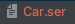
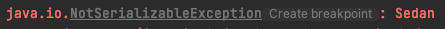
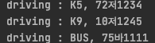

# Java의 직렬화와 역 직렬화.

> Java의 Serialization?       
>  :객체를 직렬화하여 전송 가능한 상태로 만드는 것. 객체 데이터를 연속적인 데이터로 변형. Stream으로 데이터를 읽을 수 있다.

> Deserialization?      
> :직렬화의 반대 개념으로 직렬화된 파일을 다시 역으로 하여 객체의 형태로 만드는 것. 직렬화데이터를 읽어 객체의 형태로 복원한다.

- 직렬화의 조건

        1. 기본형 타입(int,char,String...)등은 직렬화 가능하다.
        2. Serializable 인터페이스의 구현 객체.
        3. 생성자, 메소드는 직렬화 대상에 속하지 않는다.

## 직렬화.
************


```java
public class Car implements Serializable {
  private String model;
  private String number;
  private transient String SecretNumber ="asdaf23D23";

  public Car(String model, String number){
    this.model =model;
    this.number = number;
  }
  public void driving(){
    System.out.println("driving : "+model+", "+number);
  };

}
```

:: Serializable 인터페이스를 구현하여 직렬화가 가능하도록 만든다.     
:: 직렬화하지 않을 필드는 transient를 이용하여 직렬화 대상에서 제외할 수 있다.

```java
public class Bus extends Car{
    public Bus(String model, String number) {
      super(model, number);
    }
    public void pickUp(){}
}

```
:: 직렬화 가능 클래스를 상속한 클래스 또한 직렬화가 가능하다.


```java
FileOutputStream fos = new FileOutputStream("Car.ser");
BufferedOutputStream bos = new BufferedOutputStream(fos);
ObjectOutputStream oos = new ObjectOutputStream(bos);

Car car1 = new Car("K5", "72저1234");
Car car2  =new Car("K9","10저1245");

Bus bus = new Bus("BUS","75바1111");

ArrayList<Car> cars = new ArrayList<>(){
{
add(car1);
add(car2);
}
};

oos.writeObject(cars);
oos.writeObject(bus);
oos.close();
```
:: Car 클래스를 두 개 생성하여 ArrayList를 추가하고, ArrayList 객체를 ObjectOutputStream을 통해 Car.ser에 내보냈다. 각각의 객체를 쓰는것 또한 가능하다.    
:: Car 클래스를 상속받은 Bus 클래스 또한 직렬화가 가능한 것을 확인할 수 있다.



:: 직렬화 불가능한 클래스를 필드로 가지면 직렬화가 불가능하다.
```java
public class Car implements Serializable {
        ....
  //직렬화 불가능 클래스.
  Sedan sedan = new Sedan();
        .....
}
```


## 역 직렬화
*******
```java
 FileInputStream fis = new FileInputStream("Car.ser");
            BufferedInputStream bis = new BufferedInputStream(fis);
            ObjectInputStream ois = new ObjectInputStream(bis);

            ArrayList<Car> cars = (ArrayList<Car>)ois.readObject();
            Bus bus =(Bus)ois.readObject();

            cars.get(0).driving();
            cars.get(1).driving();
            bus.driving();
```


:: 역 직렬화의 readObject의 순서는 파일에 쓸때의 순서와 동일하다. 


## 클래스의 변경,역 직렬화시 문제발생.
*****
> 직렬화하면 자동으로 SerialVerstionUID 라는 고유 번호를 생성하고, 역직렬화시 해당 UID가 맞지 않는다면 오류가 발생한다.

```java
    private String location;

```
:: Car 클래스에 location이라는 새로운 필드를 생성하였고, 이전에 직렬화해둔 파일을 역질렬화 해보았다.

    java.io.InvalidClassException: Car; local class incompatible: stream classdesc serialVersionUID = -75300444769372377, local class serialVersionUID = 5820813650402553055

라는 예외가 발생한다. 현재 로컬 클래스와 역직렬화하는 클래스의 UID가 일치하지 않아 발생하는 예외이다.

:: 클래스의 변경은 매우 자주 이루어지고 그때마다 새로 직렬화 파일을 생성해야 한다면 이는 매우 불편한 일이다.

### 해결
```java
    private static final long serialVersionUID = 1234L;
```
:: Car 클래스에 위와같은 필드를 생성하여 수동으로 UID를 지정해준다. UID를 수동으로 지정해주면 변경사항이 발생하여도,UID를 변경하지만 않는다면 정상적으로 역직렬화할 수 있다.