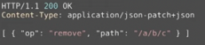

# 🤔 REST API란?
> - REpresentational State Transfer
> - 컴퓨터 시스템 사이의 상호 운용성을 제공하는 방법중 하나.


### 🌐 1991년 WEB의 등장.
> 어떻게 인터넷에서 정보를 공유할 것인가?
> - 정보들을 하이퍼 텍스트로 연결.
> - 표현방식: HTML
> - 식별자: URI
> - 전송 방법: HTTP


### HTTP/1.0 (1994-1996)
- Roy T. fielding : HTTP 프로토콜을 변경할 때 어떻게 하면 기존의 웹과 호환성 문제 없이 HTTP를 진보 시킬 수 있을지 고민.
- HTTP Object Model 등장.
- 1998년에 REST 라는 이름으로 불리움.

### 이전의 API
- Salesforce SOAP(2000.02): 너무 복잡.
- flickr API(2004.08) : REST를 이용한 API도 공개. 훨씬 짧다.


### 🧐 REST API
microsoft에서 발표한 REST API 가이드, 사람들이 말하는 REST API 는 REST를 만들어낸 Roy T.fielding과 달랐다.

로이 필딩이 말하는 REST API는 반드시 hypertext-driven 이어야 한다고 설명한다.
또한 <strong>REST란 분산 하이퍼 미디어 시스템(웹)을 위한 아키텍쳐 스타일 이라고 말한다.</strong>

아키텍쳐 스타일은 제약조건의 집합이다. 즉 REST스럽다는 것은 해당하는 제약조건을 모두 지킨다는 것을 말한다.

### REST 스타일
> - Client - Server
> > : 클라이언트와 서버가 종속성 없이 별도로 존재, 클라이언트는 URI를 아는 것이 전부.
> - stateless
> > : 서버는 클라이언트의 요청에 대해 상태를 저장하지 않는다. 
> - cacheable
> > : 캐싱이 적용가능 한 경우 리소스에 적용해야 하며, 이러한 리소스에는 캐시가 가능함을 반드시 명시.
> > 잘 관리된 캐시는 서버 - 클라이언트간의 상호작용을 제거 해주고, 확장성과 성능을 향상 시킨다.
> - layered System
> > : 클라이언트는 일반적으로 종단 서버에 직접 연결인지, 중간 서버에 연결된 것인지 알 수 없다.
> > 서버는 계층화된 아키텍쳐를 사용한다.(A서버에 배포, B서버에 데이터 저장, C서버에서 요청 인증 등.. )
> - ### uniform Interface
> - code-on-demand(optional)
> > : 서버에서 코드를 클라이언트로 보내서 실행할 수 있어야 한다(javascript)

### 대체적으로 HTTP를 따른다면 위와 같은 제약조건을 대부분 만족한다. 하지만 uniform interface같은 경우 지켜지지 않는 경우가 존재한다.

### ☝️ Uniform Interface 제약조건
- identification of resources : 리소스가 URI로 식별된다.
- manipulation of resources through representations : representation 전송을 통해 리소스가 조작 되어야 한다.
  리소스를 생성, 변경, 제거 할때 HTTP 메세지에 이러한 표현을 담아야 한다.   
  
    #### 위의 두가지는 대부분의 API에서 만족한다.

- #### self-descriptive message: 모든 메시지는 자신을 설명해야 한다.   

           
    요청 메시지에는 메서드 방식, HTTP 버전, HOST가 모두 명시되어야 자신을 설명 가능하고, 
    응답메시지에는 HTTP 버전 응답 코드, 메시지, 응답 데이터, 응답 데이터의 형식. 명세를 찾아갈 수 있는 정보(patch+json)를 포함해야 한다.

- #### HATEOAS : 애플리케이션의 상태는 하이퍼링크를 통해 전이되어야 한다.
    - hypermedia as the engine of application state
    - HTML 문서에서는 a태그, JSON에서는 Link 헤더를 사용하여 만족시킨다.
        - 💡 *Link : 연결되어있는 다른 리소스를 가르킬 수 있는 헤더.
    
### ☝️ 왜 Uniform Interface 가 필요한가?
서버와 클라이언트가 각각 독립적으로 진화할 수 있다. 즉 서버의 기능이 변경되어도 클라이언트를 업데이트 할 필요가 없다.
REST가 등장하게된 목적과 일치한다. 때문에 반드시 만족해야 REST라 할 수 있다.

Self-descriptive는 서버나 클라이언트가 변경되더라도 오고가는 메시지는 언제나 자신을 설명가능하므로 언제나 해석이 가능하고 이는 확장 가능한 커뮤니케이션을 의미한다.
HATEOAS는 애플리케이션 상태 전이의 late binding이 가능하도록 만든다. 즉 링크가 동적으로 변경될 수 있다.

### ☝️ 왜 REST API가 어려운가
일반적인 웹에서는 사람과 기계의 커뮤니케이션이지만 HTTP API는 기계와 기계의 커뮤니케이션이다.
때문에 미디어 타입도 웹은 HTML인 반면에 API는 JSON, XML과 같이 기계가 이해할 수 있는 포멧을 사용한다.
그런데 JSON과 같은 포멧에서는 하이퍼링크가 정의되어 있지 않고(HATEOAS 만족x), Self-descriptive 또한 불완전하게 명세되어 있다.(파싱은 가능하나 각 값의 해석이 불가능하다.)


#### Self- descriptive의 해결
1. 미디어 타입 정의 : 미디어 타입 문서를 장성하고 IANA에 미디어 타입을 등록한다.
   - 단점 : 복잡하다.
2. Profile : Link 헤더에 Profile relation으로 해당 명세를 링크.   
   ```Link: <https://example.org/docs/2>; rel="profile```
   - 단점 : Content negotiation 이 불가능하다.
     미디어 타입같은 경우에는 클라이언트가 지원하지 않으면 서버가 알 수 있지만 Link 헤더를 이용하면 이를 알아챌 수 없다.

#### HATEOAS 해결
1. data에 추가 : 본문에 ```"link": "https://example.org/docs/2"``` 와 같이 추가. 링크를 표현하는 방법을 직접 정의해야 한다.
2. HTTP 헤더로 : Link, Location 헤더를 활용. 


<br><br><br>
> #### https://www.youtube.com/watch?v=RP_f5dMoHFc (naver d2- 그런 REST API로 괜찮은가 - 이응준님)
> #### https://restfulapi.net/rest-architectural-constraints/
> 를 참고하였습니다.