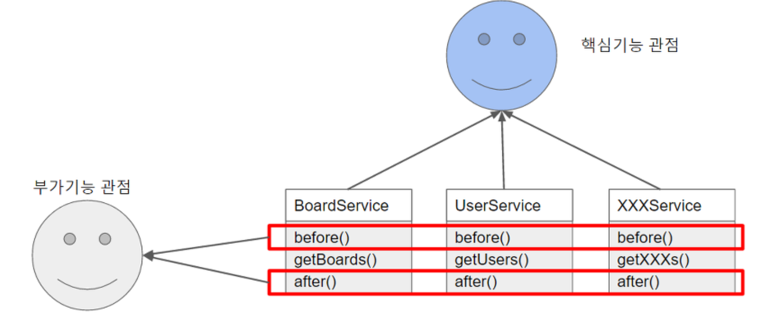
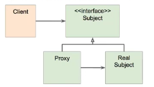
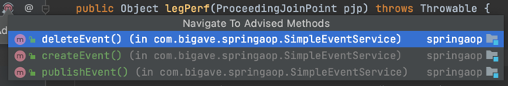

# 📌 AOP
****
> AOP : Aspect-oriendted Programming은 OOP를 보완하는 수단, 흩어진 Aspect를 모듈화할 수 있는 프로그래밍 기법.
> 
    

AOP는 애플리케이션 전체에 걸쳐 사용되는 기능을 재사용하도록 지원한다. OOP에서는 이러한 공통 로직의 모듈화를 상속, 위임을 이용하여 해결한다.
하지만 이러한 방법은 여기저기에서 사용되는 부가기능들을 깔끔하게 모듈화하여 처리하기에는 어려움이 있다. AOP는
기존 OOP에서 바라보던 관점을 다르게 하여 부가 기능적인 측면에서 보았을 때
공통된 요소를 추출하자는 것이다.(핵심 로직을 제외한 공통 부가 기능의 모듈화) 

AOP는 어플리케이션 전체에 흩어진 공통 기능을 한 곳에서 관리할 수 있다는 점, 다른 서비스 모듈들이 자신의 핵심 비즈니스 로직에만 집중하고
다른것을 신경쓰지 않아도 된다는 점에서 이점을 가진다.


    
출처 : 백기선님 인프런 스프링 프레임워크 핵심 기술편.

### ☝️ 주요 개념
- Target : Adivice가 적용 되는 대상
- Aspect : 흩어진 것들을 모은 모듈. 부가될 기능을 정의한 Advice와 어디에 적용할 지를 결정하는 Pointcut을 가진다.
- Advice : 해야할 일들. 실제적인 부가기능을 담은 구현체.
- Join Point : 접근 지점, 포인트 컷의 후보. 메소드 호출, 생성자 호출전, 생성자 호출, 필드 접근전, 필드 값을 가져갔을 때 등..    
    > 스프링에서는 메소드 조인포인트만 제공하고 있다. (타 프레임 워크는 예외, 필드값의 수정 등도 있음.)
- Pointcut : 적용될 대상을 선정하는 방법, 어디에 적용할지. A라는 클래스의 a 메소드를 호출할 때 등..
- Proxy : 타겟을 감싸서 타겟의 요청을 대신 받아주는 Wrapping 오브젝트, 타겟을 호출하게 되면 프록시가 호출되어 타겟 메소드 실행전에 선처리,
타겟 메소드 실행 후 후처리 등을 실행한다.
- Introduction : 타겟 클래스에 코드 변경없이 신규 메소드, 멤버변수를 추가하는 기능.
- Weaving : 어드바이스를 조인 포인트에 끼워넣는 작업. 지정된 객체에 애스팩트를 적용해 새로운 프록시 객체를 생성한다.
  컴파일타임, 클래스로드 타임, 런타임에 실행되지만 스프링에서는 런타임에 프록시 객체가 생성된다.
  
### ☝️ AOP 적용 시점
- 컴파일 : 자바 파일을 클래스 파일로 만들때 바이트 코드를 조작, 클래스 파일에 같이 포함 된다.      
    > 별도의 컴파일이 한번 더 필요함.
- 로드 타임 : 클래스 파일을 로딩하는 시점에 Advice를 끼워넣음.(Load Time Weaving).     
    > 약간의 성능 부하, 로드타임 위버의 설정 필요.
- 런타임 : A라는 클래스 타입의 Bean을 만들 때 A Bean의 프록시 빈을 생성, 프록시 빈이 Advice를 실행.      
    > 약간의 성능 부하. 추가적인 설정이 필요 없고 문법이 쉽다.
- 컴파일, 로드 타임은 AspectJ를 사용, 런타임은 Spring AOP를 주로 사용.

### ☝️ 구현체(자바)
> - AspectJ : AOP 기술의 원조 프레임 워크.
> 프록시가 아닌 **컴파일시점**에 컴파일된 타깃 **클래스파일** 자체를 수정하거나 클래스가 JVM에 로딩되는 시점을 가로채 바이트코드를 수정한다.
> 필드 값, 스태틱 초기화, 오브젝트 생성, 필드 값 조회 등 다양한 조인 포인트가 존재한다.
>
> - 스프링 AOP : 국한적인 기능, 런타임에 타겟의 Interface를 상속받은 프록시 객체를 생성.


## 🧐 프록시 기반 AOP
****

### ☝️ 스프링 AOP 특징
> - 프록시 기반의 AOP 구현체.
> - 스프링 빈에만 AOP를 적용할 수 있다.
> - 모든 AOP 기능을 공하는 것이 아닌 스프링 IoC와 연동하여 엔터프라이즈 애플리케이션에서 가장 흔한 문제에 대한 해결책을 제공하는 것이 목적.

### ☝️ 프록시 패턴.
- 기존 코드의 변경 없이 접근 제어, 또는 부가 기능 추가.
 
         
  
- ### Subject
    ```java
    @Service
    public class SimpleEventService implements EventService{
        @Override
        public void createEvent() {
            System.out.println("Cerated an Event");
        }
    
        @Override
        public void publishEvent() {
            System.out.println("Published an Event");
        }
    
        public void deleteEvent(){
            System.out.println("Delete an Event");
        }
    }
    ```

- ### Proxy class
    ```java
    @Primary  //주입 받을때 최우선으로 선택되기 위해.
    @Service
    public class ProxySimpleEventService implements EventService{
    
        @Autowired
        SimpleEventService simpleEventService; //real class를 주입받음.
    
        @Override
        public void createEvent() {
            long begin = System.currentTimeMillis();
            simpleEventService.createEvent(); // real class의 기능을 그대로 위임.
            System.out.println(System.currentTimeMillis() - begin); // 기능 추가.
        }
    
        @Override
        public void publishEvent() {
            long begin = System.currentTimeMillis();
            simpleEventService.publishEvent();
            System.out.println(System.currentTimeMillis() - begin);
        }
    
        @Override
        public void deleteEvent() {
            simpleEventService.deleteEvent();
        }
    }
    ```
    > Proxy 클래스를 생성하여 Real 클래스의 기능을 그대로 위임받고, 기능을 추가. 기존의 코드를 변경하지 않고 기능을 추가할 수 있다.
    
    - ### 프록시 패턴의 문제점.
    > - 매번 프록시 클래스를 작성?
    > - 여러 클래스, 여러 메소드에 동일한 기능을 추가하려면? 중복코드.
    > - 객체들의 관계가 복잡해 진다.


## 🧐 @AOP
*****
스프링 AOP는 JDK Dynamic Proxy, 즉 런타임에 자동으로 프록시를 생성해주는 프록시 기반 AOP.
JDK Dynamic Proxy 방식은 Java의 리플렉션 패키지에 존재하는 Proxy 클래스를 통해 동적으로 다이나믹 프록시 객체를 생성한다.
해당 객체는 타켓의 인터페이스를 상속받아 만들어진다.

- ### Spring AOP
> - 스프링 IoC 컨테이너가 제공하는 기반 시설과 다이나믹 프록시를 사용하여 여로 복잡한 문제 해결.
> - 동적 프록시 : 동적으로 프록시 객체를 생성.          
    > 자바가 제공하는 방법은 인터페이스 기반 프록시 생성.   
    > CGlib은 클래스 기반 프록시도 지원.
> - 스프링 IoC : 기존 빈을 대체하는 동적 프록시 빈을 만들어 등록 시켜준다.      
    > 클라이언트 코드 변경 없음.
    > AbstractAutoProxyCreator implements BeanPostProcessor
> - @Transactional 어노테이션 또한 AOP를 이용하여 동작한다.

```xml
<dependency>
    <groupId>org.springframework.boot</groupId>
    <artifactId>spring-boot-starter-aop</artifactId>
</dependency>
```
### 1. @Around() : 어드바이스가 타겟 메서드를 감싸 타겟 메서드의 호출 전, 후에 수행.
- ### 1-1. @Around("execution()")
    ```java
    @Component
    @Aspect
    public class perfAspect {
        // Value에는 Pointcut 이름 또는 Pointcut 정의.
        @Around("execution(* com.bigave..*.EventService.*(..))") //com.bigave 패키지 밑에있는 모든 클래스 중에서 EventService안에 들어있는 모든 메소드에 아래 메서드(행위)를 적용하라.
        public Object legPerf(ProceedingJoinPoint pjp) throws Throwable {
            long begin = System.currentTimeMillis();
            Object retVal = pjp.proceed();
            System.out.println(System.currentTimeMillis() - begin);
            return retVal;
        }
    }
    ```
    
    > 툴의 지원을 받아 적용된 메소드 확인 가능.

- ### 1-2. @Around("@annotaion()") : 특정 클래스 또는 메소드에만 적용.
    ```java
    //애노테이션 정의.
    @Retention(RetentionPolicy.CLASS) //Default : CLASS파일까지 유지. SOURCE : 컴파일 까지 유지. RUNTIME: 런타임 까지.
    @Target(ElementType.METHOD)
    public @interface PerfLogging {
    }
    
    // Aspect
    @Around("@annotation(PerfLogging)")
    
    // target Method
    @PerfLogging
    public void targetMethod(){...}
    ```

- ### 1-3. @Around("bean()") : 특정 빈의 모든 메소드에 적용.
    ```java
    @Around("@bean(simpleEventService)")
    ```

### 2. @Before() : 지정된 메소드의 실행 전에.
```java
@Before("bean(simpleEventService)") // 지정된 메소드의 실행 전에.
public void hello(){
    System.out.println("hello");
}

```
### 3. @After() : 지정된 메소두 이후, 결과에 상관 없이 메서드가 완료되면 수행.
### 4. @AfterReturning() : 타겟 메서드가 성공적으로 결과를 반환했을 때 수행.
### 5. @AfterThrowing : 타겟 메서드가 수행 중 예외르 던질때 수행.

### ☝️ 포인트컷 지정자
excution , Annotation, bean과 같은 포인트컷 지정자는 Around에만 사용할 수 있는 것이 아니다.
- excution() : 접근 제한자, 리턴타입, 인자타입, 클래스, 메소드명, 파라미터 타입, 예외 타입을 모두 조합 가능한 지정자. 가장 세밀하게 지정가능하다.
- bean : 특정 빈의 모든 메소드에 적용.
- args() : 메소드의 인자가 타겟 명세에 포함된 타입일 경우.
- @args() : 메소드의 인자가 타겟 명세에 포함된 애노테이션 타입을 갖는 경우
- within : excution 지정자에서 클래스 까지만 적용된 경우, 클래스/인터페이스 단위까지만 범위 지정이 가능하다.
- @within : 주어진 애노테이션을 사용하는 타입으로 **선언** 된 메소드
- @annotaion : **실행되는** 타겟 메소드에 특정 애노테이션이 지정된 경우.
- @target() : 타겟 메서드를 실행하는 객체의 클래스가 타겟 명세에 지정된 타입의 애노테이션이 있는 경우.
- target() : 빈 타입이 아닌 타입의 인스턴스.


포인트 컷은 아래와 같이 마치 변수처럼 재사용 가능한 포인컷을 정의할 수 있다.
```java
@Pointcut("execution(* com.bigave..*.EventService.*(..))")
public void eventService(){}

@Around("eventService()")
public Object legPerf(ProceedingJoinPoint pjp) throws Throwable {
        long begin = System.currentTimeMillis();
        Object retVal = pjp.proceed();
        System.out.println(System.currentTimeMillis() - begin);
        return retVal;
    }
```


<br><br><br>
> - https://jojoldu.tistory.com/71?category=635883  
> - https://hwannny.tistory.com/98     
> - https://www.inflearn.com/course/spring-framework_core