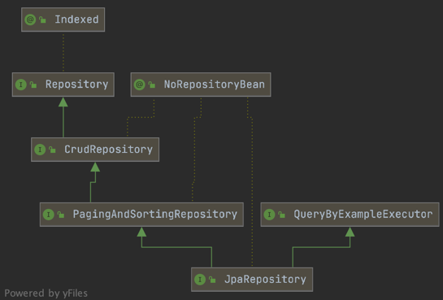

## 🧐 Spring Data JPA의 공통 인터페이스

```java
@EnableJpaRepositories(basePackages = "com.datajpa.repository")
```
스프링 부트를 사용한다면 위의 애노테이션 설정이 필요없고, @SpringBootApplication 의 위치에서 부터 탐색하게 된다.

```java
public interface MemberRepository extends JpaRepository<Member, Long> {
}
```
```java

package org.springframework.data.jpa.repository;

public interface JpaRepository<T, ID> extends PagingAndSortingRepository<T, ID>, QueryByExampleExecutor<T> {
    @Override
    List<T> findAll();
    T getById(ID id); // 프록시로 조회
    ...
}
```
```java
package org.springframework.data.repository;

public interface CrudRepository<T, ID> extends Repository<T, ID> {
    <S extends T> S save(S entity);
    <S extends T> Iterable<S> saveAll(Iterable<S> entities);
    Optional<T> findById(ID id);
    boolean existsById(ID id);
    void delete(T entity);
    void deleteById(ID id);
    void deleteAll();
    long count();
    Iterable<T> findAll();
}
```
JpaRepository 인터페이스를 상속받으면 바로 해당 메서드들을 사용 가능하다.
스프링에서 자동으로 구현체를 주입해주게 되는데 이때 프록시를 이용하여 생성한 후 주입 해준다.
컴포넌트 스캔을 스프링 데이터 JPA가 자동으로 처리해 주기 때문에 @Repository 애노테이션도 생략이 가능하다. 또한 JPA 예외를 
스프링 예외로 변환하는 과정도 자동으로 처리 된다.

위의 두 인터페이스의 패키지를 보면 JpaRepository는 data.jpa.repository 에, CrudRepository는 data.repository 인 것을 확인 할 수 있다.
JpaRepository는 Jpa에 특화된 인터페이스고, CrudRepository는 spring Data MongoDB 등 에서도 공통으로 사용할 수 있는 Repository 이다.


    
JpaRepository 의 메서드들 뿐만 아니라 그 부모의 메서드들 또한 사용이 가능하다. CrudRepository 를 상속해도 되지만
보통 JpaRepository를 상속받아 사용한다.


## 🧐 쿼리 메서드
스프링 데이터 Jpa 에서 쿼리 메서드를 사용하는 방법은 3가지가 있다.
- 메서드 이름으로 쿼리 생성
- 메서드 이름으로 JPA NamedQuery 호출
- @Query 애노테이션

### ☝️ 메서드 이름으로 쿼리 생성
메서드 이름을 분석해서 JPQL 쿼리를 실행한다.
```java
List<Member> findByUsernameAndAgeGreaterThan(String username, int age);
```
```find..By``` : find 와 By 사이에는 해당 메서드를 설명해줄 수 있는 내용이 들어가도 된다.
이외에 existBy, countBy, deleteBy, removeBy 등..

```limit``` : findFirst5, findTop5, findFirst .. 등 처럼 사용할 수 있다. 


쿼리 메소드 필터 조건
스프링 데이터 JPA 공식 문서 참고: (https://docs.spring.io/spring-data/jpa/docs/current/ reference/html/#jpa.query-methods.query-creation)


### ☝️ NamedQuery
```java
@NamedQuery(
        name = "Member.findByUsername",
        query = "select m from Member m where m.username = :username"
)
```
미리 쿼리를 이름으로 정의해두고 사용한다. createQuery()를 이용하여 JPQL을 String으로 생성할때와 달리
애플리케이션 로딩시점에 오류를 검사할 수 있다는 장점이 있고, 미리 불러진 쿼리를 여러번 재사용할 수 있게 된다.

- 순수 JPA
```java
public Member findByUsername(String username){
    return em.createNamedQuery("Member.findByUsername", Member.class)
            .setParameter("username", username)
            .getSingleResult();
}
```
생성된 NamedQuery의 이름을 가지고 쿼리를 바로 생성할 수 있다.

- JpaRepository
```java
//    @Query(name = "Member.findByUsername")
    Member findByUsername(@Param("username") String username);
```
마찬가지로 생성된 네임드 쿼리의 이름을 가지고 사용 가능하다. 하지만 이 때 네임드 쿼리의 이름이
 ```{엔티티 클래스}.{네임드쿼리 이름}``` 이라면 명시하지 않아도 자동으로 찾아 사용한다.

### ☝️ Query
```java
@Query("select m from Member m where m.username = :username and m.age = :age")
List<Member> findByUsernameAndAge(@Param("username") String username, @Param("age") ing age);
```
`@Query` 애노테이션을 사용하여 바로 메서드에 JPQL 쿼리를 작성할 수 있다.
파라미터는 `@Param()` 또는 파라미터의 순서(?1, ?2 ..) 로 메서드에 들어온 파라미터를 값으로 지정할 수 있다.

마찬가지로 문자열로 이루어진 Query 지만. 애플리케이션 로딩시점에 파싱을 하기 때문에 문법 오류를 발견할 수 있다.