# 📔 목차
- ### [Batch 란?](#-batch-란)
- ### [Spring Batch?](#-spring-batch)
- ### [Spring Batch 아키텍쳐](#-spring-batch-아키텍쳐)
- ### [Meta Date Schema](#-meta-data-schema)
- ### [Spring Boot와 Spring Batch](#-spring-boot와-spring-batch)
  - #### [Tasklet 방식을 사용한 간단한 배치 프로그램](#-tasklet-방식을-사용한-간단한-배치-프로그램)
- ### [Batch 도메인](#-도메인의-이해)
  - #### [Job](#-job)
  - #### [JobInstance](#-jobinstance)
  - #### [JobParameter](#-jobparameter)
  - #### [JobExecution](#-jobexecution)
  - #### [Step](#-step)
  - #### [StepExecution](#-stepexecution)
  - #### [StepContribution](#-stepcontribution)
  - #### [ExecutionContext](#-executioncontext)
  - #### [JobRepository](#-jobrepository)
  - #### [JobLauncher](#-joblauncher)
- ### [배치 설정](#-배치-설정)
- ### [Job의 실행](#-job의-실행)
  - #### [JobBuilderFactory](#-jobbuilderfactory)
  - #### [SimpleJob API](#-simplejob-api)
  - #### [SimpleJob 아키텍처](#-simplejob-아키텍처)
- ### [Step의 실행](#-step의-실행)
  - #### [StepBuilderFactory](#-stepbuilderfactory)
  - #### [TaskletStep](#-taskletstep)
  - #### [TaskletStep 아키텍처](#-tasklet-아키텍처)
  - #### [JobStep](#-jobstep)
- ### [FLow](#-flow)
  - #### [FlowJob](#-flowjob)
  - #### [Trasition](#-transition)
  - #### [사용자 정의 ExitStatus](#-사용자-정의-exitstatus)
  - #### [JobExecutionDecider](#-jobexecutiondecider)
  - #### [FlowJob 아키텍처](#-flowjob-아키텍처)
  - #### [SimpleFlow](#-simpleflow)
  - #### [FlowStep](#-flowstep)
- ### [@JobScope, @StepScope](#-jobscope-stepscope)
- ### [Chunk Process](#-chunk-process)
- ### [ItemReader 구현체](#-itemreader-구현체)
  - #### [FlatFileItemReader](#-flatfileitemreader)
  - #### [XML-StaxEventItemReader](#-xml-staxeventitemreader)
  - #### [JsonItemReader](#-jsonitemreader)
  - #### [JdbcCursorItemReader](#-jdbccursoritemreader)
  - #### [JpaCursorItemReader](#-jpacursoritemreader)
  - #### [JdbcPagingItemReader](#-jdbcpagingitemreader)
  - #### [JpaPagingItemReader](#-jpapagingitemreader)
  - #### [ItemReaderAdapter](#-itemreaderadapter)


- ### [참조](#-참조)
<br>

****
### 🤔 Batch 란?

정해진 시간에 일괄적으로 작업을 처리할 수 있도록 해주 프로그램으로 주로 대용량 데이터를 다룬다.    
필요한 데이터를 모아서 처리하거나, 일정 시간 뒤에 처리하고자 할 때 사용할 수 있고,대용량 데이터를 다룰 때 트래픽이 적은 시간대에 서버 리소스를 사용하기 위해 사용한다.    
(주로 ETL:Extract-Transform-Load, 대용량 데이터를 데이터 웨어하우스에 저장.)

### 🤔 Spring Batch?

자바 기반 표준 배치 기술의 부재로 배치 처리에서 요구하는 재사용 가능한 자바 기반 배치 아키텍처 표준의 필요성이 대두되었고,   
Accenture에서 소유하고 있던 배치 처리 아키텍처 프레임웤르를 스프링 배치 프로젝트에 기증하였다.

가볍고 다양한 기능을 가진 배치 프레임워크로, 견고한 배치 어플리케이션 개발이 가능하도록 디자인 되어있다.   
최근 기업 시스템 운영에 필수적이라고 할 수 있다.

기존 Spring 프로젝트의 모듈을 활용할 수 있다는 장점을 가진다.(새로운 언어로 처리를 새로 구현하지 않아도 된다.)   
배치 처리를 위한 로지을 새로 만들지 않고 스프링 배치에서 제공하는 기능을 사용할 수 있다.

- ### 👆 배치의 핵심 패턴
  - **Read**: DB, 파일, 큐 등에서 다량의 데이터를 읽는다.
  - **Process**: 데이터를 가공한다.
  - **Write**: 가공된 데이터를 다시 저장한다.


- ### 👆 배치 시나리오
  - 배치 프로세스를 주기적으로 커밋한다.(효율적인 커밋 전략.)
  - 동시 다발적인 Job 의 배치 처리, 병렬 처리.
  - 실패 후 스케줄링에 의해 재시작된다.
  - 의존관계가 있는 step들을 순차적으로 처리한다.
  - 조건에 따라 흐름을 구성하는 등 체계적이고 유연한 배치 모델을 구성한다.
  - 반복하거나, 재시도, Skip 처리(중요하지 않은 예외를 스킵, 계속 실행될 수 있도록)등..

<br>

# 📌 Spring Batch 아키텍쳐

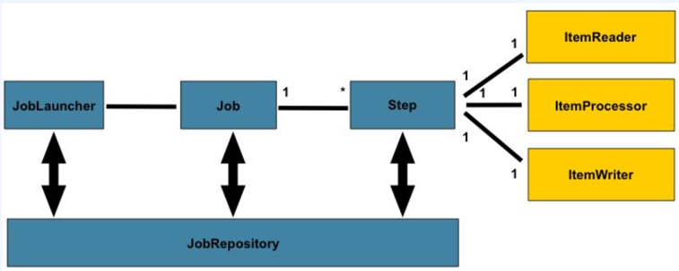

- `JobLauncher`: Job을 실행시키는 컴포넌트
- `Job`: 배치 작업.
- `JobRepository`: Job의 실행과 Job, Step을 저장.
- `Step`: 배치 작업의 단계. ItemReader, ItemProcessor, ItemWriter는 데이터를 읽고, 처리하고, 쓰는 구성을 하나씩 가진다.

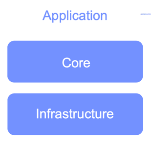

- **Application**
  > 비즈니스, 서비스 로직, Core, Infrastructure을 이용하여 배치 기능을 만든다.     
  > 개발자는 업무 로직의 구현에만 집중하고 공통적인 기술 기반은 프레임 워크가 담당하도록 한다.
- Core
  > 배치 작업을 시작하고 제어하는 필수 클래스(Job, Step, JobLauncher, Flow)    
  > Job을 실행하고 모니터링, 관리하는 API로 구성되어 있다.
- Infrastructure
  > 외부와 상호작용하는 레이어, (ItemReader, ItemWriter, RetryTemplate, Skip)    
  > Application, Core 모두 공통 Infrastructure 위에서 빌드한다. Job 실행의 흐름과 처리를 위한 틀을 제공한다.

  실제로 패키지 구조를 열어 확인해 볼 수 있다.

- ### 🧐 Job
  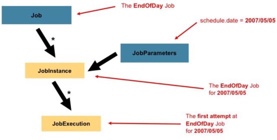
  - 전체 배치 프로세스를 캡슐화한 도메인으로, Step의 순서를 정의한다.
  - `JobParameters` 를 받는다.
  - JobParameters를 받아 JobInstance가 생성되고, JobExecution으로 나누어져 실행된다.

- ### 🧐 Step
  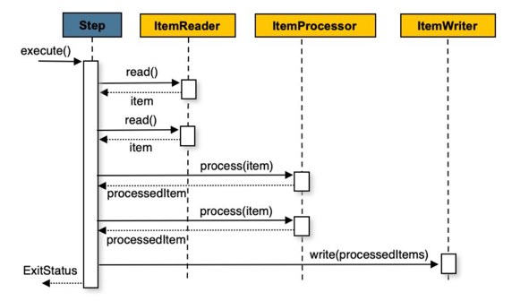
  - 작업의 처리 단위.
  - Chunk | Tasklet 기반으로 하나의 트랜잭션에서 데이터를 처리한다.
  - commitInterval 만큼 데이터를 읽고, 데이터를 처리한 뒤, ChunkSize 만큼 한번에 Write 한다.

<br>

# 📌 Meta Data Schema
  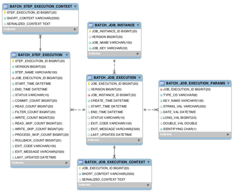    

  스프링 배치가 실행 및 관리를 위한 목적으로 여러 도메인(Job, Step, Execution, Instance JobParams ...) 의 정보를 저장할 수 있는 스키마를 제공한다.    
  Job 의 이력(성공, 실패), 파라미터 등 실행 결과를 조회할 수 있다. -> 리스크 발생시 빠른 대처 가능.    

  DB와 연동할 경우 필수적으로 메타 테이블이 생성되어야 하며 스키마 파일의 위치는 /org/springframework/batch/core/schema-*.sql 이다.(DB 유형별로 제공)

- ### 🧐 테이블
  - BATCH_JOB_INSTANCE
    >  Job 이 실행될 때 JobInstance 정보가 저장되며, job_name과 job_key로 하여 하나의 데이터가 저장된다 (인스턴스는 유일)
      - version: 업데이트 마다 1씩 증가하는 값
      - job_name: job을 구성할 때 부여한 이름.
      - job_key: name 과 parmas를 합쳐 해싱한 값
  
  - BATCH_JOB_EXECUTION
    > Job의 실행 정보(생성, 시작, 종료 시간, 실행 상태, 종료 코드, 실패 원인 메시지, 마지막 실행 시점 등)
  - BATCH_JOB_EXECUTION_PARAMS
    > Job과 함께 실행되는 JobParams 정보를 저장.
      - type_cd : String, Long, Date 등의 타입 정보
      - key_name: 파라미터 키 값.
      - string_val: 파라미터 문자 값
      - data_val: 파라미터 날짜 값.
      - long_val
      - double_val
      - identifying: 식별 여부 (boolean)
  - BATCH_JOB_EXECUTION_CONTEXT
    > Job의 실행동안 여러가지 상태정보, 공유 데이터를 JSON 형식으로 직렬화하여 저장한다. Step간의 공유가 가능하다.
      - short_context: job의 실행 상태정보, 공유데이터 등의 정보를 **문자열**로 저장
      - serialized_context: 직렬화 된 전체 컨텍스트
  - BATCH_STEP_EXECUTION
    > - Step의 실행 정보(생성, 시작, 종료 시간, 실행 상태, 종료 코드, 실패 원인 메시지, 마지막 실행 시점 등)
    > - 부모(Job)의 ID
    > - 트랜잭션당 Commit, Read, Write, Filter, Read skip, Write skip, ProcessSkip, Rollback 수
  - BATCH_STEP_EXECUTION_CONTEXT
    > Job의 경우와 동일하지만, Step 별로 저장되며 Step간 공유할 수 없다. 
    
  테이블간의 관계(1:N) 에 주의하여 살펴보자.

- ### 🧐 스키마 생성 설정
  - 수동 생성: 쿼리 복사 후 직접 생성.
  - 자동 생성: properties 에서 spring.batch.jdbc.initialize-schema 설정.
    - ALWAYS
      > 스크립트 항상 실행, RDBMS 설정이 되어있을 경우 내장 DB보다 우선적으로 실행한다.
    - EMBEDDED
      > 내장 DB 일때만 실행된다. (기본값)
    - NEVER
      > - 스크립트를 항상 실행하지 않는다. 테이블이 없다거나 내장 DB 라면 오류 발생.
      > - 운영에서 수동으로 스크립트 생성 후 설정하는 것을 권장한다.

 

<br>

# 📌 Spring Boot로 Spring Batch 시작하기

- #### 의존성 추가
  ```groovy
  implementation 'org.springframework.boot:spring-boot-starter-batch'
  testImplementation 'org.springframework.batch:spring-batch-test'
  ```

- #### @EnableBatchProcessing
  ```java
  @EnableBatchProcessing
  @SpringBootApplication
  public class SpringBatchApplication {
  
      public static void main(String[] args) {
          SpringApplication.run(SpringBatchApplication.class, args);
      }
  
  }
  ```
  - 스프링 배치를 작동시키기 위해 선언하는 애노테이션으로, 총 4개의 설정 클래스를 실행시키며 스프링 배치의 모든 초기화 및 실행 구성이 이루어진다.
  - 스프링 부트 배치의 자동설정 클래스가 실행되어 등록된 모든 Job을 검색하여 초기화하고 동시에 Job 을 수행하도록 구성한다.
  
  - ### 🧐 스프링 배치 설정 클래스
    - ### BatchAutoConfiguration
      > 스프링 배치가 초기화 될 때 자동으로 실행, Job을 수행하는 JobLauncherApplicationRunner 빈을 생성한다.(ApplicationRunner를 구현했기 떄문에 스프링이 실행시킨다.)
    
    - ### SimpleBatchConfiguration
      > - JobBuilderFactory 와 StepBuilderFactory를 생성한다.    
      > - 스프링 배치의 주요 구성 요소를 생성한다.(프록시 객체로 생성된다.) - jobRepository, jobLauncher, hobRegistry, jobExplorer
    
    - ### BatchConfigurerConfiguration
      - BasicBatchConfigurer
        > SimpleBatchConfiguration 에서 생성한 프록시 객체의 실제 타겟을 생성하는 설정 클래스.
      - JpaBatchConfigurer
        > JPA 관련 객체를 생성하는 설정 클래스.
  
        
- ### 🧐 Tasklet 방식을 사용한 간단한 배치 프로그램
  ```java
  @RequiredArgsConstructor
  @Configuration
  public class JobConfig {
  
      // #1
      private final JobBuilderFactory jobBuilderFactory; 
      private final StepBuilderFactory stepBuilderFactory;
  
      @Bean
      public Job myJob() {
          return jobBuilderFactory.get("myJob") // #2
              .start(myStep())
              .next(myStep2())
              .build();
      }
  
      @Bean
      public Step myStep() {
          return stepBuilderFactory.get("myStep1") // #2
              .tasklet((contribution, chunkContext) -> {
                  System.out.println("================ My Step1 =============");
                  return RepeatStatus.FINISHED; // #3
              })
              .build();
      }
  
      @Bean
      public Step myStep2() {
          return stepBuilderFactory.get("muStep2")
              .tasklet((contribution, chunkContext) -> {
                  System.out.println("================ My Step2 =============");
                  return RepeatStatus.FINISHED;
              })
              .build();
      }
  }
  ```
  - 모든 Job과 Step은 빈으로 등록되어야 한다.
  - **(#1)**: Job, Step을 생성하는 빌더 팩톹리
  - **(#2)**: Job, Step의 이름을 지정해준다.
  - **(#3)**: tasklet은 기본적으로 무한반복한다. 때문에 이와 같은 값을 반환하여 한번 실행 후 종료할 수 있도록 한다.(반복 false)
  
  - 결과
  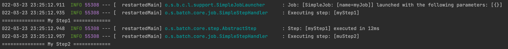
    

<br>

# 📌 도메인의 이해

## 🧐 Job
Job Configuration에 의해 생성되는 객체 단위로, 배치 계층 구조에서 가장 상위에 있는 개념이며 하나의 배치작업 자체에 해당한다.(최상위 인터페이스)    
배치 작업을 어떻게 구성하고 실행할지를 설정하고 명세해 놓은 객체로 여러 step을 포함하는 컨테이너 로서의 역할을 한다. (1개 이상의 Step)

- ### 👆 구현체 (AbstractJab을 구현)
  ```
  - name : Job 이름
  - restartable: 재시작 여부 기본값 true
  - JobRepository: 메타데이더 저장소
  - JobExecutionListener: Job 이벤트 리스너
  - JobParametersIncrementer: JobParameter 증가기
  - JobParametersValidator: JobParameter 검증기
  - SimpleStepHandler: Step을 실행하는 핸들러.
  ```  

  - SimpleJob
    > - 순차적으로 Step을 실행시키는 Job으로, 표준 기능을 가지고 있다.(steps를 가지고 있음)
  - FlowJob
    > - 특정 조건과 흐름에 따라 Step을 구성하는 Job으로, Flow 객체를 실행시켜 작업을 진행한다.
    
  JobLauncher의 run(job, jobParameters) 메서드에서 job을 받아 실행시키게 되는데, job.execute(execution)로 step을 하나하나 실행시킨다.   
  구현체인 SimpleJobLauncher 코드를 보면 jobRepository에서 해당 잡의 마지막 Execution을 가져와 상태를 확인한 후 새로운 JobExecution을 생성하고,생성된 JobExecution으로 Job을 실행한다.
  Job의 execute(AbstractJob 의) 에서는 구현체의 doExecute()를 호출하고, 해당 메서드에서 handleStep(step, jobExecution)을 실행시킨다. 
  
  handleStep 에서도 마찬가지로 AbstractStep 의 execute 를 호출하고, 구현체의 doExecute가 호출된다.   

## 🧐 JobInstance
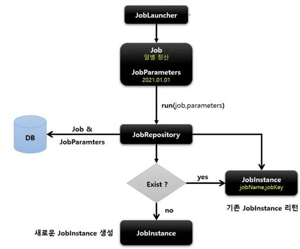

Job이 실행될 때 생성되는 논리적 실행 단위 객체로 고유하게 식별 가능한 작업 실행을 나타낸다.   
메타데이터를 데이터베이스(BATCH_JOB_INSTANCE)에 저장하기 위해 생성되는 인스턴스이다.

처음 시작하는 Job + JobParameter의 구성일 경우 새로운 JobInstance를 생성하고, 이전과 동일한 구성이라면 이미 존재하는 JobInstance를 리턴한다.   
(동일한 구성으로 실행할 수 없어 예외가 발생하고 Job의 실행을 중단한다 ) `A job instance already exists and is complete for parameters={ ... }`    
실행된 파라미터는 BATCH_JOB_EXECUTION_PARAMS에서 확인할 수 있으며 내부적으로는 job_name + params_key 의 해시값을 가지고 인스턴스 객체를 식별한다. 

## 🧐 JobParameter
Job을 실행할 때 함께 사용되는 파라미터를 가진 도메인 객체로, 하나의 JobInstance를 구분하기 위한 용도로 사용된다.
- JobParameters: `LinkedHashMap<String, Parameter>`를 멤버변수로 가지는 Wrapper 클래스.
- JobParameter: `Object parameter`, `ParameterType parameterType`, `boolean identifying`
- ParameterType: `String`, `Date`, `Long`, `Double`

- #### JobParameter의 생성과 바인딩
  - 어플리케이션 실행시 옵션으로 주입.
    - `Java -jar batch.jar name=user1 seq(long)=2L date(date)=2022/03/28 weight(double)=70.5`
  - 코드에서 생성
    - `JobParameterBuilder`, `DefaultJobParametersConverter`
      ```java
      JobParameters jobParameters = new JobParametersBuilder()
      .addString("name", "kim2")
      .addLong("seq", 1L)
      .addDate("data", new Date())
      .addDouble("weight", 70.5)
      .toJobParameters();
      ```
  - SpEL 이용
    - @Value("#{jobParameter[requestDate]}")
  
- #### JobParameter 꺼내기
    ```java
    // StepContribution에서 꺼내기
    JobParameters jobParameters = contribution.getStepExecution().getJobExecution().getJobParameters();
    jobParameters.getParameters() // Map<String, parameter>
    jobParameters.getString("key");
    jobParameters.getDate("key");
    jobParameters.getLong("key");
    jobParameters.getDouble("key");
        
    // ChunkContext 에서 꺼내기
    Map<String, Object> chunkJobParameters = chunkContext.getStepContext().getJobParameters();
    ```
  

## 🧐 JobExecution
JobInstance에 대한 한번의 시도를 의미하는 객체로, 실행 중에 발생한 정보들을 저장하고 있는 객체이다.
  - 시작 시간, 종료시간, 상태(시작?, 완료?, 실패?), 종료상태

JobExecution의 실행 결과가 `COMPLETED` 이면 인스턴스의 실행이 완료된 것으로 간주해서 재 실행할 수 없다.    
`FAILED`라면, 실행이 완료되지 않은 것이므로 재실행이 가능하다.(JobParameter가 같더라도) 즉, 실행 경과가 `COMPLETED`가 될 때까지 실행이 가능하다.    
(한 Instance 내에서 여러번의 시도가 발생할 수 있음, JobInstance와 N:1)

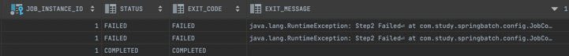

동일한 Job Instance에 대해 성곻할 때까지 Execution이 생성됨을 확인할 수 있다.
  
  
## 🧐 Step
Batch Job을 구성하는 독립적인 하나의 단계로, 실제 배치럴 처리하는 모든 정보를 가지고 있는 도메인 객체이다.      
배치작업을 어떻게 구성하고 실행할 것인지 세부작업을 Task 기반으로 설정하고 명세해 놓은 객체.

- ### 👆 필드
  - name
  - startLimit: 실행 제한 횟수.
  - allowStartIfComplete: 완료 후 재실행 가능여부.
  - stepExecutionListener: 이벤트 리스너.
  - jobRepository: 메타데이터 저장.

- ### 👆 구현체
  - TaskletStep: 가장 기본적인 구현체, Taklet 타입의 구현체를 제어한다.
  - PartitionStep: 멀티 스레드 방식으로 스텝을 여러개로 분리 실행한다.
  - JobStep: Step 내에서 Job을 실행한다.( Job -> Step -> Job .. )
  - FlowStep: Step 내에서 Flow를 실행하도록 한다.
  
Step을 실행시키는 execute(StepExecution)가 있고, StepExecution에는 실행 결과의 상태가 저장된다.    

- ### 👆 API
  - Tasklet 직접 생성
    ```java
    stepBuilderFactory.get("myStep1")
             .tasklet(myTasklet())
             .build();
    ```
  - ChunkOrientedTasklet
    ```java
    stepBuilderFactory.get("myStep3")
            .<String, String>chunk(100) // <input, output>
            .reader(reader())
            .processor(processor())
            .writer(writer())
            .build();
    ``` 
  - JobStep
    ```java
    stepBuilderFactory.get("jobStep")
            .job(myJob())
            .launcher(jobLauncher)
            .parametersExtractor(jobParametersExtractor())2
            .build();
    ```
  - FlowStep
    ```java
    stepBuilderFactory.get("jobStep")
            .flow(myFlow())
            .build();
    ```

## 🧐 StepExecution
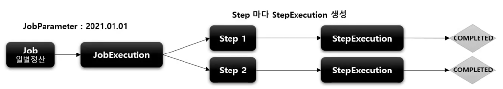
- Step에 대한 한번의 시도를 의미하는 객체로 실행중 발생한 정보들을 저장하고 있는 객체. (시작,종료 시간, 상태, commit count, rollback count ...)    
- Job이 재시작 되더라도 이미 성공적으로 완료된 Step은 skip 하고, 실패했던 Step만 실행된다.(allowStartIfComplete 로 설정 가능.)   
- 모든 StepExecution이 성공해야 JobExecution도 성공으로 끝난다.

## 🧐 StepContribution
- 청크 프로세스의 변경 사항을 저장해뒀다가 StepExecution의 상태를 업데이트 하는 도메인 객체이다.
- 청크 커밋 직전에 StepExecution의 apply()를 호출하여 상태를 업데이트 한다.
- 사용자 정의 ExitStatus를 지정할 수 있다.

- ### 👆 필드
  - stepExecution
  - read, write, filter(ItemProcessor에 의해 필터링된) count
  - parent(StepExecution), read, write, process SkipCount
  - ExitStatus
  
  
  TaskletStep -> StepExecution -> StepContribution 순으로 생성되고,   
  chunkOrientedTasklet과 같은 구현체에서 실행된 ItemReader, Processor, Writer 의 상태들이 StepContribution에 저장된다.    
  그리고, 최종적으로 커밋되기 전에 StepExecution에 저장해뒀던 상태를 업데이트 한다.


## 🧐 ExecutionContext
Step, Job Execution 객체의 상태를 저장하는 공유 객체로 key:value 쌍으로 된 컬렉션이며 DB에 직렬화 한 값으로 저장되게 된다.

- StepExecution 의 값은 Step 간 공유 불가능.
- JobExecution 의 값은 Job 간 공유는 안되지만, Job의 Step간 공유는 가능하다.(필요한 정보를 저장해뒀다 꺼내쓰기에 유용할 것 같다)
  > Job 재시작시 이미 처리한 데이터를 Skip하고 수행할 때 해당 상태 정보를 활용한다. 

- ExecutionContext 가져오기.
  ```java
  ExecutionContext jobExecutionContext = contribution.getStepExecution().getJobExecution().getExecutionContext();
  ExecutionContext stepExecutionContext = chunkContext.getStepContext().getStepExecution().getExecutionContext();
  ```
  ChunkContext, Contribution 객체 둘다에서 가져오는 것이 가능하다.    
  get, put 메서드는 ExecutionContext의 Map<String,Object> 에서 값을 넣고, 가져오는 메서드이다. 커밋 시점에 DB에 데이터를 저장한다.    
  JobInstance 가 동일하고, 이전 실행이 COMPLETED 상태가 아니라면 이전까지의 ExecutionContext에 저장된 값을 불러온 후, 나머지 Step을 다시 실행한다.

- getJob(Step)ExecutionContext?
  ```java
  Map<String, Object> jobExecutionContext = chunkContext.getStepContext().getJobExecutionContext();
  Map<String, Object> stepExecutionContext = chunkContext.getStepContext().getStepExecutionContext();
  ```
상기의 getJobExecutionContext, getStepExecutionContext는 ExecutionContext를 가져오는 것이 아닌 저장되어 있는 값을 복사해 돌려주는 메서드이다.   
실제로 메서드를 살펴보았을 때 Map을 만들어 내용을 복사하고 이를 unmodifiableMap 으로 돌려줌을 확인할 수 있었다.


## 🧐 JobRepository
배치 작업 중의 정보를 저장하는 저장소로, 배치 작업의 수행과 관련된 모든 메타데이터를 저장한다.   
JobLauncher, Job, Step 구현체 내부에서 CRUD 기능을 처리한다.   

- ### 👆 주요 메서드
  - isJobInstanceExist(jobName, jobParameters)
  - createJobExecution(jobName, jobParameters)
  - getLastJobExecution(jobName, jobParameters)
  - getLastStepExecution(jobInstance, stepName)
  - update(jobExecution): Job의 실행 정보 업데이트
  - update(stepExecution)
  - add(stepExecution): 실행 중인 Step의 새로운 stepExecution 저장.
  - updateExecutionContext(jobExecution)
  - updateExecutionContext(stepExecution)
  
@EnableBatchProcessing 애노테이션을 선언하면 JobRepository가 자동으로 빈으로 등록된다.    
BatchConfigurer 인터페이스나 구현이다 BasicBatchConfigurer를 상속하여 jobRepository를 커스텀 하는 것이 가능하다.

- ### JDBC
  JDBC 방식으로 설정하기 위해서는 `JobRepositoryFactoryBean`을 사용하는데, AOP 방식으로 트랜잭션 처리가 이루어진다. 격리 레벨은 기본적으로`SERIALIZEBLE`이고, 다른 레벨로 변경 가능하다.      
  테이블의 기본 prefix는 "BATCH_"이며 변경 가능하다.
  ```java
  @Configuration
  public class CustomBatchConfigurer extends BasicBatchConfigurer {
  
      private final DataSource dataSource;
  
      protected CustomBatchConfigurer(BatchProperties properties, DataSource dataSource,
          TransactionManagerCustomizers transactionManagerCustomizers) {
          super(properties, dataSource, transactionManagerCustomizers);
          this.dataSource = dataSource;
      }
  
      @Override
      protected JobRepository createJobRepository() throws Exception {
          JobRepositoryFactoryBean factoryBean = new JobRepositoryFactoryBean();
          factoryBean.setDataSource(dataSource); // 설정하지 않아도 기본적으로 설정 됨.
          factoryBean.setTransactionManager(getTransactionManager()); // BasicBatchConfigurer에 있는 메서드
          factoryBean.setIsolationLevelForCreate("ISOLATION_READ_COMMITTED");
          factoryBean.setTablePrefix("LOG_BATCH");
  
          return factoryBean.getObject();
      }
  }
  ```

- ### In Memory
  DB의 저장까지는 필요가 없다면 `MapJobRepositoryFactoryBean`을 사용하여 인메모리로 사용할 수도 있다.

- ### JobRepository 에서 값 조회
  ```java
  JobExecution lastJobExecution = jobRepository.getLastJobExecution(jobName, jobParameters);
  if(lastJobExecution != null) {
      lastJobExecution.getStepExecutions()
          .forEach(s -> System.out.println(s.getExitStatus()));
  }
  ```
  
## 🧐 JobLauncher
Job과 파라미터를 인자로 받으며 배치 작업을 실행시킨 후 클라이언트에게 JobExecution을 반환한다.   
스프링 부트 배치가 구동되면 자동으로 빈이 생성되기 때문에 따로 만들어주지 않아도 된다.

ApplicationRunner를 구현한 JobLauncherApplicationRunner가 JobLauncher를 자동으로 실행시키게 된다.    
동기적(SyncTaskExecutor), 비동기적(SimpleAsyncExecutor) 실행이 가능하며 기본값은 동기적 실행이다.       
두 방식의 차이는 언제 JobExecution을 클라이언트에게 반환하느냐이다. 동기적 방식은 배치 처리가 최종적으로 완료되면 클라이언트에게 반환하지만,      
비동기적 실행에서는 JobExecution을 획득하면 바로 클라이언트에게 반환한다.(ExitStatus.UNKNOWN)   
동기적 실행은 스케줄러에 의한 배치처리와 같이 배치처리시간이 길어도 상관 없는 경우에 적합하고, 비 동기적 실행은 HTTP요청에 의한 배치 처리에 적합하다.


- 비 동기적 실행
```java

@RequiredArgsConstructor
@RestController
public class JobLauncherController {

private final Job job;
private final BasicBatchConfigurer basicBatchConfigurer;


@PostMapping("/batch")
public String launch(@RequestBody Member member)
    throws JobInstanceAlreadyCompleteException, JobExecutionAlreadyRunningException, JobParametersInvalidException, JobRestartException {

    SimpleJobLauncher jobLauncher = (SimpleJobLauncher) basicBatchConfigurer.getJobLauncher();
    jobLauncher.setTaskExecutor(new SimpleAsyncTaskExecutor());

    jobLauncher.run(job, new JobParametersBuilder()
        .addString("id", member.getId())
        .addDate("date", new Date())
        .toJobParameters());

    return "batch completed";
}
```
setTaskExecutor는 JobLauncher의 메서드가 아닌 SimpleJobLauncher의 메서드이기 때문에 빈으로 주입받아 사용할 수 없다.   
JobLauncher 인터페이스로 주입 받더라도 프록시 객체이기 떄문에 SimpleJobLauncher 로의 강제 형변환 또한 불가능하다.    
때문에 BasicBatchConfigurer에서 프록시가 아닌 실제 객체를 가져와 타입 캐스팅을 해준다.


# 📌 배치 설정

### 👆 JobLauncherApplicationRunner
  - ApplicationRunner의 구현체로 BatchAutoConfifuration에서 생성된다.
  - 기본적으로 빈으로 등록된 모든 job을 실행시킨다.(특정 job만 실행하도록 설정도 가능.)

### 👆 BatchProperties
  - 환경 설정 클래스로 job 이름, 스키마 초기화 설정, 테이블 prefix 등 설정 가능.
  - properties | yml 파일에 설정 가능하다.
    - `batch.job.names`, `batch.initialize-schema: never | always | embedded`, `batch.tablePrefix: ` ... 

### 👆 Job 실행 옵션
  - `Spring.batch.jhob.names: ${job.name:NONE}` 지정한 Job만 실행하도록 한다.
    - NONE는 임의의 문자.
    - `--job.name=name1, name2`
    - properties를 설정해두고 옵션을 주지 않으면 아무 Job도 실행되지 않는다.
<br><br>
      
# 📌 Job의 실행

## 🧐 JobBuilderFactory
Job을 쉽게 생성하고 설정할 수 있도록 util 성격의 빌더 클래스인 `JobBuilderFactory`를 제공한다.    
JobBuilderFactory 에서는 JobBuilder(SimpleJobBuilder, FlowBuilder)를 생성하여 Job의 생성을 위임한다.    

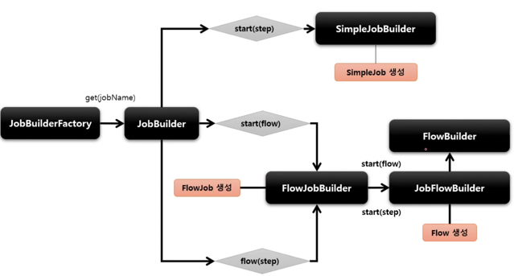
- #### SimpleJob의 생성    
  JobBuilderFactory를 통해서 JobBuilder를 생성하고 `start(step)` 메서드를 호출하면 SimpleJobBuilder가 생성되고 최종적으로 `SimpleJob`이 생성된다.    

- #### FlowJob, Flow의 생성
  JobBuilder에서 `start(flow)` 또는 `flow(step)`을 실행하면 FlowJobBuilder를 생성하고, 최종적으로 `FlowJob`이 생성된다.    
  FlowJobBuilder 에서는 또 내부적으로 JobFlowBuilder -> FlowBuilder를 생성하고, 여기서 `Flow`를 생성하게 된다.

```java
public JobBuilder get(String name) {
    JobBuilder builder = new JobBuilder(name).repository(jobRepository);
    return builder;
}
```
SimpleJobBuilder와 FlowJobBuilder는 JobBuilderHelper 클래스를 상속하며, 해당 클래스들에서 만들어진 Job들에 SimpleJobRepository가 전달되어
CRUD를 통해 메타정보들을 기록하게 된다.


## 🧐 SimpleJob API
- ### .start(), next()
  - start() 에서 처음 실행할 step을 설정하고 SImpleJobBuilder를 생성, 반환한다, 후 next() 에서는 순차적으로 실행할 step을 등록한다.
- ### .incrementer(JobParametersIncrementer): 파라미터의 값을 자동으로 증가해주는 설정.
  - JobParameters의 값을 증가시켜 다음에 사용될 값 객체를 반환한다.
      - Long 값을 넣어주고, 실행할때 마다 해당 값을 증가시킨다.
      - 기존의 파라미터 값에는 변화가 없지만 넣어준 Long 값이 변하기 떄문에 여러번 실행 가능하다.
  - RunIdIncrementer 구현체를 지원하며, 필요하다면 인터페이스를 직접 구현하여 정의할 수 있다.
    ```java
    @Override
    public JobParameters getNext(JobParameters parameters) {
        String date = new SimpleDateFormat("yyyyMMdd-hhmmss").format(new Date());
        return new JobParametersBuilder(parameters).addString("run.date", date).toJobParameters();
    }
    ```
    - 💡 incrementer.getNext()가 적용된 후 ApplicationRunner들을 실행하기 때문에 Runner 클래스에서 jobParameters를 넣어준다면   
      incrementer이 적용되지 않을 수 있다.(덮어씌워 짐)
      
- ### .preventRestart(): Job의 재시작 가능 여부 설정.
  - restartable 의 default 값은 true, .preventRestart() 하면 false로 변경됨.
  - 해당 옵션을 false로 주게 되면 job의 실행이 실패해도 재시작이 불가능하다. (JobRestartException 발생)
  - SimpleJobLaunch에서 lastJobExecution을 가져온 뒤 조건을 확인한다.
- ### .validator(jobParameterValidator): 파라미터 구성 검증.
  - DefaultJobParametersValidator 구현체를 지원한다.
    - `public DefaultJobParametersValidator(String[] requiredKeys, String[] optionalKeys)`
    - 필수키가 없거나, 필수키, 옵션키 둘다에 없는 파라미터가 들어오면 예외가 발생한다.
  - 커스텀한 제약 조건을 생성하고 싶다면 인터페이스를 직접 구현할 수도 있다.
    ```java
    @Override
    public void validate(JobParameters parameters) throws JobParametersInvalidException {
      if(parameters.getString("name") == null) {
          throw  new JobParametersInvalidException("name parameters is null");
      }
    }
    ```
- #### .listener(JobExecutionListener): Job의 실행 전, 후에 콜백을 설정.
  ```java
  @Component
  public class JobListener implements JobExecutionListener {
  
      @Override
      public void beforeJob(JobExecution jobExecution) {
      }
  
      @Override
      public void afterJob(JobExecution jobExecution) {
      }
  }
  ```

## 🧐 SimpleJob 아키텍처
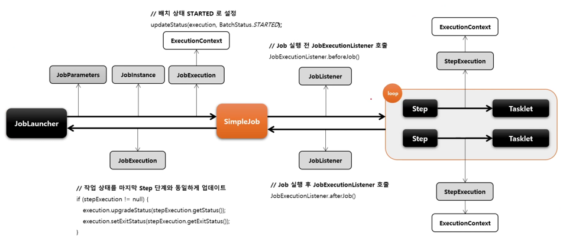
1. JobLauncher 에서 Job, JobParameter를 가지고 JobInstance를 생성
2. JobExecution을 생성하고, ExecutionContext 할당.
3. JobExecutionListener.beforeJob()
4. 각 Step이 실행되며 StepExecution,ExecutionContext 생성
5. StepExecution에 최종 상태 업데이트.
6. JobListener.afterJob() 호출
7. JobExecution에 최종 상태 업데이트.(Status, ExitStatus)
8. JobLauncher에 반환.


# 📌 Step의 실행

## 🧐 StepBuilderFactory
StepBuilder를 생성하는 팩토리 클래스. 구조는 JobBuilderFactory와 유사하다.

- ### 👆 StepBuilder 구현체
  - #### TaskletStepBuilder
    - API: tasklet(tasklet())
  - #### SimpleStepBuilder
    - TaskletStepBuilder와 마찬가지로 TaskletStep을 생성하지만, 내부적으로 청크기반의 작업을 처리하는 ChunkOrientedTasklet을 생성한다.
    - API: chunk(chunkSize) | chunk(completionPolicy)
  - #### PartitionStepBuilder
    - PartitionStep을 생성하며 멀티 스레드 방식으로 Job을 실행한다.
    - API: partitioner(stepName, partitioner) | partitioner(step) 
  - #### JobStepBuilder
    - JobStep을 생성하고, Step안에서 Job을 실행한다.
    - API: job(job)
  - #### FlowStepBuilder
    - FlowStep을 생성하고, Step안에서 Flow를 실행한다.
    - API: flow(flow)

  TaskletStepBuilder와 SimpleStepBuilder는 StepBuilderHelper를 상속받은 AbstractTaskletStepBuilder를 상속받고,   
  나머지 빌더들은 StepBuilderHelper를 직접 상속 받는다.
  
  
## 🧐 TaskletStep
Tasklet은 스프링 배치에서 제공하는 Step의 구현체로 Tasklet을 실행시킨다.    
Task 기반과 Chunk 기반이 있으며, RepeatTEmplate를 사용하여 Tasklet 구문을 트랜잭션 내에서 반복 실행한다.


- #### Task 기반
  - 단일 작업으로 처리되는 것이 더 나은 경우 사용한다.
  - Tasklet 구현체를 생성하여 사용한다.
    ```java
    @Bean
    public Step myStep() {
        return stepBuilderFactory.get("myStep")
        .tasklet(new Tasklet() {
            @Override
            public RepeatStatus execute(StepContribution contribution, ChunkContext chunkContext) throws Exception {
                return RepeatStatus.FINISHED;
            }
        })
        .build();
        }
    ```

- #### chunk 기반
  - n개의 조각으로 나누어 실행한다, 대량 처리에 효과적으로 대처할 수 있도록 설계 되었다.
  - ChunkOrientedTasklet 구현체가 제공되며, ItemReader, ItemProcessor, ItemWriter을 사용한다.
    ```java
    @Bean
    public Step chunkStep() {
        return stepBuilderFactory.get("chunkStep")
            .<String, String>chunk(3)
            .reader(new ItemReader<String>() {
                @Override
                public String read()
                    throws Exception, UnexpectedInputException, ParseException, NonTransientResourceException {
                    if(!strings.isEmpty()) {
                        return strings.remove(0);
                    }
                    return null;
                }
            })
            .processor(new ItemProcessor<String, String>() {
                @Override
                public String process(String item) throws Exception {
                    return item.toUpperCase(Locale.ROOT);
                }
            })
            .writer(new ItemWriter<String>() {
                @Override
                public void write(List<? extends String> items) throws Exception {
                    items.forEach(System.out::println);
                }
            })
            .build();
    }
    ```

- ### 👆 API
  - #### .tasklet(Tasklet), chunk(int size)
    - 반복적으로 수행되는 Tasklet 타입의 클래스를 설정한다.
    - 반환 값에 따라 반복 여부는 변경 가능, `RepeatStatus.FINISHED`, `RepeatStatus.CONTINUABLE`
    - 한개만 설정이 가능하고, 여러개 설정시 마지막 설정만 실행된다.
    - 익명 또는 Tasklet을 구현한다.
    - execute()는 StepContribution, ChunkContext를 인자로 받는다.
  - #### .startLimit(int)
    - Step의 최대 실행 횟수 설정, 기본값은 INTEGER.MAX_VALUE, 초과하면 예외가 발생한다.
    - Step 마다 개별로 설정한다.
    - 동일한 JobInstance에서 실행되는 동일한 Step에 대한 실행 횟수 제한이다. 
  - #### .allowStartIfComplete(true)
    - Job을 재시작할 때 Step의 이전 실행의 성공 여부와 상관 없이 항상 Step을 실행하기 위한 설정이다.
    - Step 1~4중에 1,2까지 성공하고 실패하여 Job을 재실행할 수 있을 때 기본적으로는 3부터 다시 시작한다.    
      하지만 1,2의 작업이 무조건 선행되어야 하는 Flow라면, 해당 옵션을 활성화하여 1부터 시작하도록 변경할 수 있다.
  - #### listener(StepExecutionListener)
    - Step의 실행 전 후의 콜백.
  

## 🧐 TaskletStep 아키텍쳐
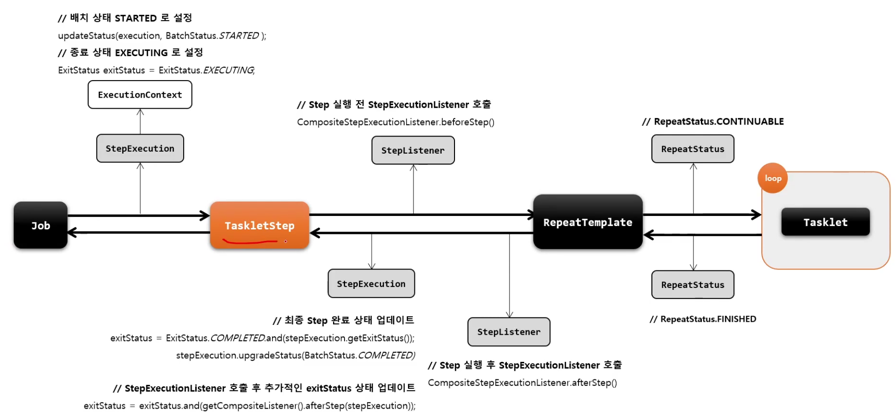

1. ExecutionContext를 가지는 StepExecution이 생성된다.
2. TaskletStep에서 StepExecution을 받아 Step을 실행시킨다.
3. StepExecutionListener.beforeStep()을 호출한다.
4. RepeatTemplate 에서 Tasklet을 반복 실행한다.    
   loop 에서는 RepeatStatus를 확인하여 FINISHED 라면 루프를 빠져나오고 CONTINUABLE 이라면 다시 RepeatTemplate에서 Tasklet을 반복시킨다.
5. StepExecution의 Status를 업데이트 한다.
6. StepExecutionListener.afterStep()을 호출한다.
7. StepExecution의 ExitStatus를 업데이트 한다.

## 🧐 JobStep
또 다른 Job을 실행시키는 Step으로, 시스템을 작은 모듈로 쪼개 Job의 흐름을 나누고자 할 때 사용한다.

- ### 👆 API
  - #### .job(Job)
    - 실행할 Job을 설정한다.  
    - 추가한 Job도 Bean 으로 등록하면 자동으로 실행되어 2번 실행될 수 있으므로 설정이 필요하다. 
  - #### .launcher(JobLauncher)
    - Job을 실행할 JobLauncher를 설정한다.
    - null을 넘겨 주면 SimpleJobLauncher로 실행한다.
      ```java
      // JobBuilder
      if (jobLauncher == null){
          SimpleJobLauncher jobLauncher = new SimpleJobLauncher();
          ...
      }
      ```
  - #### .parametersExtractor(JobParametersExtractor)
    - Step의 ExecutionContext에서 값을 추출해 JobParameters로 변환한다.
    - 제공되는 DefaultJobParametersExtractor나 `JobParametersExtractor`를 구현한 구현체를 사용한다.
    - 부모의 JobParameter들은 기본적으로 추가되고, setKeys() 를 이용해 StepExecution의 ExecutionContext에서 값을 찾아 파라미터에 추가할 수 있다.
      ```java
      // 해당 Step의 ExecutionContext에 값 추가.
      .listener(new StepExecutionListener() {
          @Override
          public void beforeStep(StepExecution stepExecution) {
              stepExecution.getExecutionContext().put("date", new Date());
          }
        
          @Override
          public ExitStatus afterStep(StepExecution stepExecution) {
              return null;
          }
      })
      ```  
      ```java
      private JobParametersExtractor jobParametersExtractor() {
          DefaultJobParametersExtractor extractor = new DefaultJobParametersExtractor();
          extractor.setKeys(new String[] {"date"});
  
          return extractor;
      }
      ```
      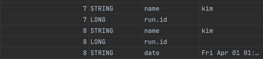
      
      부모 Job(7), jobStep의 Job(8)
  

# 📌 Flow

## 🧐 FlowJob
Step의 순차적 실행이 아니라 상태에 따라 흐름을 전환하도록 구성할 수 있다.    
 
  - Step이 실패하더라도 Job은 실패하지 않게 할 수 있다.
  - 다음에 실행할 step을 구분하여 실행할 수 있다.
    - ex) 성공시 Step2, 실패시 Step3 ...
  - 특정 Step을 실행되지 않게 구성할 수 있다.

`JobBuilderFactory` ▶ `JobBuilder` ▶ `JobFlowBuilder` ▶ `FlowBuilder` ▶ `FlowJob`

- ### 👆 API
  
  - #### .start(Step), .next(Step)
  - #### .from(Step)
    - 이전에 정의한 Step의 flow를 추가적으로 정의한다.(Transition을 새롭게 정의.)
    
  - #### .on(String pattern)
    - Step의 ExitStatus를 캐치하고 패턴과 매칭되면, `TransitionBuilder` 를 반환한다.
    - Step의 ExitStatus가 on()의 어떤 Pattern 과도 매칭이 되지 않는다면 예외가 발생하고 Job은 실패하게 된다.
      > -  `*`: 와일드 카드, 모든 ExitStatus와 매칭(C*, F*, *), `?`: 정확히 1개의 문자와 매칭 (C?T)
      > - 와일드 카드는 `else` 처럼 사용될 수 있다.  step1에 on("COMPLETED") to(step2())를 실행한다고 지정해두고,    
         from(step1()).on("*") 사용하면 COMPLETED를 제외한 모든 패턴을 뜻하게 된다.
    - TransitionBuilder는 아래의 API를 가진다.
    - #### .to(Step | Flow | JobExecutionDecider)
      - 다음으로 실행할 것을 지정한다.
    - #### .stop(), .fail(), .end(), .stopAndRestart()
      - flow를 중지, 실패, 종료하도록 한다.
      - FlowExecutionStatus가 각각 `STOPPED`, `FAILED`, `COMPLETED` 로 종료된다.
      - stopAndRestart() 는 현재까지의 Step은 COMPLETED로, 이후는 실행하지 않고 STOPPED 상태로 Job을 종료한다.(이후 재시작시 COMPLETED는 Skip)
      - 실제 Step이 FAILED로 종료되었더라도 Job의 BatchStatus를 COMLETED로 종료하도록 할 수 있다.(재시작 불가능 해짐)
    
  - #### end()
    - FlowBuilder 를 종료하고 SimpleFlow 객체를 생성한다.
    - FlowJobBuilder에서는 flowJob을 생성하고 Simpleflow를 실행시킨다.
  
`start, next, from` 은 flow를 정의하고, `on, to, stop, fail, end, stopAndRestart`는 조건에 따라 흐름을 전환시킨다.   
on()을 호출하면 TransitionBuilder가 생성되고, `to, stop, fail, end, stopAndRestart`를 설정할 수 있다.
```java
@Bean
public Job flowJob() {
    return jobBuilderFactory.get("flowJob")
        .start(myStep1())
        .on("COMPLETED").to(myStep3())
        .from(myStep1())
        .on("FAILED").to(myStep2())
        .end()
        .build();
}
```
FlowJob을 다음과 같이 구성하면 myStep1이 성공하면 myStep3로, 실패하면 myStep2를 실행한다는 흐름이 만들어진다.    

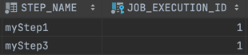   
DB에 저장된 메타 데이터를 확인하면 myStep 1과 3이 실행된 것을 확인 할 수 있다.

이번에는 myStep1 에서 예외를 발생시켜 일부러 실패한 후 메타데이터 값을 살펴보겠다.     
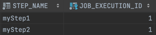        
on의 `FAILED` 패턴과 매칭되어 myStep2가 실행된 것을 확인할 수 있다.   
한 가지 더 특이 사항이 있다면, FlowJob에서는 Step의 실패가 Job의 실패로 연결되지 않는다는 것이다. 위의 상황에서 JobExecution을 확인해 보았다.     
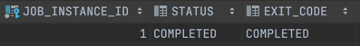    
분명 myStep1을 실패시켰지만 Job은 성공적으로 끝난 것을 확인할 수 있다.
모든 상황에서 이런 것은 아니고, 실패했을 경우 어떤 것을 하는지 정의가 되어있을 때만 해당한다.    
실제로 COMPLETED의 조건만을 주고 Step을 실패시켰을 때에는 Job 또한 실패했다.


## 🧐 Transition
Flow 내 Step의 조건부 전화을 정의한다. on()을 호출하면 TransitionBuilde 가 반환되고, 해당 객체의 API를 호출하여 Transition Flow를 구성할 수 있다.

- ### 👆 배치 상태
  - #### BatchStatus
    Job, Step의 종료 후 최종 결과 상태로, SimpleJob 에서는 가장 마지막에 실행 된 Step의 상태가되고,    
    FlowJob 에서는 마지막 Flow의 FlowExecutionStatus 값이 된다.
    > COMPLETE, STARTING, STARTED, STOPPED, FAILED, ABANDONED(실패, 그러나 재시작시 건너 뛰어야하는 단계), UNKOWN
  - #### ExitStatus
    어떤 상태로 종료되었는지를 의미한다. 기본적으로는 BatchStatus와 동일한 값으로 설정되지만, 임의로 변경할 수 있다.(contribution.setExitStatus()    
    SimpleJob, FlowJob에서의 값의 설정은 BatchStatus와 같다.
    > COMPLETED, FAILED, STOPPED, EXECUTING, UNKNOWN
  - #### FlowExecutionStatus
    FlowExecution의 속성으로 FLow 실행 후 결과 상태를 가지고 있다.    
    Flow 내의 Step의 ExitStatus 값을 FlowExecutionStatus 값으로 저장하며 FlowJob의 배치 결과 상태에 관여한다.(Step에는 영향을 주지 않는다)
    > COMPLETED, STOPPED, FAILED, UNKNOWN


## 🧐 사용자 정의 ExitStatus
기본적으로 정의되어 있는 ExitStatus 이외의 exitCode를 새롭게 정의 할 수 있다.    
StepExecutionListener의 `afterStep()` 에서 생성한 후에 만들어진 ExitStatus를 반환할 수 있다.
```java
new ExitStatus("CUSTOM_STATUS")
```

afterStep()) 에서 새로운 ExitStatus를 반환하면 TaskletStep의 exitStatus를 세팅하는 부분에서 이를 반영한다.    
원래의 ExitStatus를 설정한 후 afterStep()을 호출하여 다시 ExitStatus를 가져오기 때문에 덮어 씌워진다.


```java
@Bean
public Flow flowA() {
    FlowBuilder<Flow> flowBuilder = new FlowBuilder<>("flowA");
    
    return flowBuilder
        .start(myStep1())
        .on("COMPLETED")
        .to(myStep2())
        .on("PASS")
        .stop()
        .next(myStep3())
        .end();
}
```

```java
@Bean
public Step myStep2() {
    return stepBuilderFactory.get("myStep2")
        .tasklet(new MyTasklet("myStep2"))
        .listener(new PasscheckingListener())
        .build();
}
```

```java
public class PasscheckingListener implements StepExecutionListener {

    ...
    
    @Override
    public ExitStatus afterStep(StepExecution stepExecution) {
        ExitStatus exitCode = stepExecution.getExitStatus();

        if(!exitCode.getExitCode().equals(ExitStatus.FAILED.getExitCode())) {
            return new ExitStatus("PASS");
        }
        return exitCode;
    }
}
```


myStep2의 EXIT_CODE가 PASS로 변경되었다.

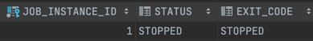

myStep1이 COMPLETED로 끝나 myStep2가 실행되고 마찬가지로 COMPLETED로 끝나기 때문에 afterStep() 에서 ExitStatus가 `PASS` 로 변경된다.   
`on("PASS")` 패턴에 매칭되어 `.stop()`이 호출되고, Job은 STOPPED 상태로 마치게 된다.


## 🧐 JobExecutionDecider
ExitStatus의 조작이나 StepEcecutionListener의 등록없이 Transition 처리를 위한 클래스로Step과 Transition의 역할을 명확하게 분리할 수 있게 해준다.

기존에는 Step의 ExitStatus가 JobExecutionStatus의 상태 값에 반영되고, 이 값이 JobFlow에 반영하는 것과 달
JobExecutionDecider에서 FlowExecutionStatus 상태값을 새롭게 생성해서 반환한다.

```java
@Bean
public Job job() {
    return jobBuilderFactory.get("job")
        .incrementer(new RunIdIncrementer())
        .start(firstStep())
        .next((decider()))
        .on("ODD").to(oddStep())
        .on("EVEN").to(evenStep())
        .end()
        .build();
}

@Bean
public JobExecutionDecider decider() {
    return new CustomDecider();
}
```

```java
public class CustomDecider implements JobExecutionDecider {

    private int count = 0;

    @Override
    public FlowExecutionStatus decide(JobExecution jobExecution, StepExecution stepExecution) {
        if (++count % 2 == 0) {
            return new FlowExecutionStatus("EVEN");
        }
        return new FlowExecutionStatus("ODD");
    }
}
```
이전에 API를 이용하여 ExitStatus 코드에 따라 flow를 진행하는 방식과 동일하게 동작한다. Job을 구성하는 상황에 따라 더 알맞다고 생각되는 방법을 선택하면 되겠다.


## 🧐 FlowJob 아키텍처
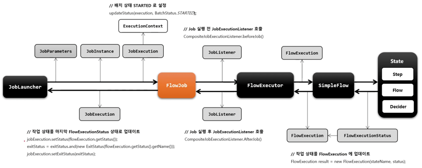

대부분은 SimpleJob과 동일하다.   
다른 점은 SimpleFlow 에서 State라는 속성을 가진다는 것과, 작업이 종료되었을 때 StepExecution의 상태를 반영하는 것이 아니라 `FlowExecutionStatus`   
의 상태로 업데이트 한다는 것이다.


## 🧐 SimpleFlow
Flow의 구현체로 Step, Flow, JobExecutionDecider을 담고 있는 State를 실행시키는 도메인 객체로, FlowBuilder를 통해 생성된다.    
Flow는 중첩될 수 있다

```java
@Bean
public Job flowJob() {
    return jobBuilderFactory.get("flowJob")
        .start(flowA()) // SimpleFlowA
        .end() // SimpleFlow 생성
        .build();
}
```
결과적으로 FlowJob ( SimpleFlow( SimpleFlowA ) )와 같은 형태가 된다.
- ### Flow
  - `getName()`
  - `getStatus(stateName)`
  - `FlowExecution start(flowExcecutor)` : Flow를 실행.
  - `resume(stateName, flowExecutor)` : 다음에 실행할 State를 구해 FlowExecutor 에게 실행을 위임한다.
  - `getStates()` : Flow가 가지고 있는 모든 State를 Collection 으로 반환.
  
- ### SimpleFlow implements Flow
  - `String name`
  - `State startState`: 가장 처음으로 시작할 State(StepState, FlowState, DecisionState, SplitState) 
  - `Map<String, Set<StateTransition>> transitionMap` : State 이름으로 매핑 State 별 Transition Set
  - `Map<String, State> stateMap`: 이름으로 매핑되어 있는 State Map
  - `List<StateTransition> stateTransitions` : State + Transition 정보를 가진 객체의 리스트.    
    StateTransition 은 현재 State 와(state) on()에 매칭되는 패턴(pattern), 다음 State(next) 의 속성으로 이루어져 있다.
  

- ### SimpleFlow 생성
  ```java
  @Bean
  public Flow flow() {
      FlowBuilder<Flow> flowBuilder = new FlowBuilder<>("flow");
      return flowBuilder
          .start(myStep1())
          .next(myStep())
          .end();
  }
  ```
  또는 flowBuilder.build()를 return 해도 된다. (end() 가 내부적으로는 build()를 호출하여 SimpleFlow 객체를 생성한다.)
  

## 🧐 SimpleFlow 아키텍처
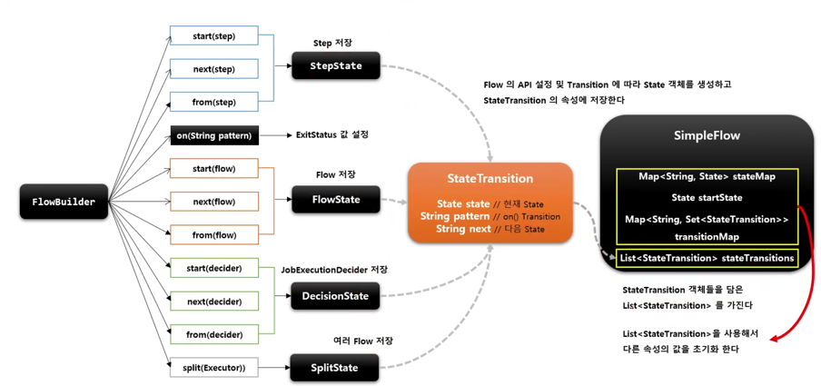

start(), next(), from() 전달되는 객체에 따라 State 객체를 생성하여 전달된 객체를 저장한다.     
이렇게 생성된 State는 SimpleFlow 에서 StateTransition 객체로 관리되며, 해당 객체를 토대로 SimpleFlow의 다른 속성들의 값을 설정하게 된다.

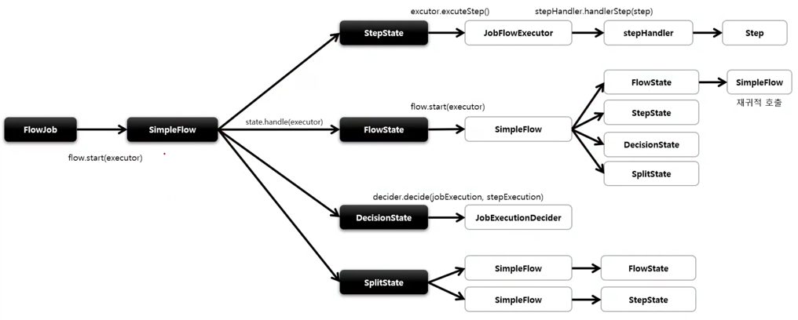

SimpleFlow가 `State` 를 실행시칸다.(StateTransition 을 참고하여 currentState를 실행한다. Map에 저장된 모든 State를 순회하며 실행.)    
`State` 에서는 Step, Flow, JobExecutionDecider 요소들을 저장하며,Flow를 구성하면 자동으로 State가 생성되며 Transition과 연동된다.   
handle() 메서드를 통해 실행 후 FlowExecutionStatus를 반환한다. 마지막 실행 상태가 FlowJob의 최종 상태가 된다.

- SimpleFlow는 또 SimpleFlow를 가질 수 있기 때문에 중첩되어 객체가 생성되며 실행된다.
- SplitState 는 여러개의 SimpleFlow를 가지고 병렬적으로 실행시킬 수 있다.

### SimpleFlow의 실행
  ```
  1. SimpleFlow의 start() 메서드를 호출하여 첫 State를 실행시킨다.   
  2. 그 이후 resume() 메서드 에서는 loop를 돌며 다음에 실행할 State가 있다면 실행시키고, null이거나 실행 불가능한 상태라면 종료한다.   
  3. nextState를 호출하여 StateMap에서 다음 State를 실행한다.
  ```
  
## 🧐 FlowStep
Step 내에 Flow를 가지고 있는 도메인 객체. FlowStep의 Status 들은 Flow의 최종 상태값에 따라 결정된다.    

`StepBuilderFactory` ▶ `StepBuilder` ▶ `FlowStepBuilder` ▶ `FlowStep`
```java
@Bean
public Step flowStep() {
    return stepBuilderFactory.get("flowStep")
        .flow(flowA()) // FlowStepBuilder 반환.
        .build(); // FlowStep 반환.
}
```

# 📌 @JobScope, @StepScope
@JobScope 와 @StepScope는 빈의 생성과 실행에 관여하며, 빈의 생성 시점을 조작한다.(구동시점 -> 빈의 실행 시점)       
두 Scope 애노테이션은 다음과 같이 정의되어 있다. `@Scope(value="job | step", proxyMode = ScopedProxyMode.TARGET_CLASS`     
정의에서 볼 수 있듯 해당 애노테이션을 사용하면 구동시점에는 프록시 객체로 생성되고, 실행 시점에 실제 빈을 호출하여 메서드를 실행한다.

- #### @Values 를 주입해서 빈의 실행 시점에 특정 값을 참조하는게 가능해진다.(Lazy Binding, 필드 또는 파라미터로 주입받는다)
  - `@Values("#{jobParameters[paramName]}")`, `@Values("#{jobExecutionContext[paramName]}")`, `@Values("#{stepExecutionContext[paramName]}")`
- #### 스프링의 Bean 은 기본적으로 Singleton 이기 때문에 스레드 세이프 하지 않은데, 해당 애노테이션들을 사용하면 각 스레드마다 스코프 빈이 할당되기 때문에 스레드 세이프하게 실행이 가능해진다.


- ### @JobScope
  - Step의 선언문에 정의
  - jobParameter, jobExecutionContext 값을 바인딩 할 수 있다.
  ```java
  @JobScope
  @Bean
  public Step myStep1(@Value("#{jobParameters['message']}") String message) {
      System.out.println("Parameter[message]: " + message);
      return stepBuilderFactory.get("myStep1")
          .tasklet(tasklet(null, null))
          .build();
  }
  ```
  런타임 시점에 값이 바인딩 되기 때문에 null을 넘겨주어 컴파일 에러를 방지해준다.
- ### @StepScope
  - Tasklet, Item Reader, Writer, Processor 선언문에 정의한다.
  - jobParameter, jobExecutionContext, stepExecutionContext 값을 바인딩 할 수 있다.
  ```java
  @Bean
  @StepScope
  public Tasklet tasklet(@Value("#{jobExecutionContext['name']}") String jobName,
      @Value("#{stepExecutionContext['name']}") String stepName) {
      return ((contribution, chunkContext) -> {
          System.out.println("tasklet has execute");
          System.out.println("jobName: " + jobName + ", " + "stepName: " + stepName);
          return RepeatStatus.FINISHED;
      });
  }
  ```
  job, stepExecutionContext의 값은 각 ExecutionListener에서 넣어줄 수 있다.

## 🧐 Scope 아키텍처
Proxy 객체의 실제 대상이 되는 Bean을 등록하고, 해제하는 역할을 하는 `JobScope`, `StepScope` 클래스가 존재한다.    
해당 클래스들은  실제 빈을 저장하고 있는 `JobContext`와 `StepContext`를 가지고 있다. (마치 Spring의 ApplicationContext와 같이)

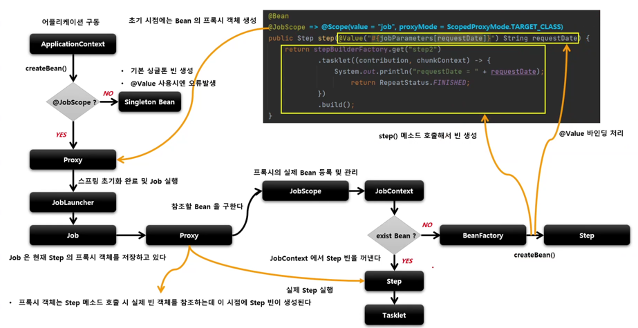

`어플리케이션 구동` ▶ `ApplicationContext에서 빈을 생성` ▶ `@JobScope, StepScope가 있는가?` ▶ `있으면 proxy, 없으면 Singleton Bean 생성`    
`스프링 초기와 완료, Job실행` ▶ `Job 에서 Proxy 호출` ▶ `proxy에서 실제 Step Bean 참조` ▶ `Step Bean 이 있다면 꺼내주고 없다면 beanFactory 에서 생성(@Value 바인딩도 이때)`    
▶`JobScope 클래스에서 실제 Bean을 JobContext에 등록, 관리`

# 📌 Chunk Process

## 🧐 Chunk?
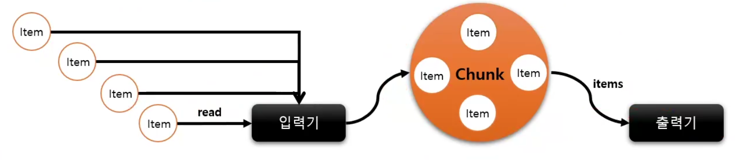

Chunk 란 여러개의 아이템을 묶은 덩어리 블록으로, 아이템을 입력받아 덩어리로 만든 후 Chunk 단위로 트랜잭션을 처리한다.   
일반적으로 대용향 데이터를 한번에 처리하는 것이 아닌 chunk 단위로 쪼개어 반복 입출력 할 때 사용된다.

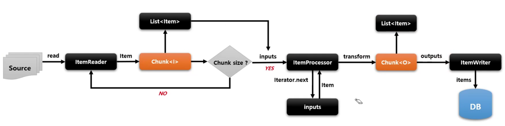

- `Chunk<I>` 는 `ItemReader` 로부터 읽은 아이템을 `Chunk Size` 만큼 반복해서 저장한다.
- `Chunk<O>` 는 `ItemReader`로 부터 전달받은 `Chunk<I>`를 참조하여 `ItemProcessor`에서 가공된 아이템들을 `ItemWriter` 에게 전달한다.
- ItemReader 와 Processor 는 아이템을 개별적으로 처리하지만 ItemWriter 는 일괄적으로 처리한다.(List 를 받아)

```java
@Bean
public Step chunkStep() {
    return stepBuilderFactory.get("chunkStep")
        .<String, String>chunk(5)
        .reader(new ListItemReader<>(Arrays.asList("item1", "item2", "item3", "item4", "item5")))
        .processor(new ItemProcessor<String, String>() {
            @Override
            public String process(String item) throws Exception {
                // Do Something
                return ... 
            }
        })
        .writer(new ItemWriter<String>() {
            @Override
            public void write(List<? extends String> items) throws Exception {
                // Do Something (출력, DB 저장, 파일 쓰기 등..)
            }
        })
        .build();
}
```
- ### 속성
  - List Items
  - List<SkipWrapper> skips: 오류 발생으로 스킵된 아이템
  - List<Exception> errors
  - iterator()
    > Inner Class인 ChunkIterator가 반환된다.

## 🧐 ChunkOrientedTasklet
스프링 배치에서 제공하는 Tasklet의 구현체로, Chunk 기반 프로세싱을 담당하는 도메인 객체이다.    
Tasklet에 의해 반복적으로 실행되며 실행될 때마다 새로운 트랜잭션이 생성되어 처리가 이루어진다. 때문에 예외 발생으로 롤백이 이루어져도 이전에 커밋한 Chunk는 롤백되지 않는다.

내부에는 ItemReader 를 핸들링하는 `ChunkProvider` 와 ItemProcessor, ItemWriter 를 핸들링하는 `ChunkProcessor` 타입의 구현체가 존재한다.

`TaskletStep` ▶ `ChunkOrientedTasklet.execute()` ▶ `ChunkProvider` ▶ `ItemReader를 통해 read(chunkSize 만큼 반복)` ▶ `ChunkProcessor를 통해 process(inputs)`    
▶ `ItemProcessor에게 처리 위임 Iterator로 순회하며 처리` ▶ `ItemWriter` ▶ `ChunkOrientedTasklet 으로 돌아가 아이템이 없을 때 까지 반복`

Chunk를 진행하며 `ChunkContext` 에 item 들을 캐싱한다. 그리고 예외가 발생하여 **재 시도할 경우 아이템을 다시 읽어오는 것이 아니라 캐싱된 아이템을 꺼내 다시 처리한다.**    
캐싱된 데이터는 해당 Chunk가 모두 수행되었을 경우 제거하게 된다.

### 👆 API
  - #### .<I, O>chunk(size)
      - input, output 제네릭 타입의 설정, commit interval 지정.
      - SimpleStepBuilder 를 반환한다.
  - #### .<I, O>chunk(CompletionPolicy)
    - Chunk 프로세스를 완료허기 위한 정책을 설정하는 클래스.
  - #### .reader(ItemReader), .processor(ItemProcessor), .writer(ItemWriter))
    - Processor는 필수적으로 사용하지 않아도 된다.
  - #### .stream(ItemStream)
    - 재시작 데이터를 관리하는 콜백에 대한 스트림.
  - #### .readerIsTransactionalQueue()
    - MQS, JMS 같이 트랜잭션 외부에서 읽고, 캐시할 것인지의 여부, 기본은 false 이다.
  - #### .listener(CHunkListener)


## 🧐 ChunkProvider / ChunkProcessor

- ### ChunkProvider 
  ItemReader를 사용해서 소스로부터 아이템을 chunk size 만클 읽어 제공하는 도메인 객체이다.   
  `Chunk<I>`를 만들고 반복문을 사용해 ItemReader.read()를 호출하며 아이템을 chunk에 쌓고, 사이즈만큼 아이템 읽기를 마치면 ChunkProcessor로 넘어간다.     
  만약 더이상 읽을 아이템이 없는경우(null) chunk 프로세스를 종료한다.
  
  기본 구현체로 SimpleChunkProvider, FaultTolerantChunkProvider(예외 발생시 skip, retry) 이 있다.

- ### ChunkProcessor
  ItemProcessor를 사용해서 Item을 가공하고, ItemWriter를 사용해서 Chunk 데이터를 저장, 출력한다.     
  `Chunk<O>`를 생성하고 넘어온 `Chunk<I>` 에서 아이템을 한 건씩 꺼내 처리한 후 `Chunk<O>` 에 결과를 저장한다.      
  ItemProcessor는 필수 사항이 아니기 때문에 없다면 아무처리 없이 그대로 `Chunk<O>`에 저장되게 된다.   
  ItemWriter 까지의 처리가 완료되면 해당 Chunk 트랜잭션이 종료되고, 다음 ChunkOrientedTasklet이 실행된다.
  
  기본 구현체로는 SimpleChunkProcessor 와 FaultTolerantChunkProcessor가 있다.

## 🧐 ItemReader, ItemWriter, ItemProcessor

- ### ItemReader
  - csvm txt 등의 플랫 파일 
  - XML, JSON
  - DB
  - JMS와 같은 Message Queuing 서비스
  - Custom Reader
  
  등의 다양한 소스에서 데이터를 읽어 제공하는 인터페이스로 아이템을 하니씩읽어 반환하고, 더 이상 없다면 null을 반환한다.     
  ExecutionContext에 read와 관련된 여러 상태 정보를 저장해 재시작시 다시 참조하도록 지원한다.

- ### ItemWriter
  ItemReader 에서 읽은 아이템들을 리스트로 전달받아 출력한다. 출력이 완료되고 트랜잭션이 종료되면 새로운 Chunk 단위 프로세스를 진행한다.

- ### ItemProcessor
  데이터를 출력하기전 데이터를 가공, 변형, 필터링(null을 반환하면 필터링 된다) 한다.
  ItemReader 와 ItemWriter 와 독립되어 비즈니스 로직을 구현한다. Reader 에서 받은 아이템을 특정 타입으로 변환하여 Wirter에 넘겨준다.   
  중간 처리의 역할이기 때문에 필수요소가 아니고, Processor 가 없으면 아이템은 그대로 Writer에 전달된다.
  
대부분 ItemReader와 ItemWriter는 스프링에서 제공하는 구현체를 사용하는 경우가 많고, ItemProcessor는 비즈니스 로직을 담기 때문에
직접 구현한다.


## 🧐 ItemStream
ExecutionContext 를 매개변수로 받아 ItemReader, ItemWriter 처리시 상태를 저장하고, 오류가 발생하면 해당 상태를 참조하여 재시작 하도록 지원한다.    
ItemReader, ItemWriter 의 구현체는 ItemSteam 을 구현해야 한다.(ItemStreamReader, ItemStreamWriter 을 구현하면 된다.)   

- #### open(ExecutionContext)
  - read(), write() 전에 파일이나 커넥션이필요한 리소스제 접근하도록 초기화하는 작업.
- #### update(ExecutionContext) 
  - 현재까지의 상태를 저장
- #### close(ExecutionContext) 
  - 열려있는 리소스 해제. (예외가 발생했을 때도 호출되어 리소스를 해제한다)
  
ItemReader, ItemWriter 가 동작하기 전에 ItemStream에서 open() 을 통해 리소스를 열고 초기화 한다.    
그 후 아이템을 읽어올 때, 쓸 때 chunk 마다 update()를 호출하여 DB에 저장한다.

```java
public class CustomItemReader implements ItemStreamReader<Member> {

    private final List<Member> items;
    private int index;
    private boolean restartable;

    public CustomItemReader(List<Member> items) {
        this.items = new ArrayList<>(items);
        this.index = 0;
        this. restartable = false;
    }

    @Override
    public Member read() throws Exception, UnexpectedInputException, ParseException, NonTransientResourceException {
        Member item = null;

        if(this.index < this.items.size()) {
            item = this.items.get(index++);
        }

        if(index == 8 && !restartable) {
            throw  new RuntimeException("Restart is required");
        }

        return item;
    }

    @Override
    public void open(ExecutionContext executionContext) throws ItemStreamException {
        if(executionContext.containsKey("index")) {
            index = executionContext.getInt("index");
            this.restartable = true;
        }
        else {
            executionContext.put("index", index);
        }
    }

    @Override
    public void update(ExecutionContext executionContext) throws ItemStreamException {
        executionContext.put("index", index);
    }

    @Override
    public void close() throws ItemStreamException {
        System.out.printf("리소스 해제.");
    }
}
```
- open() 에서 이전에 실행해 index가 존재한다면 해당 index 값을 불러와 그 위치부터 실행한다.
- close(): 예외가 발생했을 때 호출되어, 리소스를 해제시킨다.

Chunk Size를 2로 주고, 리소스로 10개의 아이템을 주었다.    
8번째 아이템을 읽은 후에 예외가 발생하도록 설정해 보았다. 아래 이미지는 테스트의 결과이다.

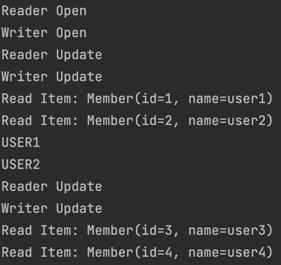

최초에 Reader와 Writer의 Stream이 Open 되고, Update 가 한번 호출 된다.    
그 뒤에 아이템을 청크 사이즈만큼 읽고, Processor가 동작한 후 Write가 이루어 진다.(USER1, USER2 와 같이 출력하도록 함)     
read(), process(), write() 가 한 chunk에 대해 모두 실행되면 Reaader, Writer의 Stream에서 Update()가 호출되어 상태를 저장한다.

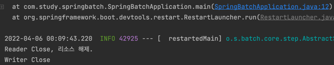

8번째 아이템에서 예외가 발생하면 Close()를 호출하여 리소스를 해제하고 종료한다.    
물론 예외가 발생하지 않아도 Close()를 호출하여 리소스를 해제한다.

다음에 해당 인스턴스를 다시 실행하게 되면 ExecutionContext 에서 인덱스를 가져오고(8을 실행하다 롤백 되었으므로 이전 Chunk인 6까지 저장되었다.)   
restartable이 true로 바뀌기 떄문에 item 10 까지 정상적으로 실행된다.


## 🧐 Chunk Process 아키텍처
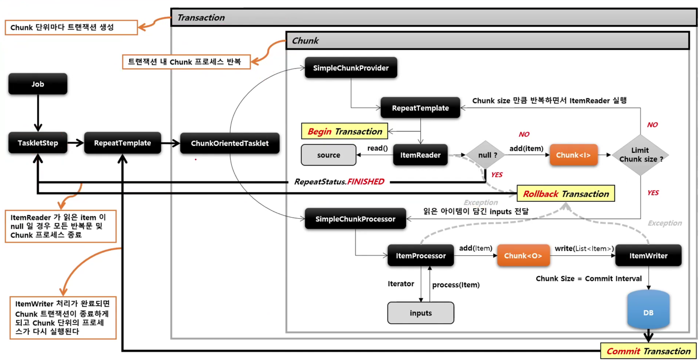    

설명은 위에서 계속 했으니 생략한다.


# 📌 ItemReader 구현체

## 🧐 FlatFileItemReader
표와 같은 2차원 데이터로 표현된 유형의 파일을 처리한다. 일반적으로 고정위치로 정의된 데이터나, 특수 문자에 의헤 구별된 데이터의 행을 읽는다.    
Resource(읽어야할 데이터)와 LineMapper(Line String to Object) 가 필요하다.


- ### 👆 속성
  - #### String encoding
  - #### int linesToSkip
    - 파일 상단부터 무시할 라인 수 (헤더 등을 스킵할때 사용)
    - LineCallbackHandler 를 호출하여 건너뛴다.
  - #### String[] comments
    - 해당 문자가 있는 라인은 무시한다.
  - #### Resource resource
    - FileSystemResource, ClassPathResource ...
  - #### LineMapper\<T> lineMapper
    - Line을 읽어 객체로 변환한다.
    - `LineTokenizer`
      - 라인을 FieldSet 으로 변환한다. 파일 형식에 맞춰 FieldSet 으로 변환하는 작업을 추상화해야한다.
      - 구분자를 이용하는 DelimitedLineTokenizer, 고정길이 방식의 FixedLengthTokenizer 가 있다.
    - `FieldSet`
      - 라인을 구분자로 구분해서  토큰 배열을 생성한다.
    - `FieldSetMapper`
      - FieldSet을 객체에 매핑하여 반환한다.(객체의 필드명과 매핑, BeanWrapperFieldSetMapper를 사용한다.)

- ### 👆 API
  - .name(String name)
    - ExecutionContext 내에서 구분하기 위한 key로 저장된다.
  - .resource(Resource)
  - .delimited().delimiter()
  - .fixedLength()
    - 길이를 기준으로 파일을 읽음
  - .addColumns(Range)
    - 고정 길이의 범위
  - .names(String[] fieldNames)
    - 매핑될 객체의 필드명
  - .targetType(Class)
  - .addComment(String comment)
    - 무시할 라인의 기호 설정.
  - .stric(false)
    - 라인을 읽을 때 파싱 예외가 발생하지 않도록 검증 생략 설정. 기본은 true
  - .encoding(String encoding)
  - .lineToSkip(num)
  - .saveState(false)
    - 상태 정보를 저장할 것인지, 기본은 true
  - .setLineMapper(LineMapper)
  - .setFieldSetMapper(FieldSetMapper)
  - .setLineTokenizer(LineTokenizer)
  
```java
@Bean
public ItemReader<? extends Member> itemReader() {
    FlatFileItemReader<Member> itemReader = new FlatFileItemReader<>();

    DefaultLineMapper<Member> lineMapper = new DefaultLineMapper<>();
    lineMapper.setLineTokenizer(new DelimitedLineTokenizer()); // 기본 구분자 ','
    lineMapper.setFieldSetMapper(new MemberFieldSetMapper());

    itemReader.setLineMapper(lineMapper);
    itemReader.setResource(new ClassPathResource("/member.csv"));
    itemReader.setLinesToSkip(1);

    return itemReader;
}
```

- LineMapper
```java
@Setter
public class DefaultLineMapper<T> implements LineMapper<T> {

    private LineTokenizer lineTokenizer;
    private FieldSetMapper<T> fieldSetMapper;

    @Override
    public T mapLine(String line, int lineNumber) throws Exception {
        return fieldSetMapper.mapFieldSet(lineTokenizer.tokenize(line));
    }
}
```

- FieldSetMapper
```java
public class MemberFieldSetMapper implements FieldSetMapper<Member> {

    @Override
    public Member mapFieldSet(FieldSet fieldSet) throws BindException {
        if(fieldSet == null){
            return null;
        }

        Member member = new Member();
        member.setName(fieldSet.readString(0));
        member.setId(fieldSet.readString(1));

        return member;
    }
}
```
`파일에서 한 줄을 읽어옴` ▶ `LineTokenizer 에서 파싱해 토큰 배열 생성(DefaultFieldSet)` ▶ `FieldSetMapper 에서 fieldSet을 토대로 객체 생성, 반환`   
▶ `파일의 끝까지 반복`

names를 넣어주지 않았기 떄문에 인덱스로 값을 가져왔다. LineTokenizer의 setNames()를 설정해주면 필드명으로 가져올 수 있다.

하기와 같이 Builder를 사용하여 더 깔끔하게 구성할 수 있다.
```java
@Bean
public ItemReader itemReader() {
    return new FlatFileItemReaderBuilder<Member>()
    .name("flatFile")
    .resource(new ClassPathResource("/member.csv"))
    .fieldSetMapper(new BeanWrapperFieldSetMapper<>())
    .targetType(Member.class)
    .delimited().delimiter(",")
    .names("name", "id")
    .linesToSkip(1)
    .build();
    }
```
코드를 보면 LineMapper를 설정하는 부분이 빠졌다는 것을 알 수 있는데, 사실 따로 생성해서 넣어주지 않아도, 스프링에서 제공하는 DefaultLineMapper가 존재하고,이를 사용한다.   
마찬가지로 FieldSetMapper 또한 스프링에서 제공하는 BeanWrapperFieldSetMapper를 사용하고, 타겟 클래스를 지정해 주면 필드명에 맞게 매핑해준다.

- ### 고정 길이로 구분
  ```java
  .fixedLength() // fixedLengthBuilder 반환
  .names("name", "id")
  .addColumns(new Range(1-5))
  .addCloumns(new Range(6-10))
  ```
  문자열이 아님에 주의하자.

### 👆 Exception Handling
  - `IncorrectTokenCountException`
    - 넣어준 토큰 필드의 이름(names)의 수보다 읽어들인 토큰의 수가 다를 때 발생한다.
  - `IncorrectLineLengthException`
    - 지정해준 컬럼들의 길이보다 라인 전체 길이가 일치하지 않을 때 발생한다.
  
  기본적으로는 `stric` 옵션이 `true` 이기 때문에 토큰화를 수행할 때 이를 검증하게 되고, 예외를 발생시킨다. 하지만 해당 옵션을 `false`로 주게 된다면    
  라인 길이나 컬럼명을 검증하지 않게되기 때문에 예외를 발생시키지 않고, 범위나 이름에 맞지 않는 컬럼은 빈 토큰을 가지게 된다.


## 🧐 XML-StaxEventItemReader

### StAX ?
Streaming API for XML, DOM 과 SAX 의 장, 단점을 보완한 API 모델로 PUSH, PULL 방식을 모두 제공한다.      
XNL 파일의 항목을 직접 이동하면서 Stax 파서기를 통해 구문을 분석한다.

- Iterator API 방식
  - XMLEventReader의 nextEvent()를 호출해 이벤트 객체를 가져온다.
- Cursor API 방식
  - JDBC Resultset 처럼 동작, XMLStreamReader는 XML 문서의 다음 요소로 커서를 이동한다.
  - 커서에서 메서드를 호출하여 현재 이벤트의 정보를 얻는다.
  

스프링 배치에서는 XML 바인딩을 Spring OXM에게 위임하고, 바인딩 기술을 제공하는 구현체를 선택해서 처리하도록 한다.     
`Marshaller`(객체 -> XML), `UnMarchaller`(XML -> 객체)를 지원하는 오픈소스로는 JaxB2, Castor, XmlBeans, Xstream ... 이 있다. 

스프링 배치는 StAX 방식으로 문서를 처리하는 StaxEventItemReader를 제공한다.

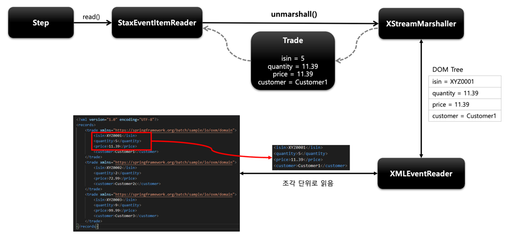
XML 문서를 조각(fragment) 단위로 분석하여 처리한다.(root element 를 하나의 조각으로)     
조각을 읽을 때는 DOM의 Pull 방식을 사용하고, 이를 객체로 바인딩 할때는 SAX의 Push 방식을 사용한다.    
fragment 단위로 읽어들인 후 SpringOXM 에게 객체 매핑을 위임한다.

루트 엘리먼트를 객체로, 내부의 자식 엘리먼트들을 매핑될 객체의 필드로 매핑한다.

- ### 👆 속성
  - FragmentEventReader
    - XML 조각을 독립형 XML 문서로 처리하는 이벤트 판독기
  - XMLEventReader
    - XML 이벤트 구문 분석을 위한 최상위 인터페이스
  - Unmarshaller
    - XML to Object
  - Resource
  - List<QName> fragmentRootElementNames
    - 조각 단위의 루트 엘리먼트명을 담은 리스트.


- ### 👆 API
  StaxEventItemRedaderBuilder\<T> 를 사용한다. 
  - .name(String)
  - .resource(Resource)
  - .addFragmentRootElements(String ...)
    - root Elemnet를 지정한다.
  - .unmarshaller(Unmarshaller)
    - 타겟 객체 설정.
  - .saveState(false)
    - 상태 정보 저장의 여부, 기본값은 true 이다.
  


### 의존성 추가
```groovy
implementation 'com.thoughtworks.xstream:xstream:1.4.19'
implementation 'org.springframework:spring-oxm:5.3.16'
```

```xml
<?xml version="1.0" encoding="UTF-8" ?>
<members>
  <member id="1">
    <id>1</id>
    <name>user1</name>
  </member>
  <member>
    <id>2</id>
    <name>user2</name>
  </member>
  
   ...
  
</members>

```

```java
@Bean
public ItemReader<? extends Member> itemReader() {
    return new StaxEventItemReaderBuilder<Member>()
        .name("staXml")
        .resource(new ClassPathResource("/member.xml"))
        .addFragmentRootElements("member")
        .unmarshaller(itemUnmarshaller())
        .build();
}

@Bean
public Unmarshaller itemUnmarshaller() {
    Map<String, Class<?>> aliases = new HashMap<>();
    aliases.put("member", Member.class);
    aliases.put("id", String.class);
    aliases.put("name", String.class);

    XStreamMarshaller xStreamMarshaller = new XStreamMarshaller();
    xStreamMarshaller.setAliases(aliases);

    return xStreamMarshaller;
}
```
Map 에 처음으로 들어가는 요소는 RootElement에 해당하는 것으로 객체와 매핑되고
그 다음의 요소들은 각각 객체의 필드와 매핑된다.


### 🔑 참조

> - https://www.inflearn.com/course/%EC%8A%A4%ED%94%84%EB%A7%81-%EB%B0%B0%EC%B9%98
> - https://fastcampus.app/course-detail/206067
