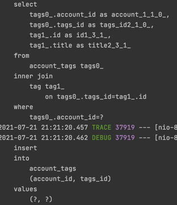
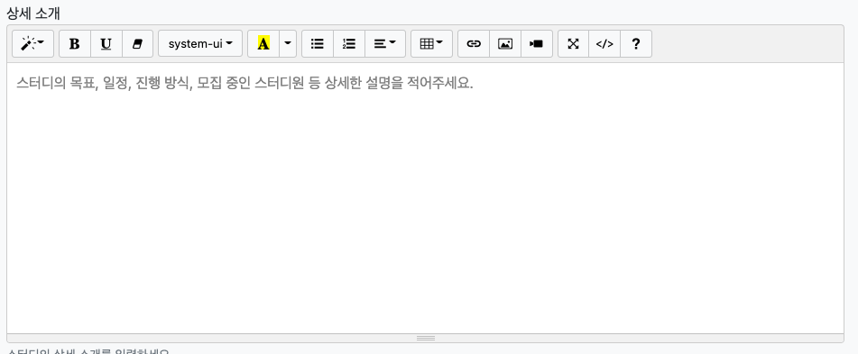
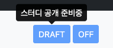
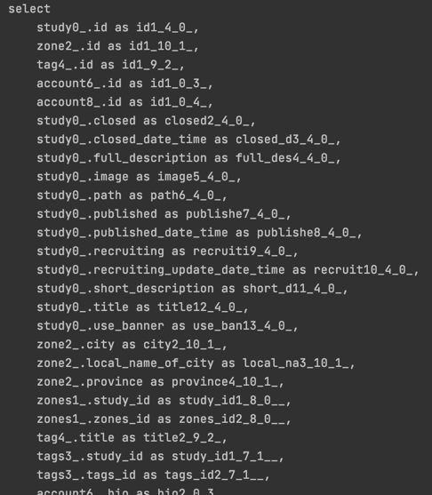
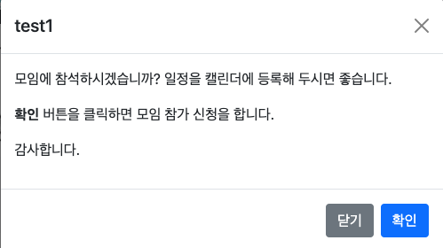

> ☝️ 스프링과 JPA 기반 웹 애플리케이션 개발 - 백기선님.


- 라이브러리
> - Lombok
> - Spring Boot Devtools
> - Spring Configuration processor : Custom properties 자동완성 지원
> - Thymeleaf
> - Spring Security
> - Srping Data JPA
> - PostgreSQL, H2
> - Java mail sender (Spring mail)
> - QueryDSL
> - Spring Validation


## 📃 목차
***
- #### [회원가입 뷰](#-회원가입-뷰)
- #### [패스워드 인코딩](#-패스워드-인코딩)
- #### [인증 메일 확인](#-인증-메일-확인)
- #### [회원가입, 인증 후 자동 로그인](#-회원가입,-인증-후-자동-로그인)
- #### [인증 상태에 따른 View](#-인증-상태에-따른-view)
- #### [프론트엔드 라이브러리 설정](#-프론트엔드-라이브러리-설정)
- #### [프로필 이미지 및 아이콘](#-프로필-이미지-및-아이콘)
- #### [이메일 인증 경고창](#-이메일-인증-경고창)
- #### [인증 이메일 재전송](#-인증-이메일-재전송)
- #### [로그인, 로그아웃](#-로그인--로그아웃)
- #### [로그인 기억하](#-로그인-기억하기)
- #### [Profile View](#-profileview)
- #### [RedirectAttribute : FlashAttribute](#-redirectattribute---flashattribute)
- #### [@WithSecurityContext](#--withsecuritycontext)
- #### [프로필 이미지](#-프로필-이미지)
- #### [패스워드 비교](#-패스워드-변경)
- #### [체크박스 값 전달](#-체크박스-값-전달)
- #### [Model Mapper](#-model-mapper)
- #### [ajax 전송 csrf](#-ajax-전송-csrf)
- #### [ManyToMany](#-manytomany)
- #### [ObjectMapper](#-objectmapper)
- #### [postgresql 셋팅](#-postgresql-셋팅)
- #### [sql debug 설정](#-sql-debug)
- #### [SMTP 설정](#-smtp-설정)
- #### [이메일로 HTML 전송](#-이메일로-html-전송)
- #### [textarea에 에디터 추가하기 : summernote](#-textarea에-에디터-추가하기)
- #### [th:classappend](#-th-classappend)
- #### [BootStrap:ToolTip](#-tooltip)
- #### [EntityGraph](#-entitygraph)
- #### [잘못된 접근 방지](#-잘못된-접근-방지)
- #### [BootStrap : Modal](#-bootstrap---modal)
- #### [날짜 형식 라이브러리 : Moment.Js](#-날짜-형식-라이브러리---moment-js)
- #### [타임리프 : 객체의 타입 변환](#-타임리프---객체의-타입-변환)
- #### [N+1 쿼리 문제](#-n-1-쿼리-문제)
- #### [Form Delete Method](#-form-delete-method)
- #### [@PathVariable Repository 조회](#--pathvariable-repository-조회)
- #### [패키지 구조 정리](#-패키지-구조-정리)
- #### [test DB 설정 : TestContainers](#-test-db-설정---testcontainers)
- #### [비동기 EventListener](#-비동기-eventlistener)
- #### [QeuryDSL](#-qeurydsl)
- #### [Handler Interceptor](#-handler-interceptor)
- #### [페이징](#-페이징)
- #### [Mark.js](#-markjs)
- #### [Exception Handler](#-exception-handler)
- #### [배포시 고려할 점](#-배포시-고려할-점)


# 📌 회원가입 뷰
***
    - 타임리프 : 객체를 폼 객체로 설정하기

```html
th:object="${signUpForm}"

th:field="*{nickName}"
th:field="*{email}"
th:field="*{password}"
```        

```java
model.addAttribute(new SignUpForm());
```
- #### attribute name을 생략하면 객체의 카멜 케이스로 이름이 지정된다. ex)signUpForm
- #### List와 같은 Collection에서 name을 지정하지 않을경우 size가 0일 때 null로 넘어가므로 주의.


- ## 제약 검증 기능.
```html
<form class="needs-validation col-sm-6"
      
required minlength="3" maxlength="20"
input type email, password

<small class="invalid-feedback">닉네임을 입력하세요.</small>
<small class="form-text text-danger" th:if="${#fields.hasErrors('nickName')}" th:errors="*{nickName}">Nickname Error</small>
```

```javascript
<script type="application/javascript" th:fragment="form-validation">
    (function () {
        'use strict';

        window.addEventListener('load', function () {
            var forms = document.getElementsByClassName('needs-validation');

            Array.prototype.filter.call(forms, function (form) {
                form.addEventListener('submit', function (event) {
                    if (form.checkValidity() === false) {
                        .preventDefault();
                        event.stopPropagation();
                    }
                    form.classList.add('was-validated')
                }, false)
            })
        }, false)
    }())
</script>
```
> form.checkValidity 에서 html에서 선언한 검증 체크. 유효하지 않을 경우 class ="invalid-feedback"에 해당하는 값 출력.
> th:errors 에는 서버에서 검증한 해당 필드에 대한 에러가 담김.

# 📌 폼 서브밋 검증
***
### -  회원 가입 폼 검증.
> - #### JSR 303 에노테이션 검증
>    - 값 길이, 필수 값
>  > @NotBlank    
    @Length(min=3, max=20)    
    @Pattern(regexp = "([ㄱ-ㅎ가-힣-a-z0-9_-]{3,20}$)")    
    @Email
> - #### 커스텀 검증
>    - 중복 이메일, 닉네임 여부 확인.
> > implements Validator
> - #### 폼 에러 발생 시 폼 다시 보여주기.
> ```java
> @PostMapping("/sign-up")
> public String signUpSubmit(@Valid SignUpForm signUpForm, Errors errors){
>   if(errors.hasErrors()){
>       return "account/sign-up";
> }
>   return "redirect:/";
> }
> ```
> - Errors 는 반드시 @Valid 객체 다음으로 와야함.
> - 에러가 있을 때 form 객체를 자동으로 model에 추가하여 돌려줌. (입력값 포함)
>

- 커스텀 검증
```java
@Override
public boolean supports(Class<?> aClass) {
    return aClass.isAssignableFrom(SignUpForm.class);
}

@Override
public void validate(Object o, Errors errors) {
    //TODO email, nickname 중복 여부.
    SignUpForm signUpForm = (SignUpForm) errors;
    if(accountRepository.existsByEmail(signUpForm.getEmail())){
        errors.rejectValue("email","invalid.email", new Object[]{signUpForm.getEmail()}, "이미 사용중인 이메일 입니다.");
    }
    if(accountRepository.existsNickName(signUpForm.getNickName())){
        errors.rejectValue("nickName","invalid.nickName", new Object[]{signUpForm.getNickName()}, "이미 사용중인 닉네 입니다.");
    }

}
```

1. @InitBinder를 이용한 Validator 등록.
```java
//객체의 카멜케이스.
@InitBinder("signUpForm")
public void initBinder(WebDataBinder webDataBinder){
    webDataBinder.addValidators(signUpFormValidator);
}
```

2. 메서드에 errors와 검증 객체를 넘겨 error 받아오기
```java
sighUpFormValidator.validate(signUpForm, errors);
if(errors.hasError()){
    ...
}
```
- validate 뿐만 아니라 새로운 메서드를 생성하여 같은 방식으로 검증 가능.

# 📌 회원 가입 처리
****
### 1. 회원 정보 저장.
```java
private Account saveNewAccount(SignUpForm signUpForm) {
        Account account = Account.builder()
                .email((signUpForm.getEmail()))
                .nickName(signUpForm.getNickName())
                .password(passwordEncoder.encode(signUpForm.getPassword()))
                .studyCreatedByWeb(true)
                .studyEnrollmentResultByWeb(true)
                .studyUpdatedByWeb(true)
                .build();

        Account newAccount = accountRepository.save(account);
        return newAccount;
    }
```
### 2. 인증 이메일 발송.
```java
newAccount.generateEmailCheckToken();

private void sendSignUpConfirmEmail(Account newAccount) {
        SimpleMailMessage mailMessage = new SimpleMailMessage();
        mailMessage.setTo(newAccount.getEmail());
        mailMessage.setSubject("회원 가입 인증");
        //check-email-token 에서 token이 유효한지 확인.
        mailMessage.setText("/check-email-token?token="+ newAccount.getEmailCheckToken()
                + "&email=" + newAccount.getEmail());

        javaMailSender.send(mailMessage);
    }
```
### 3. 완료 후 웰컴 페이지로 리다이렉트.


### - 테스트
- CSRF Token : 타 사이트에서 폼 데이터를 전송하는 것을 방지.
- 입력값이 정상 일 경우, 잘못 된 입력 값일 경우 테스트.

```java
@MockBean
JavaMailSender javaMailSender;

@DisplayName("회원 가입 처리 - 입력값 정상")
    @Test
    void signUpSubmit_with_correct_input() throws Exception {
        mockMvc.perform(post("/sign-up")
                .param("nickName","bigave")
                .param("email", "correct@email.com")
                .param("password","12345678")
                .with(csrf()))  //csrf token을 넣어줌.
                .andExpect(status().is3xxRedirection())
                .andExpect(view().name("redirect:/"));

        Account account =accountRepository.findByEmail("correct@email.com");
        assertNotNull(account);
        assertNotNull(account.getEmailCheckToken());
        
        //send 메서드가 호출 되었는지. org.mockito
        then(javaMailSender).should().send(any(SimpleMailMessage.class));
    }
```

# 📌 패스워드 인코딩
****
> - 스프링 시큐리티에서 권장하는 PasswordEncoder는 bycrypt 해시 알고리즘을 사용.
> - 솔트(salt) : 해커가 이미 여러개의 해싱 알고리즘을 사용하여 저장해놓고, 해시값에서 비밀번호를 추론할 수 있기 때문에 이를 방지하기 위해 고안. 
> > hash(12345678) -> aaaabbbb    
> > hash(12344567+salt)-> aacabaebb    
> > hash(12344567+salt)-> cafcabaekkb
> > 매번 다른 값이 나옴.
```java
@Bean
public PasswordEncoder passwordEncoder(){
    return PasswordEncoderFactories.createDelegatingPasswordEncoder();
}
```
- Test
```java
Account account =accountRepository.findByEmail("correct@email.com");

assertNotEquals(account.getPassword(), "12345678");
```


# 📌 인증 메일 확인
*****
```java
@GetMapping("/check-email-token")
public String checkEmailToken(String token, String email, Model model){
    Account account = accountRepository.findByEmail(email);
    String view = "account/checked-email";

    if(account == null){
        model.addAttribute("error", "wrong.email");
        return view;
    }

    if (!account.getEmailCheckToken().equals(token)){
        model.addAttribute("error", "wrong.token");
        return view;
    }

    account.setEmailVerified(true);
    account.setJoinedAt(LocalDateTime.now());
    model.addAttribute("numberOfUser", accountRepository.count());

    return view;
}
```
> - 인증 메일 정보가 올바르지 않다면 error를 담고, 올바르면 이메일 인증표시를 하고 가입 날짜를 계정정보에 추가.
> - checked-email 페이지에서 error의 여부에 따라 메시지를 보여준다.


# 📌 회원 가입, 인증 후 자동 로그인
****
> - 스프링 시큐리티에서 로그인 : SecurityContext에 Authentication(token)이 존재 하는가.
> - UsernamePasswordAuthenticationToken 으로 token을 생성하고 SecuriryContext에 넣어준다.
```java
public void login(Account account) {

    UsernamePasswordAuthenticationToken token = new UsernamePasswordAuthenticationToken(
            account.getNickName(),
            account.getPassword(),
            List.of(new SimpleGrantedAuthority("ROLE_USER"))
    );

    SecurityContext context = SecurityContextHolder.getContext();
    context.setAuthentication(token);
}
```

# 📌 인증 상태에 따른 View
***
```html
<dependency>
    <groupId>org.thymeleaf.extras</groupId>
    <artifactId>thymeleaf-extras-springsecurity5</artifactId>
</dependency>


<html xmlns:sec="http://www.thymeleaf.org/extras/spring-security"></html>

<li class="nav-item" sec:authorize="!isAuthenticated()">
    <a class="nav-link" href="#" th:href="@{/login}">로그인</a>
</li>
```
- isAuthenticated()를 이용하여 인증 상태인지 여부를 가져올 수 있다.
```html
${#authentication.name} 로 이름 참조도 가능.
```


# 📌 프론트엔드 라이브러리 설정
***
> - Web Jar , NPM
> - WebJar는 라이브러리 업데이트가 느리고, 올라오지 않은 라이브러리도 흔하다.

- ### 스프링 부트와 NPM
> - src/main/resource/static 이하에서는 정적 리소스로 제공(스프링 부트)
> - package.json에 프론트엔드 라이브러리를 제공
> - static 디렉토리 아래에 package.json을 위치. -> 정적 리소스로 프론트엔드 라이브러리 사용.
> > static 디렉토리로 이동.    
> > npm init   
> > npm install bootstrap   
> > npm install jquery
> - .ginignore에 node_modules, node 추가.

```html
<link rel="stylesheet" href="/node_modules/bootstrap/dist/css/bootstrap.css">

<script src="/node_modules/jquery/dist/jquery.js"></script>
<script src="/node_modules/bootstrap/dist/js/bootstrap.bundle.js"></script>
```
- ### 빌드
> - pom.xml을 빌드할 때 static 아래 package.json도 빌드하도록 설정.
> 

```xml
<plugin>
    <groupId>com.github.eirslett</groupId>
    <artifactId>frontend-maven-plugin</artifactId>
    <version>1.8.0</version>
    <configuration>
        <nodeVersion>v4.6.0</nodeVersion>
        <workingDirectory>src/main/resources/static</workingDirectory>
    </configuration>
    <executions>
        <execution>
            <id>install node and npm</id>
            <goals>
                <goal>install-node-and-npm</goal>
            </goals>
            <phase>generate-resources</phase>
        </execution>
        <execution>
            <id>npm install</id>
            <goals>
                <goal>npm</goal>
            </goals>
            <phase>generate-resources</phase>
            <configuration>
                <arguments>install</arguments>
            </configuration>
        </execution>
    </executions>
</plugin>
```


- ### 시큐리티 설정
```java
 @Override
    public void configure(WebSecurity web) throws Exception {
        web.ignoring()
                .mvcMatchers("/node_modules/**")
                .requestMatchers(PathRequest.toStaticResources().atCommonLocations());

    }
```
- CommonLocation에서는 node_modules를 포함하지 않기 때문에 따로 추가해 주어야 한다.


# 📌 프로필 이미지 및 아이콘
*****
> - npm install jdenticon
> - npm install font-awesome


```html
<link rel="stylesheet" href="/node_modules/font-awesome/css/font-awesome.css">
<script src="/node_modules/jdenticon/dist/jdenticon.js"></script>

<i class="fa fa-bell-o"> </i>
<svg data-jdenticon-value="user127" th:data-jdenticon-value="${#authentication.name}" width="24" height="24" class="rounded border bg-light"></svg>

```
- font-awesome : fa {docs 참조해서 아이콘 id}
- jdenticon : name에 따라 다른 값이 들어가도록 설정 함.


# 📌 이메일 인증 경고창.
****
```html
<div class ="alert alert-warning" role="alert" th:if="${account != null && !account.emailVerified}" >
    가입을 완료하려면 <a href="#" th:href="@{/check-email}" class="alert-link">계정 인증 이메일을 확인 하세요.</a>
</div>
```

```java
@GetMapping("/")
public String home(@CurrentUser Account account, Model model){
    if(account != null){
        model.addAttribute(account);
    }

    return "index";
```

```java
@Retention(RetentionPolicy.RUNTIME)
@Target(ElementType.PARAMETER)
@AuthenticationPrincipal(expression = "#this =='anonymousUser' ? null :account")
public @interface CurrentUser {

}
```
- User인증이 되지 않으면 Principal 은 "anonymousUser"라는 문자열. 인증이 되어있지 않다면 null을 인증이 되어있다면 principal에서 account 객체를 꺼내 넘겨준다.

```java
UsernamePasswordAuthenticationToken token = new UsernamePasswordAuthenticationToken(
                new UserAccount(account),
                account.getPassword(),
                List.of(new SimpleGrantedAuthority("ROLE_USER"))
        );
```
- login에서 AuthenticationPrincipal을 닉네임이 아닌 UserAccount로 변경.

```java
@Getter
public class UserAccount extends User {

    private Account account;

    public UserAccount(Account account) {
        super(account.getNickName(), account.getPassword(), List.of(new SimpleGrantedAuthority("ROLE_USER")));
        this.account =account;
    }
}
```
- account 라는 필드명은 @CurrentUser Account account 의 account 와 매핑된다.


# 📌 인증 이메일 재전송
***
```java
@GetMapping("/resend-confirm-email")
public String resendPage(@CurrentUser Account account, Model model){

    if(!account.canConfirmEmail()){
        model.addAttribute("error", "인증 이메일은 10분에 한번만 전송할 수 있습니다.");
        model.addAttribute("email",account.getEmail());
        return "account/check-email";
    }

    accountService.resendConfirmEmail(account.getNickName());
    return "redirect:/";
}
```

```java
@Transactional
public void resendConfirmEmail(String nickName) {
        Account account = accountRepository.findByNickName(nickName);
        account.generateEmailCheckToken();

        SimpleMailMessage simpleMailMessage = new SimpleMailMessage();
        simpleMailMessage.setTo(account.getEmail());
        simpleMailMessage.setSubject("스터디웹 회원 인증");
        simpleMailMessage.setText("/check-email-token?token="+account.getEmailCheckToken()
        +"&email="+account.getEmail());

        javaMailSender.send(simpleMailMessage);
}
```
- canConfirmEmail()에서는 현재 시간과 마지막으로 checkToken을 생성한 시간을 비교하여 10이 지나지 않았다면 전송하지 않고 경고창.
- 토큰을 새로 만들어 이메일 전송.


# 📌 로그인, 로그아웃
***
```java
http.formLogin()
            .loginPage("/login").permitAll()
            .and()
        .logout().logoutSuccessUrl("/");
```

```java
@Override
public UserDetails loadUserByUsername(String emailOrNickName) throws UsernameNotFoundException {
    Account account =  accountRepository.findByEmail(emailOrNickName);
    if(account == null){
        account = accountRepository.findByNickName(emailOrNickName);
    }
    if(account == null){
        throw new UsernameNotFoundException(emailOrNickName);
    }

    return new UserAccount(account);

}
```
- UserDetailsService의 loadUserByUsername을 구현.
- User를 상속한 UserAccoun를 반환.

```java
private Account account;

    public UserAccount(Account account) extends User{
        super(account.getNickName(), account.getPassword(), List.of(new SimpleGrantedAuthority("ROLE_USER")));
        this.account =account;
    }
```
- 기본으로 사용되는 formLogin()이 아닌 새로 login.html을 만들어 매핑.
- Spring Security의 User을 상속받는 클래스인 UserAccount를 이용하여 인증.
- return User() 로도 가능.

# 📌 로그인 기억하기
***
- 기본적으로 Session의 타임 아웃은 30분.
```properties
server.servlet.session.timeout=30m
```
- 세션이 만료 되더라도 로그인을 유지하기 위해 사용하는 방법(RememberMe)
    > 쿠키에 인증 정보를 남겨두고 세션이 만료 됐을 때 쿠키에 남아있는 정보로 인증. 
    
- 해시 기반의 쿠키
> - UserName
> - Password
> - 만료기간
> - Key
> - 쿠키를 탈취당하면 그 계정을 탈취당한 것과 같다.

- 조금 더 안전하게 관리하기
> - 쿠키 안에 랜덤한 token을 만들어 같이 저장하고 인증 때마다 변경.
> - Username, 토큰
> - 해당 방법도 취약, 해커가 쿠키로 인증을 하게되면 원 사용자는 인증할 수 없게 됨.

- 개선된 방법
> - UserName, Token(랜덤, 매번 변경), 시리즈(랜덤,고정)
> - 쿠키를 탈취 당하면 원 사용자는 유효하지 않은 토큰과 유효한 시리즈,UserName 으로 접속하게 되고, 이 경우, 모든 토큰을 삭제하여 해커가 더이상 쿠키를 사용하지 못하도록 방지할 수 있다.


- ### 스프링 시큐리티 설정 : 해시 기반
```java
http.rememberMe().key("랜덤 키값");
```

- ### 스프링 시큐리티 설정: 개선된 영속화 기반 설정.

```html
<div class="form-grop form-check">
    <input type="checkbox" class="form-check-input" id="rememberMe", name="remember-me" checked>
    <label class="form-check-label" for="rememberMe" aria-describedby="rememberMeHelp">로그인 유지</label>
</div>
```
- name 을 remember-me로 주고 check box가 true 값이면 remember-me 기능 실행.

```java
private final AccountService accountService;
private final DataSource dataSource;

http.rememberMe()
        .userDetailsService(accountService)
        .tokenRepository(tokenRepository());

@Bean
public PersistentTokenRepository tokenRepository(){
        JdbcTokenRepositoryImpl jdbcTokenRepository = new JdbcTokenRepositoryImpl();
        jdbcTokenRepository.setDataSource(dataSource);
        return jdbcTokenRepository;

        }
```
- userDetailsService와 TokenRepository를 넘겨줌. 여기서는 UserDetilasService를 구현한 AccountService를 넘겨 주었다.

```java
@Getter @Setter
@Table(name = "persistent_logins")
@Entity
public class PersistentLogins {

    @Id
    @Column(length = 64)
    private String series;

    @Column(nullable = false, length = 64)
    private String username;

    @Column(nullable = false, length = 64)
    private String token;

    @Column(name = "last_used",nullable = false, length = 64)
    private LocalDateTime lastUsed;
}
```
- JdbcTokenRepositoryImpl에서 만드는 테이블 엔티티를 매핑 시켜준다.
- JdbcTokenRepositoryImpl class 에서 확인할 수 있다.

# 📌 profileView
****
```java
   @GetMapping("/profile/{nickname}")
    public String viewProfile(@PathVariable String nickname, @CurrentUser Account account, Model model){
        Account byNickName = accountRepository.findByNickName(nickname);

        if(byNickName == null){
            throw new IllegalArgumentException(nickname+"에 해당하는 사용자가 없습니다");
        }

        //account
        model.addAttribute(byNickName);
        model.addAttribute("isOwner", byNickName.equals(account));

        return "account/profile";

    }
```

```html
<div class="row mt-5 justify-content-center">
    <div class="col-2">
        <!-- image -->
        <svg th:if="${#strings.isEmpty(account.profileImage)}" class="img-fluid float-left rounded img-thumbnail"
            th:data-jdenticon-value="${account.nickName}" width="125", height="125"></svg>
        
    </div>
    <div class="col-8">
        <h1 class="display-4" th:text="${account.nickName}"></h1>
        <p class="lead" th:if="${!#strings.isEmpty(account.bio)}" th:text="${account.bio}"></p>
        <p class="lead" th:if="${#strings.isEmpty(account.bio) && isOwner}" >
            <span>한 줄 소개를 추가하세요.</span>
        </p>
    </div>
</div>
```


# 📌 RedirectAttribute : FlashAttribute
****
```java
 @PostMapping("/settings/profile")
    public  String RedirectMessage(RedirectAttributes attributes){
    
        attributes.addFlashAttribute("message", "RedirectMessage");
        
        return "redirect:/settings/profile";
    }
```
```html
<div th:if="${message}" class ="alert alert-success alert-dismissible fade show mt-3" role="alert">
    <svg class="bi flex-shrink-0 me-2" width="24" height="24" role="img" aria-label="Success:"><use xlink:href="#check-circle-fill"/></svg>
    <span th:text="${message}">메시지</span>
    <button type="button" class="btn-close" data-bs-dismiss="alert" aria-label="Close"></button>
    </button>
</div>
```
- RedirectAttribute 를 이용하여 리다이렉트 할 때 데이터를 전달할 수 있다.
- FlashAttribute 는 한번 사용하고 사라지는 일회성 데이터.
- model에 추가된 어트리뷰트처럼 사용하면 된다.


# 📌 @WithSecurityContext
****
```java
@Retention(RetentionPolicy.RUNTIME)
@WithSecurityContext(factory = WithAccountSecurityContextFactory.class )
public @interface WithAccount {
    String value();
}
```
```java
@RequiredArgsConstructor
public class WithAccountSecurityContextFactory implements WithSecurityContextFactory<WithAccount> {

    private final AccountService accountService;

    @Override
    public SecurityContext createSecurityContext(WithAccount withAccount) {

        SignUpForm signUpForm = new SignUpForm();
        signUpForm.setNickName(withAccount.value());
        signUpForm.setEmail("test@email.com");
        signUpForm.setPassword("123123123");
        accountService.processNewAccount(signUpForm);

        UserDetails principal = accountService.loadUserByUsername(withAccount.value());

        Authentication authentication = new UsernamePasswordAuthenticationToken(principal, principal.getPassword(), principal.getAuthorities());
        SecurityContext context = SecurityContextHolder.createEmptyContext();
        context.setAuthentication(authentication);

        return context;
    }
}
```
- 테스트를 진행할 때 특정 컨택스트가 등록되어 있어야하는 테스트의 경우(로그인) Securitycontext를 생성하여 등록한 후 테스트를 진행할 수 있다.
> 1. 계정 생성
> 2. UserDetails 객체 생성. (springSecurity.core.User)
> 3. 인증 토큰 생성(principal, password, Authorities)
> 4. Security Context를 생성하고 인증토큰을 등록.


# 📌 프로필 이미지
***
```html
<div class="form-group">
    <input id="profileImage" type="hidden" th:field="*{profileImage}" class="form-control" />
</div>
```
```html
 
```
- String 타입으로 이미지를 받을 수 있다.  HTML의 DataURL 이미지는 data:image로 시작
- ``` if (!e.target.result.startsWith("data:image"))``` 처럼 이미지인지 확인 가능.
- server.tomcat.max-http-form-post-size=5MB 와같이 설정하여 form으로 전송가능한 이미지 크기 변경가능.

# 📌 패스워드 비교
****
```java
passwordEncoder.matches(String rawPassword, String encodedPassword)
```

# 📌 체크박스 값 전달
****
```java
<div class="custom-control custom-switch custom-control-inline">
        <input type="checkbox" th:field="*{studyCreatedByEmail}" class="custom-control-input" id="studyCreatedByEmail">
        <label class="custom-control-label" for="studyCreatedByEmail">이메일로 받기</label>
</div>  
```
- 똑같이 field로 받고 boolean 값으로 저장. 체크하면 true


# 📌 Model Mapper
*****
- 객체의 프로퍼를 다른 객체의 프로퍼티로 매핑해주는 유틸리티 라이브러
```xml
<dependency>
    <groupId>org.modelmapper</groupId>
    <artifactId>modelmapper</artifactId>
    <version>2.4.4</version>
</dependency>
```

```java

@Bean
public ModelMapper modelMapper(){
    ModelMapper modelMapper = new ModelMapper();
    modelMapper.getConfiguration()
        .setDestinationNameTokenizer(NameTokenizers.UNDERSCORE)
        .setSourceNameTokenizer(NameTokenizers.UNDERSCORE);
    
    return modelMapper
}
```
- NameTokenizers.UNDERSCORE : _를 사용했을 때에만 nested 객체(account_nickName -> account.nickName)를 참조하는 것으로 간주,      아니라면 해당 객체의 프로퍼티로 간주한다.

```java
//modelMapper.map(source, destination)
        
1. modelMapper.map(profile, account);
2. model.addAttribute(modelMapper.map(account, Notification.class));


```
- source 객체의 프로퍼티 값들을 destination 객체의 프로퍼티 값에 매핑시켜 값을 할당한다.
- 2번과 같이 새로운 객체를 생성하여 할당도 가능.

# 📌 ajax 전송 csrf
****
```javascript
<script type="application/javascript" th:inline="javascript">
    var csrfToken = /*[[${_csrf.token}]]*/null;
    var csrfHeader = /*[[${_csrf.headerName}]]*/null;
    $(document).ajaxSend(function (e, xhr, options){
       xhr.setRequestHeader(csrfHeader, csrfToken);
    });
</script>
```
- 헤더에 csrf 토큰 추가.

# 📌 ManyToMany
****
```java
@ManyToMany
private Set<Tag> tags;

public void addTag(Account account, Tag tag) {
    Optional<Account> byId = accountRepository.findById(account.getId());

    byId.ifPresent(a -> a.getTags().add(tag));
}
```
- 자동으로 account_tags 테이블을 생성하고 조인이 발생.   



# 📌 ObjectMapper
***
```java
import com.fasterxml.jackson.databind.ObjectMapper;

private ObjectMapper objectMapper;

List<String> allTags = tagRepository.findAll().stream().map(Tag::getTitle).collect(Collectors.toList());
model.addAttribute("whitelist", objectMapper.writeValueAsString(allTags));
```
- String List를 String Json으로 변환
- readTree : String -> JsonNode
- readValue : Json -> Object, Json -> Map
- 등 많은 메소드 지원.


# 📌 postgresql 셋팅
***
```
create database {name};
create user {name} with encrypted password 'password';

//권한 부
grant all privileges on database {dbname} to {username};
```

# 📌 sql debug
****

```properties
spring.jpa.properties.hibernate.format_sql=true
logging.level.org.hibernate.SQL = DEBUG
logging.level.org.hibernate.type.descriptor.sql.BasicBinder = TRACE
```


# 📌 SMTP 설정
****
- 구글 Gmail을 SMTP 서버로 사용하기.(일일 제한)
  > https://support.google.com/mail/answer/185833성    
  > App 패스워드 생성.
```properties
# mail 설정
spring.mail.host = smtp.gmail.com
spring.mail.port=587
spring.mail.username =kimtaejun9705@gmail.com
spring.mail.password = ntszbexsramcvvvs
spring.mail.properties.mail.smtp.auth=true
spring.mail.properties.mail.smtp.timeout=5000
spring.mail.properties.mail.smtp.starttls.enable=true
```
- spring boot 에서 해당 설정들을 가지고  JavaMailSender Bean 을 자동으로 등록 해준다.


### 대체 서비스
- https//mailchimp.com/
- https://sendgrid.com/
- https://www.mailgun.com/ 
- https://aws.amazon.com/ses/
- https://gsuite.google.com


# 📌 이메일로 HTML 전송
*****

```java
public class HtmlEmailService implements EmailService{

    private final JavaMailSender javaMailSender;

    @Override
    public void send(EmailMessage emailMessage) {
        MimeMessage mimeMessage = javaMailSender.createMimeMessage();

        try{
            MimeMessageHelper mimeMessageHelper = new MimeMessageHelper(mimeMessage,true,"UTF-8");
            mimeMessageHelper.setTo(emailMessage.getTo());
            mimeMessageHelper.setSubject(emailMessage.getSubject());
            mimeMessageHelper.setText(emailMessage.getText(),true);

            javaMailSender.send(mimeMessage);
            log.info("sent email:{}",emailMessage.getText());

        }catch (MessagingException e){
            log.error("failed to send email : ",e);

        }

    }
}
```
- MimeMessage를 생성하고, 이를 Helper로 감싼 후  TO, Subject,Text를 설정, text의 두번째 인자값은 html 여부.


```java
@Builder
@Data
public class EmailMessage {

    private String to;
    private String subject;
    private String text;
}
```

- Email data를 넣을 클래스를 생성하였고, 이를 send의 파라미터로 전달해준다.

```java
Context context = new Context();
context.setVariable("nickName",account.getNickName() );
context.setVariable("link" ,"/check-email-token?token="+ account.getEmailCheckToken()
        + "&email=" + account.getEmail());
context.setVariable("linkName","이메일 인증하기.");
context.setVariable("message","이메일 인증을 완료하려면 아래 링크를 클릭하세요.");
context.setVariable("host",appProperties.getHost());

String message = templateEngine.process("mail/simple-link", context);

EmailMessage emailMessage = EmailMessage.builder()
        .to(account.getEmail())
        .subject("스터디 웹 회원 인증")
        .text(message)
        .build();

emailService.send(emailMessage);
```
- 템플릿 엔진을 사용하여 html 파일을 만들고, TemplateEngine.process("html", context)
- context는 View에 전달하는 model과 같은 역할, 데이터를 전달해준다. thymeleaf의 Context

```properties
app.host = http://localhost:8080
```
```java
@Component
@Data
@ConfigurationProperties("app")
public class AppProperties {
    String host;
}

```
- host는 실행 환경에 따라 달라질 수 있기 때문에 따로 properties값으로 설정하여 넘겨준다.
- 빈으로 주입받아 사용.


# 📌 textarea에 에디터 추가하기
- https://summernote.org/
- 부트스트랩과 연동이 편함.
```npm install summernote```
  > css, js 추가

```javascript
<script type="application/javascript">
    $(function () {
        $("#fullDescription").summernote({
           fontName: ['Arial', 'Arial Black', 'Comic Sans MS', 'Courier New', 'Noto Sans KR', 'Merriweather'],
            placeholder: '스터디의 목표, 일정, 진행 방식, 모집 중인 스터디원 등 상세한 설명을 적어주세요.',
            tabsize:2,
            height: 300
        });
    })
</script>
```
- .summernote 하면 적용,  옵션 추가 가능.
  



# 📌 th:classappend
****
```html
<div th:fragment="settingsFragment (currentMenu)">
    <ul class="nav nav-tabs" id="myTab" role="tablist">
        <li class="nav-item" role="presentation">
            <a class="nav-link" th:href="@{/settings/profile}" th:classappend="${currentMenu =='profile'}? active" role="tab"  >프로필</a>
        </li>
        <li class="nav-item" role="presentation">
            <a class="nav-link text-red" th:href="@{/settings/password}" th:classappend="${currentMenu =='password'}? active" role="tab">패스워드</a>
        </li>
    </ul>
</div>
```

```java
<div th:replace="fragment :: settingsFragment (currentMenu='profile')"/>
```

# 📌 ToolTip
****
```html
<span th:if="${!study.published}"
      class="d-inline-block" tabindex="0" data-toggle="tooltip" data-placement="bottom"
      title="스터디 공개 준비중">
    <button class="btn btn-primary btn-sm" style="pointer-events: none;" type="button" disabled>DRAFT</button>
</span>
```

```javascript
<script type="application/javascript">
    $(function () {
        $('[data-toggle="tooltip"]').tooltip()
    })
</script>
```
- 엘리먼트.tooltip, title 속성의 값이 툴팁 메시지가 된다.


# 📌 EntityGraph
****
- 나중에 필요한 쿼리를 한번에 던져 쿼리의 수를 줄인다.
- 작은 쿼리 여러개 -> 무거운 커리 한개. 많은 수의 요청에서 유리할 수 있다.

```java
@NamedEntityGraph(name = "Study.withAll", attributeNodes = {
        @NamedAttributeNode("tags"),
        @NamedAttributeNode("zones"),
        @NamedAttributeNode("managers"),
        @NamedAttributeNode("members")
})
```
> Entity 클래스에 그래프 이름 정의.


```java
@EntityGraph(value="Study.withAll", type = EntityGraph.EntityGraphType.LOAD)
Study findByPath(String path);
```
> -  findByPath() 메서드가 호출 될 때 Study.withAll에 해당하는 릴레이션을 모두 조회한다.
> - EntityGraphType.LOAD : 명시된 연관관계는 EAGER로, 나머지는 기본 설정( *ToOne->EAGER, *ToMany-> Lazy)에 따름.

   
     ...

- ### 엔티티 그래프 이름을 정의하지 않고 사용.
```java
@EntityGraph(attributePaths = {"managers", "members"})
Study findStudyWithTeamsByPath(String path);
```

- ### Subgraphs
```java

@NamedEntityGraph(
        name = "Enrollment.withEventAndStudy",
        attributeNodes = {
                @NamedAttributeNode(value = "event", subgraph = "study")
        },
        subgraphs = @NamedSubgraph(name = "study", attributeNodes = @NamedAttributeNode("study"))

)
```
- 엔티티가 참조하는 엔티티의 필드를 가져올 수 있다.
- Enrollment.event.study

```java
@EntityGraph(attributePaths = {"event", "event.study"})
Study findStudyWithTeamsByPath(String path);
```
- 한번만 사용할 것이라면, 마찬가지로 이름을 지정하지 않고 적용할 수도 있다.
# 📌 잘못된 접근 방지
***
```java
public Study getStudyToUpdate(Account account, String path) {
    Study study = getStudy(path);
    if(!study.getManagers().contains(account)){
        throw new AccessDeniedException("해당 기능에 대한 권한이 없습니다.");
    }

    return study;
}

private Study getStudy(String path) {
    Study study = studyRepository.findByPath(path);
    if(study == null){
        throw new IllegalArgumentException(path +"에 해당하는 스터디가 존재하지 않습니다.");
    }

    return study;
}
```
-url로 권한이 없는 사용자가 접근하거나, 잘못된 Path로 접근하는 것을 처리.

# 📌 BootStrap:Modal
***
```html
<div class="modal-content">
    <div class="modal-header">
        <h5 class="modal-title" id="leaveTitle" th:text="${event.title}"></h5>
        <button type="button" class="close" data-dismiss="modal" aria-label="Close">
            <span aria-hidden="true">&times;</span>
        </button>
    </div>
    <div class="modal-body">
        <p>모임 참가 신청을 취소하시겠습니까?</p>
        <p><strong>확인</strong>하시면 본 참가 신청을 취소하고 다른 대기자에게 참석 기회를 줍니다.</p>
        <p>감사합니다.</p>
    </div>
    <div class="modal-footer">
        <button type="button" class="btn btn-secondary" data-dismiss="modal">닫기</button>
        <form th:action="@{'/study/' + ${study.path} + '/events/' + ${event.id} + '/disenroll'}" method="post">
            <button class="btn btn-primary" type="submit" aria-describedby="submitHelp">확인</button>
        </form>
    </div>
</div>
```

# 📌 날짜 형식 라이브러리 : Moment.Js
****
```npm install moment --save```
```javascript
<div th:fragment="date-time">
    <script src="/node_modules/moment/min/moment-with-locales.js"></script>
    <script type="application/javascript">
        $(function () {
            moment.locale('ko');
            $(".date-time").text(function(index, dateTime) {
                return moment(dateTime, "YYYY-MM-DD`T`hh:mm").format('LLL'); // 워ㅓㄹ, 일, 년, 시간 ,오전|오후
            });
            $(".date").text(function(index, dateTime) {
                return moment(dateTime, "YYYY-MM-DD`T`hh:mm").format('LL');  // 월, 일, 년
            });
            $(".weekday").text(function(index, dateTime) {
                return moment(dateTime, "YYYY-MM-DD`T`hh:mm").format('dddd'); // 요일
            });
            $(".time").text(function(index, dateTime) {
                return moment(dateTime, "YYYY-MM-DD`T`hh:mm").format('LT'); // 시간 오전|오후
            });
            $(".calendar").text(function(index, dateTime) {
                return moment(dateTime, "YYYY-MM-DD`T`hh:mm").calendar(); // 요 시간 오전|오후
            });
            $(".fromNow").text(function(index, dateTime) {
                return moment(dateTime, "YYYY-MM-DD`T`hh:mm").fromNow();  // 지금으로 부터 상대시간.
            });
            $(".date-weekday-time").text(function(index, dateTime) {
                return moment(dateTime, "YYYY-MM-DD`T`hh:mm").format('LLLL'); // 요일, 월, 일, 년 시간 오전|오후
            });
        })
    </script>
</div>
```
- 서버의 형식인 YYYY-MM-DD`T`hh:mm 을 포매팅해준다.
- 상대 시간 ( 25분전 )도 가능.
- https://momentjs.com/ 참조.


# 📌 타임리프 : 객체의 타입 변환
****
```html
<span th:if="${event.eventType == T(com.studyweb.studyweb.event.EventType).FCFS}">선착순</span>
<span th:if="${event.eventType == T(com.studyweb.studyweb.event.EventType).CONFIRMATIVE}">관리자 확인</span>
```
-T(FQCN)

# 📌 N+1 쿼리 문제
****
- 쿼리 1번으로 N건을 가져왔는데 관련 컬럼을 얻기위해 N번의 추가 쿼리를 수행하는 문제.
- 성능상에 영향을 줄 수 있다.

> ex) event 조회시, enrollments를 event당 한 번씩 조회하므로 N개의 이벤트를 조회하면 N번의 enrollments 쿼리가 발생한다.

```java

// Event는 enrollments를 가짐.
@OneToMany(mappedBy = "event")
private List<Enrollment> enrollments;
```
-> Event하나를 조회할 때마다 enrollments를 조회하는 쿼리가 발생.

```java
@NamedEntityGraph(name = "Event.withEnrollments", attributeNodes = {
        @NamedAttributeNode("enrollments")
})
```

```java
@EntityGraph(value = "Event.withEnrollments", type= EntityGraph.EntityGraphType.LOAD)
    List<Event> findByStudyOrderByStartDateTime(Study study);
```
- EntityGraph를 이용하여 Event들이 조회될 때 enrollments를 같이 가져오도록 한다.
- #### [leftjoin](#-페이징) 으로도 해결할 수 있다.  

# 📌 Form Delete Method
***
```properties
spring.mvc.hiddenmethod.filter.enabled=true
```
-HTML Form 에서 Put, Delete 메소드를 사용한요청을 매핑 가능하게 해준다.


# 📌 @PathVariable 값으로 Repository에서 조회.
****

- 기존 코드 
```java 
@PostMapping("/events/{eventId}/enrollments/{enrollId}/accept")
public String acceptUser(@PathVariable Long eventId, @PathVariable Long enrollId){
    Event event = eventService.getEventById(eventId);
    Enrollment enrollment = enrollmentRepository.findById(enrollId).orElseThrow();
    
        eventService.acceptUser(event, enrollment);


    return "redirect:/study/"+study.getPath(path) + "/events/"+eventId;
}
```

- 개선 후
```java
@PostMapping("/events/{eventId}/enrollments/{enrollId}/accept")
public String acceptUser(@PathVariable("eventId") Event event, @PathVariable("enrollId") Enrollment enrollment){

    eventService.acceptUser(event, enrollment);

    return "redirect:/study/"+study.getPath(path) + "/events/"+event.getId();
}
```


# 📌 패키지 구조 정리
****

### - 아키텍쳐 테스트 유틸리
```xml
<dependency>
    <groupId>com.tngtech.archunit</groupId>
    <artifactId>archunit-junit5</artifactId>
    <version>0.13.1</version>
    <scope>test</scope>
</dependency>
```

```java
package com.studyweb.studyweb;

import com.studyweb.studyweb.modules.account.Account;
import com.tngtech.archunit.junit.AnalyzeClasses;
import com.tngtech.archunit.junit.ArchTest;
import com.tngtech.archunit.lang.ArchRule;

import static com.tngtech.archunit.lang.syntax.ArchRuleDefinition.classes;
import static com.tngtech.archunit.library.dependencies.SlicesRuleDefinition.slices;

@AnalyzeClasses(packagesOf = StudywebApplication.class)
public class PackageDependencyTests {

    private static final String STUDY = "..modules.study..";
    private static final String EVENT = "..modules.event..";
    private static final String ACCOUNT = "..modules.account..";
    private static final String TAG = "..modules.zone..";
    private static final String ZONE = "..modules.tag..";

    // Modules 패키지는 Modules 패키지에서만 참조.
    @ArchTest
    ArchRule modulesRule = classes().that().resideInAnyPackage("com.studyweb.studyweb.modules..")
            .should().onlyBeAccessed().byClassesThat()
            .resideInAnyPackage("com.studyweb.studyweb.modules..");
    
    // Study 패키지는 Study, Event 패키지에서만 참조.
    @ArchTest
    ArchRule studyPackageRule = classes().that().resideInAPackage(STUDY)
            .should().onlyBeAccessed().byClassesThat()
            .resideInAnyPackage(STUDY,EVENT);

    // Account 패키지는 Account,Tag,Zone 패키지를 참조
    @ArchTest
    ArchRule accountPackageRule = classes().that().resideInAPackage(ACCOUNT)
            .should().accessClassesThat()
            .resideInAnyPackage(ACCOUNT, TAG, ZONE);

    //Event 패키지는 Account,Study, Event 패키지를 참조.
    @ArchTest
    ArchRule eventPackageRule = classes().that().resideInAPackage(EVENT)
            .should().accessClassesThat()
            .resideInAnyPackage(ACCOUNT, STUDY, EVENT);

    // 순환참조가 없어야 함.
    @ArchTest
    ArchRule cycleCheck = slices().matching("com.studyweb.studyweb.modules.(*)..")
            .should().beFreeOfCycles();
}
```
- 테스트를 실행하면 위반되는 곳을 로그로 출력해 준다. 잘못된 참조를 하고 있는 부분을 수정.

# 📌 test DB 설정 : TestContainers
*****
- 테스트용 DB를 따로 운영하는 것은 번거롭다.
> TestContainers를 사용하여 구성.
```xml
<dependency>
    <groupId>org.testcontainers</groupId>
    <artifactId>junit-jupiter</artifactId>
    <version>1.13.0</version>
    <scope>test</scope>
</dependency>

<dependency>
    <groupId>org.testcontainers</groupId>
    <artifactId>postgresql</artifactId>
    <version>1.13.0</version>
    <scope>test</scope>
</dependency>
```


# 📌 비동기 EventListener
****
```java
private final ApplicationEventPublisher applicationEventPublisher;

applicationEventPublisher.publishEvent(new StudyCreatedEvent(study));
```
- 이벤트를 applicationEventPublisher에 등록.

```java
@Getter
public class StudyCreatedEvent {
    private Study study;
    public StudyCreatedEvent(Study study) {
        this.study = study;
    }
}
```

```java
@Async
@Slf4j
@Transactional(readOnly = true)
@Component
public class StudyEventHandler {

    @EventListener
    public void handleStudyCreatedEvent(StudyCreatedEvent studyCreatedEvent){
        log.info(studyCreatedEvent.getStudy().getTitle() + " is created.");
        //TODO 이메일, 알림 처리
    }
}
```
- EventListener에서 처리 Event 객체를 받아 처리.
- 비동기로 처리하기 위해 @Async 사용.
- 예외가 발생해도 main은 그대로 실행 됨.
- 성능에 영향을 주지 않도록 하기 위해.

```java
@Configuration
@EnableAsync
public class AsyncConfig implements AsyncConfigurer {

    @Override
    public Executor getAsyncExecutor() {
        ThreadPoolTaskExecutor executor = new ThreadPoolTaskExecutor();
        int corePoolSize = Runtime.getRuntime().availableProcessors();
        executor.setCorePoolSize(corePoolSize);
        executor.setMaxPoolSize(corePoolSize * 2);
        executor.setQueueCapacity(50);
        executor.setKeepAliveSeconds(60);
        executor.setThreadNamePrefix("AsyncExcutor-");
        executor.initialize();


        return executor;
    }
}
```
- AsyncConfigurer의 Executor를 구현하여 풀 사이즈, 큐 사이즈 세팅

> - setCorePoolSize() -- 사용할 코어 사이즈 설정.    
> - setQueueCapacity() : 코어 사이즈 만큼 쓰레드가 생성 되었을 때 대기열의 크기. 기본값은 int max
> - setMaxPoolSize() : 대기열이 모두 가득 찼을 때 추가로 생성될 수 있는 쓰레드의 맥스 코어 사이즈.
> - setKeepAliveSeconds() : 코어 사이즈를 넘어 생성된 쓰레드를 회수하는 시간.
> - setThreadNamePrefix() : 쓰레드 이름.

# 📌 QeuryDSL
***
- 타입 세이프 하게 JPA 쿼리를 작성할 수 있게 해준다.


```xml
<dependency>
    <groupId>com.querydsl</groupId>
    <artifactId>querydsl-jpa</artifactId>
</dependency>
```
```xml
<plugin>
    <groupId>com.mysema.maven</groupId>
    <artifactId>apt-maven-plugin</artifactId>
    <version>1.1.3</version>
    <executions>
        <execution>
            <goals>
                <goal>process</goal>
            </goals>
            <configuration>
                <outputDirectory>target/generated-sources/java</outputDirectory>
                <processor>com.querydsl.apt.jpa.JPAAnnotationProcessor</processor>
            </configuration>
        </execution>
    </executions>
    <dependencies>
        <dependency>
            <groupId>com.querydsl</groupId>
            <artifactId>querydsl-apt</artifactId>
            <version>4.2.2</version>
        </dependency>
    </dependencies>
</plugin>
```
> - QEntity를 만들어줘야 하지만 플러그인을 사용하면 자동으로 만들어준다.
> - 플러그인 추가 후 Compile


##  1. QuerydslPredicateExecutor<T> 상속
```java
extends QuerydslPredicateExecutor<Account>
```
- QuerydslPredicateExecutor를 상속 받아 해당 메소드들을 사용 한다.
```java
public interface QuerydslPredicateExecutor<T> {
    Optional<T> findOne(Predicate var1);
    Iterable<T> findAll(Predicate var1);
    Iterable<T> findAll(Predicate var1, Sort var2);
    Iterable<T> findAll(Predicate var1, OrderSpecifier<?>... var2);
    Iterable<T> findAll(OrderSpecifier<?>... var1);
    Page<T> findAll(Predicate var1, Pageable var2);
    long count(Predicate var1);
    boolean exists(Predicate var1);
}
```

###  Predicate 생성.
```java
public class AccountPredicate {

    public static Predicate findByTagsAndZones(Set<Tag> tags, Set<Zone> zones){
        QAccount account = QAccount.account;
        return account.tags.any().in(tags).and(account.zones.any().in(zones));
    }
}
```
- Java 코드로 타입 세이프한 쿼리를 작성할 수 있다.
- any() : 한개 이상.
- in() : 포함.


3. 사용 예시
```java
//detached 상태에서는 tags와 zones를 가져올 수 없기 때문에 persist 상태로 만들어주기 위해 다시 조회
Study study =  studyRepository.findStudyWithTagsAndZonesByPath(studyCreatedEvent.getStudy().getPath());

//Iterable<T> findAll(Predicate var1)
Iterable<Account> accounts = accountRepository.findAll(AccountPredicate.findByTagsAndZones(study.getTags(), study.getZones()));

accounts.forEach(a ->{
    if(a.isStudyCreatedByEmail()){
        sendStudyCreatedNotificationEmail(study, a);
    }
    if(a.isStudyCreatedByWeb()){
        saveCreatedStudyNotification(study, a);
    }
});
```

## 2. extends QuerydslRepositorySupport
```java
@Transactional(readOnly = true)
public interface StudyRepositoryExtension {
    List<Study> findByKeyword(String keyword);
}

```
- Repository의 확장 인터페이스를 생성하고, 메소드를 정의한다.
- 원래의 Repository에서 이를 상속한다.

### RepositoryExtensionImpl
```java
public class StudyRepositoryExtensionImpl extends QuerydslRepositorySupport implements StudyRepositoryExtension{
    
    public StudyRepositoryExtensionImpl() {
        super(Study.class);
    }

    @Override
    public List<Study> findByKeyword(String keyword) {
        QStudy study = QStudy.study;
        JPQLQuery<Study> findStudyByKeywordQuery = from(study).where(study.published.isTrue()
                .and(study.title.containsIgnoreCase(keyword))
                .or(study.zones.any().localNameOfCity.containsIgnoreCase(keyword))
                .or(study.tags.any().title.containsIgnoreCase(keyword)))
                .leftJoin(study.tags, QTag.tag).fetchJoin()
                .leftJoin(study.zones, QZone.zone).fetchJoin()
                .leftJoin(study.members, QAccount.account).fetchJoin()
                .distinct();

        return findStudyByKeywordQuery.fetch();

    }
}
```
- 클래스명은 {extensionInterface}Impl 형식.
- Qeury를 생성하고 fetch를 반환.
- 코드의 예시는 keyword를 통한 스터디 타이틀, 태그, 지역에서의 검색이다.
- N+1 Select 문제를 해결하기 위해 left 조인을 하고, fetch를 미리 불러오기 위해 fetchJoin을 했다.

# 📌 Handler Interceptor
****
- Event의 처리 전(pre), 처리 후(post), view를 불러온 후(afterCompletion) 수행할 일 지정.

```java
@RequiredArgsConstructor
@Component
public class NotificationHandlerInterceptor implements HandlerInterceptor {

    private final NotificationRepository notificationRepository;

    @Override
    public void postHandle(HttpServletRequest request, HttpServletResponse response, Object handler, ModelAndView modelAndView) throws Exception {
        Authentication authentication = SecurityContextHolder.getContext().getAuthentication();


        if(modelAndView !=null && !isRedirectview(modelAndView) && authentication.getPrincipal() != null && authentication.getPrincipal() instanceof UserAccount){
            Account account = ((UserAccount) authentication.getPrincipal()).getAccount();
            Long count = notificationRepository.countNotificationByAccountAndChecked(account, false);

            modelAndView.addObject("hasNotification", count>0);
            modelAndView.addObject("numberOfNotification", count);


        }

    }
```
- HandlerInterceptor 의 메소드를 구현하여 작동한다.
- Request, Response, Handler, Model, View를 조작할 수 있다.

# 📌 페이징
****
```java
 @Override
public Page<Study> findByKeyword(String keyword, Pageable pageable) {
    QStudy study = QStudy.study;
    JPQLQuery<Study> findStudyByKeywordQuery = from(study).where(study.published.isTrue()
            .and(study.title.containsIgnoreCase(keyword))
            .or(study.zones.any().localNameOfCity.containsIgnoreCase(keyword))
            .or(study.tags.any().title.containsIgnoreCase(keyword)))
            .leftJoin(study.tags, QTag.tag).fetchJoin()
            .leftJoin(study.zones, QZone.zone).fetchJoin()
            .leftJoin(study.members, QAccount.account).fetchJoin()
            .distinct();

    JPQLQuery<Study> pageableQuery = getQuerydsl().applyPagination(pageable, findStudyByKeywordQuery);
    QueryResults<Study> fetchResults = pageableQuery.fetchResults();

    // 결과 , pageable, 결과 수(여기서는 Study의 수)
    return new PageImpl<>(fetchResults.getResults(), pageable, fetchResults.getTotal());
    
```

```java
@GetMapping("/search/study") //pageable : size, page start Index, sort 기준
    public String studySearch(@PageableDefault(size = 9, page = 0, sort ="memberCount", direction = Sort.Direction.DESC) Pageable pageable, String keyword, Model model){

        Page<Study> studyList = studyRepository.findByKeyword(keyword, pageable);

        model.addAttribute("keyword", keyword);
        model.addAttribute("studyPage", studyList);
        model.addAttribute("sortProperty", pageable.getSort().toString()); // memberCount: DESC
        model.addAttribute("order", pageable.getSort().toString().split(": ")[1]); // DESC 

        return "search-view";
    }
```
- default size는 20, class의 property를 sort 기준으로 정함.

- ### 부트 스트랩의 pagination
```html
<div class="row justify-content-center">
    <div class="col-sm-10">
        <nav>
            <ul class="pagination justify-content-center">
                <li class="page-item" th:classappend="${!studyPage.hasPrevious()}? disabled">
                    <a th:href="@{'/search/study?keyword=' + ${keyword} + '&sort=' + ${sortProperty.split(':')[0]} + ','+${order}+'&page=' + ${studyPage.getNumber() - 1}}"
                       class="page-link" tabindex="-1" aria-disabled="true">
                        Previous
                    </a>
                </li>
                <li class="page-item" th:classappend="${i == studyPage.getNumber()}? active"
                    th:each="i: ${#numbers.sequence(0, studyPage.getTotalPages() - 1)}">
                    <a th:href="@{'/search/study?keyword=' + ${keyword} + '&sort=' + ${sortProperty.split(':')[0]} + ','+${order}+'&page=' + ${i}}"
                       class="page-link" href="#" th:text="${i + 1}">1</a>
                </li>
                <li class="page-item" th:classappend="${!studyPage.hasNext()}? disabled">
                    <a th:href="@{'/search/study?keyword=' + ${keyword} + '&sort=' + ${sortProperty.split(':')[0]} + ','+${order}+'&page=' + ${studyPage.getNumber() + 1}}"
                       class="page-link">
                        Next
                    </a>
                </li>
            </ul>
        </nav>
    </div>
</div>
```

```html
<a class="dropdown-item" th:classappend="${#strings.contains(sortProperty, 'memberCount')}? active"
   th:href="@{'/search/study?sort=memberCount,DESC&keyword=' + ${keyword}+'&page='+ ${studyPage.getNumber()}}">
    멤버수
</a>
```
- sortProperty(pageable.getSort) 의 형식은 property: Order
- sort 의 value 로 sort property 와 order 를 넘겨줄 수 있고, page의 값으로 page number 를 넘겨줄 수 있다.     
- Page.getNumber()  or  Page.pageable.getNumber() => 현재 페이지
  

# 📌 Mark.js
***
- 특정 텍스트 하이라이팅
```npm install mark.js --save```
  
```javascript
<script src="/node_modules/mark.js/dist/jquery.mark.js"></script>
<script type="application/javascript">
    $(function(){
        var mark = function() {
            // Read the keyword
            var keyword = $("#keyword").text();

            // Determine selected options
            var options = {
                "each": function(element) {
                    setTimeout(function() {
                        $(element).addClass("animate");
                    }, 150);
                }
            };

            // Mark the keyword inside the context
            $(".context").unmark({
                done: function() {
                    $(".context").mark(keyword, options);
                }
            });
        };

        mark();
    });
</script>
```
- 색과 같은 style 값은 css에서 변경 가능하다.
```css
 mark {
    color:red;
    transition: all .5s;
}

mark.animate {
    color: #000;
    background-color:skyblue;

}
```


# 📌 Exception Handler
****
- ../template/error/ 404.html or 5xx.html 과 같이 에러페이지 설정 가능.
- ../template/error.html로 설정 가능.

- ### Handler
```java
@Slf4j
@ControllerAdvice
public class ExceptionAdvice {

    @ExceptionHandler
    public String handleRuntimeException(@CurrentUser Account account, HttpServletRequest req, RuntimeException e){
        if(account != null){
            log.info("{} Requested {}", account.getNickName(), req.getRequestURI());
        }
        else{
            log.info("Requested {}",  req.getRequestURI());
        }
        log.error("Bad Request : ", e);

        return "error";

    }
}
```
- 요청을 보낸 사람과 요청의 URI 를 로깅.
- error 레벨로 Exception 로깅.


# 📌 배포시 고려할 점
***
- 설정 파일
> - 우선순위를 고려
> - 민감한 정보가 유출되지 않도록 고려.

- 로깅
> - 모니터링 시스템과의 연동
> - 민감한 데이터 로깅하지 않도록.
> - 배포 환경에 알맞은 로깅 설정.

- 패키징
> - 외장 톰캣에 WAR로?
> - 톰캣을 내장하여 JAR로?

- 배포 방법
> - CI / CD 구축

