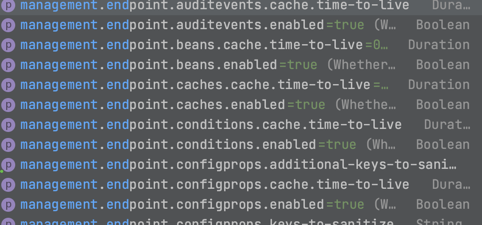
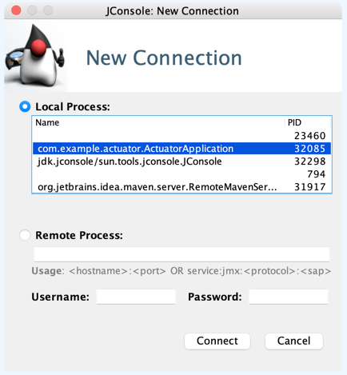
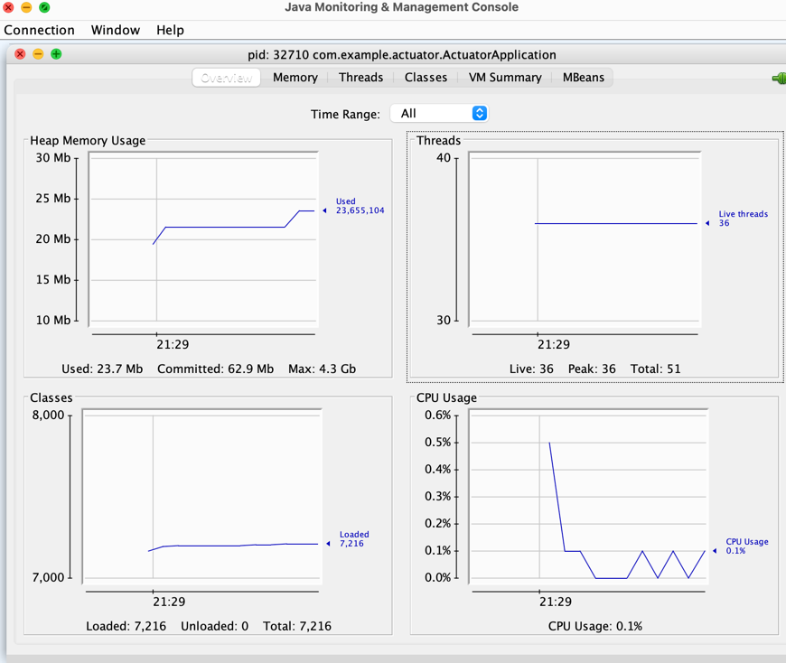
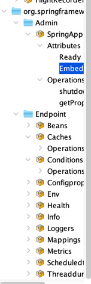

# 스프링 부트 운영
> 스프링 부트가 제공하는 엔드포인트, 메트릭스, 그 데이터를 활용하는 모니터링 기능.


# 📌 Spring Actuator
***

```xml
<dependency>
    <groupId>org.springframework.boot</groupId>
    <artifactId>spring-boot-starter-actuator</artifactId>
</dependency>
```
- ### 엔드포인트
> - auditevents
> - beans
> - conditions : 자동설정 등의 적용
> - health
> - httptrace : 최근 100개의 http 요청, 응답
> - loggers
> - mapping : 컨트롤러 매핑 정보.
> - metrics : 메모리 , cpu 등의 정보.
> - sesstions    
> ...


- #### 엔드포인트 활성화 관리.
```properties
management.endpoint.mappings.enabled=true
```


- #### 엔드포인트 노출
> - 웹은 기본적으로 info, health를 제외한 다른 엔드포인트들을 노출이 되지 않도록 설정되어 있다.
> - JMX를 이용하여 확인.

- ### 1. Jconsole : 모니터링 툴.
> 터미널에서 jconsole로 실행



    👎 connection failed :  -Dcom.sun.management.jmxremote -Dcom.sun.management.jmxremote.local.only=false -Djava.rmi.server.hostname=localhost
        connection lost : java 11 에서 발생하는 문제, 다른 버전으로 변경.




- ### 2. VisualVM
- ### 3. Http
```properties
management.endpoints.web.exposure.include=*
```
> http 에서 모두 확인할 수 있지만 보안상 위험. 특정 유저만 접근 가능하도록 구현이 필요함.


- ### Spring Boot Admin : Actuator UI 제공.
  
- #### 어드민 서버 설정
```xml
<dependency>
    <groupId>de.codecentric</groupId>
    <artifactId>spring-boot-admin-starter-server</artifactId>
    <version>2.4.3</version>
</dependency>
```

```java
// application class 에 추가.
@EnableAdminServer
```

- #### 클라이언트 설정
```xml
<dependency>
    <groupId>de.codecentric</groupId>
    <artifactId>spring-boot-admin-starter-server</artifactId>
    <version>2.4.3</version>
</dependency>
```

```properties
server.port=18080

management.endpoints.web.exposure.include=*
spring.boot.admin.client.url=http://localhost:8080
```