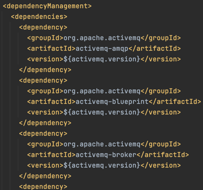

#🧐 스프링 부트란?
********
> - 운영 수준의 스프링 기반 애플리케이션을 빠르고 쉽게 도와준다.
> - 널리 쓰이는 기본 설정을 제공해준다.
> - 스프링 뿐만 아니라 third-party library들에 대한 설정도 지원.
> - 설정을 쉽고 빠르게 변경할 수 있다.
> - xml 설정, code generation을 사용하지 않는다.
> - Java 8 이상부터 지원.

```xml
<parent>
    <groupId>org.springframework.boot</groupId>
    <artifactId>spring-boot-starter-parent</artifactId>
    <version>2.5.2</version>
    <relativePath/> <!-- lookup parent from repository -->
</parent>

<dependencies>
<dependency>
    <groupId>org.springframework.boot</groupId>
    <artifactId>spring-boot-starter-web</artifactId>
</dependency>
<dependency>
    <groupId>org.springframework.boot</groupId>
    <artifactId>spring-boot-starter-test</artifactId>
    <scope>test</scope>
</dependency>
</dependencies>

<build>
<plugins>
    <plugin>
        <groupId>org.springframework.boot</groupId>
        <artifactId>spring-boot-maven-plugin</artifactId>
    </plugin>
</plugins>
</build>
```


#### ☑️스프링 부트 프로젝트 생성기
    -  start.spring.io


# 📜 목차
****
- #### [의존성 관리 이해](#-의존성-관리-이해)
- #### [자동 설정 이해](#-자동-설정-이해)


# 📌 의존성 관리 이해
****

- ### 스프링 부트의 의존성 관리 : 스프링 부트에서 관리하는 의존성 버전을 명시하지 않으면 자동으로 설정해줌.

```xml
spring-boot-starter-parent > spring-boot-dependencies
```

> - 부모(spring-boot-starter-parent)의 부모(spring-boot-dependencies)에서 버전을 관리해준다.
> - 의존성의 설정, 호환되는 버전의 설정을 대신해주기 때문에 편리하다.
> - 스프링 부트에서 관리해주지 않는 의존성의 경우에는 버전을 명시해주는 것이 좋다.
> - 인코딩, 자바 버전 설정. 리소스 필터링, 플러그인 등 다양한 설정 지원.

    🧐 Maven의존성 : MVNRepository


- ### 스프링 부트에서 관리하는 의존성의 버전 변경
```xml
<properties>
    <java.version>11</java.version>
    <spring-framework.version>5.3.7</spring-framework.version>
</properties>
```
> 내 프로젝트의 pom에 properties로 버전을 명시해주면 일괄적으로 변경된다. spring-boot-dependencies에서 찾을 수 있다.


# 📌 자동 설정 이해
