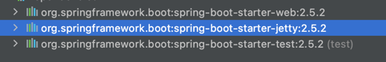
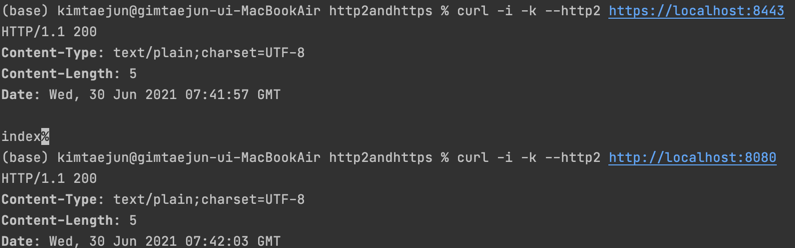

#🧐 스프링 부트란?
********
> - 운영 수준의 스프링 기반 애플리케이션을 빠르고 쉽게 도와준다.
> - 널리 쓰이는 기본 설정을 제공해준다.
> - 스프링 뿐만 아니라 third-party library들에 대한 설정도 지원.
> - 설정을 쉽고 빠르게 변경할 수 있다.
> - xml 설정, code generation을 사용하지 않는다.
> - Java 8 이상부터 지원.

```xml
<parent>
    <groupId>org.springframework.boot</groupId>
    <artifactId>spring-boot-starter-parent</artifactId>
    <version>2.5.2</version>
    <relativePath/> <!-- lookup parent from repository -->
</parent>

<dependencies>
<dependency>
    <groupId>org.springframework.boot</groupId>
    <artifactId>spring-boot-starter-web</artifactId>
</dependency>
<dependency>
    <groupId>org.springframework.boot</groupId>
    <artifactId>spring-boot-starter-test</artifactId>
    <scope>test</scope>
</dependency>
</dependencies>

<build>
<plugins>
    <plugin>
        <groupId>org.springframework.boot</groupId>
        <artifactId>spring-boot-maven-plugin</artifactId>
    </plugin>
</plugins>
</build>
```


#### ☑️스프링 부트 프로젝트 생성기
    -  start.spring.io


# 📜 목차
****
- #### [의존성 관리 이해](#-의존성-관리-이해)
- #### [자동 설정 이해](#-자동-설정autoconfiguration-이해)
- #### [내장 웹 서버의 이해](-내장-웹-서버의-이해)
- #### [독립적으로 실행 가능한 JAR](-독립적으로-실행-가능한-JAR)


# 📌 의존성 관리 이해
****

- ### 스프링 부트의 의존성 관리 : 스프링 부트에서 관리하는 의존성 버전을 명시하지 않으면 자동으로 설정해줌.

```xml
spring-boot-starter-parent > spring-boot-dependencies
```

> - 부모(spring-boot-starter-parent)의 부모(spring-boot-dependencies)에서 버전을 관리해준다.
> - 의존성의 설정, 호환되는 버전의 설정을 대신해주기 때문에 편리하다.
> - 스프링 부트에서 관리해주지 않는 의존성의 경우에는 버전을 명시해주는 것이 좋다.
> - 인코딩, 자바 버전 설정. 리소스 필터링, 플러그인 등 다양한 설정 지원.

    🧐 Maven의존성 : MVNRepository


- ### 스프링 부트에서 관리하는 의존성의 버전 변경
```xml
<properties>
    <java.version>11</java.version>
    <spring-framework.version>5.3.7</spring-framework.version>
</properties>
```
> 내 프로젝트의 pom에 properties로 버전을 명시해주면 일괄적으로 변경된다. spring-boot-dependencies에서 찾을 수 있다.


# 📌 자동 설정(AutoConfiguration) 이해
*****
> @SpringBootApplication
> > - @SpringBootConfiguration  
> > - @ComponentScan :@Component를 가진 bean을 읽어 옴. 해당 애노테이션의 패키지를 시작점으로.  
> > - @EnableAutoConfiguration : 스프링 META-INF > spring_factories
> 
> ComponentScan으로 빈을 읽어오고 EnableAutoConfiguration 으로 추가적인 빈을 읽어온다.

    🧐 @Component를 가진 애노테이션 : @Component, @Configuration, @Repository, @Controller, @RestController, @Service ...

- AutoConfiguration
 
  
- ### 자동설정 만들기 : starter와 AutoConfigure
```java
public class HolomanConfiguration {

    @Bean
    public Holoman holoman(){
        Holoman holoman = new Holoman();
        holoman.setHowLong(5);
        holoman.setName("kim");
        return holoman;
    }
}
```

> 다른 프로젝트에서 Bean을 등록하고 AutoConfiguration을 등록.


> 사용할 프로젝트에서 의존성을 설정하면 이전에 생성한 패키지가 들어온 것을 확인 할 수 있다.
> 


```java
@Component
public class HolomanRunner implements ApplicationRunner {

    @Autowired
    Holoman holoman;

    @Override
    public void run(ApplicationArguments args) throws Exception {
        System.out.println(holoman);

    }
}
```
> 해당 프로젝트에서는 따로 빈의 등록 없이 Autowired로 사용 가능하다.

> #### 👎 문제 : 해당 프로젝트에서 같은 bean을 등록해도 ComponentScan이 먼저 실행된 후에 AutoConfiguration이 실행되기 때문에 프로젝트에서 빈을 오버라이딩 할 수 없다.

> #### 👍 해결 :
> 1. 패키지에서 빈을 등록할 때 @ConditionalOnMissingBean 애노테이션을 달아두면 사용하는 프로젝트에서 이 Bean이 존재하지 않을때만 등록하게 된다.
> 2. properties 이용.
> > - @ConfigurationProperties
> > - @EnableConfigurationProperties
 

- ### 자동설정 만들기 : properties를 사용하여 bean 변경.
```xml
<dependency>
    <groupId>org.springframework.boot</groupId>
    <artifactId>spring-boot-configuration-processor</artifactId>
    <optional>true</optional>
</dependency>
```

```java
@ConfigurationProperties("holoman")
public class HolomanProperties {
    private String name;
    private int howLong;

    public int getHowLong() {
        return howLong;
    }

    public void setHowLong(int howLong) {
        this.howLong = howLong;
    }

    public String getName() {
        return name;
    }

    public void setName(String name) {
        this.name = name;
    }
}
```

```java
@Configuration
@EnableConfigurationProperties(HolomanProperties.class)
public class HolomanConfiguration {

    @Bean
    @ConditionalOnMissingBean
    public Holoman holoman(HolomanProperties properties){
        Holoman holoman = new Holoman();
        holoman.setHowLong(properties.getHowLong());
        holoman.setName(properties.getName());
        return holoman;
    }
}
```
> AutoConfiguration의 대상이 되는 패키지에서 properties를 사용하도록 설정. application.properties에서 holoman을 찾아 각 값을 set 해두고  Configuration 클래스에서 값을 빈에 주입한다.

```properties
holoman.name = ttt
holoman.howLong = 99
```
> 사용하는 프로젝트에서는 빈의 재정의 없이 properties만을 설정하여 bean의 값을 변경할 수 있다.


# 📌 내장 웹 서버의 이해
****
> 내장 서블릿 컨테이너

- #### 스프링 부트는 서버가 아니다.
> 1. 톰캣 객체 생성.
> 2. 포트 설정.
> 3. 톰캣에 컨텍스트 추가.
> 4. 서블릿 만들기.
> 5. 톰캣에 서블릿 추가.
> 6. 컨텍스트에 서블릿 매핑.
> 7. 톰캣 실행 및 대기.

```java
Tomcat tomcat = new Tomcat();
tomcat.setPort(8080);

Context context = tomcat.addContext("/", "/");


HttpServlet servlet = new HttpServlet() {
  @Override
  protected void doGet(HttpServletRequest req, HttpServletResponse resp) throws ServletException, IOException {
      PrintWriter writer = resp.getWriter();
      writer.println("<html><head><title>");
      writer.println("hello tomcat");
      writer.println("</title></head/>");
      writer.println("</html>");
  }
};
String servletName = "helloServlet";
tomcat.addServlet("/",servletName, servlet);
context.addServletMappingDecoded("/hello",servletName);

tomcat.start();
tomcat.getServer().await();
```

> 스프링 부트에서는 위의 과정을 유연하게 설정하고 실행하게 해준다.
> > - ServletWebServerFactoryAutoConfiguration(서블릿 웹 서버 생성.)
> > - TomcatServerFactoryAutoConfiguration(서버 커스터마이징.)
> > - DispatcherServletAutoConfiguration(서블릿 만들고 등록.)


- ### 스프링에서 다른 내장 웹 서버 사용하기.

```xml
 <exclusions>
 <exclusion>
  <groupId>org.springframework.boot</groupId>
  <artifactId>spring-boot-starter-tomcat</artifactId>
 </exclusion>
</exclusions>
```
> spring-boot-starter-web은 기본적으로 tomcat을 넣어주기 때문에 이를 제외시킨다.

```xml
<dependency>
    <groupId>org.springframework.boot</groupId>
    <artifactId>spring-boot-starter-jetty</artifactId>
</dependency>
```
> 다른 내장 웹 서버 의존성 추가. jetty, undertow ...
>


- ### 스프링에서 다른 내장 웹 서버 사용하지 않기.

```properties
spring.main.web-application-type=none
```

- ### 포트 변경
```properties
server.port = 8081

#random port
server.port = 0
```

- ### 포트 알아내기 (ApplicationListener)
```java
@Component
public class PortListener implements ApplicationListener<ServletWebServerInitializedEvent> {
    @Override
    public void onApplicationEvent(ServletWebServerInitializedEvent servletWebServerInitializedEvent) {
        ServletWebServerApplicationContext context = servletWebServerInitializedEvent.getApplicationContext();
        System.out.println(context.getWebServer().getPort());
    }
```

## HTTPS와 HTTP2

### 1. HTTPS

1. keystore 생성.
```shell
 keytool -genkey -alias spring -storetype PKCS12 -keyalg RSA -keysize 2048 -keystore keystore.p12 -validity 4000
```

2.properties 설정
```properties
server.ssl.key-store=classpath:keystore.p12
server.ssl.key-store-type=PKCS12
server.ssl.key-store-password=123123
server.ssl.key-alias=spring
```

3. https로 접속.


### Https, Http 같이 사용하기. (Connector 생성.)
```java
@Bean
public ServletWebServerFactory serverFactory(){
    TomcatServletWebServerFactory tomcat = new TomcatServletWebServerFactory();
    tomcat.addAdditionalTomcatConnectors(createStandardConnector());
    return tomcat;
}

private Connector createStandardConnector() {
    Connector connector = new Connector("org.apache.coyote.http11.Http11NioProtocol");
    connector.setPort(8080);
    return connector;
}
```


### 2.Http2 사용하기.
```properties
server.http2.enabled=true
```

> - Tomcat 을 사용할 경우 9.0.x 버전 사용, java9 이상 사용. (이하의 버전 사용시 설정이 복잡.) 
> - 또는 undertow를 사용하면 별다른 설정이 필요하지 않다.
> 


# 📌 독립적으로 실행 가능한 JAR
*****
> - mvn package를 하면 실행 가능한 JAR 파일 하나가 생성 됨.
> - spring boot의 전략.
> > - 내장 JAR : 기본적으로 자바에는 내장 JAR을 로딩하는 표준이 없음.
> > - 애플리케이션 클래스와 라이브러리 위치 구분(라이브러리도 각각 JAR로 관리됨)
> > - org.springframework.boot.loader.jar.JarFile 을 사용해서 내장 JAR을 읽음. 
> > - org.springframework.boot.loader.Launcher을 사용해서 실행.


