# 🔑 활용 소개.

> ### 스프링 부트 핵심 기능.
> > - SpringApplication
> > - 외부 설정
> > - 프로파일
> > - 로깅
> > - 테스트
> > - Spring-Dev-Tools

> ### 각종 기술 연동
> > - 스프링 웹 MVC
> > - 스링 데이터
> > - 스프링 시큐리티
> > - REST API 클라이언트

# 📜 목차

****

- #### [SpringApplication](#-springapplication)
- #### [외부 설정](#-외부-설정)
- #### [Profile](#-profile)
- #### [Logging](#-logging)
- #### [Test](#-test)
- #### [Spring Boot Devtools](#-Spring-Boot-Devtools)
- #### [스프링 웹 MVC](#-스프링-웹-mvc)

    - [Http Message Converters](#-httpmessageconverters)
    - [View Resolve](#-viewresolve)
    - [정적 리소스 자원](#-정적-리소스-자원)
    - [웹 JAR](#-웹-jar)
    - [index 페이지와 파비콘](#-index-페이지와-파비콘)
    - [Thymeleaf](#-thymeleaf)
    - [HtmlUnit](#-htmlunit)
    - [Exception Handler](#-exceptionhandler)
    - [Cross Origin Resource Sharing](#-Cross-Origin-Resource-Sharing)
    
- #### [스프링 데이터](#-스프링-데이터)

    - [Inmemory Database](#-inmemory-database)
    - [MySQL](#-mysql)
    - [PostgreSQL](#-postgresql)
    - [Spring Data JPA](#-spring-data-jpa)
    - [데이터 베이스 초기화](#-데이터베이스-초기화)
    - [Database Migration](#-database-migration)
    
- #### [Spring Security](#-spring-security)
- #### [Spring REST Client](#-spring-rest-client)

# 📌 SpringApplication

****

- ### FailureAnalizer : 오류 메시지 커스텀.


- ### 배너

> - resource에 banner.txt | gif | jpg | png 를 추가하여 변경.
> - spring.banner.location 을 이용하여 banner파일 위치 설정 가능.
> - ${spring-boot.version} 등의 변수를 사용할 수 있다.
> - Banner 클래스를 구현하고 SpringApplicaiton.setBanner()로 설정 가능.
> - SpringApplication.setBannerMode(Banner.Mode.OFF)

- ### SpringApplicationBuilder()

```java
new SpringApplicationBuilder()
    .sources(SpringApplication.class)
    .run(args);
```

- ### ApplicationEvents

```java
@Component
public class SampleListener implements ApplicationListener<ApplicationStartingEvent> {

    @Override
    public void onApplicationEvent(ApplicationStartingEvent applicationStartingEvent) {
        System.out.println("==========================");
        System.out.println("Application is Starting");
        System.out.println("==========================");
    }
}
```

> ApplicationContext가 만들어지기 전의 이벤트 -> Bean으로 등록해도 Listener가 동작하지 않는다.

```java
SpringApplication app = new SpringApplication(ApplicationeventsApplication.class);
        app.addListeners(new SampleListener());
        app.run(args);
```

> Listener를 수동으로 추가해준다.

- ### WebApplicationType 설정.

```java
SpringApplication app = new SpringApplication(ApplicationeventsApplication.class);
app.setWebApplicationType();
```

> - WebApplicationType.SERVELET : WebMVC
> - WebApplicationType.REACTIVE : WebMVC가 없고 WebFlux만 존재할 때.
> - WebApplicationType.NONE : 둘 다 없을 때.

- ### 애플리케이션 argument 사용하기.

> - Program arguments : --

```java
@Component
public class PrintArgs {

    public PrintArgs(ApplicationArguments applicationArguments){
        System.out.println(applicationArguments.containsOption("bar"));
    }
}
```

> ☝️ Bean에 생성자가 한개고, 그 생성자의 파라미터가 Bean일 경우 자동으로 주입.

- ### 애플리케이션 실행 후 실행 (ApplicaiontRunner)

> - implements ApplicationRunner
> - @Order()로 우선순위 가능.

# 📌 외부 설정

****

- ### 사용할 수 있는 외부 설정

> - properties
> - YAML
> - 환경 변수
> - 커맨드 라인 argument

- ### ☝️ 프로퍼티 우선순위

> 1. 유저 홈 디렉토리에 있는 spring-boot-dev-tools.properties
> 2. 테스트에 있는 @TestPropertySource
> ```java
>- @TestPropertySource(locations = "classpath:/test.properties")
>``` 
>
> 3. @SpringBootTest 애노테이션의 properties 애트리뷰트.
> ```java
>- @SpringBootTest(properties = "bigave.name=kimtaejun2")
>``` 
> 4. 커맨드라인 argument
     > ``` - java -jar ... --bigave.name=kim ```
> 5. SPRING_APPLICATION_JSON(환경 변수 또는 시스템 프로퍼티에 들어있는 프로퍼티)
> 6. ServletConfig 파라미터.
> 7. ServletContext 파라미터.
> 8. java:comp/env JNDI 애트리뷰트.
> 9. System.getProperties() 자바 시스템 프로퍼티.
> 10. OS 환경 변수
> 11. RandomValuePropertySource ( ${random.int[start,end]})
> 12. JAR 밖에 있는 특정 프로파일용 application.properties
> 13. JAR 안에 있는 특정 프로파일용 application.properties
> 14. JAR 밖에 있는 application.properties
> 15. JAR 안에 있는 application.properties
> 16. @PropertySource


> 👎 test 디렉토리에 application.properties를 생성하면, Test 수행시 먼저 main을 빌드하여 클래스 패스에 추가하고,
> test를 빌드하여 추가하기 때문에 main의 properties 파일이 test의 properties 파일로 덮어진다.     
> 이 때, test properties에서 main properties의 값을 누락하고, 해당 값을 main이나 test에서 사용하게 되면 빌드하는 과정에서 값을 찾을 수 없어 오류가 발생한다.

> 👍 test properties 파일을 생성하지 않고 ,@TestPropertySource 나, @SpringBootTest의 properties 속성을 사용한다.

> - application.properties 우선순위.
> > 1. file:./config/ (project root/config/)
> > 2. file:./
> > 3. classpath:/config/
> > 4. classpath:/

- ### 타입-세이프 프로퍼티 @ConfigurationProperties

> - 여러 프로퍼티를 묶어서 읽어올 수 있음.
> - 빈으로 등록해서 다른 빈에 주입할 수 있음.
> > - @EnableConfigurationProperties(properties.class)
> > - @Component
> > - @Bean
> - 융통성 있는 바인딩(프로퍼티를 네이밍 할 때 아래는 모두 같게 바인딩 됨.)
> > - context-path(케밥)
> > - context_path(언더스코어)
> > - contextPath(카멜)
> > - CONTEXTPATH
> - 프로퍼티 타입 컨버전(String(100) - int(100) , String(25s) - Duration(PT25s) ...)
> - 프로퍼티 값 검증(@Validated, JSR-303(@NotNull, ...))

```properties
bigave.name = taejun
bigave.age = ${random.int[0,100]} 
```

```java
@Component
@ConfigurationProperties("bigave") //key 
public class BigaveProperties {

    String name;
    int age;

    public int getAge() {
        return age;
    }
    public void setAge(int age) {
        this.age = age;
    }
    public String getName() {
        return name;
    }
    public void setName(String name) {
        this.name = name;
    }
}
```

```xml
<dependency>
    <groupId>org.springframework.boot</groupId>
    <artifactId>spring-boot-configuration-processor</artifactId>
    <optional>true</optional>
</dependency>
```

> @ConfigurationProperties를 사용하기 위한 의존성.

```java
@Autowired
BigaveProperties bigaveProperties;

@Override
public void run(ApplicationArguments args) throws Exception {
        System.out.println(bigaveProperties.getName);
        System.out.println(bigaveProperties.getAge);
}
```

# 📌 Profile

****

> - @Profile 애노테이션은 어디에 붙이나?
>```
> @Configuration
> @Component
>```
> - 프로 파일 활성화.
>```properties
>spring.profiles.active= ...
>```
> - 프로 파일용 프로퍼티
>```
> application-{profile}.properties
>```
> - 프로 파일 추가.
>```properties
>spring.profiles.include= ...
>```

```java
@Profile("prod")
@Configuration
public class BaseConfiguration {

    @Bean
    public String hello(){
        return "hello prod";
    }
}
```

```properties
spring.profiles.active=prod
spring.profiles.include=proddb
```

> 프로파일은 prod로 설정, 해당 properties 파일이 읽힐 때 proddb를 추가한다.


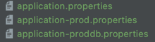
> - 우선순위
> > avtivate 프로파일 프로퍼티 > include 된 프로파일 프로퍼티(늦게 추가된 것이 덮어 씀.) > application.properties

# 📌 Logging

****
> - 스프링 부트는 기본적으로는 Commons Logging을 사용하지만 결국에는 SLF4j(Simple Logging Facade4java)를 거쳐 -> Logback을 사용하게 된다.
> - SLF4j는 로거 API를 추상화 해둔 Interface.
> - SLF4j를 사용할 때의 장점 : 구현체인 JUL, Log4J2, Logback 등으로 사용 가능.
> - Spring-JCL : Commons Logging -> SLF4j or Log4j2(SLF4j가 없을 때.)


> - --debug : embedded container, Hibernate, Spring Boot와 같은 일부 핵심 라이브러리만 디버깅 모드로.
> - --trace : 전부 디버깅 모드로.
> - 파일 출력 : logging.file(파일) | logging.path(디렉토리)
> - 로그 레벨 : logging.level.패키지 = 로그 레벨 (DEBUG,INFO ...)

```java
@Component
public class AppRunner implements ApplicationRunner {

    Logger logger = LoggerFactory.getLogger(AppRunner.class);

    @Override
    public void run(ApplicationArguments args) throws Exception {
        logger.debug("====================================");
        logger.debug("logger.debug");
        logger.debug("====================================");
    }
}
```

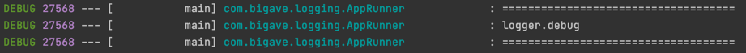

- ### 커스텀 로그 설정 파일 사용하기.

> - Logback-spring.xml
> - Log4J2 : log4j2-spring.xml
> - JUL : logging.properties
> - Logback extension
> > - 프로파일 : \<springProfile name="프로파일"> --> 해당 프로파일에만 적용.

```xml
<?xml version="1.0" encoding="UTF-8" ?>
<springProfile name ="test">
    <configuration>
        <include resource="org/springframework/boot/logging/logback/base.xml"/>
        <logger name="com.bigave.logging" level="DEBUG"/>
    </configuration>
</springProfile>
```

> - 프로파일이 test일 경우에만 패키지의 로그 레벨을 DEBUG로 설정.

- 로거를 Log4j2로 변경하기

> spring-boot-starter-logging을 exclusion 시키고 spring-boot-starter-log4j2 의존성을 추가.

# 📌 Test

****
> spring-boot-starter-test 의존성 test scope로 추가.

- ### @SpringBootTest

> - @RunWith(SpringBootRunner.class)
> - @SpringBootApplicaiton 부터 알아서 빈을 찾아 등록해줌.
> - webEnvironment
> > - MOCK : mock servlet environment (default), 내장 톰캣 구동 안함.
> > - RANDOM_PORT, DEFINE_PORT : 내장 톰캣 사용.
> > - NONE : servlet 환경 제공 안함.

#### 1. MockMvc를 이용한 테스트.

```java
@RunWith(SpringRunner.class)
@SpringBootTest(webEnvironment = SpringBootTest.WebEnvironment.MOCK)
@AutoConfigureMockMvc
public class SampleControllerTest {

    @Autowired
    MockMvc mockMvc;

    @Test
    public void hello() throws Exception {
        mockMvc.perform(get("/hello"))
                .andExpect(status().isOk())
                .andExpect(content().string("hello taejun"))
                .andDo(print());
    }
}
```

> @AutoConfigurationMockMvc 애노테이션을 이용하여 @Autowired로 MockMvc를 주입받는 방법이 가장 간편.

#### 2. TestRestTemplate를 이용한 테스트.

```java

@RunWith(SpringRunner.class)
@SpringBootTest(webEnvironment = SpringBootTest.WebEnvironment.RANDOM_PORT)
public class SampleControllerTest {
    
    @Autowired
    TestRestTemplate testRestTemplate;

    @MockBean
    SampleService mockSampleService;

    @Test
    public void restHello(){
        when(mockSampleService.getName()).thenReturn("kimtaejun");

        String result = testRestTemplate.getForObject("/hello", String.class);

        assertThat(result).isEqualTo("hello kimtaejun");
    }
```

> - Random_port로 실제로 servlet을 띄우는 테스트.
> - Controller만 테스트 하고 싶은데 service까지 테스트하게 되어 테스트가 너무 큰 문제가 있다.
> - Service 클래스만 Mock로 생성하여 사용하여 해결.

#### 3. WebTestClient를 이용한 테스트.

```xml
<dependency>
    <groupId>org.springframework.boot</groupId>
    <artifactId>spring-boot-starter-webflux</artifactId>
</dependency>
```

```java
@Autowired
WebTestClient webTestClient;

 @Test
public void clientHello(){
    when(mockSampleService.getName()).thenReturn("kimtaejun");

    webTestClient.get().uri("/hello").exchange()
            .expectStatus().isOk()
            .expectBody(String.class).isEqualTo("hello kimtaejun");
}
```

> Asynchronized

- ### 슬라이스 테스트.

> - @JsonTest
> - @WebMvcTest(controller.class) : 웹과 관련된 Bean 들만 등록. @Controller, Converter, @JsonComponent ...    
    > @Repository, @Service와 같은 Bean들은 등록되지 않는다. --> @MockBean으로 채워줘야 함.
> - WebFluxTest
> - DataJpaTest : @Repository bean 등록.

- ### 테스트 유틸.

> - OutputCapture : 로그를 비롯한 콘솔의 모든것을 캡쳐.

# 📌 Spring Boot Devtools

****

```xml
<dependency>
    <groupId>org.springframework.boot</groupId>
    <artifactId>spring-boot-devtools</artifactId>
</dependency>
```

> - 캐시 설정을 개발 환경에 맞게 설정해 줌.
> - 클래스 패스에 있느 파일이 변경될 때 마다 자동으로 재시작.
> > - 직접 리스타트(cold start)보다 빠름. --> 스프링은 base class loader, restart class loader 나뉨.
> > - 리스타트 하고 싶지 않은 리소스 : spring.devtools.restart.exclude
> > - 리스타트 기능 끄기 : spring.devtools.restart.enabled = false
> - 라이브 리로드 : 리스타트 후 자동으로 브라우저 리프레쉬. --> 브라우저 플러그인 설치 필요.
> > 라이브 리로드 끄기 : spring.devtools.liveload.enabled = false

# 📃 <mark style="background-color:#fff5b1">스프링 웹 MVC<mark>

****
> - 스프링 부트 MVC : 자동 설정으로 제공하는 여러 기본 기능.
> - 스프링 MVC 확장 : @Configuration + WebMvcConfigure interface
> - 스프링 MVC 재정의 : @Configuration + @EnableWebMvc

# 📌️ HttpMessageConverters
***

> HTTP 요청 본문을 객체로 변경하거나, 객체를 HTTP 응답 본문으로 변경할 때 사용.    
> {"username" : "taejun", "password":"aa123"} <--> User
> - @ResponseBody, @RequestBody
> - 기본적으로 컴포지션 타입일 경우에는 JsonMessageConverter가 사용됨.

````java
@PostMapping("/users/create")
public User create(@RequestBody User user){
      return user;
}
````

> - @RestController 를 사용하는 경우는 @ResponseBody는 생략해도 됨.
> - @Controller 를 사용하는 경우에는 @ResponseBody가 없다면 View를 찾게 된다.
> - User Class에는 자바 빈 규약에 따라 각 매핑 필드의 Getter, Setter가 존재해야 한다.

```java
@Test
public void createuser_JSON() throws Exception {
    String userJson = "{\"userName\":\"Taejun\", \"password\":\"aaa123\"}";
    mockMvc.perform(post("/users/create")
        .contentType(MediaType.APPLICATION_JSON)
        .accept(MediaType.APPLICATION_JSON)
        .content(userJson))
            .andExpect(status().isOk())
            .andExpect(jsonPath("$.userName", is(equalTo("Taejun"))));
}
```

# 📌 ViewResolve
****

> ContentNegotiatingViewResolver
> - 어떤 타입의 본문 형식을 원하는지.
> - 대표적으로 accept 헤더.

```java
String userJson = "{\"userName\":\"Taejun\", \"password\":\"aaa123\"}";
      mockMvc.perform(post("/users/create")
      .contentType(MediaType.APPLICATION_JSON)
      .accept(MediaType.APPLICATION_XML)
      .content(userJson))
      .andExpect(status().isOk())
      .andExpect(xpath("/User/userName").string("Taejun"));
```

- XML 메시지 컨버터 의존성 추가.

```xml
<dependency>
    <groupId>com.fasterxml.jackson.dataformat</groupId>
    <artifactId>jackson-dataformat-xml</artifactId>
</dependency>
```

# 📌️ 정적 리소스 자원
****

> 이미 만들어진 리소스를 제공하는 방법.

- #### 정적 리소스 맵핑 "/**"

> 기본 리소스 위치
> - classpath:/static -- > ex) /hello.html ==> /static/hello.html
> - classpath:/public
> - classpath:/resources/
> - classpath:/META_INF/resources
> - spring.mvc.static-path-pattern : 매핑 설정 변경 가능.    
    > ex) spring.mvc.static-path-pattern=/resource/** -->  /static/hello.html 로 요청해야 함.
> - spring.mvc.static-locations : 리소스 찾을 위치 변경 가능. --> 기존 찾을 위치를 모두 사용할 수 없게 됨.


> 👍 ResourceHttpRequestHandler
> - WebMvcConfigurer의 addResourceHandlers로 커스텀 가능.

```java
@Configuration
public class WebConfig implements WebMvcConfigurer {

    @Override
    public void addResourceHandlers(ResourceHandlerRegistry registry) {
        registry.addResourceHandler("/m/**")
                .addResourceLocations("classpath:/m/")
                .setCachePeriod(20);
    }
}
```

> /m/hello.html 로 접속 가능.

# 📌️ 웹 JAR
****

> - jar파일 의존성 추가하여 사용.(css, jquery 등 ..)
> - 웹 JAR 매핑 "/webjars/**"
> - 버전 생략 : webjars-locator-core 의존성 추가.

# 📌️ Index 페이지와 파비콘
****

- 웰컴 페이지

> - index.html 찾아 본 후 존재한다면 사용.
> - index 템플릿 찾아보고 있으면 사용.
> - 둘 다 존재하지 않으면 스프링에서 제공하는 에러 페이지를 보여 줌.

- 파비콘

> - favicon.ico
> - 파비콘 만들기 https:/favicon.io/

# 📌 Thymeleaf
***

- 스프링 부트가 자동 설정을 지원하는 템플릿 엔진

> - FreeMarker
> - Groovy
> - Thymeleaf
> - Mustache

- JSP를 권장하지 않는 이유?

> - JAR 패키징 할 때는 동작하지 않고 , WAR 패키징을 해야 함.
> - Undertow는 JSP를 지원하지 않음.

- ### Thymeleaf 사용하기

> - https://www.thymeleaf.org/
> - https://www.thymeleaf.org/doc/articles/standarddialect5minutes.html

```html
<!DOCTYPE html>
<html lang="en" xmlns:th = "http://www.thymeleag.org">
<head>
    <meta charset="UTF-8">
    <title>Hello</title>
</head>
<body>
    <h1 th:text="${hello}"></h1>
</body>
</html>
```

```java
@RunWith(SpringRunner.class)
@WebMvcTest(SampleController.class)
public class SampleControllerTest {

    @Autowired
    MockMvc mockMvc;

    @Test
    public void hello() throws Exception {

        mockMvc.perform(get("/"))
                .andExpect(status().isOk())
                .andExpect(view().name("index"))
                .andExpect(model().attribute("hello","hello"))
                .andExpect(content().string(containsString("hello")))
                .andDo(print());
    }
}
```

> - view()로 해당 view file name 확인 가능.
> - model().attribute() 로 값 테스트 가능.

# 📌 HtmlUnit
****

```xml
<dependency>
    <groupId>org.seleniumhq.selenium</groupId>
    <artifactId>htmlunit-driver</artifactId>
    <scope>test</scope>
</dependency>
<dependency>
    <groupId>net.sourceforge.htmlunit</groupId>
    <artifactId>htmlunit</artifactId>
    <scope>test</scope>
</dependency>
```

- HtmlUnit : HTML 템플릿 뷰 테스트를 보다 전문적으로.

```java
import com.gargoylesoftware.htmlunit.WebClient;
import com.gargoylesoftware.htmlunit.html.HtmlHeading1;
import com.gargoylesoftware.htmlunit.html.HtmlPage;


@Autowired
WebClient webClient;

@Test
public void htmlUnitHello() throws IOException {
        HtmlPage page = webClient.getPage(("/"));
        HtmlHeading1 h1 = page.getFirstByXPath("//h1");

        assertThat(h1.getTextContent()).isEqualTo("hello");
}
```

# 📌 ExceptionHandler

****

- ### 스프링 부트의 기본 예외 처리기

> BasicErrorController : HTML과 JSON 응답 지원.

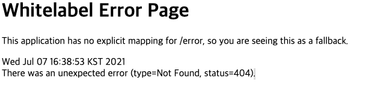

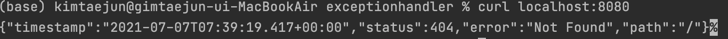

- ### Custom Error

> ErrorController 구현

```java
@RestController
public class SampleController {

    @GetMapping("/MyError")
    public String error(){
        throw new CustomException();
    }

    @ExceptionHandler(CustomException.class)
    public AppError sampleError(CustomException e){
        AppError appError = new AppError();
        appError.setMessage("app.error.key");
        appError.setReason("일부러 발생.");

        return appError;
    }
}
```

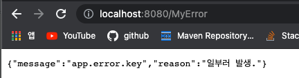

- ### 상태 코드에 따른 에러 페이지.

> src/main/resources/staric | template /error/
> > 404.html, 5xx.html

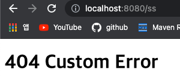

# 📌 Cross Origin Resource Sharing

****

- ### 스프링 MVC에서 지원하는 Single-Origin Policy(SOP)를 우회하기 위한 표준 기술.

    🧐 Origin : URL 스키마(http,https), HostName, Port를 조합한 것.

- ### 스프링 MVC @CrossOrigin
> Server는 18080포트, Client는 8080 포트로 설정.


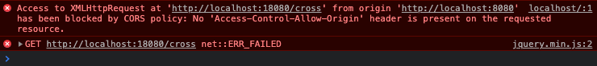

### 1. @CrossOrigin
```java
@CrossOrigin("http://localhost:8080")
@GetMapping("/cross")
public String cross(){
    return "Hello Cross Server";
}
```


### 2. WebMvcConfigurer
```java
@Configuration
public class WebCofiguration implements WebMvcConfigurer {

    @Override
    public void addCorsMappings(CorsRegistry registry) {
        registry.addMapping("/cross") // 전부: /**
        .allowedOrigins("http://localhost:8080");

    }
}

```


# 📃 <mark style="background-color:#fff5b1">스프링 데이터<mark>
*****

# 📌 Inmemory Database
****

```java
@Autowired
DataSource dataSource;

@Autowired
JdbcTemplate jdbcTemplate;

@Override
public void run(ApplicationArguments args) throws Exception {

    try(Connection connection = dataSource.getConnection()){
        System.out.println(connection.getMetaData().getUserName());
        System.out.println(connection.getMetaData().getURL());

        Statement statement = connection.createStatement();
        String sql = "CREATE TABLE USER(ID INTEGER  NOT null, name Varchar(255), PRIMARY Key(ID))";
        statement.executeUpdate(sql);
    }

    jdbcTemplate.execute("INSERT into user values (1, 'taejun')");
}
```
> JdbcTemplate를 사용하면 간결하게 작성가능, 예외의 가독성이 좋음. 리소스 반납처리가 잘 되어있음.

```properties
spring.h2.console.enabled=true
spring.datasource.url=jdbc:h2:mem:testdb
spring.jpa.show-sql=true
```

# 📌 MySQL
***
- ### DBCP
> spring 에서는 기본적으로 HikariCP 라는 DBCP를 지원.
> 이 외 : Tomcat CP, Commons DBCP2

#### DBCP 설정
```properties
spring.datasource.hikari.connection-timeout=30000
spring.datasource.hikari.auto-commit=true
spring.datasource.hikari.maximum-pool-size=10
...
```

- ### MySQL 커넥터 의존성 추가.
```xml
<dependency>
    <groupId>mysql</groupId>
    <artifactId>mysql-connector-java</artifactId>
</dependency>
```

- ### MySQL 도커로 추가.

```
docker run -p 3306:3306 --name mysql_boot -e MYSQL_ROOT_PASSWORD=1 -e MYSQL_USER=kim -e MYSQL_DATABASE=springboot -e MYSQL_PASSWORD=pass -d mysql

docker exec -i -t mysql_boot bash

mysql -u root -p
```

- ### MySQL용 DataSource 설정
```properties
spring.datasource.url=jdbc:mysql://localhost:3306/springboot?useSSL=false
spring.datasource.username=kim
spring.datasource.password=pass
```

# 📌 PostgreSQL
***
```xml
<dependency>
    <groupId>org.postgresql</groupId>
    <artifactId>postgresql</artifactId>
</dependency>
```

- ### PostgreSQL 도커로 추가.

```
docker run -p 5432:5432 --name postgres_boot -e POSTGRES_USER=kim -e POSTGRES_DB=springboot -e POSTGRES_PASSWORD=pass -d postgres

docker exec -i -postgres_boot bash

su -postgres

psql springboot

// 데이터 베이스 조회
\list

테이블 죄회
\dt
```

- ### DataSource 설정
```properties
spring.datasource.url=jdbc:postgresql://localhost:5432/springboot
spring.datasource.username=kim
spring.datasource.password=pass
```


# 📌 Spring Data JPA
***
### ORM(Object-Relational Mapping)과 JPA(Java Persistence API)
    - 객체와 릴레이션을 매핑할 때 발생하는 개념적 불일치를 해결하는 프레임워크.
    - JPA : ORM을 위한 자바 표준

> Spring Data JPA -> JPA -> Hibernate -> DAtasource

- 의존성 추가
```xml
<dependency>
    <groupId>org.springframework.boot</groupId>
    <artifactId>spring-boot-starter-data-jpa</artifactId>
</dependency>
```
```java
public interface AccountRepository extends JpaRepository<Account, Long> {
    List<Account> findByUserName(String userName);
}
```

```java
@RunWith(SpringRunner.class)
@DataJpaTest
//@SpringBootTest(properties = "spring.datasource.url=jdbc:h2:mem:testdb")
public class AccountRepositoryTest {
    @Autowired
    DataSource dataSource;
    @Autowired
    JdbcTemplate jdbcTemplate;
    @Autowired
    AccountRepository accountRepository;

    @Test
    public void di() throws SQLException {
        try(Connection connection = dataSource.getConnection()){
            System.out.println(connection.getMetaData().getURL());
            System.out.println(connection.getMetaData().getDriverName());
        }
        Account account = new Account();
        account.setPassword("123");
        account.setUserName("kim");

        accountRepository.save(account);
        List<Account> results = accountRepository.findByUserName("kim");
        assertThat(results.get(0).getUserName()).isEqualTo("kim");
    }
}
```
- Datasource, JdbcTemplate 또한 주입 가능.

- @SpringBootTest를 이용하여 통합 테스트를 진행하게 되면 Test용 DB가 아닌 운영 DB가 사용되게 됨.
- @SpringBootTest(properties = "spring.datasource.url=")로 오버라이딩 하여 DB를 변경할 수 있다. 

# 📌 데이터베이스 초기화
***

- ## Schema의 자동 생성
### 1. properties 설정.
```properties
spring.jpa.hibernate.ddl-auto=update
spring.jpa.generate-ddl=true
```
- update : 기존의 것은 두고, 추가된 것만 생성.
- create : 전부 drop한 후 새로 생성.
- create-drop : 새로 생성한 후, 종료될 때 모두 drop

### 2.스크립트를 이용한 설정.
- resource/schema.sql :  테이블 생성하는 스크립트.
- resource/data.sql : 초기 데이터.


- ## Schema 검증
```properties
spring.jpa.hibernate.ddl-auto=validate
spring.jpa.generate-ddl=false #(default)
```
:: 엔티티와 릴레이션 DB가 매핑할 수 있는 상황인지 검증. 매핑할 수 없다면 에러발생. 


# 📌 Database Migration
****
> Schema의 버전관리.   
> 마이그레이션 툴 : Flyway, Liquibase

- ### Flyway 의존성 추가.
```xml
<dependency>
        <groupId>org.flywaydb</groupId>
        <artifactId>flyway-core</artifactId>
</dependency>
```


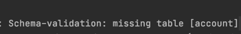
> 테이블을 모두 지우고 validate로 실행시 table이 없어 에러 발생.

- ### 마이그레이션 디렉토리
    - db/migration or db/migration/{vender}
    - spring.flyway.location으로 위치 변경 가능.

- ### 마이그레이션 파일 이름.
    - V숫자__이름.sql : V는 꼭 대문자, 숫자는 순차적, 언더바 두개, 이름은 가능한 서술적으로.

#### -- V1__init.sql
```sql
create sequence hibernate_sequence start with 1 increment by 1;
create table account (id int8 not null, password varchar(255), user_name varchar(255), primary key (id));
```
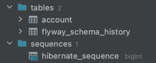

> 테이블을 생성해주며 검증 성공.
> - flyway_schema_history : flyway가 자신의 정보를 관리하는 테이

#### -- column 추가. (V2__add_account_active.sql)
```sql
ALTER TABLE account ADD COLUMN active BOOLEAN;
```


# 📌 Spring Security
****
- ### 의존성 추가
```xml
<dependency>
    <groupId>org.springframework.boot</groupId>
    <artifactId>spring-boot-starter-security</artifactId>
</dependency>
```

- ### 스프링 시큐리티
  - 웹 시큐리티
  - 메소드 시큐리티
  - 다양한 인증 밥법 지원 : LDAP, 폼 인증, Basic 인증, OAuth, ...
  

- ### 스프링 부트 시큐리티 자동 설정
  - SecurityAutoConfiguration : 사실상 spring boot 에서 변경한 부분은 별로 없다.
  - UserDetatilsSeviceAutoConfiguration :
    > UserDetailsService.class, AuthenticationManager.class, AuthenticationProvider.class 가 없을 때 설정 파일이 적용되고, 
    랜덤한 유저를 생성해 준다.

- ### 기본 사용자.
  - UserName : user
  - password : application을 실행 할 때 마다 생성되는 랜던 값(console에 출력됨.)
  - spring.security.username
  - spring.security.password
  

- ## 스프링 시큐리티 Test
```xml
<dependency>
    <groupId>org.springframework.security</groupId>
    <artifactId>spring-security-test</artifactId>
</dependency>
```

### 1. method
```java
mockMvc.perform(get("/hello")
                .with(user("kim").password("1234"))
```
> 가짜 인증 유저를 넣어주어, 권한이 없어 실행할 수 없는 테스트를 실행할 수 있게 해준다.

### 2. Annotation
```java
@WithMockUser
class or Method
```
> 유저 정보를 직접 넣어주어 테스트.


# 📌 Spring Security Custom
***

## 1. extends WebSecurityConfigurerAdapter
```java
//@Configuration
@EnableWebSecurity
public class SecurityConfig extends WebSecurityConfigurerAdapter {

    @Override
    protected void configure(HttpSecurity http) throws Exception {
      http.authorizeRequests()
              .antMatchers("/admin").hasRole(Role.ADMIN.name())  // admin URL은 관리자 접근 가능.
              .antMatchers("/my").hasRole(Role.STUDENT.name())  // my URL 은 학생만 접근 가능
              .anyRequest().permitAll() // 나머지 URL은 인증 필요.
              .and()
            .formLogin()// 만들어주는 formLogin template 사용.
              .and()
            .httpBasic() // accept header에 http가 없는 경우 httpBasic 사용.
              .and()
            .logout()
              .logoutSuccessUrl("/");
    }

    @Bean
    public PasswordEncoder passwordEncoder(){
        return PasswordEncoderFactories.createDelegatingPasswordEncoder();
    }
}
```
> - confugure 메소드를 오버라이딩 하여 접근 권한, 로그인 폼 등 설정.을
> > hasRole 에서 자동으로 앞에 ROLE_ 을 붙여주기 때문에 .name()으로 가져옴.

## 2. implements UserDatailsService
```java
@Service
public class AccountService implements UserDetailsService {
    @Autowired
    private AccountRepository accountRepository;
    @Autowired
    private PasswordEncoder passwordEncoder;

    // User 정보를 받아 계정 생성.
    public Account createAccount(String username, String password){
        Account account = new Account();
        account.setUserName(username);
        account.setPassword(passwordEncoder.encode(password));

        return accountRepository.save(account);
    }


    @Override
    public UserDetails loadUserByUsername(String userName) throws UsernameNotFoundException {
          Optional<Account> byUserName= accountRepository.findByUserName(userName);
          Account account =  byUserName.orElseThrow(()-> new UsernameNotFoundException(userName)); // 없으면 예외를 던지고, 있으면 Account 객체 return
    
          return new User(account.getUserName(), account.getPassword(), authorities(account));
    }
    
    private Collection<? extends GrantedAuthority> authorities(Account account) {
        return Arrays.asList(new SimpleGrantedAuthority(account.getRole().getKey()));
    }
}
```
> - 유저에 대한 클래스인 User을 Spring Security에서 지원. 사용자가 입력한 정보와 DB에 저장된 유저 정보를 비교하고 존재하면 ROLE 부여.
> - getKey()값으로 권한을 생성.

## 3.Password Encode 
```java
// config 클래스에 정의.
@Bean
public PasswordEncoder passwordEncoder(){
    return PasswordEncoderFactories.createDelegatingPasswordEncoder();
}

// Service 클래스에서 사용.
@Autowired
private PasswordEncoder passwordEncoder;
account.setPassword(passwordEncoder.encode(password));
```
> - Password 인코더를 Bean으로 정의.
> - Password를 DB에 저장하기 전 암호화하고 저장.
> > 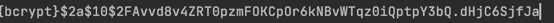


# 📌 Spring Rest Client
***

- ### RestTemplate
> - Blocking I/O 기반의 Synchronous API
> - RestTemplateAutoConfiguration
> - 프로젝트에 spring-web 모듈이 있다면 RestTemplateBuilder를 빈으로 등록해 준다.


```java
private final RestTemplateBuilder restTemplateBuilder;

@Override
public void run(ApplicationArguments args) throws Exception {
    RestTemplate restTemplate = restTemplateBuilder.build();
    
    String helloResult = restTemplate.getForObject("http://localhost:8080/hello", String.class);
    String worldResult = restTemplate.getForObject("http://localhost:8080/world", String.class);
}
```

- ### WebClient
> - Nono-Blocking I/O 기반의 Asynchronous API
> - WebClientAutoConfiguration
> - 프로젝트에 spring-webflux 모듈이 있다면 WebClient.Builder를 빈으로 등록해 준다.


```java
private final WebClient.Builder builder;

@Override
public void run(ApplicationArguments args) throws Exception {
    WebClient webClient = builder.build();


    Mono<String> helloMono = webClient.get().uri("http://localhost:8080/hello")
            .retrieve()
            .bodyToMono(String.class);
    helloMono.subscribe(s->{
        System.out.println(s);
    });

    Mono<String> worldMono = webClient.get().uri("http://localhost:8080/world")
            .retrieve()
            .bodyToMono(String.class);
    worldMono.subscribe(s->{
        System.out.println(s);
    });
}
```

- ## WebClient 커스터 마이징
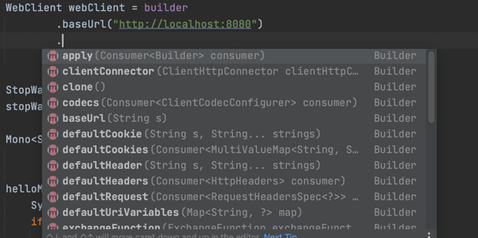

- #### 로컬 커스터마이징
```java
WebClient webClient = builder
                .baseUrl("http://localhost:8080")
                .build();
```

- #### 글로벌 커스터마이징
```java
@Bean
  public WebClientCustomizer webClientCustomizer(){
      return new WebClientCustomizer() {
          @Override
          public void customize(WebClient.Builder webClientBuilder) {
              webClientBuilder.baseUrl("http://localhost:8080");
          }
      };
  }
```