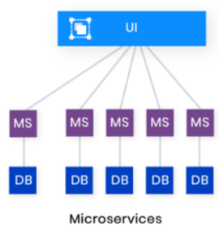
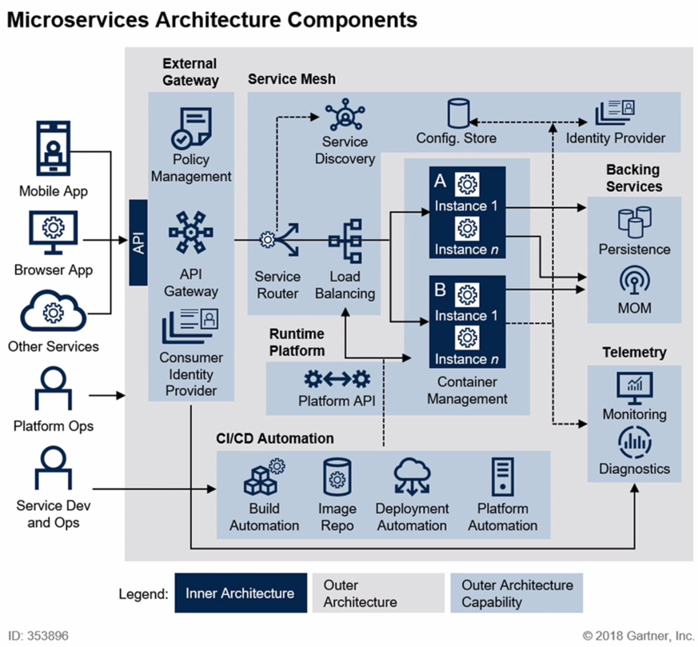
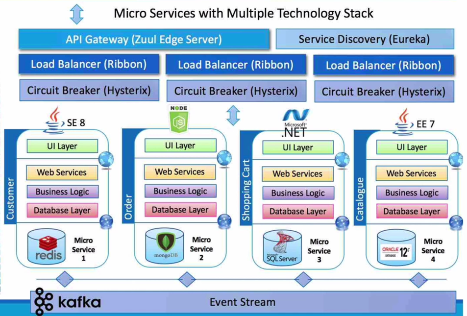
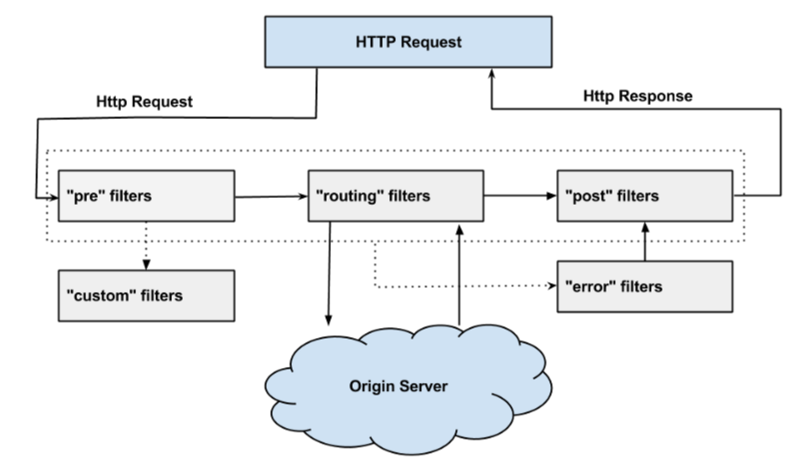
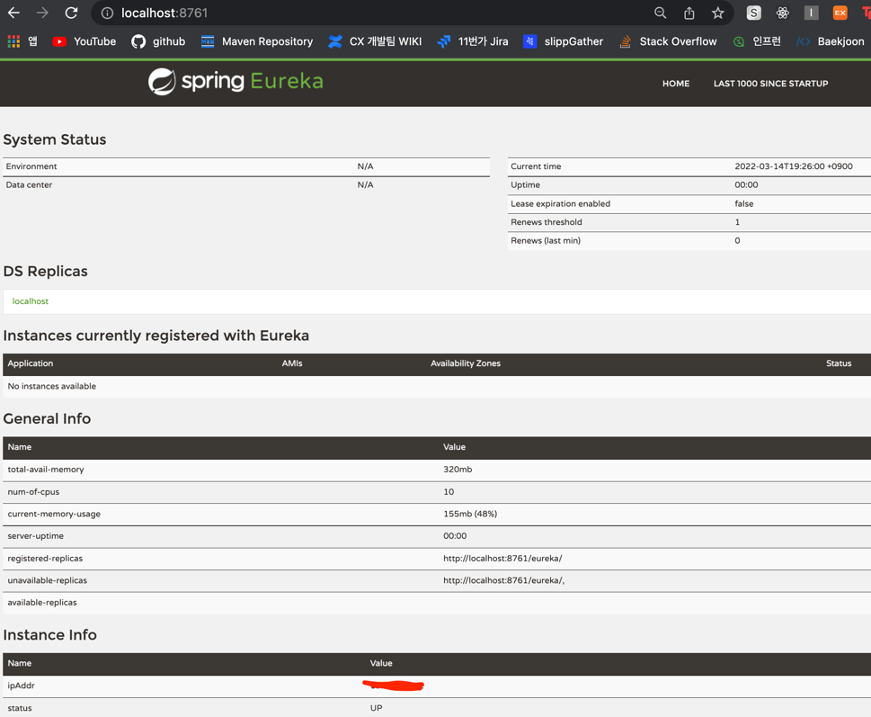
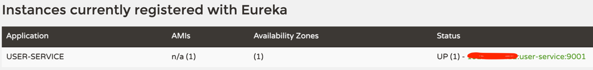

# 📌 Cloud Native 와 MicroService
## 🧐 Software Architecture: Antifragile 의 핵심(Cloud Native)
- Auto Scaling: 최소한의 인스턴스 ~ 필요에 따라 스케일 아웃하여 사용량에 맞춰 사용이 가능하다.
- Microservices: Cloud Native Application의 핵심으로 서비스를 수 많은 독립적인 모듈로 세분화 한다.
- Chaos Engineering: 시스템이 예측하지 못한 상황에도 견딜 수 있도록 설계하는 방법, 규칙.
- Continuous Deployment : 지속적인 배포.


## 🧐 Cloud Native Architecture 의 특징 

클라우드 환경에서 필요에 의해 확장 가능하기 떄문에 아키텍처로 시스템의 수평적 확장(스케일 아웃)에 유연하다. 사용량에 맞춰 리소스를 조절할 수 있다는 것은
곧 비용의 절약을 가져온다.   
서비스 애플리케이션을 패키지 단위로 작게 쪼개어 운영하기 때문에 컨테이너 기반의 운영에도 적합하다.

분할된 서비스들을 독립적으로 운영하기 위해 하기위해 무상태 통신 프로토콜을 사용하여 종속성을 최소화한다.   
또한, 서비스들이 분할되어 있기 떄문에 특정 서비스에 장애가 발생하여도 다른 서비스에 영향을 주지 않고, 해당 서비스만 디버깅 하여 다시 배포하면 된다.


Cloud Native Applicationd은 다음을 따른다
- Microservice
- CI / CD : 카나리 배포 사용(총 트래픽의 5~10%만을 받음)
- DevOps: Plan - Create - Verify - Package - Release - Configure - Monitor 의 과정을 순환 반복한다.
  > 조금 더 짧은 주기의 테스트, 배포
- Container 가상화: 공통적인 리소스는 공유하고, 필요한 리소스만을 독립적으로 운영. 더 가볍고 빠르다.


## 🧐 Cluoud Native Application 을 구현할 때 고려할 15가지
> - https://12factor.net/
> - PaaS 형태의 서비스를 제공하는 Heroku에서 정리한 가이드 라인.


### 1. Base Code
- 코드의 통일적인 관리

### 2. Dependency Isolation
- 각 마이크로 서비스는 종속성을 가지고 패키징되어 있어 모듈의 변경이 전체 시스템에 영향을 주지 않게 설계되어야 한다.

### 3. Configurations
- 코드 외부에서 구성 관리 도구를 통해 마이크로서비스에 필요한 작업을 제어하여 동일한 배포가 올바른 구성이 적용된 환경에서 전파되어야 한다.

### 4. Linkable Blacking Services
-  DB, Cache 등 마이크로서비스가 가져야할 기능을 추가로 지원할 수 있다. 

### 5. Stages Of Creation
- 빌드, 릴리즈, 실행 환경을 분리해야 한다.
- 고유한 태그, 롤백, CI/CD를 이용한 자동화된 시스템 구축

### 6. Stateless Processes
- 하나의 서비스는 독립적으로 운영될 수 있어야 한다. 필요하다면 캐시, 데이터 저장소를 이용하여 데이터를 교환.

### 7. Port Binding
- 각각의 서비스는 자체 포트에서 노출되는 인터페이스와 자체 기능이 있어야 한다.

### 8. Concurrency
- 여러 인스턴스가 동시에 실행될 수 있어야 한다.

### 9. Disposability
- 서비스 인스턴스가 삭제가 가능하고, 정상적인 종료를 할 수 있어야 한다.

### 10. Development & Production Parity
- 개발, 프로덕션 단계가 구분되어야 한다.

### 11. Logs
- 로깅 시스템, 어플리케이션 로직과 분리되어 서비스에 의해 생성된 로그를 이벤트 핸들링 방식으로 처리.

### 12. Admin Processes for Eventual Processes
- 운영되고 있는 서비스들이 어떤 형태로 사용되는지, 리소스가 어떻게 사용되는지 등을 파악할 수 있는 관리도구가 있어야 한다.

### 13. API First
- 모든 서비스는 API 형태로 제공되고, 사용자가 어떻게 사용할지를 고민하여 구현한다.

### 14. Telemetry
- 모든 지표는 시각화되어 관리되어야 하낟.

### 15. Authentication and Authorization
- 적절한 인증, 권한 정보를 요구해야 한다.


## 🤔 MicroService 란?
     

이전 Monolithic Architecture 에서는 모든 로직이 하나의 애플리케이션에 모여있기 떄문에 하나의 기능을 수정하면 모든 기능을 다시 빌드해야 했다.      
그러나, MicroService는 **다른 서비스와 함께 작동하는 작은 서비스**로 정의된다. 이러한 잘게 쪼개진 모듈들이 모여 하나의 애플리케이션을 이룬다.

서비스들은 독립적이기 떄문에 서비스에서 수행하는 기능에 따라 맞춰 언어나 데이터베이스를 다르게 사용할 수 있다.   
각 서비스들이 쪼개져있기 때문에 업무의 분할이 쉽고, 유지 보수가 더 쉬워진다, 작은 단위이기 때문에 빌드, 배포, 장애의 대처에 있어서도 이점을 가진다.

많은 장점을 가지고 있지만 단점이 없는 것은 아니다.   
모듈을 잘개 쪼갠다는 것은 하나의 동작하는 애플리케이션을 위해서는 이에 필요한 서비스를 모두 동작시켜야 한다는 복잡성을 야기한다.   
그리고, 각 서비스들이 통신해야 하기 때문에 통신 관련한 오류가 추가적으로 발생할 수 있다.

마이크로 서비스의 특징은 다음과 같다.
- 서비스의 경계가 구분되는 작은 모듈.
- RESTful
- 환경설정 정보는 외부의 시스템에 의해 관리.(배포에 포함되지 않도록)
- 클라우드 네이티브 기술 활용
- 동적인 스케일 업, 스케일 다운
- CI/CD
- 서비스의 시각화.

## 🧐 MSA의 표준 구성


**클라이언트**에게서 요청이 들어오면 **API Gateway**라는 진입점을 통해 필요한 서비스에 요청을 하게된다.   
**API Gateway에** 수집된 요청들은 **Sevice Router**에 의해 어디로 가야하는지 결정되게 되는데,   
이 때 **Service Discovery**의 등록 리스트에서 해당 서비스의 위치를 검색하게 된다.

위치를 알아냈다면 서비스로 이동하게 되는데, 구성이 여러개로 분산된 형태로 되어있다면 **Load Balancer** 에 의해 이동할 서비스가 결정된다.   
보통 이러한 서비스들은 **컨테이너 가상화** 기술을 통해서 구성이 되어있다.
다른 서비스들과의 연결은 **MOM(Message Oriented Middleware)** 과 **저장소**와 같은 **Backing Service**들을 이용하여 이루어진다.

환경 설정 정보는 **Config Store**와 같이 서비스의 외부에서 해당 정보를 저장하고 있게 되고,
애플리케이션의 배포를 위해 **CI/CD** 관련 도구들을 사용하게 된다.    
애플리케이션이 배포된 이후에는 **모니터링 기능**이나 **진단 기능**을 연결하여 사용한다.

- ### 👆 Service Mesh
    - Service Discovery, Config Store, Service Router, Load Balancer, 암호화, 인증/인가 등의 내부 통신.
    - 추상화, 안전성, 신뢰성, 보안성, 가시성을 보장할 수 있도록 해준다.
    - 


## 🧐 MSA를 관리하기 위한 기술
    

- Zuul: 안전성과 클라이언트 별 유연한 대처를 위한 API Gateway (연결한 백엔드 서비스의 id를 미리 정의된 config 파일에서 읽는다.)
    - 인증 / 인가의 역할, 부적절한 요청을 차단한다. - (pre filter)
    - 클라이언트의 요청에 따라 적절한 서비스로 로드밸런싱하고, 라우팅(zuul core library) - (routing filter)
    - 트래픽 로깅 - (post filter)     
    - Circuit Break - (routing filter)
        >  
        > - Pre Filter: 로깅, 인증 등의 처리가 이루어진다.
        > - Routing Filter: 동적 라우팅을 다루는 필터.
        > - Post Filter: 응답에 헤더를 추가하거나, 응답의 메타 정보들을 수집, 통계(응답 속도, 상태코드 등)
        > - Error Filter: 에러 발생시 실행된다.     
        > -  필터는 Request -> pre -> routing -> post의 순서로 실행된다.(필터끼리 통신하는 것이 아니고 순서대로만 실행된다.)
      
- Ribbon Library: 부하를 적절하게 분산하는 로드 벨런서.
- Hysterix Library: 장애를 감지하고, 대처하는 Circuit Breaker
- Eureka: 마이크로서비스(Eureka Client)의 등록(Registry)과 해지, 연결 정보 탐색(Discovery)을 담당하는 Naming Server
    - 30초 마다 유레카 서버로 부터 다른 유레카 클라이언트들의 변경 사항을 갱신. 유레카 클라이언트들은 30초마다 ping을 유레카 서버로 전송 ping이 오지 않으면  
    유레카 서버는 해당 클라이언틀를 레지스트리에서 제거한다.
- Kafka: 메시징 큐 서비스, 데이터 동기화를 위해 사용한다.    
  데이터의 변경이 일어나면 데이터를 카프카에 전달하고, 카프카는 해당 데이터를 구독한 서비스에게 변경 사항을 전달해준다.
- Zipkin, ELK: 모니터, 로그 추적
  
더 자세한 것은 뒤에서 다시 알아본다.


## 🤔 SOA 와 MSA 는 어떻게 다를까?
> - SOA: Service Oriented Architecture
> - MSA: :Micro Service Architecture

SOA는 기본적으로 재상요을 통한 비용의 절감에 목적이 있고, MSA는 서비스 간의 결합도를 낮추어 변화에 능동적으로 대응할 수 있도록 하는 것에 목적이 있다.   
떄문에 SOA는 서비스의 공유를 최대화하여 비용을 절감하고, MSA는 반대로 서비스간의 공유를 최소화 하여 각 서비스가 독립적일 수 있도록 한다.

SOA 방식에서는 공통의 서비스를 버스(ESB)를 통해 한곳에 모은 후 하나의 서비스로 사용하고, MSA는 각 독립된 서비스가 REST API 방식으로 통신한다.


# 📌 Spring Cloud Netfilx Eureka

## 🧐 Eureka Server
> 프로젝트 생성시 의존성 Eureka Server 추가.

- ### @EnableEurekaServer
  ```java
  @SpringBootApplication
  @EnableEurekaServer // #1
  public class SpringcloudApplication {
  
      public static void main(String[] args) {
          SpringApplication.run(SpringcloudApplication.class, args);
      }
  
  }
  ```
  - (#1): 유레카 서버로 등록하는 애노테이션, Service Discovery 로서 프로젝트를 실행시킨다.

- ### 기본 설정
  ```yml
  server:
    port: 8761
  
  #1
  spring:
    application:
      name: discoveryservice
  
  # 2
  eureka:
    client:
      register-with-eureka: false  
      fetch-registry: false
  ```
  - (#1): 마이크로 서비스에서 애플리케이션을 식별하기 위한 고유한 ID 부여
  - (#2): 유레카 라이브러리를 사용하게 되면 기본적으로 유레카 클라이언트로 등록하려고 시도하게 되는데, 현재 프로젝트는 유레카 서버로 사용할 것이기 대문에 false로 지정.

- ### 유레카 대시보드
  


## 🧐 Eureka Client
> Eureka-client 의존성 추가.

- ### @EnableEurekaClient, @EnableDiscoveryClient
  ```java
  @EnableDiscoveryClient
  @SpringBootApplication
  public class UserServiceApplication {
  
      public static void main(String[] args) {
          SpringApplication.run(UserServiceApplication.class, args);
      }
  
  }
  ```
  - DiscoveryClient 를 조금 더 구현해 놓은 것이 EurekaClient 

- ### 기본 설정
  ```yml
  server:
    port: 9001
  
  spring:
    application:
      name: user-service
  
  eureka:
    client:
      register-with-eureka: true
      fetch-registry: true #1
      service-url:
        defaultZone: http://127.0.0.1:8761/eureka #2
  ```
  - (#1): 유레카 서버로부터 인스턴스들의 정보를 주기적으로 가져올 것인지 설정하는 속성.
  - (#2): 등록할 서버의 위치, 이전에 생성한 유레카 서버의 호스트 주소를 적고, 엔드포인트를 명시해 주었다.   
  
      

  이전에 살펴보았던 유레카 서버의 대시보드로 돌아가보면 방금 실행시킨 user-service가 실행되고 있는 것을 확인할 수 있다.


### 💡 서비스의 실행 방법
```
1. Application Run
  - 여러개의 Application 인스턴스를 생성(Edit configurations)후 -Dserver.port 옵션을 다르게 설정해 주어 여러개의 인스턴스를 띄울 수 있다.
2. 빌드 도구를 이용하여 실행
  - 빌드 도구를 이용하여 build and run
  - gradle의 경우 ./gradlew build 후 ./gradlew bootRun --args='--server.port=9003'
3. java -jar 로 실행
  - 빌드
  - java -jar -Dserver.port=9004 ./build/libs/user-service-0.0.1-SNAPSHOT.jar
```

- ### 랜덤포트를 이용한 간단한 로드밸런싱
  - server.port: 0 으로 설정.
  - 유레카 서버에서 동일 호스트, 애플리케이션 이름, port=0 를 가지기 때문에 하나밖에 등록이 되지 않음.
  - 식별 아이디를 변경
     ```
    eureka:
      instance:
        instance-id: ${spring.cloud.client.hostname}:${spring.application.instance_id:${random.value}}
    ```


<br><br>
### 🔑 참고
> -  https://www.inflearn.com/course/%EC%8A%A4%ED%94%84%EB%A7%81-%ED%81%B4%EB%9D%BC%EC%9A%B0%EB%93%9C-%EB%A7%88%EC%9D%B4%ED%81%AC%EB%A1%9C%EC%84%9C%EB%B9%84%EC%8A%A4/dashboard
> - https://velog.io/@kim_sunnnny/MicroService-vs-Monolithic-Architecture
> - https://happycloud-lee.tistory.com/213
> - https://techblog.woowahan.com/2523/
> - https://velog.io/@jkijki12/Eureka%EB%9E%80
