# 📜 목차
****

- #### [ApplicationContext와 다양한 빈 설정 방법](#ApplicationContext와-다양한-빈-설정-방법-1)
- #### [Autowired](#Autowired-1)
- #### [@Component와 컴포넌트 스캔](#@Component와-컴포넌트-스캔=1)
- #### [빈(Bean)의 스코프(Scope)](#빈Bean의-스코프Scope-1)
- #### [Environment : 프로파일](#environment--프로파일-1)
- #### [Environment : 프로퍼티](#environment--프로퍼티-1)
- #### [MessageSource](#messageSource-1) 
- #### [ApplicationEventPublisher](#applicationEventPublisher-1)
- #### [ResourceLoader](#resourceLoader-1)
- #### [Resource 추상화](#resource-추상화-1)
- #### [Validation 추상화](#validation)
- #### [데이터 바인딩 추상화: PropertyEditor](#데이터-바인딩-추상화--propertyeditor)
- #### [데이터 바인딩 추상화 : Converter와 Formatter](#데이터-바인딩-추상화--converter와-formatter-1)
- #### [SpEL (Spring Expression Language)](#spEL-Spring-expression-language-1)
- #### [스프링 AOP 개념 소개](#스프링-aop-개-소개-1)
- #### [프록시 기반 AOP](#프록시-기반-aop-1)
- #### [@AOP](#aop-1)
- #### [Null-safety](#null-safety-1)

# 📌 ApplicationContext와 다양한 빈 설정 방법
***********

## 1. XML
```xml
<?xml version="1.0" encoding="UTF-8"?>
<beans xmlns="http://www.springframework.org/schema/beans"
       xmlns:xsi="http://www.w3.org/2001/XMLSchema-instance"
       xsi:schemaLocation="http://www.springframework.org/schema/beans http://www.springframework.org/schema/beans/spring-beans.xsd">

    <bean id="bookService"
          class="me.growjun.springapplication.BookService">
        <property name="bookRepository" ref="bookRepository"/>
    </bean>

    <bean id="bookRepository"
          class="me.growjun.springapplication.BookRepository"/>

</beans>
```
    - id 는 보통 카멜 케이스로 사용.
    - property를 이용하여 BookService에 BookRepository 주입. name은 클래스의 setter에서 가져오, ref는 참조할 bean의 id

```java

public static void main(String[] args) {
    ApplicationContext context = new ClassPathXmlApplicationContext("application.xml");
    String[] beanDefinitionNames =  context.getBeanDefinitionNames();
    System.out.println(Arrays.toString(beanDefinitionNames));

    BookService bookService = context.getBean("bookService",BookService.class);
    System.out.println(bookService.bookRepository);
}
```
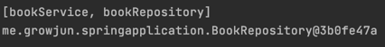       
:: bean 등록, bookRepository에 주입 확인.

> 단점 : 빈으로 등록하는 것이 번거롭다.

### :: Component-scan
```xml
    <context:component-scan base-package ="me.growjun.springapplication"/>
```
    - 해당 패키지의 component를 자동으로 스캔.
    - @Component, 이를 확장한 @Service, @Repository
    - Bean의 주입은 @Autowired 사용.


## 2. Java 설정 파일.
```java
@Configuration
public class ApplicationConfig {
    @Bean
    public BookRepository bookRepository(){
        return new BookRepository();
    }

    @Bean
    public BookService bookService(){
        BookService bookService = new BookService();
        bookService.setBookRepository(bookRepository());
        return new BookService();
    }
}
```
```java
ApplicationContext context = new AnnotationConfigApplicationContext(ApplicationConfig.class);
```
    - 또는 bookService()에서 직접 Repository를 주입하지 않고 @Autowired를 사용할 수도 있다.
        -> Setter를 사용할 때의 장점.
### @ComponentScan
```java
@Configuration
@ComponentScan(basePackageClasses = SpringapplicationApplication.class)
public class ApplicationConfig {

}
```
    -xml과 마찬가지로 자동으로 component를 스캔해준다.

### @SpringBootApplication
    - 해당 어노테이션에 Configuration과 ComponentScan이 있기 때문에 ApplicationConfig 를 땨로 만들 필요가 없다.


# 📌 Autowired
********
### :: @Autowired
    
    
    - @Autowired의 기본값은 true(해당 bean을 찾지 못하면 애플리케이션 구동 실패)
    - @Autowired(require=false)로 설정하여 Optional로 사용 가능.


### :: 사용 위치


    - 생성자(4.3부터는 생략 가능.)
    - 세터
    - 필드


### :: 경우
    

    - 해당 타입의 빈이 없는 경우 : not found 에러 발생.
    - 해당 타입의 빈이 여러 개인 경우 : 어떤걸 주입해줘야 할지 선택하지 못함.
        -> @Primary 어노테이션을 사용하여 지정.
        -> List로 모든 bean을 전부 받음.

### :: 동작 원리


    - BeanPostProccessor 인터페이스의 구현체에 의해 동작.
    - 빈을 생성 한 후 초기화 라이프 사이클 전,후의 부가적인 작업.


# @Component와 컴포넌트 스캔
****

### :: 스캔 위치
    
    
    - @SprigBootApplication은 @Configuration, @ComponentScan 어노테이션을 모두 가지고 있음. 
    - @SpringBootApplication이 존재하면 해당 클래스부터 스캔을 시작하고, 해당 클래스의 패키지에 속하는 모든 클래스와 패키지의 범위를 가진다.
    - 필터 : @Configuration(excludeFilters = {@Filter{type, class}, ... }를 이용하여 걸러낼 수 있음.

### :: 인스턴스 생성으로 애플리케이션 구동. 
```java
var app = new SpringApplication(AutowiredApplication.class);
app.addInitializers(new ApplicationContextInitializer<GenericApplicationContext>() {
    @Override
    public void initialize(GenericApplicationContext ctx) {
        // function을 이용한 외부 패키지 클래스 Bean 등록.
        ctx.registerBean(MyService.class);
    }
});
app.run(args);
```
    - function을 이용한 Bean 등록은 성능상으로는 조금 더 좋지만 불편. ComponentScan을 대체하기는 힘들다.

### :: @Component


    - @Repository
    - @Service
    - @Controller
    - Configuration


# 📌 빈(Bean)의 스코프(Scope)
****

### 1. 싱글톤(Singleton) : 하나의 객체를 공유. Default
```java
@Component
public class AppRunner implements ApplicationRunner{

    @Autowired
    Single single;

    @Autowired
    Proto proto;


    @Override
    public void run(ApplicationArguments args) throws Exception {
        System.out.println(proto);
        System.out.println(single.getProto());
    }
}
```
    - 두 Proto 객체가 같은 객체임을 확인할 수 있다.

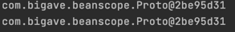


### 2. 프로토타입(Prototype) : <mark style='background-color: #fff5b1'> 빈을 받아 올 때</mark> 마다 새로운 인스턴스.
 - @Scope("prototype")

```java
@Autowired
ApplicationContext ctx;

System.out.println(ctx.getBean(Proto.class));
System.out.println(ctx.getBean(Proto.class));
System.out.println(ctx.getBean(Proto.class));
```
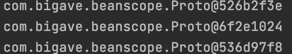


> 문제 : 싱글톤 빈이 프로토 타입 빈을 참조하면?    
    -> 프로토 타입 빈이지만 싱글톤 빈의 객체가 항상 동일하기 때문에 프로토 타입의 빈 또한 항상 같은 객체를 반환하게 된다.    
> 
> 해결 : 
> > 1. @Scope(value = "prototype", proxyMode = ScopedProxyMode.TARGET_CLASS)여   
> 프록시가 클래스를 감싸게 되고, 해당 프록시 인스턴스가 빈으로 등록되고, 이를 주입하여 참조할 수 있게 한다.
> 
> > 2. ObjectProvider<Proto> proto;


### :: 싱글톤 객체 사용시 주의할 점.
    - 프로퍼티가 공유됨 : Thread safe 하게 코딩해야함.
    - ApplicationContext 초기 구동시 인스턴스 생성 -> 시간이 조금 더 걸릴 수 있다.


# 📌 Environment : 프로파일
****

> ApplicationContext extends EnvironmentCapable
> > getEnvironment()

### :: Profile 정의
1. Configuration 사용. (빈 설정파일)
```java
@Configuration
@Profile("test")
public class TestConfiguration {
    @Bean
    public BookRepository bookRepository(){
        return new TestBookRepisitory();
    }

}
```
    - 'test'라는 프로파일로 애플리케이션을 실행할 때만 사용할 수 있는 Bean이 됨.

2. Bean 으로 만들 클래스를 Component로 만들고 Profile 지정.
```java
@Repository
@Profile("test")
public class TestBookRepisitory implements BookRepository{
}
```

> @Profile("!test")를 이용하여 'test'가 아닐 때만 설정하도록 만들 수도 있다. '&', '|' 도 마찬가지로 사용 가능하다.

### :: profile 설정
1. Active Prifiles      
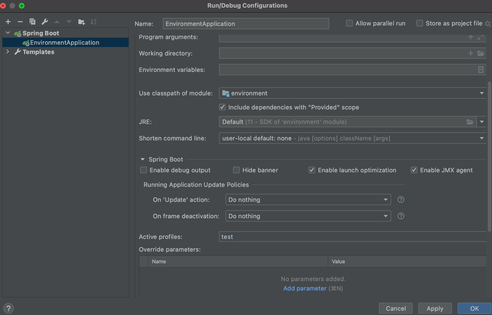
   
2. VM options
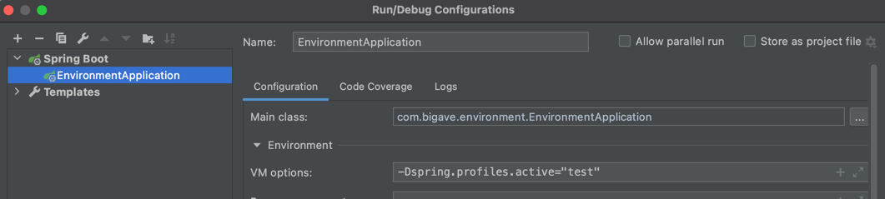
   

```java
Environment environment =  ctx.getEnvironment();
System.out.println(Arrays.toString(environment.getDefaultProfiles()));
System.out.println(Arrays.toString(environment.getActiveProfiles()));
```
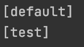


# 📌 Environment : 프로퍼티

### :: 프로퍼티 지정
1. -D 옵션


    - ex) VM options : -Dapp.name="app1"
```java
 System.out.println(environment.getProperty("app.name"));
```

2.properties file

```properties
#app.properties
app.about=spring
```

```java
// Configuration class에 어노테이션 추가.
@PropertySource("classpath:/app.properties")
```


```java
 System.out.println(environment.getProperty("app.about"));
```

3.@Value()
```java
@Value("${app.name}")
String appName;
```

> 우선순위 : 계층 구조이기 때문에 우선순위가 존재, VM option이 우선순위가 더 높다.


# 📌 MessageSource
***
### :: 국제화 기능을 제공하는 인터페이스.

> ApplicationContext extends MessageSource
> > getMessage(String code, Object[] args, Locale)

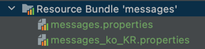
```properties
#messages.properties
greeting=Hello, {0}

#messages_ko_KR.properties
greeting=안녕, {0}
```

```java
 System.out.println(messageSource.getMessage("greeting", new String[]{"taejun"}, Locale.KOREA));
```


     - 스프링 부트를 사용하면 기본적으로 ResourceBundleMessageSource가 Bean으로 등록되어 있기 때문에 별다른 설정없이 바로 사용할 수 있다.

### :: Reloadable
```java
@Bean
public MessageSource messageSource(){
    var messageSource = new ReloadableResourceBundleMessageSource();
    messageSource.setBasename("classpath:/messages");
    messageSource.setDefaultEncoding("UTF-8");
    messageSource.setCacheSeconds(3);
    
    return messageSource;
}
```
:: 애플리케이션중에 파일을 변경하고 Build를 실행하면 실시간으로 변경 가능.

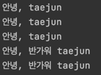


# 📌 ApplicationEventPublisher

> ApplicationContext extends ApplicationEventPublisher
> > publishEvent(ApplicationEvent event)


### :: 이벤트 만들기

```java
public class MyEvent  extends ApplicationEvent {

    private int data;

    public MyEvent(Object source) {
        super(source);
    }

    public MyEvent(Object source, int data) {
        super(source);
        this.data = data;
    }

    public int getData() {
        return data;
    }
}
```
    - ApplicationEvent 상속
    - Spring 4.2부터는 상속받지 않아도 이벤트로 사용할 수 있다.
```java
public class MyEvent{

    private int data;
    private Object source;

    public MyEvent(Object source, int data) {
        this.source = source;
        this.data = data;
    }

    public Object getSource() {
        return source;
    }

    public int getData() {
        return data;
    }
}
```
### :: 이벤트 발생 시키기.
```java
 @Autowired
ApplicationEventPublisher publisher;

@Override
public void run(ApplicationArguments args) throws Exception {
    publisher.publishEvent(new MyEvent(this, 100));
}
```
    -ApplicationEventPublisher.publishEvent()

### :: 이벤트 처리하기.
```java
public class MyEventHandler implements ApplicationListener<MyEvent> {
    @Override
    public void onApplicationEvent(MyEvent myEvent) {
        System.out.println("이벤트를 받음 data: "+ myEvent.getData());

    }
}
```
    - 마찬가지로 Spring 4.2 이후에는 구현하지 않아도 된다.

```java
@Component
public class MyEventHandler  {
    @EventListener
    public void handle(MyEvent myEvent) {
        System.out.println("이벤트를 받음 data: "+ myEvent.getData());
    }
}
```
    - Bean으로의 등록은 필요하다.
    - 특정 인터페이스의 구현 대신 @EventListener 어노테이션을 사용한다.

> 여러개의 EventListener가 있을 경우 순차적으로 실행된다.
>     @Order(Ordered.HIGHEST_PRECEDENCE+ n)을 이용하여 우선순위 조정 가능.

> 기본적으로는 Synchronized 이지만 @EnableAsync 와 @Async를 이용하여 각각 다른 쓰레드에서 비동기적으로 처리할 수 있다.    
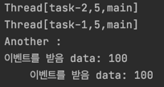


### :: 스프링이 제공하는 기본 이벤트

    - ContextRefreshedEvent : ApplicationContext를 초기화 했거나 리프레시 했을 때 발생.
    - ContextStartedEvent : ApplicationContext를 start()하여 라이프 사이클 번들이 시작 신호를 받은 시점에 발생
    - ContextSpoppedEvent : ApplicationContext를 stop()하여 라이프 사이클 번들이 정지 신호를 받은 시점에 발생.
    - ContextClosedEvent : ApplicationContext를 closed()하여 싱글톤 빈이 소멸되는 시점에 발생.
    - RequestHandledEvent : HTTP 요청을 처리했을 때 발생.

```java
@EventListener
public void handle(ContextRefreshedEvent event){
    System.out.println("=== Context RefreshedEvent === ");
}
@EventListener
public void handle(ContextClosedEvent event){
    System.out.println("=== Context ClosedEvent ===");
}
```
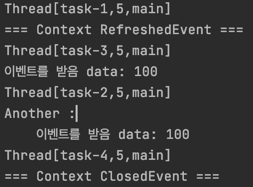


# 📌 ResourceLoader
****
> 리소스를 읽어오는 기능을 제공하는 인터페이스.
> 
> ApplicationContext extends ResourceLoader


## :: 리소스 읽어오기.
### 1. 파일 시스템에서 읽어오기.
   
### 2. 클래스 패스에서 읽어오기.
   
### 3. URL로 읽어오기.
   
### 4. 상대/절대 경로로 읽어오기.


- ### ex)
```java
 @Autowired
ResourceLoader resourceLoader;

@Override
public void run(ApplicationArguments args) throws Exception {
    Resource resource =  resourceLoader.getResource("classpath:test.txt");
    System.out.println(resource.exists());
    System.out.println(resource.getDescription());
    System.out.println(Files.readString(Path.of(resource.getURI())));
}
```


# 📌 Resource 추상화
****
- ### 특징
> - java.net.URL을 추상화 한 것.
> - 스프링 내부에서 많이 사용하는 인터페이스.

- ### 추상화 이유
> - 클래스 패스 기준으로 리소스를 읽어오는 기능의 부재   
> - ServletContext를 기준으로 상대 경로롤 읽어오는 기능 부재.
> - 새로운 핸들러를 등록하여 특별한 URL 접미사를 만들어 사용할 수는 있지만 구현이 복잡, 편의성 메소드가 부족.

- ### 주요 메소드
    - getInputStream()
    - exist()
    - isOpen()
    - getDescription() : 전체 경로를 포함한 파일 이름 또는 실제 URL.
    
- ### 구현체
> - UrlResource: 기본으로 지원하는 프로토콜 http, https, ftp, file, jar
> - ClassPathResource : ClassPathXmlApplicationContext -  classpath 기준
> - FileSystemResource : FileSystemXmlApplicationContext - 파일 시스템 경로
> - ServletContextResource : 웹 어플리케이션 루트에서 상대 경로로 리소스를 찾는다.
> ...


```java
@Autowired
    ApplicationContext resourceLoader;

    @Override
    public void run(ApplicationArguments args) throws Exception {
        Resource resource =  resourceLoader.getResource("classpath:test.txt");
        System.out.println(resource.getClass());

        System.out.println(resourceLoader.getClass());
    }
```
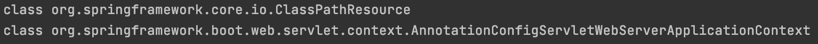


    - ApplicaitonContext는 WebserverApplicationContex이지만 resource에 'classpath:'라는 prefix를 사용했기 때문에 Resource는 ClassPathResource가 된다.
    - 'classpath:'를 지우면 ServletContextResource가 되고, 애플리케이션의 루트에서 context path를 찾게 된다.
    하지만 스프링 부트가 띄워주는 내장 톰켓 context path가 지정되어 있지 않기 때문에 resource를 찾을 수 없다.


# 📌 Validation
******

> org.springframework.validation.Validator     
> : 애플리케이션에서 사용하는 객체 검증용 인터페이스

- ### 특징


    - 어떤 계층과도 관계가 없다. -> 모든 계층(웹, 서비스, 데이터)에서 사용해도 좋다.
    - 구현체 중 하나로 JSR-303(Bean Validation 1.0)과 JSR-349(Bean Validation 1.1)을 지원(LocalValidatorFactoryBean)
    - DataBinder에 들어가 바인딩 할 때 사용되기도 한다.

- ### 인터페이스


    - boolean supports(class clazz) : 어떤 타입의 객체를 검증할 것인지 결정.
    - void validate(Object obj, Errors e) : 실제 검증 로직
        - 구현할 때 ValidationUtils를 사용하면 편리.

### 1. Validator 클래스 
```java
public class EventValidator implements Validator {
    @Override
    public boolean supports(Class<?> aClass) {
        return Event.class.equals(aClass);
    }
    @Override
    public void validate(Object o, Errors errors) {
        ValidationUtils.rejectIfEmptyOrWhitespace(errors,"title","notempty","Empty title is not allowed");
    }
}
```
    - supports 에서 클래스의 타입이 Event Class 일때 true 반환
    - validate : title이 Empty 거나 공백이면 notempty에러, notempty.title과 같이 쓸 수 있지만 아래 이미지와 같이 모든 에러코드를 담아주기 때문에 생략.
    3번째 인자는 Default error code
    - ValidationUtils를 사용하지 않고 errors.reject를 사용할 수도 있다.
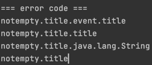

```java
@Override
public void run(ApplicationArguments args) throws Exception {
    Event event = new Event();
    EventValidator eventValidator = new EventValidator();
    // Spring MVC 가 자동으로 생성해서 전달해 줌. 실제로 잘 사용할 일이 없다.
    Errors errors = new BeanPropertyBindingResult(event,"event");

    // event 객체를 검증해 errors 객체에 담아준다.
    eventValidator.validate(event,errors);

    System.out.println(errors.hasErrors());

    errors.getAllErrors().forEach(e ->{
        System.out.println("=== error code ===");
        Arrays.stream(e.getCodes()).forEach(System.out::println);
        System.out.println(e.getDefaultMessage());
    });
}
```

### 2. 어노테이션 기반

```xml
<dependency>
    <groupId>javax.validation</groupId>
    <artifactId>validation-api</artifactId>
    <version>2.0.1.Final</version>
</dependency>
<dependency>
    <groupId>org.hibernate.validator</groupId>
    <artifactId>hibernate-validator</artifactId>
    <version>6.0.7.Final</version>
</dependency>
```

```java
@Qualifier("defaultValidator")
@Autowired
Validator validator;

validator.validate(event,errors);
```

```java
@NotEmpty
String title;# Validation


@Min(0) @Max(4)
Integer limit;

@Email
String email;
```
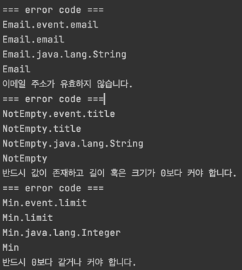


    - Spring 2.0.5 이상 부터 LocalValidatorFactoryBean을 자동으로 Bean으로 등록.
    - Bean Validation 2.0.1의 구현체로 hibernate-validator 사용.
    - Default 메시지 또한 자동으로 정해줌.


# 📌 데이터 바인딩 추상화 : PropertyEditor
******

> - org.springframework.validation.DataBinder
> - 기술적 관점 : 프로퍼티 값을 타겟 객체에 설정하는 기능.
> - 사용자 관점 : 사용자의 입력값을 애플리케이션 도메인 모델에 동적으로 변환해 넣어주는 기능.
> > 입력값은 대부분 문자열인데, 그 값을 객체가 가지고 있는 int,long,Boolean, Data, Event, Book과 같은 도메인 타입으로 변환.

> - 스프링 3.0 이전까지 DataBinder가 변환 작업으로 사용하던 인터페이스
> - 쓰레드-세이프 하지 않음.(상태정보를 저장...) -> 싱글톤 빈으로 등록해서 사용하면 안됨!Event(Integer.parseInt(text))
> - Object와 String 간의 변환만 가능(그러나 대부분의 경우를 차지.)

```java
@InitBinder
public void init(WebDataBinder webDataBinder){
    webDataBinder.registerCustomEditor(Event.class, new EventEditor());
}

@GetMapping("/event/{event}")
public String getEvent(@PathVariable Event event){
    System.out.println(event);
    return event.getId().toString();
}
```


```java
public class EventEditor extends PropertyEditorSupport {
    @Override
    public void setAsText(String text) throws IllegalArgumentException {
        setValue(new Event(Integer.parseInt(text)));
    }
    
}
```
> webDataBinder을 거치게 되고, setAsText에서 받은 문자열을 Integer로 변환하여 Event객체를 생성하여 값을 설정.
> @PathVariable의 event 파라미터로 전달된다.


# 📌 데이터 바인딩 추상화 : Converter와 Formatter
****

### 1. Converter

> - S 타입을 T 타입으로 변환할 수 있는 매우 일반적인 변환기.
> - 상태 정보 없음 == Stateless == Thread safe
> - ConverterRegistry


```java
public class EventConverter {
    public static class StringToEventConverter implements Converter<String, Event>{
        
        @Override
        public Event convert(String s) {
            return new Event(Integer.parseInt(s));
        }
    }
    
    public static class EventToStringConverter implements Converter<Event, String>{
        
        @Override
        public String convert(Event event) {
            return event.getId().toString();
        }
    }
}
```
> 변환할 타입마다 Converter 정의.


```java
@Configuration
public class WebConfig implements WebMvcConfigurer {

    @Override
    public void addFormatters(FormatterRegistry registry) {
        registry.addConverter(new EventConverter.StringToEventConverter());
    }
}
```
> registry에 Converter 등록.


### 2. Formatter


```java
public class EventFormatter implements Formatter<Event> {

    @Override
    public Event parse(String s, Locale locale) throws ParseException {
        return new Event(Integer.parseInt(s));
    }

    @Override
    public String print(Event event, Locale locale) {
        return event.getId().toString();
    }
}
```
> Bean으로 등록하고 MessageSource를 주입받아 locale 정보와 함께 사용 가능.

```java
registry.addFormatter(new EventFormatter());
```


### 3. ConversionService
> - 실제 변환 작업은 이 인터페이스를 통해 쓰레드 세이프 하게 사용 가능.
> - 스프링 MVC, 빈(value)설정, SpEL에서 사용.

- DefaultFormattingConversionService
    - FormatterRegistry -> ConverterRegistry (상속관계)
    - ConversionService
    - 여러 기본 converter, formatter 등록.
    
> - 웹 어플리케이션인 경우에 DefaultFormattingConversionService를 상속한 WebConversionService를 빈으로 등록해준다.
> - converter와 formatter를 Bean으로 등록하면 Config없이 자동으로 등록해준다.

> - formatter MvcTest 작성시 MvcTest는 웹과 관련된(컨트롤러 등)만 bean으로 등록해주기 때문에 추가로 bean으로 등록해주어야 한다
> > @WebMvcTest({EventFormatter.class, EventController.class})


# 📌 SpEL (Spring Expression Language)
****

- ### 스프링 EL 이란?
> - 객체 그래프를 조회하고 조작하느 기능을 제공한다.
> - Unified EL과 비슷하지만, 메소드 호출, 문자열 템플릿 기능도 제공.
> - 여러 EL이 있지만, spEL은 모든 스프링 프로젝트 전반에 걸쳐 사용할 EL로 만들었다.
> - 스프링 3.0부터 지원.

- ### 문법
> - \#{"표현식"}
> - ${"프로퍼티"}
> - 표현식은 프로퍼티를 가질 수 있지만 반대는 불가능. ( #{${프로퍼티}+1} )

- ### SpEL 구성
> - ExpressionParser parser =new spelExpressionParser()
> - StandardEvaluationContext context = new StandardEvaluationContext(bean)
> - Expression expression = parser.parseExpression("SpEL 표현식")
> - String value = expression.getvalue(context,String.class)


- ### 실제로 어디서 쓰나?
> - @Value
> - @ConditionalOnExpression
> - 스프링 시큐리티 (
   메소드 시큐리티 @PreAuthorize, @PostAuthorize, @Prefilter, @PostFilter, XML 인터셉터 URL 설정 ...)
> - 스프링 데이터 (@Query)
> - Thymeleaf    
> ...
- ### 예시
```java
  // 표현식
  @Value("#{1+1}")
  int value;
  
  @Value("#{'hello' + ' world'}")
  String greeting;
  
  @Value("#{1 eq 1}")
  boolean trueOrFalse;
  
  // 프로퍼티
  @Value("${my.value}")
  String myValue;
  
  // 표현식{프로퍼티}
  @Value("#{${my.value} + 'aaa'}")
  String myValueAAA;
  
  // Bean의 필드값
  @Value("#{sampleBean.data}")
  int sampleData;
  
  
  ExpressionParser parser = new SpelExpressionParser();
  // List
  List<String> l = parser.parseExpression("{'a','b','c','d'}").getValue(List.class);
  // Method
  String bc = parser.parseExpression("'abc'.substring(1,3)").getValue(String.class);
```

- [레퍼런스](https://docs.spring.io/spring-framework/docs/current/reference/html/core.html#spring-core)

# 📌 스프링 AOP 개념 소개
****
> AOP : Aspect-oriendted Programming은 OOP를 보완하는 수단, 흩어진 Aspect를 모듈화할 수 있는 프로그래밍 기법.

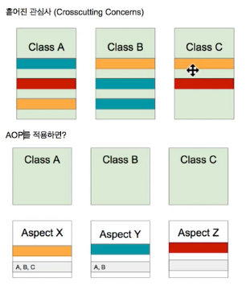
출처 : 백기선님 인프런 스프링 프레임워크 핵심 기술편.

- ### 주요 개념
> - Aspect : 흩어진 것들을 모은 모듈.
> - Target : Adivice가 적용 되는 대상
> - Advice : 해야할 일들.
> - Join Point : 접근 지점. 메소드 호출, 생성자 호출전, 생성자 호출, 필드 접근전, 필드 값을 가져갔을 때 등.. 
> - Pointcut : 어디에 적용해야 하는지. A라는 클래스의 a 메소드를 호출할 때 등..

- ### 구현체(자바)
> - AspectJ 
> - 스프링 AOP : 국한적인 기능. 

- ### AOP 적용 방법.
> - 컴파일 : 자바 파일을 클래스 파일로 만들때 바이트 코드를 조작, 클래스 파일에 같이 포함 된다.      
    > 별도의 컴파일이 한번 더 필요함.
> - 로드 타임 : 클래스 파일을 로딩하는 시점에 Advice를 끼워넣음.(Load Time Weaving).     
    > 약간의 성능 부하, 로드타임 위버의 설정 필요.
> - 런타임 : A라는 클래스 타입의 Bean을 만들 때 A Bean의 프록시 빈을 생성, 프록시 빈이 Advice를 실행.      
    > 약간의 성능 부하. 추가적인 설정이 필요 없고 문법이 쉽다.

> - 컴파일, 로드 타임은 AspectJ를 사용, 런타임은 Spring AOP를 주로 사용.


# 📌 프록시 기반 AOP
****

- ### 스프링 AOP 특징
> - 프록시 기반의 AOP 구현체.
> - 스프링 빈에만 AOP를 적용할 수 있다.
> - 모든 AOP 기능을 공하는 것이 아닌 스프링 IoC와 연동하여 엔터프라이즈 애플리케이션에서 가장 흔한 문제에 대한 해결책을 제공하는 것이 목적.

- ### 프록시 패턴.
> 기존 코드의 변경 없이 접근 제어, 또는 부가 기능 추가.

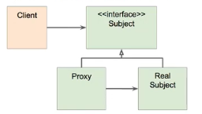 출처 : 백기선님 스프링 프레임워크 핵심 기술.

### Subject
```java
@Service
public class SimpleEventService implements EventService{
    @Override
    public void createEvent() {
        System.out.println("Cerated an Event");
    }

    @Override
    public void publishEvent() {
        System.out.println("Published an Event");
    }

    public void deleteEvent(){
        System.out.println("Delete an Event");
    }
}
```

### Proxy class
```java
@Primary  //주입 받을때 최우선으로 선택되기 위해.
@Service
public class ProxySimpleEventService implements EventService{

    @Autowired
    SimpleEventService simpleEventService; //real class를 주입받음.

    @Override
    public void createEvent() {
        long begin = System.currentTimeMillis();
        simpleEventService.createEvent(); // real class의 기능을 그대로 위임.
        System.out.println(System.currentTimeMillis() - begin); // 기능 추가.
    }

    @Override
    public void publishEvent() {
        long begin = System.currentTimeMillis();
        simpleEventService.publishEvent();
        System.out.println(System.currentTimeMillis() - begin);
    }

    @Override
    public void deleteEvent() {
        simpleEventService.deleteEvent();
    }
}
```
> Proxy 클래스를 생성하여 Real 클래스의 기능을 그대로 위임받고, 기능을 추가. 기존의 코드를 변경하지 않고 기능을 추가할 수 있다.

- ### 프록시 패턴의 문제점.
> - 매번 프록시 클래스를 작성?
> - 여러 클래스, 여러 메소드에 동일한 기능을 추가하려면? 중복코드.
> - 객체들의 관계가 복잡해 진다.


# 📌 @AOP
*****

- ### Spring AOP
> - 스프링 IoC 컨테이너가 제공하는 기반 시설과 다이나믹 프록시를 사용하여 여로 복잡한 문제 해결.
> - 동적 프록시 : 동적으로 프록시 객체를 생성.          
    > 자바가 제공하는 방법은 인터페이스 기반 프록시 생성.   
    > CGlib은 클래스 기반 프록시도 지원.     
> - 스프링 IoC : 기존 빈을 대체하는 동적 프록시 빈을 만들어 등록 시켜준다.      
    > 클라이언트 코드 변경 없음.     
    > AbstractAutoProxyCreator implements BeanPostProcessor

```xml
<dependency>
    <groupId>org.springframework.boot</groupId>
    <artifactId>spring-boot-starter-aop</artifactId>
</dependency>
```

### 1. @Around("execution()")
```java
@Component
@Aspect
public class perfAspect {
    // Value에는 Pointcut 이름 또는 Pointcut 정의.
    @Around("execution(* com.bigave..*.EventService.*(..))") //com.bigave 패키지 밑에있는 모든 클래스 중에서 EventService안에 들어있는 모든 메소드에 아래 메서드(행위)를 적용하라.
    public Object legPerf(ProceedingJoinPoint pjp) throws Throwable {
        long begin = System.currentTimeMillis();
        Object retVal = pjp.proceed();
        System.out.println(System.currentTimeMillis() - begin);
        return retVal;
    }
}
```
     
> 툴의 지원을 받아 적용된 메소드 확인 가능.


### 2. @Around("@Annotaion()") : 특정 클래스 또는 메소드에만 적용.

```java
//애노테이션 정의.
@Retention(RetentionPolicy.CLASS) //Default : CLASS파일까지 유지. SOURCE : 컴파일 까지 유지. RUNTIME: 런타임 까지.
@Target(ElementType.METHOD)
public @interface PerfLogging {
}

// Aspect
@Around("@annotation(PerfLogging)")

// target Method
@PerfLogging
```

### 3. @Around("bean()") : 특정 빈의 모든 메소드에 적용.
```java
@Around("@bean(simpleEventService)")
```

### 4. @Before() : 지정된 메소드의 실행 전에.
```java
@Before("bean(simpleEventService)") // 지정된 메소드의 실행 전에.
public void hello(){
    System.out.println("hello");
}
```


# 📌 Null Safety
****

```java
// return null을 허용하지 않음
@NonNull
public String createEvent(@NonNull String name){ //name null을 허용하지 않음.
    return null;
}
```

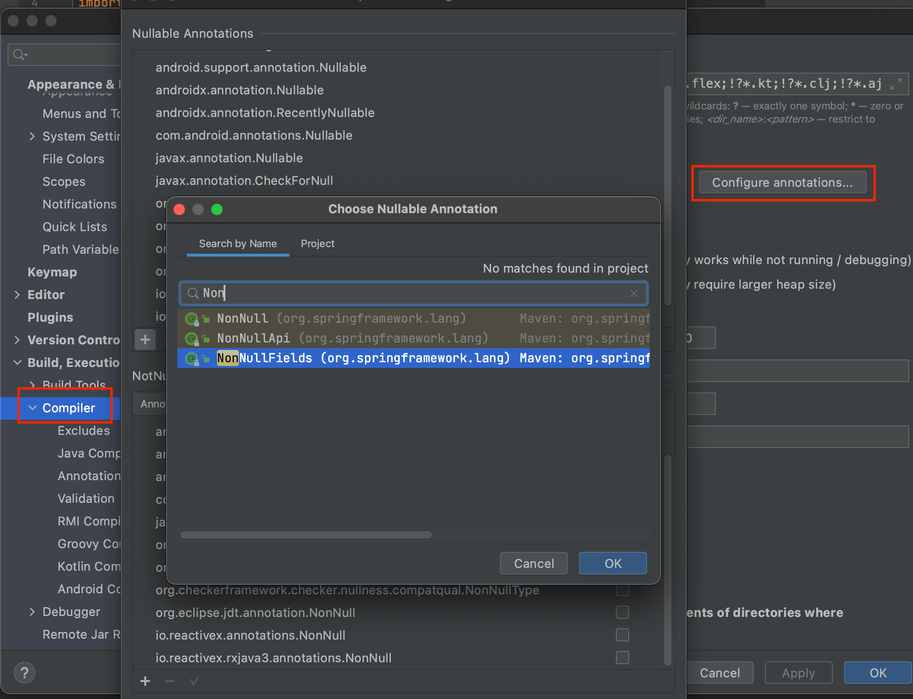

> springframwork의 NonNull, Nullable이 등록되어있지 않다. 추가해 주고 재시작.


- ### 목적
> 툴의 지원을 받아 컴파일 시점에 최대한 NullPointException을 방지하는 것.

- ### 스프링 5에 추가된 Null관련 애노테이션
> - @NonNull
> - @Nullable
> - @NonNullApi (패키지 레벨 설정)
> - @NonNullFields (패키지 레벨 설정.)
