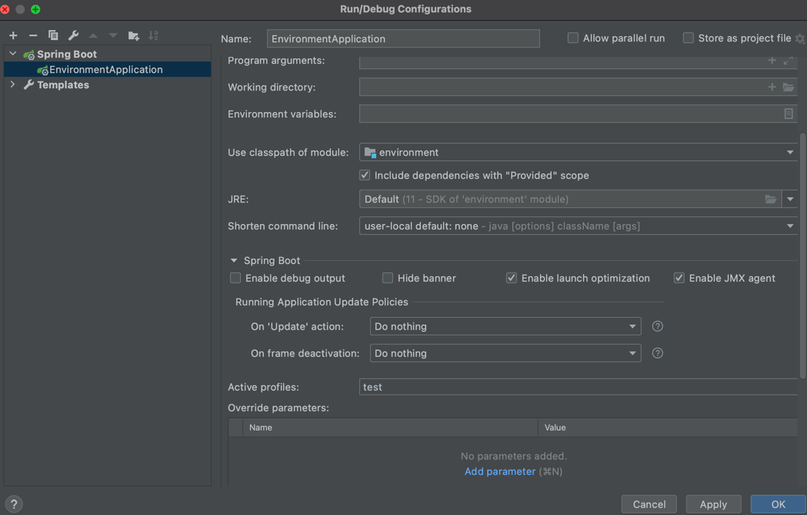
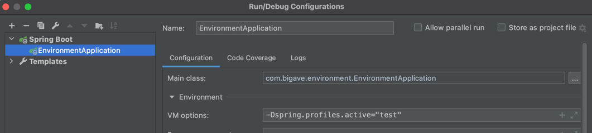
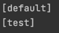
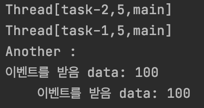
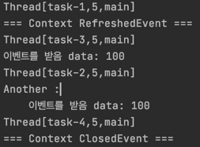
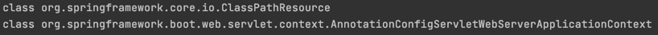

# 📜 목차
****

- #### [ApplicationContext와 다양한 빈 설정 방법](#ApplicationContext와-다양한-빈-설정-방법)
- #### [Autowired](#Autowired)
- #### [@Component와 컴포넌트 스캔](#@Component와-컴포넌트-스캔)
- #### [빈(Bean)의 스코프(Scope)](#빈(Bean)의-스코프(Scope))
- #### [Environment : 프로파일.](#Environment-:-프로파일.)
- #### [Environment : 프로퍼티.](#Environment-:-프로퍼티.)
- #### [MessageSource](#MessageSource) 
- #### [ApplicationEventPublisher](#ApplicationEventPublisher)
- #### [ResourceLoader](#ResourceLoader)


# ApplicationContext와 다양한 빈 설정 방법
***********

## 1. XML
```xml
<?xml version="1.0" encoding="UTF-8"?>
<beans xmlns="http://www.springframework.org/schema/beans"
       xmlns:xsi="http://www.w3.org/2001/XMLSchema-instance"
       xsi:schemaLocation="http://www.springframework.org/schema/beans http://www.springframework.org/schema/beans/spring-beans.xsd">

    <bean id="bookService"
          class="me.growjun.springapplication.BookService">
        <property name="bookRepository" ref="bookRepository"/>
    </bean>

    <bean id="bookRepository"
          class="me.growjun.springapplication.BookRepository"/>

</beans>
```
    - id 는 보통 카멜 케이스로 사용.
    - property를 이용하여 BookService에 BookRepository 주입. name은 클래스의 setter에서 가져오, ref는 참조할 bean의 id

```java

public static void main(String[] args) {
    ApplicationContext context = new ClassPathXmlApplicationContext("application.xml");
    String[] beanDefinitionNames =  context.getBeanDefinitionNames();
    System.out.println(Arrays.toString(beanDefinitionNames));

    BookService bookService = context.getBean("bookService",BookService.class);
    System.out.println(bookService.bookRepository);
}
```
       
:: bean 등록, bookRepository에 주입 확인.

> 단점 : 빈으로 등록하는 것이 번거롭다.

### :: Component-scan
```xml
    <context:component-scan base-package ="me.growjun.springapplication"/>
```
    - 해당 패키지의 component를 자동으로 스캔.
    - @Component, 이를 확장한 @Service, @Repository
    - Bean의 주입은 @Autowired 사용.


## 2. Java 설정 파일.
```java
@Configuration
public class ApplicationConfig {
    @Bean
    public BookRepository bookRepository(){
        return new BookRepository();
    }

    @Bean
    public BookService bookService(){
        BookService bookService = new BookService();
        bookService.setBookRepository(bookRepository());
        return new BookService();
    }
}
```
```java
ApplicationContext context = new AnnotationConfigApplicationContext(ApplicationConfig.class);
```
    - 또는 bookService()에서 직접 Repository를 주입하지 않고 @Autowired를 사용할 수도 있다.
        -> Setter를 사용할 때의 장점.
### @ComponentScan
```java
@Configuration
@ComponentScan(basePackageClasses = SpringapplicationApplication.class)
public class ApplicationConfig {

}
```
    -xml과 마찬가지로 자동으로 component를 스캔해준다.

### @SpringBootApplication
    - 해당 어노테이션에 Configuration과 ComponentScan이 있기 때문에 ApplicationConfig 를 땨로 만들 필요가 없다.


# Autowired
********
### :: @Autowired
    
    
    - @Autowired의 기본값은 true(해당 bean을 찾지 못하면 애플리케이션 구동 실패)
    - @Autowired(require=false)로 설정하여 Optional로 사용 가능.


### :: 사용 위치


    - 생성자(4.3부터는 생략 가능.)
    - 세터
    - 필드


### :: 경우
    

    - 해당 타입의 빈이 없는 경우 : not found 에러 발생.
    - 해당 타입의 빈이 여러 개인 경우 : 어떤걸 주입해줘야 할지 선택하지 못함.
        -> @Primary 어노테이션을 사용하여 지정.
        -> List로 모든 bean을 전부 받음.

### :: 동작 원리


    - BeanPostProccessor 인터페이스의 구현체에 의해 동작.
    - 빈을 생성 한 후 초기화 라이프 사이클 전,후의 부가적인 작업.


# @Component와 컴포넌트 스캔
****

### :: 스캔 위치
    
    
    - @SprigBootApplication은 @Configuration, @ComponentScan 어노테이션을 모두 가지고 있음. 
    - @SpringBootApplication이 존재하면 해당 클래스부터 스캔을 시작하고, 해당 클래스의 패키지에 속하는 모든 클래스와 패키지의 범위를 가진다.
    - 필터 : @Configuration(excludeFilters = {@Filter{type, class}, ... }를 이용하여 걸러낼 수 있음.

### :: 인스턴스 생성으로 애플리케이션 구동. 
```java
var app = new SpringApplication(AutowiredApplication.class);
app.addInitializers(new ApplicationContextInitializer<GenericApplicationContext>() {
    @Override
    public void initialize(GenericApplicationContext ctx) {
        // function을 이용한 외부 패키지 클래스 Bean 등록.
        ctx.registerBean(MyService.class);
    }
});
app.run(args);
```
    - function을 이용한 Bean 등록은 성능상으로는 조금 더 좋지만 불편. ComponentScan을 대체하기는 힘들다.

### :: @Component


    - @Repository
    - @Service
    - @Controller
    - Configuration


# 빈(Bean)의 스코프(Scope)
****

### 1. 싱글톤(Singleton) : 하나의 객체를 공유. Default
```java
@Component
public class AppRunner implements ApplicationRunner{

    @Autowired
    Single single;

    @Autowired
    Proto proto;


    @Override
    public void run(ApplicationArguments args) throws Exception {
        System.out.println(proto);
        System.out.println(single.getProto());
    }
}
```
    - 두 Proto 객체가 같은 객체임을 확인할 수 있다.


### 2. 프로토타입(Prototype) : <mark style='background-color: #fff5b1'> 빈을 받아 올 때</mark> 마다 새로운 인스턴스.
 - @Scope("prototype")

```java
@Autowired
ApplicationContext ctx;

System.out.println(ctx.getBean(Proto.class));
System.out.println(ctx.getBean(Proto.class));
System.out.println(ctx.getBean(Proto.class));
```


> 문제 : 싱글톤 빈이 프로토 타입 빈을 참조하면?    
    -> 프로토 타입 빈이지만 싱글톤 빈의 객체가 항상 동일하기 때문에 프로토 타입의 빈 또한 항상 같은 객체를 반환하게 된다.    
> 
> 해결 : 
> > 1. @Scope(value = "prototype", proxyMode = ScopedProxyMode.TARGET_CLASS)여   
> 프록시가 클래스를 감싸게 되고, 해당 프록시 인스턴스가 빈으로 등록되고, 이를 주입하여 참조할 수 있게 한다.
> 
> > 2. ObjectProvider<Proto> proto;


### :: 싱글톤 객체 사용시 주의할 점.
    - 프로퍼티가 공유됨 : Thread safe 하게 코딩해야함.
    - ApplicationContext 초기 구동시 인스턴스 생성 -> 시간이 조금 더 걸릴 수 있다.


# Environment : 프로파일
****

> ApplicationContext extends EnvironmentCapable
> > getEnvironment()

### :: Profile 정의
1. Configuration 사용. (빈 설정파일)
```java
@Configuration
@Profile("test")
public class TestConfiguration {
    @Bean
    public BookRepository bookRepository(){
        return new TestBookRepisitory();
    }

}
```
    - 'test'라는 프로파일로 애플리케이션을 실행할 때만 사용할 수 있는 Bean이 됨.

2. Bean 으로 만들 클래스를 Component로 만들고 Profile 지정.
```java
@Repository
@Profile("test")
public class TestBookRepisitory implements BookRepository{
}
```

> @Profile("!test")를 이용하여 'test'가 아닐 때만 설정하도록 만들 수도 있다. '&', '|' 도 마찬가지로 사용 가능하다.

### :: profile 설정
1. Active Prifiles      

   
2. VM options

   

```java
Environment environment =  ctx.getEnvironment();
System.out.println(Arrays.toString(environment.getDefaultProfiles()));
System.out.println(Arrays.toString(environment.getActiveProfiles()));
```



# Environment : 프로퍼티.

### :: 프로퍼티 지정
1. -D 옵션


    - ex) VM options : -Dapp.name="app1"
```java
 System.out.println(environment.getProperty("app.name"));
```

2.properties file

```properties
#app.properties
app.about=spring
```

```java
// Configuration class에 어노테이션 추가.
@PropertySource("classpath:/app.properties")
```


```java
 System.out.println(environment.getProperty("app.about"));
```

3.@Value()
```java
@Value("${app.name}")
String appName;
```

> 우선순위 : 계층 구조이기 때문에 우선순위가 존재, VM option이 우선순위가 더 높다.


# MessageSource
***
### :: 국제화 기능을 제공하는 인터페이스.

> ApplicationContext extends MessageSource
> > getMessage(String code, Object[] args, Locale)


```properties
#messages.properties
greeting=Hello, {0}

#messages_ko_KR.properties
greeting=안녕, {0}
```

```java
 System.out.println(messageSource.getMessage("greeting", new String[]{"taejun"}, Locale.KOREA));
```


     - 스프링 부트를 사용하면 기본적으로 ResourceBundleMessageSource가 Bean으로 등록되어 있기 때문에 별다른 설정없이 바로 사용할 수 있다.

### :: Reloadable
```java
@Bean
public MessageSource messageSource(){
    var messageSource = new ReloadableResourceBundleMessageSource();
    messageSource.setBasename("classpath:/messages");
    messageSource.setDefaultEncoding("UTF-8");
    messageSource.setCacheSeconds(3);
    
    return messageSource;
}
```
:: 애플리케이션중에 파일을 변경하고 Build를 실행하면 실시간으로 변경 가능.


# ApplicationEventPublisher

> ApplicationContext extends ApplicationEventPublisher
> > publishEvent(ApplicationEvent event)


### :: 이벤트 만들기

```java
public class MyEvent  extends ApplicationEvent {

    private int data;

    public MyEvent(Object source) {
        super(source);
    }

    public MyEvent(Object source, int data) {
        super(source);
        this.data = data;
    }

    public int getData() {
        return data;
    }
}
```
    - ApplicationEvent 상속
    - Spring 4.2부터는 상속받지 않아도 이벤트로 사용할 수 있다.
```java
public class MyEvent{

    private int data;
    private Object source;

    public MyEvent(Object source, int data) {
        this.source = source;
        this.data = data;
    }

    public Object getSource() {
        return source;
    }

    public int getData() {
        return data;
    }
}
```
### :: 이벤트 발생 시키기.
```java
 @Autowired
ApplicationEventPublisher publisher;

@Override
public void run(ApplicationArguments args) throws Exception {
    publisher.publishEvent(new MyEvent(this, 100));
}
```
    -ApplicationEventPublisher.publishEvent()

### :: 이벤트 처리하기.
```java
public class MyEventHandler implements ApplicationListener<MyEvent> {
    @Override
    public void onApplicationEvent(MyEvent myEvent) {
        System.out.println("이벤트를 받음 data: "+ myEvent.getData());

    }
}
```
    - 마찬가지로 Spring 4.2 이후에는 구현하지 않아도 된다.

```java
@Component
public class MyEventHandler  {
    @EventListener
    public void handle(MyEvent myEvent) {
        System.out.println("이벤트를 받음 data: "+ myEvent.getData());
    }
}
```
    - Bean으로의 등록은 필요하다.
    - 특정 인터페이스의 구현 대신 @EventListener 어노테이션을 사용한다.

> 여러개의 EventListener가 있을 경우 순차적으로 실행된다.
>     @Order(Ordered.HIGHEST_PRECEDENCE+ n)을 이용하여 우선순위 조정 가능.

> 기본적으로는 Synchronized 이지만 @EnableAsync 와 @Async를 이용하여 각각 다른 쓰레드에서 비동기적으로 처리할 수 있다.    



### :: 스프링이 제공하는 기본 이벤트

    - ContextRefreshedEvent : ApplicationContext를 초기화 했거나 리프레시 했을 때 발생.
    - ContextStartedEvent : ApplicationContext를 start()하여 라이프 사이클 번들이 시작 신호를 받은 시점에 발생
    - ContextSpoppedEvent : ApplicationContext를 stop()하여 라이프 사이클 번들이 정지 신호를 받은 시점에 발생.
    - ContextClosedEvent : ApplicationContext를 closed()하여 싱글톤 빈이 소멸되는 시점에 발생.
    - RequestHandledEvent : HTTP 요청을 처리했을 때 발생.

```java
@EventListener
public void handle(ContextRefreshedEvent event){
    System.out.println("=== Context RefreshedEvent === ");
}
@EventListener
public void handle(ContextClosedEvent event){
    System.out.println("=== Context ClosedEvent ===");
}
```



# ResourceLoader
*********
> 리소스를 읽어오는 기능을 제공하는 인터페이스.
> 
> ApplicationContext extends ResourceLoader


## :: 리소스 읽어오기.
### 1. 파일 시스템에서 읽어오기.
   
### 2. 클래스 패스에서 읽어오기.
   
### 3. URL로 읽어오기.
   
### 4. 상대/절대 경로로 읽어오기.


- ### ex)
```java
 @Autowired
ResourceLoader resourceLoader;

@Override
public void run(ApplicationArguments args) throws Exception {
    Resource resource =  resourceLoader.getResource("classpath:test.txt");
    System.out.println(resource.exists());
    System.out.println(resource.getDescription());
    System.out.println(Files.readString(Path.of(resource.getURI())));
}
```


# Resource 추상화
****
- ### 특징
> - java.net.URL을 추상화 한 것.
> - 스프링 내부에서 많이 사용하는 인터페이스.

- ### 추상화 이유
> - 클래스 패스 기준으로 리소스를 읽어오는 기능의 부재   
> - ServletContext를 기준으로 상대 경로롤 읽어오는 기능 부재.
> - 새로운 핸들러를 등록하여 특별한 URL 접미사를 만들어 사용할 수는 있지만 구현이 복잡, 편의성 메소드가 부족.

- ### 주요 메소드
    - getInputStream()
    - exist()
    - isOpen()
    - getDescription() : 전체 경로를 포함한 파일 이름 또는 실제 URL.
    
- ### 구현체
> - UrlResource: 기본으로 지원하는 프로토콜 http, https, ftp, file, jar
> - ClassPathResource : ClassPathXmlApplicationContext -  classpath 기준
> - FileSystemResource : FileSystemXmlApplicationContext - 파일 시스템 경로
> - ServletContextResource : 웹 어플리케이션 루트에서 상대 경로로 리소스를 찾는다.
> ...


```java
@Autowired
    ApplicationContext resourceLoader;

    @Override
    public void run(ApplicationArguments args) throws Exception {
        Resource resource =  resourceLoader.getResource("classpath:test.txt");
        System.out.println(resource.getClass());

        System.out.println(resourceLoader.getClass());
    }
```



    - ApplicaitonContext는 WebserverApplicationContex이지만 resource에 'classpath:'라는 prefix를 사용했기 때문에 Resource는 ClassPathResource가 된다.
    - 'classpath:'를 지우면 ServletContextResource가 되고, 애플리케이션의 루트에서 context path를 찾게 된다.
    하지만 스프링 부트가 띄워주는 내장 톰켓 context path가 지정되어 있지 않기 때문에 resource를 찾을 수 없다.