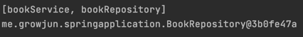
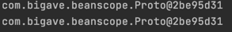
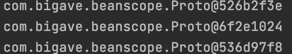

# ApplicationContext와 다양한 빈 설정 방법
***********

## 1. XML
```xml
<?xml version="1.0" encoding="UTF-8"?>
<beans xmlns="http://www.springframework.org/schema/beans"
       xmlns:xsi="http://www.w3.org/2001/XMLSchema-instance"
       xsi:schemaLocation="http://www.springframework.org/schema/beans http://www.springframework.org/schema/beans/spring-beans.xsd">

    <bean id="bookService"
          class="me.growjun.springapplication.BookService">
        <property name="bookRepository" ref="bookRepository"/>
    </bean>

    <bean id="bookRepository"
          class="me.growjun.springapplication.BookRepository"/>

</beans>
```
    - id 는 보통 카멜 케이스로 사용.
    - property를 이용하여 BookService에 BookRepository 주입. name은 클래스의 setter에서 가져오, ref는 참조할 bean의 id

```java
public static void main(String[] args) {
    ApplicationContext context = new ClassPathXmlApplicationContext("application.xml");
    String[] beanDefinitionNames =  context.getBeanDefinitionNames();
    System.out.println(Arrays.toString(beanDefinitionNames));

    BookService bookService = context.getBean("bookService",BookService.class);
    System.out.println(bookService.bookRepository);
}
```
       
:: bean 등록, bookRepository에 주입 확인.

> 단점 : 빈으로 등록하는 것이 번거롭다.

### Component-scan
```xml
    <context:component-scan base-package ="me.growjun.springapplication"/>
```
    - 해당 패키지의 component를 자동으로 스캔.
    - @Component, 이를 확장한 @Service, @Repository
    - Bean의 주입은 @Autowired 사용.


## 2. Java 설정 파일.
```java
@Configuration
public class ApplicationConfig {
    @Bean
    public BookRepository bookRepository(){
        return new BookRepository();
    }

    @Bean
    public BookService bookService(){
        BookService bookService = new BookService();
        bookService.setBookRepository(bookRepository());
        return new BookService();
    }
}
```
```java
ApplicationContext context = new AnnotationConfigApplicationContext(ApplicationConfig.class);
```
    - 또는 bookService()에서 직접 Repository를 주입하지 않고 @Autowired를 사용할 수도 있다.
        -> Setter를 사용할 때의 장점.
### @ComponentScan
```java
@Configuration
@ComponentScan(basePackageClasses = SpringapplicationApplication.class)
public class ApplicationConfig {

}
```
    -xml과 마찬가지로 자동으로 component를 스캔해준다.

### @SpringBootApplication
    - 해당 어노테이션에 Configuration과 ComponentScan이 있기 때문에 ApplicationConfig 를 땨로 만들 필요가 없다.


# Autowired
********
- ## @Autowired
    
    
    - @Autowired의 기본값은 true(해당 bean을 찾지 못하면 애플리케이션 구동 실패)
    - @Autowired(require=false)로 설정하여 Optional로 사용 가능.


- ## 사용 위치


    - 생성자(4.3부터는 생략 가능.)
    - 세터
    - 필드


- ## 경우
    

    - 해당 타입의 빈이 없는 경우 : not found 에러 발생.
    - 해당 타입의 빈이 여러 개인 경우 : 어떤걸 주입해줘야 할지 선택하지 못함.
        -> @Primary 어노테이션을 사용하여 지정.
        -> List로 모든 bean을 전부 받음.

- ## 동작 원리


    - BeanPostProccessor 인터페이스의 구현체에 의해 동작.
    - 빈을 생성 한 후 초기화 라이프 사이클 전,후의 부가적인 작업.


# @Component와 컴포넌트 스캔
****

- ## 스캔 위치
    
    
    - @SprigBootApplication은 @Configuration, @ComponentScan 어노테이션을 모두 가지고 있음. 
    - @SpringBootApplication이 존재하면 해당 클래스부터 스캔을 시작하고, 해당 클래스의 패키지에 속하는 모든 클래스와 패키지의 범위를 가진다.
    - 필터 : @Configuration(excludeFilters = {@Filter{type, class}, ... }를 이용하여 걸러낼 수 있음.

- ## 인스턴스 생성으로 애플리케이션 구동. 
```java
var app = new SpringApplication(AutowiredApplication.class);
app.addInitializers(new ApplicationContextInitializer<GenericApplicationContext>() {
    @Override
    public void initialize(GenericApplicationContext ctx) {
        // function을 이용한 외부 패키지 클래스 Bean 등록.
        ctx.registerBean(MyService.class);
    }
});
app.run(args);
```
    - function을 이용한 Bean 등록은 성능상으로는 조금 더 좋지만 불편. ComponentScan을 대체하기는 힘들다.

- ##@Component


    - @Repository
    - @Service
    - @Controller
    - Configuration


# 빈(Bean)의 스코프(Scope)
****

- ## Scope


### 1. 싱글톤(Singleton) : 하나의 객체를 공유. Default
```java
@Component
public class AppRunner implements ApplicationRunner{

    @Autowired
    Single single;

    @Autowired
    Proto proto;


    @Override
    public void run(ApplicationArguments args) throws Exception {
        System.out.println(proto);
        System.out.println(single.getProto());
    }
}
```
    - 두 Proto 객체가 같은 객체임을 확인할 수 있다.




### 2. 프로토타입(Prototype) : <mark style='background-color: #fff5b1'> 빈을 받아 올 때</mark> 마다 새로운 인스턴스.
 - @Scope("prototype")

```java
@Autowired
ApplicationContext ctx;

System.out.println(ctx.getBean(Proto.class));
System.out.println(ctx.getBean(Proto.class));
System.out.println(ctx.getBean(Proto.class));
```



> 문제 : 싱글톤 빈이 프로토 타입 빈을 참조하면?    
    -> 프로토 타입 빈이지만 싱글톤 빈의 객체가 항상 동일하기 때문에 프로토 타입의 빈 또한 항상 같은 객체를 반환하게 된다.    
> 
> 해결 : 
> > 1. @Scope(value = "prototype", proxyMode = ScopedProxyMode.TARGET_CLASS)여   
> 프록시가 클래스를 감싸게 되고, 해당 프록시 인스턴스가 빈으로 등록되고, 이를 주입하여 참조할 수 있게 한다.
> 
> > 2. ObjectProvider<Proto> proto;


### 싱글톤 객체 사용시 주의할 점.
    - 프로퍼티가 공유됨 : Thread safe 하게 코딩해야함.
    - ApplicationContext 초기 구동시 인스턴스 생성 -> 시간이 조금 더 걸릴 수 있다.


