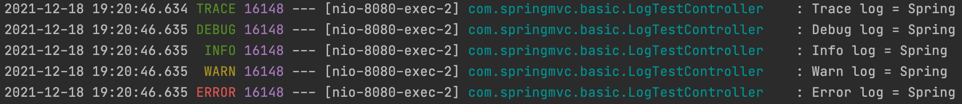

### 🧐 왜 로깅을 사용해야 하나?
어떠한 정보를 남길 때 그냥 ```System.out.println()``` 찍어서 확인하면 되는거 아닌가요? 라고 생각할 수 있다.    
로깅과 단순 출력은 어떤 차이가 있을까? 기본적으로 로깅에는 시간, 로그 레벨, 프로세스 ID, 실행 쓰레드의 이름, 실행 클래스 명, 메시지가 표기된다.



단순히 출력하는 것과 코드 자체의 복잡도는 거의 동일하지만, 더 많은 정보를 표기해준다. 또 다른 장점은 로깅 레벨에 있다.
로깅 레벨의 순서는 TRACE - DEBUG - INFO(default) - WARN - ERROR 로 이루어져 있고, 레벨을 설정하면 자신과, 하위 레벨의 정보를 로깅한다.
(INFO 라면 INFO,WARN,ERROR).

레벨이 분리되어 있다는 것은 환경에 따라 레벨을 다르게 설정하여 필요한 정보만을 남길 수 있다는 것이다. 예를들어 개발 서버에서는 ```DEBUG``` 레벨로 설정하여
디버깅 정보를 남긴다. 운영 서버에서는 ```INFO``` 레벨로 설정하여 운영 레벨에서 필요없는 정보와, 민감한 정보를 로깅하지 않게 설정할 수 있다.

> 💡로깅 레벨 설정.
> ```properties
> # 로깅 레벨을 적용하고 싶은 패키지 경로, 모두 적용하고 싶다면 root.
> logging.level.{PackagePath} = trace
> ```

또한, 로깅을 이용하면 콘솔만이 아닌 파일이나 네트워크 등 별도의 위치에 정보를 남길 수 있고, 파일의 경우에는 날짜별, 일정 용량 등으로 로그를
분할하여 저장할 수 있다. 성능면에서도 단순 출력보다 좋다(내부 버퍼링, 멀티 쓰레드 최적화.)


### ☝️ 로깅 라이브러리의 종류
**Logback**, **Log4j**, **Log4j2** 등이 있다. 스프링에서는 Logback을 기본으로 제공하고, 라이브러리는 교체할 수 있다.
또한 스프링에서는 Slf4j라는 인터페이스를 사용하여 로깅 라이브러리를 공통적으로 편리하게 다룰 수 있도록 지원한다. ```@Slf4j``` 애노테이션으로 사용할 수 있다.
각 라이브러리에 대해서는 다음에 더 자세히 알아보도록 한다.


### ☝️ 로그의 출력 형식?
로그를 출력하는 코드를 보면 대부분 다음과 같이 작성된 것을 확인할 수 있다.
```java
// log.info("Info log = " + name);
log.info("Info log = {}",name); 
```
주석과 같이 String 으로 연결해도 되는데 왜 굳이 이런 방법으로 작성하는 것일까? 이는 자바의 동작 방식 때문이다.
주석과 같이 작성하게 되면 해당 로깅이 이루어지지 않더라도 ```"Info log = "```와 ```name``` 변수를 연결하는 연산이 동작하고, 이를 저장하여 가지고 있는다.
이는 CPU와 메모리의 낭비를 가져온다. 
주석과 달리 아래 코드처럼 작성하게 되면, 호출되어 사용될 때에만 연산이 이루어지게 된다.
수 없이 많은 로깅 코드가 작성됨을 고려해보면 충분히 성능이슈가 발생할 수 있는 부분이다. 주의해서 작성하도록 하자.


