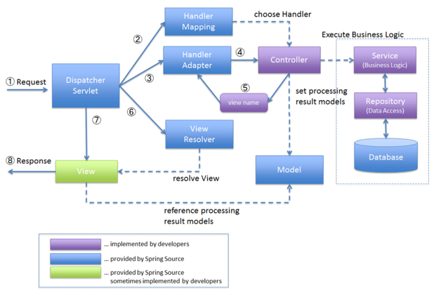

# 📃 목차
- ### [Spring MVC 구조](#-spring-mvc-구조)
- ### [Spring MVC 기본기능](#-spring-mvc-기본기능)
    - #### [요청 매핑](#-요청-매핑)
    - #### [Method Argument](#-method-arguments)


# 📌 Spring MVC 구조
     
> Spring MVC의 동작 흐름도.

처리 순서는 다음과 같다
#### 1. DispatcherSevlet 에서 요청을 받음.
> - 요청을 받기전 CORS 등의 Filter 를 먼저 거친다.
#### 2. HandlerMapping 에서 요청을 처리할 핸들러(컨트롤러)를 찾음.
#### 3. 요청을 처리할 수 있는 HandlerAdapter를 찾아 요청을 처리.
#### 4. 핸들러의 리턴값을 보고 처리 판단
> - @ResponseBody 라면 Converter를 사용하여 데이터 반환(REST API) , 아니라면 5번 과정.
#### 5. viewName을 받아 ViewResolver 에게서 해당하는 뷰를 찾아 모델 데이터 랜더링.
#### 6. 예외가 발생한다면 ExeceptionHadler에게 예외 처리 위임.
#### 7. 응답 반환.

***

### ☝️ DispatcherServlet
클라이언트의 요청을 가장 앞에서 처리하는 중앙 서블릿이다. 여러가지 컴포턴트들을 가지고 있으며, 이들에게 처리를 위임한다.
클라이언트의 요청을 받아 HandlerMapping에게 Handler를 찾아줄 것을 요청한다.

DispatcherServlet -> FrameworkSerblet -> HttpServletBen -> HttpServlet 의 구조로 상속되어 있다.    
결국 중요한 것은 DispatcherServlet은 HttpServlet을 상속받았다는 것이다. 때문에 HttpSevlet의 기능을 모두 사용할 수 있다.
기본적으로 모든 경로에 대해 매핑되어 있다. 다른 서블릿도 함께 동작하는데 이는 자세한 경로가 더 우선순위가 높기 때문이다.

서블릿이 호출되면 HttpServlet이 제공하는 service()가 호출된다. 여러 로직들이 실행되는데 가장 중요한 것은
doDispatch() 메서드이다.
다음은 doDispach() 메서드의 일부이다.
```java
protected void doDispatch(HttpServletRequest request, HttpServletResponse response) throws Exception {
    try {
        // Determine handler for the current request.
        mappedHandler = getHandler(processedRequest);
        if (mappedHandler == null) {
            noHandlerFound(processedRequest, response);
            return;
        }

        // Determine handler adapter for the current request.
        HandlerAdapter ha = getHandlerAdapter(mappedHandler.getHandler());
        

        if (!mappedHandler.applyPreHandle(processedRequest, response)) {
            return;
        }

        // Actually invoke the handler.
        mv = ha.handle(processedRequest, response, mappedHandler.getHandler());

        if (asyncManager.isConcurrentHandlingStarted()) {
            return;
        }

        mappedHandler.applyPostHandle(processedRequest, response, mv);
        
        processDispatchResult(processedRequest, response, mappedHandler, mv, dispatchException);
    }
}
```
큰 흐름만을 보기 위해 예외 처리와 같은 다른 부수적인 코드는 제거하였다.   
처음에 getHandler() 메서드를 실행하여 요청에 맞는 핸들러를 찾아온다. 그 다음에 해당 핸들러를 처리할 수 있는 어댑터를 getHandlerAdapter()메서드를 이용하여 가져온다.
가져온 핸들러의 handle() 메서드를 실행하여 핸들러에서 요청을 처리한다. 결과 값으로는 ModelAndView 객체를 반환 받는다.
실행전에 HandlerInterceptor 인 PreHandler()를 실행하는 것도 확인할 수 있다.

반환받은 ModelAndView 객체에서 ViewName을 가져오고 processDispatchResult() 메서드를 실행한다.
실행전에 PostHandler()를 실행 한다. processDispatchResult()를 확인해보면 View를 랜더링 하는 부분을 확인할 수 있다.    
```render(mv, request, response);```


### ☝️ HandlerMapping
HandlerMapping 에서는 요청을 처리할 수 있는 컨트롤러를 찾아 오고 미리 등록된 HandlerAdapter 목록을 순회하며, 이를 처리할 HadlerAdapter 를 찾는다.

DispatcherServlet은 다양한 HandlerMapping을 리스트로 가지고 있다.

```java
// matchingBeans.values()는 HandlerMapping Interface 타입. HandlerMapping 들은 이를 구현한다.
this.handlerMappings = new ArrayList<>(matchingBeans.values());
```
1. **RequestMappingHandlerMapping**
    > - 스프링의 기본 핸들러 맵핑, @RequestMapping, @Controller 애노테이션이 붙은 컨트롤러를 처리한다.
    ```java
    @Override
    protected boolean isHandler(Class<?> beanType) {
        return (AnnotatedElementUtils.hasAnnotation(beanType, Controller.class) ||
                AnnotatedElementUtils.hasAnnotation(beanType, RequestMapping.class));
    }
    ```
    > - RequestMappingHandlerMapping 은 ```@Controller``` 나 ```@Component(빈 등록용) + @RequestMapping```
    가 클래스 레벨에서 사용될때 선택된다.
2. SimpleUrlHandlerMapping
    > - URL과 Controller를 직접 맵핑
3. BeanNameUrlHandlerMapping
    > - URL과 Bean 이름을 가지고 컨트롤러와 맵핑
4. ControllerBeanNameHandlerMapping
    > - Bean의 아이디나 이름을 이용해 맵핑    
    > - ex) @Component("/test") -> /test 와 맵핑.
5. ControllerClassNameHandlerMapping
    > - URL과 Controller 명을 일정한 규칙으로 맵핑
    > - ex) main/* -> MainController에서 처리.
6. DefaultAnnotaitonHandlerMapping
    > - @RequestMapping 어노테이션을 이용하여 요청을 처리할 컨트롤러를 구현한다.
    > - ex) RequestMapping("/test")
    > RequestMappingHandlerMapping이 나오면서 Deprecated 되어간다. 


HandlerMapping은 Handler들의 Map을 가진다.
```java
// RequestMappingHandlerMapping, prefixe Map을 가진다.
private Map<String, Predicate<Class<?>>> pathPrefixes = Collections.emptyMap();

// SimpleUrlHandlerMapping, <URL, Handler>의 Map을 가진다.
private final Map<String, Object> urlMap = new LinkedHashMap<>();
```
### ☝️ HandlerAdapter
핸들러 어댑터는 컨트롤러의 메서드를 실행하여 실제 요청을 처리한다. 이를 위해 다양한 핸들러 어댑터가 서블릿에 미리 등록되어 있다.
```java
//matchingBeans.values()는 HandlerAdapters Interface 타입. Adapter 들은 해당 인터페이스를 구현한다.
this.handlerAdapters = new ArrayList<>(matchingBeans.values());
```

- **RequestMappingHandlerAdapter**
  > @RequestMapping 애노테이션 처리.
- HttpRequestHandlerAdapter
  > HttpRequestHandler Interface 처리.
- SimpleControllerHandlerAdapter
  > Controller Interface 처리.
- HandlerFunctionAdapter
    > Web Flux 요청 처리.

이중 주로 스프링에서 사용하는 @RequestMapping 애노테이션에서 동작하는 어댑터는 이름에서도 알 수 있듯 3번째 RequestMappingHandlerAdapter 이다.    
@GetMapping, @PostMapping 등의 어노테이션에도 @RequestMapping 이 포함되어 있다.

ex) ```@GetMapping``` == ```@RequestMapping(method = RequestMethod.GET)```, 편리하게 사용하기 위한 애노테이션을 위한 애노테이션.

핸들러 어댑터는 먼저 요청을 받아 HTTP Method값을 확인하여 처리 가능한지 확인하고, 없다면 예외를 발생시킨다.
또한 세션을 이용하는지 확인하여 세션이 존재한다면 mutex 를 이용하여 Thread-Safe하게 처리할 수 있도록 한다.    
마지막으로 가장 핵심인 invokeHandlerMethod 에서 요청을 처리하고 결과를 반환한다.(ModelAndView) 

### 💡 ArgumentResolver와 ReturnValueHandler

스프링에서는 다양한 Method Argument를 지원한다. 지원하는 Method Argument 를 뒤에서 던져주는 곳이 존재해야 한다.
이런 역할을 하는 것이 ```ArgumentResolver``` 이다.
```RequestMappingHandlerAdapter```에서는 ```ArgumentResolver```를 호출하여 컨트롤러가 필요로하는 파라미터를 생성하고, 모두 준비가 되었을때
컨트롤러를 호출하여 생성된 값을 넘겨준다. 스프링에서는 30개 이상의 ArgumentResolver를 기본으로 제공하고, 리스트에 담겨있다.
해당 리스트를 순회하며 적절한 리졸버를 선택한다.

```java
public interface HandlerMethodArgumentResolver {
    
	boolean supportsParameter(MethodParameter parameter);
	
	@Nullable
	Object resolveArgument(MethodParameter parameter, @Nullable ModelAndViewContainer mavContainer,
			NativeWebRequest webRequest, @Nullable WebDataBinderFactory binderFactory) throws Exception;
}
```
supportsParameter() 메서드로 해당 파라미터를 지원하는지 검사하고, resolveArgument() 메서드에서 파라미터를 생성하여 넘겨준다.


또한, 값의 반환도 다양한 타입으로 할 수 있는것을 확인 할 수 있는데, 이를 위해서 ```ReturnValueHandler```가 존재한다.
응답값을 받아, 변환하는 과정을 담당한다.
```java
public interface HandlerMethodReturnValueHandler {
    
	boolean supportsReturnType(MethodParameter returnType);
	
	void handleReturnValue(@Nullable Object returnValue, MethodParameter returnType,
			ModelAndViewContainer mavContainer, NativeWebRequest webRequest) throws Exception;
}
```
비슷하게 supportsReturnType() 메서드로 반환값을 처리 가능한지 확인하고,
handleReturnValue 에서 반환 값을 생성한다. 예를들어 ModelAndView 같은 경우 해당 메서드의 구현에서 ModelAndViewResolver 에게
객체 생성을 위임하는 것을 확인할 수 있었다.
```java
ModelAndView mav = mavResolver.resolveModelAndView(method, handlerType, returnValue, model, webRequest);
```

<br>

ArgumentResolver와 ReturnValueHandler는 **HttpMessageConverter**를 사용하여 필요한 객체를 생성한다.(@RequestBody, @ResponseBody, HttpEntity)
```java
// HttpEntityMethodProcessor.resolveArgument()
Object body = readWithMessageConverters(webRequest, parameter, paramType);

// HttpEntityMethodProcessor.handleReturnValue()
writeWithMessageConverters(responseEntity.getBody(), returnType, inputMessage, outputMessage);
```
해당 메서드들에서는 컨버터 리스트를 순회하며 적절한 컨버터를 선택한다.

### ☝️ HandlerInterceptor
컨트롤러의 메서드를 실행하기 전에 핸들러 인터셉터에 지정된 일을 실행한다. HandlerInterceptor 인터페이스를 구현 하여 사용할 수 있다.
- preHandle(HttpServletRequest request, HttpServletResponse response, Object handler): 요청 실행 전.
- postHandle(request, response, handler, ModelAndView modelAndView): 요청이 실행된 후.
- afterCompletion(request, response, handler, Exception ex): view를 렌더링한 후, 요청을 완료, 응답 전

### ☝️ HandlerExceptionResolver
예외가 발생했을 때 DispatcherServlet 에서는 예외를 HandlerExceptionResolver 에게 위임한다.
때문에 @ExceptionHandler 에서 예외를 공통적으로 처리할 수 있다. 아래의 4개의 구현체를 가진다.

#### 1. SimpleMappingExceptionResolver 
> 예외 클래스 이름과 ErrorViewName 을 매핑. 브라우저 응용 프로그램에서 오류 페이지를 렌더링하는데 유용하다.
#### 2. DefaultHandlerExceptionResolver
> Spring MVC에서 발생한 예외를 HTTP 상태 코드에 매핑한다.
#### 3. ResponseStatusExceptionResolver
> @ResponseStatus 주석의 값을 기반으로 HTTP 상태 코드에 매핑한다. ```@ResponseStatus(HttpStatus.BAD_REQUEST)```
#### 4. ExceptionHandlerExceptionResolver
> @ExceptionHandler 에서 메서드를 호출하여 예외를 해결 한다.

### ☝️ @ControllerAdvice
@ExceptionHandler 를 사용하여 예외를 처리하고자 할때 @Controller 보다 더 전역적으로 사용하고 싶을 때 사용한다.
```java
@Slf4j
@ControllerAdvice
public class ExceptionAdvice {

    @ResponseStatus(HttpStatus.BAD_REQUEST)
    @ExceptionHandler
    public String handleIllegalArgumentException(IllegalArgumentException exception, @CurrentUser Account account, HttpServletRequest request){
        String username = getUsername(account);
        log.error("[{} Requested {}] But, throw IllegalArgumentException {}",username, request.getRequestURI(),exception.getMessage());

        return "/error/4xx";
    }
    
    private String getUsername(@CurrentUser Account account) {
        String username = "";
        if (account != null) {
            username = account.getUsername();
        }
        return username;
    }
}
```

### ☝️ ViewResolver
실제 뷰를 랜더링 하고 반환한다.

- BeanNameViewResolver
  > 빈 이름으로 뷰를 찾아 반환한다.
- UrlBasedViewResolver
  > redirect 등 ViewName이 아닌 URL로 뷰를 설정한다.
- ThymeleafViewResolver
  > 타임리프 이용시 사용되는 리졸버.
- InternalResourceViewResolver
  > - JSP를 뷰 기술로 이용할 경우 등록한다. 가장 마지막에 오는 리졸버.
  > ```properties
  > # 아래와 같이 설정 정보를 사용해서 등록한다.
  > spring.bvc.view.prefix=/WEB-INF/view/
  > spring.mvc.view.suffix=.jsp
  > ```
  > - View Interface를 구현한 InternalResourceView 를 반환한다. -> forward() 호출.


# 📌 Spring MVC 기본 기능

## 🧐 요청 매핑

### ☝️ 기본 매핑
```java
@RequestMapping(value = {"/hello", "/hello2"})
```
기본 적인 RequestMapping ```{}``` 를 이용하여 여러개의 url을 매핑할 수도 있다.

### ☝️ 메서드 지정
```java
@RequestMapping(value = "/mapping-get", method = RequestMethod.GET)

@GetMapping("/mapping-get")
```
@RequestMapping 의 method 속성값을 이용하여 메서드를 지정할 수 있다.
Spring 에서는 이를 합쳐둔 @GetMapping과 같은 애노테이션을 지원해준다. 실제로 @GetMapping 애노테이션의 선언부분을 보면
다음과 같은 부분을 확인 할 수 있다.```@RequestMapping(method = RequestMethod.GET)```
Post, Delete, Put, Patch 또한 존재한다.

### ☝️ PathVariable
```java
@GetMapping("/mapping/{userId}")
public String mappingPath(@PathVariable String userId){
    ...
}
```
경로에 ```{}``` 와 같이 쓰고, 파라미터 명을 일치시키면 해당 자리에 들어간 값을 파라미터에 넣어준다.
```@PathVariable("userId") String id``` 와 같이 사용하여 파라미터명을 다르게 설정할 수도 있다.

### ☝️ Params 조건
```java
@GetMapping(value = "/mapping-param", params = "mode=debug")
public String mappingParam(@RequestParam("mode") String mode){
    ...
}
```
```params``` 속성을 이용하여 쿼리 파라미터의 조건을 지정한다. '=', '!=', '!' 와 같이 지정할 수 있으며, mode와 같이 쿼리 파라미터의
이름만을 적으면 해당 파라미터 이름이 있는지를 본다. 조건에 맞지 않으면 요청을 받지 않는다.(400 Bad Request 발생.)


### ☝️ Headers 조건
```java
@GetMapping(value = "/mapping-header", headers = "mode=debug")
public String mappingHeader(@RequestHeader("mode") String mode){
    ...
}
```
Params와 유사하다. Headers 에서는 헤더의 조건을 검사한다.

### ☝️ Content-Type, Accept 헤더 조건
```java
@PostMapping(value = "/mapping-consume", consumes = MediaType.APPLICATION_JSON_VALUE, produces = MediaType.TEXT_HTML_VALUE)
public String mappingConsumes(){
    ...
}
```
```consumes``` 는 Content-Type 을, ```produces``` 는 Accept 헤더에 조건을 건다.   
consumes 와 일치하지 않으면 415 Unsupported Media Type 에러가, produces와 일치하지 않으면 406 Not Acceptable 에러가 발생한다.


## 🧐 Method Arguments
```java
@GetMapping("/headers")
public String headers(HttpServletRequest request,
                      HttpServletResponse response,
                      HttpMethod httpMethod,
                      Locale locale,
                      @RequestHeader MultiValueMap<String, String> headers, /* MultiValueMap: 하나의 키에 여러 값을 받을 수 있다(배열)*/
                      @RequestHeader("host") String host,
                      @CookieValue(value = "cookieName", required = false) String cookie){

    ...
}
```
HttpMethod, Locale, cookie, Content-Type 등의 헤더 정보를 가져올 수 있다. MultiValueMap을 이용하여 한번에 가져올 수도 있으며,
각각을 받거나 ```@RequestHeader("headerName")``` 로 특정 헤더를 받아올 수 있다.

스프링에서는 Request, Response, HttpSession, Principal 등을 메서드 인자로 사용할 수 있도록 지원해준다.
InputStream, OutputStream 을 이용하여 요청 본문의 전체를 읽을 수도 있고, 응답을 작성할 수도 있다.
이 외에도 다양한 애노테이션과 파라미터, 응답 형식을 지원한다. 자세한 내용은 아래 스프링 공식 문서에서 확인 할 수 있다.

> - https://docs.spring.io/spring-framework/docs/current/reference/html/web.html#mvc-ann-arguments

이중 요청과 응답에 관련한 Argument 들을 알아보자.

    - 요청
        - 요청 파라미터 처리
        - 요청 메시지(Body) 처리 - String
        - 요청 메시지 처리(Body) - JSON
    - 응답
        - 정적 리소스
        - 동적 리소스(템플릿 등)
        - HTTP 메시지(API)

### ☝️ 요청 파라미터 처리
GET 메서드 방식에서의 쿼리 파라미터, POST 방식의 HTML Form 전송은 동일한 형식을 가지고, 이를 요청 파라미터라고 한다.
Spring MVC에서 요청 파라미터를 받는 방법을 알아보자.

- ### HttpServletRequest
    ```java
    @RequestMapping("/request-param")
    public void requestParam(HttpServletRequest request, HttpServletResponse response) throws IOException{
        String username=request.getParameter("username");
        int age=Integer.parseInt(request.getParameter("age"));
    
        ...
    }
    ```
    Servlet 에서와 동일하게 HttpServletRequest 객체에서 파라미터 이름으로 조회할 수 있다.

- ### @RequestParam
    ```java
    @RequestMapping("/request-param")
    public String requestParam(@RequestParam("username") String name,
                               @RequestParam("age") int age){
        ...
    }
    ```
    ```@RequestParam``` 애노테이션을 이용한다. 요청 파라미터의 이름과 메서드 파라미터의 이름을 동일하게 한다면 요청 파라미터 이름은 생략이 가능하고(```@RequestParam String username```),
    @RequestParam 애노테이션 도한 생략이 가능하다.(```String username```)
    
    ```java
    @RequestMapping("/request-param")
    public String requestParam(@RequestParam Map<String, Object> params){
        ...
    }
    ```
    Map으로 받을 수도 있고, MultiValueMap 으로 한 파라미터 이름에 여러개의 값을 받을 수도 있다.   
    참고로 ```@RequestParam String username``` 에서 ```username=kim1&username=kim2``` 같은 여러개의 값을 받을 수는 있다.
    이때는 ```kim1,kim2``` 와 같은 String 값이 된다.

- ### @RequestParam 속성(required, defaultValue)
    ```java
    @RequestMapping("/request-param")
    public String requestParamAttribute(@RequestParam(required = true, defaultValue = "GUEST") String username,
                                       @RequestParam(required = false) Integer age){
        ...
    }
    ```
    **required** 속성은 반드시 들어와야 하는지에 대한 지정이다. 기본은 **true**로 설정되어 있으며, 값이 들어오지 않으면 **400 BadRequest** 가 발생한다.
    빈 문자열("") 또한 값이 들어오지 않은 것으로 간주하니 주의가 필요하다.    
    **false**로 설정되어 있으면 값이 들어오지 않아도 에러가 발생하지 않는다. 이때는 파라미터 값을 **null**로 채운다.
    때문에 원시형 자료형을 사용한다면 null을 넣을 수 없어 서버 에러가 발생한다. Wrapper 클래스 타입으로 선언하도록 하자.
    
    **defaultValue**는 값이 들어오지 않았을 때 파라미터에 들어가게 되는 값을 설정한다. 이 때는 빈 문자열 또한 기본값으로 세팅해준다.


- ### @ModelAttribute
    ```java
    @RequestMapping("/model-attribute")
    public String requestParamMap(@ModelAttribute("data") HelloData helloData, Model model){
        HelloData helloData1 = (HelloData)model.getAttribute("data");
        
        ...
    }
    ```
    @ModelAttribute 를 이용하여 바로 요청 파라미터 값을 담은 객체를 생성할 수 있다.
    스프링 MVC 에서 대상 객체를 생성하고, 요청 파라미터의 이름으로 객체에서 프로퍼티를 찾는다. 그리고 해당 프로퍼티의 Setter를 호출하여
    값을 바인딩 한다.(필드명과 파라미터 이름이 동일해야 한다.)   
    
    애노테이션은 생략이 가능하다. 애노테이션을 생략하게 되면 int, String, Integer 과 같은 단순 타입은 @RequestParam 으로 적용되고,
    나머지는 @ModelAttribute가 적용된다.(argument resolver로 예외 지정 가능.)
    
    한가지 기능이 더 있는데 @ModelAttribute 의 타겟 객체는 자동으로 Model 객체에 들어간다. 속성값을 주지 않으면 클래스의 카멜케이스로 어트리뷰트 이름이 지정되고,
    속성으로 이름을 지정해줄 수 있다.(위의 예시에서 data와 같이)


### ☝️ 요청 메시지 처리 - String
Http Message Body에 데이터를 직접 담아서 요청한다. 주로 HTTP API 에서 사용된다.
    
- ### HttpServletRequest
    ```java
    @PostMapping("/request-body-string")
    public void requestBodyString(HttpServletRequest request, HttpServletResponse response) throws IOException {
        ServletInputStream inputStream = request.getInputStream();
        
        // Stream 은 바이트이기 때문에 항상 인코딩을 지정해 주는 것이 좋다.
        String messageBody = StreamUtils.copyToString(inputStream, StandardCharsets.UTF_8); 
    
        response.getWriter().write("OK");
    }
    ```
    Servlet 때와 동일하게 HttpServletRequest 객체에서 InputStream 을 얻어와 MessageBody 를 읽어온다.

- ### InputStream
    ```java
    @PostMapping("/request-body-string")
    public void requestBodyStream(InputStream inputStream, Writer writer) throws IOException {
        String messageBody = StreamUtils.copyToString(inputStream, StandardCharsets.UTF_8);
    
        writer.write("OK");
    }
    ```
    스프링의 지원을 받아 InputStream을 바로 파라미터로 받아 이를 사용한다.

- ### HttpEntity
    ```java
    @PostMapping("/request-body-string")
    public HttpEntity<String> requestBodyEntityV1(HttpEntity<String> httpEntity) throws IOException {
    
        String messageBody = httpEntity.getBody();
        HttpHeaders headers = httpEntity.getHeaders();
    
        return new HttpEntity<>("OK");
    }
    ```
    HttpEntity를 사용하여 메시지 본문이나 헤더를 가져올 수 있다. 응답의 본문 또한 설정 가능하다.
    HttpMessageConverter에 의해 동작한다. Http 메시지 <-> String

- ### RequestEntity
    ```java
    @PostMapping("/request-body-string")
    public HttpEntity<String> requestBodyEntityV2(RequestEntity<String> requestEntity) throws IOException {
    
        String messageBody = requestEntity.getBody();
        HttpHeaders headers = requestEntity.getHeaders();
        String requestMethod = requestEntity.getMethod();
        String requestUrl = requestEntity.getUrl();
        
        return new ResponseEntity<>("OK", HttpStatus.OK);
    }
    ```
    HttpEntity를 상속받는다. HttpEntity보다 더 많은 기능(특화된)을 제공한다. 

- ### @RequestBody
    ```java
    @ResponseBody
    @PostMapping("/request-body-string-v5")
    public String requestBodyAnnotation(@RequestBody String messageBody, @RequestHeader Map<String, Object> headers) throws IOException {
    
        log.info("message Body = {}", messageBody);
        log.info("headers = {}", headers);
    
        return "OK";
    }
    ```
    스프링에서 지원하는 @RequestBody, @RequestHeader 애노테이션을 이용하여 본문과 헤더의 내용을 가져온다.
    

### ☝️ 요청 메시지 처리 - JSON

- ### @RequestBody String
    ```java
    @ResponseBody
    @PostMapping("/request-body-json")
    private String requestBodyJson(@RequestBody String messageBody) throws JsonProcessingException {
    
        HelloData helloData = objectMapper.readValue(messageBody, HelloData.class);
    
        return "OK";
    }
    ```
    @RequestBOdy 애노테이션을 이용하여 메시지 바디를 JsonString 으로 받고, ObjectMapper를 이용하여 이를 객체로 변환한다.
    
- ### @RequestBody Dto
    ```java
    @ResponseBody
    @PostMapping("/request-body-json-v3")
    private HelloData requestBodyJsonV3(@RequestBody HelloData helloData){
        log.info("helloData = {}", helloData);
    
        return helloData;
    }
    ```
    @RequestBody를 이용하여 바로 Dto 객체에 데이터를 담 는다. 이땐 MappingJackson2HttpMessageConverter 가 동작하여 이를 변환해준다.
    @RequestParam과는 달리 애노테이션을 생략할 수 없다. 위에서 설명 했듯 애노테이션을 생략하게 되면 int, String과 같은 타입은 @RequestParam 으로, 나머지는 @ModelAttribute 로
    동작하게 된다.
    
    따라서 애노테이션을 생략하게 되면 요청 파라미터를 처리하게 되므로, 메시지의 바디를 처리할 수 없게 된다.
    해당 객체의 필드는 null, 0 등 필드의 기본값이 된다.
    
    @ResponseBody 애노테이션은 String 뿐만 아니라 객체도 컨버터를 이용하여 Json 형식으로 변환하여 응답을 작성해준다.
    
    
- ### HttpEntity<Dto>
    ```java
    @ResponseBody
    @PostMapping("/request-body-json-v4")
    private String requestBodyJsonV4(HttpEntity<HelloData> entity) throws JsonProcessingException {
        log.info("helloData = {}", entity.getBody());
        log.info("headers = {}", entity.getHeaders());
    
        return "OK";
    }
    ```
    애노테이션을 사용하지 않는 방법이 있다. HttpEntity의 제네릭 타입으로 Dto를 사용하는 방법이다.
    getBody(), getHeaders()를 이용하여 데이터를 꺼낼 수 있다.

### ☝️ 응답, 정적 리소스, 뷰 템플릿
요청에 대한 응답으로 정적, 동적 HTML 파일을 돌려줄 수 있다.   
스프링 부트에서는 ```/static```, ```/public```, ```/resources```, ```/META-INF/resources``` 의 클래스 패스 디렉토리의 정적 리소스 패스를 제공한다.   
> classpath : src/main/resources

예를 들어 ```/static/hello/hello.html``` 에는 다음과 같이 접근할 수 있다.```http://localhost:8080/hello/hello.html```

Thymeleaf 에서는 다음과 같은 경로를 제공한다. ```/resources/template/``` 이는 Thymeleaf 라이브러리를 추가했을 때
자동으로 설정되는 아래의 설정을 통해 지정된다.
```properties
spring.thymeleaf.prefix=classpath:/templates
spring.thymeleaf.sufix=.html
```

- ### 뷰 템플릿: ModelAndView 반환
  ```java
  @RequestMapping("/response-view")
    public ModelAndView responseView(){
        ModelAndView mv = new ModelAndView("response/hello")
                .addObject("data", "hello!");
        return mv;
    }
  ```
  src/main/resources/template 에서 response/hello.html 을 찾게 된다.

- ### 뷰 템플릿: String(ViewPath) 반환
  ```java
  @RequestMapping("/response-view")
  public String responseView(Model model){
      model.addAttribute("data", "hello!");
      return "response/hello";
  }
  ```
  @ResponseBody 가 없기 때문에 뷰 리졸버를 실행하여 뷰를 찾고 렌더링 한다.
- ### 뷰 템플릿: Void 반환
  ```java
  @RequestMapping("/response/hello")
  public void responseView(Model model){
      model.addAttribute("data", "hello!");
  }
  ```
  @Controller 에서 Http 메시지 바디를 처리하는 파라미터(response, outputStream ..)가 없고, void를 반환한다면
  요청 URL을 논리 뷰 이름으로 사용한다. 권장하지 않는 방법.


### ☝️ HTTP 메시지(API)
HTTP API를 제공하는 경우에는 HTML 응답이 아닌 데이터를 넘겨줘야 한다.
따라서 메시지 바디에 JSON, XML 의 형식으로 데이터 담아 전달한다.

- ### HttpServletResponse
  ```java
  @GetMapping("/response-body-string")
  public void responseBody(HttpServletResponse response) throws IOException {
      response.getWriter().write("OK");
  }
  ```
  응답 객체 자체에 메시지를 바로 작성한다.  

- ### ResponseEntity\<String>
  ```java
  @GetMapping("/response-body-string")
  public ResponseEntity<String> responseBody() {
      return new ResponseEntity<>("ok", HttpStatus.OK);
  }
  ```
  ResponseEntity를 이용하여 응답 메시지(String)과 상태 코드를 담는다.  

- ### @ResponseBody String
  ```java
  @ResponseBody
  @GetMapping("/response-body-string")
  public String responseBody() {
      return "OK";
  }
  ```
  @ResponseBody 애노테이션을 이용하여 String 데이터를 담는다.

- ### ResponseEntity\<Dto>
  
  ```java
  @GetMapping("/response-body-json")
  public ResponseEntity<HelloData> responseJson() {
      HelloData helloData = new HelloData();
      helloData.setUsername("kim");
      helloData.setAge(25);
  
      return new ResponseEntity<>(helloData, HttpStatus.OK);
  }
  ```
  ResponseEntity<Dto> 를 이용하여 JSON 형식의 데이터와 상태 코드를 담는다.  

- ### @ResponseBody Dto + @ResponseStatus
  ```java
  @ResponseStatus(HttpStatus.OK)
  @ResponseBody
  @GetMapping("/response-body-json")
  public HelloData responseJson() {
      HelloData helloData = new HelloData();
      helloData.setUsername("kim");
      helloData.setAge(25);
  
      return helloData;
  }
  ```
  @ResponseBody 애노테이션을 이용하여 JSON 형식의 데이터를 담고, @ResponseStatus 를 이용하여 상태 코드를 설정한다.
  위의 방식과 비슷하지만, 위의 방식은 상황에 따라 다른 코드가 담기도록 if문 등의 설정이 가능하다(동적 설정) 변경할 일이 없다면
  애노테이션을 사용하여 설정해도 무방하다.

<br><br><br>
> - https://codingnotes.tistory.com/28
> - https://velog.io/@jihoson94/Spring-MVC-HandlerAdapter-%EB%B6%84%EC%84%9D%ED%95%98%EA%B8%B0
> - https://docs.spring.io/spring-framework/docs/current/reference/html/web.html#mvc-exceptionhandlers
> - http://www.mungchung.com/xe/spring/21278