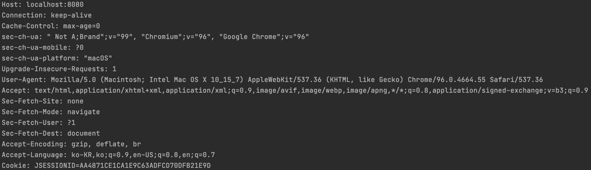
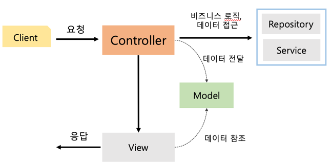
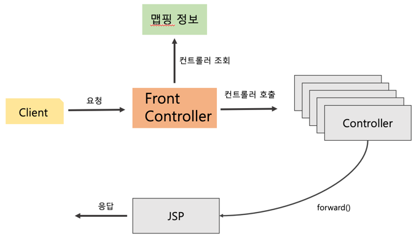

- ### [Servlet](#-servlet)
  - #### [HttpServletRequest](#-httpservletrequest)
  - #### [HttpServletResponse](#-httpservletresponse)
    
- ### [서블릿을 사용한 웹 애플리케이션](#-서블릿을-사용한-웹-애플리케이션)
- ### [JSP를 사용한 웹 애플리케이션](#-jsp를-사용한-웹-애플리케이션)
- ### [MVC 패턴](#-mvc-패턴)
- ### [MVC 프레임워크](#-mvc-프레임워크)
 
# 📌 Servlet
****
## 🧐 Servlet 생성
```java
@ServletComponentScan // 서블릿 스캔하여 등록.
@SpringBootApplication
public class ServletApplication {

    public static void main(String[] args) {
        SpringApplication.run(ServletApplication.class, args);
    }
}
```
```@ServletComponentScan```을 사용하여 @ComponentScan처럼 선언된 패키지부터 하위의 모든 패키지에 있는
서블릿을 스캔하여 등록할 수 있다.

```java
@WebServlet(name = "helloServlet", urlPatterns = "/hello")
public class HelloServlet extends HttpServlet {

    @Override
    protected void service(HttpServletRequest request, HttpServletResponse response) throws ServletException, IOException {
    }
}
```
```@WebServlet()```을 이용하여 서블릿을 생성한다. name은 서블릿의 이름, urlPatterns는 서블릿에 매핑된 URL 이다.
두 값은 유일한 값을 가져야 한다.

클라이언트가 요청하면 서블릿의 service 메서드가 호출되게 된다. request와 response 객체를 출력하면 다음과 같다.    
```org.apache.catalina.connector.RequestFacade@e025e73```
퍼사드란 커다란 코드에 대한 간략화된 인터페이스를 제공하는 객체로, 클라이언트가 더 단순하게 사용할 수 있도록 만들어준다.

요청 과정을 조금 더 상세히 말하자면 WAS에서 요청을 받아 요청, 응답 객체를 생성하고 이를 서블릿 컨테이너에 생성된 서블릿에 전달한다.
서블릿에서는 개발자기 사용하기 쉽도록 요청메시지를 파싱하여 ServletRequest 객체를 만들어주고, service() 메서드를 호출한다.
service() 메서드에서는 doGet(), doPost() 와 같은 요청에 해당하는 처리 메서드를 실행한다.
응답으로 Response 객체를 WAS에 넘겨주면 WAS 에서는 이를 기반으로 HTTP Response를 생성하여 클라이언트에게 돌려준다.

다음과 같이 request, response 객체를 사용할 수 있다.
```java
String username = request.getParameter("username");

response.setContentType("text/plain");
response.setCharacterEncoding("utf-8");
response.getWriter().write("hello " + username);  // 바디에 들어간다.
```
- request: 파라미터, URL, 인증여부, 헤더, 메서드, 주소, 프로토콜, 세션, 쿠키 등 요청 정보를 가져올 수 있다. 또한 set, getAttribute()를 이용하여 임시 저장소를 사용할 수 있다.
- response: Content-Type, CharacterEncoding, 상태 코드, 쿠키 등 응답을 설정할 수 있고 바디에 데이터를 추가할 수 있다.


#### 💡 ```logging.level.org.apache.coyote.http11 = debug```를 이용하여 요청 정보를 로깅할 수 있다.


## 🧐 HttpServletRequest

### ☝️ StarLine
```java
System.out.println("request.getMethod() = " + request.getMethod()); //GET
System.out.println("request.getProtocal() = " + request.getProtocol()); // HTTP/1.1
System.out.println("request.getScheme() = " + request.getScheme()); //http
System.out.println("request.getRequestURL() = " + request.getRequestURL()); // http://localhost:8080/request-header
System.out.println("request.getRequestURI() = " + request.getRequestURI());  // /request-test
System.out.println("request.getQueryString() = " + request.getQueryString()); // username=kim&age=25
System.out.println("request.isSecure() = " + request.isSecure()); //https ?
```
메서드, 프로토콜, 스키마, URL, 파라미터 등의 기본적인 요청 정보를 가져올 수 있다.

### ☝️ Header
```java
request.getHeaderNames().asIterator()
                .forEachRemaining(headerName -> System.out.println(headerName + ":" + request.getHeader(headerName)));
```
getHeaderNames()를 이용하여 모든 헤더네임을 가져올 수 있고, getHeader(String name)으로 해당 이름의 헤더값을 가져올 수 있다.    




```java
// Server, Port
System.out.println("request.getServerName() = " + request.getServerName()); 
System.out.println("request.getServerPort() = " + request.getServerPort());

System.out.println("request.getRemoteHost() = " + request.getRemoteHost());
System.out.println("request.getRemoteAddr() = " + request.getRemoteAddr());
System.out.println("request.getRemotePort() = " + request.getRemotePort());

System.out.println("request.getLocalName() = " + request.getLocalName());
System.out.println("request.getLocalAddr() = " + request.getLocalAddr());
System.out.println("request.getLocalPort() = " + request.getLocalPort());

// Locale
request.getLocales().asIterator()
        .forEachRemaining(locale -> System.out.println("locale = " + locale));
System.out.println("request.getLocale() = " + request.getLocale()); // 가장 가중치가 높은(앞에 있는) locale

// Cookies
if (request.getCookies() != null) {
    for (Cookie cookie : request.getCookies()) {
        System.out.println(cookie.getName() + ": " + cookie.getValue());
    }
}

// Content
System.out.println("request.getContentType() = " + request.getContentType()); // null, get이기 때문에.
System.out.println("request.getContentLength() = " + request.getContentLength());
System.out.println("request.getCharacterEncoding() = " + request.getCharacterEncoding());
System.out.println();
```
Server, Remote, Local 정보를 가져올 수 있고, Locale, 쿠키, Content 관련 값들을 가져올 수 있다.

### ☝️ GET 쿼리 파라미터
#### - getParameterNames()
```java
request.getParameterNames().asIterator()
                .forEachRemaining(paramName -> System.out.println(paramName + " = " + request.getParameter(paramName)));
```
getParameterNames()로 파라미터이름을 모두 가져올 수 있고, getParameter(String name)으로 값을 가져올 수 있다.
반복문을 이용하여 모든 파라미터를 조회할 수 있다. 하지만 실제로는 이렇게 모든 파라미터를 가져오는 경우는 거의 없을 것이다.
때문에 아래와 같이 단일 파라미터를 조회하는 방법을 주로 사용한다.

#### - getParameter(String name)
```java
request.getParameter("username");
```
 하지만 ```?username=kim&username=kim2``` 처럼 username 이라는 이름으로 여러개의 값이 요청으로 들어올 수 도 있다.
 이 때 위와 같은 방식으로 조회하게 되면 첫 값만 가져오게 된다. 모든 값을 가져오고 싶다면 아래의 방법을 사용한다
 
#### - getParameterValues(String name)
```java
String[] usernames = request.getParameterValues("username");
for (String username : usernames) {
    System.out.println("username = " + username);
}
```
파라미터 이름에 해당하는 값을 배열로 가져온다. 키와 값(배열)로 모든 파라미터로 조회하는 방법도 있는데 아래와 같다.

#### - getParameterMap()
```java
Map<String, String[]> parameterMap = request.getParameterMap();
    for(Map.Entry<String, String[]> entry : parameterMap.entrySet()){
        for(String value : entry.getValue()){
            System.out.println(entry.getKey() + " = " + value);
        }
    }
```
Map으로 모든 파라미터를 가져온다. 이때 value는 String[] 배열 형태로 이름에 해당하는 값을 getParameterValues()와 같이 모두 가져온다.

### ☝️ POST HTML Form 파라미터
HTML의 Form 에서 POST 메서드로 전송되는 데이터는 요청의 Body에 담겨 쿼리 파라미터 형식으로 전송된다. 이 때 Content-Type은
application/x-www-form-urlencoded 가 된다.

클라이언트에서는 구분되지만 서버 입장에서는 똑같이 위의 GET방식의 쿼리 파라미터와 동일한 메서드로 값을 얻을 수 있다.

### ☝️ API 메시지 바디
쿼리 파라미터 형식으로 전송되는 경우도 있지만 API 형식으로 사용되는 서버의 경우
XML, TEXT, JSON 특히 JSON 형태의 데이터가 바디에 담겨오는 경우가 많다. 이를 어떻게 수신하고, 파싱할 수 있을지 알아보자.
```java
ServletInputStream inputStream = req.getInputStream();
String messageBody = StreamUtils.copyToString(inputStream, StandardCharsets.UTF_8);
```
일반 text/plain 데이터의 조회는 InputStream과 StreamUtils의 메서드를 이용하여 쉽게 String으로 변환이 가능하다.
그렇다면 JSON은 어떨까? 
```java
ServletInputStream inputStream = req.getInputStream();
String messageBody = StreamUtils.copyToString(inputStream, StandardCharsets.UTF_8);

// Convert to Dto
HelloData helloData = objectMapper.readValue(messageBody, HelloData.class);
```
데이터를 String으로 변환하는 것 까지는 일반 text/plain과 동일하다 하지만 Json 데이터는 사용하기 쉽게 객체로 변환하여 많이 사용한다.
이때 사용되는 것이 Jackson 라이브러리의 ObjectMapper 이다. readValue() 메서드를 사용하여 JSON 형식의 데이터를 객체로 변환할 수 있다.


## 🧐 HttpServletResponse
response 객체는 응답 코드, 헤더 생성, 바디 생성의 역할을 담당한다.

#### - Status
```java
// import javax.servlet.http.HttpServletResponse;
response.setStatus(HttpServletResponse.SC_OK);
```
200, 302 등으로 적어도 되지만 더 명시적으로 값을 넣기 위해 사용한다.

#### - Header
```java
// import org.springframework.http.HttpHeaders;

response.setHeader(HttpHeaders.CONTENT_TYPE, "text/plain;charset=utf-8");
response.setHeader(HttpHeaders.CACHE_CONTROL, "no-cache, no-store, must-revalidate");
response.setHeader(HttpHeaders.PRAGMA, "no-cache");
response.setHeader("custom-Header", "my Header");
```
setHeader를 이용하여 Header를 추가할 수 있다. 마찬가지로 Content-Type 과 같이 문자열로 적어도 되지만 Spring framework에서 지원하는
HttpHeaders 를 이용하여 오타 걱정없이 헤더를 지정할 수 있다. 이 외에도 Cookie, Redirect 도 동일한 방식으로 지정 가능하지만
setHeader()를 이용한 방법 말고도 더 쉽게 값을 설정할 수 있는 편의 메서드를 제공한다.

#### - Content
```java
response.setContentType("text/plain");
response.setCharacterEncoding("utf-8");
```
Encoding 형식을 명시하지 않으면 Tomcat에서 자동으로 ISO-8859-1 로 지정해준다.    
Content-Length는 지정하지 않으면 자동으로 넣어준다.
#### - Cookie
```java
// response.setHeader("Set-Cookie", "myCookie=Umm it's delicious; Max-Age=600");

Cookie cookie = new Cookie("myCookie",  "delicious");
cookie.setMaxAge(600);
response.addCookie(cookie); 
```

#### - Redirect
```java
response.sendRedirect("/basic/hello-form.html");
```
상태 코드를 변경해주지 않아도 자동으로 302 FOUND로 변경되고 Location 헤더에 url값이 들어가게 된다.    
```Location: localhost:8080/basic/hello-form.html```

#### - 응답 메세지
```java
response.getWriter().write(message);
response.getWriter().println(message);
response.getWriter().append(message);

ServletOutputStream outputStream = response.getOutputStream();
outputStream.println(message);
```
response 객체는 바디에 응답 메세지를 추가하는 다양한 메서드를 지원한다. 이를 이용해서 일반 텍스트, HTML, JSON 등의 응답을
추가할 수 있다.

- HTML
```java
response.setContentType("text/html");
response.setCharacterEncoding("utf-8");;

PrintWriter writer = response.getWriter();
writer.println("<html>");
writer.println("<body>");
writer.println("    <div> Hello </div>");
writer.println("</body>");
writer.append("</html>");
```
Content-Type을 text/html 으로 설정하고, HTML 문법에 맞게 String 으로 응답을 돌려주면 브라우저에서 이를 렌더링해서 보여준다.


- JSON
```java
response.setContentType("application/json");
// response.setCharacterEncoding("utf-8");

HelloData helloData = new HelloData();
helloData.setUsername("kim");
helloData.setAge(25);

String result = objectMapper.writeValueAsString(helloData);
ServletOutputStream outputStream = response.getOutputStream();
outputStream.println(result);
```
응답 객체를 생성하고 Jackson 라이브러리의 ObjectMapper.writeValueAsString() 을 이용하여 객체를 JSON 형식의 String으로 변환해준다.
JSON에서는 스펙상 utf-8 형식을 사용하도록 정의되어 있어, 인코딩을 지정해주는 추가 파라미터가 필요없다.
하지만 ```response.getWriter().write()``` 를 이용한다면 자동으로 CharacterEncoding 을 넣어주게 된다.   
```OutputStream``` 을 사용해 데이터를 추가한다면 자동으로 추가하지 않는다.


# 📌 서블릿을 사용한 웹 애플리케이션
***
Servlet에 대해 알아보았으니 이를 이용하여 간단한 회원가입 웹 애플리케이션을 만들어보자.
```java
 @Override
protected void doPost(HttpServletRequest request, HttpServletResponse response) throws IOException {
        Member member = makeMemberObj(request);
        Member saveMember = saveMember(member);

        setPostResponse(response, member);
        }

@Override
protected void doGet(HttpServletRequest req, HttpServletResponse response) throws ServletException, IOException {
        setGetHeader(response);
        setGetBody(response);
        }
```
동일한 URL로 GET, POST를 모두 지원하여 GET일 때는 회원가입 폼을, POST일 때에는 Save 할 수 있도록 만들기 위해 
doGet(), doPost() 오버라이딩 하였다. 요청이 들어오면 HTTP 메서드를 검사해 알맞은 메서드를 호출해준다.
doGet() 에서는 text/html 타입으로 회원가입 폼을 보여주고 doPost() 에서는 HTML Form 형식으로 데이터를 받아 Repository에 저장한다.

또한, 저장된 회원 목록을 볼 수 있도록 GET 방식으로 리스트를 조회했을 때 text/html 타입으로 돌려주도록 작성하였다.
아래는 html을 작성하는 코드이다.
```java
private void setBody(HttpServletResponse response, ArrayList<Member> members) throws IOException {
    PrintWriter w = response.getWriter();
    w.write("<html>\n");
    w.write("<head>\n");
    w.write("    <meta charset=\"UTF-8\">\n");
    w.write("    <title>Title</title>\n");
    w.write("</head>\n");
    w.write("<body>\n");
    w.write("<a href=\"/index.html\">메인</a>\n");
    w.write("<table>\n");
    w.write("    <thead>\n");
    w.write("       <th>id</th>\n");
    w.write("       <th>username</th>\n");
    w.write("       <th>age</th>\n");
    w.write("    </thead>\n");
    w.write("    <tbody>\n");

    for(Member member : members){
        w.write("       <tr>\n");
        w.write("       <td>" + member.getId() + "</td>\n");
        w.write("       <td>" + member.getUsername() + "</td>\n");
        w.write("       <td>" + member.getAge() + "</td>\n");
        w.write("       </tr>\n");
    }

    w.write("   </tbody>\n");
    w.write("</table>\n");
    w.write("</body>\n");
    w.write("</html>\n");
}
```
자바 코드로 작성되었지만, 자바로 작성하는 이점이 거의 없다. 그저 문자열로 다를 뿐이다. 그냥 HTML을 작성하는 것과
다른점이 있다면 동적으로 데이터를 변경할 수 있다는 점이다.
하지만 이렇게 HTML을 작성하는 것은 매우 번거롭고 비효율 적이다. 때문에 다음에는 템플릿 엔진을 이용하여 이를 해결해 본다.

# 📌 JSP를 사용한 웹 애플리케이션
***
- JSP 문서의 시작: ```<%@ page contentType="text/html;charset=UTF-8" language="java" %>```
- import: ```<%@ page import="com.servlet.domain.member.Member" %>```
- Java 코드 작성: ```<% ... %>```
- Java 값 출력 : ```<%=value%> ```

#### - 멤버 리스트 조회(/jsp/members.jsp)
url은 webapp 패키지부터 jsp 파일의 경로를 모두 적는다. 
```java
<%@ page import="com.servlet.domain.member.Member" %>
<%@ page import="com.servlet.domain.member.MemberRepository" %>
<%@ page import="java.util.ArrayList" %>
<%@ page contentType="text/html;charset=UTF-8" language="java" %>

// 로직
<%
    MemberRepository memberRepository = MemberRepository.getInstance();
    ArrayList<Member> result = memberRepository.findAll();
%>

// 뷰
<html>
<head>
    <title>회원 목록</title>
</head>
<body>
    <table>
        <thead>
            <th>id</th><th>username</th><th>age</th>
        </thead>
        <tbody>
            <%
                for(Member member : result){
                    out.write("     <tr>\n");
                    out.write("         <td>"+member.getId() + "</td>");
                    out.write("         <td>"+member.getUsername() + "</td>");
                    out.write("         <td>"+member.getAge() + "</td>\n");
                    out.write("     </tr>\n");
                }
            %>
        </tbody>
    </table>
</body>
</html>
```
서블릿을 기반으로 동작하기 때문에 response, request, Writer 객체를 바로 사용할 수 있다. 이전에 비하면
HTML을 작성하는 것이 조금 더 편리해졌다. 하지만 HTML과 Java 코드가 섞여 지저분 하고, 로직과 뷰가 분리되어 있지 않다.
모든 코드가 하나의 파일에 포함되어 있고, 프로젝트가 커질 수록 유지보수는 힘들어진다.

이를 해결하기 위해 등장한 것이 **MVC 패턴**이다. MVC 패턴은 모델, 뷰, 컨트롤러로 JSP는 화면을 그리는 일에 집중하고,
Repository의 접근이나 비즈니스 로직은 각각에 집중 할 수 있도록 해주는 패턴이다.


# 📌 MVC 패턴
***
위에서 서블릿과 JSP를 가지고 웹 애플리케이션을 만들었지만 비즈니스 로직과 뷰 코드가 섞여있다는 문제점이 있었다.
변경 라이프사이클 자체도 다르고, 하나의 파일에 모든 코드가 들어있기 때문에 유지보수가 매우 어렵다.   
때문에, 로직과 뷰를 분리할 필요가 있고 이때 사용되는 것이 MVC 패턴이다.

    

- 모든 요청은 컨트롤러를 통한다. 컨트롤러는 파라미터를 검증하고 비즈니스 로직을 실행한 후. 결과 데이터를 모델에 전달한다.
- 모델은 뷰에 출력할 데이터를 담아두는 역할을 한다. 모델이 있기 때문에 비즈니스 로직과 뷰 코드를 분리할 수 있다.
- 뷰는 모델에 담겨있는 데이터를 참조하여 화면을 그린다.(HTML)

MVC 패턴을 사용하여 멤버를 저장하는 로직과 뷰를 작성해보자.
```java
@Override
protected void service(HttpServletRequest request, HttpServletResponse response) throws ServletException, IOException {
    saveMember(request);

    RequestDispatcher dispatcher = request.getRequestDispatcher(SAVE_VIEW_PATH);
    dispatcher.forward(request, response);
}

private void saveMember(HttpServletRequest request) {
    String username = request.getParameter(USER_NAME);
    int age = Integer.parseInt(request.getParameter(AGE));
    Member newMember = memberRepository.save(new Member(username, age));

    request.setAttribute("member", newMember);
}
```
request.setAttribute()를 이용하여 뷰에 전달할 데이터를 모델에 담아둔다. key 이름을 이용하여 뷰에서 이를 참조할 수 있다.
request의 dispatcher.forward()를 이용하여 다른 서블릿이나 JSP로 이동할 수 있다.(서버 내부에서 호출)

forward()는 호출하는 역할이라는 점에서 redirect 와 비슷하다고 생각할 수 있지만. 둘은 다르다. redirect 같은 경우에는 
클라이언트가 location 정보를 받아 다시 요청을 보내게 되지만(URL이 변경됨) forward는 서버 내부에서 호출되기 때문에
재호출이 일어나지 않고, 당연히 URL 또한 변경되지 않는다(클라이언트는 인지하지 못함.)

```html
<%@ page contentType="text/html;charset=UTF-8" language="java" %>
<html>
<head>
    <meta charset="UTF-8">
</head>
<body> 성공
<ul>
    <li>id=${member.id}</li>
    <li>username=${member.username}</li>
    <li>age=${member.age}</li>
</ul>
<a href="/index.html">메인</a>
</body>
</html>
```
이전에 있던 자바코드가 모두 제거 되었고, 모델에서 데이터를 참조하는 부분과 HTML 코드만이 남았다.
이렇게 비즈니스 로직과 뷰를 간단하게 분리할 수 있었다. jsp의 문법인 ```${}```를 이용하여 모델에 저장해둔(Attribute) 데이터를
참조할 수 있다. ```${member.id}```는 내부적으로는 ```(Member)request.getAttribute(key).getId()```와 같은 동작을 한다.


이번에는 멤버 목록을 조회하는 코드를 작성해 보자.
```html

<%@ page contentType="text/html;charset=UTF-8" language="java" %>
<%@ taglib prefix="c" uri="http://java.sun.com/jsp/jstl/core"%>
<html>
<head>
    <title>멤버 리스트</title>
</head>
<body>
    <table>
        <thead>
        <th>id</th><th>username</th><th>age</th>
        </thead>
        <tbody>
            <c:forEach var="member" items="${members}">
                <tr><td>${member.id}</td><td>${member.username}</td><td>${member.age}</td></tr>
            </c:forEach>
        </tbody>
    </table>
</body>
</html>
```
비즈니스 코드는 비슷하므로 생략한다. 모든 멤버를 조회하여 모델에 담아두고 뷰에서는 jsp의 문법을 이용하여
반복문을 통해 목록을 출력한다. prefix를 이용하여 태그를 정의하고, forEach 문을 사용하여 멤버를 순회하였다.

MVC 패턴을 사용하여 비즈니스 로직과 뷰를 분리하는 것에 성공하였다. 하지만 아직 문제가 남아 있다.
위의 코드에서 볼 수 있듯 비즈니스 로직 코드에서 Dispatcher를 가져오는 부분, forward()를 실행하는 부분 등 많은 코드 중복이 발생하고
심지어 위의 로직에서는 request 만을 이용하지만 response 또한 같이 파라미터로 넘겨줘야 함을 확인 할 수 있다.

이를 해결하기 위해서는 컨트롤러 호출 전에 이러한 공통적인 부분을 처리해주는 **프론트 컨트롤러**가 필요하다.
프론트 컨트롤러 패턴은 MVC 프레임워크의 핵심이라고 할 수 있다.


# 📌 MVC 프레임워크
***
MVC 프레임워크의 핵심은 프론트 컨트롤러라고 말 할 수 있다.
Spring MVC의 DispatcherServlet이 바로 프론트 컨트롤러 패턴으로 구현되어 있다.    

     
개선해야할 것이 너무 많기 때문에 하나씩 개선해보도록 하자, 먼저기존 로직을 유지하며 구조만을 변경하기 위해
Map 과 다형성을 이용하여 프론트 컨트롤러를 구현하였다.

#### - 컨트롤러 인터페이스 
```java
public interface ControllerV1 {
    void process(HttpServletRequest request, HttpServletResponse response)
            throws ServletException, IOException;
}
```

#### - 프론트 컨트롤러
```java
@WebServlet(name = "frontControllerV1", urlPatterns = "/front-controller/v1/*")
public class FrontControllerV1 extends HttpServlet {
    private Map<String, ControllerV1> controllers = new HashMap<>();
    private final String FORM_VIEW_PATH = "/front-controller/v1/members/new-form";
    private final String LIST_VIEW_PATH = "/front-controller/v1/members";
    private final String SAVE_VIEW_PATH = "/front-controller/v1/members/save";
    
    public FrontControllerV1() {
        controllers.put(FORM_VIEW_PATH, new MemberFormControllerV1());
        controllers.put(SAVE_VIEW_PATH, new MemberSaveControllerV1());
        controllers.put(LIST_VIEW_PATH, new MemberListControllerV1());
    }

    @Override
    protected void service(HttpServletRequest request, HttpServletResponse response) throws ServletException, IOException {
        String requestURI = request.getRequestURI();

        ControllerV1 controller = controllers.get(requestURI);
        if(controller == null){
            response.setStatus(HttpServletResponse.SC_NOT_FOUND);
            return;
        }
        controller.process(request, response);
    }
}
```
프론트 컨트롤러에 미리 컨트롤러들을 등록해 둔 뒤 요청 URL에 따라 컨트롤러를 실행하게 된다.
ulrPatterns 에서 * 을 사용하여 하위 모든 URL을 매핑한다. 이로서 프론트 컨트롤러가 맨 앞에서 가장 먼저 요청을 받은 후 
적절한 컨트롤러를 찾아 해당 컨트롤러를 호출하고, 컨트롤러에서는 로직을 실행하게 된다.

