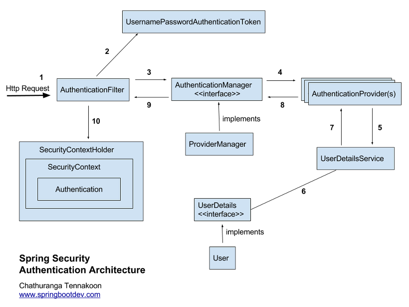
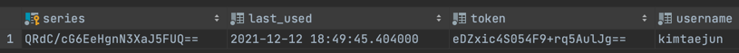

# 📃 목차
- ### [Security 인증 과정](#-spring-security-인증과정)
- ### [Spring Security Custom](#-spring-security-custom)
- ### [인증 객체 가져오기](#-인증-객체-가져오기)
- ### [Remember-Me](#-remember-me)
- ### [테스트에서 사용자 인증](#-테스트에서-사용자-인증)
## 📌 Spring Security 인증과정
***


### 🤔 인증(Authorization)과 인가(Authetication)
스프링 시큐리티에서는 인증 과정을 먼저 거친 후에 인가 절차를 진행하게 된다. 인증 과정에서는 사용자의 여부를, 인가 과정에서는
리소스에 대한 접근 권한을 확인한다.

### 🤔 Authetication
Authentication은 현재 접근 하는 주체의 정보와 권한을 담는 인터페이스 이다. 해당 객체는 Security Context에 저장하여 보관한다.
getCredentials(), getPrincipal(), setAuthenticated(), isAuthenticated() 등의 메소드가 있다.

### 🧐 SpringSecurity의 동작 과정
#### 1. 로그인 정보 Http Request
- 스프링 시큐리티는 연결된 일련의 필터들을 가지고 있다. 요청은 인증과 권한 부여를 위해 필터들을 통과하게 되고,
해당 요청과 관련된 인증 필터에 도착할때 까지 진행된다.
- 로그인 폼 서브밋 요청은 UsernamePasswordAuthenticationFiliter에 도달할 대까지 필터체인을 통과하게 된다.
- AutheticationFilter 에서는 사용자의 JSESSIONID가 Context에 있는지 확인하고 없다면 로직을 수행한다.

#### 2. AuthenticationFilter 에서 요청을 가로채 UsernamePasswordAuthenticationToken 생성.
- 수신된 요청에서 아이디(Principal)와 비밀번호(credential)를 추출하고 이를 기반으로 UsernamePasswordAuthenticationToken 을 생성한다.
- Token의 생성은 두가지로 나뉜다. 요청 토큰의 생성과 인증완료 후 토큰의 생성(다시 돌아올 때).

#### 3. ProviderManager 에게 토큰 전달.
- 만들어진 Token은 AuthenticationManager 의 인증 메서드를 호출하는데 사용된다. 이 때는 AuthenticationManager 를 구현한
ProviderManager 에 의해 사용자 인증을 거친다. ProviderManager 는 AuthenticationProvider 리스트를 가지고 있으며, 이를 순회하며 인증을 시도한다.

#### 4. AuthenticationProvider에 토큰 전달.
제공된 인증 개체로 사용자를 인증한다. 인증전의 Authentication 객체를 받아 인증이 완료된 Authentication 객체를 반환한다.
- CasAuthenticationProvider (Central Authentication Service)
- JaasAuthenticationProvider (Java Authentication and Authorization Service)
- **DaoAuthenticationProvider** (Data Access Object)
- OpenIDAuthenticationProvider
- RememberMeAuthenticationProvider
- LdapAuthenticationProvider (Lightweight Directory Access Protocol)
...
  
주로 우리가 많이 사용하는 Provider은 DB를 이용한 인증인 DaoAuthenticationProvider 일 것이다. 다음 코드는 DaoAuthenticationProvider 에서 찾은
유저 검증 부분이다.
```java
@Override
protected final UserDetails retrieveUser(String username, UsernamePasswordAuthenticationToken authentication)
        throws AuthenticationException {
    prepareTimingAttackProtection();
    try {
        UserDetails loadedUser = this.getUserDetailsService().loadUserByUsername(username);
        if (loadedUser == null) {
            throw new InternalAuthenticationServiceException(
                    "UserDetailsService returned null, which is an interface contract violation");
        }
        return loadedUser;
    }
    catch (UsernameNotFoundException ex) {
        mitigateAgainstTimingAttack(authentication);
        throw ex;
    }
    catch (InternalAuthenticationServiceException ex) {
        throw ex;
    }
    catch (Exception ex) {
        throw new InternalAuthenticationServiceException(ex.getMessage(), ex);
    }
}
```
개발자는 UserDetails를 상속하고 loadUserByUsername() 에서 username으로 DB에 사용자가 있는지 찾게 된다.
만약 존재하지 않는다면 UsernameNotFoundException을 발생시키면 되고, Provider에서는 이걸 잡아 던진다.
코드를 보면 prepareTimingAttackProtection()과 mitigateAgainstTimingAttack()을 볼 수 있는데
코드는 아래와 같다.
```java
private void prepareTimingAttackProtection() {
		if (this.userNotFoundEncodedPassword == null) {
			this.userNotFoundEncodedPassword = this.passwordEncoder.encode(USER_NOT_FOUND_PASSWORD);
		}
	}

private void mitigateAgainstTimingAttack(UsernamePasswordAuthenticationToken authentication) {
    if (authentication.getCredentials() != null) {
        String presentedPassword = authentication.getCredentials().toString();
        this.passwordEncoder.matches(presentedPassword, this.userNotFoundEncodedPassword);
    }
}

private static final String USER_NOT_FOUND_PASSWORD = "userNotFoundPassword";

```
현재 패스워드와 userNotFoundExcodedPassword 를 비교하는 작업을 수행하는데 별 다른 작업이라기 보다는 악의적으로
반복실행 하는것을 막기위한 조치가 아닌가 싶다.

#### 5. UserDetailsService에 전달하고, 서비스에서는 받은 사용자 정보로 DB에서 사용자 정보를 찾아 UserDetails 객체 생성.
- Provider는 사용자 이름을 기반으로 세부 정보를 검색하기 위해 UserDetailsService 를 사용한다.
UserDetailsService 에서는 DB에 저장된 회원의 비밀번호를 조회하여 UserDetails 인터페이스를 구현한 객체(User객체)를 반환한다.

- UserDetailsService는 인터페이스 이며, 이를 구현한 서비스 클래스가 필요하다.

#### 6. AuthenticationProvider에서 UserDetails 객체를 넘겨받고 입력받은 비밀번호와 객체의 비밀번호를 비교.
#### 7. 인증 성공시 권한, 사용자 정보를 담은 완전한 Authentication 객체를 AuthenticationFilter 에 전달.
- AuthenticationManager 는 완전한 인증객체를 관련 인증 필터로 다시 반환한다.
- 인증에 실패하면 AuthenticationException 이 발생하고, AuthenticationEntryPoint 에 의해 처리된다.
#### 8. AuthenticationFilter는 Authentication 객체를 SecurityContext에 저장.


- ### 의존성 추가
```xml
<dependency>
    <groupId>org.springframework.boot</groupId>
    <artifactId>spring-boot-starter-security</artifactId>
</dependency>
```

- ### 스프링 시큐리티
    - 웹 시큐리티
    - 메소드 시큐리티
    - 다양한 인증 밥법 지원 : LDAP, 폼 인증, Basic 인증, OAuth, ...


- ### 스프링 부트 시큐리티 자동 설정
    - SecurityAutoConfiguration : 사실상 spring boot 에서 변경한 부분은 별로 없다.
    - UserDetatilsSeviceAutoConfiguration :
      > UserDetailsService.class, AuthenticationManager.class, AuthenticationProvider.class 가 없을 때 설정 파일이 적용되고,
      랜덤한 유저를 생성해 준다.

- ### 기본 사용자.
    - UserName : user
    - password : application을 실행 할 때 마다 생성되는 랜던 값(console에 출력됨.)
    - spring.security.username
    - spring.security.password


- ## 스프링 시큐리티 Test
```xml
<dependency>
    <groupId>org.springframework.security</groupId>
    <artifactId>spring-security-test</artifactId>
</dependency>
```

### 1. method
```java
mockMvc.perform(get("/hello")
                .with(user("kim").password("1234"))
```
> 가짜 인증 유저를 넣어주어, 권한이 없어 실행할 수 없는 테스트를 실행할 수 있게 해준다.

### 2. Annotation
```java
@WithMockUser
class or Method
```
> 유저 정보를 직접 넣어주어 테스트.


## 📌 Spring Security Custom
***

## 1. extends WebSecurityConfigurerAdapter
```java
//@Configuration
@EnableWebSecurity
public class SecurityConfig extends WebSecurityConfigurerAdapter {

    @Override
    protected void configure(HttpSecurity http) throws Exception {
      http.authorizeRequests()
              .antMatchers("/admin").hasRole(Role.ADMIN.name())  // admin URL은 관리자 접근 가능.
              .antMatchers("/my").hasRole(Role.STUDENT.name())  // my URL 은 학생만 접근 가능
              .anyRequest().permitAll() // 나머지 URL은 인증 필요.
              .and()
            .formLogin()// 만들어주는 formLogin template 사용.
              .and()
            .httpBasic() // accept header에 http가 없는 경우 httpBasic 사용.
              .and()
            .logout()
              .logoutSuccessUrl("/");
    }

    @Bean
    public PasswordEncoder passwordEncoder(){
        return PasswordEncoderFactories.createDelegatingPasswordEncoder();
    }
}
```
> - confugure 메소드를 오버라이딩 하여 접근 권한, 로그인 폼 등 설정.을
> > hasRole 에서 자동으로 앞에 ROLE_ 을 붙여주기 때문에 .name()으로 가져옴.

## 1-1 @EnableGlobalMethodSecurity()
1번과 같이 HttpSecurity를 이용하여 한번에 접근 권한을 지정할수도 있지만 애노테이션을 이용하여 따로 접근 권한을 지정할 수 있다.
이를 위해서는 Configuration 에서 ```@EnableGlobalMethodSecurity(securedEnabled = true, prePostEnabled = true ...)``` 애노테이션이 필요하다.
```java
@PreAuthorize("hasRole('ROLE_ADMIN')")
public void adminPage(){...}

@PostAythorize("hasRole('ROLE_ADMIN')")
public void adminPage(){...}

@Secured("ROLE_ADMIN")
public void adminPage(){...}

```


## 2. implements UserDatailsService
```java
@Service
public class AccountService implements UserDetailsService {
    @Autowired
    private AccountRepository accountRepository;
    @Autowired
    private PasswordEncoder passwordEncoder;

    // User 정보를 받아 계정 생성.
    public Account createAccount(String username, String password){
        Account account = new Account();
        account.setUserName(username);
        account.setPassword(passwordEncoder.encode(password));

        return accountRepository.save(account);
    }


    @Override
    public UserDetails loadUserByUsername(String userName) throws UsernameNotFoundException {
          Optional<Account> byUserName= accountRepository.findByUserName(userName);
          Account account =  byUserName.orElseThrow(()-> new UsernameNotFoundException(userName)); // 없으면 예외를 던지고, 있으면 Account 객체 return
    
          return new User(account.getUserName(), account.getPassword(), authorities(account));
    }
    
    private Collection<? extends GrantedAuthority> authorities(Account account) {
        return Arrays.asList(new SimpleGrantedAuthority(account.getRole().getKey()));
    }
}
```
> - 유저에 대한 클래스인 User을 Spring Security에서 지원. 사용자가 입력한 정보와 DB에 저장된 유저 정보를 비교하고 존재하면 ROLE 부여.
> - getKey()값으로 권한을 생성.

## 3.Password Encode
```java
// config 클래스에 정의.
@Bean
public PasswordEncoder passwordEncoder(){
    return PasswordEncoderFactories.createDelegatingPasswordEncoder();
}

// Service 클래스에서 사용.
@Autowired
private PasswordEncoder passwordEncoder;

account.setPassword(passwordEncoder.encode(password));
```
> - Password 인코더를 Bean으로 정의.
> - Password를 DB에 저장하기 전 암호화하고 저장.
> > 


스프링 시큐리티에서 권장하는 PasswordEncoder는 bcrypt 해시 알고리즘을 사용한다.
#### 💡 왜 bcrypt 를 사용할까?
bcrypt는 blowfish 암호를 기반으로 설계된 암호화 함수이다. blowfish는 key setup phase 라는 무거운 전처리를 요구하여
연산을 느리게 만든다, 또
여러번 반복적으로 암호화를 하기 때문에 반복 횟수를 조정하여 연산 속도를 늦춰 브루트-포스 공격에 대비할 수 있다.  
따라서 일반적으로 GPU 연산에 최적화된 32비트 연산을 사용하는 SHA 암호화 방식보다 비교적 보안이 강력하다.

또 다른 강력한 알고리즘에 비해 구현이 간단하다는 장점이 있다.
조금 더 강력한 보안을 위한다면 scrypt나 Argon2id 등을 고려할 수 있다.

> - key setup phase: cost(반복 횟수,시간), salt, password 필요.
> - password를 가지고 key stretching 을 하여 연산 속도를 늦춘다.
> - 솔트(salt) : 해커가 이미 여러개의 해싱 알고리즘을 사용하여 저장해놓고, 해시값에서 비밀번호를 추론할 수 있기 때문에 이를 방지하기 위해 고안.
> > hash(12345678) -> aaaabbbb    
> > hash(12344567+salt)-> aacabaebb    
> > hash(12344567+salt)-> cafcabaekkb
> > 매번 다른 값이 나옴.

- password의 비교.
```java
passwordEncoder.matches(String rawPassword, String encodedPassword)
```

## 📌 인증 객체 가져오기
***
현재 인증되어있는 사용자를 가져오기 위해서는 Principal 이나 @AuthenticationPrincipal 를 사용할 수 있다

### 🧐 Principal
```java
@GetMapping("/test")
public String principal(Principal principal){
    String principalName = principal.getName();
    ...
}
```
Principal은 자바 표준 객체이다. 하지만 우리가 해당 객체에서 가져올 수 있는 것은 name 밖에 없다.
 @AuthenticationPrincipal을 이용하면 UserDetailsService 에서 반환하는
객체를 받아 사용할 수 있다. 

### 🧐 @AuthenticationPrincipal
```java
@GetMapping("/test")
public String principal(@AuthenticationPrincipal User user){
    user.getUsername();
    user.getPassword();
    user.getAuthorities();
    ...
}
```
User 객체를 가져오기 때문에 name 이외에 password, 권한 등도 가져올 수 있다.
하지만 이런 정보보다 보통 원하는 것은 DB에 저장된 사용자의 정보일 것이다.
엔티티 객체는 다음과 같이 가져올 수 있다.


```java
@AuthenticationPrincipal(expression = "#this =='anonymousUser' ? null :account")
```
User인증이 되지 않으면 Principal 은 "anonymousUser"라는 문자열이다.
인증이 되어있지 않다면 null을 인증이 되어있다면 principal에서 account 객체를 꺼내 넘겨준다.

```java
@Getter
public class UserAccount extends User {

    private Account account;

    public UserAccount(Account account) {
        super(account.getNickName(), account.getPassword(), List.of(new SimpleGrantedAuthority("ROLE_USER")));
        this.account =account;
    }
}
```
- account 라는 필드명은 @AuthenticationPrincipal의 account 와 매핑된다.
- @AuthenticationPrincipal은 UserDetailsService에서 반환하는 객체는 UserDetails 타입의 객체이다.
때문에 이를 구현한 클래스인 User를 상속받는다.

```java
@Override
public UserDetails loadUserByUsername(String nameOrEmail) throws UsernameNotFoundException {
        Account account = accountRepository.findByNameOrEmail(nameOrEmail);
        checkIfAccountExists(nameOrEmail, account);
        return new UserAccount(account);
}
```
userDetailsService의 loadUserByUsername() 에서 반환도 UserAccount 객체를 반환하도록 변경한다.   

Account 객체를 주입받기위한 @AuthenticationPrincipal(...)이 너무 길다. 이를 따로 애노테이션으로 생성해주자.

```java
@Retention(RetentionPolicy.RUNTIME)
@Target(ElementType.PARAMETER)
@AuthenticationPrincipal(expression = "#this =='anonymousUser' ? null :account")
public @interface CurrentUser {

}
```

## 📌 Remember-Me
***
기본적으로 Session의 타임 아웃은 30분으로 설정되어 있다.
```properties
server.servlet.session.timeout=30m
```
RememberMe는 세션이 만료 되더라도 로그인을 유지하기 위해 사용하는 방법이다.
쿠키에 인증 정보를 남겨두고 세션이 만료되면 쿠키에 남아있는 정보로 인증을 시도한다.

- 해시 기반의 쿠키
> - UserName
> - Password
> - 만료기간
> - Key
> - 쿠키를 탈취당하면 그 계정을 탈취당한 것과 같다.

- 조금 더 안전하게 관리하기
> - 쿠키 안에 랜덤한 token을 만들어 같이 저장하고 인증 때마다 변경.
> - Username, 토큰
> - 해당 방법도 취약, 해커가 쿠키로 인증을 하게되면 원 사용자는 인증할 수 없게 됨.

- 개선된 방법
> - UserName, Token(랜덤, 매번 변경), 시리즈(랜덤,고정)
> - 쿠키를 탈취 당하면 원 사용자는 유효하지 않은 토큰과 유효한 시리즈,UserName 으로 접속하게 되고, 이 경우, 모든 토큰을 삭제하여 해커가 더이상 쿠키를 사용하지 못하도록 방지할 수 있다.


- ### 스프링 시큐리티 설정 : 해시 기반
```java
http.rememberMe().key("랜덤 키값");
```

- ### 스프링 시큐리티 설정: 개선된 영속화 기반 설정.

```html
<div class="form-grop form-check">
    <input type="checkbox" class="form-check-input" id="rememberMe", name="remember-me" checked>
    <label class="form-check-label" for="rememberMe" aria-describedby="rememberMeHelp">로그인 유지</label>
</div>
```
- name 을 remember-me로 주고 check box가 true 값이면 remember-me 기능 실행.

```java
@RequiredArgsConstructor
@EnableWebSecurity
@Configuration
public class SecurityConfig extends WebSecurityConfigurerAdapter {

    private final UserDetailsService userDetailsService;
    private final DataSource dataSource;

    @Override
    protected void configure(HttpSecurity http) {
        
        http.rememberMe()
                .userDetailsService(userDetailsService)
                .tokenRepository(tokenRepository());
    }

    private PersistentTokenRepository tokenRepository() {
        JdbcTokenRepositoryImpl tokenRepository = new JdbcTokenRepositoryImpl();
        tokenRepository.setDataSource(dataSource);

        return tokenRepository;
    }
}

```
- RememerMe를 사용하기 위해서는 userDetailsService와 TokenRepository를 넘겨주어야 한다.\
  여기서는 UserDetilasService를 구현한 AccountService를 넘겨 주었다.

```java
@Getter @Setter
@Table(name = "persistent_logins")
@Entity
public class PersistentLogins {

    @Id
    @Column(length = 64)
    private String series;

    @Column(nullable = false, length = 64)
    private String username;

    @Column(nullable = false, length = 64)
    private String token;

    @Column(name = "last_used",nullable = false, length = 64)
    private LocalDateTime lastUsed;
}
```
- JdbcTokenRepositoryImpl에서 토큰을 저장할 PersistentLogin 테이블을 생성해준다.
- JdbcTokenRepositoryImpl class 에서 확인할 수 있다.


자동 로그인을 설정하면 Persistent_login 테이블에 정보가 저장된다.
username, 토큰, 시리즈가 저장된 것을 확인 할 수 있다. 토큰을 탈취 당하게 되면
사용자는 username과 시리즈, 유효하지 않은 토큰으로 접속을 시도하고, 이 때 모든 토큰 정보를 제거해 해커가 접속하지 못하도록 막는다.

## 📌 테스트에서 사용자 인증
***
테스트의 진행을 위해서 사용자의 인증이 필요할 때가 있다 이 때 사용되는 어노테이션이
```@WithMockUser```이다.

```java
@WithMockUser(username = "kimtaejun", password = "123123123", roles = "USER")
```
하지만 이외에 다른 정보를 커스텀하게 설정하고 싶다면 ```@WithSecurityContext``` 를 사용할 수 있다.

```java
@Retention(RetentionPolicy.RUNTIME)
@WithSecurityContext(factory = WithAccountSecurityContextFactory.class )
public @interface WithAccount {
    String value();
}
```
value : username
```java
@RequiredArgsConstructor
public class WithAccountSecurityContextFactory implements WithSecurityContextFactory<WithAccount> {

    private final AccountService accountService;

    @Override
    public SecurityContext createSecurityContext(WithAccount withAccount) {

        // {-- DB에 새 계정 저장 --}
        
        // UserDetails 객체 생성
        UserDetails principal = accountService.loadUserByUsername(withAccount.value());
        
        // Authetication 객체 생성
        Authentication authentication = new UsernamePasswordAuthenticationToken(principal, principal.getPassword(), principal.getAuthorities());
        
        // Context에 인증 객체 저장.(로그인)
        SecurityContext context = SecurityContextHolder.createEmptyContext();
        context.setAuthentication(authentication);

        return context;
    }
}
```
- 테스트를 진행할 때 특정 컨택스트가 등록되어 있어야하는 테스트의 경우(로그인) Securitycontext를 생성하여 등록한 후 테스트를 진행할 수 있다.
> 1. 계정 생성
> 2. UserDetails 객체 생성. (구현체인 springSecurity.core.User)
> 3. 인증 토큰 생성(principal, password, Authorities)
> 4. Security Context를 생성하고 인증토큰을 등록.

class 단위로 ```WithMockUser``` , ```WithSecurityContext```를 사용하고 특정 메서드에서는 인증이 되지 않은 상태로 테스트 하고 싶다면
메서드에서 ```@WithAnonymousUser```를 사용할 수 있다.


<br><br><br>
> - https://doozi0316.tistory.com/entry/Spring-Security-Spring-Security%EC%9D%98-%EA%B0%9C%EB%85%90%EA%B3%BC-%EB%8F%99%EC%9E%91-%EA%B3%BC%EC%A0%95
> - https://mangkyu.tistory.com/7
> - 인프런 백기선님 SpringBoot 강의.
> - https://jusths.tistory.com/158
> - https://ncucu.me/137