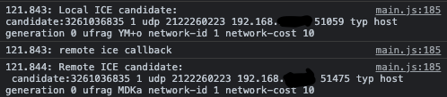
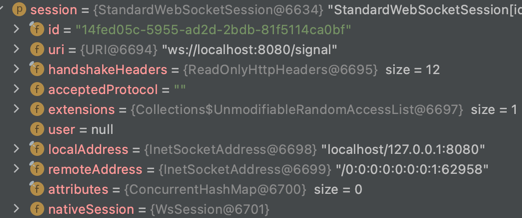
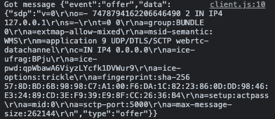

# 🧐 WebSocket
***
> - 서버와 클라이언트 간의 양방향 실시간 통신을 위한 스펙.


## ☝️ 기존의 HTTP 통신
***

### 1. HTTP Pooling
- 클라이언트가 요청을 보내고, 서버에서 응답을 보내 기본적인 방식. 클라이언트가 증하면 서버의 부담이 증가함.

### 2. HTTP Long Pooling
- 클라이언트에서 일단 요청을 보내고 기다리고, 서버에서 이벤트가 발생하면 응답을 돌려줌. 클라이언트는 응답을 받고 다시 요청을 보내 다음 이벤트 발생을
  기다림.
  
### 3. HTTP  Streaming
- 클라이언트 요청을 보내고, 응답을 받아도 연결을 끊지 않고 서버에서 지속적으로 이벤트 발생시 응답을 보냄.

> 📌 세 기술 모두 단방향 통신이라는 한계를 가진다.


## 📌 WebSocket
***
- 최초의 핸드쉐이크로 연결이 이루어진다.
- http와 마찬가지로 80, 443 포트를 사용하여 양방향 통신을 한다.
- 하나의 URL을 이용해 커넥션 되고, 이후에는 이를 통해 통신한다.
- 미지원되는 브라우저가 존재하기 때문에 보통 지원하는 브라우저에서는 WebSocket을 사용하고, 이외에는 Long Pooling방식이 적용되도록 한다.


## 📌 Spring Boot의 WebSocket
****
- spring-boot-starter-websocket
- Fallback 메서드에 SockJS 사용. (브라우저 미지원 등)
- STOMP(Simple Text Oriented Messaging Protocol) : 데이터 교환 및 형식 지정하는 메시징 프로토콜
    > 특정 클라이언트에게만 메시지를 전송하는 등의 역할.

```java
@Configuration
@EnableWebSocketMessageBroker
public class WebSocketConfig implements WebSocketMessageBrokerConfigurer {
    @Override
    public void registerStompEndpoints(StompEndpointRegistry registry) {
        // WebSocket을 사용할 수 없는 경우 FallBack 옵션 활성화.
        registry.addEndpoint("/ws").withSockJS();
    }
    
    @Override
    public void configureMessageBroker(MessageBrokerRegistry registry) {

        //message handling methods로 라우팅 (Controller)
        registry.setApplicationDestinationPrefixes("/app");

        //간단한 인메모리 기반. message broker로 라우팅. (send 목적지)
        registry.enableSimpleBroker("/topic");
    }
}
```

```java
@MessageMapping("/hello")
@SendTo("/topic/greetings")
public Greeting greeting(HelloMessage message){
    return new Greeting("Hello " + HtmlUtils.htmlEscape(message.getName()) +"!");
}
```
- "/app/hello"로 보내진 데이터 수신.
- "/topic/greetings"로  Greeting 객체 전달.

```javascript
function connect() {
    var socket = new SockJS('/ws');
    stompClient = Stomp.over(socket);
    stompClient.connect({}, function (frame) {
        setConnected(true);
        console.log('Connected: ' + frame);
        stompClient.subscribe('/topic/greetings', function (greeting) {
            showGreeting(JSON.parse(greeting.body).content);
        });
    });
}

function disconnect() {
    if (stompClient !== null) {
        stompClient.disconnect();
    }
}
```
- config에서 SockJs의 엔드포인트로 소켓 생성.
- subscribe() : '/topic/greetings' 로 브로드케스트 되는 메시지 수신

```javascript
function sendName() {
    stompClient.send("/app/hello", {}, JSON.stringify({'name': $("#name").val()}));
}
```
- "/app/hello" 로 메시지 전송. JSON 타입.

```javascript
function showGreeting(message) {
    $("#greetings").append("<tr><td>" + message + "</td></tr>");
}
```
- 수신한 데이터를 가지고 HTML Element 생성


# 🧐 다자간 데이터 전송
*****
## 1.Mesh Networking
- 중앙 서버 없이 Peer간 서로 데이터를 주고 받음, 참여자가 많아질 수록 큰 부담.

## 2. SFU : Selective Forwarding Unit
- 중앙 서버를 통해 트래픽을 중계.
- 클라이언트로부터 미디어 스트림을 받아 조건에 맞게 선택적으로 그대로 전달.
- 비교적 서버 부하, 지연시간이 낮음.

## 3. MCU : Multi Point Control Unit
- 각 클라이언트의 미디어 스트림을 중앙에서 처리.(가공)
- 처리된 결과물을 다시 클라이언트에게 전달. 
- 클라이언트와 네트워크 부담은 매우 적어지지만 중앙서버의 CPU 부담이 증가.

# 🧐 WebRTC(Web Real-Time Communication)
*****
> - 플러그인의 도움 없이 상호 통신할 수 있도록 설계된 API
> - peer to peer (P2P)통신에 최적화.
> - 

1. MediaStream class (GetUserMedia) : 카메라/마이크 등의 데이터 스트림 접근.
2. RTCPeerConnection class : Peer간의 연결 생성, 오디오, 비디오 통신.
3. RTCDataChannel class: Peer 간의 일반적인 데이터 통신.(Chrome 25버전, Opera 18버전, Firefox 22버전 이상에서 지원)

## 📌 P2P 기반 방화벽 통과

- ### STUN : Session Traversal Utilities for NAT
- P2P IP 연결을 위한 정보 제공, 종단에 접근 가능한 IP, Port를 발견하는 작업. 
- 현재 클라이언트의 Public IP를 반환하는 역할을 하는 서버.

- ### TURN : Traversal Using Relays around NAT
- Peer 간 직접 통신이 실패할 경우 종단사이의 연결을 수행하는 TURN 서버를 사용.
- Peer 간의 미디어 스트리밍을 연결하기 위해 사용.
- TURN 은 공용 주소를 가진다.
 > 1. 클라이언트는 TURN 서버에 할당 요청을 보낸다.
 > 2. 서버는 할당된 주소를 응답으로 보낸다.
 > 3. 클라이언트는 통신하고자 하는 Peer 에게 이 주소를 전달.
 > 4. Peer는 해당 주소로 TURN 서버에 접근. P2P 연결을 맺는다.
 
- ### ICE : Interactive Connectivity Establishment
- Peer 간 통신을 위해 STUN, TURN 과 같은 기술로 최적의 라우팅 경로를 찾아내는 기술.

- ### Signaling
> - 통신 조정 프로세스
> - WebRTC 에서 'call'을 초기화하기 위해서 필요한 정보교환을 위해 필요.
- 통신을 열고 닫는데 사용되는 세션 컨트롤 메세지
- 에러 메세지
- 코덱이나 코덱 설정, 대역폭, 미디어 타입 같은 미디어 메타데이터.
- 보안 연결을 수립하기 위해 사용되는 키 데이터.
- 호스트의 IP 주소와 포트와 같은 네트워크 데이터.


Google Code Labs : https://github.com/googlecodelabs/webrtc-web 
## 📌 웹캠, 마이크 접근
```javascript

const mediaStreamConstraints = {
    video: true,
    audio : false,
};

const localVideo = document.querySelector('#localVideo');

function gotLocalMediaStream(mediaStream) {
  localVideo.srcObject = mediaStream;
}

function handleLocalMediaStreamError(error) {
  console.log('navigator.getUserMedia error: ', error);
}

navigator.mediaDevices.getUserMedia(mediaStreamConstraints)
    .then(gotLocalMediaStream).catch(handleLocalMediaStreamError);
```
- local stream을 비디오 태그의 src로 넣는다.


## 📌 데이터 전송. RTCPeerConnection, DataChannelSend
```javascript
// 1
window.localConnection = localConnection =
        new RTCPeerConnection(servers, pcConstraint);
sendChannel = localConnection.createDataChannel('sendDataChannel',
    dataConstraint);

localConnection.onicecandidate = iceCallback1;

// 2
function iceCallback1(event) {
    if (event.candidate) {
        remoteConnection.addIceCandidate(
            event.candidate
        ).then(
            onAddIceCandidateSuccess,
            onAddIceCandidateError
        );
    }
// 3
remoteConnection.onicecandidate = iceCallback2;
}
```
 1. local peer connection, create data channel
 2. remoteConnection에 local Candidate 추가.
 3. localConnection에도 remote Candidate 추가
 
```javascript
 var data = dataChannelSend.value;
    sendChannel.send(data);
```
- WebSocket 처럼 send를 이용하여 데이터 전송.



# 🧐 WebRTC With Spring
***
## 1. Signal Server
 
- ### WebSocketConfig
```java
@Configuration
@EnableWebSocket
public class WebSocketConfig implements WebSocketConfigurer {

    @Override
    public void registerWebSocketHandlers(WebSocketHandlerRegistry registry) {
        registry.addHandler(new SignalHandler(), "/signal")
                .setAllowedOriginPatterns("*");
    }
}
```

- ### Handler
```java
@Slf4j
@Component
public class SignalHandler extends TextWebSocketHandler {

    List<WebSocketSession> sessions = new CopyOnWriteArrayList<>();

    // send 발생.
    @Override
    protected void handleTextMessage(WebSocketSession session, TextMessage message) throws Exception {

        for (WebSocketSession webSocketSession : sessions) {
            if (webSocketSession.isOpen() && !session.getId().equals(webSocketSession.getId())) {
                webSocketSession.sendMessage(message);
            }
        }
    }
    
    // 클라이언트 접속시 발생
    @Override
    public void afterConnectionEstablished(WebSocketSession session) throws Exception {
        sessions.add(session);
    }

    // 클라이언트 접속종료시 발생
    @Override
    public void afterConnectionClosed(WebSocketSession session, CloseStatus status) throws Exception {
        sessions.remove(session);
    }
}
```
- Session 정보   


- Message Payload    
    
  🖍 SDP : Session Description Protocol, 클라이언트 간의 메타데이터에 동의에 사용.

## 2. Client

### 📌연결 과정
***
```java
var conn = new WebSocket('ws://localhost:8080/signal');
conn.onopen = function() {
    console.log("Connected to the signaling server");
    initialize();

};
```
- connection 생성
```javascript
function initialize() {

    // STUN, TURN 구성 전달.
    var configuration = null;
    peerConnection = new RTCPeerConnection(configuration);
    // Setup ice handling

    peerConnection.onicecandidate = function(event) {
        if (event.candidate) {
            send({
                event : "candidate",
                data : event.candidate
            });

        }

    };
    
    // creating data channel
    dataChannel = peerConnection.createDataChannel("dataChannel", {
        reliable : true
    });

    dataChannel.onerror = function(error) {
        console.log("Error occured on datachannel:", error);
    };

    // when we receive a message from the other peer, printing it on the console
    dataChannel.onmessage = function(event) {
        console.log("message:", event.data);
    };

    dataChannel.onclose = function() {
        console.log("data channel is closed");
    };

    peerConnection.ondatachannel = function (event) {
        dataChannel = event.channel;
    };

}

function send(message) {
    conn.send(JSON.stringify(message));
}
```
- RTCPeerConnection를 생성하고 ice 발생 이벤트 리스너 등록.
- dataChannel 생성, 이벤트 리스너 등록.
  
```javascript
function handleOffer(offer) {
    peerConnection.setRemoteDescription(new RTCSessionDescription(offer));

    // create and send an answer to an offer
    peerConnection.createAnswer(function(answer) {
        peerConnection.setLocalDescription(answer);
        send({
            event : "answer",
            data : answer
        });
    }, function(error) {
        alert("Error creating an answer");
    });

};
```
```javascript
function handleCandidate(candidate) {
    peerConnection.addIceCandidate(new RTCIceCandidate(candidate));
};
```
- 새로운 클라이언트가 offer 를 보내면 서버에서 클라이언트들에게 offer 를 전달하고,
  클라이언트는 전달받은 offer 를 remoteDescription에 등록, 이 때 onicecandidate 발생. candidate message 주고받음.
- offer 를 받은 클라이언트들은 answer을 보냄.

```javascript
function handleAnswer(answer) {
    peerConnection.setRemoteDescription(new RTCSessionDescription(answer));
    console.log("connection established successfully!!");
};
```
- 새로운 클라이언트는 answer를 수신하고 이를 RemoteDescription에 설정.

### 📌 데이터 전송
> 위의 과정으로 peer간 연결이 완료됨.

```javascript
function sendMessage() {
    dataChannel.send(input.value);
    input.value = "";
}
```
- dataChannel.send()를 이용해 데이터 전송.

```javascript
dataChannel.onmessage = function(event) {
    console.log("message:", event.data);
};
```
-init에 설정해둔 onmessage 이벤트 리스너.
