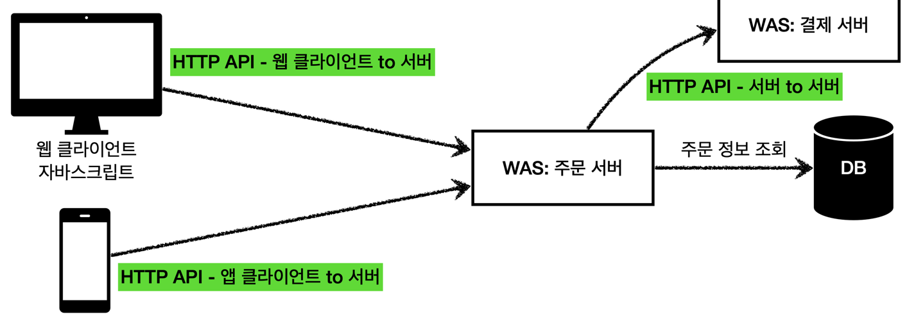

## 🧐 HTTP를 이용한 요청

### ☝️ 정적 리소스의 요청

고정된 HTML 파일, CSS, JS, 이미지, 영상 등, 요청이 오면 이미 생성된 리소스 파일을 응답으로 전달해주면 된다.

### ☝️ 동적인 HTML은?

WAS에서 동적으로 HTML을 생성 하여 이를 전달한다 

### ☝️ HTTP API

HTML과 달리 데이터를 전달해준다. 주로 JSON형식으로 전달하며, 웹 브라우저만이 아니라 다양한 시스템에서 호출 할 수 있다.
데이터만 주고 받으며, 화면이 필요하다면 클라이언 별도로 처리하게 된다.

앱 클라이언트, 웹 클라이언트(React, Vue,js), 웹 브라우저(Javascript), 서버 - 서버 에서 모두 사용할 수 있다.

## 🧐 SSR(ServerSideRendering) 과 CSR(ClientSideRendering)
### ☝️ SSR 
서버에서 요청을 받아 동적으로 HTML을 생성, 즉 최종적인 HTML의 생성을 서버에서 담당하여, 웹 브라우저에 전달한다.
JSP, Thymeleaf 등을 이용하며, 위의 동적인 HTML의 요청과 같이 동작한다.

### ☝️ CSR

HTML의 결과를 자바스크립트를 사용해 웹 브라우저에서 동적으로 생성, 웹 환경을 마치 앱처럼 부분적으로 변경하는 것이 가능하다.
React, Vue,js 등이 사용된다.

HTML 파일을 서버에 요청하는 것 까지는 동일하다. 하지만 요청을 받은 서버에서는 아무것도 없는 빈 HTML 파일을 돌려주고,
이와 함께 자바스크립트 링크를 함께 내려준다.
클라이언트에서는 다시 자바스크립트를 요청하게 되고, 서버에서는 이에 대한 응답을 넘겨준다.
마지막으로 클라이언트는 HTTP API로 데이터를 요청하게 되고, 데이터를 받아 이전에 받았던 클라이언트 로직과 HTML 렌더링 코드를 이용하여
HTML을 생성한다.

## 🧐 SPA(Single Page Application)
한 페이지에 대한 용량이 점점 커져감에 따라 매 요청마다 새로운 페이지를 주고 받는 것은 많은 부담이 생기게 되었고,
요청마다 정적 리소스를 받아오고, 전체 페이지를 다시 랜더링 하기 떄문에 새로고침이 발생하여 사용성이 좋지 않다. 또한 변경하지 않을 부분도 함께 갱신하므로 비 효율적이다

이를 해결하기 위해 SPA가 등장했다. SPA는 웹 사이트의 전체 페이지를 하나의 페이지에 담아 동적으로 화면을 바꾸어 표현하는 방식을 말한다.

SPA는 필요한 모든 정적 리소스를 최초 접근 때 단 한번만 다운로드 한다.(초기 구동속도는 더 느릴 수 있다.) 이후 부터는 갱신에 필요한 데이터만을 JSON으로 전달받는다.
이로서 트래픽을 감소시킬 수 있고, 기존의 SSR과 비교할 때 배포가 간단하며, 네이티브 앱과 같은 사용자 경험을 제공할 수 있다.

기존의 방식에서는 요청을 보내면 페이지가 변경되었다면, SPA는 필요한 부분, 최소한의 요소만 변경이 일어난다. 처음에 로드된 자바스크립트를 통해
미리 브라우저에 올라간 템플릿을 교체하는 방식으로 동작한다.

SPA 에서는 기존의 전통적인 웹사이트 처럼 브라우징을 지원하기 위해  HTML 5의 History API를 이용한다.
- History.back(): 세션 기록이 뒷 페이지로 이동한다. (popState 이벤트 발생.)
- History.forward(): 세션 기록 바로 앞 페이지로 이동한다.
- History.go(): 특정 세션 기록으로 이동한다. -1(back), 1(forward) 등..
- History.pushState: 주어진 데이터를 세션 기록 스택에 넣는다. 자바스크립트 객체를 직렬화하여 저장한다.
  - ajax 요청은 브라우저의 주소창 URL을 변경하지 않음 -> SEO 이슈 발생.
  - pushState 메서드를 이용, 주소창을 변경하고 URL을 history entry로 추가, 서버로 요청을 하지는 않는다.
- History.replaceState(): 최근 세션 기록 스택을 주어진 데이터로 교체한다.

### ☝️ ajax 방식
ajax(Asynchronous Javascript ans XML)로, 자바스크립트를 이용해서 비동기적으로 서버와 브라우저가 데이터를 교환할 수 있는 통신 방식이다.
전통적인 방식을 사용한다면 응답 페이지를 새로 렌더링 하기 때문에 새로고침이 발생하지만, ajax를 이용한다면 필요한 데이터를 서버로부터 받아
동적으로 페이지를 변경할 수 있다.

그러나 ajax 요청은 주소창의 URL을 변경하지 않기 때문에 뒤로가기, 앞으로가기 등의 history 관리가 동작하지 않는다.
또한 URL이 변경되지 않아 새로고침을 하면 언제나 첫 페이지가 다시 로딩된다.

URL이 변경되지 않기 때문에 *SEO 이슈 또한 발생한다.
- 💡 SEO(Search Engine Optimization: 검색 엔진 최적화)

### ☝️ Hash 방식
ajax는 history 관리가 되지 않는다고 했다, 이를 보완한 방법이 해시 방식이다.
해시 방식에서는 URL fragment identifier의 고유 기능인 anchor를 사용한다.
웹 페이지를 탐색할 때 (#kemk13kr)와 같은 것을 본 적이 있을 것이다. 이것이 해시이다.

네비게이션이 클릭되면 URL에 특정 해시가 추가된다. 이는 서버에 어떤 요청도 하지 않고, 페이지의 갱신또한 이루어지지 않는다.
해시는 요청을 위한 것이 아닌 웹페이지 내부에서 이동을 위한 것이기 때문이다. 그러나 이 해시 만으로 URL이 변경되도록 할 수 있기 때문에
history 관리를 사용할 수 있게된다. hashchange 이벤트를 이용해 해시의 변경을 감지하고 해당 해시를 가지고 ajax의 요청을 수행한다.

하지만 해시 방식에도 SEO 이슈는 존재한다. 크롤러는 자바스크립트를 실행시키지 않기 떄문에 해시 방식으로 만들어진 사이트의 콘텐츠를 수집할 수 없다.
(구글에서는 이를 일반적인 URL로 변경하여 해결)

### ☝️ pjax 방식
pushState + ajax, SEO 이슈를 해결하기 위한 방식, History API의 pushState와 popstate 이벤트를 이용한다.

내비게이션 클릭 이벤트가 발생하면 preventDefault 메서드를 사용해 서버로의 요청을 방지한 후 href 속성 값을 사용하여 ajax 요청을 한다.
이 때, pushState 메서드를 이용하여 주소창의 URL을 변경한다.

서버에 요청을 보내지 않기 때문에 페이지의 갱신이 일어나지 않고, 페이지마다 고유 URL이 존재하므로 history 또한 관리된다.
아울러 해시를 사용하지 않기 때문에 SEO 이슈 또한 발생하지 않는다. 그러나 새로고침을 하게된다면 요청이 서버로 전달되게 된다.
(URL이 변경되기 때문에)

   
> - https://www.inflearn.com/course/%EC%8A%A4%ED%94%84%EB%A7%81-mvc-1
> - https://www.huskyhoochu.com/what-is-spa/
> - https://poiemaweb.com/js-spa