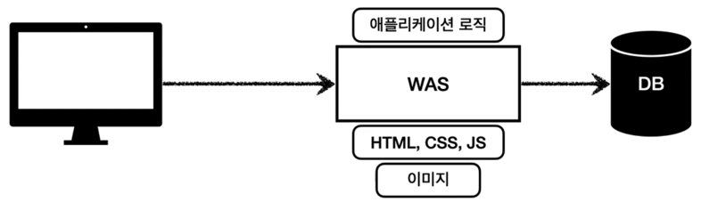
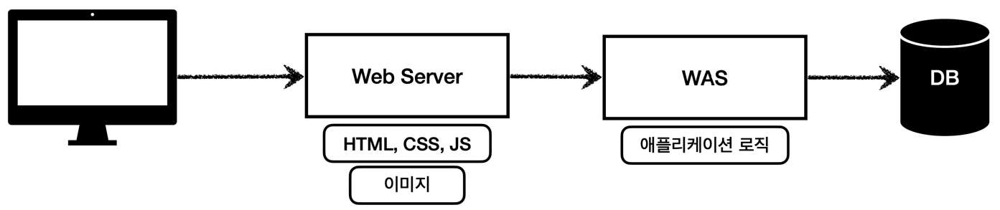
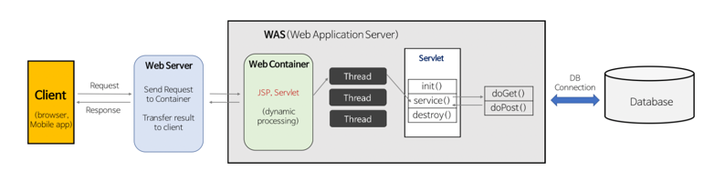

# 📌 Web Server와 Web Application Server(WAS)
****


웹은 HTTP 기반으로 통신한다. JSON, XML, 이미지, 서버간의 데이터 교환 등 모두 HTTP를 사용하여 주고 받는다.


### 🤔 웹 서버란?
개념적으로는 하드웨어와 소프트웨어로 구분된다 웹 서버가 설치되어 있는 컴퓨터, 또는 HTTP 기반으로 동작하며 정적 리소스를 제공하는 역할을 하는 컴퓨터 프로그램으로 정의된다.
정적 리소스란 HTML, CSS, JS, 이미지, 영상 등의 정적 파일을 의미한다. 주로 많이 사용되는 웹 서버로는 NGINX, APACHE 등이 있다.
클라이언트에게서 HTTP 요청이 들어오면 웹 서버는 응답으로 정적 파일을 돌려줄 수 있다.

### 🤔 WAS란?
Web Application Server로 마찬가지로 HTTP 기반으로 동작하며 웹 서버의 기능을 포함한다. 가장 큰 차이는 프로그램 코드를 실행하여
애플리케이션 로직을 수행할 수 있다는 것이다. 즉 동적인 리소스를 생성하고 반환할 수 있다. Servlet, JSP, Spring MVC 등이 모두 WAS 위에서 동작한다.
WAS 의 예로는 Tomcat, Jetty, Undertow 등이 있다.

### 🤔 웹 서버와 WAS의 차이가 뭔가요?
웹 서버는 정적 리소스 파일을, WAS는 애플리케이션 로직을 담당한다. 하지만 사실 둘의 경계가 모호한데 사실 웹 서버도 프로그램을 실행하는 기능을 포함하기도 하고
웹 애플리케이션 서버도 웹 서버의 기능을 제공한다(정적 리소스 제공), 하지만 WAS는 애플리케이션 코드를 실행하는데 더 특화되어 있다.
자바에서는 서블릿 컨테이너 기능을 제공하면 이를 WAS로 보지만, 서블릿 없이 자바코드를 싱행하는 서버 프레임 워크도 존재한다.

크게 생각 한다면 웹 서버는 정적 리소스를 제공, WAS는 애플리케이션 로직을 담당한다고 생각해도 좋다.

### 🤔 Servlet
웹 애플리케이션 서버를 직접 구현한다면?
```
- 서버 TCP/IP 연결 대기, 소켓 연결
- HTTP 요청 메시지 파싱
- HTTP 메서드, URL 확인
- Content-Type 확인
- 메시지 바디 내용 파싱
- 저장 프로세스 실행
- **비즈니스 로직 실행**
- 응답 메시지 생성
- TCP/IP 응답 전달, 소켓 종료.
```
여기서 실제 하고자하는 비즈니스 로직은 일부분이지만, 비즈니스 로직을 실행하기 위해 해야할 일은 너무나도 많다.
그래서 등장한 것이 서블릿, 위에서 비즈니스 로직을 제외한 모든 것을 서블릿에서 지원해준다. 이를 사용해서 개발자는 HTTP 스펙을 매우 간편하게
사용할 수 있게 된다. 서블릿에 정의된 URL의 패턴과 일치하는 URL이 호출되면 서블릿 코드가 실행된다. 
- HTTPServletRequest : 요청 정보를 편리하게 사용할 수 있게 해준다.
- HTTPServletResponse : 응답 정보를 편리하게 제공할 수 있게 해준다.

HTTP 요청이 들어오면 WAS는 Request와 Response 객체를 새로 만들어 서블릿 객체를 호출한다. 개발자는 두 객체를 사용하여 편리하게 요청 정보를 얻고
응답 정보를 입력한다. WAS는 Response 객체에 담겨있는 내용으로 HTTP 응답을 생성한다. 

#### ✏️ 서블릿 컨테이너?
서블릿의 생성, 초기화, 호출, 종료의 **생명주기를 관리** 한다. Tomcat 처럼 서블릿을 지원하는 WAS를 서블릿 컨테이너라고 한다.

요청이 들어올 때마다 서블릿을 생성하는 것은 비 효율적이기 때문에 최초 로딩 시점에 서블릿 객체를 미리 만들어두고 *싱글톤*으로 관리한다.
모든 클라이언트의 요청은 동일한 서블릿 객체 인스턴스에 접근하게 된다. 때문에 공유 자원의 사용을 주의해야한다.
서블릿 컨테이너는 동시 요청을 위한 멀티 쓰레드를 지원한다.

### 🤔 그렇다면 Sevlet은 누가 호출하지?
#### Thread
애플리케이션 코드를 실행하는 것은 스레드이다, 스레드가 없다면 자바 애플리케이션의 실행이 불가능하고, 동시 처리가 필요하다면 스레드를 추가로 생성해서
병렬처리가 가능하다.

그러나 요청마다 스레드를 생성한다면 스레드의 생성 비용이 매우 비싸기 때문에 그만큼 응답 속도가 늦어지게 된다. 또한 쓰레드의 생성에 제한을 두지 않으면
요청이 많이 들어왔을 때 CPU, 메모리의 한계로 서버에 장애가 생길 수 있게 된다.

이러한 단점을 해결하기 위해 Thread Pool을 사용한다. 스레드를 미리 정해둔 수 만큼 만들어두고, 거기서 꺼내어 사용한다. 이미 모두 사용중이라면
요청을 거절하거나 특정 수 만큼은 대기하도록 설정할 수 있다. 사용 후에는 종료하지 않고, 스레드 풀에 다시 반납한다.

Tomcat 에서는 쵀대 200개로 기본값이 설정되어 있고, 변경할 수 있다. WAS의 주요 튜닝 포인트는 최대 쓰레드의 수 인데,
값을 너무 낮게 설정 한다면 서버의 리소스는 여유롭겠지만 클라이언트의 응답은 지연되게 된다. 반대로 너무 높게 설정한다면 서버 리소스의
임계치가 초과될 수 있다. 서버의 성능을 고려한 적절한 튜닝이 필요하다.
- 적정 수? : 성능 테스트를 통해 예측할 수 있다. 최대한 실제 서비스와 유사하게 성능 테스트를 시도한다.
Apache ab, 제이미터, nGrinder등의 툴을 이용할 수 있다.
  
아까 위에서 말했듯 WAS 에서 멀티 쓰레드를 지원하기 때문에 개발자가 멀티 쓰레드 관련 코드는 신경쓰지 않아도 된다.
하지만, 멀티 쓰레드 환경임을 고려하여 싱글톤 객체(서블릿, 스프링 Bean)는 주의해서 사용해야 한다.

<br>

## 🌐 웹 시스템의 구성
***
### ☝️ WAS + DB로만 구성.
      

해당 모델에서는 WAS가 정적 리소스와 동적인 부분들 모두 제공한다. 하지만 이렇게 WAS가 너무 많은 역할을 담당하게 되면 서버에 부담이 생기게 되고
정적 리소스 때문에 애플리케이션 로직이 수행이 어려워진다. 또한 WAS에 장애가 생겼을 겨우 다른 서버가 없기 때문에 오류 페이지 조차 노출할 수 없게된다.


### ☝️ WebServer + WAS + DB
  

정적 리소스는 웹 서버가 처리하고, 애플리케이션 로직같은 동적인 처리가 필요하다면 WAS에 요청을 위임한다. WAS는 중요한 애플리케이션 로직에만
집중할 수 있게 되고, 정적 리소스와, 애플리케이션 로직이 분리되기 때문에 정적 리소스가 많이 사용된다면 웹 서버를, 애플리케이션 리소스가 많이 사용된다면
WAS를 수평적으로 증설할 수 있게된다.
또한 WAS에 장애가 생겨도 웹 서버가 있기 때문에 WAS가 동작하지 않는다면 웹 서버에서 오류 화면을 제공할 수 있다.

하지만 서버가 API만 제공하는 서버라면 굳이 웹 서버를 구축할 필요성이 없다.

    
동적인 컨텐츠를 제공해야 한다면 클라이언트의 요청을 웹 서버에서 받아 이를 WAS에게 위임한다.
WAS 에서는 Thread Pool 에서 서블릿에 대한 스레드를 생성하게 되고, HttpServletRequest와 HttpServletResponse 객체를 생성해 서블릿에게 전달한다.
스레드는 서블릿이 service() 메서드를 호출하고, service 메서드에서는 요청에 따라 doGet() 또는 doPost() 메서드를 호출한다.
두 메서드에서는 실행 결과로 발생한 동적 컨텐츠를 Response 객체에 담아 WAS에 전달하게 되고, WAS 에서는 이를 HttpResonse 형태로 변경하여 웹 서버로 전달한다.


 


<br><br><br>
> - https://www.inflearn.com/course/%EC%8A%A4%ED%94%84%EB%A7%81-mvc-1
> - https://gyoogle.dev/blog/web-knowledge/Web%20Server%EC%99%80%20WAS%EC%9D%98%20%EC%B0%A8%EC%9D%B4.html


